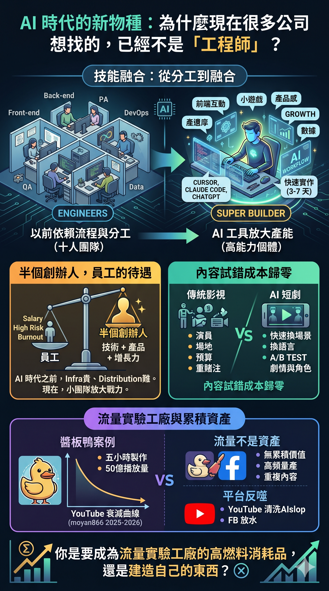

title: "AI 時代的新物種：為什麼現在很多公司想找的，已經不是「工程師」？" date: 2026-05-23 lang: zh-Hant section: sober-record topic: ai-labour-market tags: zh: - AI 內容工業化 - 超級個體 - 流量素材與作品 - AI 短劇 - 人才結構轉變 en: - ai-content-industrialization - super-individual - traffic-content-vs-craft - ai-short-drama - talent-structure-shift keywords:

- 醬板鴨
- 雪山救狐狸
- AI 短劇
- MVP
- 流量實驗工廠 summary: "從一篇招聘文、一部 AI 短劇、到 50 億播放量的醬板鴨，拆解 AI 時代內容工業化的真正結構。" status: draft reading_time: 10

---

# AI 時代的新物種：為什麼現在很多公司想找的，已經不是「工程師」？

最近看到一篇很有代表性的招聘文。

表面上在找「C 端 AI 產品技術負責人」，但如果你認真拆解，會發現它真正想找的，其實是一種 AI 時代的新物種——一個能被 AI 放大產能的超級 Builder。

這類職位開始同時要求你懂前端互動、懂小遊戲、懂產品感、懂 growth、懂數據、懂 AI workflow，能自己 deploy、能自己做 MVP、能自己做 AB test，還要能在 3 到 7 天內把東西做出來。

最有趣的是，它甚至直接寫明：管理經驗不重要，重點是實作能力，每天 12 小時是基本。

這其實非常能反映 AI 時代正在發生的結構轉變。

---

## 從分工到融合：AI 正在壓縮「團隊」的定義

以前的大型網路公司，依賴的是分工、流程、PRD、多部門協作、架構穩定性。十個人的前端團隊、五個人的後端、PM、QA、DevOps、data team——每個環節各司其職。

但 AI tooling 出現後，很多新創開始相信另一件事：一個 AI-native 的高能力個體，已經能頂半支團隊。

Cursor、Claude Code、Copilot、ChatGPT，這些工具被直接寫入 JD。以前識 AI tooling 是加分，現在不識 AI-native workflow 已經開始被視為落後。

於是市場開始出現兩極化。一邊是大量標準化 execution 工作被壓縮，另一邊則是能把 AI 工具、產品感、技術力、增長能力整合在一起的人，價值暴漲。

這類人不再只是 engineer，更像 Builder、Product Engineer、AI-native Operator、Growth Technologist。

---

## 半個創辦人的能力，員工的待遇

問題也因此開始浮現。

當一個人已經同時具備技術能力、產品能力、增長能力、AI workflow 能力，他到底還算是「員工」，還是其實已經接近「半個創辦人」？

那篇招聘文想要的人，幾乎就是一個不掛名的共同創辦人。但你得到的是什麼？工資、少量股份（通常未必是真正核心的）、高風險、高 burnout、以及隨時可被替換的壓力。

所以一個很自然的問題會浮現：如果我已經有這種能力，為什麼不自己做？

這個問題在 AI 時代之前，答案很明確——因為 infra 貴、distribution 難、開發成本高、團隊成本高。但現在，AI 將「小團隊戰力」放大了很多。1 到 3 人的團隊，搭配 AI-native workflow 和全球 distribution，已經可以做到以前 20 人才能做的事。

頂級 builder 開始第一次真正面對一個新問題：我還需要成為別人的 execution engine 嗎？

---

## 但自己做的另一面：流量實驗工廠

現實不只有一面。

很多這類公司，本質上未必是在 build 長期產品，而是在 build DAU、retention、ROI、流量模型、廣告變現。所以你會看到高工時、高強度、極高速試錯、極短週期產品。本質更像「流量實驗工廠」。

這不是說它一定不好。中國近十年很多成功公司，本來就是從這種高壓高速環境跑出來的——字節、拼多多、米哈遊、小紅書，全部都出現過早期核心成員直接階級跳躍的案例。

但問題在於：當「3 到 7 天做出可測 MVP」成為核心指標，技術債可以接受、架構可以爛、code quality 次要、scalability 次要——唯一重要的是快、可投放、可測 CTR、可測 retention、可測 ROI。

這時候，技術已經不是在建造產品，而是變成流量實驗的武器。

---

## AI 短劇：內容工業化的極致案例

就在這個背景下，另一個現象正在同步發生。

最近有一篇談 AI 短劇的文章，裡面有一句話很值得注意：「AI 短劇正在慢慢縮短內容製作流程。」

很多人第一反應，會把 AI 短劇理解成「AI 幫你生成影片」。但真正重要的，其實不是「生成」，而是 AI 正在改變內容產業背後的整個生產邏輯。

過去影視內容最大的問題之一，是你很難低成本試錯。每一次測試都意味著演員、場景、拍攝、後期、團隊、檔期、預算。傳統影視世界的本質是高成本、低頻率、重賭注。

但 AI 開始讓另一種模式出現：快速生成角色、快速換場景、快速換語言、快速換文化設定、快速測試不同市場版本、快速 AB test 劇情與角色。

內容開始從「作品生產」慢慢轉向「內容實驗」。

這件事非常像 TikTok、小遊戲、Playable Ads、網路廣告投放背後的核心邏輯：不是先花三年做一個作品，而是先測試哪個角色有人看、哪種情緒有 retention、哪種關係最容易追更、哪個市場轉化高、哪種文化設定容易形成 IP。

AI 真正降低的，可能不是製作成本，而是內容試錯成本。

---

## 醬板鴨：五小時、50 億播放、然後呢？

如果你覺得以上還太抽象，有一個案例可以把所有東西串起來。

2026 年 3 月，一部 AI 短片在抖音爆紅。故事很簡單：樵夫在雪山救了一隻狐狸，留下一隻醬板鴨。多年後一名女子上門問：「你可曾在雪山上救過一隻狐狸？」樵夫以為是狐狸報恩，結果對方說：「我不是狐狸，我是那隻醬板鴨，我是來復仇的。」

荒謬反轉加上邵氏武俠風的 AI 畫面，一個月內「#醬板鴨」標籤累計播放量突破 50 億次。蔡依林、周杰倫、阿信都跟風，連政府反詐單位都拿來做宣傳片。

但真正值得注意的是幕後：原創者是貴州一家醬板鴨企業的新媒體運營主管，用極夢、小雲雀等 AI 影片工具，每部短片大概耗時 5 小時。目的就是為了推銷醬板鴨。

五小時製作成本，50 億播放量回報。

這是「內容試錯成本歸零」最極端的成功案例。

---

## 搬運頻道的衰減曲線：流量不是資產

但故事還有下半場。

YouTube 上有一個頻道叫 moyan866，從 2025 年 6 月開始，大量搬運抖音上的醬板鴨系列和相關 AI 短片到 YouTube。台灣多家主流媒體在報導雪山救狐狸時，截圖來源都是這個頻道。

到目前為止，這個頻道有 2,419 部影片、6,600 萬總觀看次數、3.37 萬訂閱者。數字看起來很嚇人。

但如果你看現在的單片數據：每支影片觀看次數已經跌到 1,000 多次。

這條衰減曲線完美說明了一件事：流量不是資產。

醬板鴨爆紅的時候，搬運頻道靠熱度吃到巨量流量。但一旦熱潮過了，頻道本身沒有任何不可替代性——沒有原創觀點、沒有人格辨識度、沒有讀者信任。下一波熱潮來的時候，觀眾不會因為「上次在你這裡看過醬板鴨」而回來，他們會去找下一個搬得最快的人。

2,419 部片、6,600 萬播放量。對頻道主來說，這些數字幾乎沒有累積價值。

---

## 平台反噬：連分發渠道都在關門

但 moyan866 的衰減，可能不只是「熱潮過了」這麼簡單。

2026 年 1 月，YouTube 進行了一次大規模的 AI 內容清洗行動，一口氣終結了 16 個頻道，合計 3,500 萬訂閱者、47 億次觀看、估計年廣告收入約 1,000 萬美元。全部一夜歸零。

YouTube 的政策表面上不是針對「使用 AI」本身，而是針對低品質、重複性、誤導性的內容。但實際執行的方向很明確：平台的 AI 偵測系統現在可以識別大量生成影片背後的模式——那些靠 AI 腳本、合成語音、複製貼上格式量產的頻道，尤其是每支影片看起來、聽起來、動起來都一樣的，首當其衝。

而且從 2026 年開始，任何使用合成語音、deepfake 人臉、或完全 AI 生成畫面的影片，都必須在 YouTube Studio 標記為「altered or synthetic content」。未標記的 AI 內容，會被直接視為 reused-content 違規。

moyan866 幾乎踩中了所有雷區：大量搬運、AI 生成內容、高頻量產、格式高度重複。YouTube 現在不是看單支影片，而是用整個頻道的模式來評估。這種頻道幾乎就是演算法壓制的教科書案例。

這帶出了一個比「觀眾會離開」更嚴重的問題：平台本身也在反噬這種模式。

流量素材不只是沒有累積價值——它可能連原來的分發渠道都會慢慢被關掉。你以為你在用平台賺流量，但平台也在用演算法定義什麼內容值得被看見。當你的內容被歸類為「inauthentic」，你甚至連被淘汰的資格都沒有，因為你根本不會被推送。

這對做長文深度內容的人來說，反而是一個結構性的好消息。因為平台正在把「快速量產、搬運、換皮」的空間壓縮掉。留下來的空間，會越來越偏向有原創觀點、有人格辨識度、有不可替代性的內容。

問題只是：這個過程需要多久，以及在這段過渡期裡，深度內容創作者能不能撐得住。

---

## 但 Facebook 還在放水

如果你只看 YouTube，會覺得平台都在收緊。但打開 Facebook Shorts 或 Reels，你馬上會發現：AI 生成的短影片仍然滿天飛。

這不是錯覺。兩個平台對 AI 內容的態度，目前處於完全不同的階段。

Meta 在 2026 年 3 月確實更新了「原創內容指南」，聲稱要獎勵原創、打壓搬運和低質量內容。但同一時間，Meta 自己推出了一個叫「Vibes」的獨立 App，專門讓使用者瀏覽和創作 AI 生成影片。用戶在 Reddit 和其他平台上大量抱怨 Reels 動態牆被「AI slop」灌滿，Meta 的回應是給用戶一個「不感興趣」按鈕——把過濾的責任推給觀眾，而不是從源頭管控。

背後的邏輯其實不難理解。Meta 的核心商業模式是廣告，而廣告需要的是用戶停留時間和內容供給量。AI 生成內容恰好是最低成本的內容供給，只要它還能產生停留時間，Meta 就沒有動力真正壓制它。YouTube 能下重手，是因為它的商業模式更依賴創作者生態的長期健康；Meta 的 Reels 更像是一個注意力吸取機器，它不太在乎內容本身是不是「好」，只在乎你有沒有繼續滑。

所以現實是：同樣的 AI 搬運內容，在 YouTube 可能被演算法壓制甚至終結，在 Facebook 卻仍然能拿到推送。這代表什麼？

代表你在 Facebook 上做深度內容，面對的競爭環境比 YouTube 更惡劣。不是因為對手更強，而是因為平台本身還沒有開始替你過濾噪音。你的長文分析要跟 AI 生成的醬板鴨翻版、三秒反轉短片、以及各種換皮搬運搶同一批注意力——而演算法目前不會幫你。

這也解釋了一個很多深度內容創作者的共同感受：明明內容質量沒有下降，但觸及越來越難。不是你變差了，是你被丟進了一個越來越吵的房間，而房間的管理員暫時還沒打算把噪音源趕走。

---

## 流量素材與作品：兩種完全不同的世界觀

醬板鴨的成功是「事件」，不是「資產」。

原創者接下來面對的問題是：下一條片要怎麼再爆？他已經被綁死在不斷重複同一個反轉公式上，觀眾的閾值只會越來越高，每一輪的生命週期只會越來越短。所以他宣布要做「醬板鴨宇宙」——但這其實是在用 IP 延伸的包裝，掩蓋一個結構性的問題：這個公式本身沒有深度可以挖掘。

這裡面藏著 AI 內容時代最根本的分野。

當內容變得可以快速生成、快速投放、快速測試、快速淘汰，內容產業也開始全面平台化、廣告化、數據化。最後大家追逐的，未必是「作品」，而是 retention、watch time、追更率、CPM、ROI。

這其實和短影音平台的現狀已經幾乎一樣。

所以 AI 短劇真正的問題，最後可能不是「AI 能不能生成畫面」，而是：當內容工業化的速度越來越高，人類還會不會願意慢慢創作？

以及更根本的：未來留下來的，到底是作品，還是流量素材？

---

## AI 時代最根本的人才結構變化

回到開頭那篇招聘文。

它其實透露了一個比「找人」更深的訊號：AI 時代正在重新定義「一個人」能做多少事。

以前有能力的人都需要公司，因為 infra 貴、distribution 難、開發成本高。但現在 AI 將小團隊的戰力放大了很多倍。頂級 builder 開始不再像以前那樣需要「加入別人的 empire」。

未來被淘汰的，也許不只是低技術工作，而是那些只能在舊式分工體系下運作、卻無法獨立創造閉環價值的人。

而那些能獨立創造閉環價值的人，面對的選擇也變了：你要成為流量實驗工廠裡的高燃料消耗品，還是用同樣的能力，慢慢建造屬於自己的東西？

這兩種選擇沒有絕對的對錯。高速流量環境確實能給你極限市場訓練、AI-native product 經驗、以及接觸最前線玩法的機會。但它的本質不是「慢慢打造作品」，而是「高速驗證流量模型」。

兩種世界觀。

而 AI 正在讓這兩種世界觀之間的距離，拉得比以往任何時候都大。

