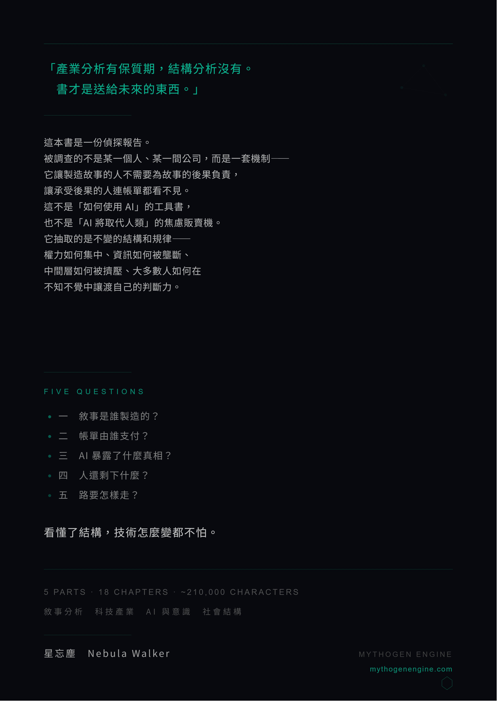
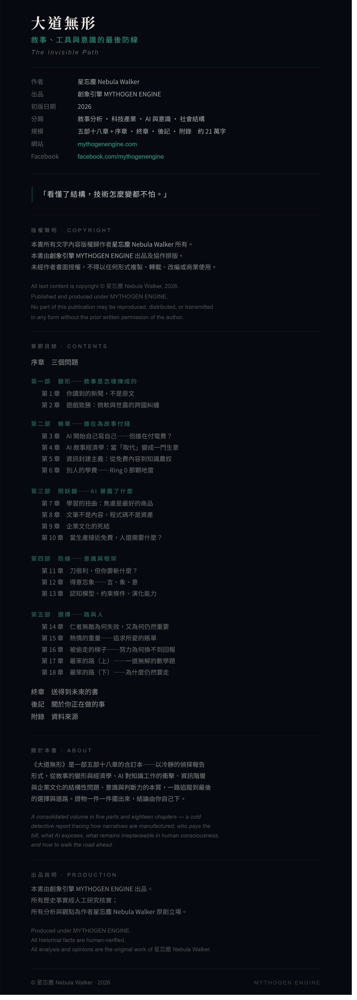

# 大道無形
## 敘事、工具與意識的最後防線

*The Invisible Path*

---

&nbsp;

**作者** 星忘塵 Nebula Walker

**初版日期** 2026 JUN

**分類** 敘事分析 · 科技產業 · AI 與意識 · 社會結構

**規模** 五部十八章 + 序章 · 終章 · 後記 · 附錄　約 21 萬字

**引擎** MYTHOGEN ENGINE

**網站** https://mythogenengine.com/
**Facebook** https://www.facebook.com/mythogenengine

&nbsp;

---

&nbsp;

> *「看懂了結構，技術怎麼變都不怕。」*

&nbsp;

---

## 版權聲明 · Copyright Notice

本書所有文字內容版權歸作者 **星忘塵 Nebula Walker** 所有。
本書由 **創象引擎 MYTHOGEN ENGINE** 出品及協作排版。
未經作者書面授權，不得以任何形式複製、轉載、改編或商業使用。

All text content in this book is copyright © **星忘塵 Nebula Walker**, 2026.
Published and produced under **MYTHOGEN ENGINE**.
No part of this publication may be reproduced, distributed, or transmitted
in any form or by any means without the prior written permission of the author.

&nbsp;

---

## 章節目錄 · Table of Contents

**序章　三個問題**

**第一部　變形——敘事是怎樣煉成的**

| # | 章節 | 核心命題 |
|---|------|---------|
| 1 | 你讀到的新聞，不是原文 | 一天的變形，示範敘事製造的最小單位 |
| 2 | 遊戲致勝：微軟與世嘉的跨國糾纏 | 25 年的因果鏈，真相比情緒更複雜 |

**第二部　帳單——誰在為故事付錢**

| # | 章節 | 核心命題 |
|---|------|---------|
| 3 | AI 開始自己寫自己——但誰在付電費？ | 交叉補貼的兩種燃料，都在收窄 |
| 4 | AI 敘事經濟學：當「取代」變成一門生意 | 敘事有半衰期，市場正在學會分辨 |
| 5 | 資訊封建主義：從免費內容到知識農奴 | 功能性合謀不需要會議記錄 |
| 6 | 別人的學費——Ring 0 那顆地雷 | 誰交了學費，誰拿了文憑，誰還在踩地雷 |

**第三部　照妖鏡——AI 暴露了什麼**

| # | 章節 | 核心命題 |
|---|------|---------|
| 7 | 學習的扭曲：焦慮是最好的商品 | 教育的扭曲不是 AI 造成的，AI 只是讓它無法再被忽視 |
| 8 | 文筆不是內容，程式碼不是資產 | 製作成本歸零後，你到底有沒有東西要表達？ |
| 9 | 企業文化的死結 | AI 可以加速建造，但加速不了共識 |
| 10 | 當生產接近免費，人還需要什麼？ | 「被理解的感覺」和「真正被理解」是兩回事 |

**第四部　防線——意識與框架**

| # | 章節 | 核心命題 |
|---|------|---------|
| 11 | 刀很利，但你要斬什麼？ | AI 協作寫作的本質是「意」驅動「言」 |
| 12 | 得意忘象——言、象、意 | AI 做得到言，模仿得了象，碰不到意 |
| 13 | 認知模型、約束條件、演化能力 | 大道無形，真正深的東西從來不在表面 |

**第五部　選擇——路與人**

| # | 章節 | 核心命題 |
|---|------|---------|
| 14 | 仁者無敵為何失效，又為何仍然重要 | 不是無敵，是有所選擇 |
| 15 | 熱情的重量——追求所愛的賬單 | 做了之後要付多少錢 |
| 16 | 被偷走的梯子——努力為何換不到回報 | 為什麼所有東西都變貴了 |
| 17 | 最笨的路（上）——一道無解的數學題 | 數學說這條路不通 |
| 18 | 最笨的路（下）——為什麼仍然要走 | 不是因為有信心，是因為還有東西想寫 |

**終章　送得到未來的書**

**後記　關於你正在做的事**

**附錄　資料來源**

&nbsp;

---

## 關於本書 · About This Book

**《大道無形》** 是一部五部十八章的合訂本——以冷靜的偵探報告形式，從敘事的變形與經濟學、AI 對知識工作的衝擊、資訊階層與企業文化的結構性問題、意識與判斷力的本質，一路追蹤到最後的選擇與道路。

全書回答五個問題：敘事是誰製造的？帳單由誰支付？AI 暴露了什麼真相？人還剩下什麼？路要怎樣走？

證物一件一件擺出來，分析逐層展開，結論由你自己下。

*A consolidated volume in five parts and eighteen chapters — a cold detective report tracing how narratives are manufactured, who pays the bill, what AI exposes, what remains irreplaceable in human consciousness, and how to walk the road ahead.*

&nbsp;

---

## 出品說明 · Production Note

本書由 **創象引擎 MYTHOGEN ENGINE** 出品。
所有歷史事實經人工研究核實；所有分析與觀點為作者 **星忘塵 Nebula Walker** 原創立場。

*Produced under* ***MYTHOGEN ENGINE***.
*All historical facts are human-verified.*
*All analysis and opinions are the original work of* ***星忘塵 Nebula Walker***.

&nbsp;

---

*© 星忘塵 Nebula Walker · 2026*
*出品：創象引擎 MYTHOGEN ENGINE*
