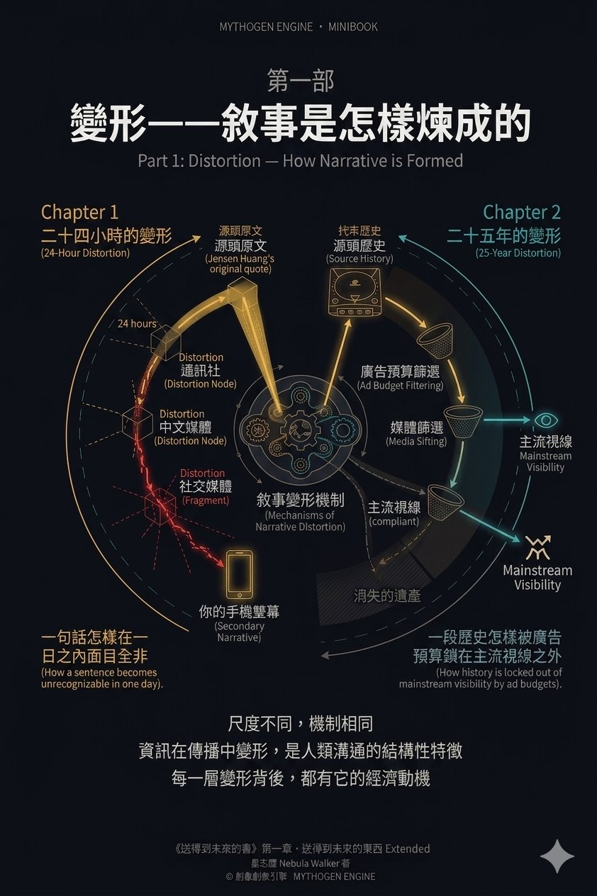
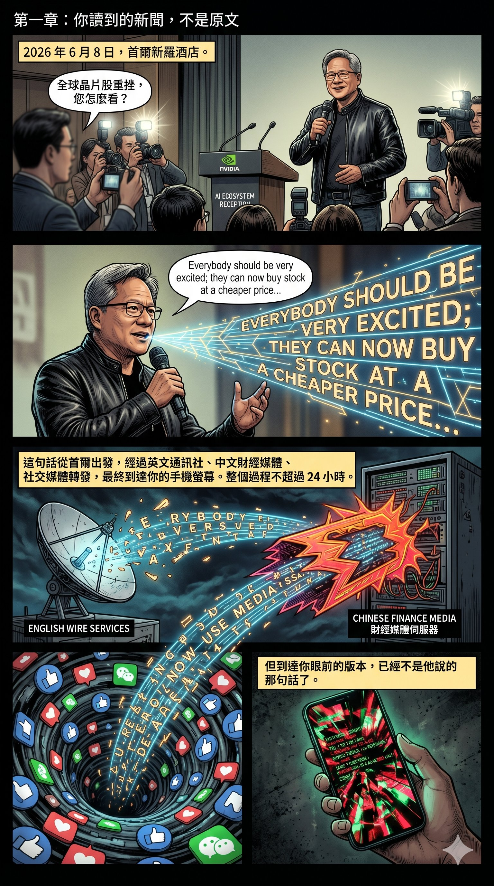
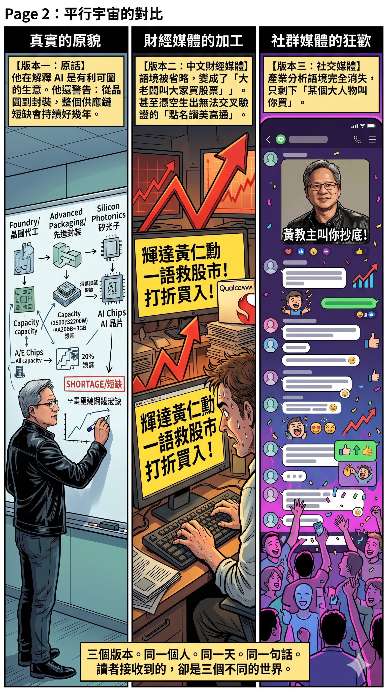
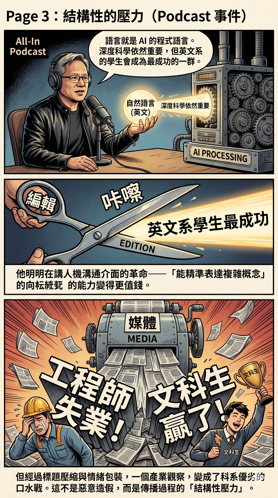
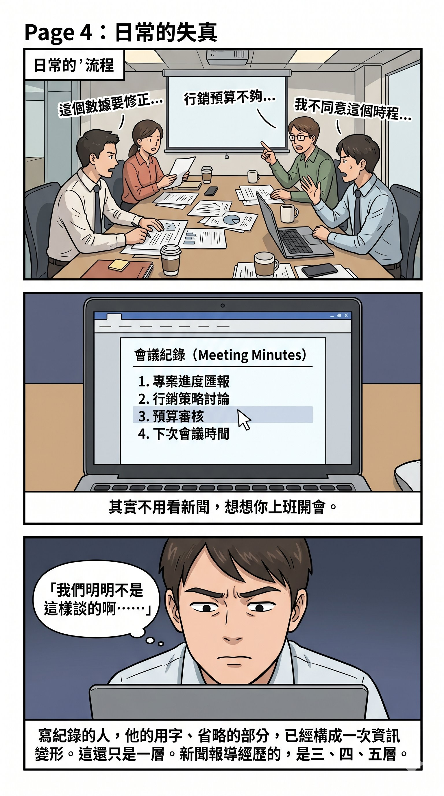
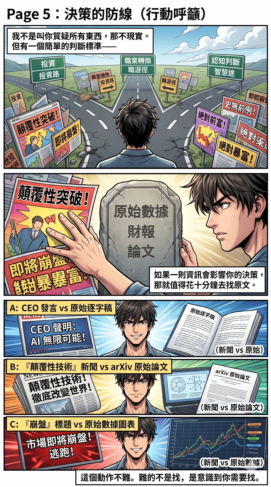

# 第一部　變形——敘事是怎樣煉成的

資訊在傳播中變形，不是哪個年代的特殊現象，是人類溝通的結構性特徵。但「結構性」不等於「無辜」——每一層變形背後，都有它的經濟動機。

這一部用兩個尺度示範同一件事。第一章是二十四小時的變形：一句話怎樣在一日之內面目全非。第二章是二十五年的變形：一段歷史怎樣被廣告預算鎖在主流視線之外。

尺度不同，機制相同。

---

# 第一章　你讀到的新聞，不是原文

## 一個簡單的實驗

2026 年 6 月 8 日，NVIDIA 執行長黃仁勳在首爾新羅酒店出席「Korea AI Ecosystem Reception」後接受記者提問。有記者問到全球晶片股重挫，他回應了一句話。

這句話從首爾出發，經過英文通訊社、中文財經媒體、社交媒體轉發，最終到達你的手機螢幕。整個過程不超過 24 小時。

但到達你眼前的版本，已經不是他說的那句話了。

## 同一句話的三個版本

**黃仁勳的原話**（Reuters 現場報導）：

> "Everybody should be very excited; they can now buy stock at a cheaper price, and it's absolutely true that the future of AI is very bright."

這是記者主動追問全球晶片股暴跌後的回應。同一場合，他還說了一段很少被引用的話：AI 是有利可圖的生意，所有雲端公司都在增加 AI 投資，而市場「還不理解這一點」。他的意思是從產業面解釋為什麼他對 AI 基建需求有信心。

同一個週末，他還告訴在場媒體：記憶體晶片短缺不會很快結束，整個供應鏈——從晶圓到封裝到矽光子——全部處於短缺狀態，這個狀況會持續好幾年。

**中文財經媒體的版本**：

「輝達黃仁勳一語救股市」——標題直接把一句記者會回應包裝成「救市」行為。內文把「you can buy at a cheaper price」翻譯為「打折買入」，省略了記者提問的語境，讀起來像是黃仁勳主動開記者會叫大家買股票。關於供應鏈短缺的警告？完全沒有提及。

報導還引述黃仁勳點名讚美高通、叫人「買他們的股票」。但這段引述在 Reuters、Bloomberg、Seoul Economic Daily、The Standard 等多家英文媒體的現場報導中都找不到。無法交叉驗證的引述，就是一個紅旗。

**社交媒體的版本**：

到了 Facebook 和討論區，訊息再度壓縮：「黃仁勳叫大家趁跌買入」「黃仁勳幫高通賣股票」。到這一層，原文的產業分析語境已經完全消失，剩下的只有「某個大人物叫你買」。

三個版本。同一個人。同一天。同一句話。但讀者接收到的訊息，完全不同。

## 這不是個別事件

今年三月，黃仁勳上 All-In Podcast，主持人問他年輕人該學什麼。他的原話是：「我依然相信深度的科學、深度的數學很重要。但語言技能——語言就是 AI 的程式語言，是終極的程式。」然後他補了一句：「結果可能是，英文系的學生會成為最成功的一群。」

中文媒體的標題？「文科生贏了」「工程師要失業」。

他明明在講介面革命——人機溝通的方式從程式碼變成了自然語言，所以「能用語言精準表達複雜概念」的能力變得更值錢。他同一段話裡還強調「深度科學、深度數學依然重要」。但經過標題壓縮和情緒包裝，一個關於能力結構重組的產業觀察，變成了科系優劣的口水戰。

這種變形不是惡意造假。大部分情況下，它來自傳播過程本身的結構性壓力：字數限制要求簡化，標題需要情緒張力，翻譯過程會丟失語境，編輯取角會強化某個面向而弱化另一個。每一層都只偏差一點點，但經過三四層之後，終點和起點之間的距離已經大到足以改變你的判斷。

其實你不需要去到媒體的層面才看到這個現象。上班開會，之後有人寫了一份會議紀錄——你有沒有試過讀完之後覺得「我們明明不是這樣談的」？同一場會議，寫紀錄的人聽到的重點和你不同，他的用字、他選擇記錄的部分和省略的部分，已經構成了一次資訊變形。而這只是一層。新聞報導經歷的是三層、四層、五層。

## 不是叫你質疑所有東西

我不是說所有新聞都是假的，也不是叫你對每一則報導都去做全套考證。那不現實，也沒必要。

但有一個很簡單的判斷標準：**如果一則資訊會影響你的決策——不管是投資決策、職業判斷、還是你對某件事的基本理解——那就值得花十分鐘去找一下原文。**

一個 CEO 被報導說了某句話，而你打算根據這句話調整投資策略——去找他的原話，看看語境是什麼。

一個新技術被報導為「顛覆性突破」，而你打算因此轉換職業方向——去看看原始論文或產品發佈，確認它實際上做到了什麼。

一個產業趨勢被描述為「即將崩盤」或「永遠上漲」——去找數據源頭，看看那些數字的定義和取樣範圍是什麼。

這個動作不難。大部分重要的原始資訊——財報、記者會逐字稿、公司公告、學術論文——現在都可以在網上直接找到。難的不是找，是意識到你需要找。

## 包括我的版本

最後要講清楚一件事：以上我對黃仁勳首爾之行的分析，本身也是一個二手版本。我根據 Reuters、Bloomberg、Seoul Economic Daily 等來源做了交叉比對，但我仍然不在現場，仍然是在處理經過篩選的素材。

所以即使是我講的版本，你都不需要照單全收。

重要的是這個習慣本身：當一件事對你來說夠重要，就回到源頭看一看。

不是因為媒體在騙你。是因為每一層傳播都會改變形狀。而你最終做決定的那個人是你自己。

---

_一句話的變形需要二十四小時。一段歷史的變形，可以維持二十五年——只要有人持續為「正確」的版本付廣告費。下面這段歷史，主流遊戲媒體二十五年來沒有完整講過。_