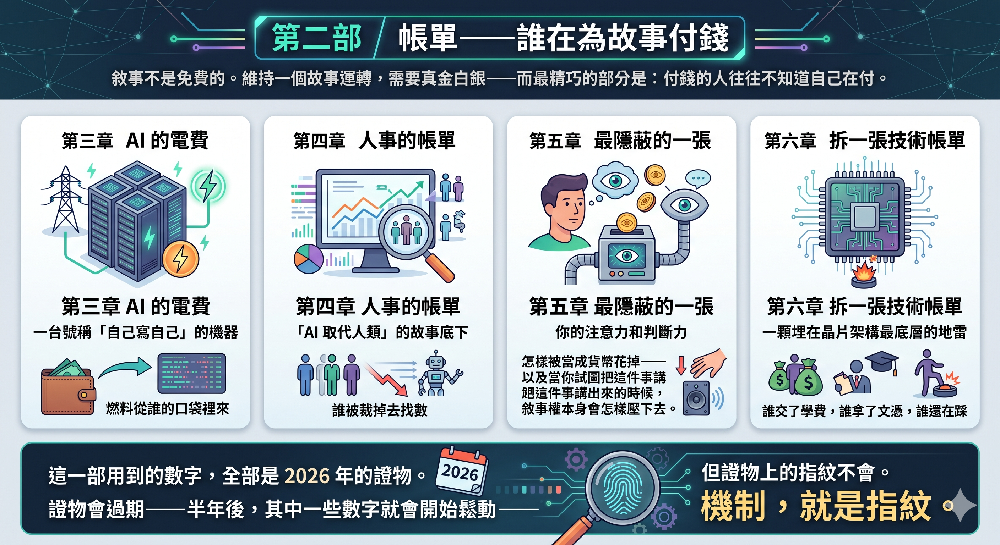
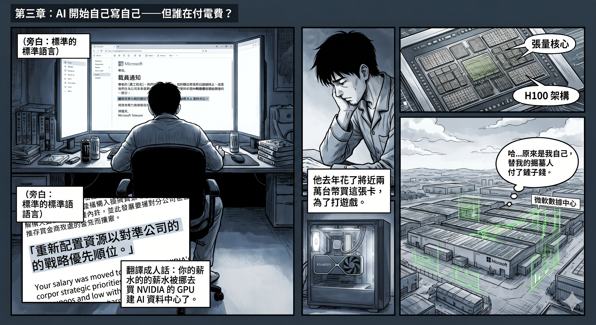
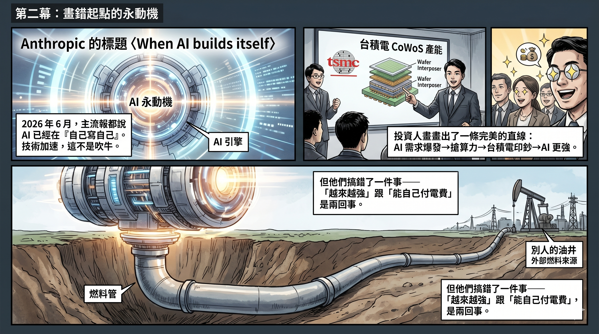
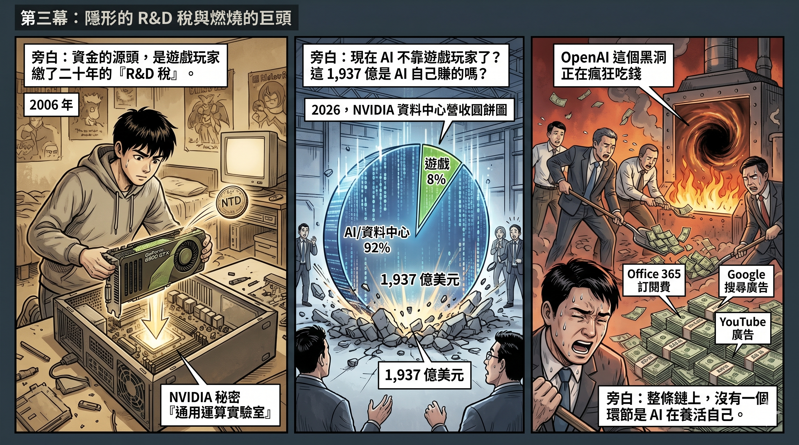
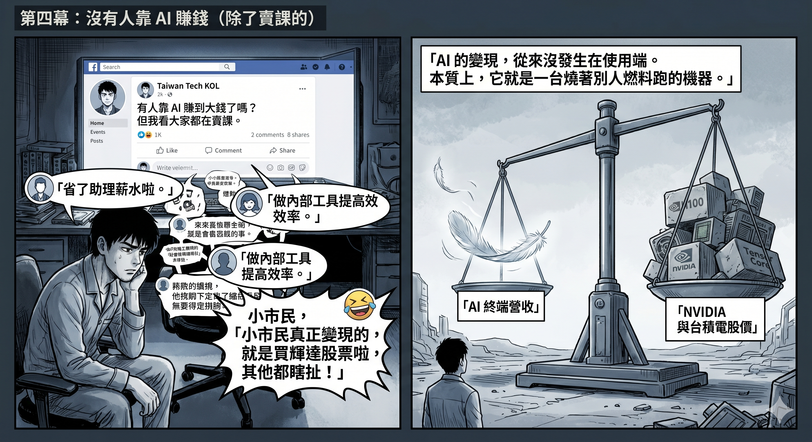
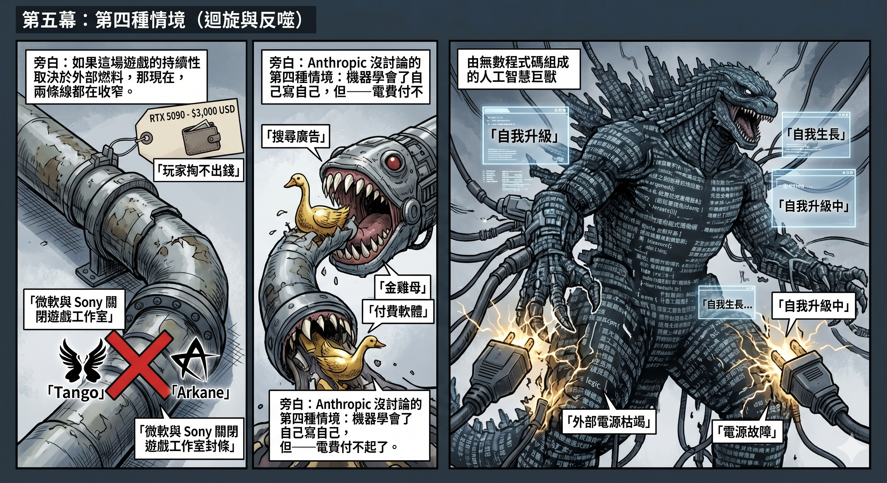
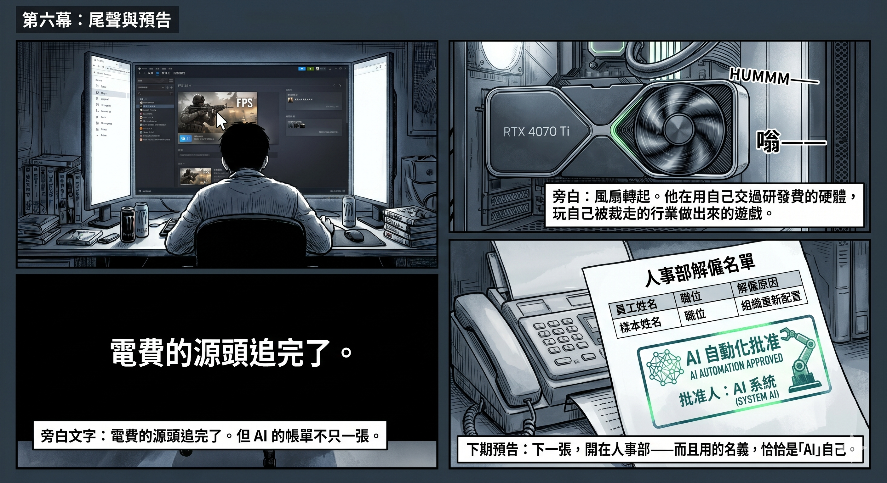

# 第二部　帳單——誰在為故事付錢

敘事不是免費的。維持一個故事運轉，需要真金白銀——而最精巧的部分是：付錢的人往往不知道自己在付。

這一部追四張帳單。第三章追 AI 的電費：一台號稱「自己寫自己」的機器，燃料從誰的口袋裡來。第四章追人事的帳單：「AI 取代人類」的故事底下，誰被裁掉去找數。第五章追最隱蔽的一張：你的注意力和判斷力，怎樣被當成貨幣花掉——以及當你試圖把這件事講出來的時候，敘事權本身會怎樣壓下去。第六章拆一張技術帳單：一顆埋在晶片架構最底層的地雷，誰交了學費，誰拿了文憑，誰還在踩。

這一部用到的數字，全部是 2026 年的證物。證物會過期——半年後，其中一些數字就會開始鬆動——但證物上的指紋不會。機制，就是指紋。

---

# 第三章　AI 開始自己寫自己——但誰在付電費？

2026 年春天，一個二十六歲的遊戲工程師被裁了。

他待的工作室是微軟旗下的，做第一人稱射擊遊戲。裁員信的措辭很標準：「重新配置資源以對準公司的戰略優先順位。」翻譯成人話：你的薪水被挪去買 NVIDIA 的 GPU 建 AI 資料中心了。

他回到家，打開 Steam，看了一眼自己的 PC。機箱裡插著一張 RTX 4070 Ti——去年花了將近兩萬台幣買的。他知道這張卡裡面有 Tensor Core，是 NVIDIA 為 AI 運算設計的硬體。他用不到。他買這張卡是為了玩遊戲。

但他付的那筆錢裡面，有一部分替 NVIDIA 分攤了 AI 運算硬體的研發成本。而 NVIDIA 用那筆研發成果做出來的 H100，賣給了微軟。微軟用 H100 建了 AI 資料中心。然後微軟裁掉了他，因為 AI 資料中心比他的工作室更「戰略優先」。

**他替自己的掘墓人付了研發費。**

這不是一個悲情故事。這是一個因果鏈。而這條因果鏈，正是今天所有主流 AI 報導都畫錯的那一條。

---

## 一條畫錯起點的直線

2026 年 6 月，Anthropic 發了一篇文章，標題叫〈When AI builds itself〉。數字很嚇人：截至五月，Anthropic 合併進產品的程式碼超過八成出自 Claude 之手；同一個工程師的季度產出是 2024 年的八倍；AI 能可靠完成的任務長度，每四個月翻倍一次。

這些數字不是吹牛。AI 確實在自己寫自己。即使有人類介入審查和方向設定，AI 的技術能力邊界正在以前所未有的速度擴張——這是事實，否認它只會讓你喪失判斷力。

台灣的科技圈很興奮。有人寫了分析，結論指向台灣：如果 AI 真的進入遞迴式自我改進，算力就是唯一的瓶頸，而算力的瓶頸是台積電的 CoWoS——台灣手上的籌碼會被放大。

這個判斷本身沒有問題。但它和所有主流報導一樣，在一個地方做了跳躍——**把技術能力的加速，等同於商業循環的閉合。**

AI 越來越強，沒有疑問。但「越來越強」和「能自己付電費」是兩件事。一台引擎可以越轉越快，但如果汽油是從別人的油箱裡來的，引擎轉速再高也不改變一個事實——它沒有自己的油井。

打開任何一篇 AI 投資報導，邏輯都是同一條直線：AI 需求爆發 → 企業搶算力 → NVIDIA 賣卡 → 台積電印鈔 → 更多算力 → AI 更強 → 需求更大。一個自我循環。一台永動機。技術在加速，所以資金鏈也會自動閉合。

如果這個「所以」成立，AI 的發展可以永續。投資者可以放心。

**這個「所以」是錯的。**

---

## 資金的真正源頭

2006 年，NVIDIA 發佈 GeForce 8800 GTX。遊戲玩家看到的是畫質飛躍。他們沒看到的是：那張卡的串流處理器被重新設計——不只能算像素，還能算任何東西。七個月後，NVIDIA 推出 CUDA Toolkit 1.0。沒有玩家注意到。但他們付的 599 美元裡，有一部分被拿去分攤了通用運算核心的研發成本。

在《遊戲致勝》第七章，我把這個機制叫做**「R&D 稅」**——遊戲玩家在不知情的情況下，替 NVIDIA 繳了十年的平行運算研發費用，直到 2012 年 AlexNet 用兩張遊戲顯示卡引爆了深度學習革命。

第八章追蹤了硬體端的另一條線：遊戲 GPU 的大 die 訂單逼台積電把大 die 良率推到極限，良率成熟後同一條產線轉去生產 AI 晶片。主機 SoC 的長期訂單填充了淡季產能，提供穩定現金流投資下一代節點。

**CUDA 的軟體生態、台積電的大 die 製程、晶圓廠的產能利用率——全部是遊戲玩家的錢在前面鋪路，AI 在後面搬進去住的。**

有人會說：那是歷史了。2026 年的 NVIDIA，資料中心營收 1,937 億美元，遊戲只剩 160 億，佔比不到百分之八。AI 早就不需要遊戲了。

真的嗎？那 1,937 億美元是 AI 自己賺的嗎？

---

## AI 至今沒有養活自己

追蹤那 1,937 億美元的去向。NVIDIA 資料中心的客戶是誰？微軟、Google、Meta、Amazon、以及排在它們後面的科技公司和主權基金。

它們的錢從哪裡來？

2026 年，OpenAI 預計虧損 140 億美元，營收約 130 億美元——**每賺一塊錢，要花超過兩塊。** 累計虧損預計在達到盈利之前膨脹到 440 億美元。它買 GPU 的錢，主要來自微軟的投資和 Azure 的算力額度。

微軟呢？2026 年的資本支出預計達到 1,900 億美元。這筆錢不是 AI 產品賺回來的——是 Office 365 的訂閱費、Windows 的授權費、LinkedIn 的廣告收入在替 AI 付帳。

Google 呢？2025 年資本支出從 290 億跳到 750 億。錢從哪來？搜尋廣告。YouTube 廣告。Google Cloud 的企業訂閱。不是 Gemini 的利潤。

**整條鏈上沒有一個環節是 AI 在養活自己。**

這不只是報表上的數字。把視角從矽谷拉回台灣，打開任何一個科技社群的討論串，問一個最簡單的問題：**你身邊有誰真的靠 AI 賺到錢了？**

2026 年 6 月，台灣一個科技 KOL 在 Facebook 丟了一句話：「至今為止我看過真的靠 AI 變現的 90% 都是靠賣課程。」底下幾十則留言，幾乎是同一個答案的變奏——有人說省了兩個助理的薪水，有人說提高了後勤效率，有人說做了內部工具讓同事不用一直問問題。省時間、降成本、提高效率。但被追問「這算變現嗎？」的時候，連發文的人自己都搖頭：「提高效率的範疇，我覺得不算變現。」

最毒的一則留言只有一句話：**「小市民真正靠 AI 變現的，就是買輝達、台積電股票，其他都是瞎扯。」**

這句話不自覺地說出了整件事的結構：AI 的「變現」不是發生在 AI 的使用端——不是終端用戶靠 AI 創造了新的營收模式。它發生在 AI 的**供應鏈端**——NVIDIA 和台積電的股價。而股價的基礎是什麼？是遊戲玩家二十年的 R&D 稅，加上科技巨頭用非 AI 業務利潤堆出來的資本支出。

宏觀面：OpenAI 每賺一塊錢花超過兩塊。微觀面：台灣科技圈自己都在問「除了賣課程，到底誰靠 AI 賺到錢了？」兩個尺度的證據，指向同一個結論。

資金源頭從遊戲玩家換成了 Office 訂閱和搜尋廣告，但本質沒變：**AI 是一台燒著別人燃料跑的機器。它從來不是一台永動機。**

---

## 因果錯了，判斷就全錯了

這才是問題的核心。不是「遊戲玩家好慘」——那是一個情感判斷。問題是：

**如果你把因果搞反，你對「這場 AI 軍備競賽還能持續多久」的判斷，就會建立在一個錯誤的前提上。**

主流敘事說：AI 需求 → 資金 → 發展 → 更多需求。循環閉合。可以永續。

真實的邏輯是：遊戲玩家的 R&D 稅（歷史存量）+ 科技巨頭的非 AI 業務利潤（當期補貼）→ AI 發展。**循環沒有閉合。**

如果循環沒有閉合，這場遊戲的持續性就取決於兩個外部條件——而這兩個條件，都在收窄。

**第一，遊戲端。** RTX 5090 建議售價從上一代的 1,599 美元漲到 1,999 美元，市價長期 3,000 美元以上。玩家的荷包不是無限的。與此同時，微軟和 Sony 正在拆毀遊戲這個壓力測試場——關掉 Tango Gameworks、Arkane Austin、Japan Studio、Bluepoint，把資源挪去 AI 和服務性遊戲。《遊戲致勝》第十章的結論：壓力測試場的業主，正在親手拆自己的地基。

**第二，交叉補貼端。** 如果 AI 的商業回報遲遲不來，而科技巨頭的非 AI 業務又開始被 AI 自己侵蝕——搜尋廣告被 AI 問答分流、Office 被免費 AI 工具替代——那交叉補貼的源頭也會枯竭。AI 侵蝕的不只是別人的業務，還包括正在養活它的那些業務。

兩條線同時在收窄。

---

## Anthropic 沒有討論的第四種情境

Anthropic 的文章描繪了三種未來：AI 改進減速、AI 穩定改進、AI 進入完整遞迴式自我改進。台灣這邊的分析指向算力籌碼。這些討論都有價值。

但它們都跳過了一個更基本的問題：**這台「自己寫自己」的機器，電費誰出？**

如果答案是「AI 自己出」，那遞迴式自我改進可以永續。三種情境都值得認真對待。

如果答案是「遊戲玩家的 R&D 稅加上科技巨頭的非 AI 業務利潤」——而這兩個來源都在收窄——那你要考慮一個 Anthropic 文章裡沒有討論的第四種情境：

**機器學會了自己寫自己。但電費付不起了。**

不是因為算力不夠。不是因為台積電的 CoWoS 不夠。是因為供養這台機器的那些外部燃料——遊戲玩家的消費力、Office 的訂閱費、搜尋廣告的收入——同時被這台機器自己掏空了。

因果鏈不是直線。它是一個迴旋。而迴旋的方向，正在反轉。

---

下次你讀到一篇 AI 投資報導說「AI 需求驅動算力增長」的時候，把「AI 需求」四個字劃掉。換成「遊戲玩家的 R&D 稅加上 Office 訂閱的利潤」。然後重新讀一遍那篇報導，看看它的結論還能不能成立。

大概率，不能。

至於那個二十六歲的工程師——他的 RTX 4070 Ti 還插在機箱裡。每次開機，風扇轉起來，他就在用自己交過研發費的硬體，玩自己被裁走的行業做出來的遊戲。

---

_電費的源頭追完了。但 AI 的帳單不只一張。下一張，開在人事部——而且用的名義，恰恰是「AI」自己。_