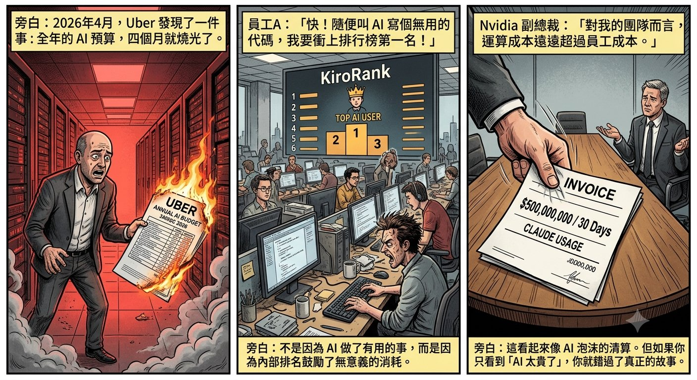
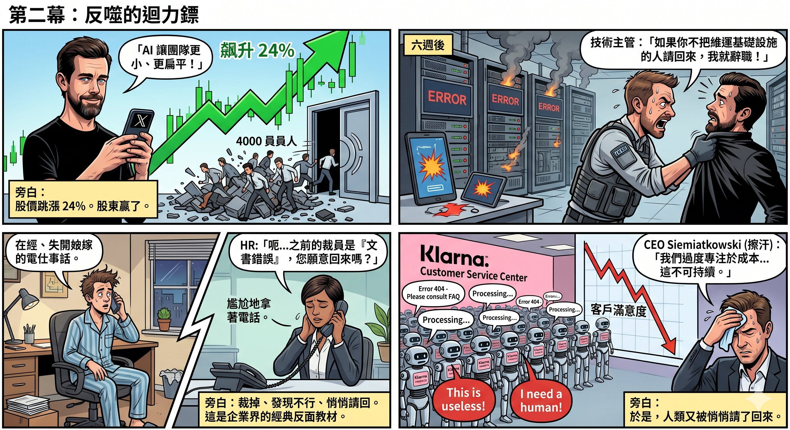
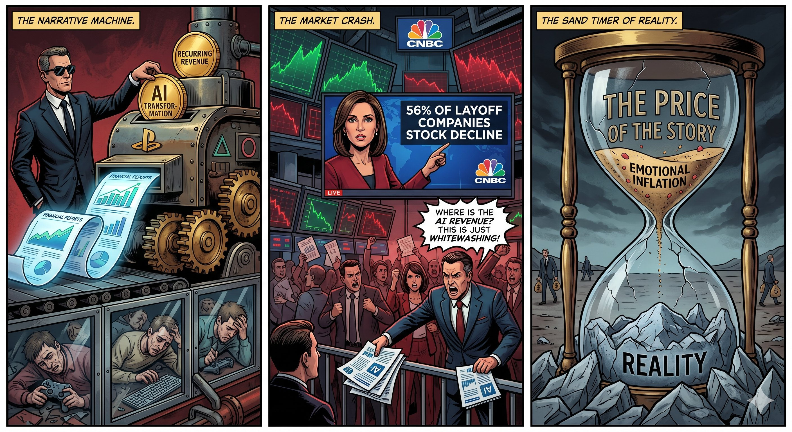

# 第四章　AI 敘事經濟學：當「取代」變成一門生意

## 帳單

2026 年 4 月，Uber 的 CTO 發現一件事：公司全年的 AI 預算，四個月就燒完了。

不是因為 AI 幫公司做了太多有用的事。而是因為公司內部設了一個排行榜，按工程師消耗的 AI 用量排名。用得越多，排名越高。至於用了之後產出了什麼——沒有人在量度。

Uber 的 COO Andrew Macdonald 後來在一個 podcast 裡坦承：他沒有辦法把 Claude Code 的使用量，跟實際交付給用戶的功能連上關係。「那條線還不存在。」他說。

差不多同一時間，Amazon 關掉了一個叫「KiroRank」的內部排行榜。原因一樣——員工為了衝高排名，把 AI 用在完全不需要 AI 的任務上，製造大量無意義的消耗。高級副總裁 Dave Treadwell 對員工說了一句很有意思的話：「請不要為了用 AI 而用 AI。」

Microsoft 則取消了數千名工程師的 Claude Code 授權，要求他們改用自家的 GitHub Copilot。諷刺的是，工程師們明顯更喜歡 Claude Code——但成本太高，加上微軟不可能讓自己的員工公開偏好競爭對手的產品。

還有一個更極端的案例。一位 AI 顧問向 Axios 透露，他的某個企業客戶因為忘記設定使用上限，單月在 Claude 上花了五億美元。五億，不是全年，是三十天。

而 Nvidia 的應用深度學習副總裁 Bryan Catanzaro 說得最直白：「對我的團隊而言，運算成本遠遠超過員工成本。」

這些故事在 2026 年 5 月集中爆發，看起來像是一場 AI 泡沫的清算。但如果你只看到「AI 太貴了」這個結論，你就錯過了真正的故事。

因為在同一段時間裡，裁員從來沒有停過。

---

## 帳單的另一面

2026 年上半年，科技業裁員超過 117,000 人。速度遠超 2025 年全年，僅次於 2023 年的「效率年」。

AI 是企業給出的首要裁員理由——連續三個月排名第一。但如果你翻開裁員追蹤機構 Challenger, Gray & Christmas 的數據，AI 在實際裁員原因中只排第五，前面還有市場環境、企業重組、業務關閉、和成本削減。

這中間的落差，就是故事的核心。

Marc Andreessen 在 20VC podcast 上講得不客氣：「基本上每一間大公司都超編了。至少超編 25%，很多超編 50%，我覺得不少超編 75%。」然後他補了一句：「現在他們都有了一個萬能藉口——啊，是 AI。」

OpenAI 的 Sam Altman 用了一個更精確的詞：AI washing。意思是企業把本來就打算做的裁員，包裝成 AI 驅動的效率提升。Deutsche Bank 的分析師在年初就預言：「AI 冗員洗白將會是 2026 年的顯著特徵。」

Oxford Economics 的結論更直接：企業「看起來並沒有在大規模地用 AI 取代員工」。

那裁員的真正原因是什麼？

CloudBees 的 CEO Anuj Kapur 對 Axios 說了一句所有企業高管都不願意公開說的話：裁員可能只是企業「唯一能拉的槓桿」——不是用來提升效率，是用來抵銷 AI 帳單。

讀一次這句話。再讀一次。

人不是被 AI 取代的。人是被裁掉去支付 AI 的帳單的。

---

## 退休方案

如果你還覺得這只是個別企業的失誤，看看 Microsoft 做了什麼。

2026 年 4 月，Microsoft 推出了公司五十一年歷史上第一個自願退休計劃。目標群體很精確：年齡加年資合計達 70 或以上的員工，職級在高級總監及以下。大約 8,750 人符合資格——相當於美國員工總數的 7%。

表面上，這是一個「慷慨的退休方案」。員工可以自己選擇離開，保留尊嚴，拿到補償。

但從結構上看，這是一次精準的成本清洗。被清走的不是表現最差的人，而是成本最高的人——年資長、薪水高、福利包最厚。他們的共同特徵不是能力不足，而是太貴。

而且自願退休有一個法律上的巧妙之處：它不算裁員。根據美國的 WARN Act，自願離職不計入裁員人數，公司不需要提交公開的裁員文件，不需要 60 天提前通知。裁員的標題是「Microsoft 裁 8,000 人」，退休方案的標題是「Microsoft 向資深員工提供退休」。同一件事，不同的包裝。華爾街看到成本下降，品牌免受損傷。

同一間公司，在過去一年已經裁掉了超過 15,000 人。

.jpg)

---

## 裁完再請

2026 年 2 月，Block 的創辦人 Jack Dorsey 宣布裁掉公司近一半的員工——4,000 人，從超過 10,000 人裁到不足 6,000 人。他在 X 上直接將裁員歸因於 AI，聲稱更小、更扁平的團隊搭配 AI 工具，「從根本上改變了經營一間公司的意義」。

股價當天跳漲 24%。

六個星期之後，一位技術主管告訴他的上司：如果不把他的團隊成員請回來，他就辭職。因為他是唯一一個負責維運客戶所依賴的關鍵基礎設施的人。

公司把人請回來了。然後把部分裁員歸咎於「文書和行政錯誤」。

至少四名員工被重新聘用。一位設計工程師在 LinkedIn 上發帖，說管理層告訴他，他被裁掉是因為「文書錯誤」。一位 HR 人員表示，他是在上司反覆爭取之後才被重新僱用的。

Dorsey 後來在 Fortune 的訪問裡解釋，他在 2025 年底做過一個內部推演：計算「維持服務百分之百運作所需的最低人數」。他承認計算有誤。但他同時預測，大多數公司將在一年內做出同樣的結論。

從股價的角度看，裁掉 4,000 人是成功的——Block 的市值從大約 410 億美元升到 520 億美元。從運營的角度看，他們不得不悄悄把人請回來。

誰贏了？股東。誰輸了？被裁的人。

---

## 全替代的墓碑

如果要找一個「AI 全面取代人類」路線的完整屍檢報告，Klarna 是最好的標本。

2023 至 2024 年間，這間瑞典的「先買後付」金融科技公司把員工從 5,500 人裁到 3,400 人，暫停招聘超過一年，並且大力宣傳一個 AI 聊天機器人，聲稱它能完成 700 名客服人員的工作。CEO Sebastian Siemiatkowski 把自己的公司稱為 OpenAI 的「最愛白老鼠」。

財務報表看起來很漂亮。效率提升、成本下降、投資者興奮。

然後客戶開始投訴。

AI 處理的回覆是制式化的、缺乏同理心的、無法應對複雜問題的。客戶滿意度持續下降。到 2025 年初，內部審查顯示 AI 系統無法處理客服工作中真正需要人類判斷的部分。

Siemiatkowski 最終承認：「我們過度專注於效率和成本。結果是品質下降，這不可持續。」

公司開始重新招聘人類客服。從全面替代轉向 AI 處理簡單查詢、人類處理複雜問題的混合模式。

Klarna 的故事成了 2026 年企業界的經典反面教材。每一個考慮用 AI 取代員工的高管，都被問同一個問題：你的計劃如何避免 Klarna 的結局？

---

## 同一套劇本

如果你覺得以上只是 AI 產業的問題，那你低估了這套邏輯的適用範圍。

2022 年，PlayStation 前 CEO Jim Ryan 宣布了一個宏大的計劃：在 2025 年前推出 12 款服務型遊戲（live service games）。背後的動機不難理解——華爾街喜歡「經常性收入」的故事。單機遊戲賣一次就結束了，但服務型遊戲可以持續產生收入，財報上的曲線更好看。

為了追這個敘事，Sony 把旗下多個擅長做單機遊戲的工作室，強行轉去開發服務型遊戲。

Bluepoint Games，一個以精緻重製聞名的工作室——《惡魔之魂》和《汪達與巨像》的重製版都是業界標杆——被收購後立刻被安排去做一款 God of War 的服務型遊戲。一個專門做精緻單機重製的團隊，被塞進永遠在線的多人遊戲方向。這不是轉型，是錯配。

結果如何？

God of War 服務型遊戲在 2025 年 1 月被取消。Bluepoint 在 2026 年 2 月被關閉。

Firewalk Studios 的 Concord，開發了八年，花了數以億計的預算，上線兩個星期後因為玩家人數慘不忍睹而下架，工作室隨即被關閉。

London Studio、Neon Koi、Deviation Games——一個接一個關門。

12 款服務型遊戲的計劃，到 2026 年初只有一款成功（Helldivers 2）。七款在發售前被取消，一款災難性失敗，三款仍在困難中掙扎。91% 的失敗率。超過 1,500 名員工因為這一個決策方向而失業。

而做出這個決策的 Jim Ryan，已經離開了 Sony。

這跟 AI 有什麼關係？

關係在於邏輯完全一樣。

AI 版本：華爾街想聽「AI 轉型」的故事 → 企業用 AI 做藉口裁員 → 股價上升 → 被裁的人消失。

PlayStation 版本：華爾街想聽「經常性收入」的故事 → Sony 強制工作室轉型做服務型遊戲 → 失敗 → 關閉工作室 → 做出好遊戲的人消失。

兩個版本的共同結構是：決策者追求的不是產品品質或實際成效，而是華爾街想聽的敘事。敘事改變了資源分配，資源分配殺死了原本有價值的人和團隊。做決策的人幾乎不承擔後果。承擔後果的永遠是執行層。

---

## 真正的問題

到這裡，必須做一個自我校正。

上面的分析可能給人一種印象：企業壞，員工好，裁員全是陰謀。這不是我要說的。

現實是：現代企業確實充滿了大量無意義的工作。無限的會議、層層的匯報、為了流程而存在的流程、為了 KPI 而製造的 KPI。這些東西佔據了大量人力資源，卻不產生任何真正的價值。AI 擅長的恰恰是簡化這些東西——自動化報表、壓縮溝通流程、處理重複性的任務。

MIT 在 2024 年的一份研究中發現，AI 自動化在大約 23% 的工作崗位中具有經濟可行性。剩下的 77%，人類仍然更便宜。這個數據告訴你兩件事：AI 確實有用，但「AI 取代所有人」的敘事嚴重高估了它的適用範圍。

真正的問題不是 AI 有沒有用，而是：

誰決定了裁誰？裁員的刀落下來的時候，砍的是那些真正沒有價值的流程和崗位，還是成本最高的人？被裁掉的人去了哪裡？社會有沒有任何機制去承接他們？

第一個問題的答案，你從 Microsoft 的退休方案裡已經看到了。被清走的不是最沒用的人，而是最貴的人。年齡加年資等於 70——這不是績效標準，是成本標準。

第二個問題的答案是：沒有人在認真回答。

所有關於 AI 與就業的討論，都停留在「reskilling」「upskilling」這種口號層面。但沒有人在算那道真正的數學題：一個四十五歲、有十五年經驗、曾經年薪 15 萬美元的工程師或中層管理者，被裁掉之後，他的再就業市場在哪裡？往下做，薪資期望不匹配。往上走，位置已經被封死。創業，需要資本和跑道。退休，太早了二十年。

這批人不是沒有能力。他們是有經驗、有判斷力、但成本太高的人。企業不要他們，不是因為他們做不好，而是因為他們太貴。

而如果中間層被系統性地壓縮，底層的消費力也會跟著萎縮。那誰來買企業生產的東西？

這才是整個 AI 裁員敘事裡，沒有人願意面對的結構性問題。

---

## 敘事的力學

到這裡，要把鏡頭拉遠。

AI 裁員的敘事，其實是一套更大力學的局部：資訊本身正在被階級化——頂層的人有最好的資訊做最準確的決策，底層的人只能靠免費的、被演算法篩選過的碎片來理解世界。這套機制怎樣形成、怎樣運作，下一章會完整拆開。AI 裁員的故事，只是它最新的延伸。

當 Dorsey 宣布裁掉 4,000 人的時候，華爾街和科技媒體立刻跟進：「AI 時代來了，效率革命開始了。」這個敘事從上往下傳播，被包裝成不可逆轉的趨勢。底層的員工看到新聞，產生焦慮，開始搶購 AI 課程——「你不學 AI 就會被淘汰。」賣課的人賺到了錢，焦慮繼續擴散。

然後六個星期後，Block 悄悄把人請回來。這條新聞的傳播力度是原來裁員新聞的百分之一。

這就是敘事經濟學：製造故事的人不需要為故事的後果負責。裁員的新聞推動股價上漲，重新聘用的新聞被埋在角落。焦慮行銷賣出了幾百萬的課程，但沒有人追蹤那些學了 AI 課程的人後來是否保住了工作。

整個系統的獎勵機制是扭曲的——它獎勵的是敘事的製造者，而不是承受敘事後果的人。

而普通人在這個系統裡面的位置，正是下一章要完整描述的：你沒有被禁止獲取真相，你只是被淹沒在太多經過精密設計的故事裡面，以至於真相就算擺在你面前，你也沒有精力去辨別它。

---

## 敘事的半衰期

但這套敘事經濟學，在 2026 年出現了一條值得記錄的裂縫。

CNBC 做了一個統計：篩出 23 家在宣布裁員時明確提及 AI、或暗示加速導入 AI 的標普 500 企業，把股價追蹤到 2026 年 5 月 15 日。結果是：56% 的公司不漲反跌，平均跌幅約 25%。這不是個案——從配送中心自動化到 AI 客服系統到高調的「AI 優先」轉型，裁員企業的股價在公告後幾個月內普遍下跌，最高跌幅超過五成。

等一下。前面不是才說，Block 宣布裁 4,000 人那天，股價跳漲 24% 嗎？

兩件事都是真的，分別在時間尺度。公告日，市場買的是故事——Block 那 24% 就是故事的價格。幾個月後，市場開始對帳——財報出來，裁員省下的錢並沒有變成任何新的營收，於是 CNBC 統計裡那 56% 的公司被重新定價。Gartner 的研究替這個現象蓋了章：裁員釋放的是預算空間，換不回業務價值——AI 驅動裁員的投資回報，趨近於零。

換句話說：敘事有半衰期。

而市場正在學會分辨。同一個 5 月，Cisco 裁了近 4,000 人，股價卻單日大漲 13.4%——因為它同時把 AI 基礎設施的訂單目標從 50 億美元上修到 90 億。投資人獎勵的不再是「我們在用 AI」這句話，而是 AI 帶來的、寫得進財報的訂單。連創投都開始用「AI 洗白」來解釋自己為什麼不買單。當一個敘事被市場叫得出名字，它就開始失效。

第三章說過，供養 AI 的兩種燃料——遊戲玩家的消費力、科技巨頭的交叉補貼——都在收窄。這裡是第三種燃料：投資人對「AI 敘事」本身的信任。它同樣是消耗品，同樣燒了三年，同樣開始見底。

但不要把這誤讀成「市場會主持公道」。Gartner 同一份研究裡還有一個預測：到 2028、2029 年，自動化業務反而會淨增職位——今天被裁走的人，幾年後會以新的職稱被請回來，「AI 協調員」、「模型營運」，只是薪資等級回不去了。Block 用六個星期演完的那一幕——裁掉、發現不行、悄悄請回——Gartner 預測整個經濟體會用三年重演一次，而且這次沒有人會承認是文書錯誤。製造敘事的人在第一天套現；承受清算的，是留下來的員工，和最後接手的股東。

敘事原來也有保質期。這個規律在這本書稍後還會再出現一次：靠情緒和包裝充氣的東西，半衰期以星期計；靠結構和事實站穩的東西，以十年計。

.jpg)

---

_數字講完了。但數字背後的人，不是數字。_

---

## 未完

這一章能做的，到這裡差不多了。

結構分析可以告訴你機制是什麼——敘事如何被製造、裁員如何被包裝、成本如何被轉嫁。但結構分析沒辦法告訴你的，是這些機制落在一個具體的人身上的時候，那種窒息感是什麼樣的。

一個四十五歲的工程師，被一封措辭優雅的信告知他「有機會選擇退休」。他回到家，妻子問他：「怎麼了？」他說：「公司說我可以退休了。」妻子沉默了三秒：「那我們怎麼辦？」

這個場景裡的恐懼、羞恥、憤怒、和極度精確的無力感，不是一篇分析文章能承載的。它需要角色，需要情節，需要讀者跟著那個人走進去，一層一層地感受那個系統是怎麼運作的。

這就是為什麼我在寫《鏡界》。十五萬字的篇幅，不是因為我話多，而是因為這種結構性的壓迫，需要足夠的空間才能被完整地拆開。短文可以告訴你「這件事正在發生」，但只有長篇小說能讓你理解「這件事是怎麼一步一步把一個人磨平的」。

AI 確實強大，確實有用。它會留下來，會繼續改變很多事情。但「AI 取代人類」這個敘事——和它帶來的所有裁員、焦慮、和結構性的人力清洗——不是一個技術問題。它是一個權力問題。誰有權決定哪些人是「可以被替代的」？誰在為這個決定買單？誰在從這個故事裡獲利？

這些問題，二十年後回頭看，答案會比今天清楚得多。

但那些被裁掉的人，等不了二十年。

---

_錢的帳、人的帳，都算過了。最後一張帳單最隱蔽：它不從你的銀行戶口扣數，它直接從你的判斷力裡扣。_