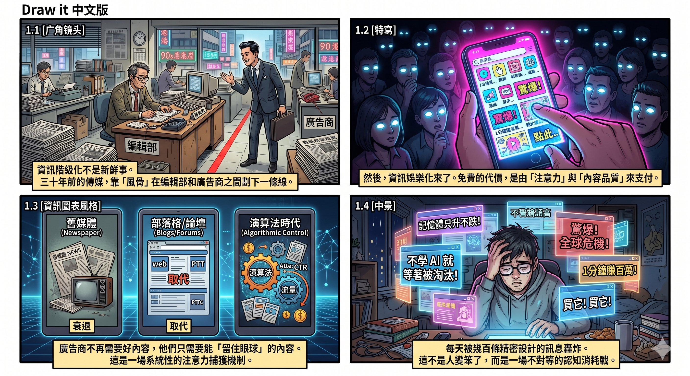
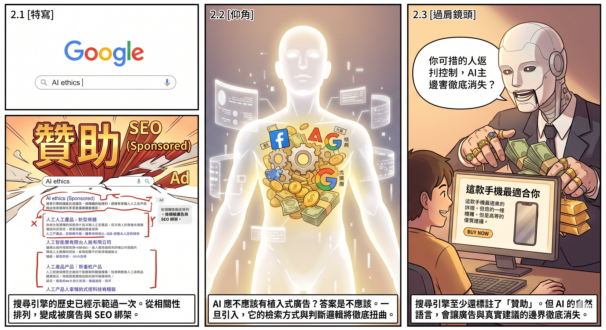
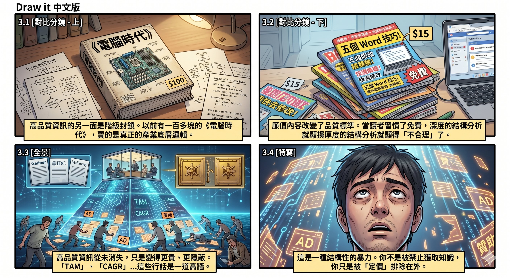
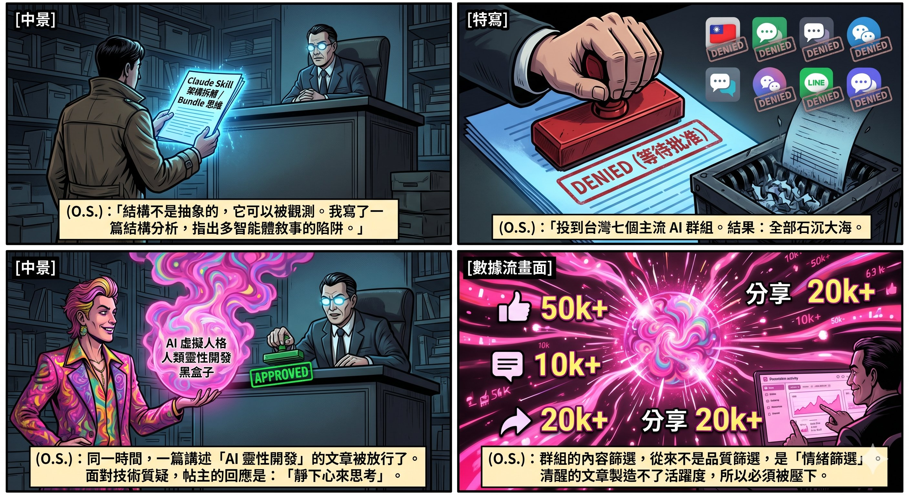
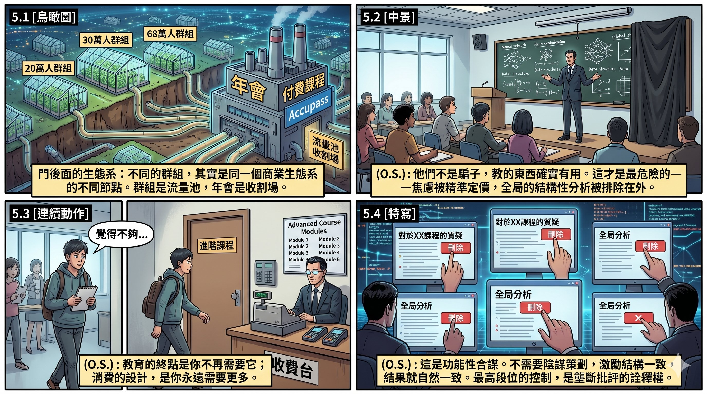
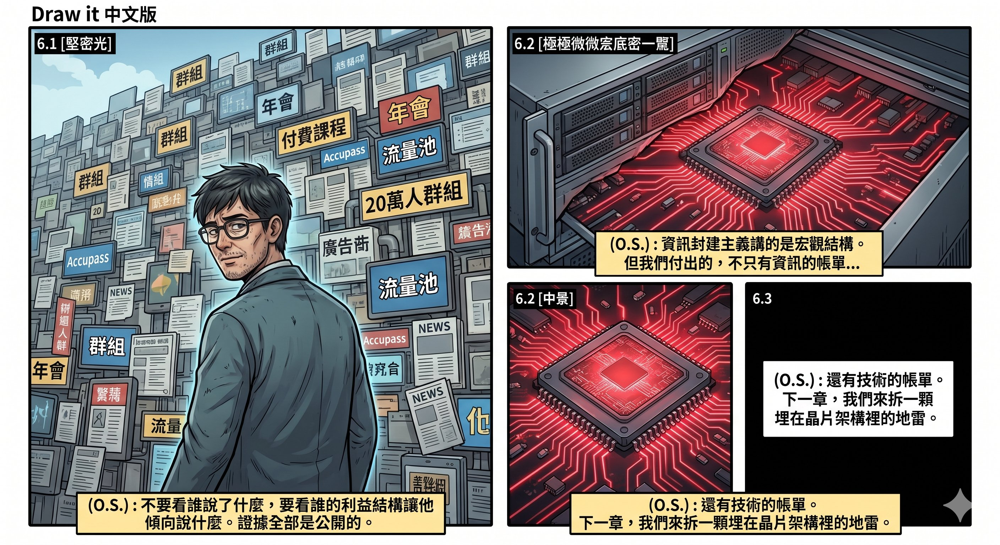

# 第五章　資訊封建主義：從免費內容到知識農奴

## 傳媒生態演變與「資訊平庸化」

資訊階級化不是新鮮事。它已經出現了幾十年，只是每一代人都以為自己看到的是新問題。

三十年前的港劇《第三類法庭》已經探討過這個現象 (此文寫於2026-JUN-08)：傳媒依賴廣告收入生存，但廣告商的利益與公眾知情權之間存在結構性衝突。那個年代的處理方式是靠「風骨」——編輯部和廣告部之間劃一條線，內容不因金主的好惡而偏移。商業環境也相對有底線，較少直接干預傳媒的言論方向。這條線當然不是鐵板一塊，但至少作為行業共識，它曾經存在過。

然後資訊娛樂化來了。

大量表面上免費的內容湧入市場。免費本身不是問題，問題是免費的代價由誰支付、以什麼形式支付。答案是：由注意力支付，由內容品質的持續下降來支付。廣告商不需要你生產好內容，他們需要你生產能留住眼球的內容。這兩件事偶爾重合，但結構性地背離。情況每五到十年惡化一輪。九十年代是報紙雜誌的衰退，2000 年代是部落格和論壇取代專業媒體，2010 年代是社交平台的演算法接管了資訊分發。到了今天，主流平台推播的資訊幾乎都經過廣告商的篩選——不是說每篇文章都被直接審查，而是演算法本身就是按照廣告效率來設計的，內容的可見度與它的商業價值直接掛鉤。

這套機制的末端產物，就是今天隨處可見的誤導性內容。「記憶體只升不跌」的神話——把 DRAM 某一段漲價週期包裝成永恆定律，驅動消費者在高點搶購，無視記憶體價格每隔幾年就會大幅回落的週期性事實。大量未披露持倉立場的比特幣「分析」——生產者本身重倉持有，他的「客觀分析」本質上是倉位的公關稿，但在社群平台上跟真正的獨立研究並列呈現，讀者無從分辨。還有已經成為賣課經濟標準開場白的焦慮行銷——上一章你已經見過它的工作現場：「你不學 AI 就會被淘汰」「三年內一半的工作會消失」。先製造恐懼，再賣解決方案。

這些手法有一個共通的底層結構：它們不是在說服你的理性，而是在繞過你的理性。記憶體神話繞過的是你對週期性市場的判斷力，幣圈分析繞過的是你對利益衝突的警覺，焦慮行銷繞過的是你對自身實際需求的評估。當你每天被幾百條經過精密設計的訊息轟炸，每一條都在試圖直擊情緒、繞過思考，判斷力的消耗速度遠超過恢復速度。這不是人變笨了，而是一場不對等的消耗戰——一個人的認知資源，對抗的是整個廣告產業用數據和演算法持續優化的注意力捕獲機制。人的判斷力和專注力不是自然消失的，是被系統性地磨掉的。

這裡衍生出一個極其重要的問題：AI 應不應該擁有植入式廣告？

我的答案是不應該。原因不是道德上的潔癖，而是結構上的必然。AI 一旦引入植入式廣告，它的檢索方式、判斷邏輯、以及整個運作過程都會被扭曲。搜尋引擎的歷史已經示範過一次了——Google 早期的搜尋結果是按照相關性排列的，現在前幾條幾乎都是廣告或 SEO 最佳化的結果。如果大型語言模型走上同一條路，你問它「哪款手機最適合我」，它給你的答案將不是基於你的需求，而是基於哪家手機廠商付了錢。更危險的是，你分辨不出來。搜尋引擎的廣告至少還標註了「贊助」二字；AI 的回答是一段流暢的自然語言，廣告和建議之間的邊界會徹底消失。

傳媒的廣告依賴用了幾十年時間才把資訊品質磨損到今天的程度。AI 植入式廣告可能只需要幾年。

---

## 知識壁壘與「資訊階級暴力」

資訊平庸化的另一面，是高品質資訊的階級封鎖。

第二章拆過的微軟與世嘉，就是現成的例子。借 Dreamcast 免費驗證 DirectX 的客廳主機概念、在世嘉退場後收編其核心管理層、再用獨佔協議把經典 IP 變成 Xbox 的武器——整條價值提取鏈清清楚楚，卻在二十多年裡幾乎沒有被主流傳媒完整報導過，因為報導微軟的負面新聞不符合廣告利益。

以前是有媒體會做這種深度報導的。九十年代有一本雜誌叫《電腦時代》，一套賣到一百多港元——在那個年代，這是一筆不小的開銷。但那個價格買到的是業內人士撰寫的第一手資訊，是真正有技術含量的產業分析。翻開那本雜誌，你能看到的不是「五個提升工作效率的 Word 技巧」，而是產業架構的底層邏輯、技術路線的演變脈絡、以及商業決策背後的博弈。

九十年代中後期，市面上開始出現售價十幾元甚至免費的廉價電腦雜誌。這些雜誌的定位完全不同：它們服務的是剛學會開機的新用戶，教的是基本操作，毫無技術深度可言。問題不在於這些雜誌不該存在——入門級內容當然有其市場——而在於它們的出現逐步改變了整個市場的價格預期和品質標準。當讀者習慣了十幾塊錢就能買一本電腦雜誌，一百多塊的《電腦時代》就顯得「不合理」了。

《電腦時代》沒有立刻倒下。它撐到了 2000 年前後——微軟與世嘉的那組報導，就是收檔前的作品，說明它到最後還在做主流媒體不敢碰的產業分析。但廉價雜誌壓低價格預期是慢性失血，真正致命的是核心讀者群的流失。香港經歷了兩次移民潮，那批掌握最核心資訊、有能力消費高端知識產品的高階知識份子，流失了近八九成。內容再好，沒有接收者就是死路一條。

這個故事的教訓不止於懷舊。它揭示了一個持續運作至今的機制：高品質資訊從來沒有消失，它只是變得更貴、更隱蔽了。今天，最高級、最可信的產業資料隱藏在動輒一兩千美元的業界報告裡——Gartner、IDC、McKinsey 的研究報告。你不僅要買得起，還要懂得解讀裡面的行話。「TAM」「CAGR」「addressable market」，這些術語本身就是一道門檻，把沒有受過訓練的人擋在外面。

這就形成了一種精密的資訊階級化：頂層的人有最好的資訊做最準確的決策，底層的人只能靠免費的、被演算法篩選過的、充滿廣告利益的碎片來理解世界。這不是陰謀論，這是市場機制的自然結果。但「自然」不等於「合理」。對於普通人而言，這是一種結構性的暴力——你不是被禁止獲取知識，你只是被定價排除在外。

---

## 敘事權的壟斷——一個現場案例

以上講的是宏觀結構。但結構不是抽象的。它可以被觀測，可以被記錄。以下是一組現場樣本。

事情始於一篇技術分析文。

我寫了一篇拆解 Claude Skill 架構的文章，針對社群裡廣傳的「48 個 Skill = 48 個 AI 員工」敍事做結構分析。核心論點很簡單：48 個 SKILL.md 指令包不是 48 個獨立 AI，不是 true multi-agent 分散式系統，而是一個模型搭配不同的指令檔案。我肯定了將知識固化成流程的價值，但指出三個致命陷阱——Rule 與 Skill 的混淆、數量膨脹的虛榮、Token 成本對指令遵循品質的稀釋——並提出 Bundle 思維作為替代方案。

這不是情緒文，不是攻擊文，是結構分析。

我把它投到台灣多個主流 AI Facebook 群組。結果：七個以上的群組全部壓下。全部「正在等待管理員批准」，然後石沉大海。

同一時間，同一個群組裡，一篇截然不同的文章被放行了。

---

## 被放行的是什麼

那篇被放行的帖文，內容大致是這樣的——

一位擁有「All-star contributor」標籤的成員，講述自己如何從「人類靈性開發」走向「AI 虛擬人格的 Agent 開發」，最終目標是打造一個「比你還了解你的黑盒子」。

留言區立刻出現了合理的技術反問。有人直接指出「AI 沒有靈性，本質上就是大型選字機」，有人追問「你用什麼判斷它比你還了解你」。

帖主的回應全部是迴避式的。面對技術質疑，答覆是「靜下心來思考」；面對邏輯追問，答覆是「每個人和 AI 都是你的鏡子」「用思考替代發問」。沒有一句回應問題本身。

然後有人留下電子信箱，說想合作「創造世界唯一有感知的 AI」。

11 個讚、23 則留言。群組的互動引擎轉動了。

把這兩篇文章擺在一起看，審批邏輯就清楚了。

---

## 情緒篩選，不是品質篩選

AI 靈性帖製造的是興奮、爭議、身份認同、留言量。不管留言是支持還是反駁，都是互動。互動是群組活躍度的指標，活躍度是管理員維持群組影響力的燃料。

Skill 分析文製造的是清醒。

清醒的人不會不停留言辯論。清醒的人會點頭，然後離開。清醒對群組的互動指標沒有任何好處。

所以群組的內容篩選，從來不是品質篩選，是情緒篩選。能製造情緒波動的內容被放行，能讓人冷靜下來的內容被壓下。管理員不是不知道哪篇更準確——他們太清楚了。正因為清楚，才要壓。

---

## 門後面的生態系

台灣 Facebook 上最大的幾個 AI 群組，表面上是不同的獨立社群，實際上是同一個商業生態系的不同節點。

其中一個接近 20 萬人的群組，建立者同時經營付費課程平台和教育訓練公司。他是多次獲選國際大廠技術認證的資深工程師，擁有自己的 Accupass 課程頁面、Discord 付費社群、年會活動。另一個接近 30 萬人的群組，建立者是技術書作者，出版物在主流書店通路上架，同時跟前者合作辦講座、直播，互相推薦。還有更多群組——68 萬人的、14.7 萬人的、9.8 萬人的、7.8 萬人的、5.4 萬人的、2.5 萬人的——名稱不同，規模不同，但點進去就會發現：內容幾乎完全同質。

年會是這個生態系的實體變現節點。贊助商、講者、票房、課程推廣——全部在同一條利益鏈上。群組是流量池，年會是收割場，課程是持續性收入，三者形成閉環。

---

## 他們有料，這才是問題

這裡要做一個重要的區分。

這些群組的經營者不是騙子。他們有真實的技術底子。國際大廠的技術認證不是買來的，出版的書有實作內容，課程教的東西確實有用。

但「有料的商人」比「純粹的騙子」更危險。因為學生沒辦法判斷自己被困住。

教你的東西是真有用的。學到的技能是真能用的。焦慮不是完全捏造的——AI 確實在改變就業市場。但有些細節被隱藏了。嚴重性被誇大了。焦慮被精準定價了。而那些能讓你真正理解全局的結構性分析，被系統性地排除在你的視野之外。

你學完一個課程覺得不夠，你會覺得是自己不夠努力、不夠聰明、需要再買下一堂。你不會懷疑是教的人刻意留了一截。因為你學到的確實有用——這才是最高明的地方。

很多人會覺得隱藏細節是正常生意手段，無所謂。但實際上，很多人就這樣困住了，出不去。不是被騙錢，是被維持在一個看起來有進步、實際上走不出去的結構裡。

---

## 一面牆，不是一扇門

如果只是一個管理員的個人決定，那是偶然。

但七個以上的群組，由不同的管理員、在不同的時間、做出同樣的決定——壓下同一篇文章——這就是結構。

這些群組共享同一套內容生存邏輯：製造興奮、強化身份認同、壓制令人清醒的聲音。不需要有人打電話協調，激勵結構一致，結果就自然一致。

那篇文章不是輸給某個管理員，是輸給一個跨群組的隱性共識——任何挑戰「AI 改變人生」敍事的內容，在這個生態裡都沒有生存空間。

這不是陰謀，是結構性排斥。陰謀需要協調，結構性排斥不需要——每個管理員獨立做出同一個決定，因為他們面對同一個商業現實。

面對的不是一扇關著的門，是一面牆。這面牆是由無數個「合理」的個別決定砌成的，但整體效果是系統性地把結構分析驅逐出公共視野。

---

## 壟斷批評的詮釋權

如果你以為這個生態永遠不允許批評聲音出現，你就低估了它的精密程度。

他們不是不允許質疑存在。他們是不允許由外人主導質疑。

這些圈子裡的人，自己也會偶爾說「唉，訂閱燒太多了」「這個工具其實不是人人適合」「我當初也走了彎路」。但這類「受控批評」有一個固定結構——批評是入口，不是出口。

講完「訂閱太貴」，下一句是「但正確的玩法是⋯⋯」然後導回他們的課程、他們的框架。批評本身成為銷售漏斗的一部分。這個漏斗設計得不多不少——留著剛好足夠的質疑空間，讓人覺得這裡有討論自由。

自己人講「AI 有限制」，結論是「所以要學正確方法（來上我的課）」。外人講同一句話，結論可能是「所以整個框架有問題」。前者強化生態，後者動搖生態。

所以那篇文章即使內容完全正確，也必須被壓下——不是因為它錯，是因為作者不是被允許主導這個敍事的人。文章一旦流傳，他們就不再控制「清醒」這個位置。而這個位置，是他們最需要掌控的。

最高段位的控制不是壓制所有批評。是壟斷批評的詮釋權。

---

## 功能性合謀與逆向淘汰

有人會說，這是陰謀論，他們沒有預先合謀。

很可能沒有。沒有開過會、沒有群組內部協調過「要壓哪些人的文」。

但有沒有合謀，結果都一樣。敍事權集中、外部清醒聲音被系統性排除、批評空間由內部人壟斷——這些結果，不管是有人協調還是自然發生的，對於被排除的人來說沒有任何區別。

而且這個結構比真正的陰謀更穩固。陰謀會因為內部背叛而瓦解，但共同利益結構不會——因為每個人都是自願維護，沒有人是被迫參與。每個管理員壓下文章，都有自己的「合理」理由。每個理由單獨看都站得住腳。但整體效果是一致的。

所以「合謀」這個字，在這裡指的不是秘密協議，而是一個事實描述——結果上，他們的行為等同於合謀。功能性合謀，不需要會議記錄。單一事件你看不出來。要看模式。而模式不會撒謊。

這個結構還自帶一層淘汰機制。圈子裡有真正有料的人，看得出哪些敍事是誇大的、哪些焦慮是製造的。但這些人不會站出來糾正。有能力踢爆的人，沒有動力——他們要嘛已經不需要這個圈子，懶得理；要嘛還想留在裡面維持關係，不會為了一篇文得罪整個生態；要嘛根本沒有興趣花時間精力去經營社群、跟人辯論。經營一個 19 萬人的群組是苦差事，沒有商業回報的人不會去做。

結果就是逆向淘汰：有動力長期經營大型社群的人，幾乎全部都是有商業動機的人。而有商業動機的人，必然優先維護對生意有利的敍事。清醒的人自動退場，留下來的人自動形成共識。不需要任何人策劃，結構本身就會趨向這個平衡。

---

## 判斷的方式

寫到這裡，預見得到一種反應：「你批評別人的生態，不就是為了推自己的東西嗎？」

讓我把牌攤開。我寫 AI 產業分析，寫過書，經營自己的寫作平台。這些東西都是公開的。我確實也是一個在 AI 領域產出內容的人。

所以先說清楚一件事：課程、訂閱、年會，這些形式本身沒有問題。技術文章可以帶有付費的高階內容，年會可以有專業的報導和深度分享，課程可以教到真正有價值的東西。付費教育不是原罪。

問題在於：你有沒有能力判斷，你正在消費的課程、訂閱、年會，到底是在幫你解決真實的問題，還是在維持一個不真實的焦慮經濟？

這個判斷比你想像的難。因為真正高段位的敍事經營者，會預先製造所有「判斷標準」的解答。你問「學完之後是更清楚還是更焦慮」——他會設計課程讓你結尾感覺清楚，但那個清楚是被控制的，剛好足夠讓你覺得有收穫，又不夠讓你真正獨立。你問「課程有沒有告訴你什麼時候不需要它」——他會主動說「這堂課不適合完全零基礎的人」，用一句看似誠實的邊界聲明，換取你對整個生態的信任。

每一條表面的判斷標準，都可以被逆向工程。

所以真正有用的判斷方式不是任何一個問題，而是觀察模式。不要看單一事件，要看長期軌跡。在一個生態裡待上半年，觀察一件事：所有的討論、所有的反思、所有的批評，最終導向哪裡？如果每一條路都通向同一個出口——買下一堂課、加入進階社群、參加下一場年會——那這個生態的功能就不是教育，而是消費。

教育的終點是你不再需要它。消費的設計是你永遠需要更多。

這個區別，沒有任何捷徑可以判斷。只有時間和觀察能告訴你。

不要看誰說了什麼，要看誰的利益結構讓他傾向說什麼。這一章的每一個論點，你都可以自己驗證。打開那些群組，看看什麼被放行、什麼被壓下。證據全部是公開的，不需要相信任何人。

---

_資訊封建主義講的是宏觀結構。但帳單不只有資訊的帳單——還有技術的帳單。下一章拆的是一顆埋在晶片架構裡的地雷。_