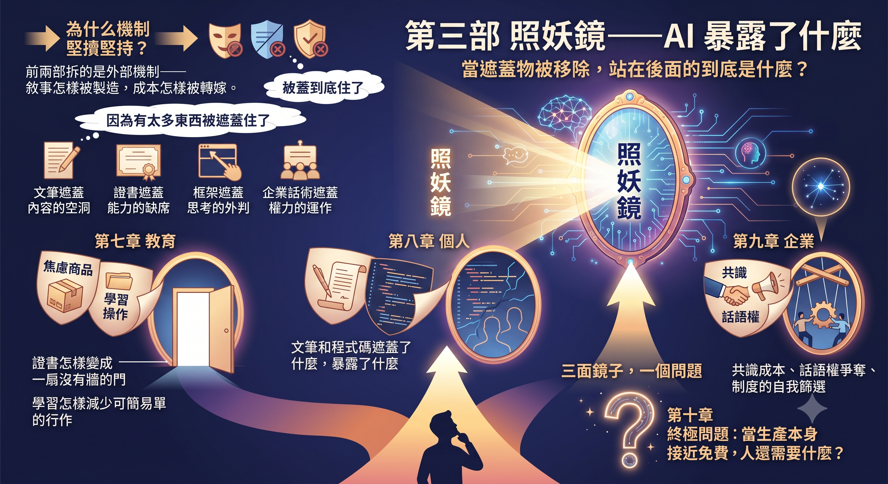
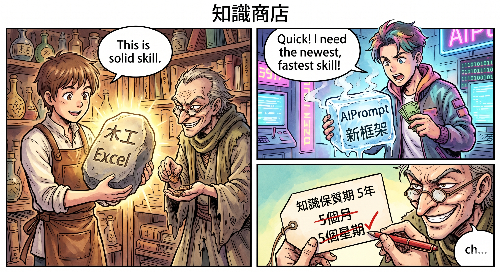
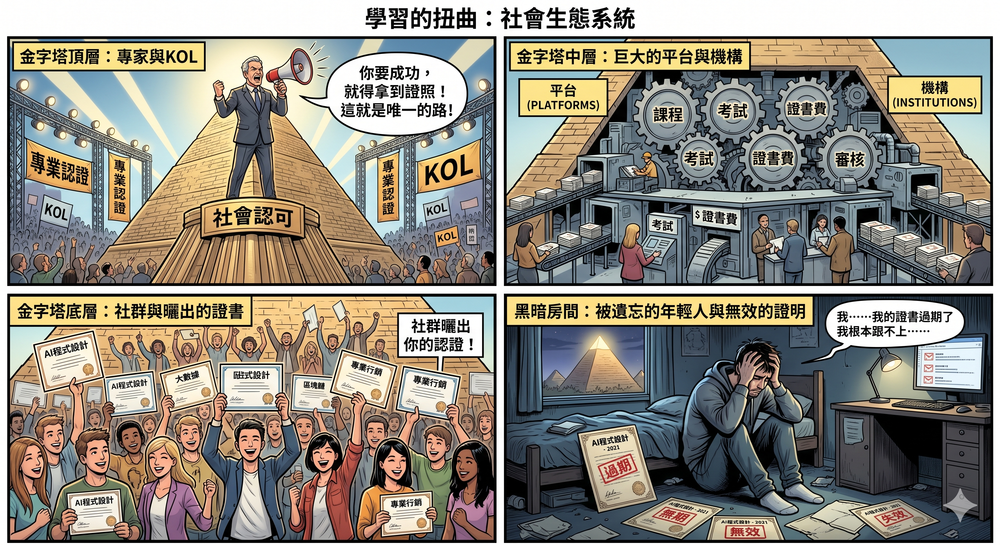
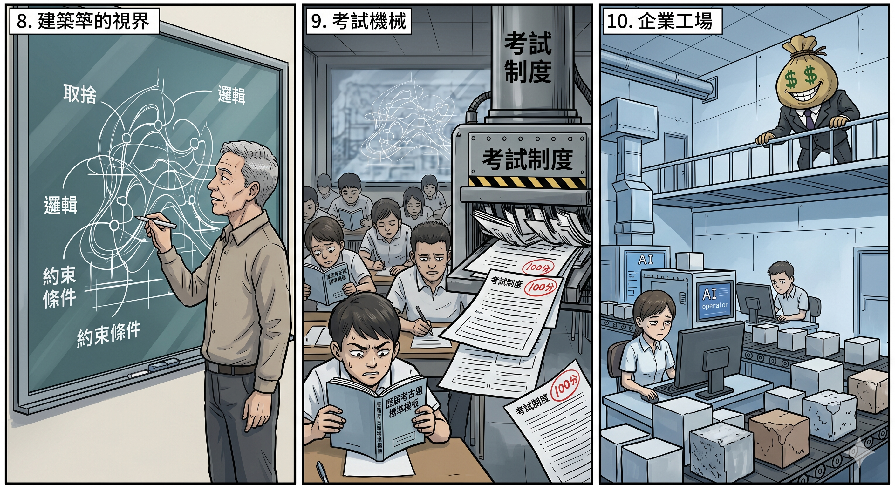
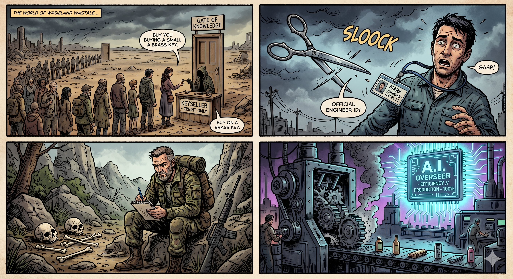
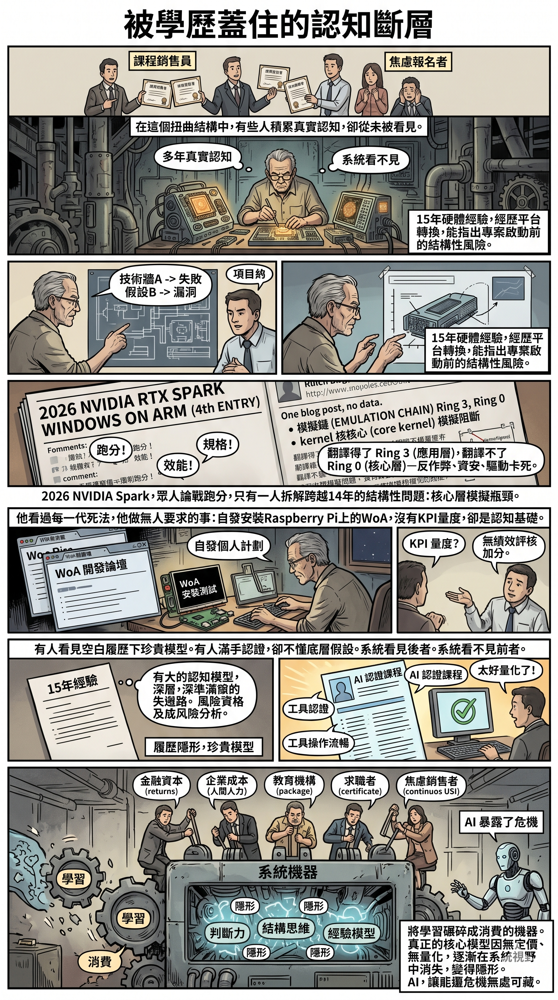

# 第三部　照妖鏡——AI 暴露了什麼

前兩部拆的是外部機制——敘事怎樣被製造，成本怎樣被轉嫁。但有一個問題一直沒有回答：為什麼這些機制能持續運作？為什麼帳單可以一直轉嫁到普通人頭上？

答案是：因為有太多東西被遮蓋住了。文筆遮蓋了內容的空洞。證書遮蓋了能力的缺席。框架遮蓋了思考的外判。企業話術遮蓋了權力的運作。

AI 做的事情，是把這些遮蓋物一次性掀開。

這一部不再追蹤敘事的流向和帳單的去處。它問一個更底層的問題：當遮蓋物被移除，站在後面的到底是什麼？第七章從教育開始——焦慮怎樣被包裝成商品、學習怎樣被壓縮成操作、證書怎樣變成一扇沒有牆的門。第八章照的是個人——文筆和程式碼遮蓋了什麼，暴露了什麼。第九章照的是企業——共識成本、話語權爭奪、制度的自我篩選。第十章把三條線合攏，問一個終極問題：當生產本身接近免費，人還需要什麼？

三面鏡子，一個問題。

---

# 第七章　學習的扭曲：焦慮是最好的商品

## 一個簡單的問題

有一個認識的年輕人，大學畢業再讀完研究所，跟我說自己很窮，急著找工作。他問我怎麼學程式。

我跟他說，先去看書。

不是因為我懶得教。而是因為書是最便宜、最容易找到方向的東西。在你還不知道自己想學什麼的時候，書至少能讓你摸索出一個輪廓。等你知道方向了，再決定要不要花錢學某個具體的課程。

但他周圍的聲音不是這樣告訴他的。社群上的廣告說：「不學 AI 就會被淘汰。」課程平台的推薦說：「三個月轉職工程師。」一堆「專家」在直播間裡說：「現在不報名，下次開課就沒位了。」每一個訊息都在催他掏錢、催他行動、催他害怕。

他最不缺的就是焦慮。他最缺的是判斷力——判斷什麼值得學、什麼只是有人在用他的焦慮賺錢。

後來他去考了各種台灣政府認可的證照。不是那些來路不明的民間課程，是有 KOL 推薦、有企業合作、有導師站台、有政府背書的正式認證——看起來專業、正規、穩妥，每一步都踩在「社會認可」的軌道上。

但這條路在 AI 時代恰恰是最弔詭的選擇。政府認證的設計邏輯，是基於一個穩定的知識體系去制定標準、設立考試、頒發證書。它預設你今天考到的東西，明年還是有效的。但當底層技術半年一變、工具一年一換，證照能證明的只是你曾經學過某個版本的某樣東西——而那個版本可能在你拿到證書的那天就已經開始過期。

更深的問題不是時效性，而是方向感。證照給你的是一條鋪好的路：考什麼、學什麼、怎麼準備，全部都替你定義好了。你只需要跟著走。但在一個連道路本身都在持續重建的時代，最危險的不是走錯路，是把「有路可走」當成了「走對了路」。他花了大量時間和金錢取得的那些證照，讓他覺得自己在前進，但其實只是在一個不斷旋轉的跑步機上——動作很標準，方向卻從未被自己決定過。

而判斷力這種東西，沒有人會賣給他。因為一旦他有了判斷力，他就不會買那些課程了。

---

## 知識曾經有保質期

那個年輕人後來怎樣了？他拿到了所有他報名的證照，履歷上多了好幾行。但他依然不知道自己要做什麼。

不是因為他不夠努力。是因為他努力的方向，建立在一個已經失效的假設之上。

倒退二十年，學一樣東西的回報是相對穩定的。你花半年學會 Excel，這個技能可以用十年。你花一年學會寫程式，這個能力可以撐住整段職業生涯的底盤。你去考一張 Oracle 的認證，至少在接下來五年內，它在履歷上有實際意義。甚至不談技術——你去學木工、學烹飪、學車床操作，學會了就是你的，別人拿不走。

那個時代的教育，不管品質高低，至少有一個基本的交易結構：你付出時間和金錢，換回一個保質期足夠長的技能。這是明買明賣。就算十個學生裡面有九個最終學不精，但那一個學會的人，確實拿到了他付錢買的東西。

這個交易結構之所以成立，是因為背後有一個隱含的前提：知識的折舊速度慢於學習的積累速度。你今天學的東西，明天還能用；你花的時間，不會被技術迭代瞬間歸零。

但這個前提，在過去十年裡逐漸失效了。

軟體框架的生命週期從十年縮短到三年。雲端平台每季更新一次 API，你還沒讀完上一版的文件，下一版已經發布。AI 模型半年一代，今天學的 Prompt 技巧，三個月後可能因為模型能力提升而變得毫無意義。你學的不是在折舊，是在蒸發。

知識的保質期坍塌了。但教育的定價方式沒有跟著調整。課程還是那個價錢，承諾還是那些承諾，只是你買回來的東西，保質期從五年變成了五個月，甚至五個星期。

這不是某一堂課的問題。這是整個「用金錢交換知識」的交易模型出了結構性的裂縫。

---

## 焦慮是最好的商品

當知識的保質期坍塌，一個很吊詭的事情發生了：賣知識變得比以前更賺錢。

原因很簡單。保質期短，代表客戶會回來。你今天學了 Agent，三個月後 Agent 框架更新了，你得再學一次。你今天學了某個 AI 工具的工作流，半年後工具改版了，你得重新學。知識蒸發的速度越快，課程的復購率就越高。

但比復購更強大的驅動力，是焦慮。

焦慮是一種特殊的商品。它不需要你證明產品有效，只需要你證明「不買會怎樣」。賣一門程式課，你得展示學員作品、就業率、薪資漲幅——這些是可以驗證的。賣一門 AI 課程，你只需要說一句：「不學就會被淘汰。」這句話無法被反證，因為「被淘汰」是一個永遠在未來的威脅，永遠不會到期，也永遠不會被驗證。

於是，一個精密的生態系統成形了。

先是「專家」製造焦慮。他們未必是壞人——其中不少人以前是正正經經教書的，有些甚至在大廠做過研發高層。但他們發現，賣焦慮的投入產出比遠高於賣知識。你認真教一門三個月的課，學員可能還是學不會，退款率高，口碑不穩定。你開一場兩小時的講座，標題寫「AI 時代你不能不知道的十件事」，場場爆滿，收入穩定。

然後是平台放大焦慮。演算法獎勵的是點擊率和轉換率，不是教學品質。「三個月轉職年薪百萬」的標題永遠比「這門課需要一年的練習才會有效果」的標題跑得好。平台不在乎你學到什麼，它在乎你有沒有結帳。

最後是社群強化焦慮。當你周圍的人都在報課程、都在曬證書、都在說「我今天又學了一個新工具」，你不動就顯得落後。「有在動」比「想清楚了再動」更容易被看見。燒錢報課程的人，看起來永遠比安靜思考的人更努力。

這三層結構疊在一起，形成的不是教育市場，是焦慮套利市場。中間賺錢的是賣課的人和抽成的平台，兩端承受代價的是花了錢卻學不到東西的學員，以及那些真正有東西可以教、但不願意用焦慮當賣點的人。

而最殘酷的部分是：學員學完之後如果用不上，他不會怪課程。他會怪自己。他會覺得是自己不夠聰明、不夠努力、不夠有天賦。焦慮的成本，最終全部由最沒有資源承受它的人來消化。

---

## 你學的是思考，還是操作？

焦慮套利只是表層。底下有一個更深的扭曲，而且它並不是 AI 時代才開始的。

我在外國學軟體工程的時候，學到的核心不是怎麼寫程式。是架構——軟體的哲學、邏輯、設計原則。程式碼只是最終的表達形式，佔整個學習過程中比重最低的部分。你花最多時間理解的是：為什麼要這樣設計？這個結構在什麼條件下會失敗？不同的設計選擇背後犧牲了什麼、換取了什麼？

但這些東西，其實亞洲也教。香港教，台灣也教。課綱裡有，教材裡有，課堂上老師也會講。問題不在「教不教」，在「考不考」——以及「怎麼考」。

架構思維的本質是取捨判斷。一個設計選擇好不好，取決於你面對的約束條件、你願意犧牲的東西、你對未來變化的預判。這些東西沒有標準答案，沒辦法出選擇題，沒辦法用六十分及格來衡量。所以考試系統很自然地把它們放到最低優先級——教是教了，但水過鴨背，不考就不練，不練就不會。學生不是不知道架構思維重要，是他們極其理性地把時間投入到會被考核的東西上。

但問題比「不考」更深。就算考了，扭曲依然存在——因為考法本身就是操作式的。一道關於系統設計的開放題，出到考卷上，學生的應對方式不是去理解設計背後的取捨邏輯，而是去找歷屆考古題，整理出標準答案的模板，背下來，套上去。考試制度把一個需要判斷力的問題，訓練成了一個可以用記憶力解決的問題。學生不是在學架構思維，是在學怎麼讓答案看起來像架構思維。考了跟沒考之間的差距，遠比你以為的小。

結果是什麼？整個職業市場形成了一種優先順序：實踐大於一切。怎麼讓程式跑起來、怎麼做 workaround、怎麼快速交付——這些才是被重視的能力。架構思維被當作「學術的東西」「太理論」「不實際」。不是因為沒有人教過，是因為衡量系統從一開始就不看這個——就算看了，看的方式也是把它壓回操作的模具裡。

於是工程師可以做到非常資深，但本質上只是對某一套框架、某一組工具非常熟練。當框架更新了、工具換代了，他的經驗就歸零。因為他不是沒學過那些不會過期的東西——設計原則、系統思維、取捨判斷——而是考試系統和職場考核都告訴他：那些東西不算數。他學的是操作，不是因為沒有人教思考，是因為思考在他被衡量的每一個環節裡都不被計分。

這不是個人的問題。這是成本控制中心的邏輯在主導教育。

企業想要的是即插即用的人力。你來了就能寫程式、就能交付、就能產出可量化的成果。至於你有沒有架構思維、能不能在三年後技術轉向時自主適應——那不是企業當下關心的事。企業的時間視野是這一季的財報，不是你十年後的職業發展。

當教育被這種邏輯主導，課程的設計就自然而然地偏向「教你操作」而非「教你思考」。因為操作可以快速變現，思考不能。操作可以用完課率和就業率來衡量，思考不能。操作可以在三個月內交付一個看得見的結果，思考需要三年才會在你做決策的時候顯現出來。

AI 課程把這個扭曲推到了極致。

看看現在市面上的 AI 課程在教什麼：怎麼用 AI 做工作流、怎麼用 Agent 自動化流程、怎麼讓 AI 幫你提高產出量。注意用詞——是「產出量」，不是「產出品質」。是「做更多的事」，不是「做更好的事」。

這些課程本質上在訓練的，是更高效率的執行者。學員花了錢，學會了怎麼用工具提升自己的產出，然後帶著這些技能進入職場——企業用一個人的薪水，買到了三個人的產出。課程幫助的不是學員，是企業的成本結構。

有多少人站出來說過：AI 根本不是這樣用的？

很少。因為說這句話的人，沒有課程可以賣。

---

## 一座沒有牆的門

2025 年，一家台灣企業在徵才網站上列了一個「AI 應用工程師」的職缺。條件清單裡寫著：需要某某平台的 AI 認證、某某機構的 Prompt Engineering 證書、至少三年 AI 相關工作經驗。薪資開到比傳統軟體工程師高出兩成。

三個月後，那張認證對應的工具版本就更新了。考試的內容還沒改，但工具已經不是同一個工具了。拿到認證的人，通過的是一場測驗歷史版本能力的考試。

這件事本身不值得大驚小怪。值得注意的是所有人的反應：企業沒有修改徵才條件，求職者繼續報考，培訓機構繼續開班。

焦慮套利加上操作導向的教育，共同創造了一個奇怪的現象：整個社會在用過時的標準，衡量一種它還不理解的能力。

證書、學歷、培訓時數、完課率——這些指標在知識保質期穩定的年代是有意義的。你拿到了 Oracle 認證，代表你確實掌握了 Oracle 的操作。你完成了某個 Bootcamp，代表你至少走過了一遍基礎流程。這些指標不完美，但它們和真實能力之間至少存在一定的相關性。

但在知識蒸發的年代，這些指標變成了空殼。這不是感覺，是可以量度的：研究顯示，專業技能的半衰期已經從十到十五年壓縮到五年以下，而在軟體工程和 AI 等技術領域，這個數字更短——兩年半，甚至十八個月（World Economic Forum,《Future of Jobs Report》; Skillable, 2025; Morson Edge, 2025）。你今天拿到的 AI 認證，三個月後可能就跟不上模型的更新。你完成的工作流課程，半年後可能因為工具改版而完全失效。指標還在，但它指向的東西已經消失了。

你可能會想：空殼歸空殼，有總比沒有好吧？至少在履歷上多一行，面試的時候多一個話題，裁員的時候多一層保護。

但事實不是這樣的。見過不少 IT Manager，證照一堆，每隔幾個月就考一張新的，履歷上的認證列表比工作經歷還長。裁員的時候，照裁。2026 年 Cisco 的裁員是一個現成的證物：公司砍掉傳統路由和交換部門的人力，把薪資預算轉移到 AI 網路和雲端安全。被裁的工程師裡面不乏持有 CCIE 等業界頂級認證的資深人員——IT 人力公司 KORE1 的分析直接用了「哪些認證剛剛被釋放到公開市場」這個說法（KORE1, 2026）。認證沒有擋住任何一把裁員的刀。證照沒有給他們能力上的護城河，也沒有給他們組織裡的安全網。但他們還是不斷考——因為不考的恐懼比考了沒用的現實更強。

這就是焦慮套利的閉環。證照變成了焦慮的止痛藥：不治病，但讓你暫時覺得自己在做「對的事情」。吃完一顆，焦慮短暫消退；然後新一輪技術更新、新一輪裁員新聞推送到你面前，焦慮回來，你再去報下一張。門外的人在排隊拿鑰匙想進門，門裡面的人也在排同一條隊——他們以為鑰匙能鎖住門，但門本來就沒有牆。

但這還只是其中一群人。更多的 Manager 和員工，根本沒有在考任何證照，也沒有在進修任何東西。不是因為他們看穿了證照的空洞，是因為他們連這個焦慮都沒有被啟動——日常工作已經填滿了所有時間，KPI 追的是交付和產出，不是學習。數據印證了這個觀察：職場學習研究中廣泛引用的 70-20-10 模型指出，員工 70% 的知識來自工作中的非正式學習，20% 來自同事互動，只有 10% 來自正式培訓（美國勞工統計局; Center for Creative Leadership）。而 2020 年美國人才發展協會的報告更殘酷：只有 11% 的員工會把正式培訓的內容應用到實際工作中（Association for Talent Development, 2020）。LinkedIn 2025 年的調查則從另一面印證：半數企業表示管理者缺乏適當支持去推動員工的職業發展，45% 表示員工缺乏指引去使用已有的培訓項目（D2L / LinkedIn, 2025）。企業口頭上說「鼓勵持續學習」，有些甚至提供培訓預算，但績效考核裡從來不量度這件事。你不進修，不會被扣分；你進修了，也不會被加分。系統沒有真的迫你，所以絕大多數人的知識停在入職那一年的版本上，然後用同一套東西做五年、十年，直到那套東西被整個換掉。

所以門的前面站著三種人：一種拼命考證照，考完一張接一張，焦慮驅動，止痛藥循環；一種根本不動，不是因為看得清楚，是因為系統沒有逼他動的理由；還有極少數，繞過門從旁邊走了——但他們走的那條路，在系統的地圖上根本不存在。

然而，系統需要指標。企業的 HR 需要篩選標準。求職者需要履歷上的亮點。培訓機構需要可量化的「成果」來證明課程有效。於是所有人繼續維護這套已經空心化的衡量體系——不是因為它有用，是因為沒有人知道該用什麼來替代它。

那麼，真正的門檻在哪裡？

不在你學了什麼工具。不在你拿了什麼證書。不在你上了多少小時的課。

在你有沒有能力判斷：什麼值得學，什麼只是噪音。在你有沒有能力在工具過期之後，重新定位自己的方向。在你面對一個從未見過的問題時，有沒有一套思考方式——不是解題公式，而是分析問題本身結構的能力。

這些能力有一個共同的特徵：它們無法被標準化。你不能用一張證書證明你擁有它們。你不能在三個月的課程裡「學會」它們。你甚至不能向別人清楚描述它們是什麼——直到你看見一個人在關鍵時刻做出了正確的判斷，你才會意識到：這個人有一些東西，是考試考不出來的。

教育的扭曲，不是從 AI 開始的。AI 只是讓這個扭曲變得無法再被忽視。

---

## 被學歷蓋住的認知斷層

在這整個扭曲的結構裡，有一種人的處境最值得注意——不是那些賣課程的人，不是那些被焦慮驅動去報名的人，而是那些在系統裡安安靜靜做了很多年、積累了真實認知、但從來不被系統的衡量標準看見的人。

有人做了十五年硬體開發，經歷過三代平台轉換，親眼看過哪些技術路線會撞牆、哪些假設從一開始就不成立。他的判斷不是來自文獻，是來自無數次「我們以為行得通但最後發現行不通」的現場經驗。他可以在一個專案啟動前就指出未來會遇到的結構性風險，不是因為他有水晶球，是因為他已經走過三遍同一類型的路。

第六章拆過一個具體的例子。2026 年，NVIDIA 發佈 RTX Spark，宣布第四次進軍 Windows on ARM。科技社群數百則留言在討論「這一次的技術夠不夠好」——規格、效能、跑分。但有一個人寫了一篇分析，裡面沒有討論任何跑分數據。他拆出的是一條穿越十四年、經過三批失敗平台的因果鏈，然後指出一個幾乎沒有人提到的結構性問題：模擬層翻譯得了應用程式層（Ring 3），翻譯不了核心層（Ring 0）——反作弊系統、企業資安軟體、週邊驅動，全部卡在這裡。這不是 NVIDIA 的問題，是 Windows 四十年歷史包袱的問題，換誰來都解不了。

這些判斷，他在兩年前就已經在說了。不是因為他比別人聰明，是因為他經歷過三代 Windows on ARM 的開發，看過每一代死在什麼地方，知道哪些約束條件是結構性的、不會因為換一顆晶片而消失。當事情後來果然按照那些約束條件發展，他不需要「預測」——他只是在等歷史押韻。

而且他做的很多事情，從來沒有人要求他做。他自己去註冊了 Windows on ARM 的開發者計劃，自己跑到開發者論壇裡去看別人遇到了什麼問題、怎麼解決、哪些問題根本沒有解決。他甚至試過在 Raspberry Pi 上面安裝 Windows on ARM——不是因為公司的專案需要，純粹是因為他想親手摸到那個平台的邊界在哪裡。沒有 KPI 量度這些行為，沒有主管要求他做這些事，沒有任何績效評核會因為他做了這些而加分。但正正是這些自發的、隱形的、不在任何人視野裡的投入，構成了他後來能寫出那篇分析的認知基礎。

但他的履歷上沒有一行可以表達這件事。沒有證書叫做「見過三代平台失敗的人」。沒有認證叫做「能在專案開案前識別結構性風險」。他的能力存在於他的認知模型裡——多年現場經驗壓縮而成的一套判斷體系。這套體系極其珍貴，但在履歷、KPI、培訓體系的語言裡，它是隱形的。

與此同時，另一個人花了半年上了一堆 AI 課程，拿到了幾張認證，履歷上亮亮的。他可以非常流暢地操作各種工具，但如果你問他：這個工具的底層假設是什麼？在什麼條件下它會失效？他的回答可能是一片空白。

系統看見了第二個人。系統看不見第一個人。

這就是認知斷層。學歷和證書本來應該是認知的代理指標，但當知識的保質期坍塌、當教育被操作導向主導、當焦慮套利扭曲了市場，這些代理指標和它們本應代理的東西之間，已經出現了巨大的裂縫。你量度到的越來越不是你需要的。你需要的越來越不是你量度到的。

更深一層的問題是：當系統長期用錯誤的指標去衡量能力，它不只是錯過了真正有能力的人。它還在訓練每一個人去優化那些錯誤的指標——去追求可以被量化的東西，而不是真正重要的東西。你的注意力、你的時間、你的金錢，全部被引導向了證書和課程，而不是向了思考和判斷。

學習的扭曲不是一個事件。它是一個系統。

金融資本的邏輯需要可量化的回報。企業的成本控制需要即插即用的人力。教育機構需要可包裝的成果。求職者需要可展示的憑證。焦慮販賣者需要持續回購的客戶。每一個環節都有自己的合理性，但串在一起，它們構成了一台將「學習」碾碎成「消費」的機器。

而在這台機器裡，真正重要的東西——判斷力、結構化思維、基於經驗的認知模型——因為無法被標準化，所以無法被定價；因為無法被定價，所以不會被生產；因為不會被生產，所以逐漸從這個系統的視野中消失。

它們沒有死亡。它們只是變得隱形。

而 AI 的出現，正在把這個隱形的危機照得無處可藏。

---

_教育的扭曲不是 AI 造成的。AI 只是讓它無法再被忽視。但 AI 暴露的不只是教育——它同時掀開了另外幾塊遮蓋物。_