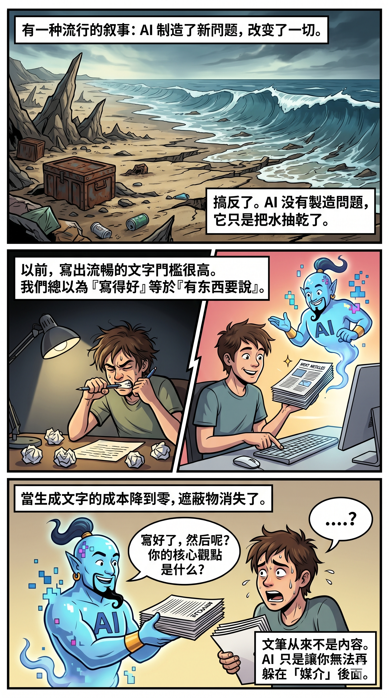
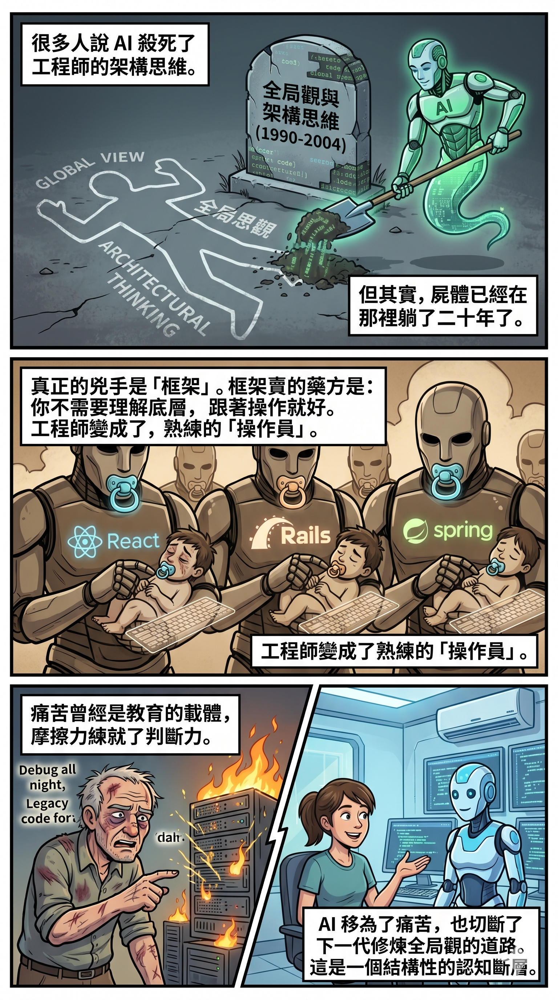
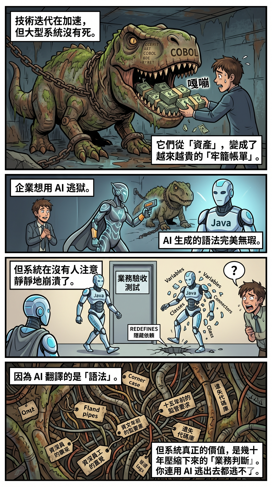
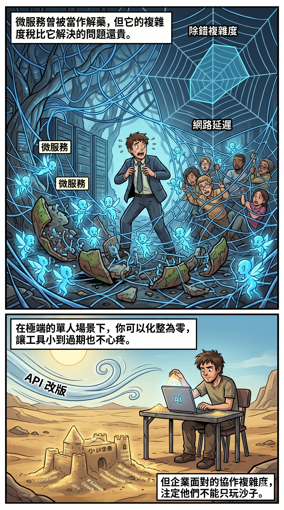
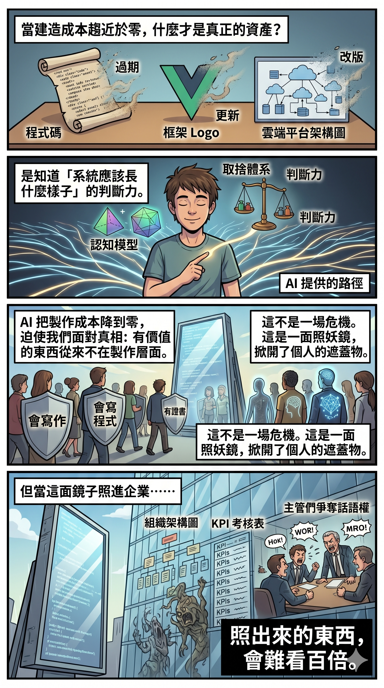

# 第八章　文筆不是內容，程式碼不是資產

## AI 沒有製造問題

有一種很流行的敘事：AI 改變了一切。工作會消失，技能會作廢，人類要重新定義自己。

這個敘事的方向沒有錯，但它的因果關係搞反了。

AI 沒有製造新問題。它做的事情更簡單，也更殘酷——它把一堆早就存在、但一直被遮蓋住的問題，一次性地攤在陽光底下。

文筆從來不等於內容。程式碼從來不等於系統思維。證書從來不等於能力。大型系統從來不是穩固的。這些事情在 AI 出現之前就是事實，只是因為製作成本高、門檻高，所以長期以來沒有人被迫面對。

AI 做的事情，是把製作成本降到接近零。

當任何人都可以在幾秒鐘內生成一段語法正確、結構完整的文字，「會寫」就不再是稀缺能力。當任何人都可以用 AI 幾天內搭建一套可運行的系統，「會寫程式」就不再是差異化的來源。當任何人都可以用 Agent 自動化一整條工作流，「會操作工具」就不再是競爭力。

剩下的，是一個赤裸裸的問題：拿掉這些媒介之後，你手上還有什麼？

第七章照的是教育——焦慮怎樣被包裝成商品、證書怎樣遮蓋了認知的缺席。這一章照的是個人：你以為是你的能力的東西，有多少其實只是媒介的門檻？

---

## 文筆從來不是內容

以前，寫出流暢的文字是一件有門檻的事。畫出精緻的畫面也是。剪出一段有節奏的影像更是。這些技能需要年復一年的訓練，需要天賦，需要經驗的積累。正因為門檻高，我們長期以來把「會寫」等同於「有東西要說」，把「畫得好」等同於「有東西要表達」。

文筆就是內容。畫工就是作品。技術就是思想。

但文筆從來不是內容。畫工從來不是作品。技術從來不是思想。

它們是意念的載體，是意識找到出口的途徑。一個人寫得好，不代表他有東西要講；但一個有東西要講的人，會找到辦法講出來——用文字、用圖像、用聲音、用任何可用的媒介。

AI 把這個長年存在的錯覺一次性拆穿。當生成流暢文字的成本降到零，「會寫」和「有東西要說」之間的差距就再也藏不住了。

這條裂縫的兩端，站著兩種人。第十一章會用更多的篇幅拆解他們——一個守著門檻的資深作家，一個燒著 token 的重度用戶——以及第三種更值得注意的可能性。這裡先記住一件事：文筆是媒介，不是內容。AI 不是拿走了誰的飯碗，它只是讓每一個人無法再躲在媒介後面。

---

## 框架殺死了架構思維——AI 只是蓋上最後一鏟土

第七章講過一個教育裡的扭曲：考試系統把需要判斷力的問題訓練成可以用記憶力解決的問題，結果工程師學的是操作，不是思考。

同樣的扭曲，在軟體工程領域以另一種形式提前二十年上演了一遍。而且兇手不是 AI，是框架。

2004 年前後，Rails、React、Spring 這一波框架開始普及。框架本質上是什麼？是一套封裝好的設計判斷。你用 React，就接受了它對狀態管理的設計決策。你用 Rails，就接受了它的 MVC 架構和 convention over configuration 的哲學。你不需要知道為什麼要這樣設計，只需要跟著走。

框架賣的就是「你不需要有全局觀也能寫出東西」。

從那一刻開始，「理解底層」就從入行必備降級成了資深加分。大部分開發者不再需要自己做架構決策，因為框架替他們做好了。他們變成了框架的操作員——非常熟練，但一旦框架更新、技術轉向，經驗就歸零。他們學的是操作，不是思考。第七章講的那個教育扭曲，在軟體產業裡以框架的形式提前二十年上演了一遍。

AI 做的是第二刀。框架時代，你至少還需要判斷「用哪個框架」「框架之間怎麼銜接」「什麼時候不該用框架」。AI 時代，連這一層判斷都可以外判給 Agent。你對著 Agent 講兩句話就有可運行的程式碼，你根本沒有機會經歷那種「為什麼會壞」的深層理解。

把這條線攤開看，會看到一段完整的抽象化歷史：Compiler 令人不需要寫組合語言。Garbage collection 令人不需要管理記憶體。框架令人不需要做架構設計。AI 令人不需要寫程式碼。每一次抽象化，都是一次全局觀的外判。AI 不是異類，它只是這條線上最新的一個節點。

但這裡有一個殘酷的問題：AI 移除了痛苦，但痛苦曾經是教育的載體。

以前的工程師是怎麼練成全局觀的？透過 debug 到天亮、自己整壞系統再修回來、被 legacy code 折磨、看著一個錯誤的設計決策在三年後爆炸。這些都是摩擦力。而 AI 最擅長的，就是消除摩擦力。

結果是一個結構性的斷層：有判斷力的人是在沒有 AI 的環境下長大的，他們經歷過那些痛苦的修煉。下一代在有 AI 的環境下長大，直接跳過了那段修煉。有判斷力的人會越來越少，但市場對判斷力的需求——因為產出量暴增、需要有人判斷品質和方向——反而越來越高。

AI 沒有殺死架構思維。架構思維死在框架手上，死了十幾年。AI 只是在屍體上蓋了最後一鏟土，然後所有人才發現墳已經在那裡很久了。

---

## 大型系統不會死，但會變成牢籠

如果框架殺死了個體工程師的全局觀，那麼技術迭代的加速，正在改變另一樣東西的本質：大型系統。

以前，建造一個大型系統是值得的。ERP、CRM、企業後台——這些東西的生命週期是五年、十年、二十年。建造成本高，但維護成本相對低，而且越用越穩定。企業願意花大錢建、花大錢養，因為投資回報的時間夠長。

今天，技術迭代的速度已經快到改變了這個等式。模型半年一代。框架一年一代。雲端平台每季更新 API。你還沒讀完上一版的文件，下一版已經發布。系統不是在折舊，是在蒸發——跟第七章講的知識蒸發，是同一個結構。

但大型系統不會因此消失。企業仍然需要它們。銀行的核心交易系統不能用微服務拼裝，醫院的電子病歷不能每半年重寫一次，工廠的 MES 不能因為雲端 API 改版就停線。大型系統會繼續存在，只是它的性質變了——它從一個資產，逐漸變成一個越來越貴的牢籠。你離不開它，但維護它的成本越來越高；你想替換它，但替換的風險和代價比維護還大。

「越來越貴」不是修辭。Gartner、Forrester、Deloitte 的產業基準一致指出，舊系統維護佔企業 IT 總支出的 60–80%，只留下 20–40% 給創新和新功能開發。美國政府問責署（GAO）2025 年的報告量化了一個極端案例：聯邦政府超過 1,050 億美元的年度 IT 預算中，79% 分配給了運維和維護。而到 2026 年，維護成本正以每年 18–25% 的速度攀升——懂舊系統的資深開發者正在退休，而他們帶走的不是語法知識，那些可以被文件記錄；他們帶走的是幾十年壓縮成直覺的業務判斷——哪些 corner case 會在月底結算時炸開、哪些欄位的格式背後藏著一個十五年前的監管要求、哪些看似冗餘的邏輯其實在擋一顆只有他見過的子彈。70% 的組織仍然難以找到具備多重技能的大型機人才（Kyndryl / BMC, 2025）。安全漏洞修補的壓力越來越大，技術債的利息從未停止累積。這不是牢籠的比喻。這是牢籠的帳單。

牢籠帳單還不是最殘酷的部分。最殘酷的部分是：你連用 AI 逃出去都逃不了。

全球仍有約 2,200 億行 COBOL 在運行中。它處理 95% 的 ATM 交易、80% 的當面信用卡交易，每天清算超過 3 萬億美元。43% 的銀行系統建立在 COBOL 之上（World Economic Forum; Open Mainframe Project, 2025）。這不是一個邊緣問題——它是金融基礎設施的底板。

企業當然想逃。AI 驅動的遷移工具被大量投入來解決這個問題，號稱能達到極高的業務邏輯保留率，成本減少 60–90%。語法翻譯的品質確實驚人——AI 生成的 Java 程式碼幾乎總是語法正確、結構完整、可以編譯。然後在用戶驗收測試中反覆崩潰。

崩在什麼地方？崩在 AI 看不到的東西上。

一個叫做 `TRN-LIMIT` 的變數——不是定義在 AI 翻譯的那個源檔裡，而是藏在執行鏈上千行之前的一個 COPYBOOK 中——包含了一個 `REDEFINES` 子句。這是 COBOL 的一個構造：同一個記憶體位址，根據在完全不同的模組中設置的標誌，被解釋為兩種不同的資料類型。AI 把它當成普通的數值欄位處理。結果 Java 應用程式把損壞的二進位資料寫入了資料庫欄位。程式碼編譯通過了。測試環境跑起來了。資料在沒有人注意的地方靜靜地壞掉了。

這不是個案。Gartner 指出，2026 年啟動的大型機退出專案中，超過 70% 預計無法達成預期效益——而且失敗原因幾乎全部是結構性的：隱藏依賴、共用記憶體映射、大型機特有的整合層（CICS、Db2），不是語法錯誤。翻譯的品質從來不是瓶頸。能編譯的程式碼是容易的部分。困難的部分是工具看不到的程式碼——那些壓縮在 COPYBOOK 裡、散佈在執行鏈各處、只有用了二十年的人才知道的取捨判斷。AI 翻譯的是語法。但 COBOL 系統真正的價值不在語法裡。它在幾十年積累的業務判斷裡，在那些從未被寫進文件的 corner case 裡。AI 可以完美翻譯它看得到的東西，但它看不到的東西才是系統真正在做的事。

你不只離不開舊系統。你連用 AI 逃出去都逃不了——因為 AI 翻譯的是程式碼，不是判斷。

這個牢籠效應，整個產業都在經歷。有人試過拆——十幾年前「微服務」被當作解藥推出來，把大型系統拆成幾十個、幾百個獨立的小服務，各自開發、各自部署。聽起來很美。但實踐下來，大部分企業發現管理幾百個微服務的複雜度（service mesh、分散式交易、observability、版本相容性）比當初的大型系統還要痛苦。

數字說得比比喻更清楚。2025 年 CNCF（雲端原生運算基金會）的調查發現，42% 曾採用微服務的組織正在把服務整合回較大的部署單元——原因是除錯複雜度、運維開銷和網路延遲。Gartner 的數字更難看：60% 的團隊後悔在中小型應用中使用微服務，單體架構平均節省 25% 的成本。甚至 Amazon——基本上發明了現代雲端架構的公司——也把 Amazon Prime Video 的監控服務從微服務回退成單體架構，基礎設施成本降低了 90%。Segment 從 150 多個微服務回退到單一應用。Service mesh 的採用率從 18% 降到 8%。微服務作為企業架構的通用解藥，基本上失敗了。很多公司正在悄悄走回頭路——不是因為單體架構更時髦，是因為微服務的複雜度稅比它解決的問題還貴。

那問題無解嗎？

有一個案例提供了不同角度的觀察，但它之所以行得通，恰恰是因為條件極其特殊——值得拆解的不是它的做法，而是它的前提。

有人幾年前建了一套將多個小程式串接在一起的工作系統。他本來想過做成大型系統——統一架構、集中管理、一套搞定。但雲端平台的改版速度逼他重新評估這個判斷。Google 的 GCP、Firebase 不斷更新 API，他必須一直追更新文件、一直餵給 AI、一直調整。花在追趕上的心力，隨時是實際開發的九倍、十倍。他以為自己在維護系統，其實是被雲端平台牽著走。

正正是這個經驗，讓他做了一個主動的架構決策：化整為零。不再建大型系統，而是讓每一個工具都小到可以隨時用 AI 重寫，小到過期了也不心疼。後來那套總系統過期了，他沒有再重建——不是因為不能，是因為他已經判斷出不值得。那些小程式不需要一個龐大的總系統來協調。

但這之所以行得通，是因為兩個非常特殊的前提：他是一個人，不需要跨團隊協作；而且他的工作流不需要一個統一的中央系統。如果是十個人的團隊、需要共享狀態、需要保證一致性的場景，這種做法根本走不通。企業需要大型系統，不是因為他們愚蠢，是因為他們面對的協作複雜度和一個人完全不同。

所以真正的洞察不是「小比大好」——這個命題只在極其特殊的條件下成立。真正的洞察是：當建造成本因為 AI 而趨近於零，什麼才是真正的資產？

答案不是程式碼。程式碼會過期。不是框架。框架會更新。不是平台。平台會改版。

真正的資產，是知道「系統應該長什麼樣子」的那個判斷。是面對無限多種可能的架構方案時，知道哪一個適合當前的約束條件、哪一個三個月後會撞牆、哪一個犧牲了什麼換取了什麼的那種判斷力。

AI 可以在一小時內生成十種架構方案。但誰來決定選哪一個？

這就回到了第七章講的那個認知斷層。能做出這種判斷的人，他的能力不在任何一段程式碼裡，不在任何一個框架裡，不在任何一張證書上。它在他的認知模型裡——多年經驗壓縮而成的一套取捨體系。這套體系極其珍貴，但在履歷、KPI、培訓體系的語言裡，它依然是隱形的。

---

## 暴露的不是弱點，是真相

把這幾件事排在一起看，會發現一個共同的模式。

AI 暴露了寫作的真相：文筆不是內容，意識才是。AI 暴露了程式設計的真相：操作不是能力，架構思維才是——而且架構思維在 AI 之前就已經衰退了。AI 暴露了系統工程的真相：程式碼不是資產，知道該建什麼、不該建什麼的判斷才是。AI 暴露了教育的真相：證書不是認知，判斷力才是。

每一個領域，AI 做的事情都是同一件：它把製作成本降到零，然後迫使所有人面對一個一直被高製作成本遮蓋住的事實——真正有價值的東西，從來不在製作層面。

以前你可以躲在「我會寫」「我會畫」「我會寫程式」「我有證書」後面，因為這些技能本身的稀缺性就足以讓你存活。現在這些遮蔽物被移除了，站在後面的那個人——有沒有東西要說、有沒有判斷力、有沒有認知深度——被完全暴露。

這不是一場危機。這是一場照妖鏡。

而照妖鏡照出來的，不只是個人的虛實。每一個上面講的問題——躲在文筆後面的空洞、躲在框架裡的操作員、被大型系統鎖住的團隊——它們不是在真空中發生的。它們發生在企業裡。發生在會議室裡。發生在績效考核表和組織架構圖上。

個人的遮蓋物被 AI 掀開了。但企業的遮蓋物——那些靠話語權、定義權、頭銜和流程運作了幾十年的東西——要掀開它們，需要的不是更好的工具，是一面更大的鏡子。

---

_AI 暴露了個人的虛實。但同一面鏡子照進企業，照出來的東西更難看。_