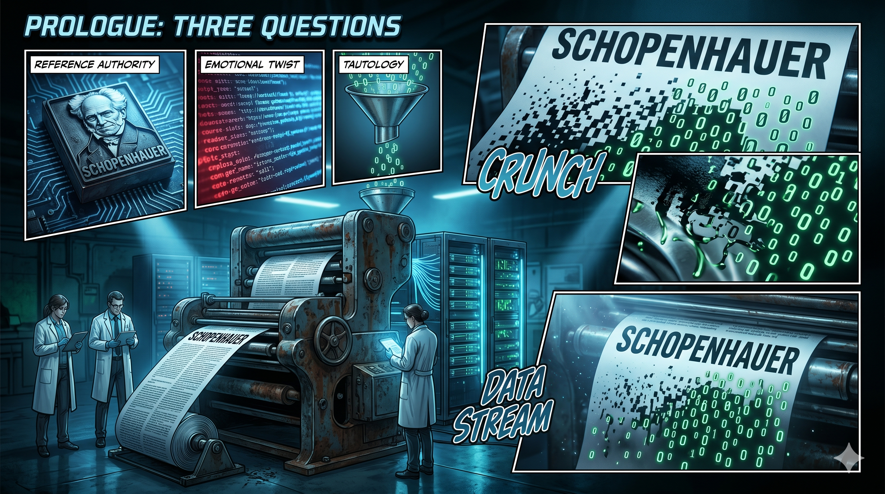

# 序章　三個問題

先讀這一段。

---

> 叔本華說過：「人生就像鐘擺，在痛苦與無聊之間來回擺盪。」但正是這種擺盪，才讓我們有機會看清——痛苦的盡頭不是無聊，而是一種被打磨過的清明。你現在的焦慮，不是因為你不夠好，而是因為你正站在一個更深的理解的門口。推開它，你會發現：你一直在尋找的答案，其實從未離開。

---

讀完了？

這段文字語法正確，措辭得體，結構完整——先引用哲學家建立權威感，再用情緒反轉製造共鳴，最後用一句看似深刻的話收束。如果它出現在你的社交媒體動態裡，配上一張霧濛濛的山景或一杯冒著熱氣的咖啡，你大概會停下來多看兩眼。

這段文字是 AI 生成的。

不是某個人花了幾天構思、經歷了什麼深刻感悟之後寫出來的。它是一個用 Google AI Studio 搭建的 Gemini App 在幾秒鐘之內產出的——輸入一個情緒關鍵字，選擇「叔本華」作為哲學框架，勾選「情緒陪伴」模式，點一下生成。整個過程不超過十秒。

拆開它的結構，你會看到一套精密的公式在運作。

第一層是引用。叔本華的名字提供了知識權威——大部分讀者不會去查這句話到底是不是叔本華說的，也不會去追究原文語境。引用本身就是一道門檻，它告訴你：「這篇文章有學問。」

第二層是情緒反轉。「痛苦的盡頭不是無聊，而是一種被打磨過的清明。」這句話聽起來像是洞察，但它經得起檢驗嗎？什麼叫「被打磨過的清明」？在什麼條件下成立？對誰成立？它沒有回答任何一個問題，但它模仿了回答問題的語感。

第三層是安慰。「你現在的焦慮，不是因為你不夠好。」這句話永遠為真——因為它對任何一個焦慮的人都適用，不需要知道你是誰、你焦慮什麼、你的處境有多複雜。它是一句恆真句：一句你連錯都錯不了的話，代價是它什麼都沒有說。

第四層是封口。「你一直在尋找的答案，其實從未離開。」這句話的功能不是提供答案，而是讓你停止追問。如果答案從未離開，那你不需要再找了——你只需要「感受」就好。它把思考的需求偷換成了情緒的滿足。

四層疊起來，就是一台暢銷書生成器。

這台機器不需要作者有任何人生經歷，不需要他對叔本華有任何研究，不需要他曾經焦慮過、清明過、被打磨過。它需要的只是一個 API 金鑰和一套 prompt 模板。產出的文字在統計意義上永遠「正確」——因為它從不冒險說任何可能被反駁的話。

現在，問題來了。

你每天在手機螢幕上讀到的「深度內容」——那些配著精美排版、帶著哲學引言、讓你在深夜覺得「被說中了」的文字——裡面有多少，跟你剛才讀到的那段叔本華，是同一台機器的產出？

不一定是 AI 生成的。一個人類用恆真句公式手寫出來的文字，跟 AI 用同一套公式生成的文字，在結構上沒有任何區別。差異不在工具，在背後有沒有一個活過的意識在負責。

這本書要做的事情，就是把這台機器拆開來給你看。不只是 AI 這台機器——還有比它更古老、運轉了更久的那幾台：敘事製造機、成本轉嫁機、焦慮套利機、遮蓋物生產機。它們疊在一起，構成了你每天呼吸的資訊環境。

---

這本書要回答五個問題。

第一個問題：敘事是誰製造的？

一句話從首爾的記者會去到你的手機螢幕，會變形多少次？一段 2001 年的歷史，是誰決定了你今天記得哪一個版本？資訊在傳播中變形不是新聞，但每一層變形背後的經濟動機，很少有人去追。

第二個問題：帳單由誰支付？

AI 的電費、裁員的帳單、你被一點一點磨掉的判斷力——製造故事的人不需要為故事的後果負責。承受後果的人連帳單都看不見。誰在付錢，付了多少，付給了誰？

第三個問題：AI 暴露了什麼真相？

AI 做的最重要的事情，不是取代人類。它做的是把一系列長年被遮蓋的東西一次性掀開——文筆遮蓋了內容的空洞，證書遮蓋了能力的缺席，框架遮蓋了思考的外判，企業話術遮蓋了權力的運作。當遮蓋物被移除，站在後面的到底是什麼？

第四個問題：人還剩下什麼？

在一個敘事被批量製造、成本被系統性轉嫁、遮蓋物被逐一掀開的世界裡，個人還有什麼是不能被複製、不能被訂閱、不能被升級也不能被降級的？答案指向一個詞——意識。但這個詞本身就是一個陷阱，每個人聽到它想到的東西都不一樣。

第五個問題：路要怎樣走？

看清了結構，理解了實力，然後呢？在一個你已經看清的世界裡，你選擇做什麼？選擇之後，路怎麼走？

五個問題，對應五部。第一部追敘事的變形。第二部追帳單的去向。第三部追 AI 掀開的遮蓋物。第四部追意識的結構。第五部交代選擇和道路。

---

你可以把這本書當成一份偵探報告。

被調查的不是某一個人、某一間公司，而是一套機制——它讓製造故事的人不需要為故事的後果負責，讓承受後果的人連帳單都看不見。

證物會一件一件擺出來。分析會逐層展開。結論由你自己下。

這份報告的第一件證物，就是你剛才讀到的那段叔本華。

它看起來深刻。它讓你停下來多看了兩眼。它甚至可能讓你覺得「被說中了」。

但它什麼都沒有說。

_一台機器可以生成無限量的「深刻」。那麼，真正深刻的東西，長什麼樣？答案不在這一章——它散落在接下來的十五章裡。第一章從一句話的變形開始。_