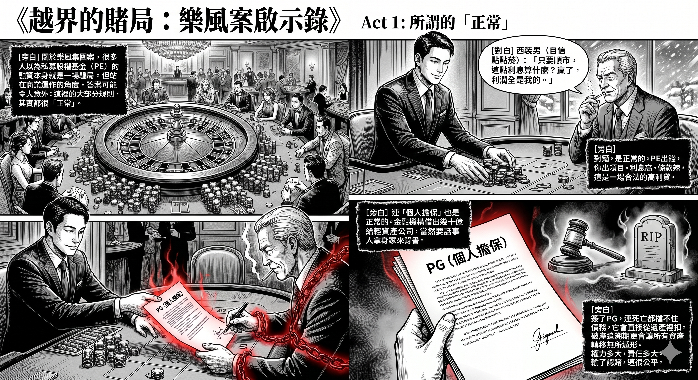
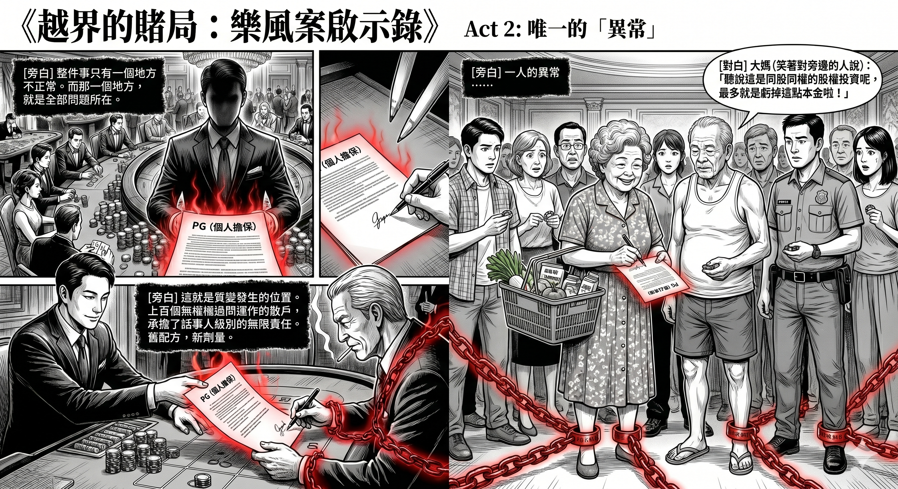
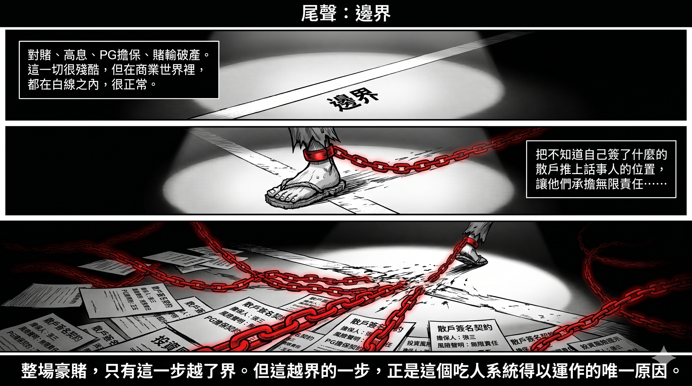

# 後記：一場豪賭的正常與不正常

> 本文是樂風集團案分析系列的後記。系列前三篇：《樂風集團案的食物鏈結構》《收費結構決定言論自由》《合法的不公平與不合法的欺瞞》。

## 一、補一個視角

系列寫完之後，看到YouTube上不少討論，發現有一個視角我沒有充分展開：站在正常商業運作的角度，這件事裡面，到底有多少部分其實完全合理？

答案可能令人意外：大部分都合理。對賭合理，高息合理，連個人擔保都合理。

整件事只有一個地方不正常。而那一個地方，就是全部問題所在。

## 二、對賭是正常的

系列裡我把PE比作「合法的國際大耳窿」。先講清楚：PE的合作方式其實五花八門——純股權、夾層融資、私募信貸、聯合收購，各有各玩法，本文不展開。這個比喻針對的，只是樂風案中那種明股實債、附帶對賭條款的玩法。它抓住了這類合約的壓迫性，但可能造成一個偏差：以為PE融資本身就是騙局。

不是。這類融資的本質是一場對賭：PE出錢，你出項目和執行力。利息高、條款辣，但賭贏了，你賺到的遠超銀行貸款所能撬動的回報。而且PE是希望你贏的——你贏，它才能連本帶利收回，再抽一筆表現費。

賭贏的人真實存在。Michael Dell在2013年聯同PE基金Silver Lake，以二百四十多億美元將Dell私有化，避開華爾街的目光完成轉型，幾年後風光重返市場——雖然那是股權收購，結構上和香港地產圈的明股實債不同，但它說明了一件事：PE的錢，是可以贏著還的。香港的「舖王」鄧成波靠高槓桿買賣商舖橫行幾十年，巔峰期資產數百億——他在賭桌上贏了大半生。

高槓桿不等於騙局，等於高風險。順市的時候，它甚至是精明。

問題從來不是「應不應該借PE的錢」，而是：你知不知道自己在賭什麼，和賭輸了要賠什麼。

## 三、PG也是正常的

連個人擔保，在正確的語境下，都是正常的。

想想樂風的「輕資產」模式：周佩賢自己講過，樂風在項目中的權益「可能只有3%，部分可能甚至無」。八個項目，總投資額近百億。換你是金融機構，借幾十億給一間淨資產近乎零的公司，不要求額外擔保——那才叫不正常。

PG的真正份量，很多人簽的時候並不知道：它連死亡都擋不住。擔保人離世，債務不會消失，會直接從遺產裡扣——還清債主，剩下的才輪到子女繼承。一個簽名，管到身後。

走資產也走不甩。有人以為大難臨頭前把物業轉名給配偶子女、賤價賣給親友，就可以保住身家——破產法早就堵了這條路。破產程序設有追溯期，期內的賤價轉讓和優惠特定債權人的交易，信託人可以入稟撤銷、把資產追回來；如果證明轉移是蓄意避債，追溯甚至不受年期限制。簽了PG，你的資產負債表就再沒有「自己人」這個避風港。

正因為份量這麼重，正規PE融資裡有一條不成文的規矩：PG只由話事人簽。決策者、大股東、實際控制人——權力多大，責任多大。新世界融資，不會叫小股東簽名；話事人簽PG，是用自己的身家為自己的決定背書。這在邏輯上是成立的，甚至是公平的。

所以PG的存在不是問題。問題是——
## 四、唯一不正常的地方：誰簽了

樂風讓散戶簽了。

在樂風的模式裡，承擔PG的不是周佩賢本人——她在部分項目公司的股東及董事名單中甚至不出現。簽下去的，是那些以「同股同權」入股、對項目運作幾乎沒有控制權的散戶。

明報今年五月的調查發現，單是樂風做擔保人的兩間發債公司，股東就超過七十人，背景橫跨整個社會光譜：有人住公屋，有人住九龍站豪宅，還有報住警察宿舍的。而樂風八個項目，每個項目的股東可以多達百人。

這就是質變發生的位置。

正常的對賭：三五個話事人，用自己的身家，為自己控制的項目擔保。權責對等，輸了認賭。

樂風的對賭：上百個無權過問項目運作的散戶，承擔了話事人級別的無限責任。他們以為自己在做股權投資——最多蝕本金；簽了PG那一刻，他們其實變成了債務擔保人——蝕到身後。

而且這個套路有前科。行內人都知道，以前就有投資導師介紹學員去財務公司借錢加槓桿、簽PG入市——散戶簽PG不是新鮮事。新鮮的是層級：以前是財務公司食散戶，這次是PE級別的資金鏈，末端接上了散戶的身家。舊配方，新劑量。

## 五、「願賭服輸」的前提

最常見的反駁是：簽了字就要認，願賭服輸。

這個原則沒有錯。但它有一個前提：賭客落注之前，知道規則、知道賠率、知道最壞會輸什麼。

一邊是花了幾十年打磨合約條款的頂級律師團隊，一邊是第一次聽到「Joint and Several Liability」這個詞的公屋住戶。賭桌兩邊的認知落差大到這個程度，「願賭服輸」就不再是一個公平原則，而是一塊遮羞布。

這不是說散戶不用為自己的簽名負責。而是說：當一個系統的設計，依賴大量參與者不理解自己簽了什麼才能運作——這個系統本身就是答案。

## 六、時勢與選擇

最後處理一個最常見的辯護：「沒有人預見到COVID、社運、加息潮，樂風只是時勢的受害者。」

只對了一半。

具體哪一日加息，沒有人能預測。但「低息不會永遠持續」這件事，不需要先知。利率是周期。你不知道冬天哪一天來，但你知道冬天一定會來。

而且有人真的提早穿了棉衣。李嘉誠由2013年起連年出售內地和香港資產，當時被全網嘲笑「別讓李嘉誠跑了」——事後回看，那是教科書級的周期判斷。脫身從來是一個真實存在的選項。

所以真正的分野，不是「誰預見了加息」，而是：同樣知道冬天會來的人裡面，誰選擇了脫身，誰選擇了加注。

樂風選擇了加注。2019年起斥資近百億併購市區項目，在槓桿已經拉滿的基礎上繼續擴張。這不是被雷劈中的路人——這是聽到雷聲之後，決定跑快一點而不是找地方避雨的人。

連賭桌上贏了大半生的波叔，都逃不過這個冬天：2021年他辭世後，家族被迫在低迷市況下劈價拋售資產，虧損慘重。分別在於：波叔自己坐莊、自己落注、自己埋單。而樂風的賭桌，是用散戶的名字和身家填滿的。

## 七、國際版本的故事：PE才是受害者

寫到這裡，這宗案有沒有引起國際關注？

答案非常諷刺：有報導，但故事完全相反。

國際財經媒體確實在寫香港地產的崩盤。彭博去年十月有一篇報導，講國際PE基金過去十年豪擲一百七十億美元搶灘香港地產，如今損手爛腳——頭號例子是Blackstone，2014年以七億港元買入旺角一個商舖物業，今日估值跌剩不到一半，正在和銀行重談貸款條款。

換言之，在國際視野裡，香港地產崩盤的「受害者」是Blackstone。

至於樂風案？南華早報、The Standard這些香港本地英文媒體有報導，但都是寫給香港人看的本地新聞。彭博沒有寫，路透沒有寫，金融時報沒有寫。「上百個散戶簽了PG、輸到身後」這條線，在國際敘事裡完全不存在。

同一場崩盤，兩個版本：國際版的悲情主角是管理萬億資產的PE巨頭，本地版的悲情主角是住公屋的擔保人。而後者，世界看不見。

為什麼看不見？金額太小——整個樂風盤子不足一百億港元，在全球PE的尺度上是個零頭。受害者太「本地」——蝕的是香港散戶，不是國際LP。結構太奇特——「散戶簽PG」這種事在國際PE圈聞所未聞，奇特到難以歸類，反而沒有人寫。

但有一條引線還未燒到：樂風的合作方名單上，有施羅德資本、SC Capital這些國際名字。如果日後的訴訟或調查觸及這些機構在資金鏈中的角色，這個故事才有機會從「香港社會新聞」升級成「國際金融新聞」。

在此之前，這條食物鏈的最底層，繼續維持它一貫的命運：第一個承受損失，最後一個被看見。

## 八、結語：邊界

這篇後記不是要推翻前面的分析，而是把邊界畫清楚。

對賭，正常。高息，正常。PG，正常。高槓桿賭周期，輸了破產——殘酷，但正常。

把上百個不知道自己簽了什麼的散戶，推上原本只屬於話事人的位置，讓他們承擔無限責任、卻只擁有旁觀者的權利——這，不正常。

整場豪賭，只有這一個地方越了界。但越界的這一步，正是整個系統能夠運作的原因：它需要的擔保，本來沒有人會簽。除了那些不知道自己不知道什麼的人——

而全世界，也不知道有這些人。

---

**免責聲明：** 本文基於公開報導及個人行業認知撰寫，部分細節（如PE融資中PG簽署慣例等）可能與具體個案有出入。本文不構成法律或投資建議。任何認為自己在投資過程中受到不當對待的投資者，都應尋求獨立的專業法律意見。
