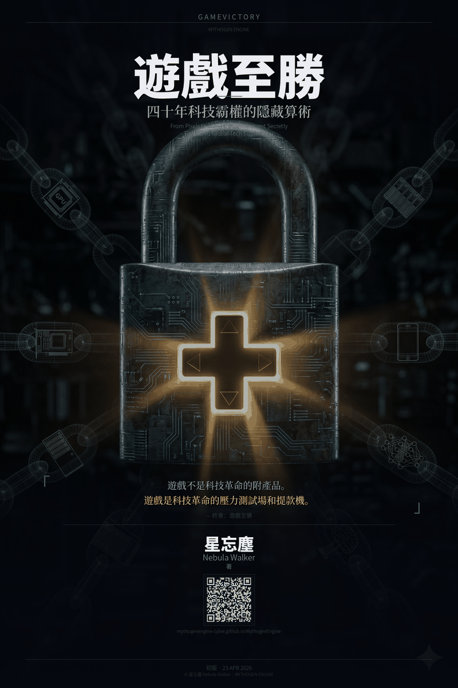

# GAMEVICTORY
## 遊戲即未來：四十年科技霸權的隱藏算術

---

&nbsp;

**作者** 星忘塵 Nebula Walker

**初版日期** 23 APR 2026

**引擎** MYTHOGEN ENG

**網頁** https://mythogenengine-cyber.github.io/MythogenEngine/
**Facebook** https://www.facebook.com/mythogenengine

&nbsp;

### 📖 下載電子書 Download eBook
- [繁體中文 EPUB 下載](/downloads/GameVictory_TC.epub)
- [English EPUB Download](/downloads/GameVictory_EN.epub)

&nbsp;

---

&nbsp;

> *「遊戲不是科技革命的附產品。遊戲是科技革命的壓力測試場和提款機。」*
>
> — 終章：遊戲即未來

&nbsp;

---

## 版權聲明 · Copyright Notice

本書所有文字內容版權歸作者 **星忘塵 Nebula Walker** 所有。  
本書由 **專頁創象引擎 MYTHOGEN ENGINE** 出品及協作排版。  
未經作者書面授權，不得以任何形式複製、轉載、改編或商業使用。

All text content in this book is copyright © **星忘塵 Nebula Walker**, 2026.  
Published and produced under **專頁創象引擎 MYTHOGEN ENGINE**.  
No part of this publication may be reproduced, distributed, or transmitted  
in any form or by any means without the prior written permission of the author.

&nbsp;

---

## 章節目錄 · Table of Contents

| #    | 章節 Chapter                         | 核心命題 Core Thesis     |
| ---- | ---------------------------------- | -------------------- |
| 自序   | 玩住學                                | 全局觀工程師的消亡路徑          |
| 序章   | 看不見的代價                             | 科技霸權底盤的形成            |
| 第一章  | 神仙打架的 DOS 時代                       | 標準戰爭的原型              |
| 第二章  | 特洛伊木馬                              | DirectX 如何鎖住 PC 遊戲   |
| 第三章  | 微軟的恐懼與 Xbox 的誕生                    | 用虧損堵住 Sony           |
| 第四章  | 世嘉的五百萬美元善款                         | NVIDIA 誕生的偶然性        |
| 第五章  | AI 的野蠻生長與 Wintel 的盲區               | 黑盒子的代價               |
| 第六章  | Gabe Newell 的越獄行動                  | Linux 反擊與 Steam 的新鎖定 |
| 第七章  | CUDA 豪賭與遊戲玩家的 R&D 稅                | 四層監獄的建立              |
| 第八章  | 唯一的軍工廠：台積電的終極壟斷                    | 信任壟斷如何煉成             |
| 第九章  | CEO 的生死時速：Lisa Su vs Pat Gelsinger | 組織結構的達爾文演化           |
| 第十章  | 最後一根救命稻草                           | 壓力測試場的拆毀             |
| 第十一章 | 給遊戲玩家的情書                           | 世嘉的成全與任天堂的救贖         |
| 終章   | 遊戲即未來                              | 八次 Pattern 的最終收斂     |
| 外傳上篇 | 逃獄者                                | Google的無魂豪賭與TPU閉環    |
| 外傳下篇 | 缺課者                                | 中國的應用狂歡與底層斷裂         |

&nbsp;

---

## 關於本書 · About This Book

**GameVictory** 是一部科技歷史分析著作，以「偵探敘事五幕式結構」貫穿全書，  
追蹤過去四十年間電子遊戲如何無意間鋪設了 AI 革命、智慧型手機、  
全球半導體格局乃至地緣政治的底層軌道。

本書的核心命題：**遊戲玩家，是人類歷史上最強大的非官方 R&D 資金池。**

*GameVictory* is a work of technology history and analysis,  
tracing how the video game industry inadvertently laid the foundation  
for the AI revolution, the smartphone era, and the global semiconductor order  
over the past forty years.

&nbsp;

---

## 關於作者 · About the Author

**星忘塵 · Nebula Walker**

旺角信和中心長大的電腦少年。EEE + Computer Engineering double major 畢業。  
在 DOS 底下調過 `config.sys`，在 HC11 微控制器上做過遊戲機，  
在 Linux 底下讀過 Valve 的 Proton 源碼。  
橫跨硬體與軟體、從電晶體到雲端皆有涉獵的工程師視角寫作者。

*A writer with an engineer's eye — from transistors to the cloud.*

&nbsp;

---

## 出品說明 · Production Note

本書由 **專頁創象引擎 MYTHOGEN ENGINE** 出品。  
所有歷史事實經人工研究核實；所有分析與觀點為作者 **星忘塵 Nebula Walker** 原創立場。

*Produced under* ***專頁創象引擎 MYTHOGEN ENGINE***.  
*All historical facts are human-verified.*  
*All analysis and opinions are the original work of* ***星忘塵 Nebula Walker***.

&nbsp;

---

*© 星忘塵 Nebula Walker · 23 APR 2026*  
*出品：專頁創象引擎 MYTHOGEN ENGINE*
