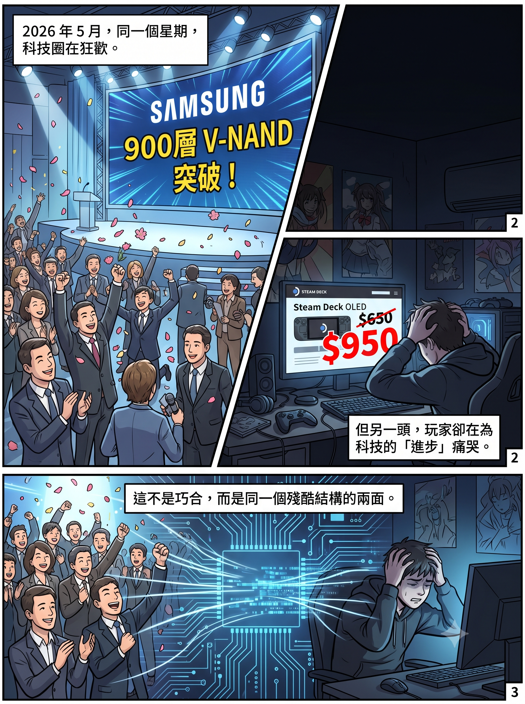

# 900 層的真相：當你的 Switch 和 Steam Deck 在替 AI 買單

## 兩則新聞，同一個星期

2026 年 5 月最後一週，兩則新聞幾乎同時出現在科技媒體上。

第一則：Samsung 宣布成功開發全球首顆 900 層 V-NAND 原型晶片，媒體標題一片歡騰——「記憶體技術重大突破」「重塑快閃記憶體競爭格局」「AI 時代的儲存革命」。

第二則：Valve 宣布 Steam Deck OLED 大幅加價，1TB 版本從 $650 漲到 $950，漲幅高達 46%。原因只有一句話：「rising memory and storage costs」。

同一個星期，一邊在慶祝記憶體技術的「突破」，另一邊消費者在為記憶體的短缺買單。這不是巧合，而是同一個結構性問題的兩面。

---

## 900 層不是 900 層

先講那個「突破」。

Samsung 的 900 層 V-NAND，並不是在一塊晶圓上從頭到尾蝕刻出 900 層結構。它是用一種叫做 CMB（Cell Multi-Bonding）的技術，把兩塊各 450 層的晶圓接合在一起，形成一個 900 層的封裝體。

這個區別很重要。

想像蓋大樓。傳統的 3D NAND 是在一塊地基上一層一層往上蓋。從 64 層蓋到 128 層不難，蓋到 232 層開始痛苦，蓋到 300 層以上就接近物理極限——蝕刻孔洞的深寬比太誇張（等於拿吸管從台北 101 樓頂鑽到地下停車場），良率暴跌，應力和翹曲急劇增加，成本不是線性上升而是指數級上升。

Samsung 的做法是：不蓋一棟 900 層的摩天樓，改蓋兩棟 450 層的大樓，再用天橋接起來。

工程上這確實有難度——接合精度、翹曲校正、電氣連通性都是真實的技術挑戰。但它和「單晶圓蝕刻 900 層」是完全不同等級的事情。更關鍵的是：目前這是一顆實驗室原型，不是量產產品。Samsung 自己實際在量產的最高層數是 V9 的 286 層，下一代 V10（約 430 層）預計 2026 年下半年才開始量產。從原型到量產之間，還隔著良率、成本、壽命、穩定性幾座大山。

但媒體標題不會告訴你這些。「900 層」三個字已經足夠讓股價跳一下，足夠讓 KOL 發一篇「NAND 技術突破」的懶人包。至於 450+450 和真正的 900 層之間的區別，留給看得懂的人自己分辨。

---

## 更值得關注的不是層數，而是方向

Samsung 的 CMB 技術真正有意義的地方，不在於「900」這個數字，而在於它透露的產業方向：NAND 正在走 HBM 的老路。

HBM 的革命本質是什麼？不是把單顆 DRAM 做得更大，而是把很多顆用 TSV（矽穿孔）堆疊起來。現在 NAND 也開始走同樣的路——不再追求單晶圓的極限層數，改用先進接合技術把多塊晶圓拼成一個系統。

這意味著整個記憶體產業正在發生一個共同的轉向：從「製程微縮」到「封裝整合」。CPU/GPU 那邊的 CoWoS、SoIC、Foveros，HBM 那邊的 TSV 堆疊，NAND 這邊的 CMB——底層邏輯是一樣的。物理極限到了，與其繼續縮小，不如把多個晶片變成一個系統。

這也意味著，未來 NAND 廠商的競爭核心，將從「誰疊得更高」轉向「誰接得更好」——接合精度、接合密度、接合良率、接合成本。而且可以預見的是，當接合技術成熟之後，廠商之間的產品差異化會進一步收窄。你用 CMB 接出來的 SSD，和對手用 Hybrid Bonding 接出來的 SSD，最終都是按同一套規格交貨。技術路徑不同，終點相同——還是標準品。

順便預測一個即將發生的事情：「層數定義戰爭」。當 450+450 可以叫 900 層，256+256+256 是不是可以叫 768 層？市場部門一定會開始玩數字遊戲。到時候比較各廠「層數」就跟比較手機「像素」一樣——數字越來越大，但實際意義越來越模糊。但對股市來說，模糊恰恰是最好的燃料——每一個「新紀錄」都能再餵出一輪懶人包、一波買入信號、一批新進場的散戶。技術突破是真的，但它被轉譯成投資敘事的速度，永遠比它轉化為量產產品的速度快十倍。

---

## 但這些都不是普通人應該關心的重點

以上是技術層面的分析。對大多數人來說，真正切身的問題不是 Samsung 的 NAND 疊到幾層，而是：為什麼我的遊戲機突然貴了這麼多？

答案很簡單：你正在替 AI 的記憶體需求買單。

2026 年 5 月，Nintendo 宣布 Switch 2 在美國加價 $50（從 $449.99 到 $499.99），9 月 1 日生效。日本更早動手，5 月 25 日起加 ¥10,000。連 Nintendo Switch Online 訂閱服務都跟著漲。Nintendo 的官方措辭是「市場狀況變化」，但財報裡寫得很清楚：記憶體成本上漲對本財年造成約 ¥1,000 億的額外營運成本。Nintendo 自己也預期加價後銷量會從上年的近 2,000 萬部跌到 1,650 萬部。漲價救利潤，犧牲銷量——這就是記憶體成本轉嫁的現實。

同一週，Valve 把 Steam Deck OLED 1TB 從 $650 加到 $950，512GB 從 $550 加到 $790。一部 1TB 的 Steam Deck 現在比 PS5 Pro 還貴。Valve 直接講明原因是記憶體和儲存成本上漲，甚至因為同樣的原因，延遲了 Steam Machine 和 Steam Frame VR 頭戴的定價和發售日期。

Sony 已經加了 PS5 的價格，最高漲幅 $150。Microsoft 加了 Xbox。Sony 甚至考慮將 PlayStation 6 延遲到 2028 甚至 2029 年才發售。Nintendo 的股價因為記憶體成本壓力，2026 年至今已經下跌超過 30%。

整個遊戲產業正在被記憶體短缺重塑。而這場短缺的根源，是 Samsung、SK Hynix、Micron 把大量產能從消費級 DRAM 和 NAND 轉移到了利潤更高的 AI 用 HBM。IDC 的分析師用了一個很重的詞：「結構性重置」（Structural Reset）——這不是傳統的週期性波動，而是記憶體生產分配方式的根本性轉變。AI 基建的優先級，在供應鏈的食物鏈裡，排在你的遊戲機、你的手機、你的筆記型電腦前面。

這裡有一層更深的諷刺，多數人沒有看到。

AI 資料中心裡那些吞噬記憶體的 GPU——NVIDIA 的 H100、B200——它們之所以存在，是因為過去二十年來，全球的 PC 遊戲玩家一代一代地買顯示卡，替 NVIDIA 分攤了平行運算（CUDA）的研發成本。那些 GPU 的大面積晶片之所以能量產，是因為台積電用遊戲 GPU 的訂單磨練出了大 die 的極限良率。換句話說：**遊戲玩家是 AI 革命的不自覺出資人——他們當年買 GeForce 的錢，養大了現在正在搶走他們記憶體的那個產業。**

而現在 NVIDIA 的做法更直接。面對 AI 訂單的龐大利潤，NVIDIA 計劃在 2026 年上半年將消費級 RTX 50 系列 GPU 的供應量削減 30% 至 40%，部分型號甚至直接停產——因為同一批記憶體顆粒，裝在 AI 伺服器裡賺的錢，是裝在遊戲顯示卡裡的好幾倍。NVIDIA 能毫不猶豫地做出這個取捨，不是因為它不在乎遊戲市場，而是因為它的 CUDA 生態已經把全球 AI 產業鎖死——AI 客戶別無選擇，只能向 NVIDIA 買卡，所以 NVIDIA 永遠可以優先滿足利潤最高的那一端。

這條因果鏈很長：遊戲玩家的錢養大了 NVIDIA → NVIDIA 的 CUDA 鎖住了 AI 產業 → AI 的記憶體飢渴搶走了遊戲的零件供應 → 遊戲機漲價，玩家再次買單。帳單繞了一圈，回到了同一群人手上。我在拙作[《遊戲致勝：從像素到 AI，娛樂如何暗中重塑全球科技霸權》](https://mythogenengine-cyber.github.io/MythogenEngine/zh-HK/)裡，用了十一章的篇幅追溯這條從遊戲到 AI 的四十年因果鏈——記憶體漲價，只是這條鏈上最新的一張延遲帳單。

---

## 裂縫已經出現

但故事沒有到此結束。因為在「供不應求」的敘事仍然高亢的同時，裂縫已經悄悄出現了。

2026 年 3 月底，Google 發布了一項叫做 TurboQuant 的 AI 記憶體壓縮技術，可以將 AI 推理時的記憶體使用量壓縮到六分之一。消息一出，Samsung 跌 4.71%，SK Hynix 跌 6.23%，Micron 跌 6.97%，Sandisk 暴跌 11.02%。Cloudflare 的 CEO 把它稱為 Google 的「DeepSeek 時刻」。

市場的反應是短暫的——分析師很快出來說「不影響大局」「AI 需求仍然強勁」「回調就是買入機會」。但 TurboQuant 證明了一件事：軟體層面的優化可以顯著壓縮單位工作負載的記憶體需求。支撐 HBM 需求永遠爆發的那個前提假設——「AI 模型的記憶體效率不能顯著提升」——正在被技術進步挑戰。

消費端的現貨市場也在鬆動。DDR5 的現貨價格在過去一個月已經累計下跌 30% 到 40%。買家開始觀望，預期還有下跌空間。DDR5 零售價出現回調，但業界強調合約價仍然穩定。現貨和合約正在講兩個不同的故事——而歷史告訴我們，現貨價格通常是領先指標。

記憶體價格預計在 2026 年 Q3 到 Q4 見頂，之後開始緩慢下降。新產能——Samsung 平澤 P4、SK Hynix M15X、Micron 美國新廠——將在 2027 年到 2028 年陸續上線。但這些產能大部分是為 AI 和 HBM 而建的，消費級的供應緩解可能要等到更晚。

---

## 最諷刺的對沖

在這整個局面裡，最諷刺的是社交媒體上流傳的一個「投資建議」：覺得 SSD 買貴了？買記憶體股來「對沖」。

這個邏輯聽起來很聰明，但它有一個致命的盲點：記憶體股是週期股。

當週期反轉、記憶體價格崩盤的時候——而歷史告訴我們這一天必然會來——你的股票會跌。但你已經用高價買了的 Switch 2 和 Steam Deck 不會退錢給你。你用 $950 買的 Steam Deck，在記憶體價格回落之後，Valve 不會寄一張 $300 的退款支票給你。

所謂的「對沖」，在週期頂部買入，兩邊都輸。

真正的對沖不是去追高一個處於歷史頂部的週期股。而是理解你面對的是一個什麼樣的市場結構，然後在這個結構裡做出最不傷害自己的選擇：如果你現在不急著用，就等；如果你急著用，就買，但不要自欺欺人地以為買了記憶體股就可以「賺回來」。

---

## 結語：技術在進步，但你的荷包在退步

Samsung 的 900 層 NAND 是真實的技術進展，但它是一顆實驗室原型，不是明天就能讓你的 SSD 便宜下來的量產產品。NAND 產業正在從「疊高」走向「接合」，這是一個重要的技術轉向，但它不會改變 NAND 作為標準品的商業本質。

與此同時，AI 對記憶體的飢渴需求正在重塑整個消費電子的定價體系。你的遊戲機在加價，你的手機在加價，你的筆記型電腦在加價——不是因為它們變好了，而是因為製造它們的零件被 AI 搶走了。

當 KOL 們在慶祝記憶體股翻倍、當投行在點名下一個「AI 受惠板塊」、當粉紅色懶人包在教你買六隻翻倍股的時候，真正為這場盛宴買單的人，是在 9 月 1 日之後走進遊戲店、發現 Switch 2 又貴了 $50 的你。

而當這場週期最終反轉——不是「如果」，是「當」——那些在頂部買入記憶體股的人會發現：AI 公司的資本開支會放緩，記憶體價格會崩盤，股票會腰斬。但你的遊戲機不會因此降價，你的 SSD 不會因此退款。在這場結構性的財富轉移裡，散戶永遠是最後一個進場、第一個被收割的人。

---

_本文是「記憶體神話」系列的第三篇。第一篇 [黃仁勳叫你買這六隻股票了嗎？] 拆解了社交媒體上的投資誤導。第二篇 [HBM 不是下一個台積電：記憶體與邏輯晶片的結構性鴻溝] 從產業結構層面分析了記憶體行業的週期性本質。三篇合在一起，構成一個完整的觀察：技術是真的，需求是真的，但敘事是被包裝過的——而為這個包裝買單的人，從來都不是講故事的人。_

_如果你想知道遊戲玩家是怎麼一步一步變成 AI 革命的不自覺出資人——從 DirectX 鎖定開發者，到 CUDA 鎖住整個 AI 產業，到台積電用遊戲 GPU 磨出先進製程的良率——[《遊戲致勝：從像素到 AI，娛樂如何暗中重塑全球科技霸權》](https://mythogenengine-cyber.github.io/MythogenEngine/zh-HK/)追溯了這條四十年的完整因果鏈。記憶體漲價不是故事的開始，甚至不是結束。它只是這條鏈上，離你最近的那一張帳單。_

