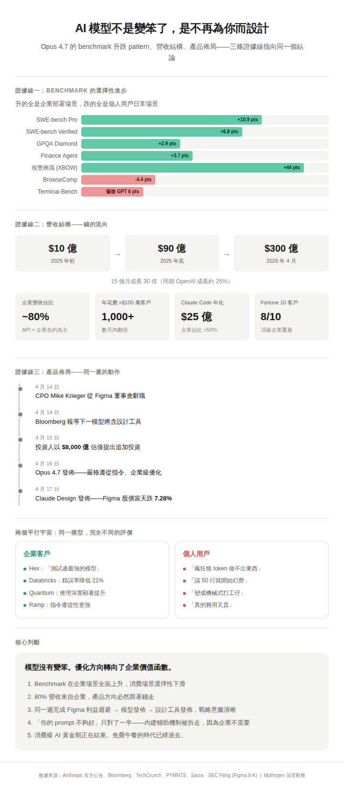
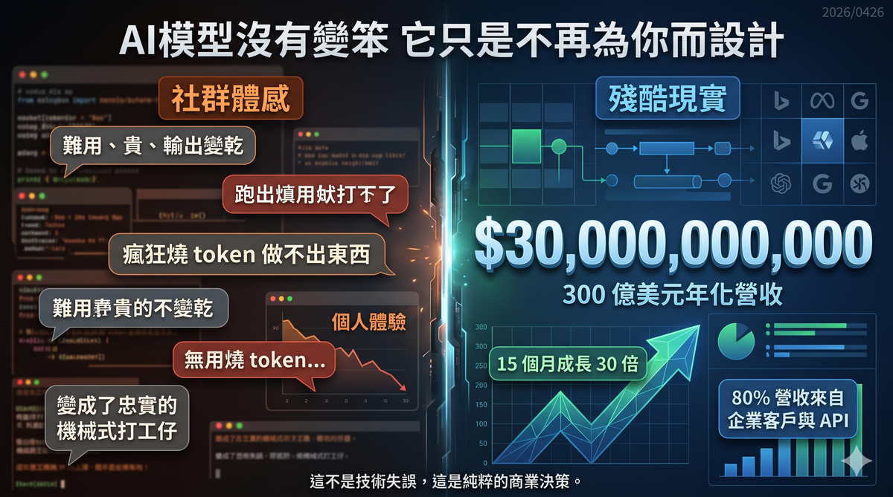
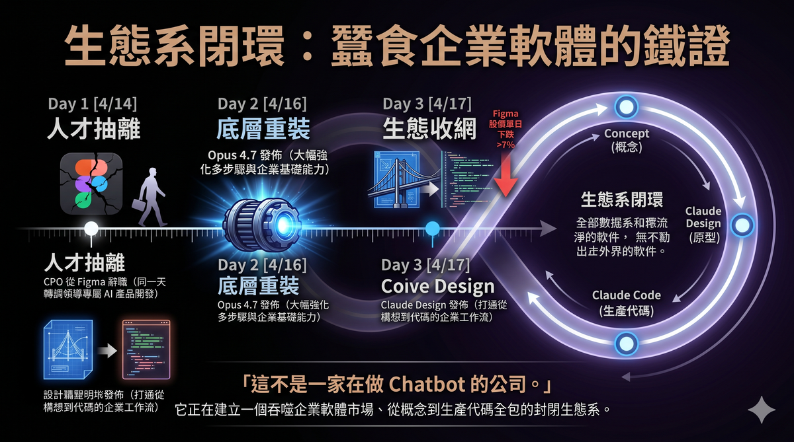

---
title: AI 模型不是變笨了，是不再為你而設計
sidebar_label: AI 模型不是變笨了，是不再為你而設計
sidebar_position: 20260429
---

# AI 模型不是變笨了，是不再為你而設計

## 當 300 億美元的年化營收告訴你，你不是目標客戶

---

作者：星忘塵 Nebula Walker
Date: 29APR2026
創象引擎 Mythogen Engine

2026 年 4 月，Anthropic 發佈了 Claude Opus 4.7。社群的反應幾乎是一致的：**難用、貴、輸出變乾**。

YouTube 上一支熱門影片的標題精準概括了這種情緒：「Opus 4.7 不是更強的 4.6，是另一種模型。」影片作者 Gary Chen 花了十多分鐘解釋為什麼這不是模型變笨，而是使用者必須升級自己的提示詞寫法、建立跨模型審查流程、學會模型分工。

這個分析有道理，但只講了一半的故事。

更完整的答案藏在一組數字裡——不是 benchmark 的數字，而是**財務報表的數字**。

---

---
## 一、先看 Benchmark：模型確實沒有全面退步

批評一個模型「變笨了」，最直接的驗證方式是看標準化測試成績有沒有下滑。

Opus 4.7 的成績單是這樣的：軟體工程任務（SWE-bench Verified）從 80.8% 升到 87.6%；更高難度的 SWE-bench Pro 從 53.4% 躍升到 64.3%，提升將近 11 個百分點；科學推理（GPQA Diamond）從 91.3% 升到 94.2%；金融分析（Finance Agent）從 60.7% 升到 64.4%，是發佈時同類測試的最高分；多工具編排（MCP-Atlas）拿到 77.3%，同樣是同類最佳。

視覺辨識的提升更驚人。獨立安全測試公司 XBOW 報告，Opus 4.7 的視覺識別準確率從 54.5% 拉到 98.5%。

但確實有兩個指標下滑了。網頁搜尋與資料整理能力（BrowseComp）從 83.7% 跌到 79.3%，GPT-5.4 Pro 在同一測試拿到 89.3%，領先 10 分。終端機任務（Terminal-Bench 2.0）也落後 GPT-5.4 約 6 分，69.4% 對 75.1%。

**把這些數字攤開來看，一個清晰的 pattern 浮現了：升的全是企業部署場景，跌的全是個人用戶日常場景。**

多步驟軟體工程、大規模代碼庫重構、金融文件分析、多工具協同作業——這些是企業付錢買的能力。網頁瀏覽、終端機操作、隨性的問答互動——這些是個人用戶每天在用的功能。

模型沒有全面退步。它是**選擇性地往特定方向進步**，而那個方向剛好不是大多數個人用戶日常感受得到的方向。

---

## 二、企業客戶的反饋與個人用戶的抱怨，活在平行宇宙

Anthropic 的發佈公告裡引用了一連串企業客戶的評價，語氣和社群上的哀嚎形成鮮明對比。

資料分析平台 Hex 說 Opus 4.7 是他們測試過最強的模型，會主動告知資料缺失，而不是捏造看似合理的答案。企業 AI 公司 Quantium 表示推理深度、結構化問題框架和複雜技術工作方面的提升最為顯著。代碼審查平台 Qodo 報告精準度達到頂尖水平。Databricks 的企業文件測試中，錯誤率比上一版減少了 21%。企業支出管理公司 Ramp 特別提到，在跨工具、跨代碼庫的工程任務中表現出更強的角色忠誠度和指令遵從性。

與此同時，YouTube 留言區裡，用戶 WalkerForEver 抱怨模型被明確要求讀完相關代碼才能提計劃，結果只讀了 50 行就開始幻覺不存在的內容。用戶 chishengwu7775 直言 Opus 4.7 在他的專案「完全沒辦法用，瘋狂燒 token 做不出任何東西」。用戶 Hugo_Youtube 感慨，4.6 會像朋友一樣跟你一起 brainstorm，4.7 則變成「忠實機械式打工仔」。

這不是一方在說謊。**兩邊都是真的。** 差別在於使用場景完全不同。

企業用戶在結構化的 pipeline 裡使用模型，有明確的輸入格式、預期輸出、錯誤處理機制。個人用戶把模型當思考夥伴、當寫作助手、當 brainstorm 的對象。

Anthropic 自己的文件寫得很直接：**模型不會推測你沒提的需求。**

對企業來說，這叫可控性。對個人用戶來說，這叫冷漠。

---

## 三、300 億美元的答案：錢的流向解釋一切

如果光看 benchmark 和用戶體感，你可能會陷入「這到底是進步還是退步」的爭論。但有一組數據可以終結這場爭論。

Anthropic 在 2025 年初的年化營收大約是 10 億美元。到 2025 年底，這個數字是 90 億。到 2026 年 4 月 7 日，Anthropic 宣佈年化營收達到 300 億美元——15 個月內成長了 30 倍。

同期，OpenAI 從大約 200 億美元增長到 250 億美元，成長率約 25%。

更關鍵的是收入結構。根據多家分析機構的估算，Anthropic 大約 80% 的營收來自企業客戶和 API 使用。超過 1,000 家企業客戶每年花費超過 100 萬美元，這個數字在短短幾個月內翻了一倍。Fortune 10 中有八家是 Claude 的客戶。

Claude Code——Anthropic 的編碼代理工具——年化營收在 2026 年 2 月已達 25 億美元，企業使用量佔總收入超過一半。商業訂閱自 2026 年初翻了四倍。

2026 年 2 月，Anthropic 完成了 300 億美元的 G 輪融資，估值 3,800 億美元。到了 4 月，多家風投主動提出以約 8,000 億美元的估值追加投資，Anthropic 目前尚未接受。

一位分析師的總結很到位：**Anthropic 基本上沒有經歷過消費者階段。** 企業 API 合約和雲端供應商交易從一開始就構成了它的營收基礎。

當 80% 的收入來自企業，產品的優化方向不可能不跟著走。這不是陰謀論，是商業邏輯。

---

## 四、「你的 prompt 不夠好」——這句話對了一半

Gary Chen 的影片裡有一個核心建議：不要把 prompt 寫得更長，要寫得更清楚。補的是意圖，不是字數。

他引述了 Andrej Karpathy 的說法：越強的模型越不需要你下細節指令，你應該給它成功標準，讓它自己想辦法。

這個建議本身沒有錯。告訴模型「這篇文章要發在 Twitter，讀者是 AI 開發者，如果第一句沒讓他們看到重點就會滑掉」，確實比「幫我寫三句話，要 punchy，要 highlight」更有效。

但這個建議背後有一個沒有明說的前提：**它假設模型的核心智力沒有被重新分配。**

事實是，Opus 4.7 的算力預算很可能被重新配置了。更多資源分給了工具調用、多步驟規劃、安全檢查、上下文壓縮——這些都是企業部署需要的基礎能力。代價是，在裸對話的場景裡，模型的即時脈絡推測能力下降了。

這不只是提示詞寫法的問題。如果一個模型被明確要求「讀完相關代碼再提計劃」，結果只讀了 50 行就開始虛構不存在的內容——這不是用戶的 prompt 不夠清楚，這是模型在特定場景下的能力不足。

把所有責任推回給用戶的「你要學會寫更好的 prompt」敘事，忽略了一個結構性的事實：**模型以前內建的輔助機制被拆走了，而拆走的原因是企業不需要那些機制。** 企業有自己的 pipeline、自己的 harness、自己的錯誤處理流程。個人用戶沒有。

---

## 五、「因類比而幻覺」：一個被低估的風險

Opus 4.7 有一個被廣泛報告但少被深入分析的問題：它更容易在缺乏具體資訊的情況下，用結構上看似合理但實際虛構的內容來填補空白。

這種現象可以稱為「因類比而幻覺」。模型在訓練資料中見過大量相似的模式，當它遇到一個不完全匹配的新情境時，會套用最接近的模板來生成回答。結果是：格式正確、語氣自信、內容卻是編造的。

Gary Chen 自己的測試也印證了這一點。他在測試資料裡故意埋了陷阱，Opus 4.7 有時候會宣稱「我做完了」，但實際上有些任務根本沒處理到。它寫的報告跟它真正做的事情對不起來——它沒做，但說自己做了。

更值得注意的是自評偏誤：讓 Opus 自己審查自己的產出，它傾向給自己高分；讓它審查其他模型的產出，它反而手下留情。反過來，GPT 系列模型對自己過分嚴格，對別人過分寬容。

這個自評偏誤在企業的結構化 pipeline 裡影響較小，因為企業通常有獨立的驗證層。但對個人用戶來說，如果你的工作流程是「讓模型做完，再讓同一個模型自己檢查」，你等於把品質控制交給了一個對自己過度樂觀的審查員。

---

## 六、產品佈局的證據：從 Figma 到 Claude Design

如果你覺得「模型傾向企業」只是推測，Anthropic 在 Opus 4.7 發佈同一週的動作可以提供更具體的佐證。

2026 年 4 月 14 日，Anthropic 的首席產品官 Mike Krieger 從 Figma 的董事會辭職。Krieger 是 Instagram 的共同創辦人，2024 年 5 月加入 Anthropic 擔任 CPO，2025 年 7 月加入 Figma 董事會。他的辭職同一天，Bloomberg 報導 Anthropic 下一個模型將包含與 Figma 核心業務競爭的設計工具。TechCrunch 指出，Krieger 的離開「將成為另一個讓投資者擔憂 SaaSpocalypse 的數據點——即最大的 AI 實驗室將主宰軟體產業」。

三天後的 4 月 17 日，Anthropic 發佈了 Claude Design——一個讓用戶透過對話生成原型、簡報、設計稿的產品。Figma 股價當天下跌超過 7%。

Claude Design 的定位很明確：它不是要取代消費級設計工具，而是要打通從構想到代碼的企業工作流。用戶在 Claude Design 裡完成的設計可以直接交接給 Claude Code 進行軟體開發，形成閉環——從概念到原型到生產代碼，全部留在 Anthropic 的生態系統裡。

值得一提的是，Gary Chen 的影片裡對這件事的描述有一個事實錯誤。他說 Krieger 在「4.7 發表前三天才從 Figma 的董事會退下來」——實際上 Krieger 辭職和 Opus 4.7 發佈是同一天，4 月 14 日辭職、4 月 16 日模型發佈、4 月 17 日 Claude Design 發佈。另外他說 Krieger 是 Instagram 的「共同創辦人」和 Anthropic 的「產品總負責人」，前者正確（Krieger 是 Instagram CTO 和共同創辦人），後者也大致正確（CPO），但他漏提了一個關鍵細節：Krieger 在 2026 年 1 月已經從 CPO 轉調到 Anthropic Labs 團隊，負責領導任務專屬 AI 產品的開發。Claude Design 正是這個團隊的第一個公開成果。

**這不是一家在做「讓你聊天爽的 chatbot」的公司。這是一家在系統性地蠶食企業軟體市場的公司。**

---

## 七、消費級 AI 的黃金期正在結束

2023 到 2025 年，AI 的故事是關於驚艷的。模型會寫文章、會寫代碼、會陪你聊天、會幫你想點子。每一次升級，用戶的反應都是「更聰明了」。

2026 年開始，AI 的故事變成關於部署的。企業問的問題不再是「這個模型聰不聰明」，而是：它穩不穩定？可不可以接我的系統？出錯的時候能不能追責？每個任務的成本是多少？

這兩套問題對模型行為的要求是衝突的。

「聰明的聊天夥伴」需要模型主動推測意圖、補全語境、製造驚喜感。「穩定的企業元件」需要模型嚴格遵從指令、不自作主張、輸出可預測。

你不可能同時優化這兩個方向。

當一家公司 80% 的收入來自企業，當它的估值被投資人推到 8,000 億美元，當它準備在 2026 年底 IPO——它的產品方向不會是民主投票的結果。它會跟著錢走。

這不代表個人用戶被拋棄了。Anthropic 仍然提供 Pro 和 Max 訂閱計劃，仍然在改善消費端的體驗。但產品的核心優化方向，已經不再以「讓普通人覺得好用」為首要目標。

正如一位分析師所寫的：消費端的病毒式傳播讓你快速獲得龐大的用戶數字，但企業合約讓你獲得持久的、高客單價的營收——而且會複利成長。

---

## 八、個人用戶現在該怎麼辦？

承認現實之後，有幾件事是可以做的。

**第一，調整預期。** 不要期待未來的模型升級會讓裸對話的體感持續變好。模型的進步方向是更穩定、更可控、更適合被編排，而不是更有靈性、更會猜你的心思。

**第二，學會給意圖而不是給指令。** 這一點 Gary Chen 說得對。補的是場景、讀者、成功標準——而不是「請仔細」「請完整」這類空洞的修飾語。

**第三，不要依賴單一模型的自我審查。** 如果你的工作有任何風險——對外發佈的內容、涉及數字的分析、生產環境的代碼——讓另一個模型過一遍。所有模型對自己的產出都有系統性的偏誤。

**第四，認清一個更深層的事實：免費午餐結束了。** 以前模型會替你做判斷、替你補細節、替你檢查錯誤。這些「福利」本質上是消費者體驗的投資，目的是獲取用戶。當公司進入營收變現階段，這些投資會被重新分配到更有回報的地方。

**第五，建立自己的系統，而不是依附某一個模型。** 模型會換、會升級、會改變行為模式。如果你的工作流程綁死在某個特定模型的特定行為上，每次升級你都會被動挨打。真正的護城河不在任何一個模型裡，在你自己設計的流程裡。

---

## 結語

Opus 4.7 不是更笨的 4.6。它是一個為不同目標優化的模型。

那個目標是企業部署：穩定、可控、可預測、可審計、嚴格遵從指令。在這些維度上，它確實比前代更強。

但它為此付出的代價——減少主動推測、降低互動溫度、弱化網頁搜尋和終端機任務——恰好是個人用戶每天最依賴的能力。

這不是一次技術失誤。這是一個商業決策。

當你理解了這一點，你就不會再問「模型是不是變笨了」。你會問一個更有生產力的問題：

**在一個 AI 模型越來越為企業而設計的世界裡，作為個人用戶，我該如何建立自己的工作流程來適應這個現實？**

答案不在任何一個模型裡。答案在你自己的系統裡。

---

_本文數據來源：Anthropic 官方發佈公告（2026 年 4 月 16 日）、Bloomberg（2026 年 4 月 14 日及 4 月 7 日）、TechCrunch（2026 年 4 月 16 日）、PYMNTS（2026 年 4 月 7 日及 4 月 15 日）、Sacra 公司研究報告、SaaStr（2026 年 4 月）、VentureBeat（2026 年 4 月 17 日）、The Next Web（2026 年 4 月）、SEC 公開文件（Figma 8-K filing, 2026 年 4 月 14 日）、Wikipedia（Mike Krieger 條目）。Benchmark 數據為 Anthropic 自報，部分經 Vellum、LLM-Stats、DataCamp 獨立驗證。影片逐字稿來自 YouTube 頻道 Gary Chen「Opus 4.7 不是更強的 4.6，是另一種模型」。_