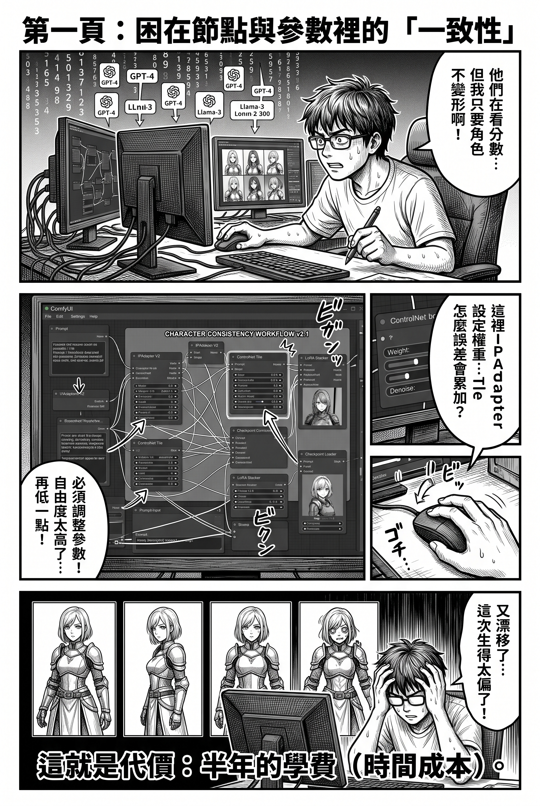
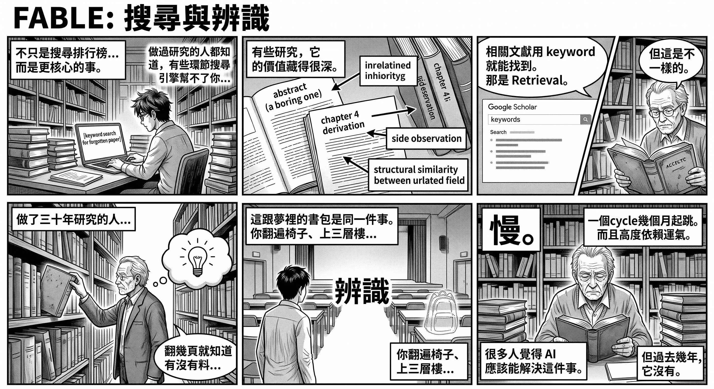
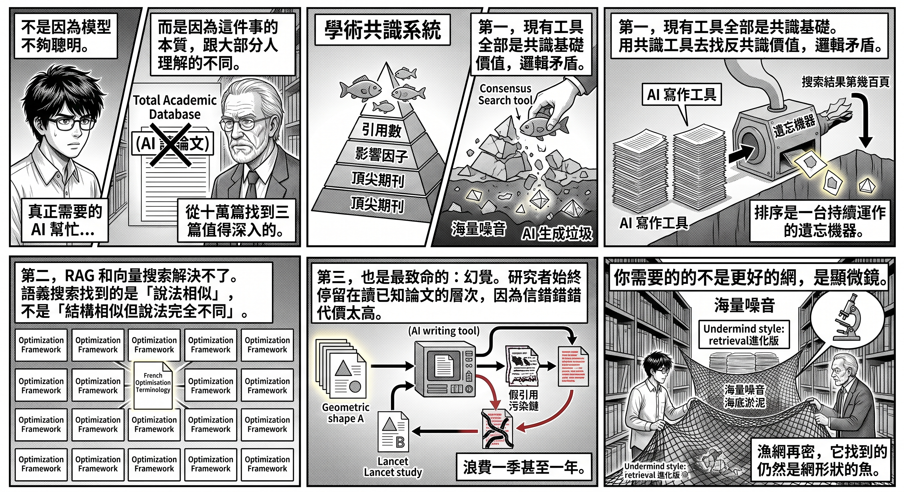
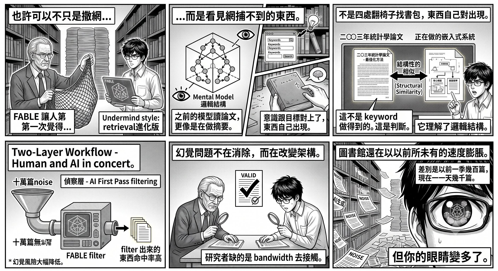
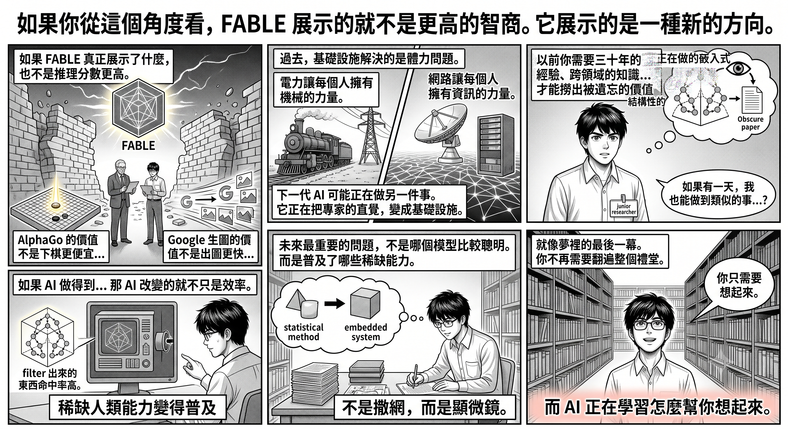

# FABLE 不只是智力提升，AI 正在把專家直覺變成基礎設施

每一次 AI 的智力提升到某個臨界點，都會產生質變——不是做同樣的事做得更好，而是突然做到以前根本做不到的事。

前幾天我發了一個夢。

夢裡我在一個大學的禮堂。座位排得很密，台上有人表演歌舞，有人演講。我把書包放在某排座位上，上了旁邊的平台層看了一會。等我下來，所有人都散了，禮堂裡還有人在表演，但我的書包不見了。

我四處找。上了二樓，沒有。上了三樓——三樓頂層居然是一個公園，有小孩在玩滑梯，有人盪鞦韆。滑梯可以滑回二樓，但書包不在那裡。我又回到禮堂，在舞台旁邊繞來繞去，翻了幾排椅子，還是沒有。

然後，很奇怪的事情發生了。

我突然想起書包在哪。不是找到的——是想起的。而我一想起來，書包就出現了。直接出現在我背上。

接著我想起忘了拿鞋。同樣的邏輯：我知道是哪雙鞋，鞋就出現在面前。

你不知道東西在哪，就永遠找不到。你知道它在哪，它就自動出現。

這不是搜索的邏輯。這是辨識的邏輯。

醒來之後我意識到，這個夢的機制，跟我最近一直在想的一件事是同一個結構。

---

最近 AI 圈很喜歡討論排行榜。

GPT 幾分。Claude 幾分。中國模型追到哪裡。推理強了多少。成本降了多少。每隔幾個星期就有新的 benchmark、新的王者、新的排名。彷彿 AI 的進步，最後都可以被翻譯成兩個數字：能力和價格。

沒有錯。過去兩年大部分模型確實是這樣進步的——回答更準，幻覺更少，推理更長，程式寫得更好。就像處理器每年提升兩成，顯示卡每年快一點。大家自然把 AI 看成一條持續向上的曲線。

但有些進步不是這樣。

---

去年很多人討論 Google 的新一代生圖模型，說它「解決了角色一致性的問題」，好像 AI 第一次能畫出同一個角色。

玩過 Stable Diffusion 的人會笑。

LoRA 可以做一致性。IPAdapter 可以做。ControlNet 可以做。ComfyUI 裡面有大量工作流專門處理這件事。只要你願意花時間、調參數、不斷重試，角色一致性一直都存在。

問題從來不是做不做得到。

問題是誰做得到。

一致性以前屬於少數人。它需要大量經驗，需要理解模型，需要踩過無數的坑，需要自己搭工作流。很多人看到別人做出一整套角色，以為模型很強。其實真正強的是背後那個人。

Google 生圖模型真正改變的，不是能力本身。

而是它把原本屬於專家的能力，變成了自然能力。

以前你要學半年。現在你輸入一句話。

以前你要懂節點，要用 IPAdapter 或 ControlNet 一張接一張地生成，每次拿上一張圖當參照——但誤差會累加，角色越生越偏，你要不斷手動拉回來。現在你只要給模型一個原始參照，甚至這個參照本身也可以是 AI 生成的，模型會把所有後續的變體都錨定在這個源頭上，不會漂移。

以前你要在一致性和自由度之間不斷拉扯。現在模型自己處理。

當然，ComfyUI 沒有被取代。本地生成仍然有它的價值——極致的控制、不受審查的自由度、零邊際成本的批量產出。已經學會整套工作流的人，ComfyUI 依然是更強的工具。值不值得學，見仁見智。但這恰恰就是重點：以前你只有一條路，現在你有了選擇。而那條新的路，不需要半年的學費。

這種進步很難用 benchmark 表達。它不是從八十分進步到九十分，而是把某種原本稀缺的技巧，變成人人都能用的基礎能力。

---

FABLE 給我的感覺很像。但我想講的不是排行榜。

我想講一件跟開頭那個夢有關的事。

做過研究的人都知道，學術工作裡有一個環節是任何搜尋引擎都幫不了你的——找到那些被整個學術系統遺忘的論文。

不是找相關文獻。相關文獻用 keyword 就能找到，用引用鏈就能追溯，用 Google Scholar 就能搜索。那是 retrieval，機器一直都做得到。

是另一種東西。

有些研究，它的價值不在 abstract 裡。核心洞見藏在第四章的一個推導過程裡，藏在一個被作者自己輕描淡寫的 side observation 裡，藏在兩個看似無關的領域之間的結構性相似裡。這種東西沒有 keyword 可以搜到——因為它的價值不是由作者定義的，而是由讀者的知識結構決定的。

同一篇論文，一個人看到的是無聊的統計方法改進，另一個人看到的是可以應用到完全不同領域的核心框架。

差別不在論文裡。差別在讀的人的腦袋裡。

以前找這種東西，方法只有一個。

去圖書館。翻。

不是仔細讀——沒有人有時間仔細讀幾千篇。是快速掠過：翻幾頁，看結構，看圖表，看作者怎樣處理自己的數據。大部分時候什麼都沒有。偶爾，很偶爾，你會停下來，覺得這篇東西有什麼不對勁——不是寫得差，而是寫得太好，好到它不應該只有這麼少引用。

這種感覺很難教。它不是知識，是直覺。

做了三十年研究的人翻幾頁就知道一篇論文有沒有料。資深投資人看幾個數字就知道問題在哪。老編輯看第一頁就知道一本書有沒有東西。你問他們怎麼判斷的，他們答不出來。因為那已經不是方法，是嗅覺。

這跟夢裡的書包是同一件事。你翻遍每一排椅子、上了三層樓——那是搜索。但書包最後不是被找到的，是被想起的。你的意識對上了，東西就出現了。

在圖書館翻論文也一樣。你不是在搜索，你是在等某個東西觸發你的辨識系統。

而這種方式的問題太明顯了。

慢。

一個 cycle 至少幾個月，通常一季起跳。而且高度依賴運氣——你可能錯過了一篇就在隔壁書架上的論文，永遠不知道它存在。你一個人能翻的，一季最多幾百篇。那些你沒翻到的，就像從來不存在一樣。

就像夢裡的書包：你不知道它在哪，它就永遠找不到。

很多人一直覺得 AI 應該能解決這件事。

但過去幾年，它沒有。

---

不是因為模型不夠聰明。而是因為這件事的本質，跟大部分人理解的「AI 讀論文」完全不同。

大部分人想像的「AI 讀論文」是這樣的：你給它一篇 paper，它幫你摘要重點，回答問題。現在的模型確實做得到，而且越做越好。但這是 comprehension，不是 discovery。你已經知道要讀哪篇了，只是想讀快一點。

這就像你已經知道要去哪間餐廳，只是想叫 Uber 快點到。很有用，但不是探索。

真正需要 AI 幫忙的人，需要的不是讀快一點。

他們需要的是：從十萬篇沒有人讀過的論文裡，找到三篇值得深入的。

這對 AI 來說是一個完全不同的問題。它不是「讀懂一篇 paper」，而是「在海量噪音裡辨識出被錯誤埋沒的信號」。這需要的不是搜尋能力，而是判斷能力——而判斷能力恰恰是過去幾年 AI 最薄弱的環節。

原因有三個。

第一，現有的學術搜索工具全部是 consensus-based。引用數、影響因子、學校排名、頂尖期刊——這些指標能找到的，只是已經被學術社群承認的價值。但真正需要被找到的，恰恰是被這個系統遺漏的東西。用共識工具去找反共識的價值，邏輯上就是矛盾的。這就像用暢銷書排行榜去找被埋沒的天才——排行榜的定義就是排除他們。

而且這個系統不只是被動地忽略舊研究，它在主動地埋葬它們。一篇二○○八年發表的論文，當年在大學的學術資料庫裡還能搜到。但將近二十年過去，更新的、引用更高的、排名更靠前的論文不斷堆上來，那篇舊論文被推到搜索結果的第幾百頁——效果跟刪除一樣。你就算知道作者名字、知道學校、知道研究領域，一樣找不到。不是因為資訊被隱藏，而是因為資訊被淹沒。

更糟的是，淹沒你的那片海，本身也在發臭。

近幾年 AI 寫作工具的普及令學術出版數量暴增，但其中大量是同質化的注水論文和 AI 生成的假文。它們佔據搜索結果，消耗排名權重，把本來就沉在深處的舊研究推得更深。你要找的針沒有變少，但乾草堆在以前所未有的速度膨脹，而且裡面開始混入了看起來像針、但其實是塑膠的東西。

排序不是中立的。排序是一台持續運作的遺忘機器。而現在，這台機器的燃料還在加速供應。

第二，RAG 和向量搜索解決不了這個問題。它們本質上是語義匹配——找到跟你的 query 語義相似的段落。但一篇被埋沒的論文之所以被埋沒，很可能正是因為它的語言、框架、framing 跟主流完全不同。語義搜索找到的是「說法相似的東西」，不是「結構相似但說法完全不同的東西」。你用中文搜「最佳化」，它不會幫你找到一篇用法文寫的、用完全不同術語描述同一個數學結構的論文。

第三，也是最致命的：幻覺。

AI 讀論文的幻覺問題比日常對話嚴重得多。聊天問錯了可以再問，成本很低。但學術挖掘不同——如果 AI 把一篇沒有價值的論文包裝成有價值的，扭曲結論、誇大發現、或者把兩篇不同論文的內容混在一起，你可能基於這個錯誤的判斷投入幾個月的時間。今年 Lancet 的一項大型研究發現，AI 生成的醫學引用中有大量是完全捏造的，而且這些假引用已經開始被其他真實論文引用，形成污染鏈。學術研究的錯誤成本不是「答錯一題」，是「浪費一季甚至一年」。

所以過去幾年，即使模型越來越強，研究者對 AI 的使用始終停留在同一個層次：讀一篇已知的論文、做摘要、回答問題。這些事 AI 做得很好，大量研究者也早已在用。但「幫我讀快一點」和「幫我找到我不知道存在的東西」是兩件完全不同的事。後者至今沒有人敢交給 AI，因為信錯的代價太高。

不是沒有人嘗試。Undermind 這樣的工具已經在做類似的事——迭代搜索、引用鏈追蹤、多輪語義調整，找到標準搜索遺漏的論文。GSK、MIT、Harvard 都在用。確實比 Google Scholar 好得多。但它的核心方法仍然是 retrieval 的進化版——搜得更廣、追得更深、篩得更精。

這是把漁網織得更密。

但漁網是設計來捕大魚的。如果你要找的不是大魚，而是某種特定的微生物——一個藏在海底淤泥裡、肉眼看不見、但可能改寫整個領域的東西——那麼網織得再密也沒有用。你需要的不是更好的網，是顯微鏡。

---

FABLE 讓人第一次覺得，也許可以不只是撒網，而是看見網捕不到的東西。

不是因為它不會幻覺。任何模型都會。

而是因為它做的事情跟之前的模型本質上不同。

之前的模型讀論文，更像是在做摘要——提取關鍵詞、整理結構、回答問題。FABLE 似乎在做另一件事：它在建立一個 mental model。讀完一篇論文之後，它不只是記住內容，而是理解了邏輯結構——作者的推理鏈是什麼、核心假設是什麼、哪些結論從數據直接推導、哪些是作者的詮釋。

這個差別很關鍵。

因為如果一個 AI 能夠建立 mental model，它就有可能做到以前那些研究者在圖書館做的事：不是搜尋，而是辨識結構性的價值。它可以讀一篇被引用三次的二○○三年統計學論文，然後指出：「這篇論文裡的最佳化方法，跟你正在做的嵌入式系統資源分配問題，有結構性的相似。」

這不是 keyword 搜索做得到的事。不是 RAG 做得到的事。甚至不是「搜得更廣」做得到的事。

這是判斷。

用回夢的語言：這不是四處翻椅子找書包。這是「想起書包在哪」的那個瞬間——意識跟目標對上了，東西自己出現。

而這也重新定義了幻覺問題——不是消除幻覺，而是改變架構。正確的用法不是讓 AI 代替人判斷，而是讓它做 first pass filtering：從十萬篇縮到一百篇，然後人自己看。研究者的問題從來不是「看不懂」，而是「找不到」。一個有足夠經驗的人完全有能力判斷一篇論文值不值得深入，缺的是 bandwidth 去接觸到它。

所以真正的 workflow 是兩層的。AI 做偵察，人做判斷。幻覺的風險在這個架構裡大幅降低——因為你不是盲目相信它的結論，你是用它來擴大搜索範圍，然後用自己的專業做最終驗證。FABLE 的價值不是「它不會幻覺」，而是它的理解深度夠深，filter 出來的東西命中率高到值得花時間人手驗證。

這其實就是以前圖書館那套方法的 scaled version。以前也不是每篇仔細讀，也是快速掠、靠直覺 filter、挑幾篇深入。差別是以前一季幾百篇，現在一天幾千篇。

圖書館不但沒有縮小，還在以前所未有的速度膨脹——只是新增的大部分不是書，是噪音。

但你的眼睛變多了。

---

如果你從這個角度看，FABLE 展示的就不是更高的智商。

它展示的是一種新的方向。

AlphaGo 的價值不是下棋更便宜。Google 生圖的價值不是出圖更快。如果 FABLE 真正展示了什麼，也不是推理分數更高。

它展示的，是某些原本只屬於少數人的認知能力，第一次有可能變成基礎設施。

過去，基礎設施解決的是體力問題。電力讓每個人擁有機械的力量。網路讓每個人擁有資訊的力量。

下一代 AI 可能正在做另一件事。

它正在把專家的直覺，變成基礎設施。

以前你需要三十年的經驗、跨領域的知識、大量的閱讀、敏銳的直覺、甚至一點運氣，才能從學術系統的盲區裡撈出被遺忘的價值。

如果有一天，一個剛入行的研究者也能透過 AI 做到類似的事——不是完全一樣，但至少接近——那 AI 改變的就不只是效率。

它改變的是機會的分配。

因為未來最重要的問題，也許不是哪個模型比較聰明。

而是它讓哪些原本稀缺的人類能力，第一次變得普及。

就像夢裡的最後一幕。你不再需要翻遍整個禮堂。

你只需要想起來。

而 AI 正在學習怎麼幫你想起來。

