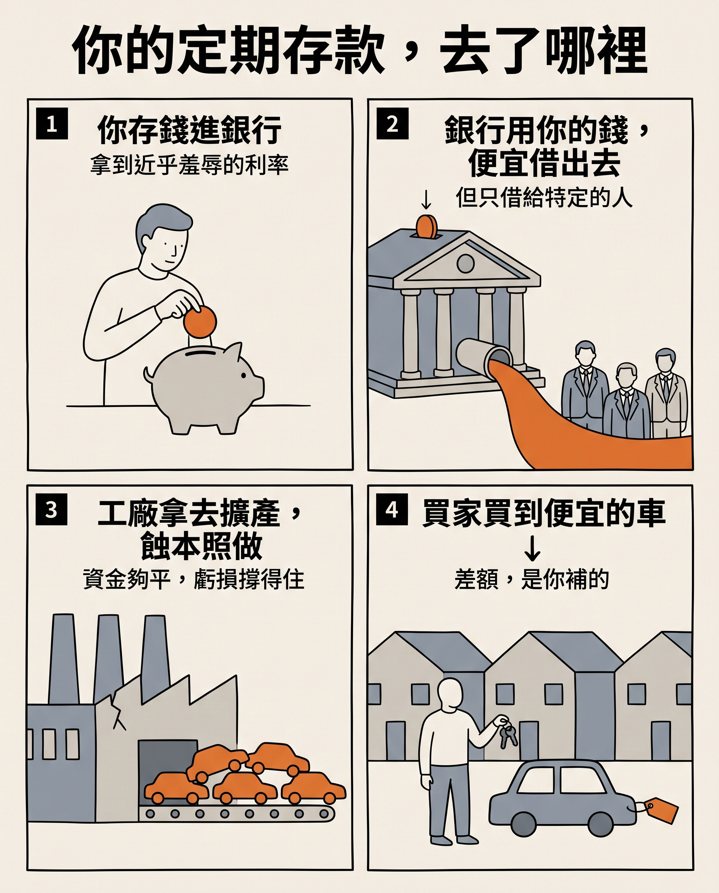

作者：星忘塵 Nebula Walker
Date: 26AUG2026
創象引擎 Mythogen Engine (mythogenengine.com)

**📌 中國的過度積累與美國的金融化不是兩種病，是一個系統的兩個器官——過去二十年，兩個體制一直在互相替對方拖延結帳。**

# 你的定期存款，補貼了德國人買車

## 一、一道有點滑稽的算術題

先看一組數字。

全球每年賣出的汽車，大約九千萬輛。而根據《外交事務》二〇二六年八月十三日刊出的〈下次全球經濟危機恐怕在中國〉，中國一國的汽車產能已經來到五千五百萬輛，國內每年的需求約一千二百萬輛。

也就是說：中國蓋了一個「全世界六成的車都由我來造」的產能，而自己只買得起其中的兩成多一點。

然後——還在繼續蓋。

這篇文章值得注意的地方，不在於它唱衰中國。唱衰中國的文章從二〇〇〇年代起就沒斷過，每年都有人宣布中國明年會爆，每年都沒爆。真正值得注意的是作者：Michael Froman，歐巴馬時期的美國貿易代表，現任美國外交關係協會會長。這人是自由貿易體制的信徒，職業生涯有一大半是在替全球化辯護的。當一個賣了半輩子自由貿易的人開始說「數學上兜不攏」，那通常不是立場問題，是他真的算了一遍。

而且要先說清楚：**Froman 自己並沒有預言崩盤。** 他明確寫的是，這場危機不會長成傳統金融機構那種一夜倒塌的樣子，而是透過工業利潤下滑、貿易糾紛增加、工廠倒閉、投資轉弱、政府干預加強，一點一點浮出來。中文世界轉述這篇文章時，很多人把它讀成了「支爆論」的最新一集——那是誤讀，而且是把最有價值的部分讀掉了。

順帶一提，這篇文章最容易被質疑的是產能數字的口徑（名目產能與有效產能可以差很遠）。但核心症狀有獨立來源：達拉斯聯準銀行的研究指出，中國約三成的工業企業處於虧損狀態，高於疫情前的兩成；以資產計，製造業中虧損企業的資產佔比從二〇一九年的 4% 出頭升到近 11%。

他的問題其實只有一句：

**如果一個國家在每一層產業都要占據越來越大的市場份額，那最後到底誰有錢買這些東西？**

## 二、「絕對優勢」這個標籤，好記但不準

Froman 借用了經濟學家黃亞生的詞：中國搞的是「絕對優勢經濟」。AI 我要、電動車我要、半導體我要，順便連成衣和廉價日用品也不放手——既跟德國搶汽車，也跟孟加拉搶紡織。這違反了比較優勢的分工邏輯。

這個標籤很好記。但它在經濟學上其實是鬆的，而且鬆的方式會誤導後面所有的推論。

補一堂三分鐘的李嘉圖課。

假設有一位律師，打字比他的秘書快一倍，整理文件也比秘書強。這位律師在兩件事上都有「絕對優勢」。那他應該自己打字嗎？

當然不應該。因為他打一小時字，就少賺一小時律師費。他該做的是把時間全部投進最值錢的那件事，把打字外包出去——即使外包給一個各方面都不如他的人。

這就是比較優勢的全部內容：**分工取決於相對代價，不取決於絕對本事。** 所以「中國樣樣都強」本身根本不構成理論矛盾。一個什麼都做得比別人好的國家，照樣應該退出低回報的產業，因為做那些事會擠掉高回報的產能。

那為什麼中國沒退出？

真正壞掉的不是比較優勢原理，是**逼你退出的那套機制**。正常情況下，這件事由三個價格訊號自動完成：匯率上升、工資上漲、資本回報下滑。紡織廠賺不到錢，老闆會自己把錢抽走，去做別的。沒有人需要開會決定「我們讓出紡織業」，台灣和韓國當年也不是開會決定的——是錢自己走了。

中國的問題是：**錢不走。**

為什麼不走？因為對某些人來說，錢太便宜。

這裡要立刻加一個限定，否則會被在中國做過生意的人一句話拆掉：**便宜的資金從來不是普遍供應的。** 中小民企的融資成本一向很高，甚至高得離譜。真正拿到近乎免費資本的，是國企、地方平台、以及被列為政策方向的產業。

所以準確的機制不是「錢很便宜」，是**錢的價格對不同的人完全不同**——而拿到最便宜資金的那批人，恰好是最不需要對回報負責的那批人。便宜到即使一門生意只有微薄利潤、甚至虧損，繼續做下去在帳面上仍然划算。

所以正確的診斷不是「什麼都想要」，是「價格訊號被壓住了」。這個差別有現實後果：前一種診斷開出的藥方，聽起來像是要中國自願退出某些產業——這是一句不可能執行的建議；後一種診斷指向的是利率、匯率與資本回報的硬約束，那才是有東西可談的地方。

還有一個常被忽略的前提值得補上。「爬上去了所以應該讓出下面」這個說法，預設了上面那一層真的賺得到錢。但中國的高端產業，很大一部分至今仍在投入期而非收成期——大飛機賣不動、晶片靠內循環撐、海外基建的獲利品質可疑。如果上層還沒有站穩到能養活自己，那麼死抓著低階製造就不是「不肯讓」，而是**沒有資格讓**：底層是現金流，上層是燒錢的地方。

## 三、補貼的真相：政府沒有撥錢給你，政府動用的是你

一講到中國產能，大家的直覺反應是「政府補貼」。腦中的畫面是官員拎著一箱現金走進工廠。

現實比這個有趣得多，也精巧得多。

北京大學的黃益平講過這條線的來源，而且講得毫不含糊。改革開放之後，中國政府的財政能力其實是一路萎縮的：財政收入佔 GDP 的比重，從一九七八年的 36% 掉到一九九六年的 11%。很多地方政府連「吃飯財政」都保不住——意思是連公務員薪水都快發不出來，哪來的錢去補貼企業。

沒錢，但又必須讓國企活著（因為國企倒了就是大規模失業，就是社會不穩）。怎麼辦？

答案是：**繞道金融體系。**

具體做兩件事。第一，把正規部門的存貸利率壓到極低。第二，在資金配置上明顯偏向指定的企業。於是國企拿到的資金不必按市場價格付費——用黃益平自己的話說，這實質上就是一種變相補貼。

財政做不到的事，改由存款戶來做。

這條線最完整的長期論述來自 Michael Pettis：他過去十多年反覆論證的核心是，中國的高投資與貿易順差不是儲蓄美德的結果，而是**所得從家戶被系統性轉移到生產端**的結果。本文第三、七兩節的骨架，基本上站在他和黃益平的工作上。

把這條線畫出來，你會看到一個相當有畫面感的東西：

你把積蓄存進銀行，拿一個低到近乎羞辱的利率。銀行把你的錢，用同樣低的價格借給一間長年不賺錢的工廠。工廠拿這筆便宜資金擴產，然後把車、把太陽能板、把鋰電池，用一個歐洲廠商無論如何做不到的價格賣到海外。

**你的定期存款，補貼了德國人買車。**

這不是修辭。這是資金流向的直述句。

而且抽取不只一條管道，是兩條。

第一條是**儲蓄**：存款利率被壓在通膨附近甚至之下，你的積蓄每年悄悄縮水一點。第二條是**工資**：勞動報酬長期低於產出價值，勞動佔國民所得的比重被壓在低位。同一批人，同時以儲蓄戶和勞動者的雙重身分在為那些產能付費——一次在他們存進去的時候，一次在他們賺到手之前。

所以「補貼」這個詞太簡化了。成本從來沒有消失，它只是換了地方待著——待在銀行的壞帳裡、待在地方政府的債務裡、待在居民存款那筆永遠追不上通膨的回報裡。這是一套把成本從損益表趕進資產負債表、再從資產負債表趕進時間裡的技術。

而它精巧的地方在於：被抽走的那些人，很難意識到自己正在付錢。財政補貼會出現在預算案上，會有人質詢。低息存款不會出現在任何地方，它只是「今年利息好像又少了一點」。

## 四、內捲不是一盤棋，是三十個省各自的理性

.jpg)

那篇文章有一句我認為是全篇最脆弱的：把「內捲」說成習近平遂行政治掌控的實踐方式。

這是把**湧現的結果**當成了**設計的意圖**。

內捲的機制有非常清楚的來源，而且遠早於現任領導人。一九九四年分稅制改革之後，地方的財政收入被中央抽走一大截，招商引資與賣地變成地方唯一的補血管道；再疊上以 GDP 和投資額為核心的官員晉升錦標賽（這個機制的經典分析出自經濟學家周黎安）——於是每一個省都有強烈動機，把同一個產業在自己的地界上再蓋一遍。

不是為了讓全國賺錢，是為了本地的帳面數字和本地的就業。

三十個省，各自完全理性。加總起來，就是五千五百萬輛產能對一千二百萬輛內需。

**這是協調失敗，不是計劃。** 真正的計劃者不會這樣配產能——如果真有一盤棋，數字不會長成這副樣子。

而這還只是推力的一半。

另一半來自家戶那一端，而且是更硬的約束：**人要有工開。**

每年上千萬名畢業生要有地方去，這個數字沒有商量餘地。社會供應不了那麼多職位，於是人就自己去找——哪裡看起來還有得賺，就往哪裡鑽，什麼行業都有人去試。做出東西要賣，水平不夠就只能靠便宜；要密食回本，就只能傾銷。白菜價就是這樣長出來的。

而地方政府看到有人替自己創造就業，當然支持。

於是兩端在同一個地方成交：**政府需要投資項目，人民需要工作崗位，成交的產物就是又一條產線。** 一端推、另一端也推，中間沒有一個踩煞車的角色。

討論串裡有人用一句更白的話講完了整件事：根本沒有人在下棋，貪官哪有那麼醒。

「叫不停」不是意志問題，是兩端同時在推。

最直接的反證是北京自己。近兩年「反內捲式競爭」已經進入了最高層級的官方語言，價格戰、車企拖欠供應商帳期、光伏產能，都被逐一點名。如果內捲是統治工具，中央沒有理由反對自己的工具。更合理的讀法是**想收但收不動**：關廠的成本落在地方財政與地方就業上，而承擔成本的人，跟下令的人不是同一批。

不過也得給 Froman 一半公道。習時代確實多了一層東西：產業政策的選題邏輯，從「什麼賺錢做什麼」轉向「什麼卡脖子做什麼」，安全壓過回報。所以政治意圖不是零——但它作用在**方向選擇**上（為什麼是半導體、電動車、AI），不作用在**內捲機制本身**（為什麼每個省都要做一遍）。

把兩者混為一談，就會得出「這東西可以由一個人叫停」這個既樂觀又天真的結論。

## 五、鏡子的另一面：過度積累 vs 金融化

現在把鏡頭轉一百八十度。

美國過去三十年被批評得最兇的病，叫金融化（financialization）：企業不再把錢投回營運，改為回購股票、外包生產、砍研發，把資源往資產價格那一端送。

表面上看，這跟中國的產能過剩是兩個世界的事——一個投資太少，一個投資太多，一個是資本主義的極端，一個看起來像社會主義的餘燼。

但它們操作的是**同一根槓桿，只是方向相反**：

| | 資本的價格 | 企業的反應 | 症狀 |
|---|---|---|---|
| **美國** | 被抬高（資產端回報太肥） | 不投資也賺錢 | 空心化、產業能力流失 |
| **中國** | 被壓低（資金太便宜） | 蝕本也繼續投 | 產能過剩、通縮式競爭 |

共同的病理只有一句：**資本回報率與投資決策脫鈎。** 一邊脫鈎向上，一邊脫鈎向下。

如果要給這兩條路徑各一個名字：美國那一側是金融化，中國那一側是**過度積累**（over-accumulation）。

這裡要老實補一句：在馬克思與 David Harvey 的原始用法裡，過度積累其實是**兩邊共同的前提**——資本在生產端找不到有回報的出口，於是必須另尋去處；金融化正是其中一條出路，把資本切換到資產與請求權的循環裡。所以嚴格說，中國那一側應該叫「實體端的過度積累」，美國那一側是「金融端的過度積累」。同一個病根，兩種發作方式。

還有一個差異值得寫出來，因為它是這個對照最鋒利的地方。馬克思意義上的過度積累，成因是**資本家追逐利潤**：有機構成上升、利潤率下滑、資本仍被迫繼續積累。而中國那一側的成因剛好相反——**配置資金的人根本不在逐利**。地方政府配的是就業與晉升，銀行配的是政策指向。

症狀一模一樣，引擎完全相反。用馬克思的詞去描述一個社會主義遺產體制的病，這個反諷本身就是論點。

而更根本的是，兩邊在回答同一個問題——**太多錢，沒有地方去。**

美國把過剩的儲蓄變成資產價格，中國把過剩的儲蓄變成鋼筋水泥和生產線。到最後，兩邊手上都握著一堆兌現不了的請求權：一邊是賣不掉的估值，一邊是賣不掉的產能。

## 六、那這到底算資本主義，還是計劃經濟？

直覺會說：中國那一套明明就是計劃經濟。

但這裡有一個很硬的反證，來自匈牙利經濟學家 Kornai János。他一輩子研究社會主義體制，得出的核心結論是：**計劃經濟的病是短缺，不是過剩。**

原因是軟預算約束——企業虧了不會死，資源不夠也不會倒閉，於是拼命囤積原料、產出不對需求負責。結果就是蘇聯、東歐、毛時期中國的共同景觀：排隊、票證、什麼都缺。

而中國現在的症狀是完全相反的那一極：跌價、爆倉、產能利用率不足、全行業虧損。

同一個零件，換一個環境，症狀就翻轉：

- 軟預算約束 **＋ 沒有競爭、沒有價格** → 短缺
- 軟預算約束 **＋ 分散進入、殘酷價格戰** → 過剩

所以它不是計劃經濟的延續，而是計劃經濟的一個零件，被移植進了市場競爭之後長出來的東西。

那它算資本主義嗎？看你切在哪一層。

比亞迪、寧德時代、隆基——民營、上市、有外資股東、被投行覆蓋、發股權激勵、價格戰打到見血。從所有權到產品市場，這是徹頭徹尾的資本主義，而且是比美國更兇狠的那一種。整個體系裡真正非市場化的只有一樣東西：**資金的價格。**

於是真正的對稱長成這樣：

- **中國**：產品市場超級市場化 ＋ 資本市場非市場化
- **美國**：資本市場超級市場化 ＋ 產品市場租金化（平台壟斷、監管俘獲、專利與網絡效應收租）

兩邊都是一邊過度、一邊失效，只是失效的那一邊不同。這個切法比「資本主義 vs 計劃經濟」更能解釋，為什麼兩種病灶長得完全不像，卻同源。

## 七、其實不是兩個系統，是一個系統的兩個器官

.jpg)

前面兩節把中美擺成一面鏡子的兩邊。但停在這裡就會漏掉更重要的一層：這兩邊不只是形狀相反，它們**互相供養**。

把血管畫出來，是一個閉環：

1. 中國壓低居民所得與消費 → 儲蓄過剩 → 貿易順差
2. 順差回流美元資產（國債、機構債）→ 壓低美國的長端利率
3. 便宜資金 ＋ 便宜商品 → 美國通膨溫和 → 聯準會可以長期維持低利 → 資產價格上升 → **金融化拿到燃料**
4. 美國的債務型消費 → 吸收中國的過剩產能 → **中國不必再平衡**
5. 回到第一點

這不是新發現，只是從來沒有人把兩邊的病理寫進同一句話。葛林斯潘二〇〇五年講的那個「謎題」——聯準會升息而長端利率不動——講的正是第二步；柏南克同年提出「全球儲蓄過剩」來解釋它。後來有人叫這套安排 Bretton Woods II，也有人叫它 Chimerica。

**而互相抵消的部分，比互相依賴更關鍵。**

金融化把美國勞工的所得份額壓了下去。照理說這會很快引爆政治。但它沒有——因為在同一段時間裡，產能化把商品價格壓了下來。

工資不漲，但東西變便宜，於是生活水準的帳面沒有立刻崩掉。

這是一筆**雙向的政治補貼**：中國靠出口吸收了本來會炸在自己國內的產能，美國靠廉價商品吸收了本來會炸在自己國內的分配矛盾。兩個體制各自把自己最危險的那顆炸彈，寄放在對方家裡。

**但這個抵消有期限，而期限已經到了。**

廉價商品只能抵消掉「買東西」那一部分的生活成本。而美國家庭的支出結構這二十年一路往服務、住房、醫療、教育傾斜——那些**恰好是中國造不便宜、而資產通膨造得更貴的東西**。

於是同一套系統的兩端同時反噬：電視機和衣服越來越便宜，房租、醫療和學費越來越貴。抵消停止生效的那一刻，就是政治轉向的那一刻。二〇一六年之後的一切，都可以從這句話讀起。

還有一個更難堪的推論。既然工資的購買力有一大截是靠壓低的商品價格撐起來的，那麼歐美家庭這二十年真實的購買力，其實比帳面上看起來低——差額是由另一邊被壓低的工資和存款利息補上的。

所謂「中產生活水準維持住了」，有一部分不是自己賺回來的，是別人替你墊的。

**還有一個問題是：現在還能分散給誰。**

美國這個吸收口正在關上，但過剩不會消失，它只會改道——歐盟、東協、拉美、非洲。麻煩在於**每一個新的接收方都更小、更沒有能力吸收**，而且沒有一個握有儲備貨幣地位、可以把順差重新變成安全資產送回去。

過去，過剩產能換回來的是美元請求權；現在換回來的，越來越是應收帳款、基建債權和政治摩擦。閉環正在退化成開環。

最後要提防一件事。「兩個系統因為互補所以能共存」這句話，很容易滑進功能論的陷阱——把「事後看起來互補」讀成「因為互補所以存在」。

這正是本文第四節拒絕過的推理：湧現的結果不等於設計的意圖。沒有人設計過這個閉環，它是兩邊各自為了國內理由做決定，然後碰巧咬合了二十年。準確的說法是**碰巧咬合，然後互相鎖死**——不是因為需要彼此才形成。

## 八、那筆便宜到底進了誰的口袋

到這裡為止，這篇文章回答的是**供給側的問題**：世界上為什麼會出現這麼一場廉價商品的洪流。

還有一個問題沒有回答，而且它其實更貼近多數人的日常：那筆被壓下來的商品價格，好處究竟落在誰身上？

答案不像想像中那樣落在消費者手上。我把香港、深圳、中國內陸與台灣四個地方擺在一起查過一遍，結論是沒有任何一格的人真的拿到——那筆便宜在最後一哩被地租截走了。

那是另一篇文章的內容（[〈四個地方，沒有一個人拿到那筆便宜〉](/docs/TechNotes/四個地方，沒有一個人拿到那筆便宜)）。這一篇只處理它是怎麼被造出來的。

## 九、什麼時候會爆？這個問題本身就問錯了

「結構性問題」跟「即將崩潰」是兩件事。

中國體制的特殊能力，不在於避免虧損，而在於**把虧損切碎、攤給沒有議價權的人**：存戶拿低息、供應商吃長帳期、農民工吃欠薪、地方財政吃展期。西方式的邏輯是立即出清——你付不出錢，法院就來了。這裡的邏輯是拖：展延、重組、資本管制、社會控制。

所以問「什麼時候爆」，二十年來都問不出答案。

換一個問法會有用得多：**損失還能攤給誰？那份名單什麼時候用完？**

這個問法的好處是它有可觀察的代理指標，而且全部是公開資料：

- 車企對供應商的實際付款週期（帳期拉到幾天）
- 商業承兌匯票的違約率
- 城投債的展期比例與再融資成本
- 居民存款的搬家方向（定存搬去哪裡）
- 存款利率相對於通膨的實質水平
- **歐盟的貿易決定**——美國的打法已經定了，歐盟還沒。全球到底還能吸收多少中國產能，很大一部分寫在布魯塞爾接下來的關稅與補貼調查裡

最後一項的份量常被低估。德國一向是對中貿易最堅定的受益者與辯護者，而根據 Rhodium Group 的數字，二〇二五年德國對中國的商品出口已經跌到十年來最低，比前一年少 9.3%，比二〇二二年的高峰少了 23%。當最大的既得利益者開始虧損，歐盟內部原本頂住保護主義的那道牆就會鬆動。

**而且這件事不只發生在中國。**

「虧損企業靠續貸活下去」有一個通用的名字：喪屍企業。OECD 的系統性研究發現，當喪屍企業佔據一個行業的資本份額越高，健康企業的投資與就業增長就越低——低生產力企業賴在退出邊緣不走，會堵住市場、拖慢資源重新配置。

達拉斯聯準銀行的研究則給了中國的量級：非金融企業的喪屍資產佔比從二〇一八年的 5% 升到二〇二四年的 16%，其中房地產從 6% 飆到 40%，製造業從 4% 升到 11%。

歐洲也有自己的版本：歐洲央行的數據顯示，疫情前歐元區的喪屍企業佔比仍高於金融危機前，而且銀行對這些企業的貸款利率幾乎沒有反映它們更高的違約風險。

**但引用這類數字之前，必須先講清楚一個陷阱。**

喪屍企業最常見的定義是「利息保障倍數連續三年低於 1」——分母是利息支出。**升息本身就會機械性地把一批公司推進名單**，即使它們的營運完全沒變。

所以近年各國喪屍企業數字創新高，有相當一部分是利率正常化的算術結果，不是新的腐壞。

而這件事想清楚之後反而更重要：真正的變化不是企業突然變差了，是**便宜資金這件事結束了**。過去二十年那套靠壓低資金價格運作的系統，現在利率把帳單寄了回來。

日本是目前唯一一個真正在動手清算的主要經濟體——結束負利率之後，破產數字升到十多年來的高位，而喪屍企業數量出現多年來的首次下降。代價很明顯，方向也很明顯。

盯這些，比盯任何一次官方表態都準。

## 十、梯子從來不是被放下來的，是被成本推倒的

這是整場討論裡最值得帶走的一節，也是我原本寫錯、後來被讀者拆掉的一節。

流行的說法是這樣：過去七十年，後進國家工業化的路徑只有一條——先做鞋、做成衣、做玩具，賺外匯、養出第一代產業工人、累積資本，然後往上爬。日本這樣走，台韓這樣走，中國自己也是這樣走上來的。現在中國爬到樓上了，卻不肯把梯子放下來。

聽起來很有道德重量。問題是：**梯子從來沒有人「放下」過。**

台灣讓出成衣，韓國讓出鞋業，日本讓出紡織——沒有一次是慷慨，全部是工資漲到做不下去、被成本推走的。歷史上沒有任何一個國家，在還賺得到錢的時候自願退出過任何一層產業。所謂的梯子，其實是一個**不情願的、由價格造成的讓位**。

所以中國打斷的不是誰的善意，是那個機制本身。當資金成本被壓到近乎為零，工資上漲就不再構成退出的理由——虧損可以靠更便宜的資金撐住，撐到對手先死。梯子沒有被誰收走，是**撐住梯子的那條物理定律被關掉了**。

這樣講，論點反而更硬：它不需要訴諸道德，只需要指出價格機制失靈——而那正是本文從第二節開始就在講的同一件事，第二次出場。

而且梯子在另一頭也正在被拆。經濟學家 Dani Rodrik 有一個概念叫「過早去工業化」：後進國家在遠低於當年台韓的人均所得水平上，製造業佔就業的比重就已經開始下滑。原因是自動化——同樣的產值，需要的工人越來越少。討論串裡有人一句話講完了這件事：等到地球上最後一個人的工錢都貴過機器，那就全部改用機器。

所以真正的最後一個對手不是中國，是機器。中國是加速器與放大器，不是唯一成因。

而同一條邏輯在中國國內也成立，只是很少人這樣講：**用工業去吸納全民就業，本身就是一條死路。** 現代生產技術的人均產出，早就超過了人均所需——在這個前提下，不斷擴產能的終點只能是內捲到死，因為多出來的產能找不到對應的需求，多出來的人也找不到對應的崗位。

發達國家當年是靠第三產業去接住這批人的。中國沒有走這條路，原因回到第三節：服務業要壯大，得先有人有錢消費，而消費力正是被壓下去換取產能的那一項。

於是繞回原點——不肯加工資，就撐不起內需；撐不起內需，就只能繼續靠出口消化產能。

這個修正決定藥方。如果把責任全部算在中國頭上，開出來的處方就是關稅、去風險、供應鏈重組——但那些手段沒有一項能把梯子放回去，因為梯子本來就不是誰放的。真正能替代它的東西（給後進國家的資本、技術轉移、市場准入、以及對自動化衝擊的重新分配），現在幾乎沒有人在認真談。

## 十一、那中國經濟會往哪裡走

先排除兩個極端。

**不會是崩潰式出清。** 理由就是〈什麼時候會爆〉那一整節：這套體制的核心能力是分攤損失，而不是承認損失。Froman 自己的判斷也是漸進的——利潤下滑、糾紛增加、工廠關門、投資轉弱、干預加強。這是一條下坡，不是一道懸崖。

**也不太可能是順利的再平衡。** 技術上該做什麼，其實所有人都知道：把資源從生產端交還居民——社保覆蓋、戶籍鬆綁、財產稅取代土地財政、國企分紅劃入社保。卡住的不是知識，是政治。因為那等於削弱地方政府與產業部門對資源的控制權，而那正是這套體制的權力基礎。要一個體制自願拆掉自己的分配管道，難度不在經濟學裡。

所以基準情形是中間那條：**中國版的資產負債表衰退。**

日本一九九〇年代的特徵是企業從「利潤最大化」轉為「債務最小化」，於是放多少水都推不動信貸。中國的版本有三點不同，而且三點都更糟：

1. **來得更早。** 日本是富起來之後才停滯，中國是在人均所得遠低於當年日本的水平上就撞牆——未富先滯。
2. **外部環境敵對。** 日本當年至少還能靠出口消化，現在關稅牆正在四面合攏。
3. **多一層地方政府債務**，而且與土地價格死死綁在一起。房價跌，地方財政同步失血。

但也有兩點緩衝，是日本沒有的：資本管制讓錢跑不掉，國有銀行體系不會發生擠兌。這兩樣東西買不到解決方案，但可以買到時間——很長的時間。

所以合理的預期形態是：**名目增長還在，但增長不再帶來利潤。** 增產不增收，出口份額繼續上升直到外部關門，通縮壓力主要來自產能而不是需求崩塌，而居民的體感會是「東西越來越便宜，但工作越來越難找」。

在這條主線上，有三個分岔值得盯：

- **外部急性衝擊**：歐盟與美國的關稅同時收緊，出口閥門變窄，過剩產能回流國內，通縮加劇、工業利潤與就業同時被壓。這是最快的一條路徑，而且觸發點在布魯塞爾和華盛頓，不在北京。要注意的是，按第七節的閉環邏輯，這條路徑不會只有中國付帳——血管是雙向的，剪斷之後美國也會第一次面對沒有廉價商品的真實通膨，和沒有順差回流的真實資金成本。關稅牆從來不是單邊的懲罰工具。
- **內部慢性拖延（基準）**：靠居民存款、供應商帳期、債務展期一年一年撐下去。這條路可以走得比任何人預期的都久。
- **被動出清**：不是政策轉向，而是虧損累積到地方財政再也撐不住，出清由財政能力枯竭強制發生。這是最痛的版本，因為它不由任何人選擇時點。

也該公平地放上另一種讀法。政策圈與部分產業分析者認為，製造業升級最終會撐起生產力與工資，內需自然跟上——電動車、電池、光伏這些產業一旦完成出清、剩下幾家真正賺錢的巨頭，中國就會走完當年日本汽車業和韓國半導體走過的路。這個版本並非沒有根據：全行業虧損之後留下贏家，本來就是資本主義的常態劇本。分歧在於，那個出清要死多少人、要花多少年，以及外部世界願不願意在那段時間裡繼續當買家。

我的判斷是：形態會像日本，時間會比日本長，痛感會比日本廣，而且過程中最先被壓縮的，永遠是那些沒有議價權的人。

但這是判斷，不是預言。上面那份指標清單的用處，正是在於它能讓你在事情發生的時候知道自己看到了什麼——而不是每年重複一次「明年就爆」。

## 十二、結尾：兩個體制在互相替對方拖延結帳

有人在討論串裡寫了一句很乾淨的話：**過剩不等於豐富。** 豐富是你用得完，過剩是你用不完；豐富是財富，過剩是浪費。

這句話同時適用於兩邊。一邊把過剩的錢變成了買不起的房子和撐得太高的估值，一邊把過剩的錢變成了賣不掉的車和發不出電的電池。

但比這個對照更該記住的，是它底下那件事：

那不是兩個壞掉的系統，是一個系統的兩個器官。一個負責生產全世界買不完的東西，一個負責生產全世界還不完的請求權，兩者靠同一條血管相連。

所以關稅牆真正的意義，不是懲罰中國——是把那條血管切斷。而切斷之後發生的事，比較準確的說法不是失血，是**戒斷**。

歐美這二十年靠中國的商品價格壓住通膨，那不是外在的補給，是已經長進代謝裡的東西。一戒，物價就會回到它本來的樣子——而人們會把那個過程體驗成「通膨失控」，會去找罪魁禍首，卻很難接受真正的答案是：原來自己那份薪水的購買力，本來就沒有那麼高。

中國那一邊的戒斷同樣難受：沒有外部買家之後，它要第一次獨自面對自己造出來的產能。

過去二十年不是兩個體制在競爭。是兩個體制在互相替對方拖延結帳。

Froman 自己在文章裡留了一句更冷的話：就算下一場危機是中國製造的，善後的工作，最後多半還是會落在美國和它撐著的那些機構身上。

他大概沒有把這句話想到底。那筆帳從來就是共同署名的——只是兩邊都以為欠的是對方。

## 附註：這篇文章欠誰的

寫評論最容易犯的毛病，是把讀來的東西講成自己的發現。所以把帳算清楚。

**不是我的：**

- 中國以壓低利率與偏向性配置，把家戶所得轉移到生產端——Michael Pettis 論證了十多年；黃益平提供了財政能力萎縮這條成因線
- 分稅制與晉升錦標賽如何製造重複投資——周黎安
- 軟預算約束，以及計劃體制為何產生短缺——Kornai János
- 中美之間的儲蓄—順差—低利率閉環——柏南克的「全球儲蓄過剩」、葛林斯潘的長端利率之謎，及後續的 Bretton Woods II 與 Chimerica 諸說
- 過早去工業化——Dani Rodrik
- 比較優勢為何不因「樣樣都強」而失效——李嘉圖，一八一七年
- 就業作為硬約束、「用工業吸納全民就業是死路」、「戒斷」這個比喻、以及對「抽走梯子」的第一次質疑——來自一個公開討論串裡的匿名參與者，他們比多數署名評論更早講到重點

**是我的：**

- 把金融化與過度積累放在同一根槓桿的兩端來讀，而不是當成兩種對立體制
- 梯子從來不是被放下的，是被成本推倒的——把一個道德敘事換成價格機制敘事
- 以及把上面所有零件裝進同一台機器裡的那個裝法

整合本身是不是原創，見仁見智。但如果這篇文章有價值，價值在裝配，不在零件。

---

*本文是一組三篇的第一篇。第一篇處理便宜商品是怎麼被造出來的；第二篇[〈四個地方，沒有一個人拿到那筆便宜〉](/docs/TechNotes/四個地方，沒有一個人拿到那筆便宜)處理那筆便宜最後流去哪裡；第三篇[〈錢不走，人也不走〉](/docs/TechNotes/錢不走，人也不走)處理退出機制為何失靈。系列落地頁見[《退出機制三部曲：便宜的代價》](/docs/TechNotes/退出機制三部曲)。*

*資料出處：Michael B. G. Froman, "The Next Global Economic Crisis Could Be Made in China: How Overcapacity Ends," Foreign Affairs, 2026 年 9/10 月號（線上刊出 8 月 13 日）；財政佔比與金融抑制機制引自黃益平於北京大學國家發展研究院之公開演講；德國對中出口數據引自 Rhodium Group，轉引自前述 Froman 文；「過早去工業化」概念出自 Dani Rodrik；軟預算約束出自 Kornai János。*
