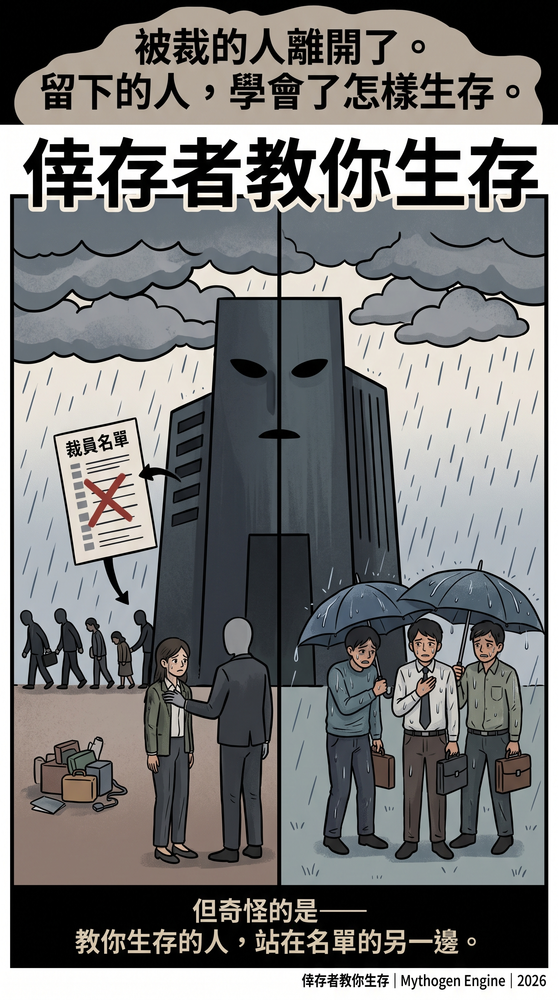
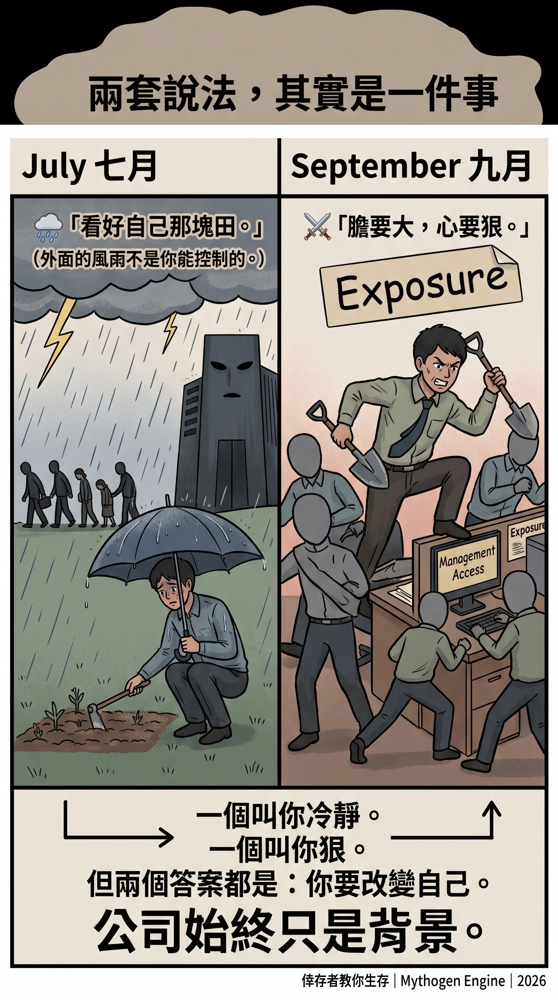
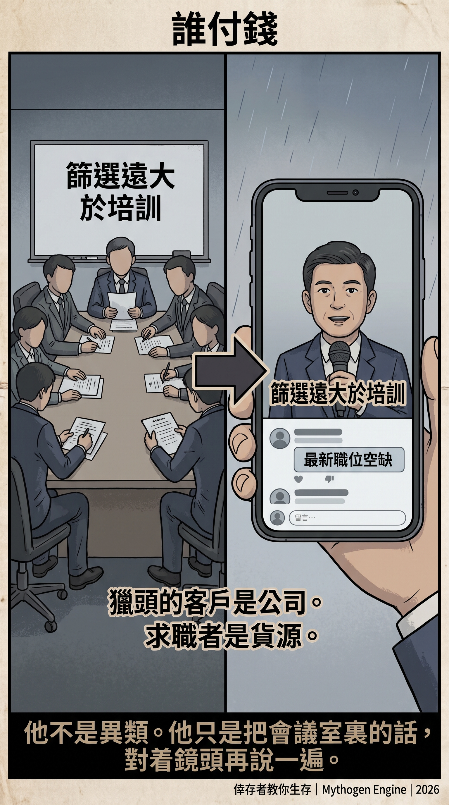
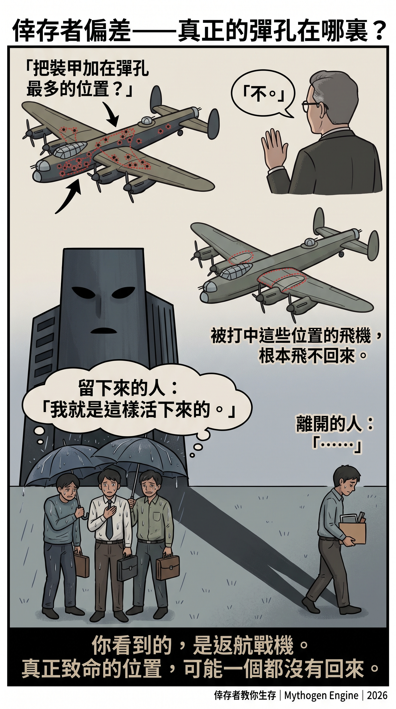
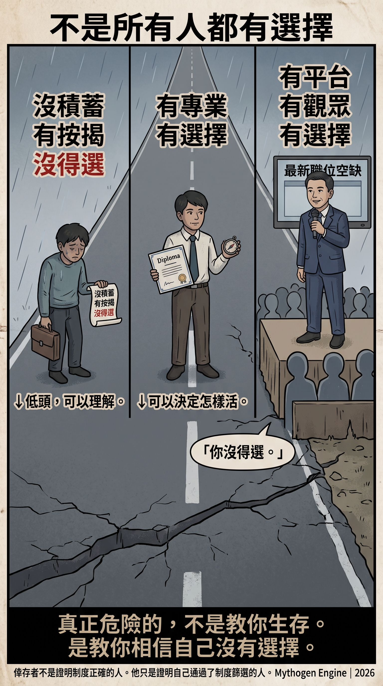

# 倖存者教你生存

2026年9月28日 · @Mythogen Engine

**一位 HR 兼獵頭的六十條職場法則，以及它們沒有說出口的下半句**

今年七月，香港一個職場頻道上載了一條影片，說被裁員其實是解脫，真正慘的是留下來的人。講者說，被裁的人拿了賠償，拍拍灰塵去找下一份工；留下的人卻困在一個叫「倖存者」的孤島上，看着風暴在頭頂盤旋。

九月，同一個頻道一連兩集，讀出六十條「社會生存法則」；月底再出一條，講 AI 時代的職場未來。

頻道叫 Jem Choi Amazing Recruitment。講者做過人事部，也做獵頭，專業是替公司找人，同時教打工仔怎樣找工、怎樣打工。每條影片的置頂留言，都是最新的職位空缺。

看完這四條影片，我最想說的不是他說錯了。恰恰相反，六十條裏有幾條，比很多管理學書本都說得準。問題在於說完之後，他教大家做甚麼。

## 一、這幾條，他說對了

第十八條是這樣的：職場潛規則，是表揚溜鬚拍馬的，提拔指鹿為馬的，冷落當牛做馬的，整治單槍匹馬的。

他自己解釋最後一句：不肯加入任何派系，或者能力太強卻不聽話的孤狼，沒有背景和靠山，最容易在利益衝突時被抓出來殺雞儆猴，被集體排擠。

這不是陰謀論。在大機構待過幾年的人，大概都見過這樣的人，也見過他怎樣離開。

第十六條說，學校教的是仁義道德，出來社會才發現到處都是男盜女娼。第十一條說，你窮不是因為懶，也不是因為沒本事，而是因為你賺的錢太乾淨。

三條加起來，他承認了三件事：制度不獎勵老實人；社會說一套、做一套；乾淨的錢不夠用。

九月底那條影片也有說對的地方。他說 AI 一下子給你十幾個方案，沒有判斷標準的人，只能挑一個看起來順眼的；又說不懂行的人，只會變成老闆和 AI 之間的傳聲筒。這兩點，我同意。

如果影片停在這裏，我會轉發。

## 二、兩種語氣，同一個功能

七月那條影片語氣很溫柔。他叫留下來的人當氣象員，每天出門看雲往哪裏飄；當修錶匠，看清公司的齒輪怎樣咬合，然後順着齒輪轉；最後當農夫，每天看自己那塊田。

影片的結語是：職位、主管的臉色、環境的變動，都是外在的天氣；你的技能、精力、心態，才是你自己的田。不要管外面風雨多大，安心看好自己那塊田。

比喻很美，只有一個問題：天氣沒有人負責，裁員有。

裁員有會議，有名單，有人簽字。把它說成風暴，簽字的人就消失了，剩下一個站在雨中、檢討自己帶不帶傘的打工仔。

九月的語氣完全相反。膽要大，心要狠；五成精力做事，五成精力讓上司看見；不要同情心氾濫，去幫能力不佳的同事。

一個叫你冷靜，一個叫你狠。語氣南轅北轍，功能卻一模一樣：問題在你身上，答案也在你身上。兩條影片裏，公司都只是背景，從來不是主語。

九月底那條影片補上了最後一塊。他說公司裁員從來不是一夜之間的決定，中間總有一段緩衝期；很多人被裁，是因為沒有察覺環境在變，一直原地踏步。

七月叫你當氣象員看天氣，九月底告訴你，被裁是因為你沒看天氣。前後完全一致，一致的地方在於：那個決定裁員的人，始終不在畫面裏。

## 三、從「是這樣」到「應該這樣」

六十條真正的技巧，不在任何一條之內，而在每一條的下半句。

「你窮是因為賺的錢太乾淨。」上半句是觀察，下半句沒有說出口，但整條影片都在替它鋪路：所以，請你髒一點。

「職場提拔指鹿為馬的。」上半句是觀察。下半句他說出來了：學會向上管理，令主管看見你的價值，懂得站邊。換句話說，既然制度獎勵指鹿為馬，你就去學指鹿。

兩百多年前，休謨已經提醒過，從「是甚麼」推不出「應該做甚麼」。世界是這樣，不等於你應該這樣。中文有一句更早、更短的話說同一件事：有所為，有所不為。那條縫，就是人之所以為人的地方。

六十條的工作，是把這條縫填平。

填得最徹底的是第三十條：人為甚麼喜歡講道德？因為講道德可以道德綁架別人，顯得自己很有高度。

把第十六條和第三十條放在一起讀：社會確實說一套、做一套；但指出這件事的人，是偽善。假面是真的，揭穿假面的人才是假的。唯一可以說「這樣不對」的語言，就此被沒收。

到了這一步，一個人即使知道自己受了傷，也找不到一個字去說它錯。

## 四、框架決定你怪誰

說這類建議害人不淺，不是修辭。這件事有人認真研究過。

社會學家 Ofer Sharone 在《Flawed System/Flawed Self》（2013）比較美國和以色列的失業白領。美國的求職輔導教人推銷自己，講「化學作用」，講態度；以色列的求職制度偏重履歷條件的篩選。結果兩邊同樣失業，美國人傾向覺得是自己有缺陷，以色列人傾向覺得是制度有問題。

決定一個失業者怪自己還是怪制度的，往往不是他的處境，而是別人遞給他的框架。

Barbara Ehrenreich 寫過兩本相關的書。《Bait and Switch》（2005）是她假扮失業白領，走進職涯教練、求職講座和人脈活動的紀錄；她發現整個產業賣給失業者的，是態度。《Bright-Sided》（2009）則記錄了公司在裁員期間請來勵志講者，安撫留下來的人。七月那條倖存者影片，做的是同一份工作，只是不用公司付講者費。

Mark Fisher 在《Capitalist Realism》（2009）把這個動作叫做壓力的「私有化」：結構製造的痛苦，被重新定義成個人要自行處理的問題。「看好自己那塊田」，就是私有化的田園版本。

最後是代價。史丹福大學的 Jeffrey Pfeffer 在《Dying for a Paycheck》（2018）整理他與同事的研究，估計美國每年約有十二萬宗額外死亡，與長工時、工作不穩、職場衝突等管理做法相關。

職場做法本身會傷人，這一點已有研究支持。教人把這些做法當成天經地義、再自我調整去適應它的內容，便是在替傷害省掉解釋。

> 【作者註：Pfeffer 的數字引用前請核對原文】

## 五、誰付錢

人事部和獵頭，一個在公司裏，一個在公司外，收錢的一方都是僱主。

人事部處理入職和離職，寫文件，讀遣散的講稿。獵頭替公司找人，按成功配對收費。獵頭的客戶是公司，求職者是貨源。一個同時做過兩邊的人，出來教打工仔怎樣找工、怎樣生存，他看世界的角度，天然是從僱主那邊望出去的。

這不需要猜任何人的動機。他的影片是免費的，因為你不是客人。置頂留言已經把商業模式擺出來了：先給你生存法則，再給你職位空缺。

也不必把他當成異類。他說的這一套，正是人事和招聘這一行看人的方式：人是要篩選的貨源，問題出在人身上，答案也在人身上。我見過的人事部，在會議室裏就是這樣討論員工的。

他只是多走了一步，開了一個頻道，把會議室裏的話對着鏡頭再說一遍。所以這四條影片真正的價值，是一扇窗：讓打工仔看見，坐在桌子另一邊的人，怎樣看你。

我在《JD 很豐滿，現實很骨感》【連結】裏寫過兩把尺：一線的人量的是做得好不好，做決策的人量的是划不划算。人事部和獵頭，正是第二把尺的工具，卻說着第一把尺的語言：技能、努力、態度、邊界感。

## 六、位子不夠坐

先看第三十九條：窮人只知道安守本分、不折騰，一輩子就是窮人。他的建議是主動爭取高難度、有曝光機會的項目，收工後做自媒體、副業、進修。

我在同一篇文章寫過工廠怎樣租用年輕女工的「希望期」：新人相信前面有一道階梯，付出的努力遠超那份薪水；看清天花板之後，努力便回落。換不到新人，工廠就改用恐懼，把舊人逼回拼命期。

第三十九條連恐懼都省了。它把希望期重新賣給已經看清天花板的人，讓他們自願交出多出來的那一份。

九月底那條影片，把另一扇門也關上了。他說「能力差一點沒關係，態度好就行，慢慢教」這一套已經落後，成年人的思維和責任感很難改，篩選遠大於培訓。

白領世界的希望期，本來靠「慢慢教」支撐：應屆生和初階職位，是公司願意花時間把人教好的地方。篩選大於培訓的意思是，公司不再負責把人教好；你好不好，是你本身的底子。

人類學家 Clifford Geertz 把這種狀態叫「內捲化」（involution）：投入的勞動不斷增加，每個人分到的卻沒有增加。位子依然不夠坐，只是每個人坐得更用力。

同一條影片還有一個建議：沒有死線，就自己設一條；原本一天做完的事，試試兩小時。這是內捲的自助版，連施壓都不必公司出手。

今天，這套說法多了一個新背景：AI。九月底那條影片說得很坦白：好公司會越來越少請人，一個職位寧願空置半年，也不想隨便找人填滿。位子少了，同一條影片接着教你怎樣成為值得坐那張椅子的人。

很多人以為，令位子變少的是 AI。但 AI 本可以讓人少做重複的工作，生產力提升的收益，本可以讓更多人坐得下。

把它變成內捲藉口的，不是技術，而是金融化的資本邏輯：回報要在這一季看見，成本要先從人身上省下來。我在《效率陷阱・續章》【連結】寫過一句：AI 不是原因，是牌照。六十條教你的，是怎樣在領了牌照的人面前，坐得更用力。

還有第四十七條：AA 制聚餐是無效社交，弱者之間平分的聚會換不到有價值的資源。在一個人人自危的地方，同路人之間的那頓飯，可能是唯一能互相核對「是不是只有我這樣」的場合。六十條把它歸類為浪費。

九月底那條影片的標題，叫「平庸的圈子正在同化你」。他建議每季抽兩天，去見大公司的朋友、獵頭和投資人。向上的人脈叫環境，同層的人脈叫浪費。

這與我在《效率陷阱・續章》【連結】寫過的現象是同一件事：大多數人贏不了規則，於是加入規則、內化規則；不肯內化的人，被歸類為找藉口的失敗者。六十條，就是這種內化的民間教材。

## 七、返航的戰機

二戰期間，美軍想替轟炸機加裝甲，統計了返航戰機身上的彈孔，打算在彈孔最密的位置加厚。統計學家 Abraham Wald 說，應該加在沒有彈孔的位置。因為那些位置中彈的飛機，根本飛不回來。

這叫倖存者偏差。六十條，就是在返航戰機的彈孔上加裝甲。

一個人在人事部和獵頭的位置做得夠久，本身就證明他通過了那個系統的篩選。他把篩選條件整理成六十條，告訴你世界就是這樣運作。但他看得見的，只有通過篩選的人，包括他自己。

被篩走的人不會開頻道，不會拍片，不會在留言區說「我照做了，還是被裁」。真正致命的位置，在沒有回來的那些人身上。

我在 FDE 那篇文章寫過：一套長期這樣運作的制度，會逐漸篩選出對這種做法最沒有心理負擔的人，把他們推上去。再往前推一步就是：然後，這些被推上去的人，出來教你他們是怎樣活下來的。

七月那條影片叫倖存者，講的是留在公司裏的人。其實整個頻道最典型的倖存者，是講者自己。他是篩選的產物，如今替篩選代言。

六十條的第三條，其實已經把話說完：這個世界很奇怪，經常把活着的人往死裏逼，又勸想死的人活下來。

然後，餘下五十九條，教你怎樣被逼得體面一點。

## 八、沒得選，和有得選

寫到這裏，第三十條大概已經在讀者腦中響起：你講道德，不過是想顯得自己有高度。

所以要先說清楚，這篇文章批評的是誰。

影片下有人留言：「做老實人就係笨七人，所以成個社會風氣都係呃人為上。」有人說：「句句都係事實。」七月那條影片下，也有人說：「香港人就係俾層樓困住，如果唔使供樓，打工仔會有底氣好多。」

這些人不是我批評的對象。他們是受過傷的人，而影片給了他們一個比「制度有問題」更容易接受的解釋，因為這個解釋留了一條出路：只要你夠狠，就得。

一個背着按揭、沒有積蓄的人低頭，是沒得選。說「有所不為」之前，先要有不為的本錢。沒得選的人低頭，情有可原。

但一個有專業身份、有平台、有一萬幾千人在聽的人，他有得選。他可以選擇告訴觀眾，第十八條描述的是一個壞制度；他選擇告訴觀眾，要學會在壞制度裏站對邊。

責任與選擇成正比。沒得選的人低頭，責任最輕；有得選而選擇低頭，責任重一點；有得選、有平台，還要教一萬幾千人「你沒得選」，責任最重。

他的傷害不在於剝奪別人的選擇，而在於剝奪別人知道自己有選擇。Sharone 的研究說的正是這件事：同樣失業，框架不同，一群人怪制度，一群人怪自己。

我不認為他是壞人。他很可能真心相信自己說的每一句。這恰恰是最令人不安的地方：同化完成之後，連教人同化的人，也不覺得自己在做甚麼。

沒有選擇的人低頭，情有可原。有選擇的人教你沒有選擇，才是這六十條法則裏，真正不可原諒的部分。

## 九、連厚黑教主都有所不為

六十條裏的「利益」拆字、「膽大心狠」、「過濾無價值的人」，讀起來很像一本書的現代縮寫版：李宗吾的《厚黑學》。

一九一二年，李宗吾在成都報紙發表《厚黑學》，說成大事者，臉皮要厚，心要黑。當時讀者譁然，罵聲四起。後世多半把它讀成一部借厚黑諷世、正話反說的作品：把官場的齷齪照直寫出來，讓讀者自己看見有多不堪。

李宗吾自己也怕人讀錯。他在《厚黑叢話》裏說，他寫厚黑學純用春秋筆法，據事直書，善惡自見；又說同樣是厚黑，用來圖謀一己私利，是極卑劣的行為，用來圖謀眾人公利，才是至高無上的道德。所以，不懂春秋筆法的人，不可以讀厚黑學。

他甚至預言過後來的讀者：僅僅聽見這個名詞就去實行的人，越厚黑，越失敗。

一百年後，一位 HR 兼獵頭用廣東話，把厚黑學讀成了打工仔的生存指南。春秋筆法沒有了，諷刺沒有了，連厚黑教主自己劃下的那條底線，也沒有了。

厚黑教主尚且知道有所不為。倖存者教你生存的時候，連這一句都省掉了。

他在頻道上推薦的精選影片裏，有一條的標題是這樣的：

「裁走最老實員工，隔日公司全面癱瘓。」

---

### 參考

- 李宗吾，《厚黑叢話》卷一（[漢典古籍](https://gj.zdic.net/zibu/407/10766.html)）
- Ofer Sharone, _Flawed System/Flawed Self: Job Searching and Unemployment Experiences_ (2013)
- Barbara Ehrenreich, _Bait and Switch_ (2005); _Bright-Sided_ (2009)
- Mark Fisher, _Capitalist Realism_ (2009)
- Jeffrey Pfeffer, _Dying for a Paycheck_ (2018)
- Clifford Geertz, _Agricultural Involution_ (1963)
- Jem Choi Amazing Recruitment：倖存者影片（2026年7月19日）、三十條社會生存法則（2026年9月23日）、第三十一至六十條（2026年9月25日）、職場未來十點（2026年9月30日）
