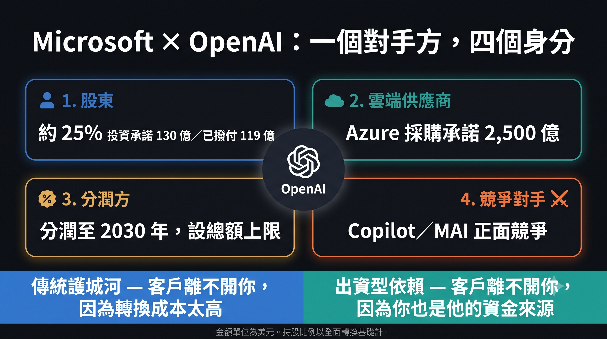
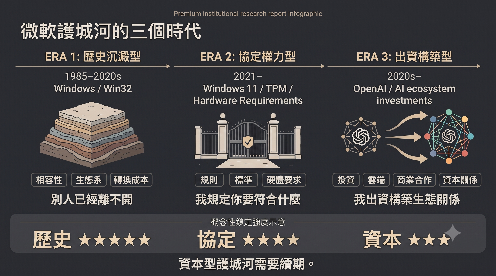

# 微軟買不到 Ring 0，於是買下 OpenAI
## 出資型依賴，與一種需要每年續期的護城河

> [《AI 戰爭》](https://mythogenengine.com/docs/ai-war/guide)延伸篇．[《大道無形》第六章](https://mythogenengine.com/docs/AI_TAO/ch06)續論

---

> **本文三個判斷**
>
> 一、微軟在 AI 世界建不出 Ring 0，於是改用出資製造依賴——一種技術上可替換、資金上不可中斷的新型鎖定。
>
> 二、當一個對手方同時出現在收入、應收帳款、股權與投資損益四個位置，改變的不是風險係數，是公司的性質。
>
> 三、這不是微軟一家的處境。整個產業都在用同一種需要續期的護城河，而且到期日是同一天——而開放權重每往前一步，就把那個日子往前挪一點。

---

## 一、六個星期，兩個價錢

2026 年 7 月 6 日，微軟收報 386.74 美元。六月二十五日錄得 34.91% 的最大回撤，是「七巨頭」裡表現最差的一隻。市場的判斷當時很清楚：資本開支失控、AI 變現太慢、Copilot 那個付費故事撐不起這個倍數。

三個星期後，一份季度財報，三個交易日，股價上漲約 25%，市值增加約 7,500 億美元。全年跌幅，一次抹平。

七千五百億是什麼概念？台積電 2026 年全年的資本支出預算是 600 至 640 億美元。也就是說，微軟三天之內增加的市值，約等於台積電十二年的蓋廠買設備錢。

同一盤生意，同一批資產，同一個管理層。中間沒有新產品，沒有新市場，沒有任何技術突破。改變的只有一件事：市場願意為同一個故事付多少錢。

大部分評論停在這裡，然後開始爭論那個數字是貴是平。

但真正值得問的不是價格。是——**為什麼這盤生意的價格，可以在六個星期內差三成？**

答案不在估值模型裡。在結構裡。

而這個結構，最後不只是微軟的問題。

---

## 二、Ring 0 是時間的產物，不是策略的產物

《大道無形》第六章談過一件事：Windows 真正的護城河，從來不是它好用。

是世界上有大量東西，離不開它。

Win32 應用程式、硬體驅動、企業內部系統、EDR 資安工具、工控軟體、CAD、遊戲。這些東西沒有一樣是微軟寫的。它們是四十年間，由幾十萬家公司、幾百萬名工程師，一行一行寫進一套特定的系統呼叫慣例裡的。

每一行都是別人付的成本。每一行最後都變成微軟的資產。

那一章的結論是：Ring 3 可以翻譯，Ring 0 翻譯不了。

我現在想把這句話推到更遠的地方——

**Ring 0 不能被建造，只能被等待。**


它不是策略部門開會決定的東西。它是時間的沉澱物。你不能在 2026 年宣布「我們要建立一個 Ring 0」，就像你不能宣布「我們要有四十年歷史」。

這是微軟今天真正的困境。而市場完全沒有在討論它。

---

## 三、AI 世界的結構性事實：每一層都可以換

把 AI 的堆疊攤開來看：

```
Model
  ↓
Agent / Harness
  ↓
Tool / MCP
  ↓
API
  ↓
Data
  ↓
Cloud
```

每一層都是可替換的。模型可以換，框架可以換，雲可以換，甚至可以整個下沉到本地推論。

這裡沒有 Win32。沒有四十年的相容性包袱。沒有一個「換掉就會壞掉一萬樣東西」的地基。

而最有力的證據，來自微軟自己。

2026 財年第四季法說會上，UBS 分析師 Karl Keirstead 直接問到開源與閉源之爭。Nadella 的回答分兩句：

> 「目標是讓每一家公司掌握自己的命運。」
>
> 「我們對平台的架構設計非常、非常清楚——你必須把 harness 和模型分開……這代表任何模型在任何時間點都是可替換的。」

他的用意很明確：勸企業不要把 agent 層交給模型供應商，不要被單一模型綁死。而微軟正好兩樣都賣——整條 Copilot 產品線是 harness，MAI 系列是模型。

這句話在媒體上被寫成「微軟的多模型策略」，被當成靈活、開放、不押注單一供應商的表現。

但如果你用第六章的框架去讀，它是一份供詞。

**它承認了：在這個新世界裡，微軟手上沒有任何一層是不可替代的。**

Windows 時代，微軟從來不需要說這種話。

沒有人會在 1998 年說「Win32 在任何時間點都是可替換的」。因為那是假的，而且全世界都知道那是假的。


---

## 四、那粒晶片：微軟最後一次號令天下

要看清楚微軟今天失去了什麼，最好的方法不是看它現在做什麼，是看它上一次做了什麼。

2021 年 6 月 24 日，微軟公布 Windows 11 的系統需求，裡面有一行：主機板必須具備 TPM 2.0。

一粒獨立的硬體安全晶片，平時零售價大約二十美元。

然後全世界照做。

Intel 照做。AMD 照做。所有 OEM 照做。所有企業 IT 部門把換機預算提前。

而在消費端，效果更直接：發表會之後十二小時內，eBay 上一款 TPM 2.0 擴充模組的價格由 24.90 美元跳到 99.90 美元；Newegg 與 Amazon 的主要型號全面缺貨；有賣家把要價開到 175 美元。一塊比拇指大不了多少、上一年還在賣八塊九毛九的板子。

代價微軟不是不知道：幾百萬部功能完好的機器一夜之間變成「不受支援」，電子垃圾爭議、用戶反彈、Windows 11 初期市佔率爬不上去。

**它照樣付得起。因為它有能力強制。**

這件事的技術意義，比大部分人理解的更深。TPM 不是防盜版工具——微軟自己的文件把它定位成安全基礎元件，實際用途是 BitLocker 金鑰保護、Windows Hello、Credential Guard、裝置證明。

它真正做的事情是：**把信任根從作業系統，往下搬進矽。**

Ring 0 之下還有一層。微軟去佔了。

而它能佔，是因為在 PC 這個世界裡，微軟講一句話，供應鏈就要轉向。

那不是產品力。那是**協定權力**。

---

### 而五年後，同一件事變成了這樣

2026 年 7 月，微軟宣布一個叫「KMS Hardware-Secured」的機制：企業的 KMS 啟用主機，必須通過 TPM 認證才能發放授權。

網路上瞬間傳成「微軟要用 TPM 一舉終結所有盜版 Windows」。

三天之內被更正得乾乾淨淨。

實情是：這件事只影響企業機房裡那一台 KMS 主機。Windows Server 2025 從 2026 年 8 月開始跳準備提示，強制執行要等下一個 Server LTSC 版本，日期未定，虛擬主機的規則甚至還沒公布。而破解圈最常用的 HWID 和 TSforge 根本不經過 KMS 主機；Online KMS 是自己架一台假伺服器答「可以」，連一個 TPM 檢查都碰不到。零售金鑰、數位授權，全部照舊。

也就是說：**現有的破解方法，一個都沒有受影響。**

把這兩件事放在一起看，那個對比幾乎有點殘忍。

同一粒晶片。2021 年，微軟用它在十二小時內改寫了全球 PC 供應鏈的規格。2026 年，微軟用它加固了機房角落裡的一台伺服器，還被誤傳成核彈，然後花三天澄清自己其實沒那麼厲害。

**協定權力就是這樣消失的。不是被打敗。是慢慢沒有了可以下令的對象。**

---

## 五、核心命題：買不到的依賴，就出資製造

如果依賴不能靠時間沉澱，也不能再靠一紙規格強制，而生意又必須建立在依賴之上——

那還剩下什麼辦法？

**出資。**

這就是我認為今天整件事的結構核心。

傳統護城河的定義是：**客戶離不開你，因為換走的成本太高。**

微軟現在建立的是另一種東西：**客戶離不開你，因為你是他的資金來源之一。**

看清楚這個結構：

- 微軟持有 OpenAI 約 27%（財年報告以全面轉換基礎揭露約 25%），累計投資承諾 130 億美元
- OpenAI 承諾採購 2,500 億美元的 Azure 服務
- OpenAI 的收入按比例分潤給微軟，至 2030 年，設有總額上限
- 2025 年 11 月，微軟投資 Anthropic 最多 50 億美元；Anthropic 承諾採購 300 億美元 Azure 服務；同一筆交易裡，NVIDIA 投資 Anthropic 最多 100 億
- 而微軟在應用層，同時與這兩家正面競爭

在同一組關係裡，微軟同時是：**股東、房東、分潤方、競爭對手。**

四個身分，一個對手方。

我把這個結構叫做——**出資型依賴。**

它的特徵是：**技術上完全可以替換，資金上不可以中斷。**

OpenAI 明天可以宣布把主要負載搬去 AWS。技術上做得到，合約上也早就允許了——首次拒絕權在 2025 年的重組裡已經取消。

但它不能宣布不需要那 130 億。不能宣布不履行那 2,500 億的採購承諾。也不能宣布自己的估值不再需要一個持股四分之一的美股巨頭，在財報裡替它背書。

**這是一種新的鎖定。它不鎖技術，鎖現金流。**

TPM 那條路是往下鑽，鑽進矽裡。這條路是往旁邊長，長進對手的資產負債表。


---

## 六、結構後果：一個對手方，佔據財報四個位置

出資型依賴會產生一個非常特別的財務形狀。

在微軟 2026 財年的揭露裡，OpenAI 這一個交易對手，同時出現在四個位置：

| 財報位置 | 內容 |
|---|---|
| 收入 | 2026 財年由與 OpenAI 的商業安排取得 241 億美元（含分潤） |
| 應收帳款 | 2026 年 6 月 30 日止，尚有 60 億美元未收 |
| 股權投資 | 以全面轉換基礎約 25%；投資承諾 130 億，已撥付 119 億 |
| 其他收入淨額 | 持股稀釋收益與估值變動 |

前三項是微軟 10-K 首度依 ASC 850 關係人揭露規定寫出的原文數字。第四項散見於各季報表。

241 億相當於微軟 2026 財年總營收 3,318 億的約 7.3%。而它在 AI 業務裡的佔比，微軟沒有揭露——彭博根據微軟自報的年化 370 至 400 億 AI 營收推估，OpenAI 佔其中一半以上，可能接近七成。**這個七成是推估，不是揭露，行文時必須分清楚。**

外界對這組數字的標準反應是三個字：**集中度風險。**

意思是「如果 OpenAI 出事，微軟會很麻煩」。這是風控語言——把它當成一個機率、一個尾部事件、一個要在模型裡加的折價因子。

我認為這個讀法錯了。

因為它假設微軟仍然是一家軟體公司，只是碰巧有一個特別大的客戶。

但當一家公司的 AI 收入有一半以上——很可能接近七成——來自一個**它自己出錢、自己持股、自己為其估值背書、同時又向其收租**的對手方時——

改變的不是它的風險係數。

**改變的是它的性質。**

它已經不是一家把軟體賣給市場的公司。它是一家**同時擔任房東、股東與莊家**的資產運營商。而市場仍然在用軟體公司的邏輯替它定價。

這一句是整篇文章的重心。底下所有數字，只是用來證明它。



---

## 七、證據層：盈利的來源，正在由營運轉向估值

先講清楚：以下的機制全部合規，全部有揭露，沒有一項是造假。

問題不在合法性。在性質。

### 稀釋收益：被溝淡，反而入帳賺錢

2025 年 10 月，OpenAI 完成資本重組，轉為公益公司（PBC）。微軟持股由 32.5% 降到約 27%。

但因為估值上升的幅度，遠大於持股比例下降的幅度，會計上產生一筆**稀釋收益（dilution gain）**，計入「其他收入淨額」。

被溝淡了，卻賺了一筆。

微軟採用權益法，以假設清算帳面價值法（HLBV）認列。重組之後，帳面損益不再反映 OpenAI 的經營結果，而是反映**微軟應佔淨資產份額的變動**——每一次融資、每一次估值調整，都會直接進入微軟的損益表。

於是 2026 財年出現這樣一組數字：

| 季度 | OpenAI 投資損益 |
|---|---:|
| Q1 | −31 億美元 |
| Q2 | +76 億美元 |
| Q3 | −0.14 億美元 |
| Q4 | +4.8 億美元 |
| **全年** | **+49.63 億（EPS +0.67 美元）** |

對照 2025 財年：全年 −36.2 億，EPS −0.49 美元。

一年之內，同一筆投資，由每股拖累五毛，變成每股貢獻六毛七。

中間 OpenAI 並沒有開始賺錢。

**一句話：OpenAI 虧損不再讓微軟虧損；OpenAI 融資反而讓微軟賺錢。**

這部引擎的燃料不是產品。是一級市場願意出的價。

### 第二部引擎：Anthropic

2026 財年第四季，微軟認列 Anthropic 投資收益 32 億美元，約當稀釋每股盈餘 0.33 美元——佔當季 4.81 美元 EPS 的近 7%。

換句話說，這個被市場歡呼為「全面超標」的季度裡，有相當一部分不是賣軟體賺回來的。

是自己投資的公司，估值上升。

### 呈現層的兩個小動作

**其一，資本開支的表外化。** 2026 日曆年的資本開支指引由 1,900 億美元下修到約 1,750 億——不是少買了東西，是部分建築物的估計耐用年限被拉長，加上相當一部分未來租賃義務由融資租賃改列為營業租賃。後者同時影響資本開支與自由現金流兩個指標的解讀。

數字變小了。機櫃一部都沒有少。

**其二，雙軌敘事。** 微軟自行設計了一套排除 OpenAI 影響的 non-GAAP 指標。虧損的季度請看 non-GAAP，獲利的季度 GAAP EPS 年增 32% 照樣見報。

兩邊都能講。而且兩邊都是真的。

這些加起來，指向同一個結論：**微軟盈利的邊際來源，正在從營運轉向估值。**

而估值，不是微軟能生產的東西。

---

## 八、時間差：收益前置，成本後置

先看一組數字怎麼被說出來，再看它怎麼被改口。

**四月。** 微軟給出 2026 日曆年的資本開支指引：1,900 億美元。市場預期只有約 1,550 億。

但同一場電話會議上，財務長 Amy Hood 說了一句更值得記住的話：這 1,900 億裡，約有 **250 億是組件價格上漲**——不是買到更多算力，是同樣的東西變貴了。

同一季的資本開支 319 億，其中約三分之二投向 GPU 與 CPU 這類**短命資產**。

**七月。** 同一個指引被改成約 1,750 億。少了 150 億——不是少買了東西，是部分建築物的估計耐用年限被拉長，加上相當一部分未來租賃義務由融資租賃改列營業租賃。後者同時影響資本開支與自由現金流兩個指標的解讀。

把三件事放在一起：

**一個大數字，其中一截根本不是算力；然後那個數字又被會計處理改小。**

而底下那批真正買回來的東西，是壽命最短的那種。

這裡有一個所有人都知道、但很少人放進同一句話裡的事實：

**今天入帳的是收入與估值收益。今天買的 GPU，要到未來幾年才會全額進入損益表。**

折舊的高峰還沒有上台。拉長耐用年限，只是把那個高峰往後推，不是取消它。

出資型依賴的整個結構，就建立在這個時間差上。

它不是騙局。它是一場賭注——賭在成本全面上台之前，真實的使用強度已經追上來了。

---

## 九、對照組：CUDA 的黏性由下而上

第六章曾經把微軟與 NVIDIA 並列，說兩家都是「用多年別人付出的成本，把自己放到中間」。

但兩者的方向是相反的。

**NVIDIA：** 硬體 → CUDA → 開發者 → AI。黏性由下而上長出來，用了將近二十年。歷史沉澱型。

**微軟：** M365 → Copilot → Agent → Azure，再加一條橫向的資本線，把模型公司綁進來。黏性由上而下鋪出去，用了三年。出資構築型。

最關鍵的差別不在深淺。

**在於：歷史沉澱型的護城河不需要續期。出資構築型的需要。**

Win32 不需要微軟每年花錢維持。它就在那裡，因為它已經在那裡了。

但 2,500 億的採購承諾，需要對手方有能力履約。帳面收益需要下一輪估值繼續往上。資金型鎖定需要資金持續流動。

**這不是一道護城河。這是一份需要每年重新簽的租約。**

---

## 十、我可能錯在哪裡：GPU 上的信任根

寫到這裡，我必須把自己這套論證裡最脆弱的地方指出來。否則它就只是一個立場，不是一個分析。

我說 AI 世界沒有 Ring 0，因為每一層都可以替換。

但有一個地方，可能長得出來。

**機密運算（confidential computing），以及 GPU 級的執行證明（attested inference）。**

邏輯是這樣的：企業最終不會願意把最敏感的資料，交給一個無法證明自己狀態的執行環境。它們會要求——這段推論在哪一顆晶片上跑、跑的是不是我指定的那個模型、有沒有被竄改、記憶體有沒有被第三方讀取——全部要有一條可驗證的信任鏈，而且這條鏈的起點必須在硬體。

如果這個要求變成企業採購的硬條件，那麼 AI 世界就會突然長出一個「不能被軟體模擬」的層。

而「不能被軟體模擬」，正正就是 TPM 當年成立的全部理由。

看到那個對稱了嗎？

**微軟上一次成功建立信任根，是在 PC。它下一次嘗試建立信任根，會在 GPU。**

如果它在這條線上做到不可繞過——如果企業 AI 的執行證明鏈，最後必須經過 Azure 的機密運算環境與 Entra 的身分層——那麼它就不是用資本買依賴。

它是真的重新建了一個 Ring 0。

到那時候，這篇文章的結論要改。

我目前的判斷是：這條路存在，但它面對的不是四十年的歷史包袱，而是三家雲、兩家晶片商、以及一堆還在制定中的開放標準。同一個證明鏈，AWS 和 Google 也在做，NVIDIA 自己也在做。**能被三家同時提供的東西，很難成為誰的 Ring 0。**

但這是我最願意被推翻的一段。誰想反駁這篇文章，應該從這裡進來，不要從股價進來。

---

## 十一、微軟不是特例，是樣本

到這裡為止，這篇文章看起來像在講一家公司。

不是。

出資型依賴不是微軟的發明，也不是微軟的專利。它是 2025 至 2026 這一輪 AI 建設的**預設結構**。

把 OpenAI 一家對外的名義承諾攤開（各家統計口徑不一，以下為媒體整理的常見版本）：

| 對象 | 名義承諾規模 |
|---|---:|
| Broadcom | 3,500 億美元 |
| Oracle | 3,000 億美元 |
| Microsoft | 2,500 億美元 |
| NVIDIA | 上限 1,000 億美元 |
| AMD | 900 億美元 |
| CoreWeave | 220 億美元 |

七家供應商，2025 至 2035 年，合計約 1.15 兆美元。而 2026 年的多份第三方估算，把整個產業「循環融資」的規模放在 8,000 億美元以上。

這些不是普通的採購合約。它們的共同形狀是：**賣算力的人，出錢給買算力的人，去買自己的算力。**

- NVIDIA 投資 OpenAI、Anthropic、Mistral，以及 CoreWeave 這類新雲業者，然後這些公司回頭買 NVIDIA 的晶片；NVIDIA 自己也向新雲業者租算力
- Amazon 投入 OpenAI 與 Anthropic 合計超過 830 億，兩家承諾回買 AWS 算力的規模更大
- 微軟投 Anthropic 最多 50 億，Anthropic 承諾買 300 億 Azure；同一筆交易裡 NVIDIA 再投最多 100 億
- 2026 年 7 月，多家媒體報導 NVIDIA 正在評估為 OpenAI 的俄亥俄資料中心提供約 2,500 億美元擔保，另外再融資 3,500 億的晶片採購（截至 2026 年 8 月，此案仍未定案）。消息當天，NVIDIA 自己的股價跌了 4.5%——市場很清楚這代表什麼

想像一張圓桌。每個人都在替隔壁的人付帳，然後把同一筆錢，記進自己的營業額。

微軟只是這張桌子上，帳單攤得最開的那一位。它每季要向 SEC 交代，所以看得見。其他人不用按季拆給你看，不代表結構不同。

**這才是這篇文章真正的規模。**

於是有三件事，值得放大來看。

### ① 入場費的性質變了

當算力靠股權交易分配，而不是靠採購分配，決定誰能競爭的就不再是「你買不買得起」，而是「你值不值得被投資」。

模型層收斂到三四家，不是因為技術護城河築起來了，是因為**只有三四家在循環裡面**。

中間那一層不是因為做得差而死。是因為站在圈外而死。

### ② 風險從創投搬進了指數

這是我認為最大的一項，而且被討論得最少。

2000 年那次，泡沫的風險在 dot-com 股票上——你要主動去買，才會持有。

2026 年這次，一批**私人公司**的估值變動，直接寫在全球最大幾家上市公司的損益表裡。

沒有人選擇過持有 OpenAI 的估值波動。但每一個買了指數基金的退休帳戶，都已經持有了。

### ③ 分散的是名冊，不是風險

微軟、Amazon、Google、NVIDIA 各自都可以說自己的投資組合分散。

但攤開來看，是同一組對手方，出現在多張資產負債表上。

它不會逐間出事。它會同時出事。


---

## 十二、但是：結構崩潰不等於技術失敗

如果只寫到上面那一節，這篇文章就會變成又一篇「AI 泡沫論」。那我寧願不寫。

所以要把反面講清楚。

**需求是真的。** NVIDIA 2027 財年第一季營收 816 億美元，年增 85%。台積電把 2026 年資本支出由 520–560 億上調到 600–640 億，理由是包括代理式 AI 在內的結構性需求。應用層絕大多數公司是正常的 SaaS 生意，有真實付費客戶，跟循環融資完全無關。

**而且 vendor financing 建成過真東西。**

1990 年代的電訊業就是同一個劇本：設備商放貸給營運商去鋪光纖，需求不如預期時，高槓桿的營運商砍支出、部分破產，產能閒置多年，產業重整。

但那段歷史真正的結論，不是「泡沫爆了」。

是——**那些光纖後來全部用上了。只是股東換了人。**

鐵路也是。運河也是。

**結構崩潰不等於技術失敗。這個分辨，比看空看多重要一百倍。**

而它同時說明了：判斷這件事的正確問題，從來不是「AI 行不行」，是「**這一輪的成本，最後由誰承擔**」。

---

## 十三、循環之外的那一手：開放權重

如果整套結構需要估值持續上升才能運轉，那麼最值得盯的變數，就是**站在循環外面的東西**。

目前只有一樣：開放權重生態。

它不需要融資輪來定價，不需要採購承諾來背書，也不需要任何人的資產負債表替它擔保。

它的存在意味著——**整套結構的定價，隨時可以被一個效率數字重寫。**

2025 年 1 月已經示範過一次。

DeepSeek 於 1 月 20 日公開 R1，宣稱訓練成本約 560 萬美元。市場隨即重新計算「達到同一水準需要多少算力」這件事。1 月 27 日，NVIDIA 單日下跌約 17%，收報 118.58 美元，市值蒸發 5,890 億——美股史上單一公司單日最大市值損失，前一個紀錄是 NVIDIA 自己在 2024 年 9 月創下的 2,790 億。同日 Broadcom 跌 17%，台積電跌 13%。

那一天沒有任何一份財報出問題。改變的只是一個關於成本的假設。

### 而 2026 年 7 月，它示範了第二次

七月十六日，中國新創月之暗面在上海的世界人工智慧大會發表 Kimi K3。十一天後，二．八兆參數的完整權重上了 HuggingFace——九十六個權重分片、技術報告、授權條款，一次到齊。同一週，DeepSeek 也發布了 V4 穩定版。

規格上，K3 是混合專家架構，每個 token 只啟動總參數的一小部分，上下文一百萬 token。獨立評測把它放在頂尖閉源模型後面一點的位置：整體仍落後於 Claude Fable 5 與 GPT-5.6，但在程式與代理任務上贏過上一代的旗艦閉源模型。

市場的反應和十八個月前同一個形狀：發表後兩週內，費城半導體指數跌幅達兩成，相對高點進入技術性熊市。

**兩次，十八個月。這就不再是異常，是機制。**

而且 K3 這一次比 DeepSeek 那一次更貼近本文的命題。

DeepSeek 動搖的是一個關於**成本**的假設——訓練一個前沿模型要花多少錢。那是一個關於過去的宣稱，可以爭論，可以質疑，可以說「他們用了別人的模型蒸餾」。

K3 動搖的是一件更硬的事：**模型可以被搬走。**

權重躺在 HuggingFace 上，任何有足夠硬體的企業都可以下載、檢查、微調、自行部署。這件事沒有辦法爭論，因為檔案就在那裡。

於是企業對閉源供應商的那句話，從——

「我們沒有別的選擇。」

變成——

「你如果加價，我就把同一個等級的東西搬去別的地方跑。」

**改變的不是價格。是議價權。**

### 但「開源」這兩個字會騙人

要把話講完整，否則這一節就變成幫開源吹哨。

**權重免費，但你要有地方放。** K3 在四位元精度下，光是權重就需要約 1.4TB 的高速記憶體；Moonshot 自己建議至少六十四張加速器起跳。開放權重降低的是供應商依賴，不是基礎設施成本。能真正自建的，仍然只有大企業與雲端業者——而雲端業者，正好就是這篇文章裡那幾家。

**而且採用摩擦是真的。** 獨立測試對 K3 的幻覺率提出過相當不客氣的數字；今年四月 Kimi 發生過一次跨用戶資料隔離失誤；而中國《國家情報法》第七條的義務，不會因為推論跑在哪一台伺服器上而消失。這些不是政治修辭，是企業法遵部門會真的擋下來的東西。

所以短期內，開放前沿模型不會取代閉源。

但這不影響結論——因為**壓縮定價權，不需要取代任何人。**只需要讓「還有別的選擇」這句話變成真的。

所以那條開源路線不只是競爭手段。它在結構上，反向站位於一套**必須靠估值不斷向上才能維持的體系**。

一個不需要被投資的東西，是這套體系唯一無法收編的東西。

---

## 十四、K3 之後：微軟的雙面暴露

寫到這裡，必須把這篇文章的主角，放進剛剛那個新變數裡再測一次。

因為開放前沿模型對微軟的影響，是兩邊相反的。

### 產品層：它證實了微軟是對的

回到第三節那句供詞。

Nadella 說「任何模型在任何時間點都是可替換的」，勸企業把 harness 和模型分開、不要被單一模型商綁死。當時聽起來像是一個賣 harness 的人在推銷 harness。

三個星期後，一個能力接近頂尖、權重完全公開的模型出現了。

**他說對了。而且他早就把公司押在這句話上。**

Foundry 上一萬多個模型、自研 MAI 系列、多模型路由——這套佈局在一個模型商品化的世界裡，是順風局。K3 放出權重那一週，一封支持開放權重的政策公開信上，署名者裡就有微軟。

微軟很清楚自己站在哪一邊。

### 財務層：同一件事，直接威脅它

但第七節那兩部引擎，需要的是相反的東西。

稀釋收益要靠 OpenAI 下一輪估值更高。Anthropic 那筆三十二億要靠 Anthropic 估值繼續上升。而開放前沿模型壓縮的，正正就是閉源模型的定價權——定價權一鬆，估值就難再往上疊。

更直接的是那 2,500 億採購承諾與 241 億收入：它們的可回收性，取決於 OpenAI 能不能持續以更高估值融到錢。

**同一件事，讓微軟的產品部門鬆一口氣，讓微軟的財務部門睡不著。**


這就是出資型依賴最尷尬的地方。當你的護城河是「我出錢給你」，那麼**任何削弱對方定價權的東西，都會回頭削弱你自己的帳面盈利**——即使你的產品策略完全正確。

歷史沉澱型的護城河不會有這個問題。Win32 從來不需要在意誰的估值。

### 而這讓第十節那條路更重要

如果模型層真的走向商品化，那麼微軟能夠重新建立不可替代性的地方，就更加只剩下機密運算與執行證明那一條。

模型免費，權重公開，推論可以在任何地方跑——那麼還有什麼是「不能被軟體模擬」的？

只剩下一件事：**證明它跑在哪裡。**

我在第十節說那條路很難走，因為三家雲都在做。我現在要補一句：**它同時也是唯一剩下的路。**

---

## 十五、五條生死線

如果上面的結構判斷成立，那麼要觀察的就不是「什麼時候崩」，而是「這個結構什麼時候失去續期能力」。

**公司層面三條：**

### ① 續期能力

OpenAI 與 Anthropic 的下一輪融資估值。持平或下修，帳面收益引擎立刻歸零——2026 財年第三季只認列 1,400 萬美元，已經示範過一次。

同時看 OpenAI 的上市進程：截至 2026 年 8 月，機密送件已於 6 月完成，但傾向推遲到 2027，管理層堅持不接受低於一兆美元的估值。

**推遲本身就是訊號：一級市場已經到了頂不上去的位置。**

### ② 性質檢驗

每一季「其他收入淨額」佔 EPS 增幅的比重。這個比例往上走，代表盈利的邊際來源越來越依賴估值而非營運。

最直接的性質指標，而且每季都對得到。

### ③ 成本上台

折舊佔收入的比重、Microsoft Cloud 毛利率、以及自由現金流增速與 Azure 增速之間的缺口。三條同時轉向，時間差就用完了。

**產業層面兩條：**

### ④ 第一個下修輪

不是崩盤，是任何一家主要模型公司以持平或更低估值完成融資。那一刻起，所有持股方的帳面收益引擎同步失效。

而 K3 補上了一條原本不在這條線上的路徑：**估值壓力不一定來自融資市場冷卻，也可以直接來自技術面。**開放前沿模型每往前一步，閉源模型的定價權就窄一分，而定價權是估值的地基。要盯的因此不只是下一輪融資，還有開放權重與閉源之間的能力差距——那個差距收窄的速度，就是這條生死線推進的速度。

### ⑤ 債的那一端

盯放貸的人，不是盯簽約的人。基礎設施供應商的負債水位與信用利差，比任何一份合約公告都早給訊號。

---

## 十六、結論：不是玩完，是續期

我不認為微軟這盤生意會做不下去。Azure 年收入突破一千億、M365、資安、開發工具，這些是真實的收入與真實的客戶。

我也不打算加入「泡沫要爆了」的合唱。那個立場在 2026 年上半年已經錯過兩次，而且它有一個致命缺陷：**它沒有失效條件。**永遠可以說「還沒到」。

我想留下的是另一句判斷。

微軟在 AI 時代面對的，不是「能不能賺錢」的問題。它已經在賺錢。

它面對的是一次**護城河型態的降級**：

從「別人離不開我，因為歷史把他們鎖在這裡」——

到「別人離不開我，因為我可以規定他們要裝什麼晶片」——

再到「別人離不開我，因為我還在出錢」。

三十年，三個階段。每一個階段的鎖定強度，都比上一個弱。

而這一次，它不是一家公司的處境。**整個產業都在用同一種需要續期的護城河，而且到期日是同一天。**

至於那個日子什麼時候到——七月那兩個星期已經給過提示。當一個接近頂尖的模型可以被任何人下載，續期的利率就不再只由出錢的人決定。

第六章寫過一句話：Win32 不需要消失，它只需要由業主變成租客。

今天輪到微軟自己了。

它沒有失去 Windows。沒有失去 Azure。沒有失去任何東西。

**它只是需要每一年，重新把自己的不可替代性，再買回來一次。**

而續期的利率，不在 Redmond 決定。

在一級市場決定。



---

## 資料來源與說明

**微軟財務數據**：2026 財年第四季財報新聞稿與 8-K（2026 年 7 月 29 日）、2026 財年 10-K、截至 2026 年 3 月 31 日之 10-Q，以及法說會逐字紀錄。

**TPM 與 KMS Hardware-Secured**：微軟支援文件、Windows IT Pro Blog 公告，以及 2021 年 6 月 Tom's Hardware、Windows Central、PCWorld 對 TPM 模組價格與缺貨的報導。

**產業數據**：OpenAI 對外承諾規模與「循環融資」總額，均為第三方媒體與研究機構的整理與估算，各家統計口徑不一，非官方揭露，本文取常見版本並已在文中標明。NVIDIA 對 OpenAI 俄亥俄專案的擔保與晶片融資，截至本文完成時仍屬「報導指出正在評估」，尚未成為已簽定案。

**資本開支相關**：1,900 億美元的 2026 日曆年指引、其中約 250 億歸因於組件價格上漲、當季 319 億中約三分之二投向短命資產，取自 2026 年 4 月底微軟 FY26 第三季法說會與多家科技財經媒體的同步報導；下修至約 1,750 億與相關會計處理，取自 7 月底的第四季財報與年報。

**開放權重相關**：Kimi K3 的發表日期、權重釋出日期、架構規格與評測位置，取自 Moonshot 官方發布、HuggingFace 頁面與多家獨立技術評測；每 token 活躍參數量各家推算不一，本文因此只作定性描述。費城半導體指數的兩週跌幅取自財經媒體報導。關於蒸餾與晶片出口管制的指控，均為指控，被點名方未承認，本文不予採信亦不予複述細節。

**關於原創性的說明**：稀釋收益機制、循環交易結構、折舊與租賃處理、循環融資的系統性風險，英文與中文財經社群均已有大量論述；電訊光纖的類比亦已被多家媒體使用。本文不主張這些機制的發現權。

本文自認的原創部分在於：協定權力的消退（第四節）、「出資型依賴」這個命名與定義（第五節）、財報四個位置代表性質改變而非風險上升（第六節）、GPU 信任根的自我反駁（第十節），以及開放權重作為結構性對沖（第十三節）。

歡迎從第十節反駁。
