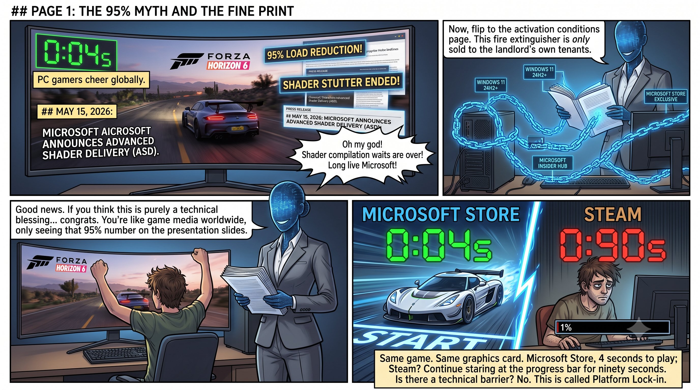
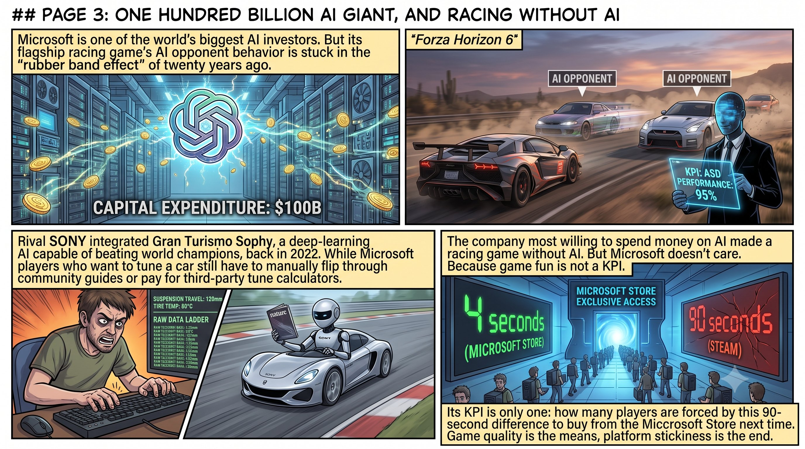
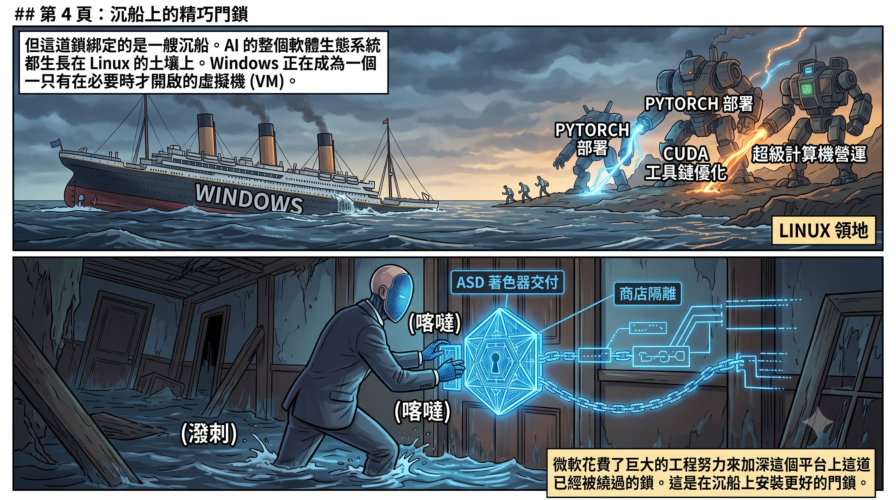
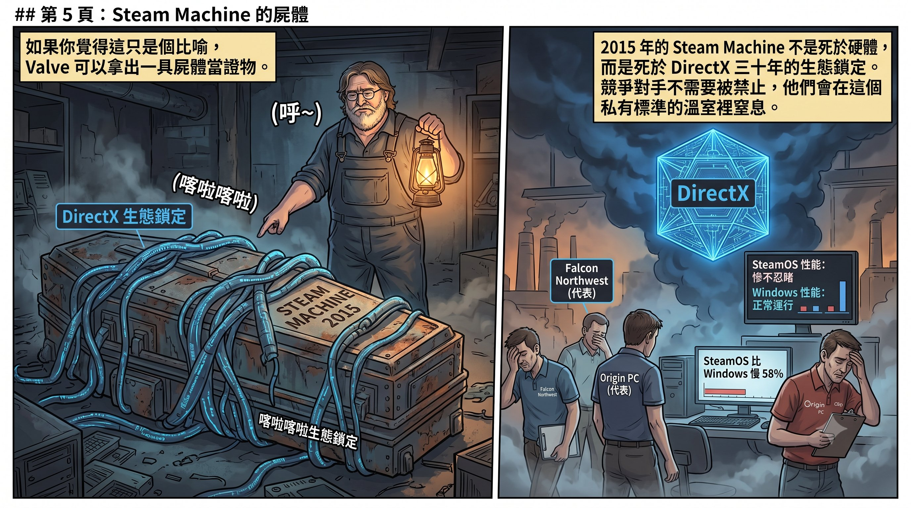
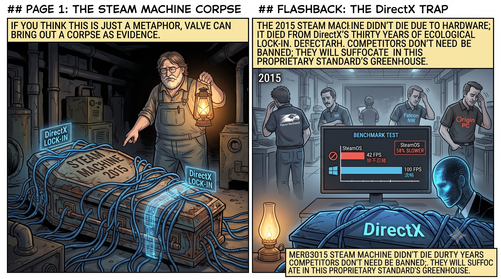
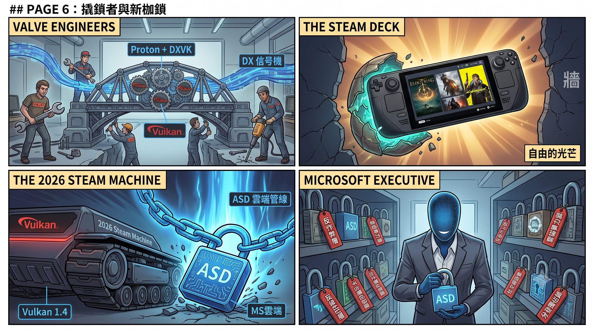
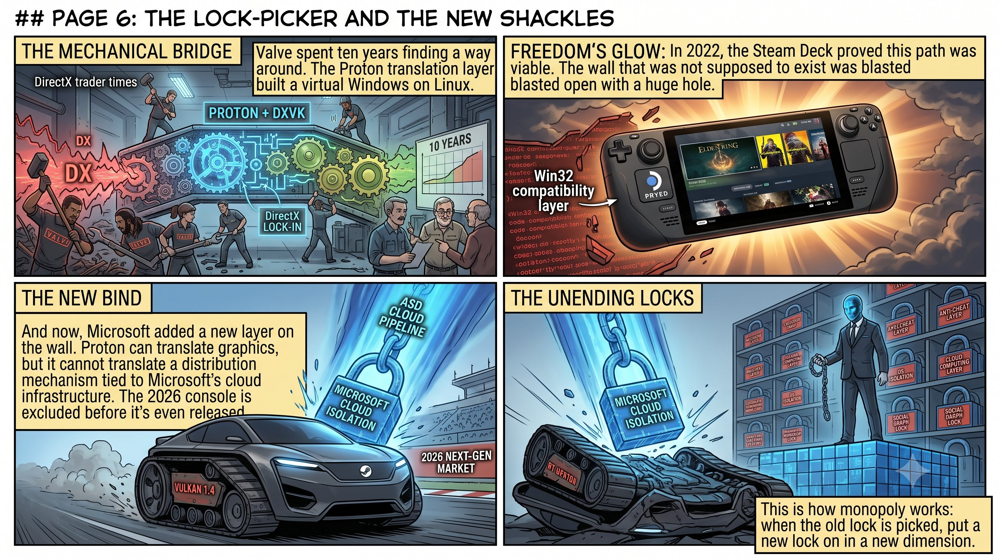
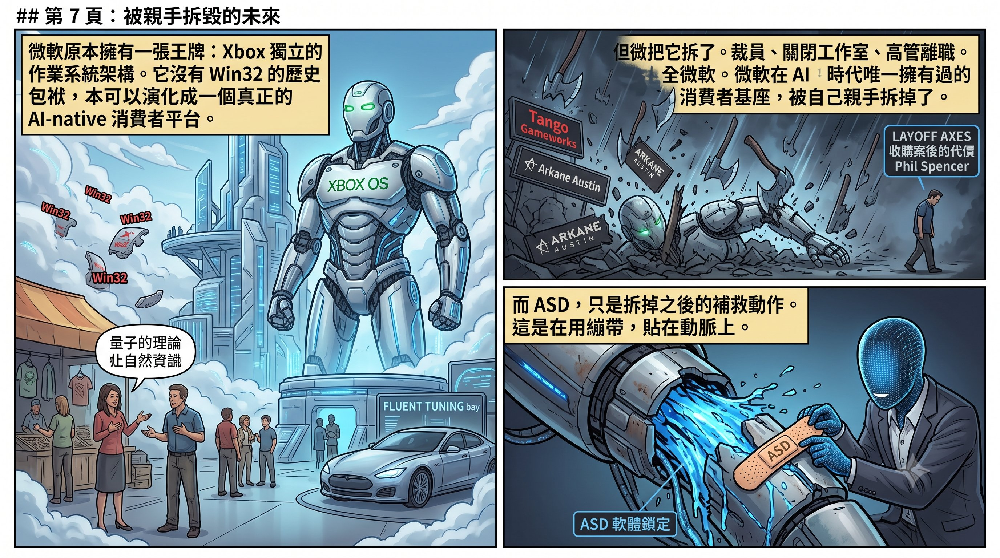
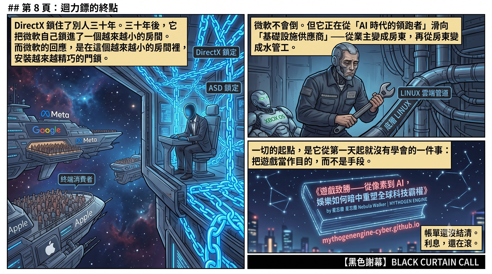

作者：星忘塵 Nebula Walker
Date: 08JUL2026
創象引擎 Mythogen Engine (mythogenengine.com)

**📌 從微軟最新推出的 Advanced Shader Delivery (ASD) 技術切入，剖析微軟如何以解決問題為名行平台鎖定之實，以及在 AI 時代親手拆解 Xbox 消費者基座的戰略矛盾與困境。**

# 滅火器經濟學——微軟 ASD 與一場三十年老戲的最新一幕

---

2026 年 5 月 15 日,微軟宣佈了一項讓 PC 玩家歡呼的技術:Advanced Shader Delivery(ASD)。《極限競速：地平線 6》的首次載入時間,從將近九十秒縮短到四秒。降幅 95%。NVIDIA、AMD、Intel 三大 GPU 廠商全部支援。困擾 PC 玩家超過十年的著色器編譯等待問題,看起來終於要走入歷史。

好消息。

讀到這裡,如果你覺得這是一則單純的技術福音——恭喜,你跟全世界的遊戲媒體一樣,只看到了投影片上那個 95% 的數字。

現在,翻到啟用條件那一頁。

---

## 一、滅火器只賣給自己的房客

ASD 要求:Windows 11 24H2 或更新版本。Xbox Gaming Services 更新至指定版本。加入 Xbox Insider Hub 的 PC Gaming Preview 計劃。遊戲必須透過 Xbox PC 用戶端或微軟商店下載。

**Steam 版本暫不支援。**

同一款遊戲。同一張顯示卡。同一套驅動程式。從微軟商店下載,四秒進遊戲;從 Steam 下載,繼續盯著編譯進度條等九十秒。

技術上有任何理由不能讓 Steam 版本使用同一套預編譯著色器嗎?沒有。ASD 的核心是把著色器編譯器從驅動程式中分離出來,在雲端預先完成編譯,再把成品推送到玩家的機器上。這件事完全可以做成開放標準,讓所有平台受惠。微軟選擇不這樣做。它選擇把解決方案綁死在自己的商店、自己的服務、自己的雲端管線上。

便利是真的。鎖定也是真的。

這個結構你如果覺得眼熟,那是因為它三十年前就出現過。

---

## 二、先放火,再賣滅火器

著色器編譯卡頓這個問題,是什麼時候開始變成 PC 遊戲的「老大難」的?

答案:DirectX 12。

DX11 時代,驅動程式會替開發者處理大量著色器編譯和排列組合的工作。開發者不需要操心——這些事在幕後自動發生。DX12 改了規則。微軟以「更貼近硬體、更高效能」為名,把著色器管線的責任從驅動程式推給開發者。開發者現在要自己管理著色器的編譯、快取、排列組合。

理論上,這讓頂尖開發者可以壓榨出更好的效能。實際上,它讓絕大多數開發者面對著色器排列組合的指數爆炸,束手無策。結果就是你在每一款 DX12 大作的標題畫面上看到的那行字:「正在編譯著色器,請勿關閉遊戲。」

這個問題炸了十年。玩家忍了十年。

現在微軟回來說:「我幫你解決。」

但解決方案不是修好 DX12 的著色器管線設計,不是讓本地編譯更高效,不是提供一套開放的預編譯標準讓所有平台都能用。解決方案是:**把編譯搬上我的雲端、綁定我的商店、經過我的 Partner Center。**

**自己製造的問題,做成平台專屬的解決方案。先放火,再賣滅火器——而且滅火器只賣給住在自己大樓裡的房客。**

---

## 三、引擎退步,但誰在乎?

如果 ASD 的目的真的是讓遊戲體驗變好,那微軟應該同時確保遊戲本身跑得好。

《極限競速：地平線 6》——ASD 的官方示範作品——使用的是 ForzaTech 引擎的升級版,繼承自 2023 年的《極限競速》。引擎加了即時全局光照等新功能,但 VRAM 需求暴增——同一張顯示卡,FH5 開到 Extreme 畫質還能順跑,FH6 開 High 就吃掉超過 7GB 視訊記憶體。AMD 顯卡的微卡頓問題尤其嚴重,Playground Games 上線一週就承認正在修。

更荒謬的是遊戲本身的 AI。FH6 的 Drivatar 系統在低難度下尚可,但一旦調到老手（Highly Skilled）以上,橡皮筋效應就暴露無遺——AI 對手不是靠更好的路線或煞車時機贏你,而是在直線上憑空獲得超越物理極限的車速,甚至在你拉開距離後瞬移到更近的位置。Playground Games 上線四天就把「Drivatar AI Balance」列為四大改善項目之一,承認「AI 對手在高難度下太快」。而調車系統呢?遊戲提供了原始的遙測數據——輪胎溫度、懸吊行程——但沒有任何 AI 輔助分析。玩家想知道該不該調軟後防傾桿,得自己看數字、翻社群攻略、或者付費訂閱第三方網站的調校計算器。

想想這意味著什麼。微軟是全球在 AI 上投資最多的公司之一——一千億美元的資本支出,130 億美元押在 OpenAI 身上。Sony 的《跑車浪漫旅 7》在 2022 年就整合了 Gran Turismo Sophy——一個登上《Nature》期刊、能在賽道上擊敗世界冠軍級車手的深度強化學習 AI。而微軟自己的旗艦賽車遊戲,AI 對手的行為模式停留在二十年前的橡皮筋,調校系統連一個「根據你的駕駛風格建議懸吊設定」的功能都沒有。

**全世界最捨得花錢做 AI 的公司,做了一款沒有 AI 的賽車遊戲——然後用它來展示一項鎖定平台的技術。**

微軟不在意。

因為 ASD 要展示的不是「遊戲品質提升」,而是「載入速度的落差」。它需要的是一個夠大的數字——95%——和一個夠明確的對比:我的商店四秒,Steam 九十秒。

**遊戲本身好不好玩,AI 聰不聰明,畫面順不順暢,不在 ASD 的 KPI 裡面。** ASD 的 KPI 是:有多少玩家因為這個落差,下一次選擇從微軟商店購買。

工程資源沒有花在改善遊戲引擎上,沒有花在遊戲 AI 上。工程資源花在建設平台鎖定的基礎設施上。遊戲品質是手段,平台黏性才是目的。

---

## 四、但這把鎖,鎖的是一艘正在下沉的船

ASD 鎖定的戰場是 PC 遊戲的 Windows 商店分發渠道。

問這個問題:Windows 作為平台,現在處於什麼位置?

AI 的整個軟體生態——PyTorch、CUDA 工具鏈、容器化部署——長在 Linux 上。全球前五百大超級電腦,Linux 佔比超過九成。連 NVIDIA 自己的雲端遊戲平台 GeForce NOW,底層都是 Linux 做地主,Windows 被裝進虛擬機裡——需要的時候開機,不需要的時候關掉。Valve 的 Steam Deck 跑 Linux,用 Proton 翻譯層跑九成以上的 Windows 遊戲。

Windows 曾經是整棟大樓的業主。現在它正在變成租客——一個可以被虛擬化、被啟動、被關閉的 VM。

微軟花大量工程力氣,在這個正在被繞過的平台上加深鎖定。

這是在沉沒的船上安裝更好的門鎖。

---

## 五、Steam Machine 的屍體上寫著答案

如果你覺得「先放火再賣滅火器」只是一個比喻——Valve 可以拿出一具屍體當證物。

2015 年，Valve 推出了 Steam Machine。概念很直接：一台跑 Linux 的客廳遊戲主機，直接從 Steam 玩遊戲，不經過 Windows。如果成功，PC 遊戲的分發就不再被微軟的平台壟斷。

它死了。

不是因為硬體差。不是因為定價錯。是因為 Steam 上絕大多數遊戲都是用 DirectX 寫的，而 SteamOS 跑的是 Linux，用的是 OpenGL。同一台機器上，SteamOS 跑遊戲比 Windows 慢 21% 到 58%。兩間本來計劃出 Steam Machine 硬件的廠商——Falcon Northwest 和 Origin PC——看到這個落差，直接退出。

Steam Machine 不是「性能差」。它是被 DirectX 三十年的生態鎖定困死的。

開發者用 DirectX 寫遊戲，不是因為 DirectX 最好，而是因為 Windows 是唯一的市場。當所有遊戲都寫死在 DirectX 上，任何試圖繞過 Windows 的平台都會撞上同一面牆：你的遊戲庫裡九成的遊戲打不開。這不是技術問題，這是壟斷的結構性效果——**你不需要禁止競爭對手進場，你只需要讓整個生態都依賴你的私有標準，競爭對手就會自己窒息。**

Valve 花了十年才找到繞路的方法。Proton 翻譯層加上 DXVK，把 DirectX 的呼叫即時轉譯成 Vulkan——等於在 Linux 上面架了一座虛擬的 Windows。2022 年的 Steam Deck 證明了這條路走得通：九成以上的 Windows 遊戲可以在 Linux 上跑了。

十年。一整個翻譯層的工程量。只為了繞過一道本不應該存在的牆。

而現在，微軟在牆上加了新的一層。

ASD 把著色器的分發管線綁定在 Xbox PC 應用程式上。就算 Proton 能翻譯 DirectX 的圖形呼叫，它翻譯不了一套綁定在微軟商店基礎設施上的雲端分發機制。Steam 版不支援 ASD。SteamOS 更不用想。2026 年的新一代 Steam Machine 剛通過 Vulkan 1.4 認證，還沒上市就已經被排除在 ASD 的生態之外。

這就是壟斷的運作方式：**當舊的鎖被撬開，就在新的維度上再裝一把鎖。** API 層的鎖被 Proton 繞過了？那就在 shader 分發層再鎖一次。分發層也被繞過了？下一次會鎖在反作弊層、鎖在雲端算力層、鎖在任何一個還沒有開放標準的地方。

DirectX 殺死了 Steam Machine 1.0。ASD 是射向 Steam Machine 2.0 的第一顆子彈——在它出生之前。

---

## 六、最後一根稻草被自己折斷

這裡要把視野拉高,看微軟在 AI 時代的全局。

2025 財年,微軟的資本支出超過一千億美元——幾乎全部投向 AI 資料中心。它向 OpenAI 投了 130 億美元。它的 AI 戰略押注在 Azure 雲端算力和 OpenAI 的模型能力上。

但這個戰略有一個結構性弱點:**微軟不擁有終端消費者。**

Azure 的客戶是企業。Copilot 是嫁接在 Office 上的附加功能。OpenAI 隨時可能脫鉤。Google 有搜尋引擎和 Android。Meta 有社交平台。Apple 有 iPhone。微軟有什麼?

微軟曾經有 Xbox。

不只是幾千萬活躍用戶和每月付費的 Game Pass 訂閱關係。不只是一個已經建好的內容分發管線和一批頂尖的第一方工作室——做出《Prey》的 Arkane Austin、做出《Hi-Fi Rush》的 Tango Gameworks、做出《Halo》的 343 Industries。

Xbox 還有一樣東西,比這些都重要:**一個獨立的作業系統架構。**

Xbox 的 OS 雖然基於 Windows NT 核心,但它從 Xbox One 開始就採用了 hypervisor 架構——一個輕量的即時作業系統控制整台機器,上面跑著精簡到只剩遊戲所需 API 的專用環境。微軟自己的工程師說過:「擁有自己的作業系統,讓 Xbox 能掌控自己的架構命運。」這套系統不需要兼容三十年的 Win32 應用程式,不需要跑 Office,不需要背負 Windows 龐大的歷史包袱。如果微軟認真做,Xbox OS 可以進一步演化,從零設計 AI 排程和推論管線,變成一個真正的 AI-native 消費者平台。不是在 Windows 上面疊加一層 Copilot 按鈕,而是一個從核心架構就為即時 AI 互動設計的系統。

想像一下:一台 Xbox 主機,搭載專用的 NPU,跑著一個不受 Windows 歷史遺產拖累的 AI 作業系統。遊戲裡的 NPC 能即時對話、會學習。調車系統用 AI 分析你的駕駛風格,自動建議懸吊設定。關卡根據玩家行為動態生成。幾千萬玩家每天花幾小時沉浸其中——這是 AI 技術最理想的大規模消費者試驗場,任何聊天機器人、任何辦公室插件都比不上的沉浸度和黏性。

Google 沒有這種東西。Meta 沒有。Apple 暫時也沒有。微軟有——而且只有微軟有。

但微軟把它拆了。

2024 年花 690 億買下 Activision Blizzard,三個月後裁 1,900 人。Tango Gameworks 關了。Arkane Austin 關了。The Initiative 關了。Turn 10 裁了近半數員工。Phil Spencer 退休。接手的是一個 AI 高管。

Seamus Blackley——第一台 Xbox 的共同創造者——給了一個詞:palliative care。安寧療護。

**微軟在 AI 時代唯一擁有過的消費者基座,被自己親手拆掉了。**

而 ASD,是拆掉之後的補救動作。Xbox 硬體萎縮了,微軟試圖用軟體服務維持對 PC 遊戲的控制力——你不需要 Xbox 主機,只需要用我的 App 買遊戲、走我的雲端管線。但一個 PC 遊戲分發渠道的鎖定,替代不了一個有幾千萬活躍用戶的消費者平台。

這是用繃帶貼在動脈上。

---

## 七、因果鏈

把線連起來——

1994 年,微軟用 DirectX 鎖住 PC 遊戲開發者,Windows 成為遊戲的唯一平台。成功了三十年。

但成功太徹底,副作用在十年後顯形:Windows 變得越來越封閉,需要自由度的人——科研人員、AI 研究者——全部跑去 Linux。AI 的整個生態長在微軟碰不到的土壤上。

2015 年,Valve 試圖用 Steam Machine 打破這個壟斷。DirectX 的生態鎖定把它悶死了。Valve 花了十年建翻譯層,2022 年用 Steam Deck 證明 Linux 可以跑 Windows 遊戲。微軟的回應不是開放,而是在 shader 分發層再上一把新鎖——ASD。舊鎖被撬開,就換一把新的。

微軟發現自己在 AI 時代沒有根,於是砸一千億美元蓋 AI 基礎設施,同時拆掉 Xbox 把資源搬過去。

Xbox 被拆了,微軟失去的不只是消費者基座——它失去了唯一一個不被 Windows 歷史包袱拖累的作業系統平台。它試圖用 ASD 之類的軟體鎖定來維持 PC 遊戲的控制力——但鎖定的對象是 Windows 商店,一個在 Steam 面前市佔率微乎其微的平台。

與此同時,Google 有搜尋和 Android,Meta 有社交網路,Apple 有 iPhone,它們都在自研晶片繞開 NVIDIA,都有自己的消費者入口。微軟有什麼?一個底層跑 Linux 的雲端服務,一個隨時可能獨立的 OpenAI,一個被掏空的遊戲部門,和一個背著三十年歷史包袱的 Windows——它本來有機會用 Xbox OS 重新開始,但那扇門已經被自己關上了。

**DirectX 鎖住了別人三十年。三十年後,它把微軟自己鎖進了一個越來越小的房間。而微軟的回應,是在這個越來越小的房間裡,安裝越來越精巧的門鎖。**

ASD 不是新技術。它是一個三十年老戲碼的最新一幕——先用便利吸引用家,再用鎖定箍住開發者,最後反過來鎖住消費者。只是這一次,被鎖住的人越來越少,而鎖的成本越來越高。

微軟不會倒。它太大了。但它正在從「AI 時代的領跑者」滑向「AI 時代的基礎設施供應商」——幫別人跑算力,自己拿不到終端價值。從業主變成房東,再從房東變成水管工。

而一切的起點,是它從第一天起就沒有學會的一件事:**把遊戲當作目的,而不是手段。把玩家當作顧客,而不是籌碼。**

---

## 後記

這條從 DirectX 到 ASD 的因果鏈,只是四十年科技霸權暗戰中的一條線。NVIDIA 的 CUDA 壟斷從何而來?台積電為什麼成為全球唯一的軍工廠?Valve 怎樣在 Linux 上架起一座虛擬的 Windows?任天堂為什麼在所有人都拆遊戲的時候還在做遊戲?

這些問題的答案,在《遊戲致勝——從像素到 AI,娛樂如何暗中重塑全球科技霸權》裡面。

每一條線,都從一個你以為天經地義的現實開始,倒帶到三十年前那個讓一切走上不歸路的決定。

帳單還沒結清。利息還在滾。

---
