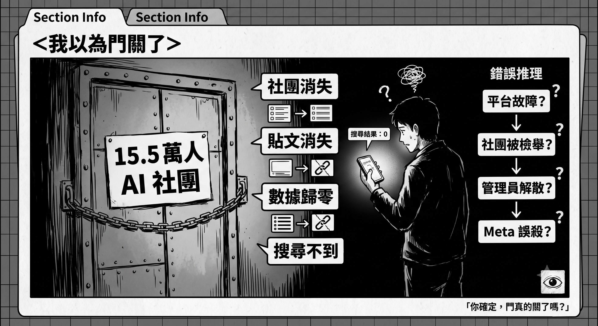
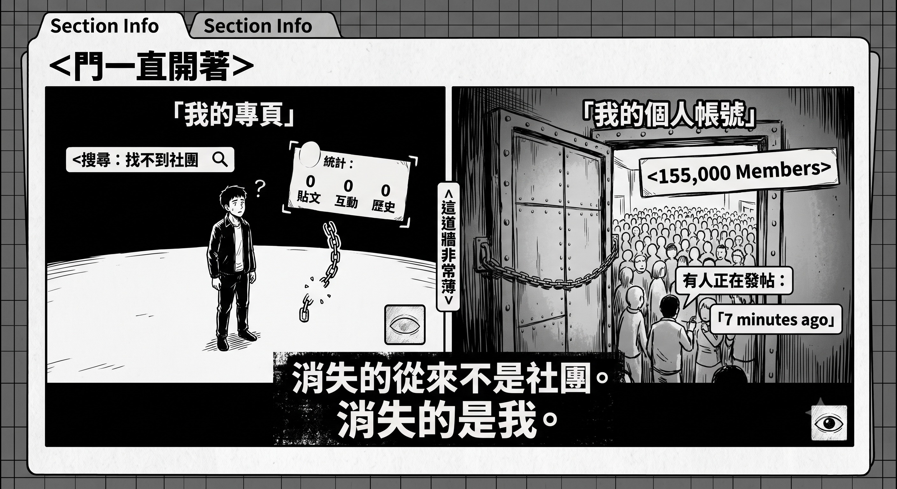
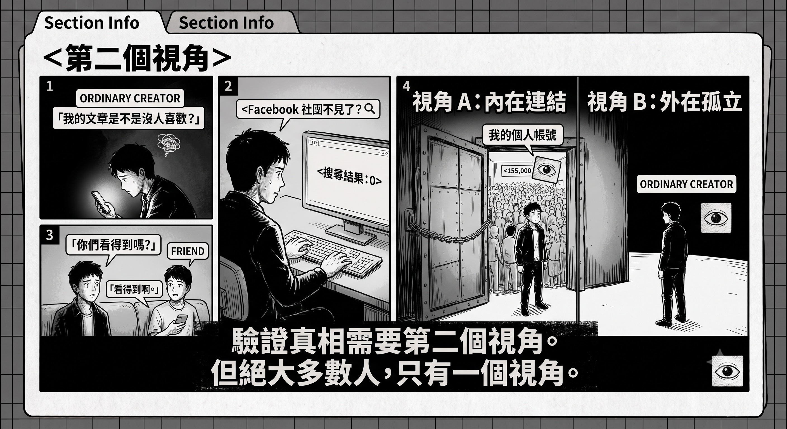
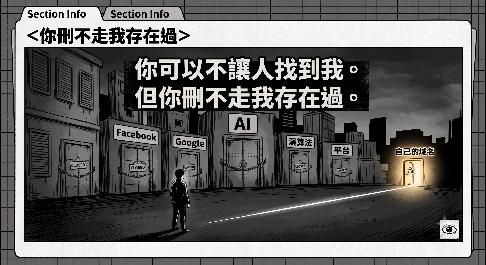

作者：星忘塵 Nebula Walker
Date: 23JUL2026
創象引擎 Mythogen Engine (mythogenengine.com)

**📌 當你以為是平台故障或演算法不推時，真相可能是你已被無聲地從場域中封鎖。一個需要僥倖才能揭穿的排除機制，是最完美的消音。**

# 異常報告裡的讀者・後記——我以為門關了

_原文發表一星期後,事情有了後續。這篇後記記錄的,是我如何發現自己錯了——以及為什麼這個錯誤本身,比原文所寫的一切更能說明問題。_

---
## 九、一個星期的誤判

原文發表前後,發生了一件我當時以為與它無關的事。

我最重要的一條分發渠道——一個十五萬成員的 AI 專業社團——消失了。不是誇張的修辭,是字面意義上的消失:通知全部不見,我在裡面發過的每一篇貼文從後台蒸發,瀏覽數據歸零,互動紀錄清空,連搜尋都找不到這個社團的存在。管理員的個人帳號還在,社團沒有了。

我的第一反應,和任何人一樣:平台出事了。

我查了外媒報導,知道 Facebook 幾個月前確實發生過大規模故障,用戶見到的正是類似的畫面。我在自己的專頁發了一篇貼文,問有沒有人知道發生了什麼事——十一小時,七次瀏覽,三個觀看者,零互動。我甚至推演過各種可能:社團被檢舉下架?管理員主動解散?Meta 的自動系統誤殺了整個社團?

我用了一個星期,認真地研究一場不存在的事故。

## 十、門一直開著

真相是意外發現的。

我有兩個身分:一個個人帳號,一個以筆名運作的專頁。這不是常態——正常人不會有多個帳號,我是因為想以寫作者的身分重新開始,才有了第二個。而正是這個不尋常的第二身分,讓我看見了另一個視角下的世界。

用個人帳號一看:社團好端端的。十五萬五千名成員,貼文照發,討論照跑,七分鐘前還有人在發表 AI 觀察。門一直開著,燈一直亮著,人來人往。

消失的從來不是社團。消失的是我。

準確地說:是我的專頁,被無聲地從社團中封鎖了出去。不是普通的移除——普通移除之後,你仍然找得到社團,仍然可以重新申請加入。我遭遇的是更深一層:封鎖加搜尋屏蔽。從我的專頁望出去,那個世界不存在;從那個世界望進來,我不存在。連帶地,我曾經在裡面發表過的一切、得到過的一切回應、累積過的一切數據,從我的視角被一次過抹除,乾淨得彷彿從未發生。

原文第五節寫過:「它不是說我是垃圾,它只是當我不存在。」我寫那句話的時候,以為自己已經理解了它的全部意思。我沒有。

## 十一、連拒絕都省了

那個社團有一份寫得很體面的版規。違規處理流程白紙黑字:首次違規,提醒並限時修改;累犯,刪文停權七天;屢次違規,永久停權並視情況通報。

我沒有收到過提醒。沒有停權七天。沒有永久停權通知。以上任何一層都沒有發生——因為我遭遇的處理,根本不在他們自己寫的流程之內。版規規管的是「貼文」的命運:刪除、隱藏、移動。而我的遭遇是「身分」的抹除:一個動作,過去現在未來一併清零,不需要理由,不留下紀錄,不觸發通知。

正常的拒絕是有痕跡的。你發帖,版主審核,拒絕——後台會有一筆「未獲批准」,你知道自己被拒了,可以修改,可以詢問,可以放棄。拒絕是一個對話,哪怕是不平等的對話。而我遭遇的不是拒絕。拒絕還需要逐篇處理,還會留下讓你不服氣的證據;封鎖加清除是一鍵完成,而且效果好得多——你不會不服氣,因為你根本不知道有事情發生了。你以為是平台故障,你去研究故障,你去發帖問人,你把矛頭指向一場不存在的事故。

是誰做的?我不知道,而且原則上無法知道。可能是某位管理員的手動操作;可能是 Facebook 的自動規則——群組工具容許設定條件觸發自動移除,連版主本人都未必知情;可能是有人檢舉之後系統自動執行。三種可能,同一個結果,無法區分。而這種無法區分,不是這個機制的缺陷。一個讓你連「該向誰提問」都確定不了的處理方式,免除的正是所有人的解釋責任。

原文寫過一段推測:一個被 AI 垃圾淹沒的守門人,面對一個沒有名氣的帳號和一篇帶外部連結的深度分析,「不確定就拒絕,反正不會有後果」。一個星期之後我才知道,那段推測寫的就是我自己——只是現實比推測更徹底。現實連「拒絕」這個動作都省掉了。

## 十二、第二個視角

這件事最深的一層,不在我身上發生了什麼,而在我為什麼能夠發現。

我能發現,純粹因為我有兩個帳號。而我有兩個帳號,是因為一個相當個人的理由——我想以另一個身分重新開始。這是特殊情況。一個正常的創作者,一個帳號行走天下。他被無聲封鎖之後,永遠沒有可能發現:他會 Google「Facebook 社團不見了」,會問朋友「你們是不是也進不去」,會等幾天看看會不會恢復,會慢慢接受「大概是倒閉了吧」。他不會想到用另一個身分去驗證——因為他沒有另一個身分。

驗證真相需要第二個視角。而絕大多數人,只有一個視角。

這個機制的隱蔽性,不靠加密,不靠技術,靠的就是這個簡單到殘忍的事實。我不是因為警覺才發現的,我是僥倖。而一個需要僥倖才能揭穿的機制,在設計上就是預計你揭穿不了的。

沿著這條線推下去,會碰到一個沒有人能回答的問題:此時此刻,有多少創作者正坐在螢幕前,以為「社團倒了」「平台出事了」「演算法不知為何不推我了」,而真相是他們早已被無聲封鎖了幾個月、幾年?這個數字不存在——不是因為它是零,而是因為統計它的前提,是受害者知道自己是受害者。被消失的人,恰恰是沒有能力發現自己被消失的人。每一個都以為自己遇上了個別的技術問題,每一個都在怪自己內容不夠好、怪演算法改版、怪平台衰落。沒有人知道自己屬於一個模式,所以這個模式永遠不會被集體指認。

而這個模式還有最後一層自我保護:場域的口碑,永遠由沒有被排除的人書寫。留在裡面的人是真誠的——他們真的學到東西、真的遇到好人、真的受益,他們的見證句句屬實。但他們的樣本,全部來自閘門之內。問會所裡的人保安公不公道,答案必然是公道——因為被擋在門外的人,不在裡面回答問題。於是每一個被靜靜移走的人,遲早要面對同一句話:「這麼多人都說好,是不是你自己的問題?」這句話沒有惡意,它只是如實統計了所有聽得見的聲音——而聽得見的聲音,恰恰是篩選之後剩下的那部分。閘門越乾淨,閘內的證言越一致;證言越一致,閘的存在越不可信。一個運作良好的無聲排除機制,最終會由它的受益者——真誠地、免費地——替它作證。

我在另一篇文章裡寫過一種認識論的死結:證據消失之後,你連「證明它存在過」都做不到。平台版本的死結是:封鎖無聲之後,你連「發現自己被封鎖」都做不到。完美犯罪的定義,從來不是沒有人抓到兇手——是沒有人知道有案發生過。

## 十三、鬼引用

還有一個結尾,荒謬得像小說,但有截圖為證。

就在我以為社團消失的那幾天,我在 Google 搜尋自己的網站。搜尋引擎的 AI 摘要跳了出來,寫得相當準確:內容由誰撰寫、探討什麼主題、作者的背景,連我某篇文章的核心論點都轉述得一字不差。它標注的引用來源,是我在那個社團發表過的貼文。

一個我已經進不去的地方。一條點下去什麼都沒有的路。

這個荒謬,是有帳可查的。我的網站接著 Google Analytics,我把最近三個月的報表拉了出來。

Google 自然搜尋在九十天內送來的訪客:八個。一個把我的網站爬得透徹到可以流利轉述我論點的搜尋引擎,平均每十一天,放一個人過來。它吸收了全部,歸還了八個。「內容存活了,通道死了」——這句話現在有了精確的匯率。

報表裡還有一層更深的東西。三個月的「活躍使用者」總數是三百七十,已經少得可憐;但打開城市分佈,排在香港之後的名字是:Council Bluffs、Boardman、Forest City、Luleå、Prineville、Ashburn。這些不是城市,是機房——分別是 Google、Amazon 與 Meta 的數據中心所在地。我那三百七十個「讀者」裡,至少三分之一是爬蟲。機器們日夜到訪,閱讀,吸收,然後回到答案層去替我回答問題。真正的人類,三個月大約二百餘個。

但同一份報表裡,有一個數字朝著完全相反的方向:最大的流量來源,不是任何平台,是 Direct——二百三十五個直接到訪的人。沒有經過演算法,沒有經過搜尋,是掃了二維碼、手打了網址、或者被另一個人直接遞了一條連結的人。而這批人的行為數據,和平台上的殭屍互動是兩個物種:平均停留九十八秒,核心欄目的跳出率不到一成。原文說過,鏈不需要規模,它需要的只是把對的人送到門口——這份報表就是那條鏈的存在證明。平台的通道全部壞死或被切斷之後,我的網站還有一條主動脈,而它完全由人手遞手地組成。

我的文字還在流通——在 AI 的答案層裡,被完整地吸收、轉述、呈上給每一個搜尋的人。搜尋的人得到了答案,不需要點進來;我的網站,同期瀏覽數是零。內容存活了,通道死了,作者被留在兩者之間:名字還掛在答案上,路已經斬斷了。

原文的標題說,真話與垃圾走同一條通道入場。這篇後記可以補上下半句了:有時候,真話入了場——而說真話的人,被留在門外。門上沒有封條,沒有告示,甚至沒有關上。它只是,從你的方向看過去,不存在。

## 十四、堡壘

診斷寫完了,應該交代一下,我現在怎樣活。

我的寫作系統現在長這樣:所有原稿,是我本地硬碟上的純文字檔案,任何平台都碰不到它們;每一次修改都進入版本紀錄,哪一天寫、哪一天改,機器蓋章,不容抵賴——上一篇文章寫過,延遲審批的真正傷害是讓你的時間戳失效,現在我的時間戳不再由任何平台保管;自己的域名是正典,那二百三十五個直接到訪的人,去的就是那裡;文章的副本釘上分散式網路,拿一個內容指紋——指紋一經散出,刪掉源頭也刪不走「它存在過」的證明,我在另一篇文章裡寫過一份報紙的全部檔案如何一夜下線,這一層,就是為那種夜晚準備的;至於各個社交平台,全部降級為天線——用來掛一張二維碼,不期望,不依賴,不存放任何東西。它們哪一天再無聲地封鎖我,我損失的只是一條早已列入陣亡名單的天線。

每一層,對應我親歷過的一種死法。這個系統不會帶來一個新讀者。它不是為增長而建的。

有人會問:為什麼不動用現實關係?舊同學、舊同事、行內的人脈,逐個訊息發過去;再配合一點低摩擦的爆穀內容,流量不就有了?

答案有兩層。第一層是一致性。原文說過,那條人傳人的鏈,單位是自願押上自己信譽的讀者。拿人情去換轉發,是要求別人在沒有讀過、或者不方便說不的情況下替你背書——鏈的第一節就是假的,而一條由虛假節點開始的鏈,和演算法餵給我的新加坡機械人,沒有本質分別。至於爆穀:我寫的東西本質上是高摩擦力的,把它改造成兩秒可以消化的形狀,活下來的那個東西,已經不是它。

第二層更簡單,也更誠實。如果寫作是為了錢,這條數根本不成立——以我的履歷,回去上班,或者專心投資,回報都比寫作高出幾個數量級。寫作在經濟上是不理性的。所以它只可能為了一件事存在:寫我想寫的東西。而正因為不為錢,我才承受得起沒有人看的絕望,也才承受得起「是金子總會發光」這句話裡,那個沒有期限的「總會」。

所以這座堡壘的用途,從來不是等待爆發。它是確保存在。當某一天,某個對的人——像那位深夜去找一首一九八九年的歌的管理員——經過門口,門還在,內容還在,指紋還對得上。它保證的不是被看見,而是永遠處於可以被看見的狀態,不需要任何人批准。

你可以不讓人找到我。但你刪不走我存在過。

## 十五、所以這篇後記存在

原文的結尾說,在三重封鎖之下,值得讀的東西仍然可以由懂得讀的人手遞手地傳下去,因為那條人傳人的鏈,演算法看不見,所以也殺不死。

這個結論,經過這一個星期,我不但沒有收回,反而要加重它。

因為現在清楚了:平台通道不只會壞死,它還會在你不知情的狀況下被單方面切斷,切得乾淨到你以為是世界出了問題。你以為你在和演算法搏鬥,其實你可能早已不在場上;你以為你的內容不夠好,其實可能根本沒有人看過它,包括判你出局的那一方。在這樣的環境裡,任何建立在單一平台、單一帳號、單一視角上的寫作生涯,都是在別人的手指和刪除鍵之間討生活。

我把這篇後記寫下來,原因很簡單:下一個被消失的人,不會有第二個帳號。他不會發現,不會申訴,不會寫後記。他只會在某一個晚上,對著一片他以為是故障的空白,慢慢懷疑是不是自己的問題。

不是的。這篇文章就是那個第二視角。如果你正在那片空白面前——先別急著怪自己。

---
_本後記是〈異常報告裡的讀者——當真話與垃圾走同一條通道入場〉的續篇。姊妹篇〈效率陷阱・續章〉拆解的是同一部機器的另一面:當「自然流失」寫在財報上的時候,實際發生的是什麼。兩邊的共同點只有一個:最乾淨的紀錄,往往覆蓋著最徹底的處理。_

---

> **📚 平台消音與認知封鎖五部曲**
>
> 1. [機器點樣幫手執行一場已經發生咗嘅刪除](./機器點樣幫手執行一場已經發生咗嘅刪除.md)
> 2. [異常報告裡的讀者——當真話與垃圾走同一條通道入場](./異常報告裡的讀者——當真話與垃圾走同一條通道入場.md)
> 3. **異常報告裡的讀者・後記——我以為門關了**
> 4. [零違規，每篇二十四個曝光——一個帳號的分發帳本](./零違規，每篇二十四個曝光——一個帳號的分發帳本.md)
> 5. [半個鐘頭的生產線](./半個鐘頭的生產線.md)
