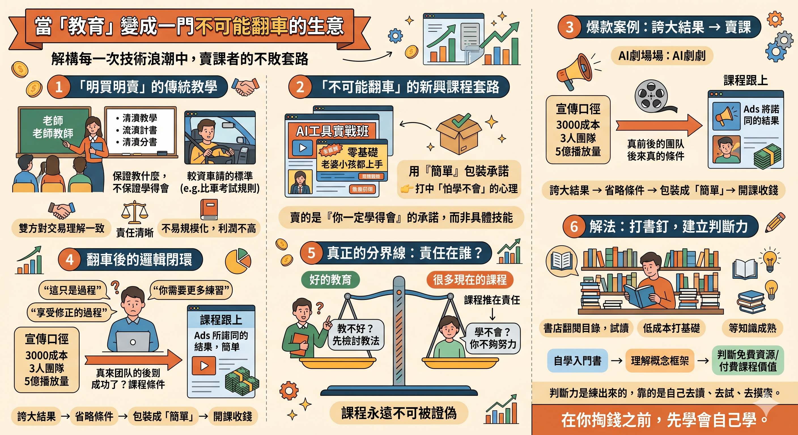

# 當「教育」變成一門不可能翻車的生意

---

**為什麼每一次技術浪潮，最先賺到錢的，都是賣課的人？**

十幾年前是機器人、LEGO 教育、兒童編程。 後來是區塊鏈、NFT、Web3。 現在是 AI。

工具換了，套路一模一樣。

而我自己，十幾年前教過書。

所以我想從一個教過書的人的角度，把這件事拆開來講。

---

## 一、我教過書，所以我知道「明買明賣」是什麼

很多年前，我做過補習、做過技能教學。

教完學生一定學得會嗎？不一定。補習從來不是保證結果的事。

但有一樣東西是清楚的：**大家都知道這盤交易是什麼。**

就像學車——沒有人保證你一定考到牌，但你知道你在學什麼、考什麼、標準是什麼。教的人知道，學的人也知道。學完能不能上路是一回事，但「學的是開車」這件事，沒有任何模糊的空間。

我教書也是一樣。教一個技能，學生練，練完能不能做到，雙方心裡都有數。做不到的時候，我不會跟他說「享受修正的過程」——我會想是不是教法要調整、節奏要放慢、還是我高估了他的基礎。

這種教學不性感、不容易規模化、利潤也不高。

但它有一個特質：**明買明賣。**

你知道你買什麼，教的人知道他賣什麼。雙方對這件事的理解是一致的。

---

## 二、現在賣的是什麼？

打開 Facebook、Thread、X，你會看到鋪天蓋地的課程廣告：

「AI 工具實戰班」 「零基礎也能學會」 「老婆小孩都能簡單上手」

價錢不便宜，動輒過萬。

但仔細看，你會發現一件事——

**這些課程幾乎從來不講「你學完之後能具體做到什麼」。**

它們講的是：

- 很簡單
- 不需要基礎
- 跟著做就行
- 我做到了，你也可以

聽起來很合理。但這裡面藏了一個結構性的問題。

---

## 三、「簡單」比「月入十萬」更毒

很多人以為最容易中招的是那種「月入十萬、轉行成功、一人公司」的承諾型課程。

其實不是。

那種大話，多數人還是會懷疑一下的。你會計數，會想「真的假的」，至少理性還在運作。

**真正吃掉最多人的，是賣「簡單」的那一層。**

「不用基礎」 「小朋友都學得會」 「跟著步驟做就行」

這些話繞過了你的理性判斷，直接打中的是一個更基本的心理——

👉 **「我怕自己學不會。」**

當一個課程告訴你「你一定學得會」，它賣的不是技能，是一個承諾：你不會被難倒。

而這個承諾，幾乎不可能被追究。

因為學完之後如果做不到，結論永遠是「你不夠努力」，不是課程有問題。

---

## 四、《霍去病》：一個完美的示範

最近有一個案例，把這整條鏈完美演示了一遍。

AI 短劇《霍去病》在網上爆紅，宣傳口徑是這樣的：3000 元人民幣成本、3 人團隊、48 小時完成、5 億播放量。千軍萬馬、塵土飛揚、電影級畫面——全部 AI 生成。

聽起來是不是很熟悉？「簡單」「低成本」「anyone can do it」。

但後來製作團隊自己出來澄清了：所謂 3000 元只是算力成本，不包含人力；團隊不是 3 個人，是將近 20 位；而「5 億播放量」這個數字，在海外平台上的實際互動量只有十多萬級別，據稱的 80 集也根本不存在於任何影視平台上。

換句話說——**宣傳裡最吸引人的每一個數字，都有水分。**

但這不是重點。重點是接下來發生的事。

基於這個灌了水的「成功案例」，課程馬上跟上來了。打開 Bilibili，你已經能看到：

「用 AI 做了《霍去病》爆款短劇，5 億多播放量，成本僅用 3 千，全流程無私分享！手把手教學，全程乾貨無廢話！輕鬆學會！」

看到了嗎？

一個數據本身就有問題的「結果」，被省略掉所有真實條件之後，變成了「你也可以」。然後賣課的人進場了。

**這就是完整的鏈條：誇大結果 → 省略條件 → 包裝成「簡單」→ 開課收錢。**

而你照著做，翻車了。然後呢？

---

## 五、翻車之後，才是最精妙的部分

如果只是翻車，這個生意模型還不算完美。

**真正精妙的是：翻車本身也被收編了。**

當你學完做不到，你不會得到「課程有問題」這個結論。你會得到：

「這只是過程。」 「偶爾翻車很正常。」 「享受修正的過程。」 「學習本來就不是一蹴而就的。」

聽起來很正面、很勵志、很合理。

但你想清楚：**這套話術的功能是什麼？**

它的功能是——讓這個課程永遠不可能被證偽。

- 成功了？課程有用。
- 失敗了？你還在路上。
- 一直失敗？你需要更多練習（順便推薦進階班）。

這是一個邏輯閉環。一旦你進入這個閉環，就沒有任何結果可以讓你說出「我被騙了」這四個字。

因為「被騙」這個判斷，已經被提前消毒了。

---

## 六、「你情我願」的灰色地帶

有人會說：這有什麼好講的？又沒犯法，你情我願。

這話我聽過很多次。親戚問過，朋友問過，甚至我自己也問過自己。

「你明明知道這個生意怎麼玩，為什麼不自己下場？」

邏輯上確實沒問題：合法、有市場、有需求、你又有能力。

但「合法」跟「明買明賣」是兩件事。

法律管的是底線——你不能詐騙、不能虛假廣告（雖然很多打擦邊球）。

但法律管不到的那一層，才是問題所在：

👉 **買的人以為自己買的是什麼，跟他實際拿到的，是不是同一件事？**

如果一個人花一萬五報了一個「AI 實戰班」，他心裡想的是「學完我能用 AI 做出東西」，但實際拿到的是「十條錄播影片、三個 template、一個群組」——

這不是詐騙，但這也不是明買明賣。

這是一種「預期管理術」：銷售的時候管理你的預期，讓你覺得自己買的很值；交付的時候降低標準，讓你覺得拿到的也不算差。

中間那個落差，就是利潤。

---

## 七、真正的分界線

所以問題不是「課程有沒有用」、「AI值不值得學」、「教育應不應該收費」。

這些都不是重點。

**重點只有一條線：**

> **你宣傳的內容、效果，跟學生實際拿到的，是不是一致的？**

這就是明買明賣。

我十幾年前教書，從來不需要跟學生說「享受修正的過程」。因為學不學得會是一回事，但「我們在教什麼、學什麼」，雙方從來沒有模糊過。學生做不到的時候，我第一反應是檢討教法，不是叫他「再努力一點」。

好的教育不是保證結果，但有一個很簡單的特徵：**雙方對這盤交易的理解是一致的，而教的人願意為教學質量負責。**

學不會？先想想是不是教法的問題。 做不到？先想想是不是難度設定有誤。 學生放棄了？先想想是不是節奏不對。

**教的人至少會先問自己，而不是直接把責任推回去。**

而現在很多課程，把這個責任完全反轉了：

學不會？你不夠努力。 做不到？你需要更多時間。 放棄了？你沒有堅持。

**責任永遠在學生身上。**

這就是最根本的區別。不是價錢，不是形式，不是線上還是線下——是責任在誰身上。

---

## 八、那怎麼辦？打書釘

講了這麼多問題，總要講一個解法。

這個方法不新、不性感、不適合所有人，但我自己一直在用：

**去書店，打書釘，買書。**

當一個全新的領域出現——不管是 AI、區塊鏈、還是任何你完全不懂的東西——你不需要馬上花幾萬塊報課程。你可以等。

等什麼？等知識和技術稍微成熟一點，等市面上出現入門書和進階書。

然後你去書店，翻一翻目錄，讀幾頁試讀，看看哪本適合你現在的程度。先買一兩本，花幾百塊港幣、一兩千塊台幣，把基礎打下來，搞清楚這個領域的基本概念和框架。

有了這個底之後，你再去看網上的免費資源、AI 工具的教學、雜誌的深度報導——這時候你已經有能力判斷哪些內容有價值、哪些是在浪費你的時間。

**最後，如果你真的需要上課，你也有能力判斷一個課程值不值那個價錢。**

因為你已經有了基礎，你知道課程講的東西是不是你書裡已經讀過的、是不是真的有進階內容、還是只是把免費資訊包裝了一層就賣你錢。

書當然不是萬能的。但它有一個優勢：**你在付錢之前，翻幾頁就已經知道你買的是什麼。**

---

## 九、但判斷力才是真正的門檻

這一步難嗎？難。尤其是從來沒有看書習慣的人，要自己去摸索一個陌生領域的知識結構，確實不容易。

但反過來問：如果連這一步都跨不過，**是不是付了錢就真的能買到知識？**

順帶補一句公道話：不是所有付費學習都是賣焦慮。產業研討會就是一個例子——通常很貴，多數時候公司買單，內容是業內人士的分享和趨勢分析。它不教你「零基礎入門」，因為對象本來就不是零基礎的人。它不是在騙你，只是有特定的目標和受眾。**問題從來不是東西本身好不好，是你有沒有能力判斷它適不適合你。**

---

## 最後

這篇不是說所有課程都是騙局，也不是說 AI 不值得學。

甚至書也一樣——書店裡照樣擺滿了「30天學會XX」「AI時代你不能不懂的XX」，封面就是在賣恐懼。書的好處不是內容一定好，是你可以翻完再決定買不買，判斷成本低。但書本身不是解藥。

課程、書、研討會、免費資源——載體不是重點。

**重點是你有沒有判斷力，知道自己需要什麼。**

而判斷力不是天生的，是練出來的。靠的是自己去讀、去試、去摸索，慢慢搞清楚一個領域的基本結構。這個過程沒有捷徑，也沒有人能替你做。

所以最後這篇想說的，其實就一句話：

**在你掏錢之前，先學會自己學。**

---

**P.S. 還有一種更高級的**  
有一種課程賣法，比直接說「很簡單」更難識破。  
它會先告訴你：「這很難」「我踩了很多坑」「除錯花了很多時間」。聽起來很誠實，你也因此更信任他。  
但接下來，他會展示一個很厲害的成果，然後說：「不過有心就不怕」「我帶你入門，剩下靠你自己」「跟著我的方向開始就行」。  
你感受到的是：這個人很真誠、很有實力、而且願意帶你。  
你沒感受到的是：他嘴巴講了「難」，但從來沒有告訴你——以你現在的程度，離做出那個成果，到底有多遠。  
說「很難」只是姿態。對比讓你知道「這件事對你來說現在能不能做」，才是明買明賣。