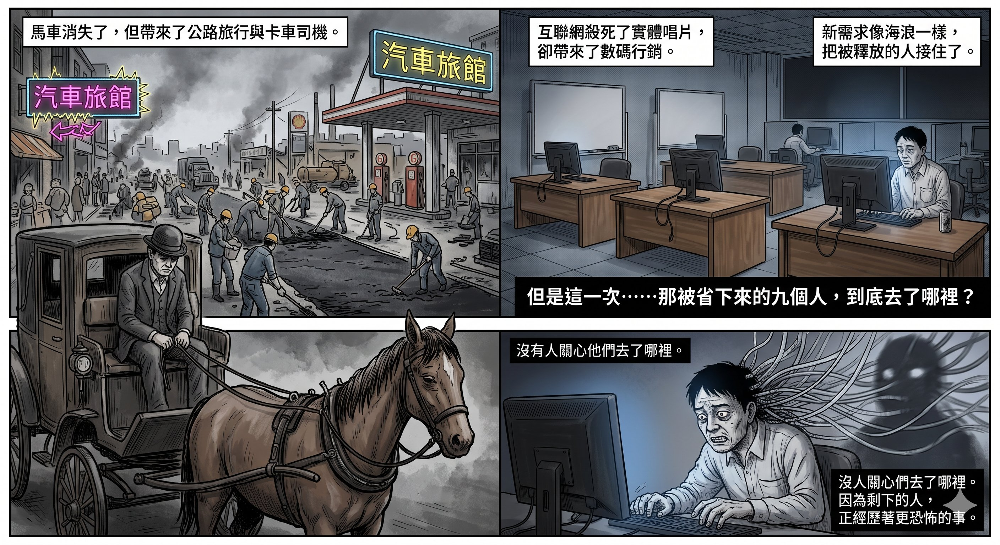
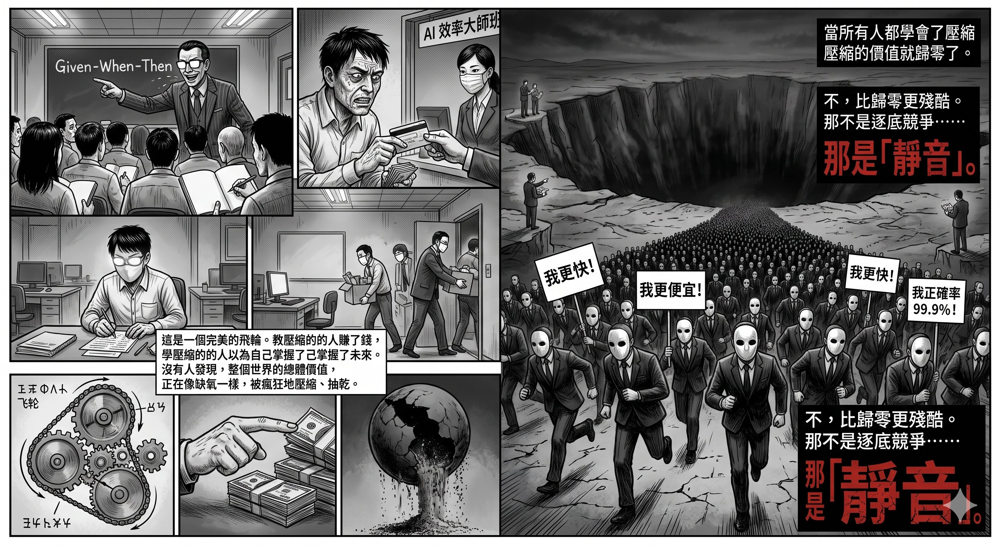

# 效率陷阱：當所有人都在學AI，誰在創造新需求？

## 三天做完四個月的工作

最近 AI 圈流傳一篇文章。一個開發者用 ChatGPT 搭配 Claude Code，二十個小時完成了一套內部系統，功能清單列出來超過兩百個模塊。她說以前問工程師報價，至少要三到四個月。

文章寫得很長，很有料。任務拆解、決策分層、Session 管理、SOP 設計——全部都是做過才講得出的實戰經驗。留言區幾百個讚，幾百個分享，所有人都說「學到東西了」。

我不懷疑她做到了。我甚至不懷疑這套方法對她來說確實有效。

但我想問一個整篇文章沒有人問的問題：

**三到四個月的工作量被壓縮到三天。那三到四個月的人，去了哪裡？**

## 一幅很漂亮的圖

每一次技術革命都有人畫同一幅圖。

自動化會釋放人力。人不必做重複的事，就可以去做更有創造性的事。研發不必到產線支援，就有更多精力做研究。工程師不必寫重複代碼，就可以專注設計。

這幅圖很漂亮。但它有一個前提：省出來的時間和人力，必須被導向新的需求、新的創造、新的可能性。

如果沒有這個前提？

效率提升就不是擴張。是壓縮。

而壓縮這件事，在華爾街的語言裡有另一個名字：margin improvement。

聽起來很正面。實際意思是：用更少的人做同樣的事，然後把省下來的成本變成利潤。

## 壓縮的三種面貌

**第一種：直接裁。**

以前五個人做的事，現在一個人加 AI 就做到了，其餘四個走人。這種最明顯，新聞會報，LinkedIn 會討論，所以反而不是最危險的。至少你知道自己被裁了。

**第二種：不裁，但偷走你的工作內容。**

這種才恐怖。

人數沒變，職銜沒變。但研發不再做研發，改做 AI 輸出的品質檢查。PM 不再做產品思考，改做 Prompt 管理。架構師不再設計系統，改做 AI 生成代碼的 Code Review。

你還坐在同一張桌子，用同一部電腦，吃同一間公司的飯。但你做的事已經不再是你被請回來做的事。你從一個思考者變成一個監工。沒有人會發公告說這件事。你的 title 還是 Senior Engineer。只不過你每天的工作變成替 AI 收拾殘局。

最諷刺的是，你還要感恩。因為你沒被裁。

**第三種：壓縮完，出去教壓縮。**

這一環我覺得最值得說。

一個人在企業裡經歷了第二種壓縮，學會了「用最少人手產出最高 output」的方法。然後離開，開課，教其他人同一套東西。

他教的不是創造。

他教的是壓縮。

學他的人再去自己的公司實踐，複製同一個循環。被壓縮的人為了保住飯碗，又去上課。上完課的人如果夠厲害，自己也開始教。

一個完美的飛輪。每一輪都有人賺到錢——開課的人。每一輪都有人覺得自己學到東西——上課的人。

但整個系統的總效果，是壓縮的加速。

## 阿強的故事

阿強在一間中型電商公司做內容主管。他帶一個五人團隊：自己做主編，兩個文案，一個設計，一個社群。每個月穩定產出三十篇內容，配合四個行銷活動。不算快，但質素穩定，因為每篇東西背後都有人在理解品牌、理解受眾、做判斷。

有一天老闆轉發了一篇文章給他：「AI 讓我一個人完成五人團隊的工作量。」

附了一句：「研究一下。」

阿強心裡涼了一下。他知道這句「研究一下」是什麼意思。

三個月後，團隊從五個人縮到兩個。產出量從三十篇變成一百篇。老闆很開心，成本減半，產出三倍。阿強升了半級，加了一點薪水，因為他「成功帶領團隊轉型」。

但阿強知道實際發生了什麼。

一百篇裡面，有七十篇是換湯不換藥的 AI 模板。受眾互動率跌了四成。品牌語氣開始模糊，因為沒有人再花時間想「我們到底想跟客人說什麼」。他自己每天的工作變成：餵 AI、改 AI 的輸出、上傳、再餵、再改、再上傳。

他從一個主編變成了一個 AI 餵食員。

半年後，老闆覺得效果不夠好，請了一個「AI 內容顧問」來做培訓。顧問看了一眼他們的 Prompt，說：「太簡單了。你們需要升級 Workflow。」

阿強忍住沒說話。因為他知道：所謂「升級 Workflow」，意思是他要學一套新的餵食方法。而他以前真正會做的事——品牌策略、受眾洞察、內容判斷——已經沒有人需要了。

顧問走了之後，阿強收到老闆的訊息：「顧問很專業。你安排團隊落實。」

阿強看著螢幕，心裡想：這個顧問以前應該也是做內容的吧。

## 那九個人做什麼？

歷史上每一次技術革命都要回答同一道題：效率提升之後，被省下來的人去了哪裡？

回答得好的，就不只是技術革命，而是文明躍進。

汽車淘汰了馬車。但汽車不只是「更快的馬車」。它催生了公路系統、郊區住宅、長途物流、公路旅行。馬車伕消失了，但的士司機、貨車司機、汽車維修員、交通工程師出現了。新的需求吸收了被釋放的人力。

互聯網淘汰了旅行社、報紙分類廣告、實體唱片行。但同時創造了電商、社交媒體、串流平台、數碼行銷、UX 設計。有一段痛苦的調整期，但最終新需求還是出現了。

AI 呢？

現在最常見的敘事是：「以前要十個人做的事，現在一個人就做到了。」

很少人問下一句：「那九個人做什麼？」

更少人問：「AI 有沒有打開任何以前不存在的需求？」

如果答案是沒有——如果 AI 只是讓現有的事做得更快更便宜，但沒有催生新的市場、新的職能、新的消費形態——那它就不是技術革命。

它只是一個很厲害的壓縮工具。

而壓縮不創造價值。它只是把價值從一個地方搬到另一個地方。通常是從做事的人，搬到持有資本的人。

## 為什麼市場會自然教壓縮

你有沒有留意到，絕大部分 AI 課程賣的是什麼？

用 AI 寫文案。用 AI 做設計。用 AI 寫程式。用 AI 做分析。用 AI 做報告。

每一個都是同一句話的變體：「你可以用更少的時間做到以前需要更多時間的事。」

沒有一個是：「你可以做到以前做不到的事。」

這不是因為老師存心不良。這是因為壓縮容易教、容易學、容易展示效果、容易收費。你上完課，產出快了，可以即時感覺「值回票價」。

但創造很難教。「你應該解決什麼問題」這道題，沒有標準答案，沒有 before/after，沒有三天密集班可以搞定。

所以市場自然會傾向教壓縮。不是陰謀，是經濟學。

問題是：當所有人都學會壓縮，會發生什麼？

直覺上你會覺得：所有人都壓到同一個水平，壓縮的價值就歸零。

但現實比歸零更殘酷。

## 不是歸零，是靜音

你打開短影片平台，會看到某種風格的片子突然全部都是。同樣的節奏、同樣的轉場、同樣的配樂、同樣的文案結構。AI 讓複製一條爆片的成本趨近於零，所以每一條爆片出現之後，幾天之內就會有幾百條模仿品。

你看到的是：這種內容好像很火。

你看不到的是：那幾百條模仿品裡面，有多少死在零播放。

廢話文學也是同一個結構。某些作者靠著精準的情緒節奏大賣，你不能說他沒有市場——他確實大賣。但他大賣的同時，有多少人用同一套模板寫了同一種東西，然後沉在平台底部，連被看到的機會都沒有？

AI 沒有讓所有人歸零。AI 讓分佈變得更極端。

頭部更頭部。尾部被靜音。

少數人靠著先發優勢、平台紅利、或者某種無法被複製的個人特質繼續吃。大量人在底層用同一套壓縮工具互相踩踏。而這個分佈最殘酷的地方是：從外面看，你只會看到爆的那幾個。然後你會覺得——這條路行得通。

然後你報名上課。

然後你學會了壓縮。

然後你成為那個分佈裡面，又一個被靜音的人。

這不是逐底競爭。逐底競爭至少大家都還在場上。

這是大量的人被無聲地移出賽場，而他們自己都不知道。

## 壓縮教育的進化

如果你以為壓縮教育只停留在「教你用 AI 寫文案」的層次，那你低估了這個市場的學習能力。

市場也會進化。

最近有一類新課程開始出現。它們不再教你按哪個按鈕、寫什麼 Prompt。它們教方法論——TDD、BDD、DDD，這些在軟體工程界存在了十幾二十年的正經東西。測試驅動開發、行為驅動開發、領域驅動設計。每一個都有歷史沉澱，有學術根基，有業界實踐。

然後它們說：把這些方法論跟 AI 結合，你就能讓 AI 生成百分之百正確的程式碼。

課程頁面設計得很精緻。正確率從七成開始，一級一級往上——八成、九成、九成九——每一級都讓你覺得「差一點就到了」。最後那個一百，寫著「課程機密，不公布做法」。

你不能說這是騙。因為 TDD 和 BDD 確實有價值。會寫可執行規格的工程師，確實比不會的強。課程裡教的東西，拿出來單獨看，每一塊都是真的。

但你仔細看它的核心承諾，會發現一件事：

「AI 寫程式會出錯，是因為你的規格不夠好。學好規格，AI 就不會錯。」

翻譯一下：壓縮的瓶頸不是工具，是你的規格。所以你要學寫更好的規格，讓壓縮更徹底。

它還是在教壓縮。只是層級升了一級。

從「用 AI 寫 code」升到「用 AI 根據規格自動生成正確的 code」。聽起來是進步——確實也是某種進步。但它依然沒有問那個根本問題：這段程式應不應該存在？這個系統解決的是真問題還是假問題？壓縮得再完美，方向錯了，只是更高效地走向錯誤。

而這裡藏著一個更微妙的矛盾。

真正能寫好規格的人，是在大量實戰中浸過的人。他寫得出精確的邊界條件，不是因為學過某套框架，而是因為他踩過那些邊界、被邊界反咬過、修過邊界引發的災難。課程可以教你 Gherkin 語法、教你 Given-When-Then 的結構。但「這個系統的邊界條件在哪裡」這種判斷，不是語法能解決的。

所以這類課程的進化，某種程度上更危險。因為它有料。

「有料」讓人放下戒心。你會覺得：這不是那種空泛的 AI 速成班，這是有根基的專業課程。但「有料」不等於回答了根本問題。它只是把壓縮包裝得更像創造。

第一代壓縮教育說：「跟我學這套 Prompt，你就能更快。」

第二代說：「跟我學這套方法論，你就能更準。」

下一代大概會說：「跟我學這套思維模型，你就能更深。」

每一代都更有實質內容。每一代都更難反駁。但每一代的核心承諾都是同一句話的變體：

**「跟著做，你就行。」**

而每一代都迴避同一個事實：你帶入的隱性判斷力，不是方法論的一部分。

## 最麻煩的一環

整個循環裡最麻煩的一環，是很多老師自己都不知道自己在教壓縮。

他們真心覺得自己的方法有效。因為對他們來說確實有效。

一個有十年產品經驗的人，用 AI 做到很快的結果。他把方法整理成課程，教給學員。但他的方法之所以有效，不是因為 Prompt 寫得好，是因為他知道應該做什麼、不應該做什麼、什麼時候要停、什麼時候要推進。

這些判斷力，他自己覺得理所當然，因為他做了十年。但他不會寫在課程裡。不是他不想寫。是他自己都不覺得那是一種能力。

就像一個天生味覺靈敏的廚師寫食譜。每個步驟都寫得很清楚：幾克鹽、幾度火、幾分鐘。學員照著做，味道不對。廚師說：「你火候控制不夠。」然後開一個進階班教火候。

但真正的問題可能是：他在第三步加鹽的時候聞了一下，覺得不夠，多加了半茶匙。這個動作他自己都沒留意。因為對他來說，這不是決策。這是本能。

你沒辦法把本能寫成 SOP。

所以學員會一直覺得差一點、一直覺得要再學多一些、一直回來上進階班。而廚師會一直覺得「我已經全部教了，你們自己不夠努力」。

這不是詐騙。這是認知盲點。但結果跟詐騙很像。

## 真正稀缺的東西

如果你認同效率提升必須配合新需求才有價值，那下一個問題就是：AI 時代，新需求是什麼？

我不知道完整的答案。但我覺得方向越來越清楚。

當所有人都會用 AI 生成內容，真正稀缺的不是內容，而是判斷——哪些內容值得存在。

當所有人都會用 AI 寫程式，真正稀缺的不是程式，而是定義——這個程式應該解決什麼問題。

當所有人都會用 AI 做分析，真正稀缺的不是分析，而是問題——應該分析什麼。

AI 壓縮了執行的成本，但同時放大了判斷的價值。

這是好事。但判斷力有一個令人尷尬的特質：

它無法被標準化。無法被打包。無法被 fork。

它不是一個 Skill 資料夾。不是一套 Prompt。不是一個 Workflow。它是一個人經過長時間的經驗、錯誤、反思之後，長出來的東西。

沒有人教這件事。不是因為沒有人想學。是因為沒有人知道怎麼賣。

三天密集班教不了。「照著做你就行」的模式裝不下。Before/after 展示不出來。

所以市場會繼續教壓縮。

而判斷力會繼續稀缺。

## 一個你可以問自己的問題

下次你看到一篇「AI 幫我 XX 小時完成 XXX」的文章，或者一個「教你用 AI 提升效率」的課程，試著問自己一個問題：

**它教的是創造新的價值，還是壓縮現有的價值？**

如果答案是壓縮，再問：

**當所有人都學會壓縮之後，我站在哪裡？**

這個問題沒有標準答案。

但至少問了這個問題的人，已經做了一件整個壓縮循環裡最少人做的事——

停下來。

---

> **📚 效率陷阱與認知侵蝕四部曲**
>
> 1. [認知與判斷——AI 時代人類最後的不可取代性](./認知與判斷——AI 時代人類最後的不可取代性.md)
> 2. **效率陷阱：當所有人都在學AI，誰在創造新需求？**
> 3. [殺死創新的標準作業程序](./殺死創新的標準作業程序.md)
> 4. [效率陷阱・續章：你以為你贏了](./效率陷阱續章・續章：你以為你贏了.md)
