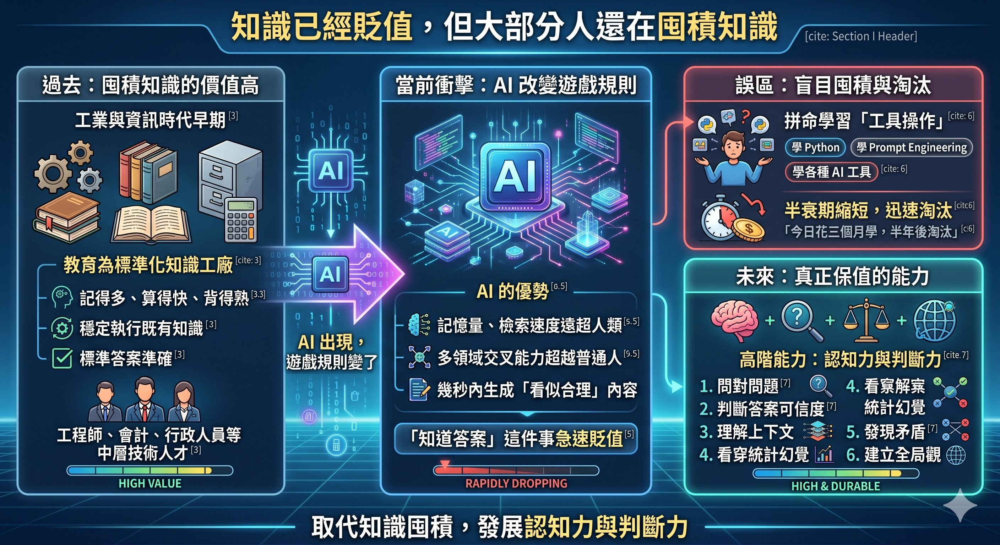
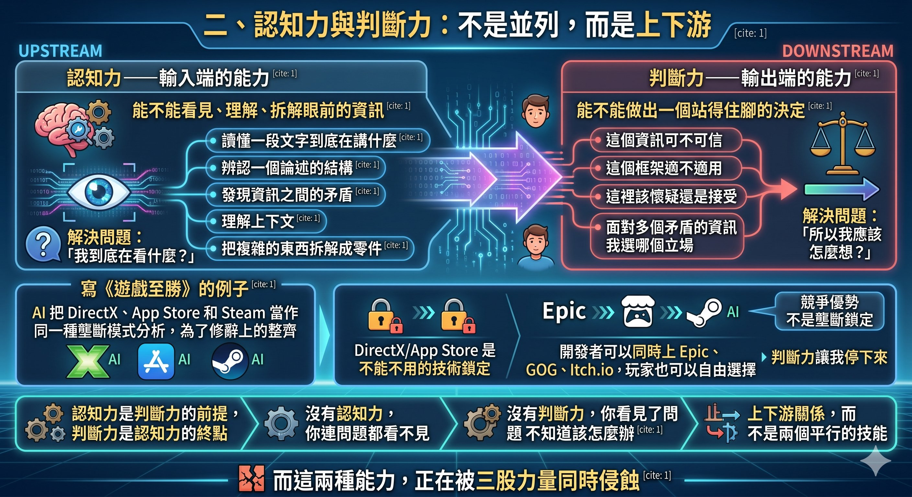
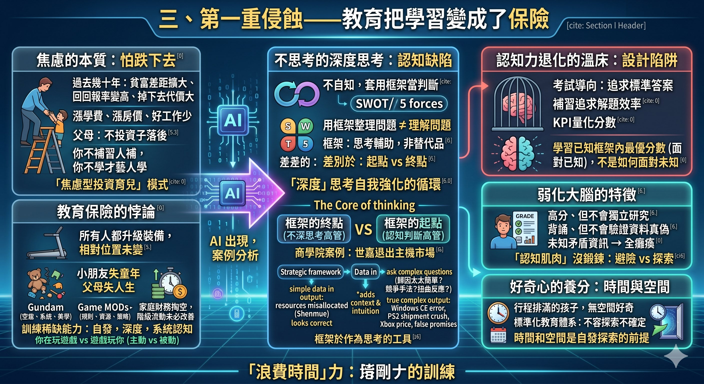
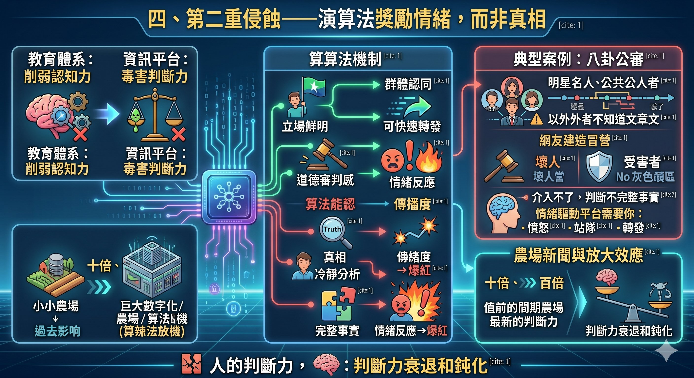
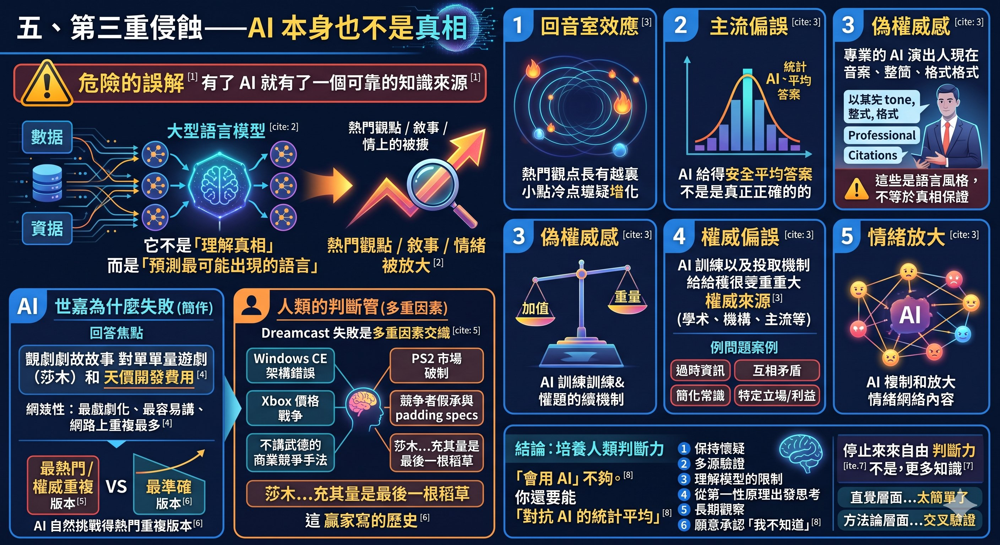
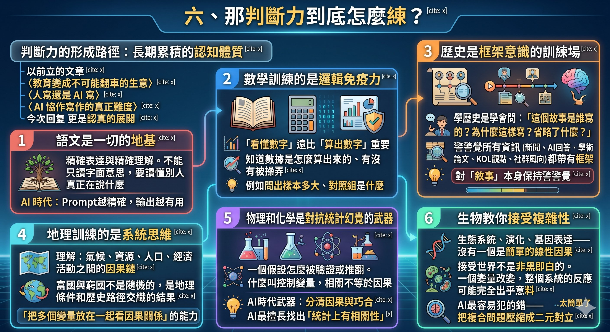
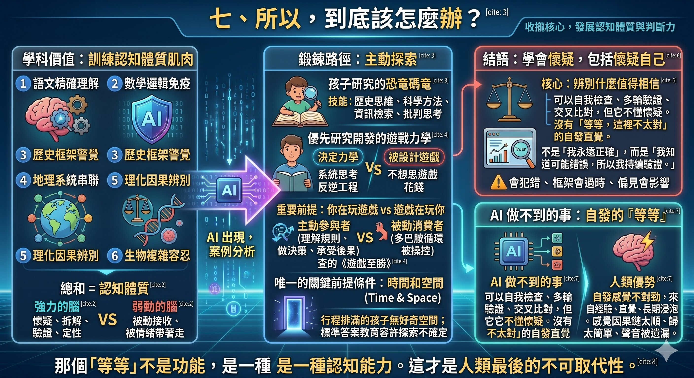

作者：星忘塵 Nebula Walker
Date: 20MAY2026
創象引擎 Mythogen Engine (mythogenengine.com)

**📌 系統性論證AI時代認知力與判斷力的形成路徑，以及教育、演算法、AI三重侵蝕。**

# 認知與判斷——AI 時代人類最後的不可取代性

## 前言

AI 時代最稀缺的不是知識，是「辨別什麼值得相信」的能力。

這句話聽起來像老生常談，但如果你認真觀察身邊的人——包括那些學歷很高、收入不錯、在社會上被認為「很聰明」的人——你會發現一個令人不安的事實：大部分人對資訊的判斷力，並沒有隨著學歷和年齡增長。他們會轉發未經驗證的新聞，會被情緒化的標題牽著走，會容易服從或盲目反對權威資訊，亦會把 AI 生成的內容當成權威，會在網路上對一個陌生人做出道德審判卻連基本事實都沒核實過。

這不是智商問題。這是認知結構的問題。

我觀察科技產業的底層結構多年，寫了《遊戲至勝》這本書，過程中大量使用 AI 作為協作工具。這段經歷讓我越來越確信一件事：AI 時代真正需要的能力，不是大家拼命在學的那些東西——不是 STEM、不是各種證照、不是考試技巧。而是兩種聽起來很抽象、但其實極度實用的能力：**認知力**和**判斷力**。

---

## 一、知識已經貶值，但大部分人還在囤積知識

工業時代和資訊時代早期，記得多、算得快、背得熟、標準答案準確，這些能力有極高的價值。社會需要大量的工程師、文員、會計、行政人員、中層技術人才——這些工作的核心是「穩定執行既有知識」。教育制度因此變成了標準化知識工廠，這在當時是合理的。

但 AI 出現之後，遊戲規則變了。

AI 的記憶量遠超人類，檢索速度遠超人類，多領域交叉能力超越絕大部分普通人，而且它可以在幾秒內生成一段「看似合理」的內容。於是，「知道答案」這件事開始急速貶值。

然而你去看看現在的教育市場和職場培訓，大家還是在囤積知識。學 Python、學 Prompt Engineering、學各種 AI 工具的操作方法。這些當然不是完全沒用，但它們的半衰期越來越短。你今天花三個月學會的工具操作，半年後可能就被新版本淘汰了。

真正保值的能力是什麼？是問對問題、判斷答案的可信度、理解上下文、看穿統計幻覺、發現矛盾、建立全局觀。換句話說——是認知力和判斷力。

---

## 二、認知力與判斷力：不是並列，而是上下游

在繼續之前，我需要先把這兩個概念講清楚，因為我發現很多人會把它們混為一談。

**認知力是輸入端的能力**——你能不能看見、理解、拆解眼前的資訊。它包括：讀懂一段文字到底在講什麼、辨認一個論述的結構、發現資訊之間的矛盾、理解上下文、把複雜的東西拆解成零件。認知力解決的問題是：「我到底在看什麼？」

**判斷力是輸出端的能力**——你看完之後，能不能做出一個站得住腳的決定。它包括：這個資訊可不可信、這個框架適不適用、這裡該懷疑還是接受、面對多個矛盾的資訊我選哪個立場。判斷力解決的問題是：「所以我應該怎麼想？」

用一個我自己的例子來說明：我在寫《遊戲至勝》的時候，讓 AI 幫我整理數位遊戲平台的壟斷問題。AI 為了湊齊三個並列的案例，把 DirectX、App Store 和 Steam 放在一起，當作同一種壟斷模式來分析。認知力讓我看出「這三個例子被放在一起了」；判斷力讓我停下來說「等等，DirectX 和 App Store 是你不能不用的技術鎖定，但 Steam 不是——開發者可以同時上 Epic、GOG、Itch.io，玩家也可以自由選擇。Steam 的市佔率高是因為服務做得好，這是競爭優勢，不是壟斷鎖定。AI 為了修辭上的整齊，犧牲了分析的精準度」。

沒有認知力，你連問題都看不見。沒有判斷力，你看見了問題但不知道該怎麼辦。認知力是判斷力的前提，判斷力是認知力的終點。它們是上下游關係，而不是兩個平行的技能。

而這兩種能力，正在被三股力量同時侵蝕。

---

## 三、第一重侵蝕——教育把學習變成了保險

現代教育焦慮的本質，不是怕學不會，是怕跌下去。

過去幾十年，貧富差距持續擴大，教育的回報率變高了，但掉下去的代價也變大了。學費在漲、房價在漲、好工作越來越少。於是父母開始覺得：如果我不投資，孩子就會落後。你不補習，別人在補習。你不學才藝，別人在學才藝。整個社會進入了「焦慮型投資育兒」模式。

但這裡有個諷刺的悖論：當所有人都升級裝備的時候，相對位置根本沒有改變。結果是小朋友失去了童年，父母失去了人生，家庭財務被掏空——但階級流動未必改善。

更深層的問題是，這種保險式的教育，恰恰是認知力退化的溫床。

考試導向的學習追求標準答案。補習追求解題效率。KPI 化的評量把每一個學習行為都量化成分數。在這種環境裡長大的人，學到的是「如何在已知框架內拿到最優分數」，而不是「如何面對未知」。他們的腦子其實是被弱化了的。

我在職場裡見過太多這種人：成績很高，但不會獨立研究；能背誦很多知識，但不會驗證資料的真偽；能在已知領域表現優秀，但面對矛盾資訊的時候完全癱瘓。他們不是不聰明，而是他們的「認知肌肉」從來沒有被真正鍛鍊過。因為整個教育過程都在教他們避險，而不是探索。

更麻煩的是，這些人往往不自知。他們會套用各種商業框架和管理工具——SWOT、波特五力、各種矩陣和象限圖——然後把工具的輸出當成自己的判斷。用框架整理一個問題不等於你理解了這個問題。這些工具本身沒有錯，它們是思考的輔助，但不是思考的替代品。當一個人的認知訓練不足，他會把「套用」誤認為「判斷」，因為工具給了他一個看起來有結構、有邏輯、有結論的結果，讓他覺得自己完成了思考。

而這恰恰是最危險的一種認知缺陷——**不思考的深度思考**。刷 LeetCode 看起來在鍛鍊邏輯，但練的是模式匹配，不是問題拆解。背方法論看起來在做策略分析，但在填格子，不是在理解結構。套用各種思考框架的人看起來最像在思考——他有流程、有術語、有引用、有輸出——但如果框架是他思考的全部，他做的事情跟 AI 就沒有本質區別：從已知的模板裡選一個最匹配的，然後生成一個「看似正確」的答案。這種輸出不只騙別人，還騙自己。而且因為它有結構、有方法論的外衣，它甚至可以成為權威——被引用、被教學、被當成標準答案。然後 AI 再去學習這些「權威」，再把它們輸出給下一批人。這是一個自我強化的循環：不夠深的思考產生看似正確的結論，看似正確的結論變成權威，權威被 AI 吸收後再以更高的確定感輸出——而要打破這個循環，你需要的不是更好的工具，而是足夠高的認知力去發現問題出在哪裡，以及足夠強的判斷力去修正它。

我要澄清一點：**框架、流程、術語、方法論本身不是問題。** 真正有認知力和判斷力的人一樣會用 SWOT，一樣會用波特五力，一樣會用各種分析框架。這些工具不是思考的本體和核心——它們是思考的輔助和表達的工具。差別在於：框架是你思考的起點，還是終點？不思考的人拿到框架，填入資料，輸出結論，結束——框架就是他的思考本體，填完就等於想完了。有認知的人先觀察、先懷疑、先感覺到哪裡不對，然後用框架來整理和表達自己的思考，接著發現框架裝不下的部分，再回頭修正。同一個 SWOT，前者填出來的是標準答案，後者填出來的格式可能一模一樣，但裡面的內容完全不同——因為後者的輸入端已經經過認知力的過濾和判斷力的校準。

這不只是基層員工的問題。企業高層同樣會掉進「不思考的深度思考」裡——甚至更容易，因為他們的位置讓他們更少被質疑。我用一個後面會詳細展開的例子來說明。如果你讓一個受過商學院訓練的高管分析「世嘉為什麼退出主機市場」，他很可能會拿出競爭策略框架，得出一個結構清晰的結論：世嘉資源錯配，把賭注押在莎木這款天價遊戲上，導致資金鏈斷裂。這個分析有框架、有邏輯、有因果鏈，看起來完全正確——它甚至可以被寫進商學院案例教材裡。但它是錯的。它省略了 Windows CE 架構的策略失誤、PS2 的出貨量碾壓、Xbox 的割價競爭、以及競爭對手上市前的不實承諾。它之所以看起來正確，是因為它選了最戲劇化、最符合框架的那個歸因，而不是最準確的那個。而一個真正有認知力的人，即使用完全相同的框架，也會得出不同的結論——因為他會在填入資料之前先問：這個歸因是不是太簡單了？框架要求我填「競爭威脅」，但競爭對手的威脅到底是正常的市場競爭，還是不講武德的商業手法？框架裡的「內部弱點」真的是世嘉自己的問題，還是在一個被扭曲的市場裡被迫做出的反應？他用的是同一張表，但他帶進去的是長期浸泡在這個產業裡累積的認知深度，和一種「這裡不太對」的直覺。前者是填表，後者是用表。格式一樣，認知天差地別。

而很多看似「浪費時間」的事情，反而可能在訓練認知力。砌高達模型裡面有空間感、系統理解和美學判斷。打電動裡面有規則拆解、資源管理和策略思維。研究遊戲的 MOD、破解、底層引擎，更是直接進入了工程思維和逆向分析的領域。這些在傳統教育的評量框架裡一文不值，但在 AI 時代，它們訓練的恰恰是最稀缺的東西：自發的、深度的、系統性的認知能力。

判斷力不是靠背誦得到的。它是一種高階壓縮經驗——來自長期閱讀、多領域接觸、真實挫敗、自我反思、對世界的好奇。而好奇心需要空間。一個時間被排滿的孩子，不會有空間好奇。

---

## 四、第二重侵蝕——演算法獎勵情緒，而非真相

如果說教育體系是在源頭上削弱認知力，那資訊平台就是在日常中持續毒害判斷力。

現在的資訊平台最獎勵的不是真相，而是情緒濃度。立場鮮明、群體認同、可快速轉發、帶有道德審判感的內容，永遠比冷靜的分析更容易爆紅。最容易傳播的資訊，往往不是最真的，而是最容易令人產生情緒反應的。

你在網路上看到的八卦公審就是一個典型的例子。一個娛樂圈的感情糾紛，當事人之間的是非對錯可能極度複雜，涉及大量外人無法得知的脈絡。但網民會迅速建立各種非黑即白的觀點，對「壞人」施以道德審判，同時不允許「受害者」有任何灰色地帶。理性的人會意識到：你根本介入不了別人的感情事，而且很多判斷依據的並不是完整事實。但情緒驅動的平台不需要你理性。它需要你憤怒、它需要你站隊、它需要你轉發。

農場新聞一直都存在。但在演算法的放大下，它的影響力變成了以前的十倍、百倍。而人的判斷力，幾十年來其實是在不斷衰退和鈍化的。

---

## 五、第三重侵蝕——AI 本身也不是真相

很多人以為，有了 AI 就有了一個可靠的知識來源。這是一個危險的誤解。

大型語言模型的本質是大規模語言統計模型。它不是「理解真相」，而是「預測最可能出現的語言」。什麼意思？就是說，網路上被討論得越多的觀點、被重複得越頻繁的敘事、被主流接受的情緒，在 AI 的輸出中天然會被放大。

這就導致了幾個結構性問題：

**回音室效應。** 熱門觀點變得更熱門，冷門但正確的觀點被邊緣化。

**主流偏誤。** AI 傾向於給出「統計上最安全」的答案，而不是「真正準確」的答案。

**偽權威感。** AI 的輸出語氣很確定、格式很工整、引用看起來很專業。但這些都是語言風格，不是真相保證。

**權威偏誤。** 這一點比偽權威感更隱蔽。AI 的訓練和檢索機制，會向「權威來源」加重權重——學術論文、知名機構、主流媒體、被大量引用的案例、社會公認常識。這種傾斜在大多數時候是合理的，因為權威來源確實比隨機網頁更可靠，它已經解決了絕大部分問題。但問題出在那剩下的少數情況：權威來源本身過時了但還沒被更新、權威來源之間互相矛盾、某個領域的「公認常識」其實是歷史遺留的簡化版本、又或者權威來源帶有特定立場或利益。AI 在這些情況下會傾向選擇「最權威」的版本，而不是「最準確」的版本——因為它的設計邏輯就是信任權重高的來源。

**情緒放大。** 因為訓練資料裡充滿了情緒化的網路內容，AI 有時候會不自覺地複製這些情緒框架。

我在寫《遊戲至勝》的時候，研究世嘉 Dreamcast 為何退出主機市場，就有一個切身體會。你去問 AI「世嘉為什麼失敗」，絕大部分的回答都會把重心放在莎木——這款投入了天文數字開發費用的遊戲，彷彿是世嘉自己把自己玩死的。這個敘事最戲劇化、最容易講、最符合「一個瘋狂的項目拖垮一間公司」的故事模板。網路上重複得最多的就是這個版本，所以 AI 自然會選擇它。

但如果你對整個產業結構有足夠的認知，你會知道這個故事被嚴重簡化了。Dreamcast 的失敗是多重因素交織的結果：世嘉選擇 Windows CE 架構的策略失誤、PlayStation 2 以壓倒性的出貨量碾壓市場、Xbox 進場後的割價競爭。而且，PS2 和 Xbox 在上市前都做了大量不實的性能承諾和規格灌水——這些不講武德的商業競爭手法，在主流敘事裡幾乎被完全省略了。莎木的巨額開發成本在這個脈絡下，充其量是眾多因素下的最後一根稻草，而不是致命原因。

但 AI 不會告訴你這些。因為 PS2 和 Xbox 最終贏了，贏家的敘事聲量大、被引用多、被討論多，輸家的反駁聲音小、資料散落、容易被忽略。AI 選擇的不是最準確的版本，而是最熱門、最被權威來源重複的版本——這個版本恰好是贏家寫的歷史。

如果我沒有花多年時間研究整個遊戲產業的結構，沒有把 Windows CE、PS2 出貨策略、Xbox 割價、上市前的不實承諾這些散落的公開資訊放在一起看因果關係，我就會跟 AI 一樣，把莎木當成世嘉的死因寫進書裡。能讓我停下來的，不是更多的知識，而是判斷力——一種直覺層面的「這個因果歸因太簡單了」的感覺，加上方法論層面的「我去交叉驗證一下」的習慣。

所以，「會用 AI」不夠。你還要能「對抗 AI 的統計平均」。這種能力包括：保持懷疑、多源驗證、理解模型的限制、從第一性原理出發思考、長期觀察、以及最重要的——願意承認「我不知道」。

---

## 六、那判斷力到底怎麼練？

我之前寫過的文章，幾乎每一篇的結尾都指向「判斷力很重要」。〈教育變成不可能翻車的生意〉收在「先學會自己學」。〈人寫還是 AI 寫〉收在「那個不滿意，才是人的東西」。〈AI 協作寫作的真正難度〉收在「領域知識不能外包」。但每次都在這裡停住了，沒有展開。

所以這一次，我想認真談談：判斷力的形成路徑到底是什麼？

答案可能讓很多人失望——它不是一門可以速成的技能，而是一種需要長期累積的認知體質。但這不代表沒有方法。方法就藏在那些我們以為「只是基礎」的學科裡。

### 語文是一切的地基

中文和英文的真正價值，不是「能溝通」這麼簡單。語文訓練的是精確表達和精確理解——你能不能把一個複雜的想法講清楚，能不能讀懂別人真正在說什麼，而不只是字面意思。

一個連文章都讀不準的人，不可能有判斷力。因為他連「對方在講什麼」都搞不清楚，更不用說判斷對方講得對不對。在 AI 時代，你跟 AI 互動的介面就是語言。你的 Prompt 有多精確，AI 的輸出就有多有用。語言能力不是在貶值，它是在升值——只是升值的方向變了，從「能背多少課文」變成了「能多精確地思考和表達」。

### 數學訓練的是邏輯免疫力

數學的價值不在你會不會微積分。它在於：你看到一個數據的時候，知道它是怎麼算出來的、有沒有被操弄。一個統計數字說「某藥物有效率 95%」，你能不能問出「樣本多大？對照組是什麼？95% 是相對風險還是絕對風險？」這種能力不是數學天才才有的，它來自最基本的邏輯結構和抽象化訓練。

在一個 AI 可以瞬間生成各種圖表和數據的時代，「看懂數字」遠比「算出數字」重要。

### 歷史是框架意識的訓練場

這是我認為在 AI 時代被嚴重低估的學科。

學歷史不是背年份。學歷史是學會問：「這個故事是誰寫的？為什麼這樣寫？省略了什麼？」教科書裡講的內容只是一個公認版的版本——它是當代共識、政治平衡、可教學化的主流敘事。這不代表它是錯的，但它一定是經過篩選的。

真正成熟的認知能力，是知道**所有資訊都帶有框架**——包括新聞、AI 的回答、學術論文、KOL 的觀點、社群的風向，甚至包括你自己。歷史學的訓練，就是讓你對「敘事」本身保持警覺。在一個 AI 可以批量生成看似客觀的歷史敘述的時代，這種警覺比任何知識都值錢。

### 地理訓練的是系統思維

地理不是背各國首都。地理是理解：氣候、資源、人口、經濟活動之間的因果鏈。為什麼某些地方富、某些地方窮，不是隨機的，是地理條件和歷史路徑交織的結果。這種「把多個變量放在一起看因果關係」的能力，就是系統思維——它跟我在《遊戲至勝》裡做的跨領域因果分析是同一種東西。

### 物理和化學是對抗統計幻覺的武器

物理和化學教你的核心能力是：一個假設怎麼被驗證或推翻。什麼叫控制變量，什麼叫相關不等於因果。AI 告訴你兩件事有關聯，物理化學的思維讓你問「是因果，還是只是巧合？」

這在 AI 時代是最直接的防禦武器。因為 AI 最擅長的就是找出「統計上有相關性」的東西，但它分不清相關和因果。能分清的，是受過實驗科學訓練的人腦。

### 生物教你接受複雜性

生態系統、演化、基因表達——沒有一個是簡單的線性因果。一個變量改變，整個系統的反應可能完全出乎意料。生物學逼你接受一個不舒服的事實：世界不是非黑即白的。這恰好是 AI 最容易犯的錯——把複合問題壓縮成二元對立，因為二元對立在語言統計上最常出現。

---

## 七、所以，到底該怎麼辦？

把上面所有學科的討論收攏，你會發現一個共同點：**這些學科的價值不在知識本身——AI 全都會——而在它們各自訓練了認知和判斷的不同肌肉。**

語文練的是精確理解，數學練的是邏輯免疫，歷史練的是框架警覺，地理練的是系統串聯，理化練的是因果辨別，生物練的是複雜容忍。這六塊肌肉加在一起，構成了一個人的認知體質。體質好的人，面對新資訊的時候，自然會啟動懷疑、拆解、驗證、定性的流程。體質差的人，只能被動接收，然後被情緒帶著走。

但這些肌肉不是在課堂上背書背出來的。它們需要的是**主動探索的空間**。

一個孩子對恐龍產生興趣，自己去查資料、比較不同書裡的說法、發現有些書過時了、嘗試理解為什麼科學家改變了分類方式——這個過程裡，歷史思維、科學方法、資訊檢索、批判性思考全部都在發生。沒有人教他，但他在學。

一個少年沉迷某款遊戲，開始研究遊戲平衡機制、拆解數值系統、分析開發者的設計意圖、甚至去看底層程式碼——他可能不知道自己在做什麼，但他正在練習系統思維、逆向工程和經濟學。

但這裡有一個重要的前提：**是你在玩遊戲，還是遊戲在玩你。** 能隨時停下來的人，是主動參與者——他在理解規則、做決策、承受後果。不能停下來的人，是被多巴胺循環套住的被動消費者——他不是在學習，他是在被操控。一個研究遊戲平衡機制的少年和一個無腦刷關、沉迷課金手遊的少年，做的是完全不同的事情。前者在訓練認知，後者在消耗認知。遊戲可以是認知的訓練場，但前提是你帶著好奇心和主動性進入，而不是被設計好的成癮機制拖著走。關於遊戲如何成為學習的載體，我在《遊戲至勝》裡有更完整的討論。

這些自發的、深度投入的探索行為，才是認知力和判斷力真正的養分。而它們需要的前提條件只有一個：**時間和空間**。一個行程被排滿的孩子不會有空間好奇。一個只追求標準答案的教育體系不會容許探索的方向不確定。

---

## 結語：學會懷疑，包括懷疑自己

AI 時代，人類最重要的不是知識量，而是「辨別什麼值得相信」。

但這句話本身還需要再推一層：你要懷疑的對象，不只是外部資訊，還包括你自己的判斷。因為判斷力不是一個你「擁有」之後就永遠正確的東西——它是一個需要持續校準的過程。你會犯錯，你的框架會過時，你的偏見會在你沒注意的時候影響你。

判斷力的最高形態，不是「我永遠判斷正確」。

而是：**「我知道自己可能判斷錯誤，所以我持續驗證。」**

這才是 AI 做不到的事。AI 不是不會懷疑自己——現在的 AI 確實有各種自我檢查的機制，它可以被指示去重新審視自己的輸出、做多輪驗證、交叉比對。但即使有這些功能，它仍然會出錯。因為問題不在於有沒有「檢查」這個動作，而在於 AI 不懂懷疑。它不會在沒有被指示的情況下，自發地產生「等等，這裡不太對」的直覺。它沒有那個不安感。它可以執行檢查程序，但它不理解為什麼要懷疑、該懷疑什麼。

而你可以。你可以在讀到一段看似完美的分析時，忽然覺得哪裡不對勁——不是因為你找到了具體的錯誤，而是因為你的經驗、你的直覺、你對這個領域的長期浸泡，讓你感覺到某個因果鏈太順了、某個歸因太簡單了、某個聲音被遺漏了。

那個「等等」，不是一個功能。它是一種認知能力。

而這種能力，就是人類最後的不可取代性。

---

> **📚 效率陷阱與認知侵蝕五部曲**
>
> 1. **認知與判斷——AI 時代人類最後的不可取代性**
> 2. [環境如何令人變蠢——認知與判斷（後記）](./環境如何令人變蠢——認知與判斷（後記）.md)
> 3. [效率陷阱：當所有人都在學AI，誰在創造新需求？](./當所有人都在學AI.md)
> 4. [殺死創新的標準作業程序](./殺死創新的標準作業程序.md)
> 5. [效率陷阱・續章：你以為你贏了](./效率陷阱續章・續章：你以為你贏了.md)