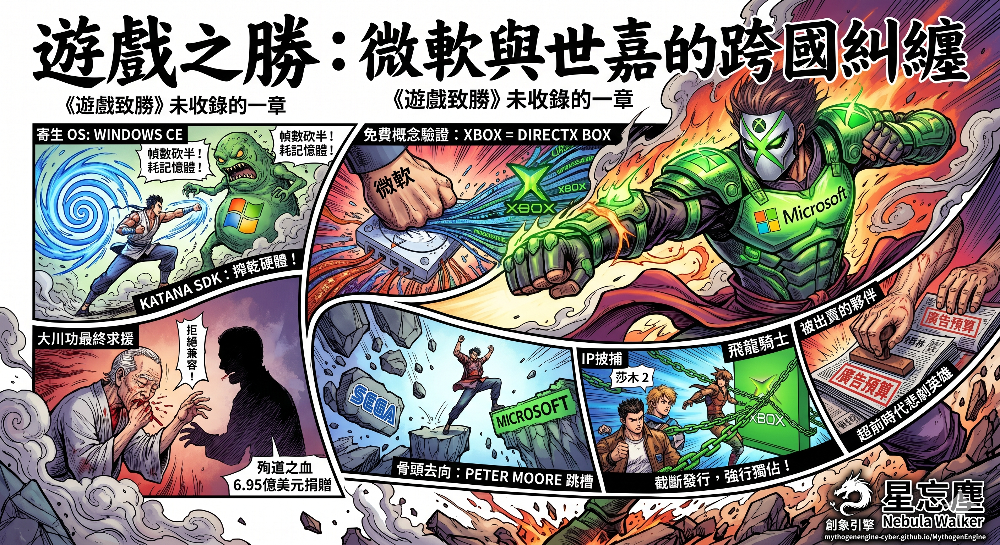

# 遊戲之勝：微軟與世嘉的跨國糾纏

**——《遊戲致勝》未收錄的一章**

星忘塵 Nebula Walker

---

《遊戲致勝》第三章講了 Xbox 的誕生。結論是：Xbox 從來不是一台遊戲機，而是一面牆——微軟為了擋住 PlayStation 2 入侵 Windows 客廳而砌的一面牆。

但第三章刻意繞開了一段歷史。

Xbox 的真正產床不在 Redmond。它在一台叫 Dreamcast 的日本主機裡面。

這段歷史幾乎沒有被主流媒體完整報導過。原因很簡單：贏家書寫歷史。2001 年之後，遊戲傳媒的廣告收入來自 Sony、微軟和任天堂——三家活下來的平台商。世嘉退場了，它的故事也跟著退場。偶爾有人提起 Dreamcast，角度永遠是「超前時代的悲劇英雄」，而不是「被盟友拆骨的合作夥伴」。

這篇文章補的就是這條線。所有事實都經過核查，有出處。

---

## I. 合作的起點

1998 年 5 月 21 日，微軟發出一份新聞稿，標題寫得冠冕堂皇：「Microsoft, Sega Collaborate on Dreamcast: The Ultimate Home Video Game System」。

合作內容是：微軟為世嘉的新主機 Dreamcast 提供一個針對主機優化的 Windows CE 作業系統，並整合 DirectX 圖形介面。世嘉的賣點是——PC 遊戲開發者可以用他們熟悉的 Win32 和 DirectX API，直接為 DC 開發遊戲，大幅降低移植成本。

對世嘉來說，這筆交易看起來合理。Saturn 時代最慘痛的教訓，就是它詭異的雙 CPU 架構嚇跑了第三方開發者。DC 要活，就需要大量遊戲。如果能直接把整個 PC 開發者生態拉進來，不就一步到位了嗎？

微軟也有自己的算盤。1998 年的微軟還沒有做主機的打算——Xbox 團隊要到 1999 年才在內部成形。但微軟極度渴望一件事：**讓 DirectX 的觸角從 PC 桌面延伸到電視下面那台盒子。** 世嘉主動送上門，等於免費幫微軟做了一次客廳市場的概念驗證。

合約簽了。SDK 在 1998 年底開始發給授權開發者。DC 的機身上印著一行字：「Compatible with Windows CE」。

但「Compatible」這個詞，藏著一個被大多數玩家忽略的事實。

---

## II. 一個寄生的作業系統

Windows CE 不是 Dreamcast 的原生作業系統。

DC 有自己的 BIOS，有世嘉自行開發的原生開發套件（Katana SDK）。Windows CE 是一個可選項——開發者可以選擇用它，也可以不用。如果選擇用 WinCE，整個作業系統會被燒進遊戲光碟裡。每次開機，DC 先從光碟載入 WinCE，然後才跑遊戲。

這個架構設計，直接帶來三個問題。

**第一，記憶體被吃掉。** DC 總共只有 16MB 主記憶體。WinCE 載入之後，留給遊戲的空間大幅縮減。用 Katana SDK 的遊戲可以直接跟硬體溝通，每一個 byte 都花在刀口上；用 WinCE 的遊戲，頭上永遠頂著一層作業系統的開銷。

**第二，載入時間變長。** 光碟每次開機都要先讀取整個 WinCE 映像檔，然後才進入遊戲。對玩家來說，這意味著更長的等待。

**第三，幀數不穩。** 這是最致命的。遊戲主機的核心承諾是流暢——街機出身的世嘉比任何人都清楚這一點。但 WinCE 的中間層讓 GPU 無法被完全榨乾。

最著名的受害者是《Sega Rally 2》。這款遊戲是 DC 日本首發年度銷量冠軍，賣了 29 萬份。它用了 WinCE 開發。結果：幀數只有街機版的一半，畫面卡頓嚴重到玩家需要輸入密技鎖定 30fps 才勉強能玩。Wikipedia 的條目裡至今寫著：「The Dreamcast version, ported using Windows CE, has a frame rate half that of the arcade version.」

這不是個別案例。絕大多數有經驗的開發商——包括 Capcom 的《Biohazard: Code Veronica》——直接放棄 WinCE，用回世嘉自己的 Katana SDK。

最後的數字說明一切：**DC 的全球遊戲庫約 600 款以上，其中使用 WinCE 開發的只有約 50 款。不到 10%。**

微軟花了大量公關資源宣傳的「PC 遊戲無縫移植到客廳」，在現實中是一個臃腫的中間層拖垮了主機效能，然後被九成的開發者拋棄。

---

## III. 微軟學到了什麼

WinCE 在 DC 上的失敗，對世嘉是一筆虧本帳。但對微軟來說，這是一堂免費的課。

**第一課：主機不能用通用 OS。** WinCE 在 DC 上的慘狀讓微軟徹底明白——把一個為 PDA 和嵌入式裝置設計的系統硬塞進遊戲主機，行不通。主機需要的是裸機效能，不是軟體相容性。所以 Xbox 出來的時候，微軟沒有再用 WinCE——它用了 Windows 2000 的精簡核心，從底層為遊戲重新設計。

**第二課：DirectX 可以離開 PC。** 雖然 WinCE 失敗了，但 DirectX API 本身在 DC 上是可以跑的。微軟拿到了第一手數據：Direct3D 在非 PC 硬體上的行為模式、效能瓶頸、開發者的真實反饋。這些數據直接餵進了 Xbox 的設計流程。Xbox 的全名——DirectX Box——不是巧合。它是 DC 上那次實驗的下一代產物。

**第三課：網路連線是未來。** DC 是史上第一台內建數據機、從第一天起就推網路連線的主機。SegaNet 讓玩家在 1999 年就能線上對戰。微軟看見了這個概念的潛力，並在兩年後的 Xbox Live 上將它發揚光大——不同的是，Xbox Live 要求寬頻，而且從第一天起就設計成封閉的付費生態。

DC 是微軟的試驗場。世嘉付了學費。微軟拿了文憑。

---

## IV. 最後的求援

2001 年 1 月 31 日，世嘉宣佈 Dreamcast 停產。

但在這個公告之前，一個人做了最後的掙扎。

大川功。世嘉的會長。他不是遊戲業出身——他是 CSK Holdings 的創辦人，一家日本資訊服務集團。CSK 從 1984 年起持有世嘉的多數股權，大川功因此成為世嘉的實際掌控者。

DC 停產前夕，大川功多次親赴微軟，直接與比爾・蓋茲會面。

他的提案是：**讓即將上市的 Xbox 向下兼容 Dreamcast 遊戲。** 世嘉願意提供所有必要的技術資產。他的目的很單純——讓 DC 的玩家基礎有一條遷移路徑，讓 Dreamcast 至少能以某種形態延續下去。

前微軟高層 Sam Furukawa 後來在推文中證實了這件事：「Before Mr. Okawa passed away, he visited Gates several times, to see if it would be possible to add Dreamcast compatibility into the Xbox.」

談判破裂了。

破裂的原因，據 Furukawa 的說法，是 DC 遊戲的網路連線功能。大川功堅持 DC 遊戲在 Xbox 上必須保留網路連線能力——這是 Dreamcast 最核心的賣點之一。微軟拒絕了。Xbox Live 是一個封閉的寬頻服務，微軟不願意讓 DC 的撥號上網遊戲跑在自己的平台上。

談不攏。大川功帶著失望回到東京。

2001 年 3 月 16 日，大川功在東京大學醫院因心臟衰竭去世。享年 74 歲。

在他去世之前，他做了一件事：把自己持有的世嘉和 CSK 股票——價值約 6.95 億美元——全數捐給了世嘉，並免除了世嘉欠他的所有債務。一個人用近七億美元的個人財產，為一家快死的遊戲公司續命。

大川功不是遊戲人。但他為遊戲公司做的事，比大多數遊戲業 CEO 一輩子做的都多。

---

## V. 骨頭的去向

世嘉倒下之後，它的骨頭被重新分配了。而分配的方向，極其耐人尋味。

Peter Moore——世嘉美國的總裁兼 COO——是親手宣佈 DC 停產的人。他自己後來也承認了這一點。

Moore 的履歷很清楚：1999 年 8 月接替 Bernie Stolar，主導 DC 的北美上市。2000 年 5 月升任世嘉美國總裁。然後，在 DC 停產、世嘉轉型純軟體公司之後——**2003 年 1 月，Peter Moore 加入微軟，成為 Xbox 部門的核心高管。**

他帶走的不只是一份履歷。他帶走的是世嘉在北美市場的所有人脈、通路、開發者關係。他後來在微軟負責的工作包括全球遊戲開發、工作室管理、第三方發行商關係——這些全部是他在世嘉建立起來的能力。

但人才只是第一層。

第二層是 IP。世嘉轉型後，內部開發團隊 Smilebit（前身 AM6）幾乎全力轉向為 Xbox 開發遊戲——Jet Set Radio Future、Panzer Dragoon Orta、GunValkyrie，全部是 Xbox 獨佔。Crazy Taxi 3 也是。這些至少還可以被解釋為正常的商業決策：世嘉已經不做硬體了，開發團隊需要選一個平台，Xbox 的架構最接近 PC，移植成本最低。

但《莎木 2》不是這回事。

《莎木 2》的北美發行史，是整個「收編遺產」鏈條裡最赤裸的一環。

2001 年，《莎木 2》在日本和歐洲的 Dreamcast 上發售了。遊戲已經做完了。英文化已經完成了。北美的 DC 玩家在等發售日。

然後微軟介入了。它跟世嘉簽下協議，買斷了《莎木 2》在北美的主機獨佔權。世嘉美國隨即宣佈取消北美 Dreamcast 版的發售計劃。

一款已經開發完成、已經在其他地區上市的遊戲，在最後一步被截斷了發行通路。北美的 DC 玩家想玩英文版的《莎木 2》，只有一個選擇——買一台 Xbox。

微軟甚至在 Xbox 版裡附送了一張《莎木》第一集的劇情回顧 DVD。**這不是在服務新玩家。這是在接收舊玩家。** 整個產品設計的邏輯就是：你是世嘉的死忠？很好，你的遷移路徑在這裡，終點是 Xbox。

這不是世嘉「自願把遊戲送去 Xbox」。這是微軟在世嘉財務最脆弱的時刻，用資本把一款已經完成的作品從原本的平台上拔走，變成自己搶佔市場的武器。世嘉不是在做商業選擇——世嘉是在賣血。

芝加哥機場有一位 TSA 安檢員認出了 Peter Moore——那個親手宣佈 DC 停產、後來跳槽到微軟的人。Moore 自己在訪談中複述過這件事：

「I don't need to see your passport. You're the asshole that gave away Shenmue to Xbox.」

那個安檢員說的是全北美 DC 玩家想說的話。

（直到 2018 年，世嘉才將《莎木 1 & 2》高清化，重新在 PS4、PC 和 Xbox One 等現代平台上發售。北美 DC 玩家等了十七年。）

---

## VI. 玩家的憤怒

事後核查可以告訴你，世嘉的死因排序是：自身硬體分裂第一、Sony 的市場戰術第二、PS2 的裝機量壓死最後出路第三。微軟的 WinCE 排不進前三——九成開發者繞過了它，DC 上真正的好遊戲全部用 Katana SDK，WinCE 造成的是局部傷害，不是系統性致命傷。

但 2001 年的玩家不知道這些。

他們手上只有一條時間線。而這條時間線，怎麼看都只有一個解讀。

1998 年——微軟高調宣佈與世嘉合作，機身上印著「Compatible with Windows CE」。玩家以為世嘉找到了一個強大的盟友。

1999 至 2000 年——WinCE 遊戲效能低落的消息開始在玩家社群流傳。但 DC 本身的遊戲品質極高，多數人沒有深究原因。

2001 年 1 月——DC 停產。

2001 年 3 月——大川功去世。

2001 年 11 月——Xbox 上市。一台用 DirectX 跑的客廳主機。概念上跟「把 WinCE + DirectX 塞進 DC」幾乎一模一樣。**DC 的屍體還沒涼，Xbox 就站在它的墳上開賣了。**

2002 年——《莎木 2》北美版被微軟截走。日本和歐洲的 DC 玩家已經玩到了，北美玩家卻被告知：想玩？買 Xbox。同一時期，飛龍騎士、JSRF 陸續以 Xbox 獨佔的身份登場。世嘉的遺產一塊一塊被搬進微軟的新房子。

2003 年 1 月——Peter Moore 跳槽到微軟。

合作。學習。拋棄。取代。收編遺產。**排成一條線的時候，感情上不可能不得出「被出賣了」的結論。**

即使你今天能用事實證明每一步都有各自獨立的理由——WinCE 的失敗是技術不匹配、DC 停產是財務崩潰、Moore 跳槽是個人職涯選擇、IP 獨佔是商業談判的結果——這些解釋在理性上成立。但當你是一個花了三萬日圓買了 DC、買了《莎木》、花了一百小時走遍橫須賀的玩家，你看到的不是「各自獨立的理由」。你看到的是一場預謀。

**而更令人窒息的是——幾乎沒有主流媒體替你說出這件事。**

2001 年之後，遊戲傳媒的生態已經被三家存活的平台商重塑了。微軟、Sony、任天堂——它們的廣告預算養活了整個遊戲媒體產業。獨佔遊戲的搶先評測權、新主機的首發試玩邀請、E3 展場的 VIP 通行證——這些都是廣告客戶才拿得到的籌碼。世嘉退場之後不再投放廣告，它的視角也就自然從報導中消失了。

傳媒不是不知道這段歷史。它們選擇了一個更安全的敘事角度：「Dreamcast 是一台超前時代的悲劇主機。」這個版本沒有壞人，只有時運不濟。讀起來帶著淡淡的懷舊感，不會得罪任何一家還在投廣告的公司。

至於「微軟借世嘉的身體練功、練完自己開館、然後收編世嘉的遺產」這個版本？太尖銳了。寫出來，微軟的公關部會打電話過來。下一次有獨佔遊戲的搶先評測權，可能就沒有你的份了。

所以贏家不只書寫歷史。**贏家用廣告預算購買歷史的編輯權。** 不需要刪除任何一個事實——只需要讓那些事實永遠停留在論壇帖子和個人部落格裡，永遠進不了主流報導的版面。

2010 年，Sam Furukawa 在推特上發了那條關於大川功與蓋茲談判的訊息。Kotaku 做了一篇報導。然後呢？沒有然後。沒有跟進調查、沒有長篇專題、沒有任何一家主流遊戲媒體把這條線完整地拉出來。一條推文，一篇短文，然後沉入網路的底層，十五年後只剩論壇裡的轉貼。

那些當年在 2ch 寫悼文的 DC 玩家、在 GameFAQs 上痛罵 Peter Moore 的美國玩家、在香港討論區裡為世嘉打抱不平的主機迷——他們的憤怒是真實的，他們的判斷在方向上是準確的。他們只是缺少了一個能把整條線串起來、用事實而非情緒去陳述的平台。

這篇文章試圖做的，就是這件事。

---

## VII. 這不是陰謀論——但也不是清白

需要把界線畫清楚。

微軟有沒有「刻意用 Windows CE 搞垮世嘉」？**沒有。** WinCE 是一個為 PDA 和嵌入式裝置設計的輕量級 OS，它的架構從根本上不適合遊戲主機。微軟的工程師的確有協助 DC 開發者優化效能——官方技術文件至今留在 MSDN 的檔案庫裡。他們不是在下毒，他們只是帶了一把錯誤的工具來。

但「不是陰謀」和「不是掠奪」是兩件事。

微軟以極低成本完成了一次完整的客廳主機概念驗證。它學到了 DirectX 在非 PC 硬體上的行為、主機供應鏈的運作邏輯、網路連線遊戲的需求框架。然後它用這些知識造了 Xbox。然後它拒絕了大川功的兼容請求。然後它挖走了世嘉的總裁。然後它把世嘉的經典 IP 變成自己的獨佔武器。

每一步都合法。每一步都合理。每一步加在一起，就是一條完整的價值提取鏈——**從一個即將死亡的合作夥伴身上，用最低成本提取最高價值。**

而事後用廣告預算確保這個版本不會成為主流敘事——這不是陰謀。**這是結構。** 遊戲傳媒的商業模式決定了它只能書寫存活者的故事。不需要任何人打電話施壓，經濟激勵本身就是最高效的審查機制。

---

## VIII. 為什麼《遊戲致勝》沒有寫這一章

兩個原因。

第一，資料稀缺。大川功與蓋茲的談判細節，至今只有 Sam Furukawa 的推文和 Kotaku 的報導。沒有合約文件，沒有會議紀錄，沒有任何一方的正式聲明。在《遊戲致勝》的寫作紀律裡，每一個論點都必須有可核查的事實支撐——而這段歷史的核心細節，只有孤證。放進正文，撐不住全書的論證標準。

第二，結構優先。第三章的論點是「Xbox 是防禦武器」，第四章的論點是「世嘉的善款催生了 NVIDIA 的壟斷」。微軟與世嘉的 WinCE 糾纏如果插入第三章，會把讀者的注意力從「防禦邏輯」拉向「跨國掠奪」——這是一個真實且重要的故事，但它不是第三章要交付的論點。

所以我把它留到書外面。

但它值得被記住。

---

## IX. 最後的算術

大川功給世嘉捐了 6.95 億美元。

世嘉第四章講過的入交昭一郎給 NVIDIA 投了 500 萬美元。

微軟在第一代 Xbox 上虧了 40 億美元。

三筆帳，三種性質。大川功是殉道。入交昭一郎是賭人品。微軟是買保險。

殉道的人死了。賭人品的人消失了。買保險的人活了下來，還把被保險人的遺產收進了自己的口袋。

如果你是《遊戲致勝》的讀者，你已經在十一章裡看過這個 pattern 的八次變奏。這一篇是第九次。只是這一次，它發生在書的邊界之外——發生在一段贏家不願意書寫、傳媒不方便報導、玩家只能在論壇裡自己拼湊的歷史裡。

合作。學習。拋棄。取代。收編遺產。然後用廣告預算把這個版本鎖在主流視線之外。

贏家書寫歷史。但贏家寫不到的地方，不代表那裡沒有發生過什麼。那裡有一台叫 Dreamcast 的主機。有一個叫大川功的老人。有一群到今天還記得橫須賀每一條街的玩家。

他們的憤怒不需要陰謀論來支撐。事實本身就已經夠了。

---

*本文為《遊戲致勝：從像素到 AI，娛樂如何暗中重塑全球科技霸權》的延伸閱讀。書中第三章（微軟的恐懼與 Xbox 的誕生）和第四章（世嘉的五百萬美元善款）為本文的前置脈絡。*

*創象引擎 MYTHOGEN ENGINE · mythogenengine-cyber.github.io/MythogenEngine*
