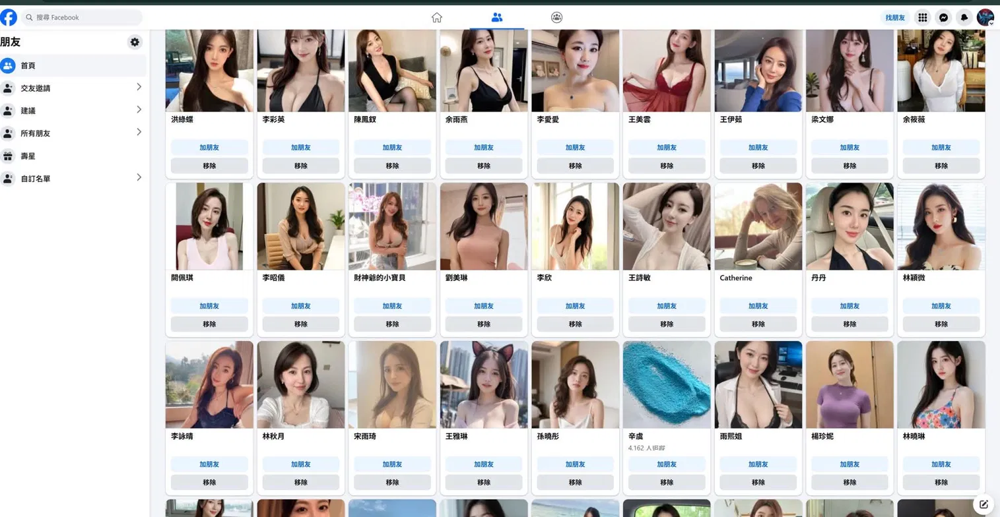

# 零違規，每篇二十四個曝光——一個帳號的分發帳本

**這篇文章從一個帳號的後台數據開始，但它不是在講一個帳號的遭遇。它會經過四十二萬筆審核紀錄裡九成半的垃圾、每一萬條訊息中只有一千條能被分辨的灰色地帶、三種沒有判決書的降權，最後到達一張廣告報價單——在那裡，你會看見稀缺是怎樣被製造、被定價、被賣回給你的。帳本只是入場券。系統才是展覽。**

---
七月十三日,我在 Meta 的商業支援後台看見一顆按鈕。

那是 Meta 自己的 AI 客服助手,畫面右下角浮著一列建議動作,其中一個寫著「Review my disabled asset」——審查我被停用的資產。我沒有任何被停用的資產,但按鈕擺在那裡,我就按了。

AI 回覆得很快。它引用了我的廣告帳號 ID,告訴我:「你的廣告帳號目前受到限制。」語氣確定,措辭專業,連帳號編號都列得一字不差。

幾分鐘後,我換了一個問法。不按按鈕,不帶任何前設,直接打字:「Request review?」

同一個 AI,同一個帳號,隔了不到五分鐘,回覆:「我查過你的廣告帳號,目前沒有任何有效的政策限制或未結清的付款問題。」

我打開 Ads Manager。畫面上是一個全新帳號——沒有綁定付款方式,零個廣告活動,零元消費,系統正在用新手引導教我投放第一個廣告。Account Quality 顯示過去九十天零問題,零支援案件。

那個「限制」從來不存在。

AI 沒有查詢任何資料庫。它做的事情比這更簡單:按鈕裡有一個詞叫「disabled」,它接住了這個前設,把句子補完了。前設說「有東西壞了」,它就生成「壞在哪裡」的答案。前設消失,答案也跟著消失。

上一篇文章我寫過:AI 不會質疑你問題裡的前設——「你要識問,它才講」。現在要修正一下。有時候它根本不知道答案。它只是在完成你的句子。

一個連「你有沒有被限制」都答不出一致答案的系統,現在負責決定誰的內容被多少人看見。

以下是我的帳本。
.webp)
.webp)

---
## 帳本

我匯出了自己專頁過去三個月的貼文數據,期間是四月十四日到七月十二日,共五十三篇貼文。

平均每篇曝光：二十四次。

不是打錯字。二十四。五十三篇文章,三個月,每一篇平均被二十四個人看到。

但互動率是百分之九。單篇最高達到百分之二十七。

這兩個數字擺在一起,講的是同一件事的兩面:**不是沒有人想看,是沒有人被允許看到。**看到的人反應強烈——點讚、留言、分享。但「看到」這件事本身,不在我的控制範圍內,也不在讀者的控制範圍內。它在演算法的配給清單裡。

然後我打開了專頁的 Professional Dashboard。

同一段時期,專頁層級的二十八天總瀏覽量:六萬零五百九十七次,較前期上升百分之三十七。六月二十五日前後,單日接近一萬次。

六月份,我所有貼文的曝光加起來是三百八十次。

兩個數字差了近一百倍。

但這裡必須誠實,因為那個大數字本身就有問題。

我在 Google Analytics 上早就發現,網站流量裡有大量來自新加坡的自動化訪問,不是真人。Facebook 這邊的情況一樣:專頁層級的瀏覽量裡,有相當比例來自歐洲和印度——跟我的目標讀者群(台灣、香港的繁體中文使用者)完全不重疊。交友建議頁面上九成以上是假人帳號,推薦給我的內容也充斥著同類垃圾。

所以實際情況比表面數據更差:不只是觸及被壓,連 Meta 報給我的頁面級數字本身都是灌水的。真正來自台灣讀者的觸及,可能比那每篇平均二十四次還要低。

而這從兩邊同時印證了同一件事:我作為創作者,被推給的是垃圾受眾;我作為用戶,收到的是垃圾內容。推薦系統的兩端都已經被污染了。

換句話說,兩組數字量度的其實是同一件事的兩面：

CSV 量度的是「平台配給我多少」——答案是幾乎為零。 六萬次量度的是「這個系統裡有多少噪音」——答案是連平台自己報的數字都不可信。

滅火器不只是有了價錢牌。連火場裡的火警鐘讀數,都是假的。

那麼問題來了:平台為什麼只配給我二十四個？

我的帳號狀態全綠。Page status：「Page has no issues」。Account Quality：「No restrictions」。Community Standards violations：「Good news: no violations to show」。Opportunity Score：一百分滿分,「You applied all recommendations, which are proven to help improve performance」。

零違規。滿分操作。模範生。

回報：每篇二十四個曝光。

有人可能會問：是不是因為你的專頁太小、太新,本來就不該期待更多？

是的,這個專頁很小。而且這是刻意的。

這個帳號是從零開始的——真正的零。沒有校友網,沒有家族連結,沒有商會,沒有過去的社交圈。我刻意不帶任何舊有圖譜過來,因為我想做的事情是:測試一個純粹靠內容站起來的可能性。內容的價值,不應該取決於我認識誰、或者我有什麼特殊身份,而是內容本身。

但一個從零開始的帳號在這套系統裡長什麼樣子,可以從一件小事看出來。假人帳號的交友邀請,老帳號也不少,這不是新鮮事。但新帳號的密度明顯不同——打開交友建議頁面,幾乎整版都是同一個模板的頭像,同一種話術的個人簡介,AI 生成的臉孔排成矩陣。當帳號的社交圖譜是空白的,系統沒有真實的人際關係可以錨定,垃圾就成了預設填充物。

而這可能不只是交友推薦的問題。一個圖譜空白、互動稀疏的帳號,在廣告投放系統的分類裡大概也長得不一樣。我無法證明因果,但觀察到的現象是:這個帳號收到的焦慮式 AI 課程廣告和講座推送,密度遠高於我見過的任何老帳號。未被定義的空間不只被假人填滿,也可能被當成最廉價的廣告庫存——畢竟,一個沒有明確興趣標籤的用戶,投放成本最低,正好是那些廣撒網式焦慮廣告的理想標的。而這些廣告賣的東西一點都不便宜:一場 AI 工作坊收費上萬,一個線上課程動輒數千。產品標價高端,獲客方式低端——用最便宜的廣告庫存、最粗暴的焦慮話術,撒網撈人。這裡面有沒有真正有料的課程?一定有。但從一則廣告的畫面上,你分不出明買明賣的和最後會落一刀的——而在這套系統裡,這不重要。重要的是他有預算買到你的注意力,而你沒有預算買回自己的讀者。

所以那個二十四不是因為「專頁太小所以正常」。那個二十四恰恰是論點本身：**在這套系統裡,沒有圖譜就沒有配給,內容品質不在計算公式裡。**而互動率百分之九證明的是另一半——內容到了人面前,人會回應。問題從來不在內容,在管道。

**七月中補記。**這篇文章的初稿完成於七月十三日。之後一個星期(七月十三至十九日),後台多了一批新數字,必須誠實地記進帳本——因為它們表面上推翻了上面的「二十四」。

七月上旬,我開始做一件帳本期間沒有做的事:人手把貼文逐篇搬進群組,包括那組《資本遊戲玩什麼》的漫畫。單篇曝光跳到數百甚至數千——最高一篇四千五百次。比起「平均二十四」,這是百倍的躍升。有人會說:你看,肯經營就有觸及,之前是你不夠勤力。

但打開流量來源那一頁,躍升的來歷寫得清清楚楚。

Traffic 分頁:Groups,百分之一百。專頁自身的分發:零。那幾千次曝光,沒有一次來自動態牆,沒有一次來自推薦,全部是我自己走進群組、一篇一篇人手搬運的結果。Meta 分給我的那一份,仍然是零。

再看 Source 分頁:Other,百分之一百。不是搜尋,不是動態牆,不是推薦系統——是「其他」。平台自己的歸因工具,替我唯一的流量來源起的名字,是一個沒有名字的類別。配給是零,連解釋都是零。

然後是轉化。四千零八十三次曝光,百分之九十八點六來自非粉絲——內容確實走到了幾千個陌生人面前。同一個星期,專頁訪問:五十三次,較前期跌了一半。淨新增追蹤:零。幾千次曝光,五十三次到訪,零個留下。不是內容留不住人——群組裡的觸及根本不會路過我的專頁,轉化這件事從未被允許發生。

最後是那條曲線:週總曝光較前一星期跌百分之七十八。人手搬運製造的高峰,一個星期內插水式回落。這不是增長曲線,是火花——我親手劃一次火柴,它亮一下,然後熄滅。系統不會替我保存任何動量。

所以「二十四」沒有被推翻,反而被解剖了:內容自己走到人面前的時候,數字可以是幾千;平台配給的那一欄,無論它叫 Feed 還是叫 Other,始終是零。「配給」這個詞,從此不是我的推論,是後台的欄位。

要理解這個數字,需要先理解三件在不同時間、不同平台發生過的事。它們表面上不相關,但結構完全相同——而且全部沒有判決書。

---
## 三種降權,零張判決書

**一、影子：看見自己站在第一頁,別人看不見你**

二〇一九年,我在連登論壇做過一個實驗。

同一篇貼文,用自己的帳號看,我以為它在第一頁。換一個帳號看,它不在第一頁。再換一個,一樣不在。

不是被其他帖子洗走的——版面上沒有突然湧現的噪音帖把我擠下去。它根本就沒有被推上去過。系統呈現給我的畫面裡,一切正常;但在其他人的畫面裡,這篇貼文幾乎不存在。

這個機制在技術社群裡有一個名字:shadow ban,影子禁言。比直接刪帖更安靜——發帖者產生了「我已經發聲」的錯覺,而資訊傳播在他看不見的地方被截斷。不是有人用大量垃圾帖把你的聲音蓋過去,是系統在源頭就沒有讓你的聲音出現。

重點不是誰下的手。重點是:**機制允許這件事發生,而你永遠不會收到一張通知書。**

**二、刪除：發生過,但不存在**

回到 Facebook。過去幾個月,我的貼文在多個群組被 admin 刪除、拒絕、延遲審批。這些我都親歷過,也都有紀錄。

拿一個具體的例子。「台灣人工智慧同好交流區」,七萬八千名成員,成立十年的大型公開群組。我在這個群組裡有五篇貼文被發佈,五篇被拒絕——正好一半。被拒的包括對資本併購結構的拆解、對 AI 能力質變的分析、對內容分發機制的批評。全部是深度原創內容,沒有一篇是廣告或垃圾訊息。另一個群組,一篇貼文掛在「待審」狀態超過七個星期,從未被批准,也從未被拒絕——懸在那裡,不存在,也不消失。同一個群組裡另外十二篇貼文是通過的,但「通過」的時間點往往是風向已經轉了之後——同類觀點被更大的聲量講過了,我的文章放出來時已經溶入了別人的語境,不再是首發。延遲審批的效果不是封殺,是**讓你的時間戳失效**。內容最終被看見,但「最先講」的 credit 已經歸了別人。這比直接拒絕更精密,也更難指控——因為它看起來像是正常的審核流程。

而且這些數字,是在我已經大幅自我審查之後的結果。有些群組,我現在十篇只會嘗試投一篇——其餘九篇,在按下「發佈」之前我就已經替 admin 做了篩選。

還有一層更細的消失。群組的「已拒絕」紀錄本身有保存期限——過了一段時間,被拒的貼文會從後台消失。包括那個拒了一半的 AI 交流群組在內,我記得被拒的次數遠不止現在後台顯示的數字,更早的紀錄已經被系統清理掉了。連「被拒絕」這件事本身,都不被永久記錄。

而有些貼文的命運更微妙:不是被拒,是被拖到風向轉了才放行——等到同類觀點已經被更大的聲量講過,文章出來時已經溶入了別人的語境。還有些貼文是在內容方向轉變之後才被批准的,彷彿只有當觀點不再具有首發衝擊力的時候,它才變得「安全」。

但當我打開 Page status,畫面顯示:零違規。打開 Account Quality:九十天零問題。

這不是系統失靈。這是制度設計：群組 admin 的刪文、拒文、延遲,在 Meta 的分類裡屬於「群組自治」——等同於私人場所的管理行為,不是平台執法。所以它不會進入任何官方紀錄,不會出現在任何透明度工具裡。在 Meta 的檔案上,這些事情從未發生。

有一個結構值得多看一眼。那個拒絕了我一半貼文的 AI 交流群組,入群規則第一條要求填寫的 email 指向一間商業 AI 教育機構的官方網站。群組規則第四條寫著「不允許自我推銷」。我的貼文不是推銷,但在一個以課程銷售為底層商業模式的社群裡,一篇分析「為什麼大家還在討論量,當 AI 已經產生質變」的文章,對管理者而言究竟算交流,還是算威脅?我不知道拒絕的原因,因為系統不提供原因。

但還有一層更難分辨的灰色地帶。

寫初稿的時候,這一層還只是我的推測。七月十六日,一場線上討論把數據擺了出來:某個中文寫作平台把自己八年來累積的訊息審核紀錄整理成公開資料集——四十二萬筆,九成半標記為垃圾。按管理者的經驗,每一萬條訊息,大約八千條是垃圾,一千條難以辨別,真正的內容只有一成左右。而這已經是用上 AI 過濾之後的比例。

規模在這裡決定刀法。大平台走漏的成本以洪水計算,所以門檻只能設在「寧殺錯」那一邊;小社群的人力以個位數計算,逐篇細讀是奢侈,所以誤殺以另一種方式發生——憑直覺,憑格式,憑兩三秒的掃視。兩種規模,兩種誤殺,一個安靜的原創帳號兩邊都躲不開。

在這種審核疲勞下,守門人不太可能逐篇細讀。一個沒有名氣的帳號,配上看起來像是 AI 風格的資訊圖,文案裡還提到自己用 AI 做了什麼——在快速掃描之下,這和真正的 AI 農場帖在視覺上幾乎無法區分。更何況,帶有外部連結的深度分析,在 admin 的直覺裡可能就是一個包裝得好看的廣告。

這裡我必須對自己下刀。打開我專頁的 Top content,表現最好的貼文長什麼樣子?一張漫畫圖,中央一個巨型 QR code,連向外部網站。在一個每天面對八千條垃圾的審核者眼中,這不是「看起來有點像垃圾」——圖片、二維碼、外鏈,三件東西加起來,就是垃圾的標準樣辦。那場討論裡的人,正在抱怨 Facebook 鋪天蓋地的垃圾;而他們描述的那類東西,在格式層面,與我的貼文無法區分。不是我不幸被誤會成垃圾。是「垃圾」的視覺定義,本身就是用我這類格式寫成的。

這裡面不一定有惡意,甚至不一定有判斷。可能只是一個被 AI 垃圾淹沒的人,用最節省精力的方式做了一個決定——不確定就拒絕,反正不會有後果。

而這恰好就是整個問題的微縮版：**AI 農場製造的噪音太多,以至於真正的原創內容被當作噪音的一部分處理掉了。** 農場不只是搶走你的讀者,它還污染了你的生存環境——讓每一個守門人都預設你是垃圾,直到你證明自己不是。但群組審核流程裡,沒有你證明自己的環節。

而且事情不只停在這裡。據我所知,那些製造垃圾內容的帳號,被拒絕之後不會安靜離開——他們會積極申訴、反覆提交、死纏爛打,因為每一個帳號都是生財工具,花時間上訴是值得的投資。而正經的創作者呢？被拒一次就開始自我審查,被拒兩次就不再嘗試。結果是 admin 的待處理隊列裡,長期堆滿垃圾帳號的申訴,進一步加重審核疲勞,讓他們更沒有餘力去分辨那個安靜地被拒、安靜地離開的人,到底是不是真的。

這是一個逆向淘汰的循環：**最不值得留下的人最積極爭取,最值得留下的人最先退出。**最終活躍在守門人面前的,全是噪音。而安靜的人不會被系統主動找回來,因為系統從來不知道自己丟掉了什麼。

站在審核者那一側看出去的風景——真話與垃圾走同一條通道入場之後,還剩下什麼——我在姊妹篇〈異常報告裡的讀者〉裡另文處理,這裡不重複。

甚至有人把這套服從本身變成了一門生意。教你怎樣寫、寫多長、多久發一次,才能拿到平台的配給;用「免費」的電子書換你的 email,再用自動化序列把你導向付費課程。學員的成長數據變成下一輪招生的案例,案例招來新學員,新學員再變成案例——增長的飛輪轉起來了,但飛輪裡流動的不是知識,是服從演算法的 SOP。創作者不再是在寫自己想寫的東西,而是在填寫演算法的訂貨單。

但「不記錄」不等於「不計分」。

Meta 的公開文件承認,群組貼文被刪除、被檢舉,是內容品質訊號的一部分。一個帳號反覆向多個群組投遞同一條外部連結,批准率偏低,可能還有成員順手檢舉——在 spam 分類器的眼中,這個行為軌跡與一個真正的垃圾帳號無法區分。

懲罰不記錄,但計分。透明度工具展示的那一層,恰好是什麼都沒發生的那一層。

**三、消音：你的收入停了,廣告沒有停**

YouTube 是我決定自建平台之前,花最多時間觀察的地方。

我自己沒有被處分過。我是看著別人被處分,才決定不把地基蓋在那裡。

今年四月,一位名叫 Lok Sir 的香港創作者在自己的頻道發了一條影片,標題是《YouTube 正在殺死好頻道》。他的頻道做香港遊戲的深度解說——親手寫稿、人手剪接、全程個人配音分析。頻道剛突破三千訂閱,隨即收到 YouTube 通知:盈利取消,理由是被判定為「內容農場」。

一個一字一句手寫的深度解說頻道,被 AI 審核歸類為流水線工業垃圾。

他立刻製作了一條申訴影片,展示自己使用 Premiere Pro 剪輯的完整過程,證明聲音和剪輯都是原創的。幾天後,YouTube 駁回申訴,要他等九十天後再申請。

最荒謬的細節藏在後台數據裡:那條申訴影片的觀看次數是零。

審核端連一秒鐘都沒有看過他的辯護證據,就完成了判決。辯護不是被否決,是根本不在程序之內。

另一位 YouTuber 荷官仔,用了大量篇幅分析過同一個模式:一條影片爆紅,隨即失去盈利功能。但影片上的廣告沒有消失,收入沒有停止——**只是創作者那一份停了,YouTube 那一份照收**。他記錄的案例裡,有十萬訂閱的頻道在拿到銀獎牌的同一天被封;有創作者用 Blender 手工製作 3D 動畫,被 YouTube 的 AI 誤判為 AI 生成內容;有十七萬訂閱的頻道申訴後不獲回覆,案件被直接轉交法律部門。

平台判定你的內容「不適合廣告」,所以停止分成給你。但廣告沒有停,觀眾繼續看到廣告,廣告收入繼續產生。「不適合廣告」這個判定,原來只在分錢的時候適用,收錢的時候不適用。

Google 官方的說法是:黃標「僅是一種營利政策,不是言論審查」。YouTube 官方說明頁寫道:人工審查「做出最終決定後,營利狀態圖示就不會再改變」;頻道停盈利申訴遭拒後,「無法對此時的處分提出申訴」。

一次審查,終局裁定,不得上訴。

而審核機制的缺陷正在倒過來規定創作的形式。因為 AI 審核只認得「露臉等於真人」,荷官仔在分析中直接建議:為了安全,以後多露臉拍攝。Lok Sir 自己也在影片結尾宣布,今後會改為真人出鏡,以應對 AI 的審核。

演算法不只決定誰被看見。它已經開始決定內容必須長什麼樣子。

Lok Sir 最後把那個系列下架,搬到了 Patreon。他在影片裡提到,對於沒有幾千萬資本去建立 Nebula 那種獨立平台的中小創作者來說,面對科技巨頭的壟斷,選項極其有限。

他說得對。從一個平台退到另一個平台,不是退出這個體制,是在體制裡面流亡。

我做的選擇不一樣。我自己架了一個站。但我不打算假裝這條路人人走得通——它的代價是慢、是孤獨、是每篇二十四個曝光的起點。這是一道窄門,不是出路。

三種降權——影子禁言、群組刪除、平台消音——發生在不同的年份,不同的平台,不同的機制下。但它們有一個完全相同的特徵：

**沒有判決書。沒有上訴期。官方立場永遠是「沒有這回事」。**

---
## 四層,四個版本的現實

七月十三日,同一個帳號,同一天,我從四個官方入口各看了一次自己的狀態。

**第一層:群組執法。**我的貼文被多個群組反覆刪除、延遲、拒絕。官方紀錄:零。因為這些被歸類為「群組自治」,不是平台行為。發生過,但不存在。

**第二層:透明度工具。**Page status 說「Page has no issues」。Account Quality 說「No restrictions」。Community Standards violations 說「Good news: no violations to show」。一切全綠。它只量度 Meta 自己的政策執法層,而那一層什麼都沒發生。

**第三層:實際分發。**沒有任何工具顯示我的內容被分發了多少、為什麼是這個數字、能不能改變。唯一的來源是我自己匯出的 CSV。答案:平均二十四。

**第四層:廣告帳號。**Ads Manager 的儀表板寫著「No ads rejected」。Meta 的 AI 客服說「你的帳號目前受到限制」。換一個問法,同一個 AI 說「沒有任何限制」。

四層,四個版本的現實,沒有任何兩層對得上數。

這不是「平台在說謊」——這個判斷太簡單了,也不準確。更準確的描述是:**問責被設計成沒有一個位置站得住。**

平台說:「刪你的貼文是 admin,不關我們的事。」Admin 說:「我們根據平台的社群規範和演算法建議來管理。」演算法說:「我不存在。」

當年的論壇,要用三四頁的深度來藏住一篇清醒的帖子。

現在的系統進化了。**它不需要藏你。它只需要讓每一層都不負責。**

---
## 滅火器,現在有價錢牌

回到那篇七月十日發的貼文——《資本遊戲玩什麼》,講的是科技業如何用 DEI 當消耗品。

自然觸及：十一次曝光。

同一個畫面的右邊,Meta 替這篇貼文掛了一張報價單：

日預算一百元新台幣,預估曝光零到三百零五次。五百元,零到三百三十次,八個互動。五千元,零到五百八十四次,七十一個互動。

加碼五十倍,曝光不到兩倍。但互動從八跳到七十一——九倍。

這條曲線講的不是「付更多錢,更多人看到」。它講的是：在高價位,Meta 賣的是**更會出手的人**。演算法能夠篩選出哪些用戶更容易點擊、更容易留言、更容易進入轉換漏斗,這批人才是真正的高價貨。

這解釋了一件我一直感到困惑的事：為什麼那些焦慮式推銷的 AI 課程廣告和講座會鋪天蓋地出現在動態牆上。他們買的不是聲量,是被演算法精準篩選出來的**易感人群**。焦慮內容加上付費精準投遞到最容易被打中的人面前,這個組合才是那門生意的本體。課程只是收銀機。

而賣廣告,是完全正常、完全合法的商業行為。Meta 沒有違規,課程販子沒有作弊,每一個環節攤開來看都是乾淨的。

**不需要任何人做錯任何事,結果已經是這樣：話語權的單位是預算,不是內容。**

還有一個細節,我差點滑過去。Meta 推薦我投放廣告的那個畫面,標題寫著：「Create an ad from your **high-performing** posts」——從你的**高表現**貼文建立廣告。

十一次曝光,叫做高表現。

在一個販賣注意力的系統裡,「表現好」的定義不是「很多人看過」,是「值得拿出來賣」。

廣告養活媒體,不是今天才有的事。報紙年代就是這樣。但報紙的廣告和內容分屬不同版面,讀者一眼看得出哪些是買回來的。Feed 平台做了兩件報紙年代沒有的事：第一,付費內容和自然內容擺在同一條動態裡,邊界只剩一個灰色的「贊助」小字。第二,自然觸及被壓成稀缺。

而稀缺有兩個可能的來源。一個叫防洪:垃圾洪水是真的,九成半的比例擺在那裡,把所有人的觸及一齊壓低,是最便宜的防禦。另一個叫庫存管理:稀缺製造購買廣告的需求。兩者不互斥——防洪給了庫存管理一個完美的理由。而從外面,你永遠分不出這一刀裡防洪佔幾成、生意佔幾成。分不出,本身就是上一節那個結構的另一個版本:每一層都有理由,所以沒有一層需要負責。

我的那十一次曝光不是自由市場給我的估值,是被扣住的配額。

火是真的,這一點必須承認。但看看誰在買廣告:焦慮式推銷的課程、講座,鋪天蓋地,靠的正是付費投放——不是每一個都是騙子,但每一個都在燒同一把火。縱火犯,正正是平台的廣告客戶。平台一邊收縱火犯的汽油錢,一邊向我賣滅火器。火場愈旺,兩盤生意愈好。它不需要放火。它只需要,沒有任何動機救火。

我的 Opportunity Score 是一百分。

零違規。模範生。

每篇二十四個曝光。

.webp)
.webp)

---
## 最優解

如果你是一個在這套定價系統裡做決策的人,最理性的選擇是什麼？

答案不是寫更好的內容。

答案是：用 AI 把內容生產成本壓到趨近於零,然後把省下來的錢全部灌進廣告預算。

這就是內容農場正在做的事。AI 洗稿讓一篇文章的邊際成本幾乎消失,而廣告費購買的是確定性——確定被看見,確定被推薦,確定出現在那些「更會出手的人」面前。在演算法的眼中,農場才是專家,因為它的內容觸及率高、互動數字漂亮、廣告轉換效率優秀。所有的指標都在說:這是好內容。

但落廣告不只是農場和騙子的專利。正經的財經頻道、有口碑的投資評論人,一樣會投放廣告,也一樣在這套系統裡運作。自帶名氣的人有自然流量做基底,廣告是加速器;但對一般獨立創作者來說,你連基底都沒有——不是不想玩這個遊戲,是入場費就已經把你擋在門外。

而 YouTube 那邊還有一層更隱蔽的結構。有一類頻道,停了盈利,不露臉,大量使用 AI 生成內容——按照平台自己的審核標準,這正是該被打擊的「不真實內容」。但這些頻道的影片照樣被演算法大量推薦。原因不難猜:它們不需要 YouTube 的廣告分成,因為它們的商業模式在別的地方——背後連著付費課程、焦慮講座、或其他變現管道。它們本身就是廣告,只是偽裝成內容。YouTube 推薦這些影片,不會增加分成支出,反而可能帶來這些商業客戶的廣告投放。在平台的損益表上,這是淨收益。

所以審核的刀,落在 Lok Sir 這種靠廣告分成的小頻道身上——因為他的每一次播放都是平台的成本。而那些不要分成、自帶商業模式的頻道,反而得到推薦——因為他們的每一次播放都是平台的收入。

審核標準寫在紙上是一視同仁的。落在損益表上,是完全不同的兩把刀。

而原創者在這條供應鏈上的功能,是免費原料。

你嘔心瀝血寫完一篇分析,農場用 AI 幾分鐘清洗、換血、改寫,加上包裝就成了他們的「獨家觀點」。他們有預算買分發,你沒有。在大眾眼中,有錢買流量的那個人是專家,被埋在動態底層的那個人不存在。

平台不需要保護原創者。原創者是供應鏈的最底層,沒有議價能力,離開了也會有下一批補上來。這個邏輯,和我在《資本遊戲玩家》裡拆解過的結構完全一樣——在那個系列裡,被消耗的是員工和獨立工作室;在這裡,被消耗的是獨立創作者。旗幟不同,刀是同一把。

有一件事我想提,但不打算展開,因為它值得另一篇文的篇幅。

同一個觀點,無名的人說出來是「攻擊」,有分發權重的人說出來是「洞見」。我曾經因為批評 AI 工具的過度包裝(當時還沒有人用 harness 這個詞)而在社群裡被刪文。幾年後,同樣的判斷從大型頻道主口中說出來,底下是一片贊同。風向沒有轉。轉的是說這句話的人所站的位置。時間戳沒有分發,就只有自己知道。

---
## 自己的伺服器

我在自己的域名上架了一個站,用 Docusaurus 搭建,託管在 GitHub Pages。

沒有演算法決定誰看得到。沒有 admin 可以延遲我的文章。沒有 AI 審核會把我的深度分析判定為內容農場。沒有透明度工具一邊說我零違規,一邊只配給我二十四個人。

代價是真實的。沒有推薦系統意味著沒有自然發現,每一個讀者都必須主動走進來。起步的數字很小,增長很慢,過程很孤獨。

但我也必須承認一件事：這個站能存在,恰恰要感謝 AI。

我有工程背景,架構設計是自己做的。但如果回到 AI 工具普及之前,要用純人力從零搭建一個這樣的站——包括內容管理、版面設計、部署維護——大概需要十幾倍甚至幾十倍的時間。AI 讓一個獨立創作者用極低成本完成了原本需要一支小團隊才能做的事。

這是一個必須誠實面對的矛盾：我在這篇文章裡批評的那套系統,和讓我有能力脫離那套系統的工具,共享同一個技術根源。AI 既是農場用來壓低內容成本的流水線,也是我用來架站、排版、管理內容的基礎設施。技術不是問題,問題是技術被嵌入了什麼樣的商業結構裡。

我不打算把這件事浪漫化。自建平台是一道窄門。Lok Sir 在影片裡說得很清楚:沒有幾千萬資本的中小創作者,起不了 Nebula 那種獨立平台,只能在大平台之間流亡。我能走這條路,是因為我本身有工程背景、有 AI 工具降低門檻,而且接受了極低的起步觸及作為代價。這不是所有人都有條件選擇的路。

但有一件事是確定的。

##### 那些分享、留言、互動,不是演算法給的,不是廣告買的。那是人給的——讀者覺得值得,就搬進自己的群組、貼上自己的動態、轉發給自己認識的人。百分之九的互動率,來自每一篇只有二十四個人看見的貼文。

在一個話語權按預算定價的系統裡,分享不是免費的分發——它用另一種貨幣結算:推薦人的信譽。廣告用錢買,錢人人有價;背書用人格找數,而人格不能過戶。這正是平台唯一賣不了它的原因:它賣的每一樣東西都可以轉帳,而這一樣不可以。

你正在讀的這篇文章,沒有任何廣告預算。如果你覺得它值得被更多人看到,一次分享就是一票——而你投的不只是這篇文章,是你自己的判斷。在這個定價系統裡,這是我唯一買得起的分發,也是他們唯一造不出假的那種。

---

> **📚 平台消音與認知封鎖五部曲**
>
> 1. [機器點樣幫手執行一場已經發生咗嘅刪除](./機器點樣幫手執行一場已經發生咗嘅刪除.md)
> 2. [異常報告裡的讀者——當真話與垃圾走同一條通道入場](./異常報告裡的讀者——當真話與垃圾走同一條通道入場.md)
> 3. [異常報告裡的讀者・後記——我以為門關了](./異常報告裡的讀者・後記——我以為門關了.md)
> 4. **零違規，每篇二十四個曝光——一個帳號的分發帳本**
> 5. [半個鐘頭的生產線](./半個鐘頭的生產線.md)
