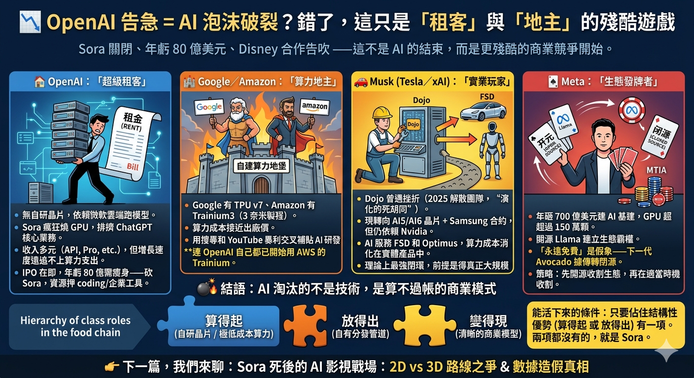

# 主題一：AI 食物鏈的階級遊戲——誰是地主，誰是租客？

## 核心論點

AI 產業的競爭不是「誰的模型更聰明」，而是**誰掌握了結構性的成本優勢與分發管道**。理解這個「食物鏈」的階級邏輯，是看懂後續所有主題的基礎。

---

## 一、為什麼 Sora 的死亡不代表 AI 玩完

OpenAI 在 2025 年砍掉了旗下最具話題性的 AI 影片生成產品 Sora，同期年度虧損飆升，Disney 10 億美元合作告吹。網路上充斥著「AI 是不是玩完了？」的恐慌。

這是一個典型的**視角盲區**。

Sora 的失敗不是 AI 技術的失敗，而是 OpenAI 特定商業結構的失敗。就像一家餐廳倒閉，不代表整個餐飲業完蛋——它只是說明這家餐廳的租金太高、食材太貴、客人又不夠多。

要看懂這局棋，你必須先認清食物鏈中每個玩家的「階級角色」——他們的算力從哪來、內容怎麼分發、錢從誰口袋掏出來。

---

## 二、五大玩家的階級定位

### 🏠 OpenAI：最鬱悶的「超級租客」

**結構性困境：** OpenAI 是全球最知名的 AI 公司，但它在產業食物鏈中的位置極其脆弱——它不擁有任何底層基礎設施。

- **算力端：** 沒有自研晶片，所有模型訓練與推理都依賴微軟 Azure 的 GPU 集群。每一次 ChatGPT 回答問題、每一次 Sora 生成影片，都在向微軟支付租金。
- **分發端：** 沒有自有的消費級平台（不像 Google 有 YouTube、字節有 TikTok）。ChatGPT 的網站和 APP 是它唯一的入口，但這些入口沒有「生態黏性」——用戶隨時可以切換到 Claude 或 Gemini。

**最新財務數據（截至 2026 年 3 月）：**

| 指標 | 數字 | 來源 |
|---|---|---|
| 年度經常性收入（ARR） | 超過 200 億美元（2025 年底） | TradingKey、MediaPost |
| 預估年虧損（2026） | 約 140 億美元 | RDWorldOnline、Reddit 內部文件 |
| 付費訂閱用戶 | 約 5000 萬 | OpenAI 官方 |
| 週活躍用戶 | 約 9 億 | OpenAI 官方 |
| 最新估值 | 約 8500 億美元（2026 年 3 月融資） | TechFundingNews、Benzinga |

**關鍵矛盾：** ARR 超過 200 億美元聽起來驚人，但 2026 年預估虧損高達 140 億美元。這意味著每賺 1 美元，就要在算力上花掉超過 1.7 美元。Sora 的砍掉正是這個結構性矛盾的直接結果——影片生成的算力消耗是文字的成千上萬倍，OpenAI 根本負擔不起。

### 🏰 Google：自給自足的「算力地主」

**結構性優勢：** Google 是食物鏈中位置最穩固的玩家，因為它同時擁有三項關鍵資產：

1. **自研晶片（TPU v7）：** Google 從 2015 年開始自研 TPU，到 2026 年已迭代到第七代。十年的積累讓 Google 的算力成本遠低於需要向 Nvidia 購買 GPU 的「租客」們。Google 訓練 Gemini 模型的邊際成本，可能只有 OpenAI 訓練 GPT 的幾分之一。

2. **超級分發平台（YouTube + 搜尋）：** Google 擁有全球最大的影片平台 YouTube（月活超 20 億）和搜尋引擎（全球市佔率超 90%）。任何 AI 產品只要整合進這兩個平台，立刻就有幾十億用戶的觸達。Google 的 Veo 影片生成工具正在整合進 YouTube Shorts，這是 OpenAI 的 Sora 永遠做不到的事。

3. **交叉補貼能力：** 搜尋廣告和 YouTube 廣告每年為 Google 帶來超過 3000 億美元的營收。這些暴利可以無限制地補貼 AI 研發的虧損。Google 完全可以在 AI 上虧損十年，搜尋和廣告的利潤照樣撐得住。

### 🏗️ Amazon：低調的「基建承包商」

Amazon 的 AWS 是全球最大的雲端服務商（市佔率約 31%），它在 AI 食物鏈中的角色是「基建承包商」——不直接面對消費者做 AI 產品，而是為所有 AI 公司提供算力基礎設施。

**自研晶片：** Amazon 的 Trainium3 採用 3 奈米製程，專門為 AI 訓練優化。連 OpenAI 自己都已開始用 AWS 的 Trainium 來降低對 Azure 和 Nvidia 的單一依賴。

**投資佈局：** Amazon 在 2025-2026 年向 OpenAI 投資 500 億美元（其中 350 億有附帶條件），同時也是 Anthropic（Claude 的開發商）的最大投資者（投資約 80 億美元）。Amazon 的策略是「兩邊下注」——不管 OpenAI 還是 Anthropic 勝出，它都是賣鏟子的人。

### 🚗 Musk（Tesla / xAI）：路途崎嶇的「實業玩家」

Musk 的 xAI（開發 Grok 模型）走了一條完全不同的路：他的 AI 不是要賣給企業或消費者，而是服務於 Tesla 的自動駕駛（FSD）和 Optimus 人形機器人。

**晶片困局：** Musk 在 2021 年高調發表 Dojo 超級電腦自研晶片計劃，但在 2025 年 8 月宣布解散團隊，Musk 自己稱之為「演化的死胡同」。目前轉向 AI5/AI6 晶片 + Samsung 165 億美元代工合約，但仍大量依賴 Nvidia GPU。

**獨特的變現邏輯：** 如果 FSD 和 Optimus 真正大規模商用，Tesla 就能把算力成本消化在每一台車和每一個機器人的售價裡。這是理論上最強的「閉環」——但前提是這些產品真的能大規模商業化，目前仍是未知數。

### 🃏 Meta：精於算計的「生態發牌者」

**表面的慷慨：** Meta 年砸 700 億美元建 AI 基建，GPU 超過 150 萬顆，還把主力模型 Llama 系列開源。看起來像是 AI 界的慈善家。

**實際的算計：** 「開源」是 Meta 最精明的戰略武器。通過讓全球開發者免費使用 Llama，Meta 做到了三件事：
1. 建立了圍繞 Llama 的開發者生態，讓它成為開源 AI 的事實標準
2. 削弱了 OpenAI 和 Google 閉源模型的定價權
3. 為自己積累了海量的開發者使用數據和反饋

但「永遠免費」是假象——下一代旗艦模型 Avocado 據傳將轉為閉源。同時 Meta 也在開發自研晶片 MTIA。策略很清楚：先用開源建霸權，再在適當時機收割。

---

## 三、決定生死的三把鑰匙

把五大玩家排列在一起，一個清晰的生存法則浮現了：

### 🔑 鑰匙一：算得起（自研晶片或極低成本算力）

| 玩家 | 自研晶片 | 算力成本 | 判定 |
|---|---|---|---|
| Google | TPU v7（第七代） | 接近出廠價 | ✅ 算得起 |
| Amazon | Trainium3（3nm） | 接近出廠價 | ✅ 算得起 |
| Meta | MTIA（開發中） | 目前仍依賴 Nvidia，但有 150 萬+ GPU | ⚠️ 過渡期 |
| xAI/Tesla | AI5/AI6（開發中） | 仍大量依賴 Nvidia | ⚠️ 過渡期 |
| OpenAI | Titan（第一代，未量產） | 完全依賴 Azure/Nvidia | ❌ 算不起 |

### 🔑 鑰匙二：放得出（自有分發管道）

| 玩家 | 分發管道 | 用戶規模 | 判定 |
|---|---|---|---|
| Google | YouTube + 搜尋 | 數十億月活 | ✅ 放得出 |
| Meta | Facebook + Instagram + WhatsApp | 數十億月活 | ✅ 放得出 |
| 字節跳動 | TikTok + 抖音 | 十億+月活 | ✅ 放得出 |
| xAI/Tesla | X（前Twitter）+ Tesla 車載 | 數億月活 | ⚠️ 有管道但非主流 |
| OpenAI | ChatGPT 網站/APP | 9 億週活但無生態黏性 | ⚠️ 有入口但缺護城河 |

### 🔑 鑰匙三：變得了現（清晰的商業模型）

| 玩家 | 商業模型 | 可持續性 | 判定 |
|---|---|---|---|
| Google | 廣告交叉補貼 + 雲端 API | 極高 | ✅ |
| Amazon | AWS 雲端服務 | 極高 | ✅ |
| Meta | 廣告 + 開發者生態 | 高 | ✅ |
| xAI/Tesla | FSD + Optimus 硬體銷售 | 待驗證 | ⚠️ |
| OpenAI | 訂閱 + API，但毛利僅約 33% | 不可持續 | ❌ |

---

## 四、被忽略的「特殊階級」：字節跳動

字節跳動是一個非常有趣的反例。很多人以為它是「地主」，但事實上字節 2026 年計劃花約 140 億美元向 Nvidia 買晶片，自研晶片（與 Broadcom 合作）仍在開發階段。它本質上也是「租客」。

但字節跳動有一個 OpenAI 永遠無法擁有的東西：**TikTok / 抖音這個十億級用戶的超級分發平台。**

字節跳動的 AI 影片工具 Seedance 2.0 已整合進剪映（CapCut），並在巴西、印尼、墨西哥、菲律賓、泰國、越南等市場開始推出。快手的 Kling 同樣走了「AI + 短影音平台」的路線，截至 2025 年底 ARR 已超過 2.4 億美元，用戶突破 6000 萬。

這說明了一件事：**「算得起」和「放得出」，只要佔住其中一項結構性優勢，就有機會活下來。兩項都沒有的，就是 Sora。**

---

## 五、結論：階級決定命運

AI 淘汰的不是技術，是算不過帳的商業模式。Sora 的退場不代表 AI 玩完，而是食物鏈的自然清洗——沒有結構性優勢的「純技術公司」，在這場殘酷的階級遊戲中注定是最先出局的。

**AI 依然在狂奔，只是換了一批更有結構性優勢的玩家在操盤。**

下一個問題是：那個看似最有優勢的「房東」微軟，為什麼其實處境比任何人想像的都更危險？

👉 [主題二：微軟與 OpenAI 的危險雙人舞](02_微軟與OpenAI的危險雙人舞.md)
