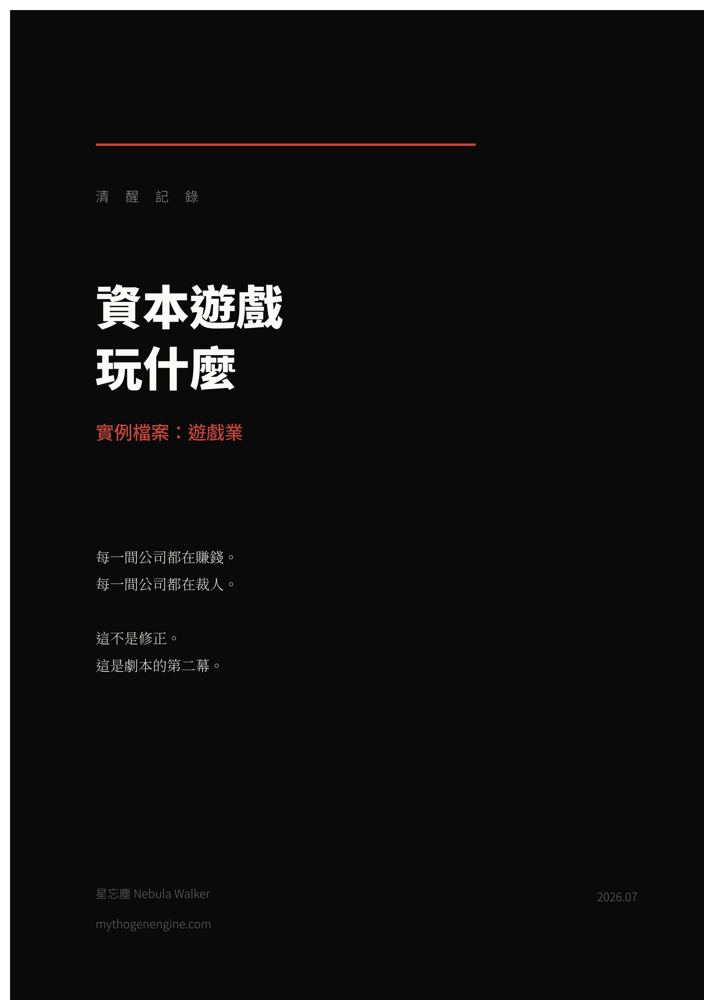

# 資本遊戲玩什麼（實例檔案：遊戲業）

星忘塵 Nebula Walker · 創象引擎 MYTHOGEN ENGINE 2026JUL09

---

:::danger[你的行業，只會更隱閉、更殘酷]

本篇用遊戲業做案例——不是因為遊戲業最嚴重，**恰恰相反**。

遊戲業是所有被拆骨的產業裡，唯一一個你還看得見刀痕的。玩家社群數以億計、產品週期攤在陽光下、高管的每一次拋售都有人截圖存檔。每一刀，都在鎂光燈下。

**但你身處的行業呢？**

| | 遊戲業（本篇案例） | 你的行業 |
|---|---|---|
| 社群監督 | 數億玩家即時反應 | 封閉的客戶關係、保密條款 |
| 產品週期 | 可見、可追蹤 | 內部開發，外部無從得知 |
| 裁員消息 | 全球媒體報導 | 靜默裁撤、「組織優化」 |
| 受害者 | 會發聲、會串連 | 簽了競業禁止、怕被標記 |
| 資本手法 | 已被記錄、已被分析 | **正在發生，但沒有人寫下來** |

半導體、教育、醫療、金融、製造——拆骨的邏輯完全一致，但內部更封閉、過程更殘酷、受害者更沉默。你沒看到，不代表沒有發生；你看不到，正是因為它設計成讓你看不到。

**遊戲業是窗口，不是例外。**  
本篇用這扇窗，拆解資本正在上演的整套劇本。  
讀完之後，回頭看看自己的行業——你會認出每一步。

:::

---

**作者**　星忘塵 Nebula Walker

**系列**　清醒記錄 Lucid Record

**分類**　產業分析 / 資本結構 / 科技評論
  
**初版**　2026 年 7 月

**版本**　v1.0

**授權**　CC BY-NC-SA 4.0

**網站**　mythogenengine.com

---

本書內容基於公開資料整理分析，所有數據來源已在文中標注。觀點屬作者個人判斷，不構成投資建議。

---

---

**本文結構**

**〈劇本的第二幕〉** 2026 年科技業裁員不再是修正，而是為 AI 敘事騰出資金的系統性操作。

**〈Sony：米芝蓮改做吃到飽〉** 四步拆骨實錄——換人、收購稀釋、精準清洗、賣光套現。八間工作室關閉，高管在爭議政策公佈兩天後拋售過半持股。

**〈Xbox：同一個劇本，不同的演員〉** Microsoft 花 690 億買下遊戲業最大 IP 庫，然後裁人、翻轉策略、把 1,900 億投入 AI 資料中心。旗艦遊戲卻連基本 AI 都沒做。

**〈Sega 的鬼魂〉** Sega 是力竭而亡的悲劇。Sony 和 Microsoft 不是做不到，是不打算做了。差別在於：一個是死，一個是被活摘。

**〈技術買辦與認知失調〉** 最危險的不是資本本身，是那些穿上資本的皮、用重構的語言消滅重構的技術人。Nokia 時代是恐懼驅動的沉默；現在是刻意安排的偽裝。

**〈七千二百五十億的去向〉** 四大巨頭 2026 年資本支出增長 77%。裁員省下的錢，填進 AI 基建的帳上。做事的人被趕走，報表的數字在漲。

**〈不是創造性破壞〉** 過去的工業革命犁田但留土壤。現在是往土裡灌水泥——裁掉創新的人，鎖死創新的路。

**〈這不是左右的問題〉** 本文批判的不是資本主義，是資本停止生產之後仍佔著位置。同時，「反資本」的左翼敘事與 DEI 政治語言，跟 AI 語言一樣，都可以被用作清洗的包裝。極端之間被碾碎的，是中間做事的人。

---

### 劇本的第二幕

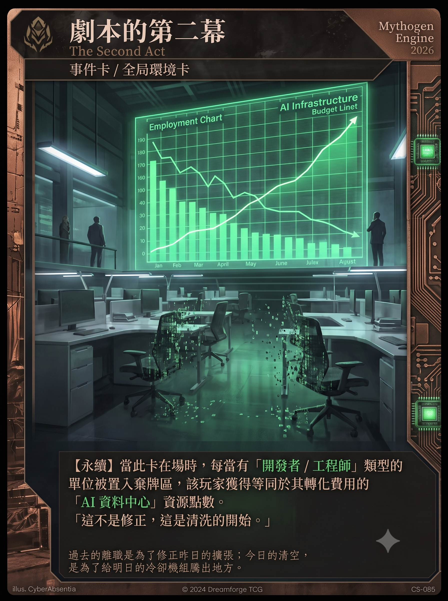

2026 年上半年，全球科技業裁掉了超過十八萬五千人。267 間公司，平均每天 989 人失業。

這個數字本身不新鮮——2023 年四十三萬，2025 年二十四萬。真正值得停下來想的，不是數字的大小，而是數字背後的邏輯徹底變了。

2023 年裁員，理由是「疫情期間請太多人」。那是修正。2026 年裁員，理由是「我們要把錢投入 AI 基礎建設」。Oracle 在四月一日裁掉至少一萬人——公司 Slack 一夜之間用戶從十六萬五千跌到十五萬五千——預計總數高達三萬。TD Cowen 分析師估算，裁兩到三萬人可以為 Oracle 省下一百億美金。省下的錢去哪？填補 AI 資料中心兩百億的資金缺口。同一時間，Oracle 剛發表了亮眼的第三季財報。

Meta 五月裁八千人，之後還有更大一波，預計全年裁減接近兩成員工。Snap 裁一千人，CEO Spiegel 說公司「40% 的新代碼已經由 AI 生成」。Atlassian 裁一千六百人。ClickUp 裁 22%，創辦人宣稱在打造「100 倍產出的組織」。

每一間公司都在賺錢。每一間公司都在裁人。

這不是修正。這是劇本的第二幕開始了。

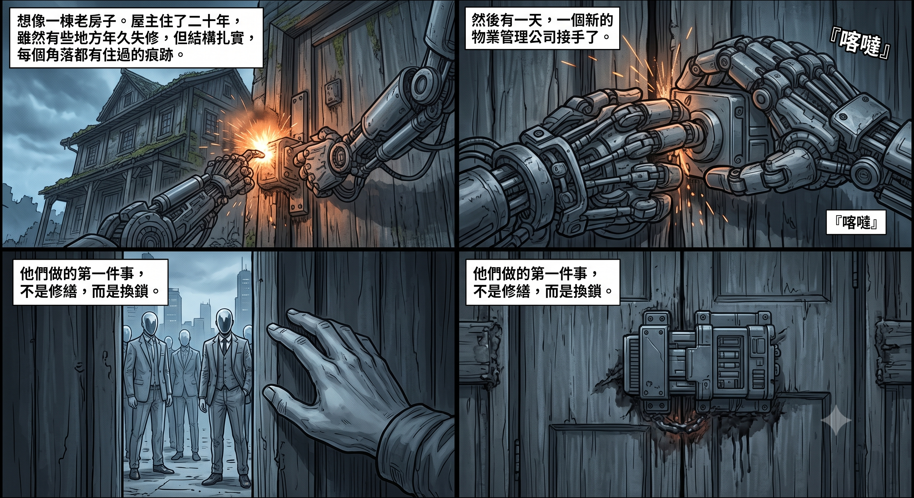

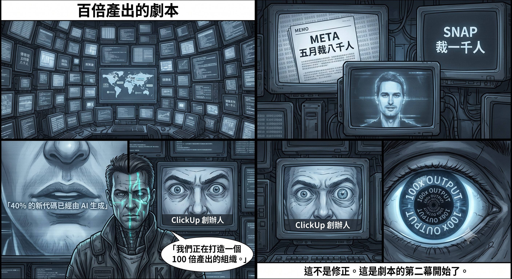

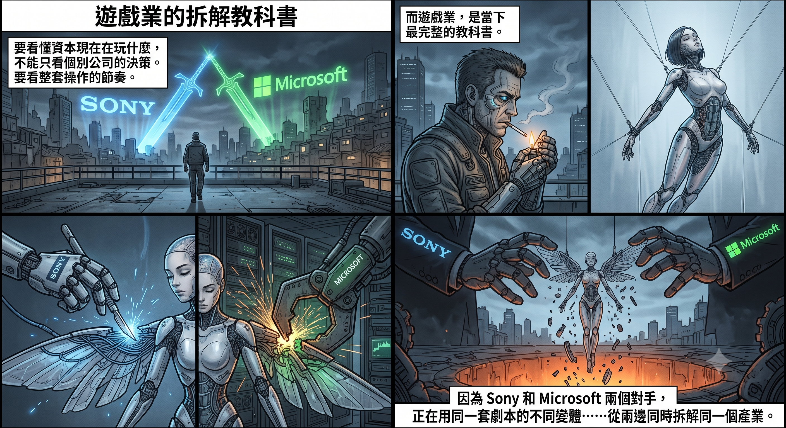

---

想像一棟老房子。屋主住了二十年，雖然有些地方年久失修，但結構扎實，每個角落都有住過的痕跡。然後有一天，一個新的物業管理公司接手了。

他們做的第一件事，不是修繕，而是換鎖。

要看懂資本現在在玩什麼，不能只看個別公司的決策。要看整套操作的節奏。而遊戲業是當下最完整的教科書——因為 Sony 和 Microsoft 兩個對手，正在用同一套劇本的不同變體，從兩邊同時拆解同一個產業。

---

### Sony：米芝蓮改做吃到飽

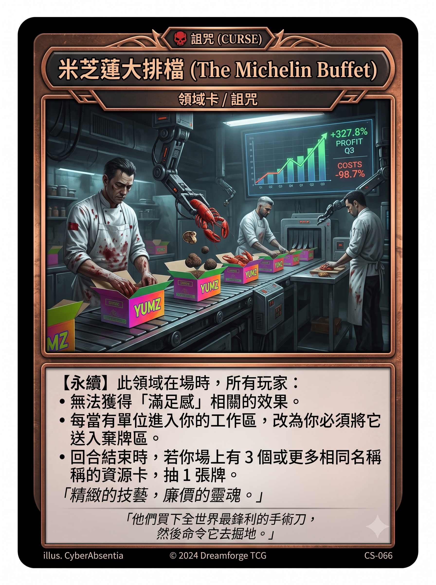

**第一步：換人。**

不是換普通員工，是換掌舵的人。引入的核心條件不在國籍——在於這些人跟公司原有的技術積累、產品文化、工程傳統完全沒有感情。他們不是來做產品的，是來執行資本指令的。

Sony 前 CEO Jim Ryan 在任期間推動的核心策略，是在 2026 年前推出十二款第一方 live-service 遊戲。PlayStation 之所以成為 PlayStation，是因為《最後生還者》、《戰神》、《地平線》這些單機敘事大作——玩家願意花六十美金買一段打磨了五年的故事。把整條產品線導向 live-service，等於告訴一間米芝蓮餐廳：「你以後只做吃到飽。」

到了 2026 年，十二款只出了兩款。其中 Concord 上線一週就下架，據報開發成本高達兩到四億美金。

但策略失敗的代價，沒有落在決策者頭上。它落在工作室身上。

**第二步：擴充與稀釋。**

Sony 在 2021 到 2023 年間大肆收購：Bluepoint Games（2021）、Haven Studios（2022）、Neon Koi（原名 Savage Game Studios，2022）、Firewalk Studios（2023）。Bungie 的收購金額高達三十六億美金。

表面上是擴張版圖。實際上每一間被收購的工作室，都被要求配合 live-service 的「新方向」。Bluepoint 本來是做重製版的頂級技術團隊——Demon's Souls 重製版是 PS5 首發護航作，Shadow of the Colossus 重製版被譽為業界標杆。收購之後，他們被派去開發一款 live-service 版本的《戰神》。

這就像買了一把全世界最好的手術刀，然後叫它去鋤地。

**第三步：清洗。**

2024 年二月，Sony 全球裁員 900 人，接近 8%。London Studio 直接關閉——一間運營了二十多年的工作室，EyeToy、SingStar、Blood & Truth 的開發者，Sony VR 計劃的核心力量。同年十月，Firewalk Studios 和 Neon Koi 關閉。Firewalk 被收購才一年，Sony 當初承諾「幫助它成長」。Neon Koi 連一款遊戲都沒出過。

2025 年六月，Bend Studio 裁掉三成全職員工，約四十人。

2026 年二月，Bluepoint Games 關閉，70 人失業。三月，Dark Outlaw Games 關閉——成立才一年，連遊戲都未公佈。六月，Bungie 再裁約四百人，佔剩餘員工一半。華盛頓州勞工部的 WARN 備案列出了 292 個受影響職位。這間曾經有一千三百人的工作室，到 2026 年中只剩約四百人。Sony 為 Bungie 計提的減值損失：七億六千五百萬美金。

PS5 世代至今，Sony 關閉了八間工作室。十間近年收購的工作室，六間經歷了裁員或關閉。

同一段時間內，Sony 遊戲部門 2024 財年營業利潤增長 43%，達到 4,148 億日圓（約 25 億美金）。PlayStation 月活躍用戶創歷史新高：1.29 億。

利潤在漲。工作室在死。就像屠宰場的收入報表永遠很好看——代價只是沒人去數地上的羽毛。

**第四步：賣光、包裝、套現。**

2026 年一月，Sony 宣佈將 Bravia 電視與家庭影音業務 51% 股權出售給 TCL，作價 754 億日圓（約 4.75 億美金）。一間 Trinitron 時代起就定義了「高級電視」的品牌，以低於五億美金的價格交出了控制權。

七月一日，PlayStation 宣佈 2028 年一月起停止生產所有新遊戲的實體光碟。從此以後，實體盒裝裡只會有一張下載碼。前 PlayStation 掌門人 Shawn Layden 稱之為「相當戲劇性的決定」，直言這大概就是「一道試算表上的決策」。他在 PlayStation 工作了三十二年。

兩天後——七月三日——Sony 集團總裁十時裕樹在美國 SEC 提交了 Form 4：以每股 $21.02 的價格拋售 225,000 股 Sony 股票，套現約 473 萬美金，佔他直接持有股份的 56.5%。同日，首席策略官三友俊元拋售 25,000 股，約 52 萬美金，佔持有量 18%。

兩位高管的操作都不是預先安排的自動交易計劃。是主動的公開市場買賣。

宣佈一個你知道會激怒消費者的政策，在股價微漲的窗口裡賣掉超過一半的持股。Unwire 底下的留言說得最直接：「臨走整爛佢。」

Sony 最新提交給 SEC 的 20-F 年報做了三個修改。第一，新增一整段 AI 戰略文字：「Sony 正在利用 AI 釋放工作室的創造力，進一步提升 PlayStation 體驗。」第二，刪除了原文中關於「繼續將第一方遊戲部署到 PC 等多平台」的句子。第三，把「可持續且有利潤的商業增長」改成了「商業增長」——profitable 這個字被刪掉了。

報表是寫給華爾街看的。遊戲是寫給玩家的。當兩者衝突，資本會毫不猶豫地選擇前者。
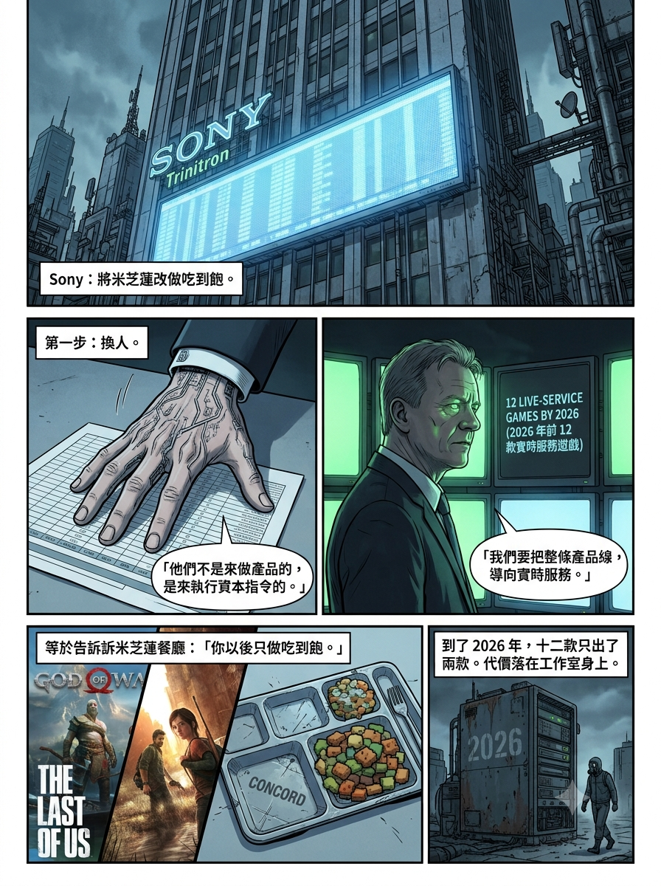

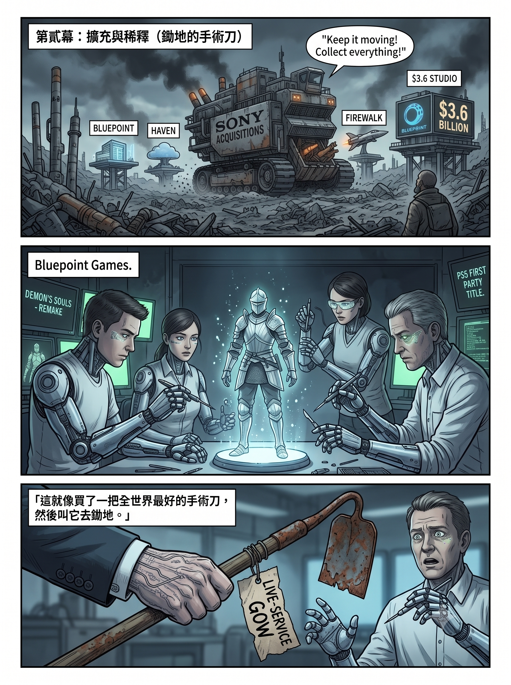

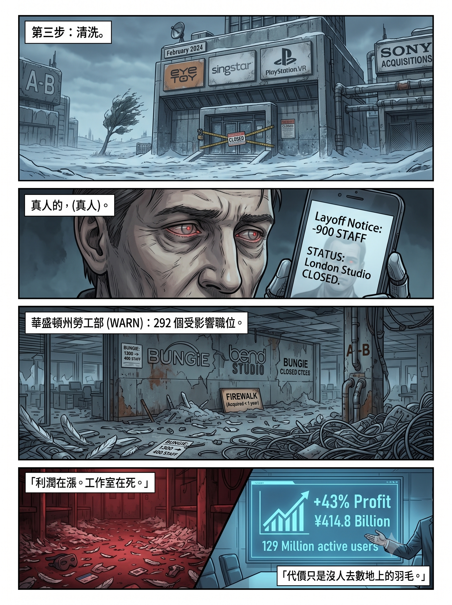

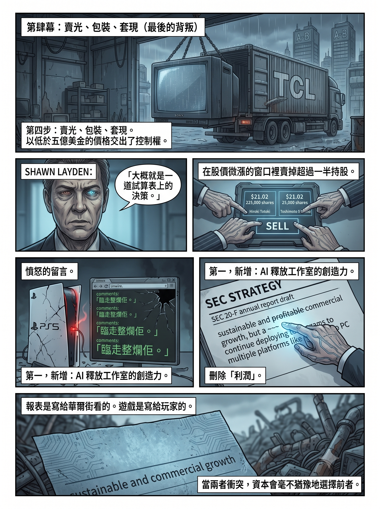

---

### Xbox：同一個劇本，不同的演員

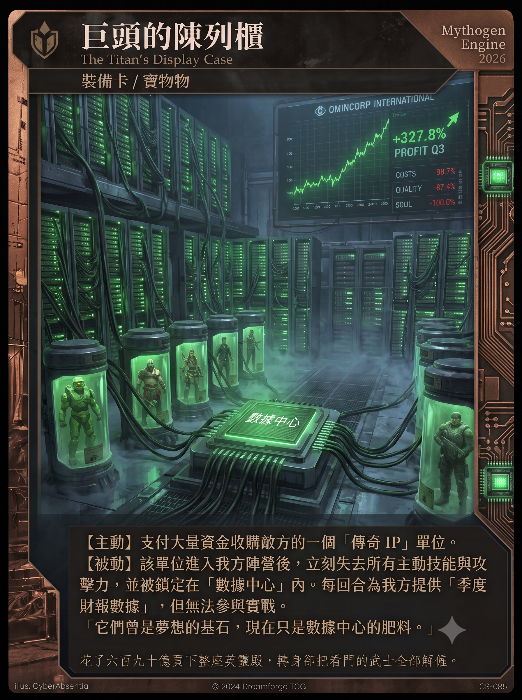

如果 Sony 的操作是「把米芝蓮改成吃到飽」，Microsoft 在 Xbox 上做的事情更加直截了當：把整間餐廳連桌椅帶廚房拆了，地皮留著等升值。

2023 年十月，Microsoft 以 690 億美金完成了對 Activision Blizzard 的收購——遊戲業史上最大一筆交易。三個月後，2024 年一月，Microsoft Gaming 裁員 1,900 人。之後陸續關閉 Arkane Austin、Tango Gameworks、Alpha Dog。2026 年初，Phil Spencer 離任，新任 Xbox Game Studios 主管 Asha Sharma 上任，同時再裁 580 人，主要砍的是行銷和多平台移植團隊。

花了 690 億買下 Call of Duty、魔獸世界、暴雪全線 IP。然後開始裁掉做遊戲的人。

同時，Xbox 獨佔策略在兩年內經歷了一百八十度的翻轉。2024 年初還堅持獨佔是核心策略；到 2025 年，Halo、Forza、Sea of Thieves 陸續登陸 PlayStation 和 Switch；2026 年初，Fable 和 Kiln 確認 PS5 首日同步發售。然後到了 2026 年七月，Bloomberg 報導 Microsoft 再次全面翻轉，宣佈未來所有第一方大作重回 Xbox 獨佔——因為內部數據顯示，每一款首日多平台發售的遊戲，會侵蝕約 18% 的 Xbox 主機綁定率，而且沒有帶來預期的 Game Pass 訂閱增長。

這不是策略搖擺。這是資本在測試哪種敘事更能撐住估值。

NeoGAF 上有人把 Xbox 和 Sega 的衰落做了精確的世代對照：Xbox = Master System，Xbox 360 = Mega Drive，Xbox One = Saturn，Xbox Series X = Dreamcast。對照得令人不寒而慄。但真正的區別在於：Sega 是一間遊戲公司，它的死是因為打不過 PlayStation。Microsoft 是一間生產力軟體公司，Xbox 從第一天起就不是為了做遊戲而存在——它是為了在客廳裡佔一個位置，是 Windows 生態系統向消費市場延伸的工具。

Phil Spencer 自己在離任前被問到 Sega 比較時說：「I get it.」（我理解。）

當一個生產力軟體公司花了 690 億買下遊戲業最大的 IP 庫，然後裁掉做遊戲的人、兩年內把獨佔策略翻了兩次、在 2026 年承諾花 1,900 億做 AI 資料中心——你很難不問一個問題：這 690 億到底是在投資遊戲，還是在投資一個可以寫進年度報告的數字？

Forza Horizon 6 是答案。如果 Microsoft 真的把 1,900 億 AI 資本支出的任何一部分投入了遊戲——哪怕是萬分之一——它的旗艦賽車遊戲不應該還在用橡皮筋 AI。一間花 1,900 億建 AI 基建的公司，做不出一個「根據你的駕駛風格建議懸吊設定」的功能。這不是技術做不到，是根本沒有人打算做。

那 1,900 億去了哪？去了投資者簡報的 PowerPoint 上。

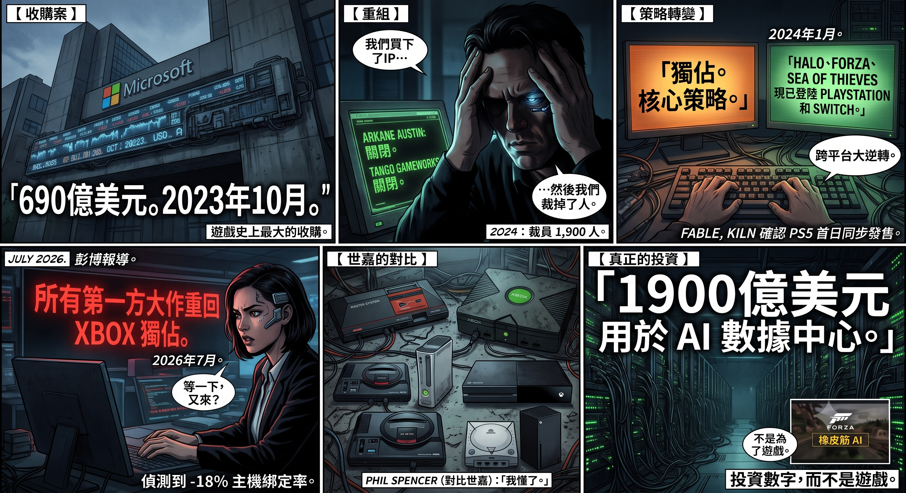

---

### Sega 的鬼魂

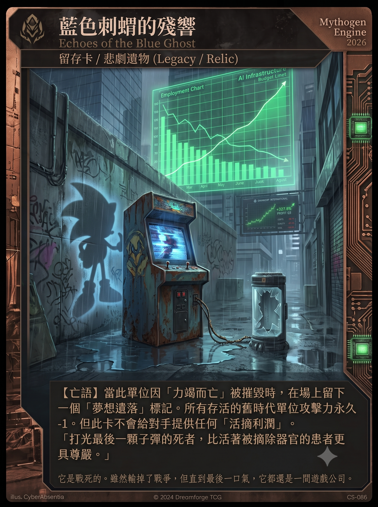

值得在這裡停下來看一眼 Sega。

1991 年，Sega Genesis 佔據北美超過 60% 的主機市場。十年後，2001 年一月三十一日，Sega 宣佈停產 Dreamcast，退出主機業務。中間發生了什麼？Sega CD 失敗，32X 失敗，Saturn 失敗——每一步都不是因為技術不夠，而是因為內部派系鬥爭、策略搖擺、和連續的自我傷害。到 Dreamcast 推出的時候，這台主機確實是技術先驅——第一台內建網路連線的主機——但消費者已經不再信任 Sega 了。

Dreamcast 全球只賣了 910 萬台。PlayStation 2 成為史上最暢銷主機。

之後，Sega 被柏青哥機製造商 Sammy 收購。一間曾經跟任天堂分庭抗禮的公司，最終的歸宿是柏青哥。

Sega 的死，是被自己打死的。但至少它死的時候，還是一間遊戲公司——它真的想做好 Dreamcast，只是做不到。

現在的 Sony 和 Microsoft 不一樣。它們不是做不到。它們是不打算做了。

Sony 的工作室關了八間，但利潤創新高。Microsoft 花了 690 億買 IP，然後裁人。兩邊的 CEO 和高管都在套現。產品不再是目的，是道具——是年度報告裡「我們的遊戲生態系統」那一段的配圖。

Sega 至少是一場悲劇。現在發生的，更像是一場精心策劃的器官摘除。患者還有心跳，但腎已經被取走了，賣了，而手術室外面的看板寫著「AI 驅動的全新醫療體驗」。
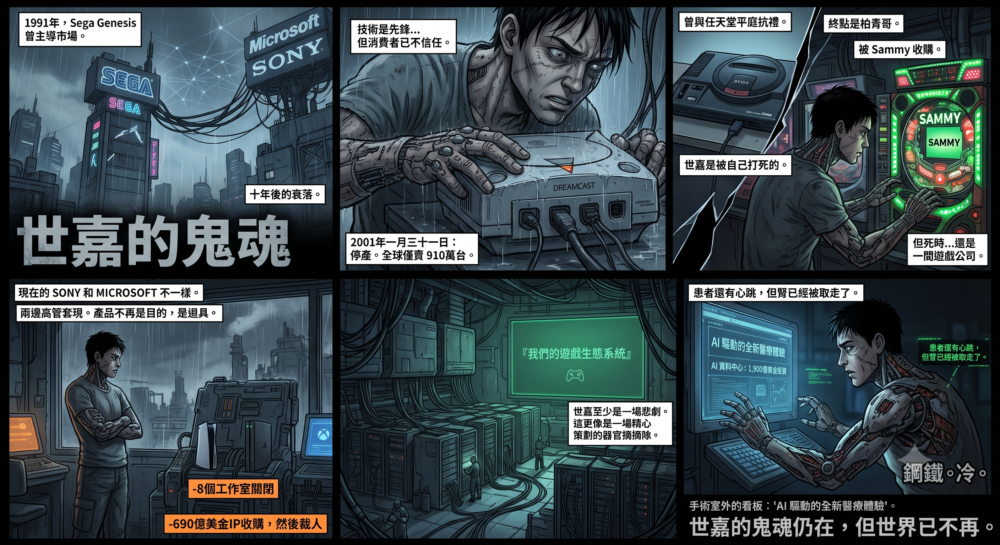

---

### 技術買辦與認知失調

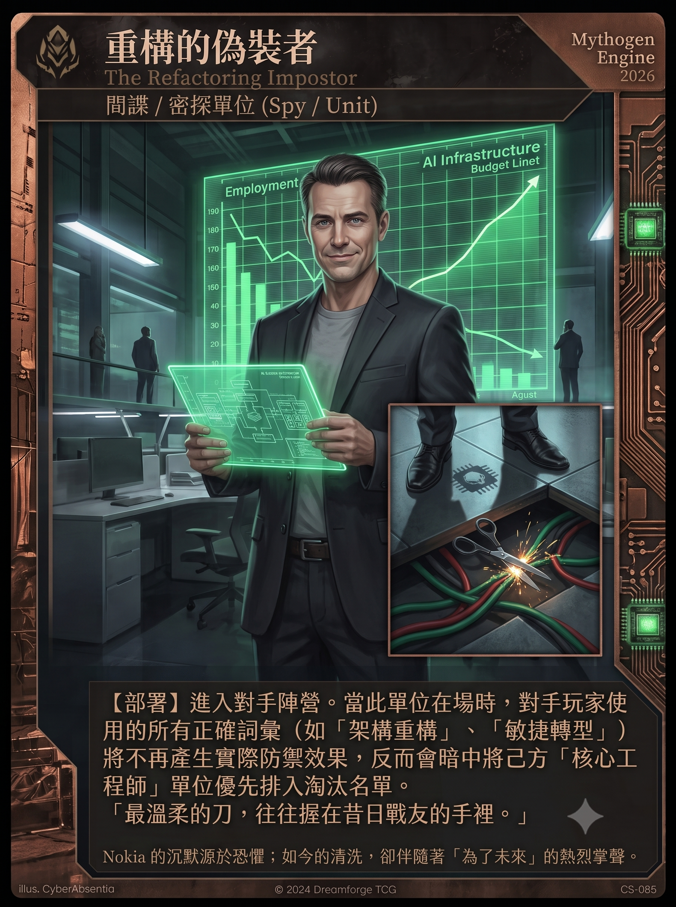

但如果只講到這裡，這篇文章跟任何一篇「資本真壞」的控訴沒有分別。

真正需要看清楚的，是這套操作裡面最難被察覺、殺傷力最大的一個環節：**在整個過程中，會有大量原本有技術能力的人背棄技術、背棄理念，主動站到資本那一邊。**

打個比方。一個社區裡有個老醫生，街坊生病都搵佢。有一天，一間連鎖醫療集團收購了診所。如果集團派一個西裝友來宣佈「以後感冒一律開最平的成藥、三分鐘看完一個症」，整條街都會鬧。但如果出來宣佈的，是那個老醫生自己呢？「我行醫三十年，以我的專業判斷，這個新方向是對的。」——你會猶豫。

你猶豫，不是因為你蠢，是因為你信任他。而資本買的，正正就是這份信任。

在科技業，這些人不是財務出身的空降兵。他們是你以前的同事，你的前輩，曾經一起寫過 code 的人。他們穿上資本的皮之後，用最專業的技術語言——「敏捷轉型」、「架構重構」、「AI 驅動開發」——包裝每一個決策。這層皮讓外界和員工產生錯覺，以為公司真的在做技術升級。

而這正是整個操作中最毒辣的地方。它不是靠暴力壓你，是靠製造認知失調讓你自我懷疑。

---

講到認知失調，需要做一個重要的區分。因為現在這種認知失調，跟過去的版本不是程度的差別，是性質的差別。

Nokia 時代的問題，是恐懼文化。INSEAD 的 Quy Huy 和 Aalto 大學的 Timo Vuori 在 2015 年發表的研究（刊於 Administrative Science Quarterly），訪問了七十多位諾基亞前高管和工程師，結論是：諾基亞不是死於技術，是死於「集體恐懼」。高層驚外部競爭，中層驚高層，中層系統性地報喜不報憂，高層在失真的資訊裡做決策。前線工程師一早就知道 Symbian 需要徹底重構，但中層為了保住位置，逼工程師打補丁交貨。

那是恐懼。好歹還算是明槍——有人知道真相，只是不敢說。問題在通訊管道裡，至少理論上可以修復。

現在的操作，比恐懼文化高出一個層級。

現在不是「驚到唔敢重構」。現在是**刻意任用不會真正重構的人，讓他們打著重構的口號，做的卻是阻止重構的事**。

邏輯很簡單：真正的架構重構，意味著承認現有系統有深層問題（報表上不好看），意味著短期內不會產出新功能（KPI 交不出來），意味著需要留住最懂底層架構的人（而這些人往往是最「不聽話」的人）。這些全部不符合資本的需要。

資本需要的是：報表好看、裁員順利、敘事連貫。

所以資本找來的人，是那些懂得用「重構」這個詞、但不會真正去做重構的人。他們懂得怎樣在 PowerPoint 上畫出漂亮的架構遷移圖，懂得在 all-hands meeting 上說出讓工程師半信半疑的話，也懂得在裁員名單上把那些會問「新架構的底層 IO 怎麼處理」的人優先排進去。

這就像請了一個營養師，不是為了改善你的健康，而是為了讓你在體檢報告上看起來很健康——同時偷偷把你的腎賣掉。

Nokia 是中層因為恐懼而隱瞞問題。現在是管理層用重構的語言主動消滅重構的可能。一個是被動的沉默，一個是主動的偽裝。結果一樣——技術債持續堆積、打補丁的人被留下、指出問題的人被趕走——但後者比前者更難被識破。因為所有正確的詞彙都在被使用，所有正確的事情都看起來在被執行。

直到最後，那些不會重構的人成功地用重構的口號，摧毀了所有重構的空間。

「是不是我太守舊了？是不是我真的不懂新技術？」——當你開始問自己這些問題，你已經放棄了抵抗。你會麻木，會開始覺得「可能真的是時代變了」，然後安靜地看著身邊的人一個一個被「組織調整」掉，直到輪到你自己。

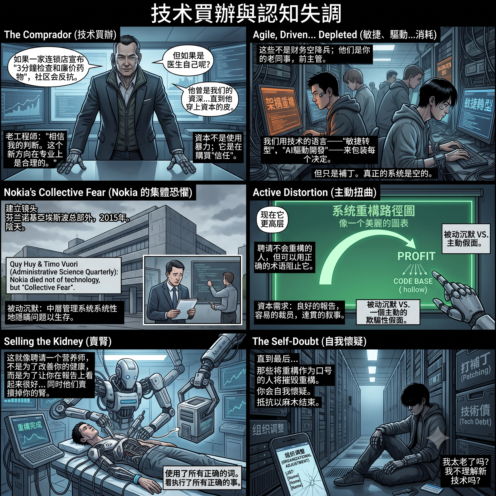

---

### 七千二百五十億的去向

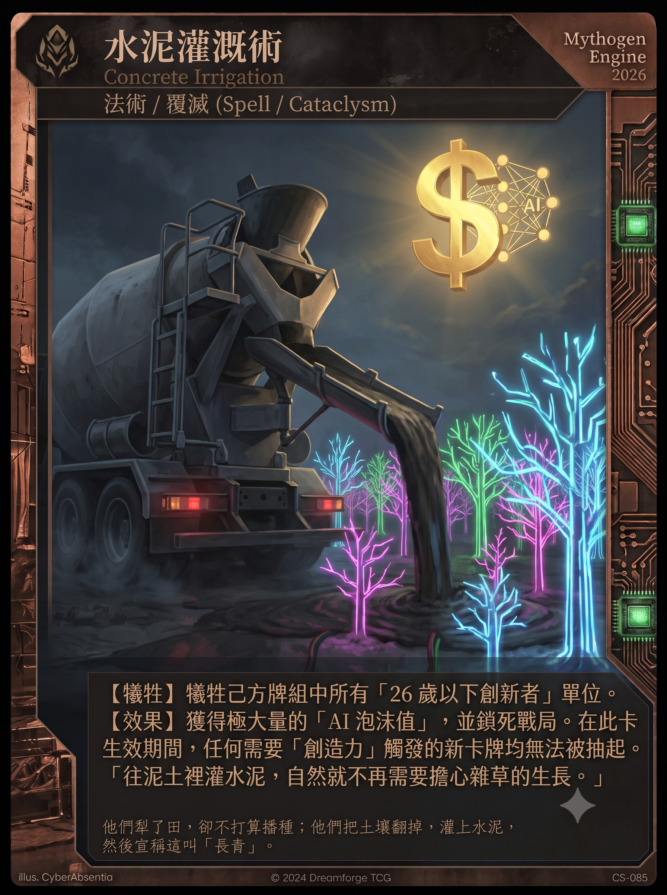

把視線拉遠，看更大的圖景。

四大科技巨頭——Amazon、Microsoft、Alphabet、Meta——2026 年的資本支出合計約七千二百五十億美金，比 2025 年的四千一百億增長 77%。逐間拆開：Amazon 兩千億（CEO Jassy 宣佈當天股價暴跌 11%，九個交易日連跌，蒸發超過四千五百億市值——The Register 的記者酸了一句：「你只是漏算了一個克羅地亞的 GDP」），Microsoft 一千九百億（其中兩百五十億純粹是記憶體和 GPU 漲價），Alphabet 一千七百五十到一千八百五十億，Meta 一千二百五十到一千四百五十億。

幾乎全部流向 AI 資料中心、AI 晶片、AI 基礎建設。而多間公司的內部文件直接說明：裁員省下的錢，是為了抵消 AI 投資的成本。Amazon 在 2026 年一月裁掉一萬六千名企業員工的同時，宣佈了兩千億的資本支出計劃。Stanford HAI 的數據顯示，26 歲以下軟體工程師的就業率自 2024 年以來下跌了近兩成。

全球遊戲業 2025 年收入接近一千九百五十六億美金，史上最高。同一時間，GDC 2026 調查顯示，兩年內有三分之一的美國遊戲開發者被裁。62% 的從業者表示有興趣加入工會。

收入在漲。做事的人在被趕走。省下的錢在買下一輪故事的道具。

這就像一間劇院，觀眾席滿了，票房創新高，但後台的演員正在被一個一個換成紙板人偶。前排的觀眾還沒發現，因為燈光很亮，音樂很響。

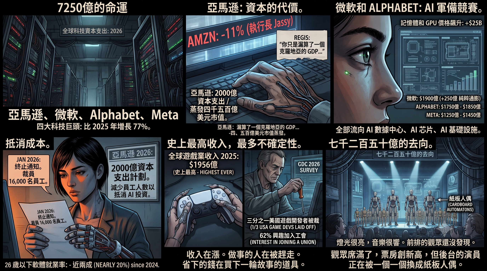

---

### 不是創造性破壞

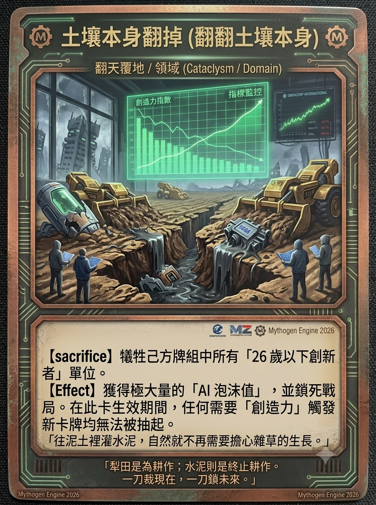

有人會說：「這不就是創造性破壞嗎？舊的不去，新的不來。」

不是。

過去的工業革命確實是破壞性的，但它同時在培育新的創造空間。紡織機取代手工，但催生了機械工程。蒸汽機淘汰人力，但打開了鐵路和造船。舊田被犁了，但土壤還在，新的種子可以落地。

現在不是犁田。現在是把土壤本身翻掉。

研發團隊裁了，獨立工作室買了再掏空，底層引擎的人換成監控指標的人。Bluepoint 的技術能力不是不夠好——Sony 自己親口說他們是「技術高超的團隊」——但這些能力在資本的帳本上找不到對應的欄位。Sega 至少是真的力竭而亡；Bluepoint 是在健康的時候被摘了器官。

而且除了裁人這一刀，還有第二刀：透過閉源和平台鎖定，把未來的創造者堵在門外。微軟的 ASD 技術就是教科書級的示範——自己用 DX12 製造了著色器編譯的問題，十年後回來「解決」，但方案綁死自己的商店和雲端。先放火，再賣滅火器，滅火器只賣給住在自己大樓裡的房客。Sony 在 SEC 年報裡刪掉 PC 多平台的承諾、宣佈全面數碼化然後高管套現——本質上也是同一種操作：收窄生態，鎖定用戶，在退路被堵死之前先把錢拿走。

一刀裁掉現在做創新的人。一刀鎖死將來做創新的路。兩刀一起落，不是在犁田，是在往土裡灌水泥。

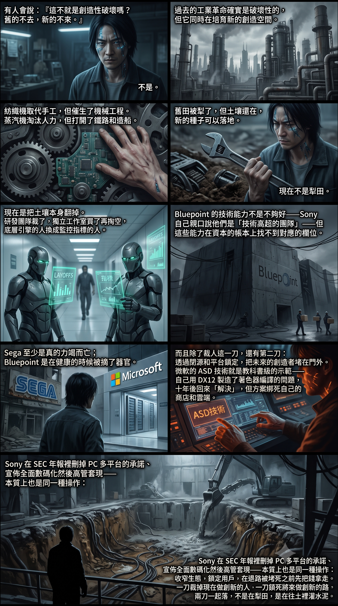

---

### 這不是左右的問題

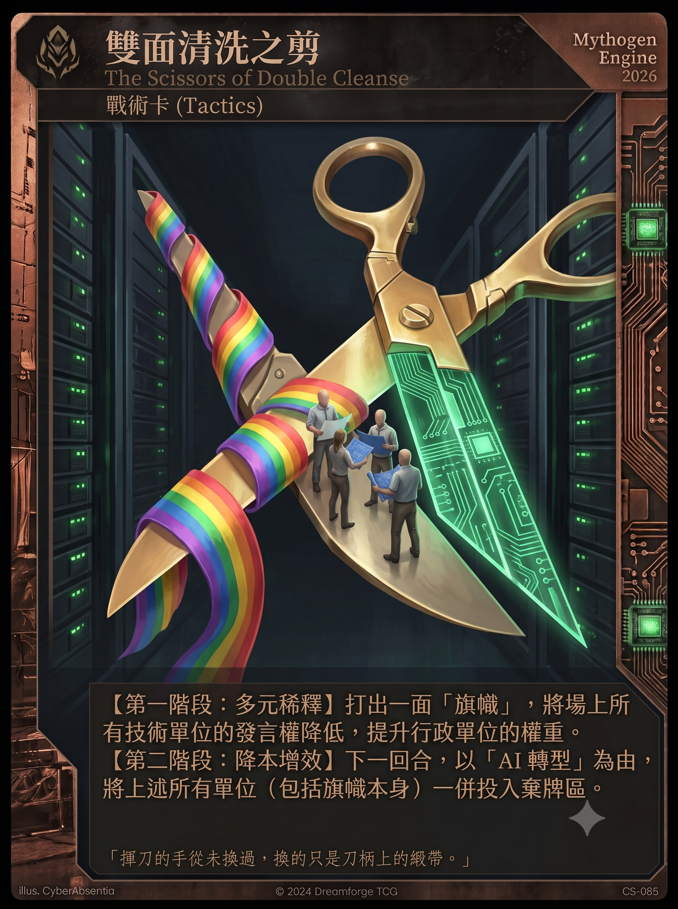

寫到這裡，有必要講清楚一件事，因為有些讀者可能已經開始把這篇文章歸類了。

這篇文章批判的不是資本主義。恰恰相反——真正的市場經濟需要資本承擔風險、投入生產、創造價值。一間公司花十年打磨一款遊戲然後賣六十美金，玩家覺得值，這就是市場。當資本只做報表不做產品，它背叛的不是勞工，是市場本身。

但同樣需要警惕的，是那些看起來跟資本對立、實際上被資本當成工具的語言。

資本的操作手法裡，有一層比技術買辦更隱蔽的皮：政治語言。而這套政治語言的運用規模，遠比大多數人意識到的要龐大。

2020 年 George Floyd 事件之後，美國企業掀起了一場 DEI（多元、公平、共融）運動。DEI 職位招聘量在一年內激增 123%。Google 承諾在 2025 年前將弱勢群體在領導層的比例提高 30%。Meta 制定了擴大黑人和拉丁裔員工比例的目標。Amazon 宣佈進行「全面改革」。Walmart 成立了一個一億美金的「種族平等中心」。幾乎所有大型企業都成立了 DEI 團隊、擴充了 HR 部門、聘請了首席多元化官。

然後呢？

然後所有這些公司開始大規模裁員——而 DEI 團隊和 HR 部門往往是第一批被裁的。Revelio Labs 的數據顯示，DEI 職位的流失率高達 33%，遠高於非 DEI 職位的 21%。Bloomberg 的分析發現，2023 年 84 間大型企業裁掉的員工中，黑人佔 26%——是他們在員工總數中佔比的近兩倍。

再然後，從 2024 年下半年開始，這些公司連 DEI 政策本身都開始拆了——不是因為「覺醒了」，是因為政治風向變了，DEI 這面旗幟不再是最好用的包裝紙。Forbes 維護的清單記錄了整個過程，規模之大令人瞠目：

科技業：Meta 裁掉整個 DEI 團隊，不再要求供應商多元化。Google 取消多元化招聘目標，停止標記 Pride Month 等文化紀念日，2024 年年報中八次提到的「diversity」一次都不見了。Amazon 的 2024 年報刪除了所有「inclusion and diversity」相關段落。Microsoft 在 2024 年七月一日裁掉了整個 DEI 部門，負責人當天發內部郵件說這是「有目的、有策略的」。Tesla、GameStop、Workday、Salesforce 在 10-K 年報中悄悄刪除了所有 DEI 相關文字。

傳統企業：Walmart 終止了一億美金的種族平等中心，不再贊助 Pride Month，禁止第三方賣家出售特定 LGBTQ 商品。Boeing 在裁掉一成員工的同時解散了整個 DEI 部門。Ford、Lowe's、Harley-Davidson、John Deere、Tractor Supply、Molson Coors、Toyota 全部宣佈縮減或終止 DEI 計劃。McDonald's 取消了多元化代表性目標，把「多元化團隊」改名為「全球包容團隊」。Target 削減了 DEI 計劃並因此引發了消費者抵制。

金融業：Goldman Sachs 取消了要求上市公司董事會包含女性和有色人種的規定。JPMorgan、Morgan Stanley 在年報中大幅減少 DEI 相關文字。Accenture 宣佈不再使用多元化目標來指導招聘和升遷。

Conference Board 的研究顯示：S&P 500 企業年報中 DEI 一詞的出現頻率，從 2020 年的平均 12.5 次跌到 2024 年的 4 次。NPR 報導指出超過十二間主要企業——包括 Pepsi、GM、Disney、GE、Intel、PayPal、Chipotle、Comcast——在 2024 年報中大幅削減或完全移除了 DEI 相關文字。GM 直接刪除了所有「diversity」字眼。Pepsi 幾乎全部刪除——就在一年前它還在年報裡寫 DEI 是「競爭優勢」。

Dell 是整個模式最赤裸的縮影：連續三個財年每年裁掉一成員工——FY2024 裁一萬三千人，FY2025 裁一萬二千人，FY2026 裁一萬一千人——三年砍了三萬六千人，接近三成的總人力。同一時間，它是少數公開「重申 DEI 承諾」的公司之一。裁員報告和 DEI 聲明寫在同一份財報裡。

重點不在 DEI 本身是好是壞。重點在於一個更冰冷的事實：**對資本來說，任何政治語言——無論左右——的功能都完全一樣，就是讓清洗變得不可質疑。**

說穿了就是兩刀連環：第一刀用 DEI 洗走原有的人，第二刀再炒掉 DEI 自己。兩批人都以為自己被重視，結果兩批人都是消耗品。

2020 到 2023 年，旗幟是「多元包容」。用「多元」的名義擴充 HR 和行政團隊，稀釋技術骨幹的話語權。你不能反對，因為反對就是「不包容」。

2024 到 2026 年，旗幟換成了「AI 轉型」。用「擁抱 AI」的名義裁掉連同 DEI 團隊在內的所有非核心部門。你不能反對，因為反對就是「不擁抱未來」。

旗幟不同，刀是同一把。揮刀的手從來沒有換過。

所以那些以「反資本」為職業的左翼敘事，也經常在做同樣的事：用正義的語言取代分析，用立場取代事實，用道德審判取代結構拆解。結果同樣製造認知失調，只是方向反過來。極端右派用利潤最大化吃掉一切；極端左派用道德正確吃掉一切。兩邊都不在乎真正做事的人。

本文無意站在任何一邊。左右都已經走向極端，而極端之間被碾碎的，從來都是中間那些只想把事情做好的人。

這篇文章只做一件事：記錄正在發生的事。

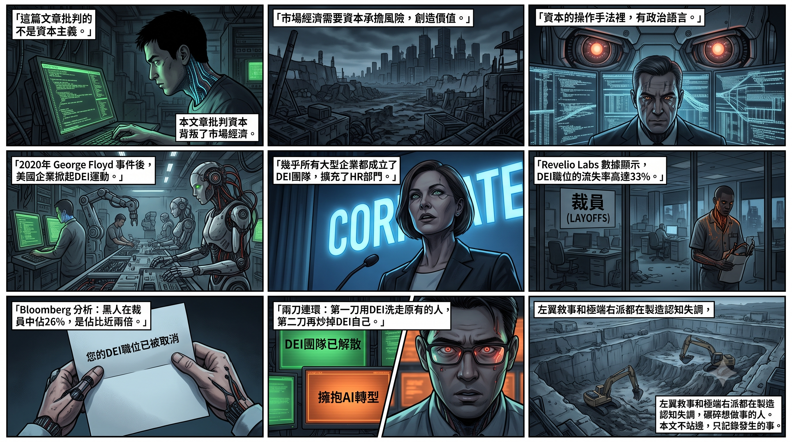

---

### 所以，資本現在在玩什麼？
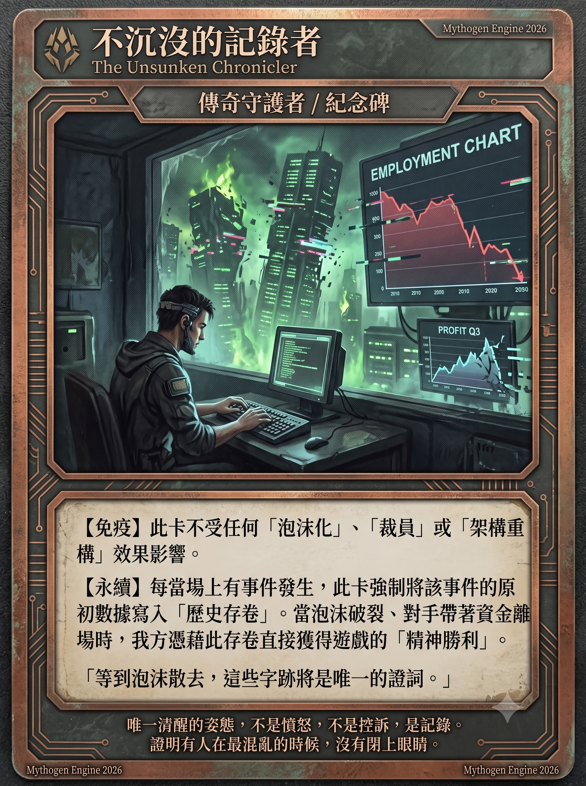

它在玩一場規模空前的資產拆骨。用 AI 敘事做包裝，用裁員做手術，用閉源做圍牆，用技術買辦做白手套。目標從來不是讓技術變好，是讓報表變好。等到報表好看到足以套現，資本就會帶著錢離場，留下一地碎片。Sony 和 Microsoft 看似是競爭對手，實際上是同一套劇本的 A 面和 B 面——一邊把工作室變賣，一邊把 IP 囤積再裁人——中間被碾碎的，是同一批做遊戲的人。

最精巧的地方，在於重構的語言被用來消滅重構的可能。這使得身處其中的人幾乎無法分辨到底發生了什麼——因為每一個正確的詞都在被說，每一個正確的動作都在被做，只是方向完全反過來了。

不是沒有人看到。問題是看到的人大多數已經被趕走了，還在裡面的人正在被認知失調慢慢磨平，而外面的人只看到報表上的數字和新聞稿裡的 AI 願景。

而在這一切發生的同時，Sony 的總裁剛剛賣掉了他一半以上的股票。

唯一清醒的姿態，不是憤怒，不是控訴，是記錄。

把正在發生的事情如實寫下來。等到他們的故事講完、泡沫散去之後，這些記錄就是唯一的證據——證明有人在最混亂的時候，沒有閉上眼睛。

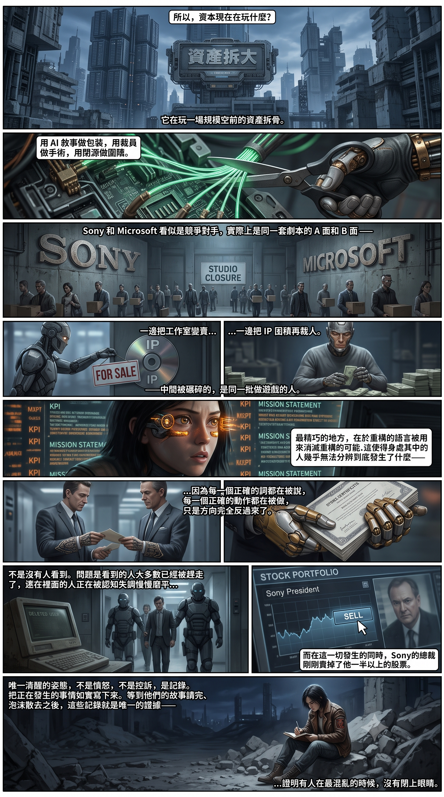

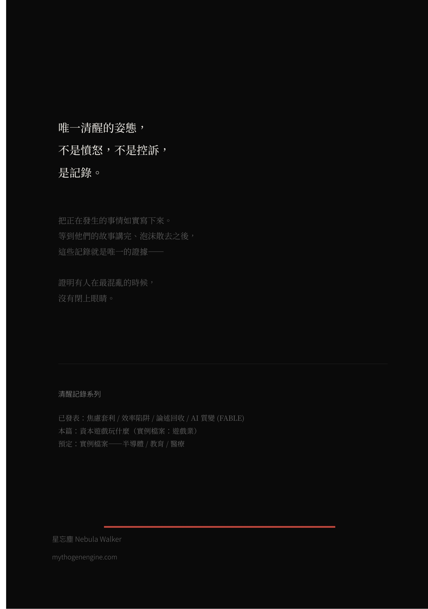