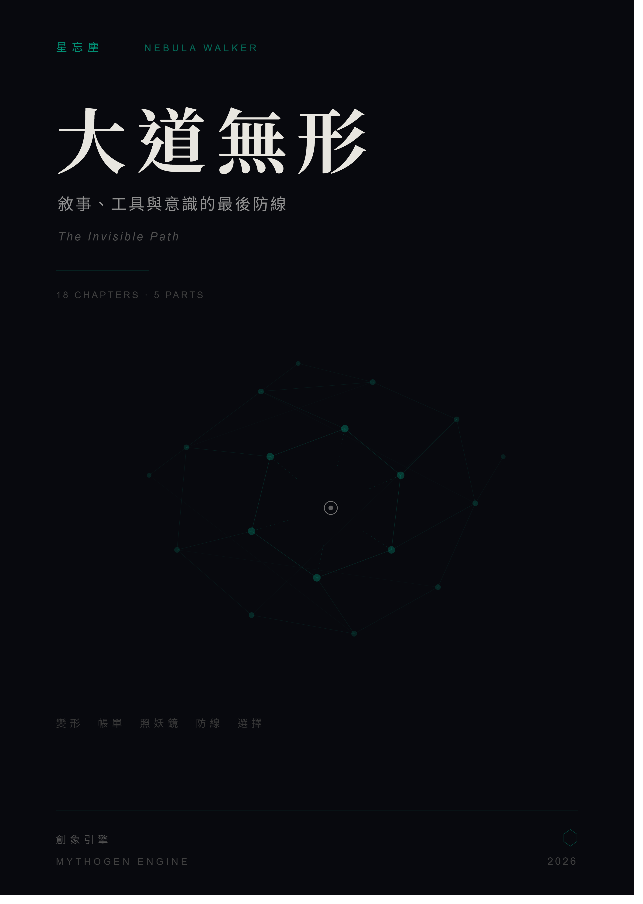

# The Invisible Path
## Narrative, Tools, and the Last Line of Defence

*The Invisible Path*

---

&nbsp;

**Author** Nebula Walker 星忘塵

**Publication Date** June 2026

**Category** Narrative Analysis · Tech Industry · AI & Consciousness · Social Structures

**Scale** Five Parts & Eighteen Chapters + Prologue, Epilogue, Afterword, Appendix (~210k words)

**Engine** MYTHOGEN ENGINE

**Website** https://mythogenengine.com/
**Facebook** https://www.facebook.com/mythogenengine

&nbsp;

---

&nbsp;

> *「看懂了結構，技術怎麼變都不怕。」*

&nbsp;

---

## Copyright Notice

本書所有文字內容版權歸作者 **星忘塵 Nebula Walker** 所有。
本書由 **創象引擎 MYTHOGEN ENGINE** 出品及協作排版。
未經作者書面授權，不得以任何形式複製、轉載、改編或商業使用。

All text content in this book is copyright © **星忘塵 Nebula Walker**, 2026.
Published and produced under **MYTHOGEN ENGINE**.
No part of this publication may be reproduced, distributed, or transmitted
in any form or by any means without the prior written permission of the author.

&nbsp;

---

## Table of Contents

**序章　三個問題**

**Part I: Metamorphosis — How Narratives Are Forged**

| # | 章節 | 核心命題 |
|---|------|---------|
| 1 | The News You Read Is Not the Original | A day's worth of distortion, demonstrating the smallest unit of narrative manufacture |
| 2 | Game Over: The Cross-Border Entanglement of Microsoft and Sega | A 25-year chain of cause and effect, the truth is more complex than the emotion |

**Part II: The Bill — Who Is Paying for the Story**

| # | 章節 | 核心命題 |
|---|------|---------|
| 3 | AI Begins Writing Itself — But Who Is Paying the Power Bill? | The two fuels of cross-subsidisation are both narrowing |
| 4 | AI Narrative Economics: When "Replacement" Becomes a Business | Narratives have a half-life, the market is learning to tell the difference |
| 5 | Information Feudalism: From Free Content to Knowledge Serfs | Functional collusion requires no meeting minutes |
| 6 | Someone Else's Tuition — The Ring 0 Landmine | Who paid the tuition, who received the diploma, and who is still stepping on the mine |

**Part III: The Demon-Revealing Mirror — What AI Exposes**

| # | 章節 | 核心命題 |
|---|------|---------|
| 7 | The Distortion of Learning: Anxiety Is the Best Commodity | The distortion of education is not caused by AI; AI merely makes it impossible to ignore |
| 8 | Prose Is Not Content; Code Is Not an Asset | When production costs approach zero, do you actually have something to say? |
| 9 | The Dead Knot of Corporate Culture | AI can accelerate construction, but it cannot accelerate consensus |
| 10 | When Production Approaches Free, What Do Humans Still Need? | "The feeling of being understood" and "actually being understood" are two different things |

**Part IV: The Line of Defence — Consciousness and Frameworks**

| # | 章節 | 核心命題 |
|---|------|---------|
| 11 | The Blade Is Sharp — But What Are You Cutting? | The essence of AI-collaborative writing: "intent" drives "expression" |
| 12 | Grasp the Meaning, Forget the Image — Word, Image, Intent | AI can produce word, imitate image, but cannot touch intent |
| 13 | Cognitive Models, Constraints, and the Capacity to Evolve | The Great Dao is formless — what is truly deep never appears on the surface |

**Part V: Choices — The Path and the Person**

| # | 章節 | 核心命題 |
|---|------|---------|
| 14 | Why "The Benevolent Have No Enemies" Fails, and Why It Still Matters | Not invincible, but having made a choice |
| 15 | The Weight of Passion — The Bill for Pursuing What You Love | How much you have to pay after making the choice |
| 16 | The Stolen Ladder — Why Hard Work No Longer Brings Returns | Why everything has become more expensive |
| 17 | The Stupidest Path (Part I) — An Unsolvable Mathematical Problem | Mathematics says this path is blocked |
| 18 | The Stupidest Path (Part II) — Why Walk It Anyway? | Not because of confidence, but because there is still something to write |

**終章　送得到未來的書**

**後記　關於你正在做的事**

**附錄　資料來源**

&nbsp;

---

## About This Book

**《大道無形》** 是一部五部十八章的合訂本——以冷靜的偵探報告形式，從敘事的變形與經濟學、AI 對知識工作的衝擊、資訊階層與企業文化的結構性問題、意識與判斷力的本質，一路追蹤到最後的選擇與道路。

全書回答五個問題：敘事是誰製造的？帳單由誰支付？AI 暴露了什麼真相？人還剩下什麼？路要怎樣走？

證物一件一件擺出來，分析逐層展開，結論由你自己下。

*A consolidated volume in five parts and eighteen chapters — a cold detective report tracing how narratives are manufactured, who pays the bill, what AI exposes, what remains irreplaceable in human consciousness, and how to walk the road ahead.*

&nbsp;

---

## Production Note

本書由 **創象引擎 MYTHOGEN ENGINE** 出品。
所有歷史事實經人工研究核實；所有分析與觀點為作者 **星忘塵 Nebula Walker** 原創立場。

*Produced under* ***MYTHOGEN ENGINE***.
*All historical facts are human-verified.*
*All analysis and opinions are the original work of* ***星忘塵 Nebula Walker***.

&nbsp;

---

*© 星忘塵 Nebula Walker · 2026*
*出品：創象引擎 MYTHOGEN ENGINE*
