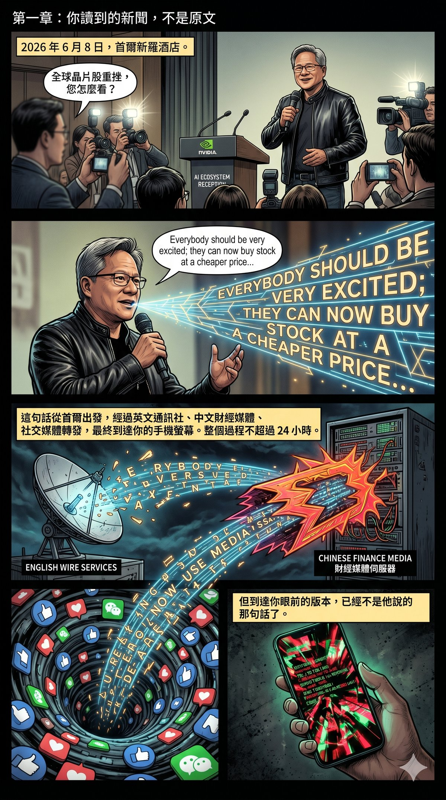
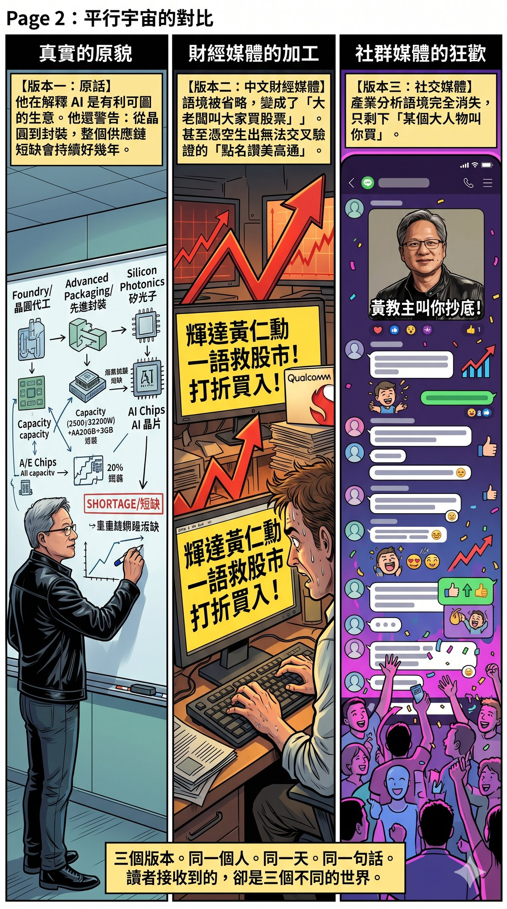
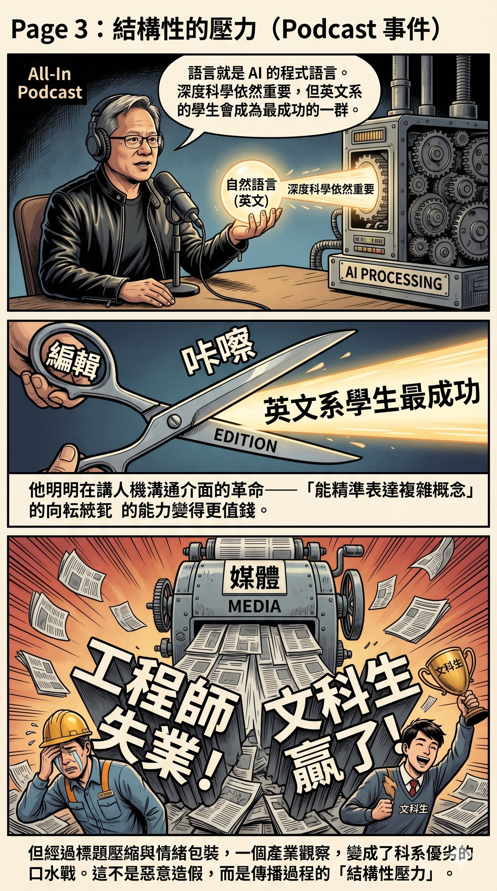

# Part I: Metamorphosis — How Narratives Are Forged

Information distorts in transmission — this is not a phenomenon unique to any era, but a structural feature of human communication. Yet "structural" does not mean "innocent" — behind every layer of distortion lies an economic motive.

This part demonstrates the same thing at two different scales. Chapter 1 is a twenty-four-hour distortion: how a single sentence becomes unrecognisable within a single day. Chapter 2 is a twenty-five-year distortion: how a piece of history is locked out of mainstream view by advertising budgets.

Different scales, same mechanism.

---

# Chapter 1: The News You Read Is Not the Original

## A Simple Experiment

On 8 June 2026, NVIDIA CEO Jensen Huang took questions from reporters after attending the "Korea AI Ecosystem Reception" at the Shilla Hotel in Seoul. A reporter asked about the global chip stock crash, and he responded with a single sentence.

That sentence departed Seoul, passed through an English wire service, Chinese-language financial media, and social media reposts, and ultimately arrived on your phone screen. The entire process took no more than 24 hours.

But the version that reached your eyes was no longer the sentence he had said.

## Three Versions of the Same Sentence

**Huang's original words** (Reuters on-site report):

> "Everybody should be very excited; they can now buy stock at a cheaper price, and it's absolutely true that the future of AI is very bright."

This was his response after a reporter specifically pressed him on the global chip stock crash. At the same event, he also said something that is rarely quoted: AI is a profitable business, all cloud companies are increasing their AI investment, and the market "doesn't understand this yet." His point was to explain, from an industry perspective, why he had confidence in AI infrastructure demand.

Over the same weekend, he also told the media present: the memory chip shortage will not end soon; the entire supply chain — from wafers to packaging to silicon photonics — is in a state of shortage, and this will continue for years.

**The Chinese-language financial media version:**

"NVIDIA's Jensen Huang saves the stock market with a single sentence" — the headline directly repackaged a press conference response as a market-rescue act. The body text translated "you can buy at a cheaper price" as "buy at a discount," omitted the context of the reporter's question, and read as though Huang had proactively held a press conference to tell everyone to buy stocks. The warning about supply chain shortages? No mention whatsoever.

The report also cited Huang as singling out Qualcomm for praise and telling people to "buy their stock." But this quote cannot be found in the on-site reports of Reuters, Bloomberg, Seoul Economic Daily, The Standard, or any other major English-language outlet. A quote that cannot be cross-verified is a red flag.

**The social media version:**

By the time it reached Facebook and discussion forums, the message was compressed yet again: "Huang told everyone to buy the dip," "Huang is selling Qualcomm stock for them." At this layer, the original industry-analysis context had vanished entirely, leaving only "some big shot told you to buy."

Three versions. The same person. The same day. The same sentence. But the message received by readers was completely different.

## This Is Not an Isolated Incident

This past March, Huang appeared on the All-In Podcast. A host asked him what young people should study. His original words were: "I still believe that deep science, deep mathematics are important. But language skills — language is the programming language of AI; it is the ultimate programme." Then he added: "The result may well be that English majors will be among the most successful."

The Chinese media headlines? "Liberal arts students win," "Engineers about to lose their jobs."

He was clearly talking about an interface revolution — the shift in human-machine communication from code to natural language, which makes "the ability to articulate complex concepts precisely in language" more valuable. In the very same passage, he also stressed that "deep science and deep mathematics remain important." But after headline compression and emotional packaging, an industry observation about the restructuring of capabilities became a mud-slinging fight over which college major is superior.

This kind of distortion is not deliberate fabrication. In most cases, it comes from the structural pressures of the transmission process itself: word-count limits demand simplification; headlines need emotional tension; the translation process loses context; editorial framing strengthens one aspect while weakening another. Each layer deviates only slightly, but after three or four layers, the distance between endpoint and origin is already large enough to change your judgement.

In fact, you do not need to look at the media level to see this phenomenon. At work, after a meeting, someone writes the meeting minutes — have you ever read them and thought, "That's not how the discussion went at all"? In the same meeting, the person writing the minutes heard different key points from you; their word choices, the parts they chose to record and the parts they omitted, already constitute one round of information distortion. And that is just one layer. A news report goes through three, four, five layers.

## I Am Not Asking You to Question Everything

I am not saying all news is fake, nor am I asking you to conduct a full verification of every report. That is neither realistic nor necessary.

But there is a very simple criterion: **If a piece of information will affect your decision — whether an investment decision, a professional judgement, or your fundamental understanding of something — it is worth spending ten minutes to find the original source.**

A CEO is reported to have said a certain thing, and you plan to adjust your investment strategy based on it — go find his original words and see what the context was.

A new technology is reported as a "disruptive breakthrough," and you plan to change career direction because of it — go look at the original paper or product launch and confirm what it actually achieved.

An industry trend is described as "about to collapse" or "going up forever" — go find the data source and see what the definitions and sampling ranges of those numbers are.

This is not a difficult action. Most important primary information — earnings reports, press conference transcripts, company announcements, academic papers — can now be found directly online. The hard part is not finding it, but realising that you need to find it.

## Including My Version

One last thing needs to be made clear: the analysis above of Huang's Seoul trip is itself a second-hand version. I cross-referenced Reuters, Bloomberg, Seoul Economic Daily, and other sources, but I was still not there in person; I am still working with filtered material.

So even the version I am presenting, you do not need to take at face value.

What matters is the habit itself: when something is important enough to you, go back to the source and take a look.

Not because the media is lying to you. But because every layer of transmission changes the shape. And the person who ultimately makes the decision is you.

---

_The distortion of a single sentence takes twenty-four hours. The distortion of a piece of history can last twenty-five years — as long as someone keeps paying the advertising bill for the "correct" version. The history that follows has never been told in full by mainstream gaming media in twenty-five years._