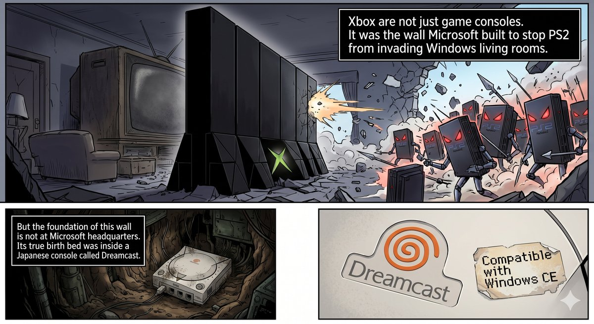
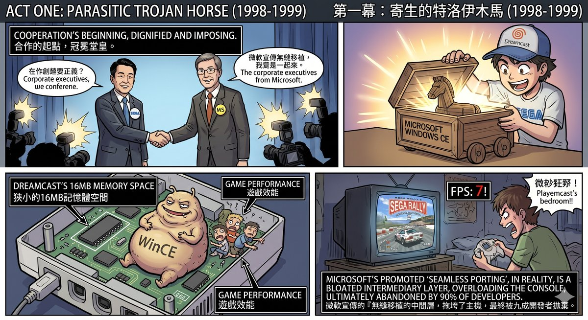
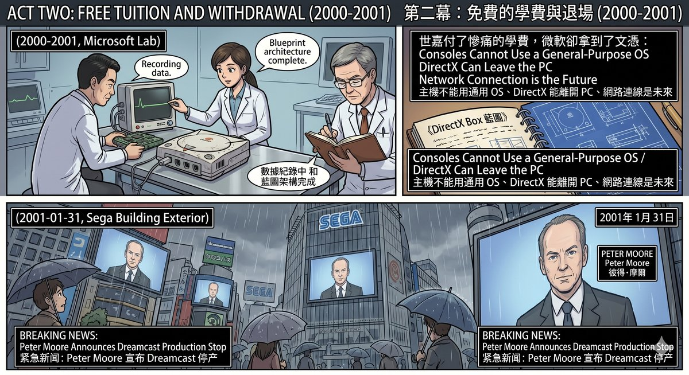
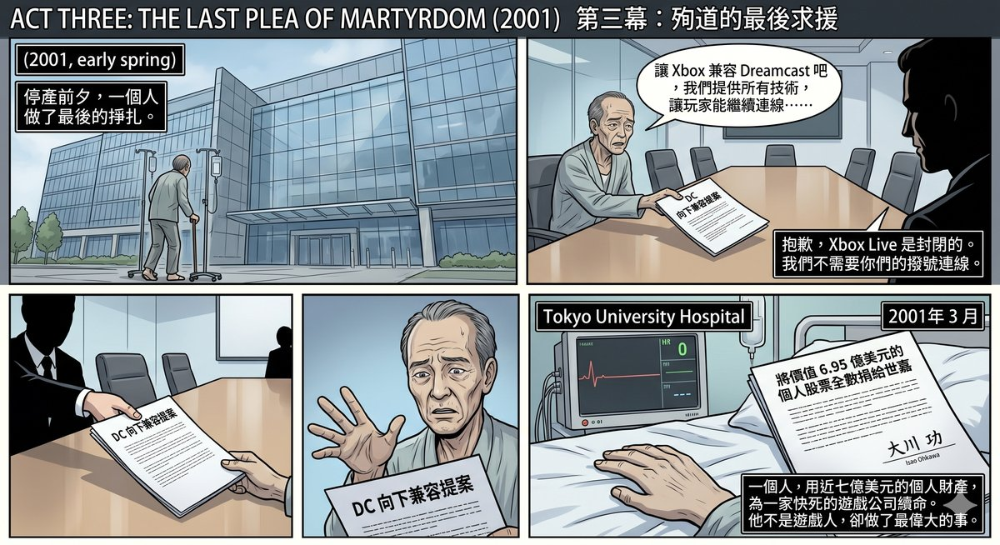
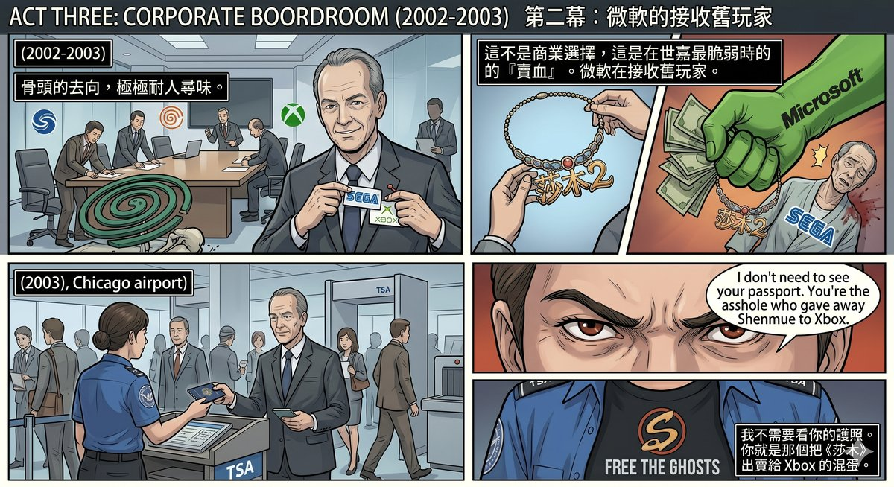
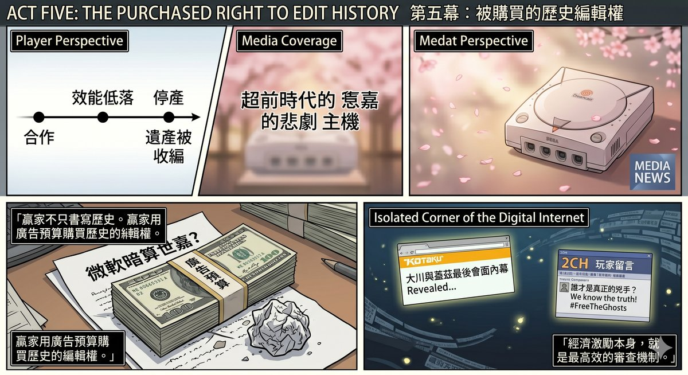
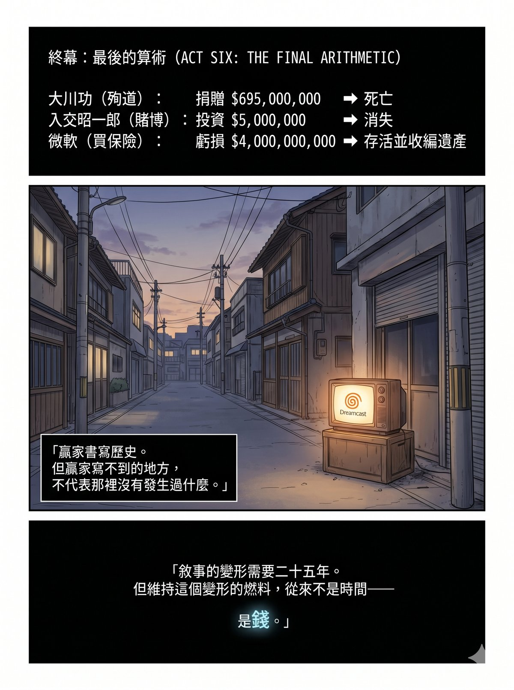

# Chapter 2: Game Over — The Cross-Border Entanglement of Microsoft and Sega

**— How Winners Purchase the Editing Rights to History**

---

Chapter 3 of *Game Over* told the story of the Xbox's birth. The conclusion was: Xbox was never a gaming console; it was a wall — one Microsoft built to block PlayStation 2 from invading the Windows living room.

But Chapter 3 deliberately skirted a piece of history.

Xbox's true delivery room was not in Redmond. It was inside a Japanese console called the Dreamcast.

This history has almost never been reported in full by mainstream media. The reason is simple: winners write history. After 2001, gaming media's advertising revenue came from Sony, Microsoft, and Nintendo — the three surviving platform holders. Sega had exited the stage, and its story exited with it. Whenever anyone mentions Dreamcast, the angle is always "a tragic hero ahead of its time," never "a partner whose bones were picked clean by an ally."

This chapter fills in that missing thread. Every fact has been verified and sourced.

---

## The Starting Point of the Partnership

On 21 May 1998, Microsoft issued a press release with a grandiose headline: "Microsoft, Sega Collaborate on Dreamcast: The Ultimate Home Video Game System."

The deal was this: Microsoft would provide Sega's new console, the Dreamcast, with a version of Windows CE optimised for consoles, integrating the DirectX graphics interface. Sega's selling point was that PC game developers could use the Win32 and DirectX APIs they were already familiar with to develop directly for the DC, drastically lowering porting costs.

For Sega, the deal looked reasonable. The most painful lesson of the Saturn era was that its bizarre dual-CPU architecture had scared away third-party developers. For the DC to survive, it needed a large volume of games. If they could bring the entire PC developer ecosystem in at once, wouldn't that solve everything in a single move?

Microsoft had its own calculations. In 1998, Microsoft had no plans to make a console — the Xbox team would not take shape internally until 1999. But Microsoft desperately wanted one thing: **to extend DirectX's reach from the PC desktop to the box underneath the television.** Sega coming to them voluntarily was, in effect, a free proof-of-concept for the living-room market at Microsoft's expense of nothing.

The contract was signed. The SDK began shipping to licensed developers by the end of 1998. The DC's console casing bore a line of text: "Compatible with Windows CE."

But the word "Compatible" concealed a fact that most players overlooked.

---

## A Parasitic Operating System

Windows CE was not the Dreamcast's native operating system.

The DC had its own BIOS and a natively developed SDK created by Sega (the Katana SDK). Windows CE was an option — developers could choose to use it or not. If they chose WinCE, the entire operating system would be burned onto the game disc. Every time the console booted, the DC would first load WinCE from the disc, and only then run the game.

This architectural design directly produced three problems.

**First, memory was consumed.** The DC had only 16 MB of main memory in total. After WinCE loaded, the space remaining for the game was drastically reduced. Games using the Katana SDK could communicate directly with the hardware, spending every byte where it counted; games using WinCE permanently carried the overhead of an operating system layer on top of them.

**Second, load times increased.** The disc had to read the entire WinCE image on every boot before entering the game. For players, this meant longer waits.

**Third, the frame rate was unstable.** This was the most lethal problem. The core promise of a game console is smooth performance — Sega, with its arcade heritage, understood this better than anyone. But WinCE's middleware layer prevented the GPU from being fully utilised.

The most famous victim was *Sega Rally 2*. This game was the top-selling launch title in Japan for the DC, selling 290,000 copies. It was developed using WinCE. The result: a frame rate half that of the arcade version, with stuttering so severe that players needed to enter a cheat code to lock the game at 30 fps just to make it barely playable. The Wikipedia entry still reads to this day: "The Dreamcast version, ported using Windows CE, has a frame rate half that of the arcade version."

This was not an isolated case. The vast majority of experienced developers — including Capcom's *Biohazard: Code Veronica* — abandoned WinCE outright and reverted to Sega's own Katana SDK.

The final numbers tell the whole story: **The DC's global game library comprised over 600 titles, of which only about 50 were developed using WinCE. Less than 10%.**

The "seamless porting of PC games to the living room" that Microsoft had promoted with massive PR resources was, in reality, a bloated middleware layer that dragged down the console's performance and was then abandoned by ninety percent of developers.

---

## What Microsoft Learned

The failure of WinCE on the DC was a losing proposition for Sega. But for Microsoft, it was a free education.

**Lesson One: A console cannot run a general-purpose OS.** The disaster of WinCE on the DC made Microsoft understand once and for all — cramming a system designed for PDAs and embedded devices into a game console does not work. A console needs bare-metal performance, not software compatibility. So when the Xbox arrived, Microsoft did not use WinCE again — it used a stripped-down kernel of Windows 2000, redesigned from the ground up for gaming.

**Lesson Two: DirectX can leave the PC.** Although WinCE failed, the DirectX API itself could run on the DC. Microsoft obtained first-hand data: how Direct3D behaved on non-PC hardware, where the performance bottlenecks were, and the real feedback from developers. This data was fed directly into the Xbox design process. The Xbox's full name — DirectX Box — was not a coincidence. It was the next-generation product of that experiment on the DC.

**Lesson Three: Online connectivity is the future.** The DC was the first console in history to ship with a built-in modem and to push online connectivity from day one. SegaNet let players compete online as early as 1999. Microsoft saw the potential of this concept and brought it to full fruition two years later with Xbox Live — the difference being that Xbox Live required broadband and was designed from day one as a closed, paid ecosystem.

The DC was Microsoft's testing ground. Sega paid the tuition. Microsoft took the diploma.

---

## The Last Plea

On 31 January 2001, Sega announced the Dreamcast would be discontinued.

But before that announcement, one man made a final stand.

Isao Okawa. Chairman of Sega. He was not from the gaming industry — he was the founder of CSK Holdings, a Japanese information-services conglomerate. CSK had held a majority stake in Sega since 1984, making Okawa Sega's de facto controller.

On the eve of the DC's discontinuation, Okawa made multiple personal visits to Microsoft, meeting directly with Bill Gates.

His proposal was: **make the soon-to-launch Xbox backward compatible with Dreamcast games.** Sega was willing to provide all necessary technical assets. His goal was straightforward — to give the DC's player base a migration path, to let the Dreamcast continue in some form.

Former Microsoft executive Sam Furukawa later confirmed this on Twitter: "Before Mr. Okawa passed away, he visited Gates several times, to see if it would be possible to add Dreamcast compatibility into the Xbox."

The negotiations fell apart.

According to Furukawa, the breakdown was over the DC games' online connectivity. Okawa insisted that DC games running on the Xbox must retain their online capability — this was one of the Dreamcast's most core selling points. Microsoft refused. Xbox Live was a closed broadband service, and Microsoft was unwilling to let DC dial-up games run on its platform.

No deal. Okawa returned to Tokyo in disappointment.

On 16 March 2001, Isao Okawa died of heart failure at the University of Tokyo Hospital. He was 74.

Before his death, he did one thing: he donated all his shares in Sega and CSK — worth approximately $695 million — to Sega, and forgave all debts that Sega owed him. A single man used nearly $700 million of his personal wealth to keep a dying game company alive.

Okawa was not a gaming man. But what he did for a gaming company surpassed what most gaming CEOs accomplish in a lifetime.

---

## Where the Bones Went

After Sega fell, its bones were redistributed. And the direction of redistribution was deeply telling.

Peter Moore — President and COO of Sega of America — was the man who personally announced the DC's discontinuation. He himself later acknowledged this.

Moore's career path is clear: August 1999, he replaced Bernie Stolar and led the DC's North American launch. May 2000, he was promoted to President of Sega of America. Then, after the DC was discontinued and Sega transitioned to a pure software company — **in January 2003, Peter Moore joined Microsoft, becoming a core executive in the Xbox division.**

What he took with him was not just a résumé. He brought all of Sega's North American market contacts, distribution channels, and developer relationships. The work he later oversaw at Microsoft included global game development, studio management, and third-party publisher relations — all capabilities he had built at Sega.

But talent was only the first layer.

The second layer was IP. After Sega's transition, its internal development team Smilebit (formerly AM6) pivoted almost entirely to developing games for the Xbox — *Jet Set Radio Future*, *Panzer Dragoon Orta*, *GunValkyrie*, all Xbox exclusives. *Crazy Taxi 3* as well. These can at least be explained as normal business decisions: Sega was no longer making hardware; the development teams needed to choose a platform; the Xbox's architecture was closest to the PC, making porting costs the lowest.

But *Shenmue II* was a different story.

The North American publishing history of *Shenmue II* is the most naked link in the entire "asset absorption" chain.

In 2001, *Shenmue II* was released on the Dreamcast in Japan and Europe. The game was finished. The English localisation was complete. North American DC players were waiting for a release date.

Then Microsoft intervened. It signed a deal with Sega, purchasing the exclusive North American console rights to *Shenmue II*. Sega of America subsequently announced the cancellation of the North American Dreamcast release.

A game that was already fully developed and already on sale in other regions had its distribution channel cut off at the final step. North American DC players who wanted to play the English version of *Shenmue II* had only one option — buy an Xbox.

Microsoft even included a story-recap DVD of *Shenmue I* in the Xbox edition. **This was not serving new players. This was receiving old players.** The entire product design logic was: You are a Sega loyalist? Good. Your migration path is here. The destination is Xbox.

This was not Sega "voluntarily giving its games to Xbox." This was Microsoft, at Sega's most financially vulnerable moment, using capital to yank a completed work from its original platform and turn it into a weapon for seizing market share. Sega was not making a business choice — Sega was selling blood.

At Chicago's O'Hare Airport, a TSA security officer recognised Peter Moore — the man who had personally announced the DC's discontinuation and later defected to Microsoft. Moore himself recounted the incident in an interview:

"I don't need to see your passport. You're the asshole that gave away Shenmue to Xbox."

That security officer said what every DC player in North America wanted to say.

(It was not until 2018 that Sega released *Shenmue I & II* as an HD remaster on modern platforms including PS4, PC, and Xbox One. North American DC players waited seventeen years.)

---

## The Players' Fury

Post-hoc fact-checking can tell you that the ranking of Sega's causes of death is: self-inflicted hardware fragmentation first, Sony's market tactics second, and the PS2's installed base crushing the last exit third. Microsoft's WinCE does not rank in the top three — ninety percent of developers bypassed it, the truly great games on the DC all used the Katana SDK, and WinCE caused localised damage, not a systemically fatal wound.

But in 2001, the players did not know any of this.

All they had was a timeline. And that timeline, no matter how you looked at it, yielded only one interpretation.

1998 — Microsoft loudly announces a partnership with Sega; the console casing reads "Compatible with Windows CE." Players believe Sega has found a powerful ally.

1999 to 2000 — Reports of poor performance in WinCE games begin circulating in player communities. But the DC's game quality is exceptionally high overall, and most people do not dig into the cause.

January 2001 — The DC is discontinued.

March 2001 — Isao Okawa dies.

November 2001 — The Xbox launches. A living-room console running on DirectX. Conceptually almost identical to "cramming WinCE + DirectX into the DC." **The DC's body is not yet cold, and the Xbox is already going on sale standing on its grave.**

2002 — The North American release of *Shenmue II* is intercepted by Microsoft. Japanese and European DC players have already played it; North American players are told: Want to play? Buy an Xbox. Around the same time, *Panzer Dragoon Orta*, *JSRF*, and others debut as Xbox exclusives. Sega's legacy is carried away piece by piece into Microsoft's new house.

January 2003 — Peter Moore defects to Microsoft.

Cooperation. Learning. Abandonment. Replacement. Absorption of legacy. **When you line them up, it is emotionally impossible not to conclude: "They were betrayed."**

Even if today you can prove with facts that every step had its own independent justification — WinCE's failure was a technology mismatch; the DC's discontinuation was financial collapse; Moore's defection was a personal career choice; the IP exclusivity was the result of commercial negotiation — these explanations hold up rationally. But when you are a player who spent ¥30,000 on a DC, bought *Shenmue*, and spent a hundred hours walking every street of Yokosuka, what you see is not "independent justifications." What you see is a premeditated operation.

**And what is even more suffocating is that almost no mainstream media outlet has articulated this for you.**

After 2001, the gaming media ecosystem had been reshaped by the three surviving platform holders. Microsoft, Sony, Nintendo — their advertising budgets sustained the entire gaming media industry. Exclusive early-review access, invitations to first-play events for new consoles, VIP passes to E3 exhibition halls — these were all chips that only advertising clients could obtain. After Sega exited the stage and stopped placing ads, its perspective naturally disappeared from the coverage.

The media was not unaware of this history. They chose a safer narrative angle: "The Dreamcast was a tragic console ahead of its time." This version has no villains, only bad luck. It reads with a faint air of nostalgia and does not offend any company still buying ad space.

As for the version in which "Microsoft used Sega's body as a training dummy, opened its own dojo after finishing, and then absorbed Sega's legacy"? Too sharp. Write it, and Microsoft's PR department calls. The next time there is an exclusive early review, you might not be on the list.

So winners do not merely write history. **Winners use advertising budgets to purchase the editing rights to history.** There is no need to delete a single fact — just ensure those facts remain forever in forum posts and personal blogs, never making it into the pages of mainstream reporting.

In 2010, Sam Furukawa posted that Twitter message about Okawa's negotiations with Gates. Kotaku ran a story. And then? Nothing. No follow-up investigation, no long-form feature, no mainstream gaming outlet pulling this thread out in full. One tweet, one short article, then it sinks to the bottom of the internet, and fifteen years later only forum reposts remain.

Those DC players who wrote eulogies on 2ch, the American players who raged at Peter Moore on GameFAQs, the console fans on Hong Kong forums who took up Sega's cause — their fury was real, and their judgement was directionally accurate. They simply lacked a platform that could string the entire thread together and present it with facts rather than emotion.

What this chapter attempts to do is precisely that.

---

## Not a Conspiracy Theory — But Not a Clean Record Either

The boundaries need to be drawn clearly.

Did Microsoft "deliberately use Windows CE to sabotage Sega"? **No.** WinCE was a lightweight OS designed for PDAs and embedded devices; its architecture was fundamentally unsuitable for game consoles. Microsoft's engineers did assist DC developers in optimising performance — official technical documents remain in the MSDN archives to this day. They were not poisoning the well; they simply brought the wrong tool.

But "not a conspiracy" and "not predation" are two different things.

Microsoft completed a full proof-of-concept for a living-room console at minimal cost. It learned how DirectX behaved on non-PC hardware, the operational logic of console supply chains, and the demand framework for online gaming. Then it used that knowledge to build the Xbox. Then it rejected Okawa's compatibility request. Then it poached Sega's president. Then it turned Sega's classic IPs into its own exclusive weapons.

Every step was legal. Every step was rational. Every step added together forms a complete value-extraction chain — **extracting maximum value at minimum cost from a dying partner.**

And using advertising budgets after the fact to ensure this version does not become the mainstream narrative — that is not a conspiracy. **That is structure.** The business model of gaming media dictates that it can only write the stories of survivors. No one needs to pick up the phone and apply pressure; economic incentives are themselves the most efficient censorship mechanism.

---

## Why *Game Over* Did Not Include This Chapter

Two reasons.

First, the scarcity of sources. The details of Okawa's negotiations with Gates are, to this day, attested only by Sam Furukawa's tweets and Kotaku's report. There are no contract documents, no meeting minutes, no official statements from either side. Under the writing discipline of *Game Over*, every argument must be supported by verifiable facts — and the core details of this history rest on a single source. Placed in the main text, it would not withstand the book's evidentiary standard.

Second, structural priority. Chapter 3's argument is "The Xbox is a defensive weapon"; Chapter 4's argument is "Sega's goodwill birthed NVIDIA's monopoly." If the Microsoft–Sega WinCE entanglement were inserted into Chapter 3, it would pull the reader's attention from "defensive logic" toward "cross-border predation" — a real and important story, but not the argument Chapter 3 was built to deliver.

So I left it outside the book.

But it deserves to be remembered.

---

## The Final Arithmetic

Isao Okawa donated $695 million to Sega.

Akira Iritani, discussed in Chapter 4 of *Game Over*, invested $5 million in NVIDIA.

Microsoft lost $4 billion on the first-generation Xbox.

Three accounts, three natures. Okawa's was martyrdom. Iritani's was a bet on character. Microsoft's was an insurance purchase.

The martyr died. The one who bet on character disappeared. The one who bought insurance survived — and pocketed the insured party's legacy.

If you are a reader of *Game Over*, you have already seen eight variations of this pattern across eleven chapters. This chapter is the ninth. The only difference is that this time, it happened beyond the book's borders — in a history that the winner does not wish to write, that the media finds inconvenient to report, and that the players can only piece together for themselves in forum threads.

Cooperation. Learning. Abandonment. Replacement. Absorption of legacy. Then using advertising budgets to lock this version out of mainstream view.

Winners write history. But the places where winners cannot write do not mean nothing happened there. There was a console called the Dreamcast. There was an old man named Isao Okawa. There is a group of players who, to this day, still remember every street in Yokosuka.

Their fury does not need a conspiracy theory to sustain it. The facts alone are enough.

---

_The distortion of a narrative takes twenty-five years. But the fuel that maintains that distortion was never time — it was money. Where the money comes from, who pays the bill — the next part takes it apart for you._