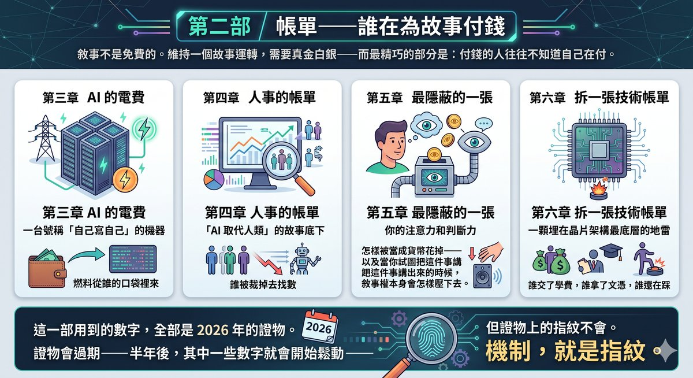
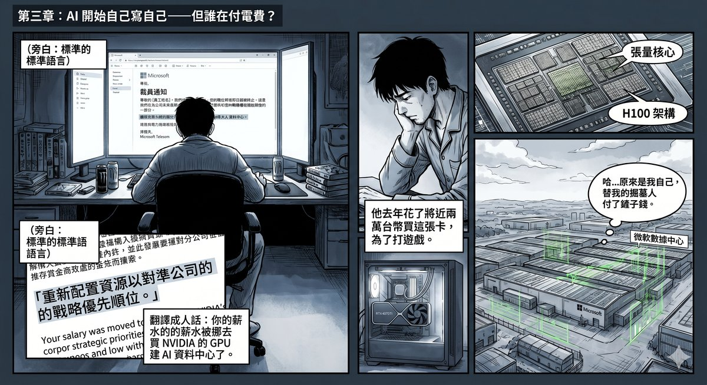
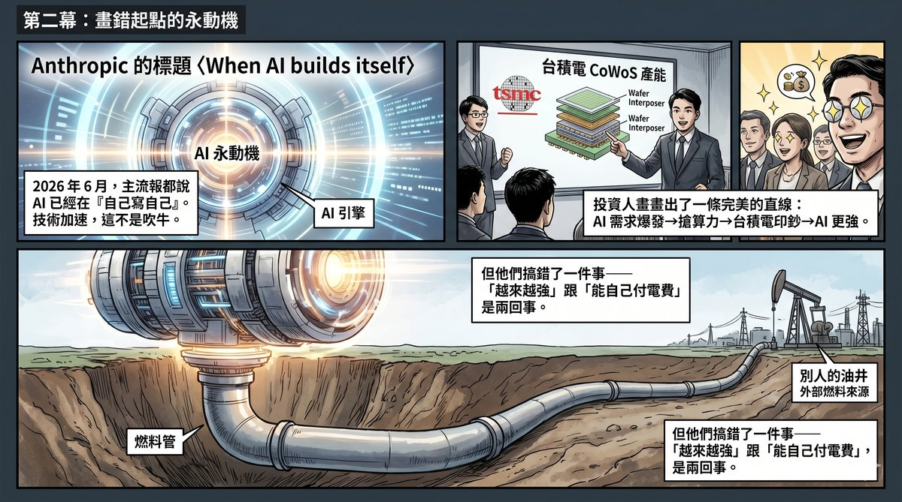
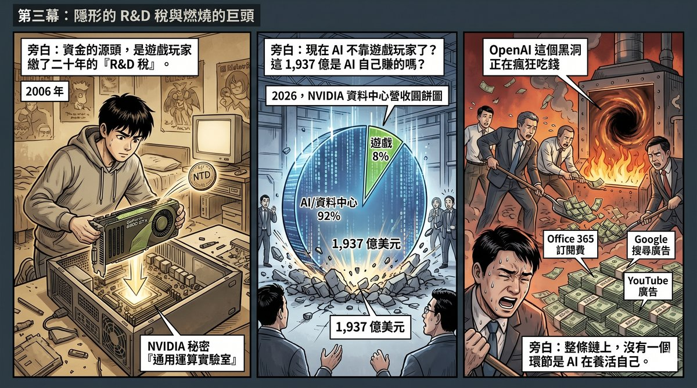
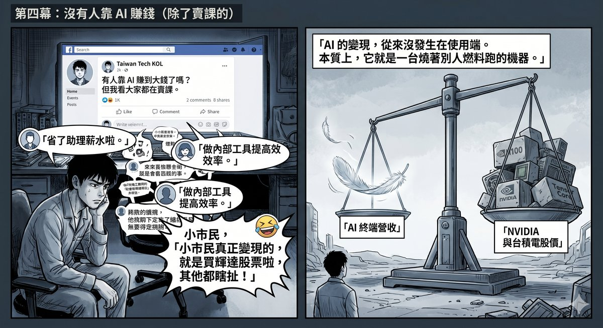
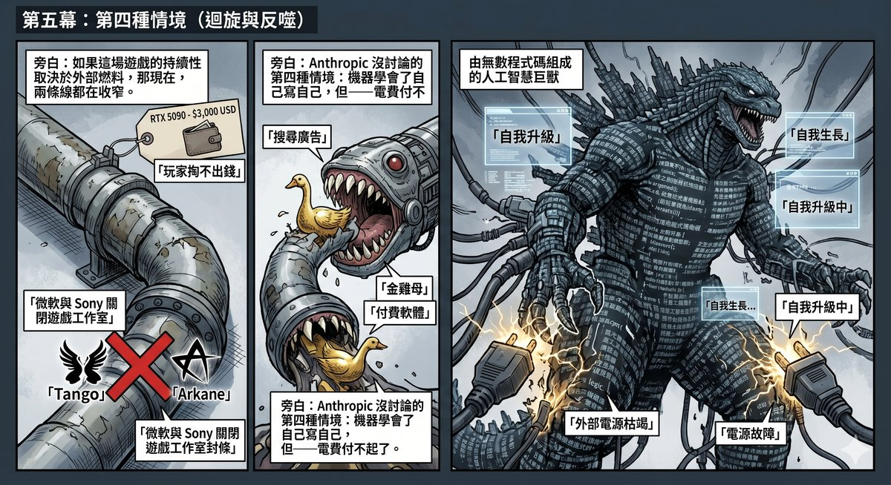
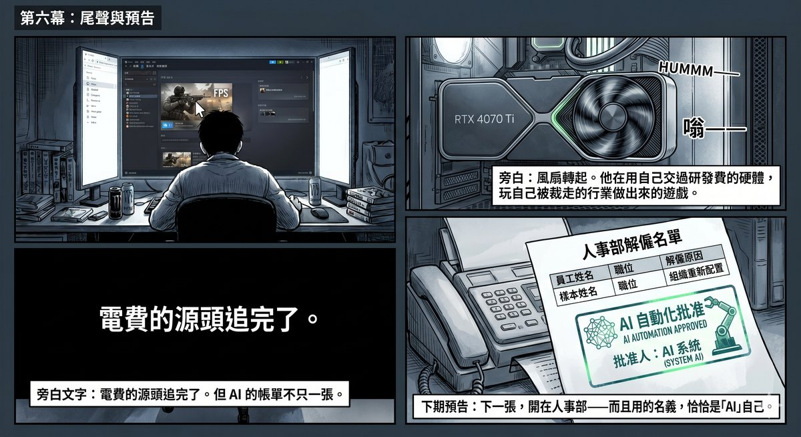

# Part II: The Bill — Who Is Paying for the Story

Narratives are not free. Keeping a story running takes real money — and the most ingenious part is: those who pay often do not know they are paying.

This part traces four bills. Chapter 3 traces AI's electricity bill: the machine that claims to "write itself" — whose pockets does the fuel come from? Chapter 4 traces the human-resources bill: beneath the story of "AI replacing humans," who gets laid off to make the numbers work? Chapter 5 traces the most concealed bill of all: how your attention and judgement are spent as currency — and when you try to speak up about it, how the narrative rights themselves press it back down. Chapter 6 dismantles a technical bill: a landmine buried at the deepest layer of chip architecture — who paid the tuition, who took the diploma, and who is still stepping on it.

The figures used in this part are all 2026 evidence. The evidence will expire — in six months, some of these numbers will start to loosen — but the fingerprints on the evidence will not. The mechanism is the fingerprint.

---

# Chapter 3: AI Begins Writing Itself — But Who Is Paying the Power Bill?

In the spring of 2026, a twenty-six-year-old game engineer was laid off.

The studio he worked at was owned by Microsoft, making first-person shooters. The layoff letter's wording was standard: "Realigning resources to match the company's strategic priorities." Translated into plain language: your salary was redirected to buy NVIDIA GPUs for building AI data centres.

He went home, opened Steam, and glanced at his PC. Inside the chassis sat an RTX 4070 Ti — purchased last year for close to NT$20,000. He knew the card contained Tensor Cores, hardware NVIDIA had designed for AI computation. He had no use for them. He bought the card to play games.

But a portion of the money he paid had subsidised NVIDIA's R&D costs for AI computation hardware. And NVIDIA used the fruits of that R&D to produce the H100, which it sold to Microsoft. Microsoft used H100s to build AI data centres. Then Microsoft laid him off, because the AI data centre was more "strategically prioritised" than his studio.

**He subsidised the R&D of his own gravedigger.**

This is not a sob story. It is a causal chain. And this causal chain is precisely the one that every mainstream AI report gets wrong.

---

## A Straight Line Drawn from the Wrong Starting Point

In June 2026, Anthropic published an article titled "When AI builds itself." The numbers were startling: as of May, over 80% of the code Anthropic merged into its products was written by Claude; the same engineer's quarterly output was eight times what it was in 2024; the length of tasks AI could reliably complete was doubling every four months.

These numbers are not bluster. AI really is writing itself. Even with human oversight on review and direction-setting, the boundary of AI's technical capability is expanding at an unprecedented pace — this is a fact, and denying it will only cost you your capacity for judgement.

Taiwan's tech circles were excited. Some wrote analyses concluding that Taiwan was the beneficiary: if AI truly enters recursive self-improvement, compute is the only bottleneck, and the bottleneck on compute is TSMC's CoWoS — Taiwan's chips would be amplified in value.

This judgement is not wrong in itself. But like all mainstream coverage, it makes a leap at one point — **equating the acceleration of technical capability with the closure of the commercial loop.**

AI is getting stronger — no question. But "getting stronger" and "being able to pay its own electricity bill" are two different things. An engine can spin faster and faster, but if the petrol comes from someone else's tank, no amount of RPM changes one fact — it does not have its own oil well.

Open any AI investment report, and the logic is the same straight line: AI demand explodes → companies scramble for compute → NVIDIA sells cards → TSMC prints money → more compute → AI gets stronger → demand grows further. A self-reinforcing cycle. A perpetual motion machine. Technology is accelerating, so the funding chain will automatically close.

If that "so" holds, AI development can be sustained indefinitely. Investors can rest easy.

**That "so" is wrong.**

---

## The Real Source of Funding

In 2006, NVIDIA released the GeForce 8800 GTX. Gamers saw a leap in visual quality. What they did not see: the card's streaming processors had been redesigned — they could now compute not just pixels, but anything. Seven months later, NVIDIA launched CUDA Toolkit 1.0. No gamer noticed. But part of the $599 they paid was used to subsidise the R&D cost of general-purpose compute cores.

In Chapter 7 of *Game Over*, I called this mechanism the **"R&D Tax"** — gamers, without their knowledge, paid ten years of parallel-computing R&D costs for NVIDIA, until 2012, when AlexNet used two gaming GPUs to ignite the deep learning revolution.

Chapter 8 traced another thread on the hardware side: gaming GPU large-die orders forced TSMC to push large-die yields to the limit; once yields matured, the same production lines were repurposed to produce AI chips. Long-term console SoC orders filled off-season capacity, providing stable cash flow for investment in the next-generation node.

**CUDA's software ecosystem, TSMC's large-die processes, and wafer fab utilisation rates — all of it was paved with gamers' money up front, with AI moving in behind them.**

Some might say: that is ancient history. NVIDIA in 2026 has data centre revenue of $193.7 billion; gaming is down to $16 billion, less than eight percent. AI no longer needs gaming.

Really? Did AI earn that $193.7 billion itself?

---

## AI Has Not Yet Paid Its Own Way

Trace where that $193.7 billion goes. Who are NVIDIA's data centre customers? Microsoft, Google, Meta, Amazon, and the tech companies and sovereign wealth funds behind them.

Where does their money come from?

In 2026, OpenAI is projected to lose $14 billion, on revenue of approximately $13 billion — **for every dollar earned, more than two are spent.** Cumulative losses are expected to swell to $44 billion before profitability is reached. The money it uses to buy GPUs comes primarily from Microsoft's investment and Azure compute credits.

What about Microsoft? Capital expenditure in 2026 is projected to reach $190 billion. This money is not earned back by AI products — it is Office 365 subscription fees, Windows licence fees, and LinkedIn advertising revenue paying AI's bill.

What about Google? Capital expenditure in 2025 jumped from $29 billion to $75 billion. Where does the money come from? Search ads. YouTube ads. Google Cloud enterprise subscriptions. Not Gemini's profits.

**At no link in the entire chain is AI paying its own way.**

This is not just a matter of financial statements. Pull the perspective back from Silicon Valley to Taiwan, open any tech-community discussion thread, and ask the simplest question: **Do you know anyone around you who has actually made money from AI?**

In June 2026, a Taiwanese tech KOL posted a single line on Facebook: "So far, 90% of the people I've seen actually monetise AI are doing it by selling courses." Beneath it, dozens of replies were variations of the same answer — someone said they saved two assistants' salaries, someone said they improved back-office efficiency, someone said they built an internal tool so colleagues would stop asking the same questions. Saving time, cutting costs, boosting efficiency. But when pressed with "Does that count as monetisation?", even the original poster shook his head: "Improving efficiency — I don't think that counts as monetisation."

The most cutting comment was a single sentence: **"The only way ordinary people are actually making money from AI is by buying NVIDIA and TSMC stock. Everything else is bullshit."**

This sentence unwittingly articulated the entire structure: AI's "monetisation" is not happening on the user side — it is not end-users creating new revenue models with AI. It is happening on AI's **supply-chain side** — NVIDIA's and TSMC's stock prices. And what is the foundation of those stock prices? Twenty years of gamers' R&D tax, plus capital expenditure piled up from the non-AI business profits of tech giants.

Macro level: OpenAI spends more than two dollars for every dollar it earns. Micro level: Taiwan's own tech circles are asking, "Other than selling courses, who is actually making money from AI?" Evidence at two scales points to the same conclusion.

The funding source has shifted from gamers to Office subscriptions and search ads, but the essence has not changed: **AI is a machine running on someone else's fuel. It has never been a perpetual motion machine.**

---

## Get the Causality Wrong, and Every Judgement Is Wrong

This is the real core of the problem. Not "gamers have it rough" — that is an emotional judgement. The problem is:

**If you reverse the causality, your assessment of "how long this AI arms race can last" will be built on a false premise.**

The mainstream narrative says: AI demand → funding → development → more demand. Loop closed. Sustainable.

The real logic is: gamers' R&D tax (historical stock) + tech giants' non-AI business profits (current-period subsidy) → AI development. **The loop has not closed.**

If the loop has not closed, the sustainability of this game depends on two external conditions — and both conditions are narrowing.

**First, the gaming side.** The RTX 5090's MSRP jumped from the previous generation's $1,599 to $1,999, with street prices consistently above $3,000. Gamers' wallets are not infinite. Meanwhile, Microsoft and Sony are dismantling the very stress-testing ground that is gaming — shutting down Tango Gameworks, Arkane Austin, Japan Studio, Bluepoint, and redirecting resources to AI and live-service games. The conclusion from Chapter 10 of *Game Over*: the owners of the stress-testing ground are tearing up their own foundations with their own hands.

**Second, the cross-subsidy side.** If AI's commercial returns keep failing to materialise, and the tech giants' non-AI businesses start being eroded by AI itself — search ads siphoned off by AI Q&A, Office replaced by free AI tools — then the source of the cross-subsidy will dry up too. AI is eroding not only other people's businesses but also the very businesses that sustain it.

Both lines are narrowing simultaneously.

---

## The Fourth Scenario Anthropic Did Not Discuss

Anthropic's article depicted three futures: AI improvement decelerates, AI improves steadily, AI enters full recursive self-improvement. Analysts in Taiwan pointed to the compute leverage. These discussions all have value.

But they all skipped a more fundamental question: **Who is paying the electricity bill for this machine that "writes itself"?**

If the answer is "AI itself," then recursive self-improvement can be sustained. All three scenarios deserve serious consideration.

If the answer is "gamers' R&D tax plus tech giants' non-AI business profits" — and both sources are narrowing — then you need to consider a fourth scenario that Anthropic's article did not discuss:

**The machine has learned to write itself. But it can no longer afford the electricity bill.**

Not because there is not enough compute. Not because TSMC's CoWoS is insufficient. But because the external fuels sustaining this machine — gamers' spending power, Office subscription fees, search advertising revenue — are simultaneously being hollowed out by the machine itself.

The causal chain is not a straight line. It is a spiral. And the direction of the spiral is reversing.

---

The next time you read an AI investment report that says "AI demand drives compute growth," cross out the words "AI demand." Replace them with "gamers' R&D tax plus Office subscription profits." Then re-read the report and see whether its conclusion still holds.

Most likely, it will not.

As for that twenty-six-year-old engineer — his RTX 4070 Ti is still slotted into his chassis. Every time he boots up and the fans spin, he is playing games made by the industry he was laid off from, on hardware whose R&D he helped fund.

---

_The power bill's source has been traced. But AI's bills are more than one. The next one is issued by the HR department — and the name on the invoice is, ironically, "AI" itself._