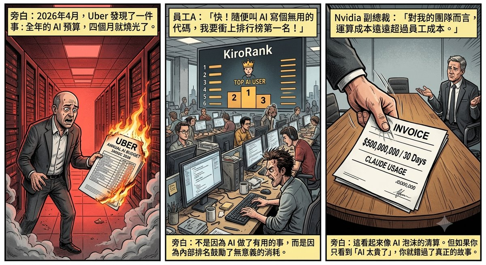
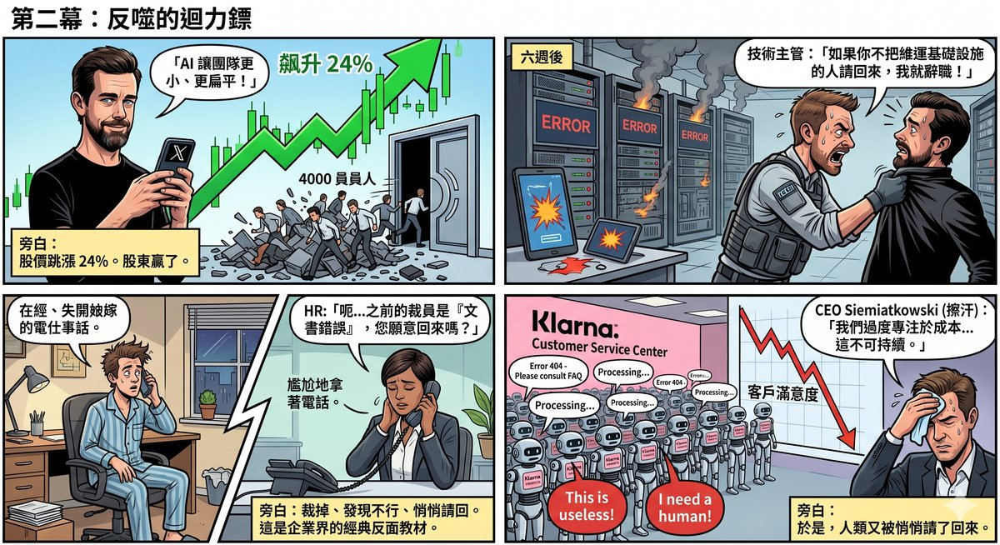
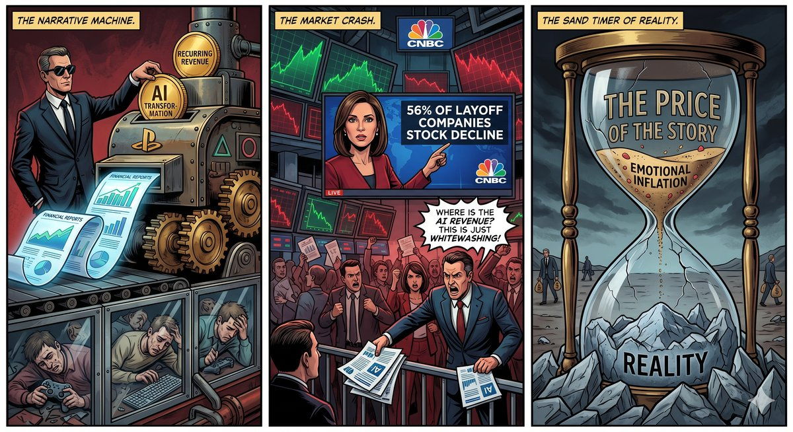

# Chapter 4: AI Narrative Economics — When "Replacement" Becomes a Business

## The Bill

In April 2026, Uber's CTO discovered something: the company's annual AI budget had been burned through in four months.

Not because AI had done too many useful things for the company. But because an internal leaderboard had been set up, ranking engineers by how much AI they consumed. The more you used, the higher you ranked. As for what the usage actually produced — nobody was measuring.

Uber's COO Andrew Macdonald later admitted on a podcast: he had no way to link Claude Code usage to features actually delivered to users. "That line doesn't exist yet," he said.

Around the same time, Amazon shut down an internal leaderboard called "KiroRank." The reason was the same — employees were using AI on tasks that had no need for AI, generating massive amounts of pointless consumption just to boost their rankings. Senior Vice President Dave Treadwell told employees something rather telling: "Please don't use AI just for the sake of using AI."

Microsoft, meanwhile, revoked Claude Code access for thousands of engineers, requiring them to switch to its own GitHub Copilot. The irony was that engineers clearly preferred Claude Code — but the cost was too high, and Microsoft could not exactly let its own employees publicly favour a competitor's product.

Then there was an even more extreme case. An AI consultant told Axios that one of his enterprise clients, having forgotten to set a usage cap, spent $500 million on Claude in a single month. Five hundred million, not for the full year — in thirty days.

And NVIDIA's VP of Applied Deep Learning, Bryan Catanzaro, put it most bluntly: "For my team, compute costs far exceed employee costs."

These stories erupted in concentrated fashion in May 2026, looking like a reckoning for the AI bubble. But if all you take away is "AI is too expensive," you are missing the real story.

Because during the same period, layoffs never stopped.

---

## The Other Side of the Bill

In the first half of 2026, tech industry layoffs exceeded 117,000 people. The pace far outstripped all of 2025, second only to 2023's "Year of Efficiency."

AI was the primary reason companies gave for layoffs — ranked number one for three consecutive months. But if you opened the data from outplacement firm Challenger, Gray & Christmas, AI ranked only fifth among actual causes, behind market conditions, corporate restructuring, business closures, and cost-cutting.

The gap between those two rankings is the core of the story.

Marc Andreessen put it bluntly on the 20VC podcast: "Basically every large company is overstaffed. At least 25% overstaffed, many 50%, and I think quite a few 75%." Then he added: "And now they all have a universal excuse — oh, it's AI."

OpenAI's Sam Altman used a more precise term: AI washing. Meaning companies are repackaging layoffs they were already planning as AI-driven efficiency improvements. A Deutsche Bank analyst predicted at the start of the year: "AI redundancy-washing will be a defining feature of 2026."

Oxford Economics' conclusion was even more direct: companies "do not appear to be replacing employees with AI on a large scale."

So what is the real reason for the layoffs?

CloudBees CEO Anuj Kapur told Axios something that every corporate executive is unwilling to say publicly: layoffs may simply be "the only lever companies can pull" — not to improve efficiency, but to offset the AI bill.

Read that sentence once. Read it again.

People are not being replaced by AI. People are being laid off to pay AI's bill.

---

## The Retirement Plan

If you still think these are isolated corporate missteps, look at what Microsoft did.

In April 2026, Microsoft rolled out the first voluntary retirement plan in the company's fifty-one-year history. The target group was precise: employees whose age plus years of service totalled 70 or more, at or below the Senior Director level. Approximately 8,750 people were eligible — about 7% of the US workforce.

On the surface, this was a "generous retirement package." Employees could choose to leave of their own accord, preserving dignity, receiving compensation.

But structurally, it was a precision cost-cleansing. Those cleared out were not the worst performers, but the highest-cost employees — long tenure, high salaries, the thickest benefits packages. What they had in common was not a lack of ability, but being too expensive.

And voluntary retirement has a legally elegant feature: it does not count as a layoff. Under the US WARN Act, voluntary departures are not included in layoff totals; the company is not required to file public layoff documents or give 60 days' advance notice. The layoff headline reads "Microsoft Lays Off 8,000"; the retirement headline reads "Microsoft Offers Retirement to Senior Employees." Same thing, different packaging. Wall Street sees costs going down; the brand is spared damage.

The same company had already laid off more than 15,000 people over the previous year.

.jpg)

---

## Lay Off, Then Rehire

In February 2026, Block's founder Jack Dorsey announced the layoff of nearly half the company's workforce — 4,000 people, from over 10,000 down to fewer than 6,000. He posted directly on X, attributing the layoffs to AI, claiming that smaller, flatter teams working with AI tools "fundamentally changed what it means to run a company."

The stock price jumped 24% that day.

Six weeks later, a technical lead told his superior: if his team members were not brought back, he would resign. Because he was the only person responsible for maintaining the critical infrastructure that customers relied on.

The company brought people back. Then attributed some of the layoffs to "clerical and administrative errors."

At least four employees were rehired. A design engineer posted on LinkedIn that management told him he had been laid off due to a "clerical error." An HR employee said he was only rehired after his supervisor fought repeatedly on his behalf.

Dorsey later explained in a Fortune interview that he had run an internal simulation at the end of 2025: calculating "the minimum number of people needed to keep services running at one hundred percent." He admitted the calculation was wrong. But he simultaneously predicted that most companies would reach the same conclusion within a year.

From a stock-price perspective, laying off 4,000 people was a success — Block's market capitalisation rose from roughly $41 billion to $52 billion. From an operational perspective, they had to quietly bring people back.

Who won? Shareholders. Who lost? The people who were laid off.

---

## The Tombstone of Full Replacement

If you want a complete autopsy report on the "AI fully replaces humans" approach, Klarna is the best specimen.

Between 2023 and 2024, this Swedish "buy now, pay later" fintech company cut its staff from 5,500 to 3,400, froze hiring for over a year, and heavily promoted an AI chatbot, claiming it could do the work of 700 customer service agents. CEO Sebastian Siemiatkowski called his company OpenAI's "favourite guinea pig."

The financial statements looked beautiful. Efficiency up, costs down, investors excited.

Then customers started complaining.

The AI-generated responses were formulaic, lacking empathy, and unable to handle complex issues. Customer satisfaction declined steadily. By early 2025, an internal review showed the AI system could not handle the parts of customer service that genuinely required human judgement.

Siemiatkowski ultimately admitted: "We were overly focused on efficiency and cost. The result was a decline in quality, and that is unsustainable."

The company began rehiring human customer service agents. From full replacement, it shifted to a hybrid model in which AI handles simple queries and humans handle complex ones.

Klarna's story became the textbook cautionary tale of 2026's corporate world. Every executive considering replacing employees with AI was asked the same question: How does your plan avoid Klarna's fate?

---

## The Same Playbook

If you think the above is merely an AI-industry problem, you are underestimating how broadly this logic applies.

In 2022, PlayStation's then-CEO Jim Ryan announced a grand plan: launch 12 live-service games by 2025. The motivation was not hard to understand — Wall Street loves the "recurring revenue" story. A single-player game sells once and is done, but a live-service game can generate revenue continuously, making the earnings-report curve more attractive.

To chase this narrative, Sony forced multiple studios that specialised in single-player games to pivot to live-service development.

Bluepoint Games, a studio renowned for its exquisite remasters — the remakes of *Demon's Souls* and *Shadow of the Colossus* were industry benchmarks — was acquired and immediately assigned to develop a live-service *God of War* title. A team specialised in polished single-player remasters was shoved into an always-online multiplayer direction. This was not a pivot; it was a mismatch.

The result?

The *God of War* live-service game was cancelled in January 2025. Bluepoint was shut down in February 2026.

Firewalk Studios' *Concord*, developed over eight years with a budget in the hundreds of millions, was pulled from sale two weeks after launch due to dismal player numbers, and the studio was promptly shuttered.

London Studio, Neon Koi, Deviation Games — one after another, closed.

Of the 12 live-service game plan, by early 2026 only one had succeeded (*Helldivers 2*). Seven were cancelled before release, one was a catastrophic failure, and three were still struggling. A 91% failure rate. Over 1,500 employees lost their jobs because of this single strategic direction.

And Jim Ryan, the man who made the decision, had already left Sony.

What does this have to do with AI?

The logic is exactly the same.

AI version: Wall Street wants to hear the "AI transformation" story → companies use AI as a pretext for layoffs → stock price rises → the laid-off disappear.

PlayStation version: Wall Street wants to hear the "recurring revenue" story → Sony forces studios to pivot to live-service games → failure → studios shut down → the people who made great games disappear.

The common structure across both versions: decision-makers pursue not product quality or actual results, but the narrative Wall Street wants to hear. The narrative alters resource allocation; resource allocation kills people and teams that had real value. The decision-makers bear almost no consequences. The consequences are always borne by the execution layer.

---

## The Real Problem

At this point, a self-correction is necessary.

The analysis above may give the impression that corporations are bad, employees are good, and layoffs are all conspiracies. That is not what I am saying.

The reality is: modern corporations are indeed filled with vast amounts of meaningless work. Endless meetings, layers of reporting, processes that exist for the sake of process, KPIs manufactured for the sake of KPIs. These things occupy enormous human resources while producing no real value. What AI excels at is precisely simplifying these things — automating reports, compressing communication workflows, handling repetitive tasks.

A 2024 MIT study found that AI automation is economically viable for approximately 23% of job roles. For the remaining 77%, humans are still cheaper. This data tells you two things: AI is genuinely useful, but the narrative of "AI replaces everyone" dramatically overestimates its scope of applicability.

The real question is not whether AI is useful, but:

Who decides who gets laid off? When the axe falls, does it cut the processes and positions that genuinely lack value, or does it cut the most expensive people? Where do the laid-off go? Does society have any mechanism to absorb them?

The answer to the first question, you have already seen in Microsoft's retirement plan. Those cleared out are not the most useless, but the most expensive. Age plus years of service equals 70 — this is not a performance standard; it is a cost standard.

The answer to the second question: no one is seriously addressing it.

All discussions about AI and employment stay at the slogan level — "reskilling," "upskilling." But no one is doing the real arithmetic: a forty-five-year-old with fifteen years of experience who once earned $150,000 a year — after being laid off, where is his re-employment market? Go down, and salary expectations do not match. Go up, and the positions are already blocked. Start a business, and you need capital and runway. Retire — that is twenty years too early.

These people are not lacking in ability. They are experienced, possess judgement, but cost too much. Companies do not want them not because they cannot do the work, but because they are too expensive.

And if the middle layer is systematically compressed, the purchasing power of the lower tier will shrink along with it. Then who buys what companies produce?

This is the structural problem within the entire AI-layoff narrative that nobody is willing to face.

---

## The Mechanics of Narrative

At this point, we need to pull the lens back.

The narrative of AI layoffs is, in fact, a localised expression of a much larger set of mechanics: information itself is being stratified — those at the top have the best information for making the most accurate decisions; those at the bottom can only understand the world through free, algorithm-filtered fragments. How this mechanism forms and operates will be fully dismantled in the next chapter. The AI-layoff story is merely its latest extension.

When Dorsey announced the layoff of 4,000 people, Wall Street and tech media immediately followed: "The AI era has arrived; the efficiency revolution begins." This narrative propagated top-down, packaged as an irreversible trend. Employees at the bottom saw the news, developed anxiety, and rushed to buy AI courses — "If you don't learn AI, you'll be eliminated." Course sellers made money, and the anxiety continued to spread.

Then, six weeks later, Block quietly brought people back. The reach of this piece of news was one percent of the original layoff announcement.

This is narrative economics: those who manufacture stories need not take responsibility for their consequences. Layoff news drives stock prices up; rehiring news is buried in a corner. Anxiety marketing sells millions in courses, but no one tracks whether the people who took AI courses actually kept their jobs.

The reward mechanism of the entire system is distorted — it rewards the manufacturers of narrative, not those who bear the consequences of narrative.

And the position of ordinary people within this system is precisely what the next chapter will describe in full: you are not forbidden from accessing the truth; you are simply submerged in too many precision-engineered stories, to the point that even if the truth is placed right in front of you, you do not have the energy to distinguish it.

---

## The Half-Life of Narrative

But this narrative economics cracked in 2026 in a way worth recording.

CNBC ran a statistical analysis: filtering 23 S&P 500 companies that explicitly mentioned AI or implied accelerated AI adoption when announcing layoffs, then tracking their stock prices through 15 May 2026. The result: 56% of the companies did not rise but fell, with an average decline of about 25%. This was not anecdotal — from distribution-centre automation to AI customer-service systems to high-profile "AI-first" transformations, the stock prices of companies that laid off employees generally declined in the months following the announcement, with the steepest drops exceeding 50%.

Wait. Did we not just say that Block's stock price jumped 24% the day it announced 4,000 layoffs?

Both are true; they operate on different time scales. On the announcement day, the market buys the story — Block's 24% was the price of that story. A few months later, the market begins to audit — earnings come out, the money saved from layoffs has not turned into any new revenue, and the 56% of companies in CNBC's analysis are repriced. Gartner's research stamped this with a conclusion: layoffs free up budget space but cannot buy back business value — the return on investment for AI-driven layoffs approaches zero.

In other words: narratives have a half-life.

And the market is learning to tell the difference. That same May, Cisco laid off nearly 4,000 people, yet its stock price surged 13.4% in a single day — because it simultaneously raised its AI infrastructure order target from $5 billion to $9 billion. Investors were no longer rewarding the words "we are using AI," but rather AI-generated orders that could be written into earnings reports. Even venture capitalists began using "AI washing" to explain why they were not buying in. When the market can name a narrative, that narrative starts to fail.

Chapter 3 noted that the two fuels sustaining AI — gamers' spending power and tech giants' cross-subsidies — are both narrowing. Here is the third fuel: investors' trust in the "AI narrative" itself. It is likewise a consumable, has likewise been burning for three years, and is likewise running low.

But do not misread this as "the market will deliver justice." In the same Gartner study, there was another prediction: by 2028 or 2029, automated businesses will actually see net job creation — people laid off today will be rehired years later under new titles, "AI Coordinator," "Model Operations," only at salary grades that never return to the old level. The scene Block played out in six weeks — lay off, discover it does not work, quietly rehire — Gartner predicts the entire economy will replay over three years, and this time no one will admit it was a clerical error. Those who manufactured the narrative cashed out on day one; those bearing the reckoning are the employees who stayed, and the shareholders who ultimately inherited the position.

It turns out narratives have an expiry date too. This pattern will reappear later in this book: things inflated by emotion and packaging have a half-life measured in weeks; things grounded in structure and fact have a half-life measured in decades.

.jpg)

---

_The numbers are done. But the people behind the numbers are not numbers._

---

## Unfinished

This chapter has done about as much as it can.

Structural analysis can tell you what the mechanism is — how narratives are manufactured, how layoffs are packaged, how costs are transferred. But what structural analysis cannot tell you is what it feels like when these mechanisms land on a specific person — that suffocating sensation.

A forty-five-year-old engineer is informed by an elegantly worded letter that he "has the opportunity to choose retirement." He goes home. His wife asks: "What happened?" He says: "The company says I can retire now." His wife is silent for three seconds: "Then what do we do?"

The fear, shame, anger, and exquisitely precise helplessness in that scene are not something an analytical essay can carry. They require characters, plot, a reader walking into that person's life and feeling, layer by layer, how the system operates.

That is why I am writing *Mirror World*. The 150,000-word length is not because I have too much to say, but because this kind of structural oppression requires sufficient space to be fully dismantled. A short article can tell you "this is happening," but only a full-length novel can make you understand "how this grinds a person down, one step at a time."

AI is indeed powerful, indeed useful. It is here to stay and will continue to change many things. But the narrative of "AI replaces humans" — and the layoffs, anxiety, and structural human-resource purges it brings — is not a technology problem. It is a power problem. Who has the authority to decide which people are "replaceable"? Who is paying for that decision? Who is profiting from the story?

These questions, viewed in hindsight twenty years from now, will be far clearer than they are today.

But the people who were laid off cannot wait twenty years.

---

_The monetary bill and the human bill have both been tallied. The final bill is the most covert: it does not deduct from your bank account; it deducts directly from your judgement._