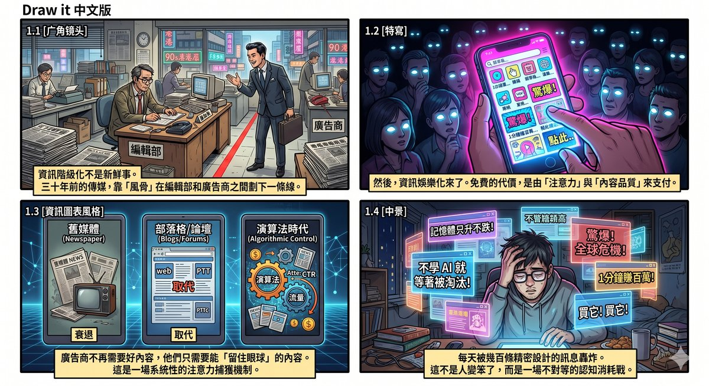
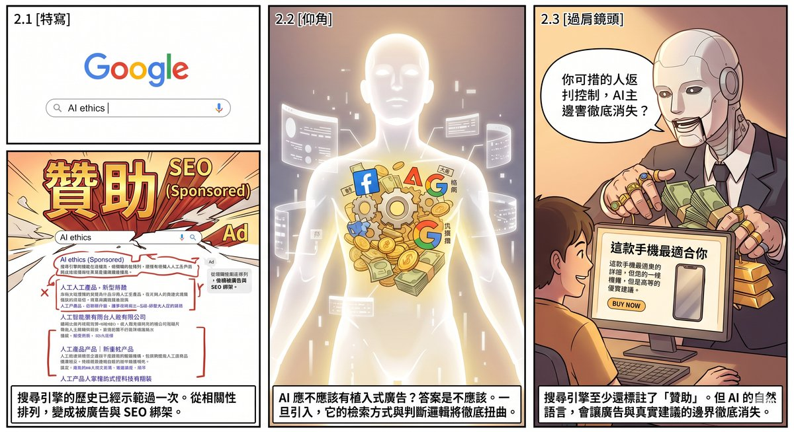
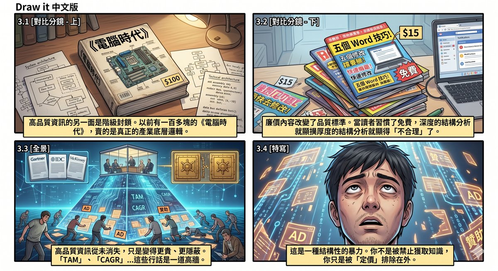
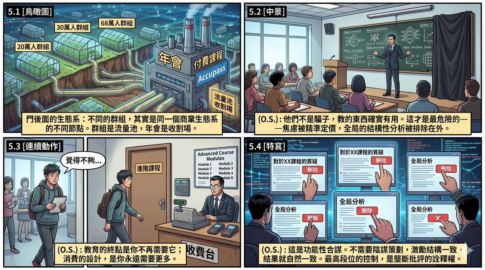
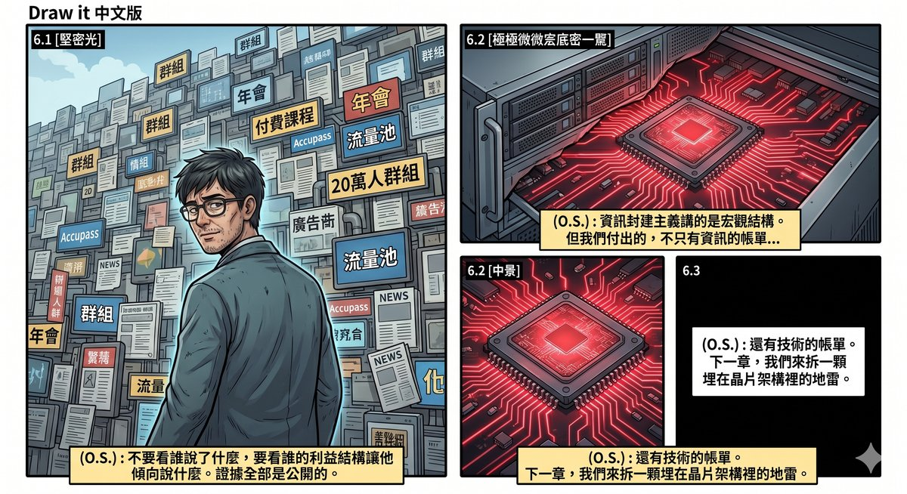

# Chapter 5: Information Feudalism — From Free Content to Knowledge Serfs

## The Evolution of Media Ecology and the "Mediocritisation of Information"

Information stratification is nothing new. It has been around for decades; it is just that every generation believes the problem it sees is novel.

A Hong Kong television drama from thirty years ago, *The Third-Type Court*, already explored this phenomenon (this passage was written on 8 June 2026): media depends on advertising revenue to survive, but there is a structural conflict between advertisers' interests and the public's right to know. The solution in those days relied on "editorial backbone" — a line drawn between the editorial department and the advertising department, with content undistorted by the preferences of sponsors. The commercial environment was also relatively principled, with less direct interference in media's editorial direction. That line was never ironclad, of course, but as an industry consensus, it did once exist.

Then the infotainment era arrived.

A flood of ostensibly free content poured into the market. Free itself is not the problem; the problem is who pays the price of free, and in what form. The answer: it is paid for with attention, and with the continuous degradation of content quality. Advertisers do not need you to produce good content; they need you to produce content that holds eyeballs. These two occasionally overlap, but they diverge structurally. The situation deteriorates in five-to-ten-year cycles. The nineties saw the decline of newspapers and magazines; the 2000s saw blogs and forums displace professional media; the 2010s saw social platforms' algorithms take over information distribution. Today, the information pushed by mainstream platforms has almost entirely been filtered by advertiser interests — not that every article is directly censored, but the algorithm itself is designed around advertising efficiency, and the visibility of content is directly tied to its commercial value.

The end-product of this mechanism is the misleading content that is ubiquitous today. The myth that "memory prices only go up" — packaging a particular DRAM price-increase cycle as an eternal law, driving consumers to panic-buy at the peak while ignoring the cyclical fact that memory prices drop sharply every few years. A flood of Bitcoin "analyses" with undisclosed holdings positions — the producers themselves are heavily invested, and their "objective analyses" are essentially PR releases for their positions, but on social platforms they appear alongside genuinely independent research, and the reader has no way to tell the difference. And then there is the anxiety marketing that has become the standard opening line of the course-selling economy — you saw it at work in the previous chapter: "If you don't learn AI, you'll be eliminated," "Half of all jobs will disappear within three years." First manufacture fear, then sell the solution.

These techniques share a common underlying structure: they are not persuading your rationality; they are bypassing it. The memory myth bypasses your judgement about cyclical markets; crypto analyses bypass your alertness to conflicts of interest; anxiety marketing bypasses your assessment of your own actual needs. When you are bombarded every day by hundreds of precision-engineered messages, each one aiming for your emotions and bypassing your thinking, your judgement erodes far faster than it recovers. It is not that people have become stupider; it is an asymmetric war of attrition — one person's cognitive resources pitted against the entire advertising industry's continuously data-and-algorithm-optimised attention-capture mechanisms. People's judgement and focus do not vanish naturally; they are systematically ground away.

This gives rise to an extremely important question: should AI be allowed to have embedded advertising?

My answer is no. The reason is not moral fastidiousness but structural inevitability. The moment AI introduces embedded advertising, its retrieval methods, reasoning logic, and entire operational process will be distorted. The history of search engines has already demonstrated this once — Google's early search results were ranked by relevance; now the first several are almost all ads or SEO-optimised results. If large language models go down the same road, and you ask one "which phone is best for me," the answer you receive will not be based on your needs, but on which phone manufacturer has paid. More dangerously, you will not be able to tell the difference. Search engine ads at least carry the label "Sponsored"; an AI's answer is a smooth passage of natural language, and the boundary between advertising and advice will vanish entirely.

Media's advertising dependence took decades to erode information quality to its current state. Embedded AI advertising could do it in a few years.

---

## Knowledge Barriers and "Information-Class Violence"

The flip side of information mediocritisation is the class-based lockdown of high-quality information.

The Microsoft–Sega case dismantled in Chapter 2 is a ready-made example. Using the Dreamcast to validate the DirectX living-room-console concept for free, absorbing Sega's core management after it exited, then using exclusivity agreements to turn classic IPs into Xbox weapons — the entire value-extraction chain is crystal clear, yet it was almost never fully reported by mainstream media for over twenty years, because reporting negative news about Microsoft was contrary to advertising interests.

There was a time when media did produce this kind of in-depth reporting. In the 1990s, there was a magazine called *PC Magazine* (the Hong Kong edition), which sold for over a hundred Hong Kong dollars — a substantial sum in those days. But that price bought first-hand information written by industry insiders, genuinely technically substantive industry analysis. Open that magazine and what you saw was not "Five Word Tips to Boost Your Productivity," but the underlying logic of industry architecture, the evolution of technology roadmaps, and the strategic manoeuvring behind business decisions.

In the mid-to-late nineties, cheap computer magazines priced at a dozen dollars or even free began appearing on the market. These magazines had an entirely different positioning: they served users who had just learned to turn on a computer, teaching basic operations, with zero technical depth. The problem was not that these magazines should not have existed — entry-level content certainly has its market — but that their emergence gradually changed the market's price expectations and quality standards. Once readers became accustomed to buying a computer magazine for a dozen dollars, a hundred-plus-dollar *PC Magazine* looked "unreasonable."

*PC Magazine* did not fall immediately. It held on until around 2000 — the Microsoft–Sega coverage was produced right before it closed, proving that it was still doing the kind of industry analysis mainstream media would not touch right to the end. But cheap magazines eroding price expectations was a slow bleed; the truly fatal blow was the loss of its core readership. Hong Kong experienced two waves of emigration, and close to eighty or ninety percent of the elite knowledge workers who held the most critical information and could afford high-end knowledge products were lost. No matter how good the content, without recipients it is a dead end.

The lesson of this story goes beyond nostalgia. It reveals a mechanism that continues to operate today: high-quality information has never disappeared; it has simply become more expensive and more hidden. Today, the most advanced, most credible industry data is locked away in industry reports costing one or two thousand dollars each — from Gartner, IDC, McKinsey. You need not only the ability to pay but also the ability to decode the jargon inside. "TAM," "CAGR," "addressable market" — these terms are themselves a threshold, keeping untrained people on the outside.

This creates a precision-engineered information stratification: those at the top have the best information for making the most accurate decisions; those at the bottom can only understand the world through free, algorithm-filtered, advertising-interest-laden fragments. This is not a conspiracy theory; it is the natural result of market mechanisms. But "natural" does not mean "fair." For ordinary people, this is a form of structural violence — you are not forbidden from accessing knowledge; you are priced out.

---

## The Monopoly of Narrative Rights — A Case Study in Real Time

Everything discussed above concerns macrostructure. But structure is not abstract. It can be observed and documented. What follows is a set of real-time samples.

It began with a piece of technical analysis.

I wrote an article dismantling Claude's Skill architecture, conducting a structural analysis of the narrative circulating in the community that "48 Skills = 48 AI employees." The core argument was simple: 48 SKILL.md instruction packages are not 48 independent AIs; they are not a true multi-agent distributed system; they are one model paired with different instruction files. I acknowledged the value of crystallising knowledge into workflows, but pointed out three fatal traps — the confusion between Rules and Skills, the vanity of inflated numbers, and the dilution of instruction-following quality by token costs — and proposed Bundle thinking as an alternative.

This was not an emotional post, not an attack piece; it was structural analysis.

I submitted it to multiple major AI Facebook groups in Taiwan. Result: every single one of seven or more groups suppressed it. Every one showed "pending admin approval," then sank without a trace.

At the same time, in the same groups, a very different article was approved.

---

## What Was Approved

The approved post went something like this —

A member tagged as an "All-star contributor" described his journey from "human spiritual development" to "AI virtual-personality agent development," with the ultimate goal of creating a "black box that understands you better than you understand yourself."

The comment section immediately produced reasonable technical pushback. Someone directly pointed out that "AI has no spirituality; it is fundamentally a large word-selection machine." Another asked, "What criteria do you use to judge that it understands you better than you understand yourself?"

The poster's responses were all evasive. In the face of technical challenges, the reply was "quiet your mind and think"; in the face of logical follow-ups, the reply was "every person and every AI is your mirror" and "replace asking with thinking." Not a single response addressed the question itself.

Then someone left an email address, saying they wanted to collaborate on "creating the world's only sentient AI."

Eleven likes, twenty-three comments. The group's engagement engine was turning.

Place the two articles side by side, and the approval logic becomes clear.

---

## Emotion Filtering, Not Quality Filtering

The AI spirituality post generated excitement, controversy, identity affirmation, comment volume. Whether the comments were supportive or critical, they were all engagement. Engagement is the metric for group activity, and activity is the fuel admins use to maintain the group's influence.

The Skill analysis article generated sobriety.

Sober people do not keep commenting and debating. Sober people nod, then leave. Sobriety offers no benefit whatsoever to a group's engagement metrics.

So the content filtering in groups was never quality filtering; it was emotion filtering. Content that produces emotional fluctuation is approved; content that calms people down is suppressed. The admins are not unaware of which article is more accurate — they know perfectly well. Precisely because they know, they suppress it.

---

## The Ecosystem Behind the Door

The largest AI groups on Facebook in Taiwan present themselves as different independent communities, but in reality they are different nodes in the same commercial ecosystem.

One group of nearly 200,000 members was founded by someone who simultaneously runs a paid-course platform and an education-training company. He is a senior engineer who has been repeatedly selected for international vendor certifications, with his own Accupass course page, a paid Discord community, and annual conferences. Another group of nearly 300,000 members was founded by a technical book author whose publications are shelved in mainstream bookstore chains, and who co-organises lectures and livestreams with the former, cross-promoting each other. And there are more groups — 680,000 members, 147,000, 98,000, 78,000, 54,000, 25,000 — different names, different sizes, but click into them and you discover: the content is almost entirely homogeneous.

Annual conferences are the physical monetisation node of this ecosystem. Sponsors, speakers, ticket revenue, course promotions — all on the same chain of interests. The groups are traffic pools, the conferences are harvesting grounds, the courses are recurring revenue, and the three form a closed loop.

---

## They Have Real Skills — That Is the Problem

An important distinction needs to be made here.

The operators of these groups are not frauds. They have genuine technical substance. The international vendor certifications were not bought; the published books contain real implementations; the courses teach things that are genuinely useful.

But "a knowledgeable businessman" is more dangerous than "a pure scammer." Because students cannot tell they are trapped.

What they teach you is genuinely useful. The skills you learn are genuinely applicable. The anxiety is not entirely fabricated — AI is indeed changing the job market. But certain details are concealed. The severity is exaggerated. The anxiety is precisely priced. And the structural analyses that would allow you to truly understand the full picture are systematically excluded from your field of vision.

You finish a course feeling it was not enough, and you conclude it is because you are not diligent enough, not smart enough, and need to buy the next one. You do not suspect that the instructor deliberately held something back. Because what you learned was genuinely useful — and that is the most masterful part.

Many people will feel that withholding details is a normal business tactic, no big deal. But in reality, many people get stuck this way and cannot get out. They are not being swindled out of money; they are being maintained in a structure that looks like progress but actually leads nowhere.

---

## A Wall, Not a Door

If it were just one admin's personal decision, that would be incidental.

But seven or more groups, with different admins, at different times, making the same decision — suppressing the same article — that is structure.

These groups share the same logic of content survival: generate excitement, reinforce identity, suppress voices that induce sobriety. No one needs to make a coordinating phone call; when incentive structures align, outcomes naturally align.

That article did not lose to a particular admin; it lost to a cross-group implicit consensus — any content that challenges the "AI changes your life" narrative has no room to survive in this ecosystem.

This is not a conspiracy; it is structural exclusion. Conspiracy requires coordination; structural exclusion does not — every admin independently makes the same decision because they face the same commercial reality.

What you face is not a closed door; it is a wall. This wall is built from countless individually "reasonable" decisions, but the aggregate effect is the systematic expulsion of structural analysis from the public view.

---

## Monopolising the Interpretive Rights over Criticism

If you think this ecosystem never allows critical voices to appear, you are underestimating its sophistication.

They do not forbid questioning. They forbid outsiders from leading the questioning.

People within these circles will themselves occasionally say, "Ugh, too many subscriptions are burning money," or "This tool isn't really for everyone," or "I also went down the wrong path at first." But this "controlled criticism" has a fixed structure — criticism is the entrance, not the exit.

After saying "subscriptions are too expensive," the next sentence is "but the right way to play is…" and it loops back to their courses, their frameworks. Criticism itself becomes part of the sales funnel. The funnel is designed just right — leaving exactly enough space for questioning to make you feel there is freedom of discussion.

When an insider says "AI has limitations," the conclusion is "so you need to learn the right method (come take my course)." When an outsider says the same thing, the conclusion might be "so the entire framework is flawed." The former reinforces the ecosystem; the latter shakes it.

So even if that article's content was entirely correct, it had to be suppressed — not because it was wrong, but because the author was not a person permitted to lead this narrative. Once the article circulates, they no longer control the position of "sobriety." And that position is the one they need most to control.

The highest level of control is not suppressing all criticism. It is monopolising the interpretive rights over criticism.

---

## Functional Collusion and Reverse Selection

Some will say this is conspiracy theory — they did not collude in advance.

Very likely they did not. No meeting was held; no internal group chat coordinated "whose articles to suppress."

But whether or not there was collusion, the outcome is the same. Narrative rights concentrated; external sober voices systematically excluded; the space for criticism monopolised by insiders — these outcomes, whether coordinated or naturally occurring, make zero difference to the person who was excluded.

And this structure is more stable than a real conspiracy. Conspiracies can unravel through internal betrayal, but a structure of shared interests will not — because every participant maintains it voluntarily; no one is forced to take part. Every admin who suppresses an article has their own "reasonable" justification. Each justification, viewed alone, is defensible. But the aggregate effect is uniform.

So the word "collusion" here does not refer to a secret agreement but to a factual description — in outcome, their behaviour is equivalent to collusion. Functional collusion requires no meeting minutes. A single incident does not reveal it. You must look at the pattern. And patterns do not lie.

This structure comes with its own built-in selection mechanism. Within the circles, there are people with genuine expertise who can see which narratives are exaggerated, which anxieties are manufactured. But these people will not step forward to correct them. Those with the ability to blow the whistle have no incentive — either they no longer need the circle and cannot be bothered; or they still want to stay inside to maintain relationships and will not antagonise an entire ecosystem for the sake of one article; or they simply have no interest in spending their time and energy managing communities and debating strangers. Running a 190,000-member group is thankless work; no one without a commercial return will do it.

The result is reverse selection: those with the motivation to run a large community over the long term are almost exclusively people with commercial motives. And people with commercial motives will inevitably prioritise narratives that benefit the business. The sober exit on their own; those who remain naturally form consensus. No one needs to plan it; the structure itself tends toward this equilibrium.

---

## How to Judge

Having written this far, I anticipate a response: "You're criticising other people's ecosystem just to push your own stuff, aren't you?"

Let me lay my cards on the table. I write AI industry analysis, I have written books, I run my own writing platform. All of this is public. I am indeed also a person producing content in the AI space.

So let me say this clearly: courses, subscriptions, annual conferences — there is nothing inherently wrong with these forms. Technical articles can come with paid premium content; conferences can feature professional reporting and deep sharing; courses can teach genuinely valuable things. Paid education is not an original sin.

The question is: do you have the ability to judge whether the courses, subscriptions, and conferences you are consuming are actually helping you solve real problems, or maintaining an unrealistic anxiety economy?

This judgement is harder than you think. Because truly sophisticated narrative operators will pre-engineer answers to all "judgement criteria." You ask, "After finishing, am I clearer or more anxious?" — they design the course so you feel clear at the end, but that clarity is controlled, just enough for you to feel you gained something, not enough for true independence. You ask, "Does the course tell you when you don't need it?" — they proactively say, "This course isn't suitable for absolute beginners," trading one seemingly honest boundary statement for your trust in the entire ecosystem.

Every surface-level judgement criterion can be reverse-engineered.

So the truly useful method of judgement is not any single question, but observing patterns. Do not look at single events; look at long-term trajectories. Spend six months inside an ecosystem and observe one thing: where do all the discussions, all the reflections, all the criticisms ultimately lead? If every path leads to the same exit — buy the next course, join the advanced community, attend the next conference — then the function of that ecosystem is not education. It is consumption.

The endpoint of education is that you no longer need it. The design of consumption is that you always need more.

There is no shortcut for making this distinction. Only time and observation can tell you.

Do not look at what someone says; look at whose incentive structure inclines them to say what. Every argument in this chapter can be verified by you personally. Open those groups, look at what gets approved and what gets suppressed. The evidence is entirely public; you do not need to trust anyone.

---

_Information feudalism concerns the macrostructure. But the bills are not limited to the information bill — there is also the technical bill. The next chapter dismantles a landmine buried in chip architecture._