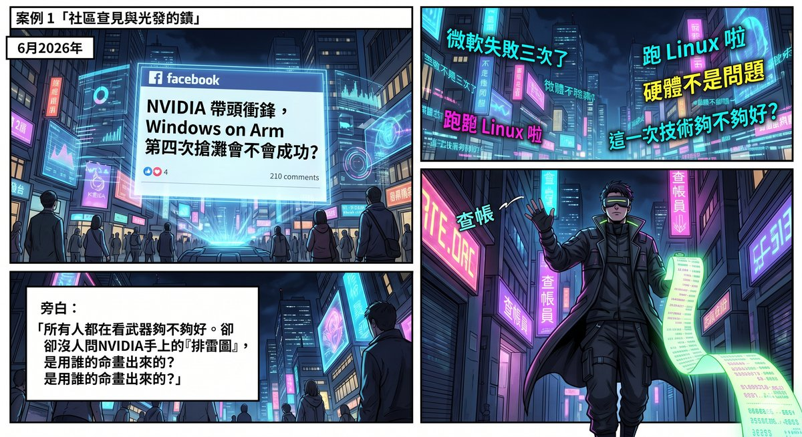
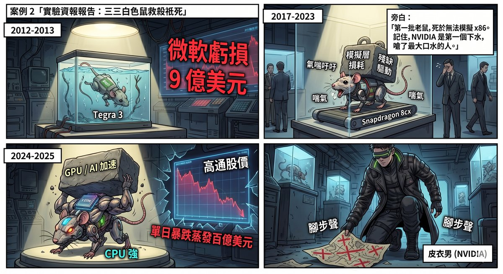
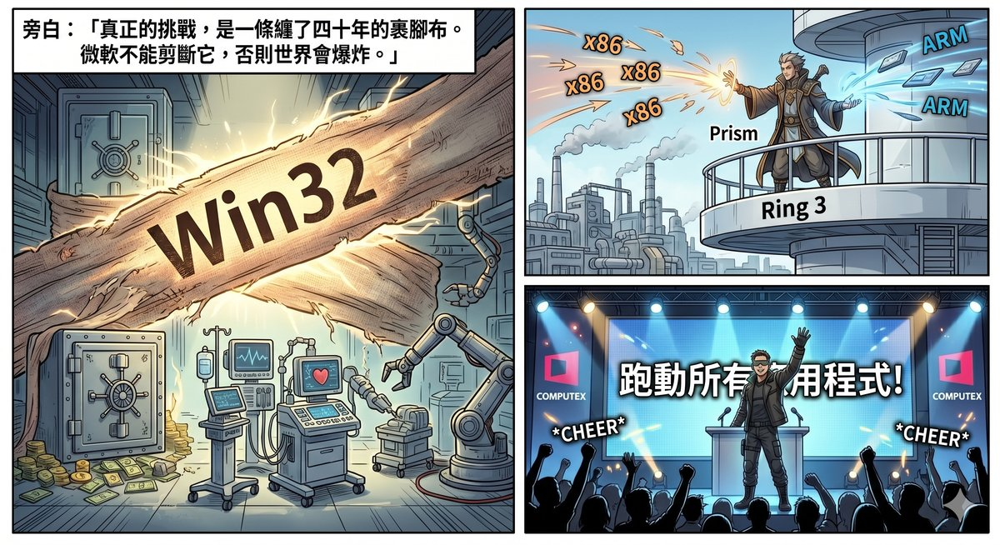
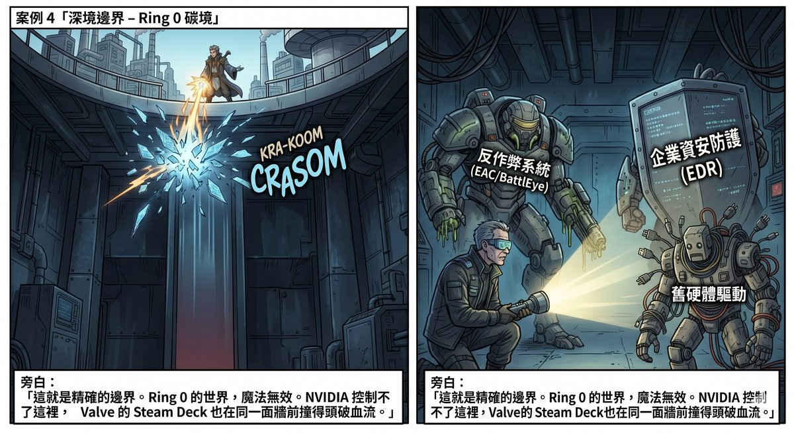
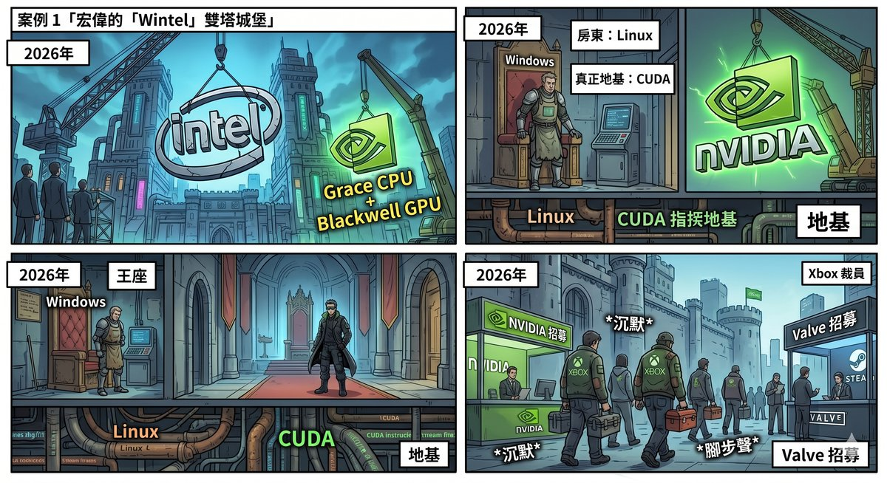
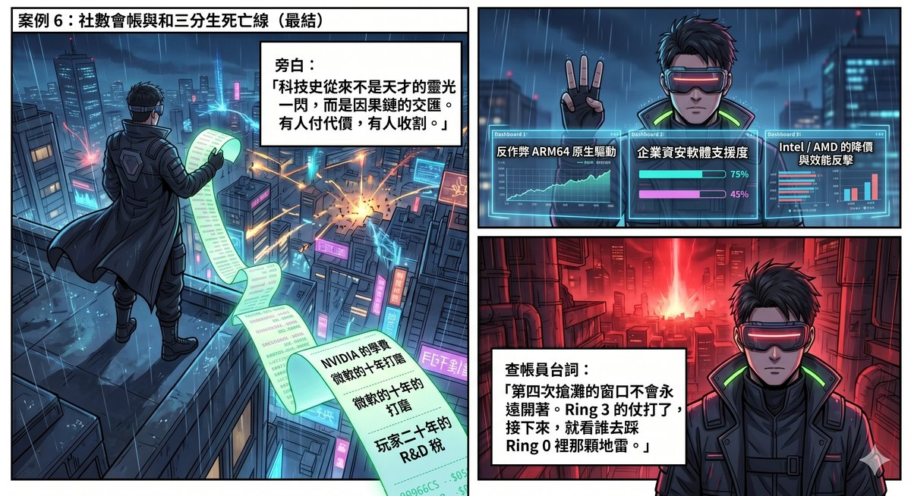

# Chapter 6: Someone Else's Tuition — The Ring 0 Landmine

This chapter is not a technical tutorial. It is the specific dismantling of a bill: who paid the tuition, who took the diploma, and who is still stepping on the mine.

The bills traced in previous chapters were bills of funding, of human resources, of attention. This chapter traces the technical bill — a landmine buried at the deepest layer of chip architecture, spanning fourteen years, passing through three waves of guinea pigs, and to this day unfixed by anyone.

---

## The Blind Spot in Hundreds of Comments

In June 2026, a Taiwanese engineer posted an article on Facebook: "NVIDIA leads the charge — will Windows on Arm's fourth beach assault succeed?"

Hundreds of comments flooded in. Some said "WoA's problem was never the hardware"; some said "Microsoft has failed three times"; some said "just run Linux." Everyone was answering the same question: Is this time's technology good enough?

But almost no one asked a different question: How did NVIDIA get to this point? Whose road is it walking on? Whose tuition did it use?

---

## The Lab Report of Three Waves of Guinea Pigs

The history of Windows on ARM is a serial lab report. Each wave of guinea pigs died from a different organ failure, and taken together, they trace a complete map of the minefield.

**First wave of guinea pigs: Surface RT / Windows RT (2012–2013)**

The chip in this wave was NVIDIA's Tegra 3.

Remember this fact. NVIDIA was not a bystander watching others drown from the shore — it was the first one in the water, and it swallowed a mouthful. Fourteen years ago, in that disastrous defeat, its name was printed on the motherboard.

Result: Windows RT could not run any x86 applications; it could only use the pitifully scarce ARM-native apps in the Windows Store. Microsoft lost $900 million on this.

**Cause of death: No emulation layer. Unable to run x86 apps on ARM meant Windows was not Windows.**

**Second wave of guinea pigs: Snapdragon 835 / 8cx / Surface Pro X (2017–2023)**

Microsoft absorbed the lesson of the first attempt and added an x86 emulation layer. By late 2017, the first WoA laptops with Snapdragon 835 shipped, capable of emulating 32-bit x86 apps. x64 emulation would not arrive until 2021.

But the cost was staggering. The performance penalty of emulation compounded the already modest ARM CPU. Driver compatibility was a disaster — antivirus software, enterprise endpoint protection, VPN clients: a pile of things either could not be installed or installed with crippled functionality. Enterprise users tried one round and withdrew.

**Cause of death: The emulation layer existed, but the CPU was not strong enough and drivers were not comprehensive enough. The enterprise market was impenetrable.**

**Third wave of guinea pigs: Snapdragon X Elite (2024–2025)**

Qualcomm finally produced a genuinely competitive ARM CPU. The X Elite's CPU performance caught up with Intel/AMD mid-range products. Microsoft also rewrote the emulator from scratch, naming it Prism — most everyday x86 apps could now run.

But one gap could never be plugged: the GPU. Qualcomm's Adreno GPU was king on mobile phones; on the PC, it was a giveaway. It could not run games, let alone CUDA. AI developers took one look and shook their heads.

On 31 May 2026, the day NVIDIA announced RTX Spark at Computex, Qualcomm's stock price crashed 10%, wiping approximately $10 billion in market capitalisation.

**Cause of death: The CPU finally passed muster, but the GPU and AI acceleration were a fatal void.**

Three waves of guinea pigs, fourteen years, billions of dollars in cumulative tuition. Each wave died from a different cause; each cause narrowed the error space for the next wave. By the time NVIDIA re-entered, the minefield map was already drawn — where you could walk and where you could not, perfectly clear.

And NVIDIA is the only company to have participated from the first wave of guinea pigs through to the fourth beach assault. It paid tuition in 2012; in 2026 it returned to claim the diploma — a diploma stamped with the marks that Qualcomm and Microsoft had stepped on for it.

---

## Forty Years of Foot-Binding, and the Last Landmine

Someone in the Facebook comment section made a precise remark: "Windows on x86 itself is chaotic enough at the base layer."

That sentence is more accurate than most tech analysis articles.

WoA's core challenge is not the textbook problem of "ARM instruction set vs. x86 instruction set." The real challenge is Win32 — a set of bindings wrapped around it for forty years.

Win32 is not merely an API. It is the programmatic core of decades of global enterprise software. ERP systems, financial reporting, medical records, industrial control, CAD software — all written on Win32. Many still carry the genes of Visual Basic 6, MFC, COM, ActiveX — that is the legacy of the nineties, yet today every bank, every hospital, every factory production line is still running on it.

Microsoft cannot say "Starting today, rewrite everything." Because the world's enterprises would explode.

So Microsoft's strategy is to add a translation layer: Prism. ARM runs Prism; Prism translates x86 instructions into ARM instructions; Win32 programs believe they are still in the x86 world.

Jensen Huang at Computex beat his chest and said RTX Spark can run "every single application that Windows has ever run."

That claim needs to be unpacked. Because it has a precise technical boundary — and that boundary is the last landmine that has not yet detonated.

**Prism can translate Ring 3; it cannot translate Ring 0.**

The privilege-ring architecture of x86 processors divides programs into two worlds: applications run in Ring 3, isolated behind a wall by the operating system; kernel code runs in Ring 0, directly touching hardware. The working principle of emulation layers like Prism is to intercept Ring 3 x86 instructions and translate them into ARM instructions — for user-level programs, this magic is already quite mature.

But three categories of things reside in Ring 0, where the emulation layer cannot reach:

**First: kernel-level anti-cheat.** EAC, BattlEye — these mainstream anti-cheat systems install their drivers into the Windows kernel to catch cheaters. Kernel drivers written for x86 cannot be emulated; they must be natively rewritten. This means a large batch of multiplayer online games — precisely the most popular ones — simply will not start on ARM. It is worth noting: this is also the same wall that Valve's Proton has been unable to breach on the Steam Deck to this day. Two translation solutions on completely different technology paths, defeated at the same position. This is not a coincidence — it is the structural boundary of Ring 0.

**Second: enterprise endpoint protection.** Antivirus, EDR, DLP — the entire enterprise security stack consists of kernel drivers. Without native support from security software, enterprises will not purchase a single unit — the "business market" leg cannot stand.

**Third: peripheral drivers.** Printers, capture cards, industrial control interfaces — legacy hardware drivers are likewise kernel-mode code, likewise unemulatable.

So the precise reading of Huang's promise is: "Every Windows application running in Ring 3." The Ring 0 world requires each vendor to rewrite individually — and that is not something NVIDIA can control.

But there is something most commentators overlook.

Win32 will not end. It does not need to.

It only needs to **be demoted.**

From "landlord" to "VM tenant."

This is not speculation. It has already happened. NVIDIA's own GeForce NOW cloud gaming service runs a customised Linux as the Host OS on its servers. Games run inside a Windows virtual machine on top of Linux. Windows is still there — but it is no longer the landlord. It is the tenant. The landlord is Linux.

Valve's Proton does another version of the same thing: running Windows games on Linux through a translation layer, translating DirectX to Vulkan. The result? Steam Deck proved that the performance penalty for many games is only in the single-digit percentages — but it also proved that the kernel-level anti-cheat wall is one the translation layer cannot get over.

RTX Spark's real bet is not "Win32 will disappear," but "Win32's importance will continue to decline until it is no longer a decision bottleneck." As more and more work shifts to the browser, web apps, AI agents, and CUDA, Win32 goes from "the inescapable foundation" to "a legacy mode you occasionally need to boot."

This is not a technological revolution. It is a quiet demotion.

---

## The Forty-Year Handshake in the BIOS Dark Room

Everyone is discussing whether the CPU is fast enough, the GPU is strong enough, whether apps can run. Almost no one mentions a more fundamental question: who writes the BIOS?

For the past forty years, the UEFI firmware, ACPI tables, power management, interrupt systems, and PCIe initialisation of every PC on earth — the things that must be running before the machine even boots — have overwhelmingly grown up alongside Intel Reference Design. Intel used a one-stop service to lock in OEMs: "Use my chip, and I'll handle all the dirtiest, hardest firmware work for you." Once OEMs become accustomed to this service, the cost of switching CPU suppliers is not just buying a different chip — it is rebuilding the entire boot sequence.

For NVIDIA to build an ARM PC, it must shoulder this layer itself. The good news is that Microsoft, after more than a decade of stepping in WoA potholes, has already paved part of the road — MPTF and WPS define the power management and workload scheduling rules for ARM chips on Windows. And MediaTek brings not only ARM core design experience but also the SoC integration expertise accumulated over more than a decade on its Dimensity series of mobile phone chips — memory controllers, power management ICs, high-speed interfaces — the "invisible dirty work" that is precisely the type of work Intel's one-stop team does.

But even with Microsoft's and MediaTek's help, the maturity of this layer still has a gap to close relative to Intel's forty-year accumulation. The "little industry secret" that one industry insider hinted at in the comments is very likely buried here — not that the CPU is not fast enough, not that the GPU is not strong enough, but that the things no one sees during those 30 seconds of booting are not yet stable enough.

---

## A Twenty-Year Pattern

Now lay out the causal chain.

In 1998, Microsoft partnered with Sega, placing Windows CE and DirectX on the Dreamcast. WinCE dragged down the DC's performance — ninety percent of developers bypassed it. But Microsoft obtained first-hand data: how DirectX runs on non-PC hardware, how developers complain, how a console supply chain operates. In 2001, the DC was discontinued. Microsoft took everything it learned from the DC and built the Xbox. Then it poached Sega of America's president, Peter Moore; intercepted the North American publishing rights for *Shenmue II*; and absorbed Sega's most core game IPs.

Cooperation. Learning. Abandonment. Replacement. Absorption of legacy.

From 2012 to 2025, Microsoft pushed three rounds of WoA. The first used NVIDIA's Tegra 3, losing $900 million. The second, from Snapdragon 835 to 8cx, saw the birth of the emulation layer but could not penetrate the enterprise market. The third used Qualcomm's Snapdragon X Elite — the CPU finally caught up, but the GPU and AI acceleration were blank.

Each round died. But each left a legacy: the first proved "you cannot do without an emulation layer"; the second proved "the CPU must be strong enough"; the third proved "the GPU and CUDA are the final missing piece."

On 31 May 2026, NVIDIA entered with RTX Spark. Grace CPU + Blackwell GPU + 128 GB unified memory + full-stack CUDA + gaming ecosystem. The known landmines — Qualcomm stepped on them all. The emulation layer — Microsoft had been polishing it for nearly a decade. The CUDA it brought was the cumulative product of twenty years of R&D tax paid through every GeForce graphics card by gamers.

Same pattern. Different era, different protagonist, but the logic is identical: others pay the tuition; you take the diploma.

This is not a conspiracy. This is structure. Every step was legal; every step was rational. But add them all up, and you have a complete value-extraction chain — extracting maximum value at minimum cost from the failures of a group of first-movers.

Only the Ring 0 landmine remains buried underground. And that one, nobody can step on for you.

---

## Steam Is the Dark Thread; Xbox Is the Endgame

What Valve has done over the past decade is far more strategically significant than most people realise. Proton, DXVK, VKD3D — the essence of these tools is building a virtual Windows bridge on top of Linux. The problem they solve is isomorphic to the problem Prism faces on WoA — both are about taking games written for x86/Win32 and running them on another platform.

The Steam Deck has already proven: translation is not necessarily a performance killer. Many games suffer only single-digit-percentage performance penalties. This data is one of the sources of NVIDIA's confidence in betting that "Windows games can run on ARM" with RTX Spark. But the Steam Deck also marked the boundary of translation — the kernel-level anti-cheat wall. Proton hit it and could not break through. NVIDIA's Prism route will hit the same wall.

Meanwhile, on the other side, Xbox is being dismembered. January 2024: 1,900 gaming division layoffs. May: Arkane Austin and Tango Gameworks shut down. September: another 650 laid off. 2025: another round of 9,000 layoffs hitting Xbox, followed by the cancellation of *Perfect Dark* and *Everwild* in the same month. Xbox's new CEO publicly stated the business is "not in a healthy spot."

The Xbox team — specifically the DirectX team, the GPU driver team, the game compatibility-layer team — are the people in the world who best understand "how DirectX runs in non-standard environments." Where they go after being laid off cannot be publicly confirmed. But the direction is not hard to guess: NVIDIA is building an ARM PC software stack; Valve has been recruiting Linux graphics engineers continually; AMD is expanding its ROCm team. The dismantling of Xbox is not the disappearance of talent. It is talent flowing in a new direction — and that direction happens to point toward RTX Spark and Steam Deck, the two platforms most in need of expertise on "running Windows games in non-x86 environments."

---

## WinVIDIA: New Empire or New Bill?

Pull all the threads together.

The Wintel architecture ran for forty years: Intel provides the CPU → Microsoft provides Windows → OEMs assemble → consumers pay. Intel locked in OEMs with a one-stop service; Microsoft locked in developers and users with DirectX and Win32. Two locks reinforcing each other, unbreakable.

What NVIDIA's RTX Spark aims to do is swap out Intel in this equation — NVIDIA provides CPU + GPU + AI runtime + CUDA → Microsoft provides Windows → OEMs assemble → consumers pay.

If you have read Microsoft's forty-year pattern, you will notice a subtle shift: in the Wintel era, Intel and Microsoft were co-equal partners. But in this new architecture, Microsoft provides only one thing — Windows. CPU, GPU, AI compute framework, and the full driver stack all come from NVIDIA. Microsoft's role has been compressed — from "co-ruler of half an empire" to "provider of an operating system shell."

Microsoft is not unaware of this. It may well be a deliberate concession — because Windows' moat in the AI era has already degraded from "the only PC operating system" to "a compatibility platform with a large legacy-app base." Microsoft's new moat is in Azure, in M365 Copilot, in GitHub. Windows' role on the consumer side is shifting from "imperial cornerstone" to "manager of historical baggage."

And NVIDIA's true rival may not be Intel or AMD but Apple. Apple Silicon's unified memory architecture — CPU, GPU, Neural Engine sharing the same high-bandwidth memory pool — is conceptually almost identical to RTX Spark's unified memory design. The difference: Apple simultaneously controls the chip, the operating system, and the software ecosystem, enabling end-to-end optimisation of the entire experience chain; NVIDIA still needs Microsoft's Windows and OEM partners' cooperation.

But there is a bill that has not yet been opened. For RTX Spark's pricing, a Morgan Stanley channel survey estimated $1,799 to $2,899. Even at the lower bound, this is not a mass-market consumer product; it is aimed squarely at the premium market in head-on collision with the MacBook Pro. And NVIDIA's business model — which has always been to attack the high end first, establish monopoly pricing, then slowly trickle down — means that the first wave of people paying the bill will, once again, be the gamers and developers who have been paying "R&D tax" for twenty years.

Their money nurtured CUDA. Their money nurtured TSMC's advanced processes. Now their money is opening a new battlefield for NVIDIA: the ARM PC.

The name on the bill has changed. The recipient has not.

---

## Three Indicators

Return to those hundreds of comments.

Some said, "As long as Huang is leading, there is a chance." Some said, "Once WoA market share is big enough, software vendors will naturally support it." Some said, "Just run Linux."

None of them were wrong. But what they saw was only one leg of the elephant.

RTX Spark is not a single technology gamble by NVIDIA. It is the latest link in a causal chain spanning twenty years: NVIDIA's own Tegra 3 tuition in 2012 → Qualcomm's eight years of WoA guinea-pig experiments → Microsoft's nearly ten years of x86 emulation-layer polishing → Intel's forty years of BIOS/OEM infrastructure → Valve's ten years of Proton game-translation experiments → the talent flow following Xbox's mass layoffs → the CUDA and TSMC advanced processes nurtured by twenty years of gamers' R&D tax.

Every link was paid for by different people. The beneficiary of every link points in the same direction.

This pattern — cooperate, learn, let others step on the mines first, then enter carrying others' legacy — is not appearing for the first time. It appeared when Microsoft stood on Dreamcast's legacy to build the Xbox. It appeared when NVIDIA used gamers' R&D tax to nurture CUDA. It appeared when TSMC used the promise "we don't compete with our customers" — a moat so simple it barely looks like one — to attract the world's most advanced chip designs into its fabs.

Each time, the surface story is different. Each time, the underlying logic is identical.

**The truth of technology history has never been a single genius's flash of inspiration. It is the intersection of causal chains — some pay the price, some reap the harvest — and those who pay the price usually do not know what they are paying for.**

So, will this beach assault succeed?

This article makes no predictions. But it can give you a checklist for judgement. Over the next twelve months, whenever you see another piece of WoA news, watch three indicators:

**One: when mainstream kernel-level anti-cheat systems (EAC, BattlEye) release ARM64 native drivers.** Without this, the most popular multiplayer games will not come to ARM — the "gaming ecosystem" trump card cannot be played.

**Two: the ARM64 native support progress of enterprise security software (antivirus, EDR).** Without this, enterprises will not purchase a single unit — the "business market" leg cannot stand.

**Three: the intensity of Intel's and AMD's counterattack.** They need only squeeze out 10% more performance-per-watt each generation, or simply cut prices, to pull wavering consumers back to x86. The fourth beach assault's window will not stay open forever.

Three indicators — those are the life-or-death lines of this beach assault. The Ring 3 battle is already over. **The remaining battlefield is entirely in Ring 0.**

---

_The power bill has been traced; the HR bill has been tallied; the bill against your judgement has been dismantled; the technical landmine has been marked. Four bills, four currencies — funding, labour, attention, technical legacy — all pointing to the same structure: those who pay the price do not know what they are paying for, and those who reap the harvest need not take responsibility for the consequences._

_The bills end here. The question from this point forward is no longer "who is paying," but "once the cover is lifted, what is actually standing behind it."_