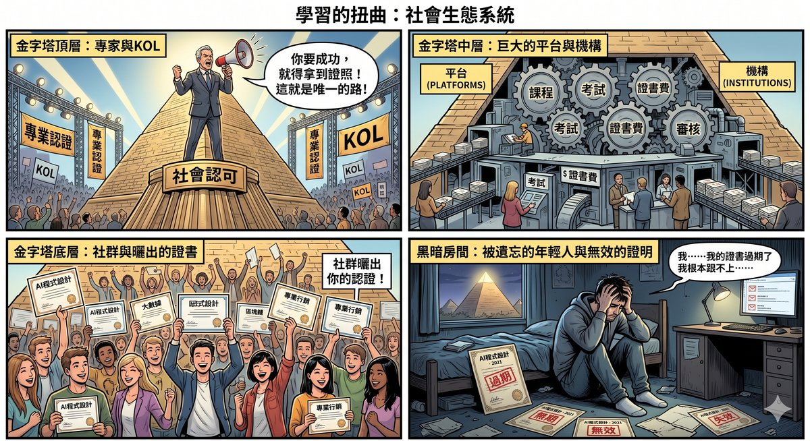
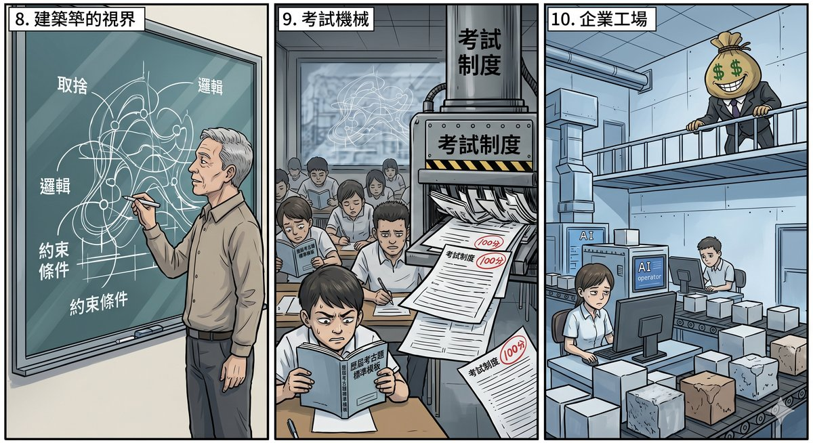
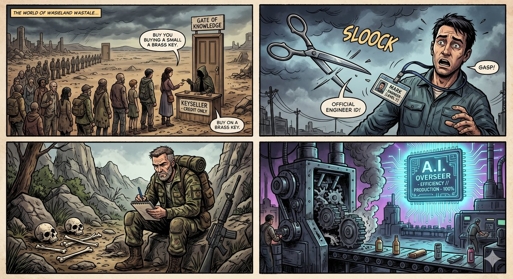
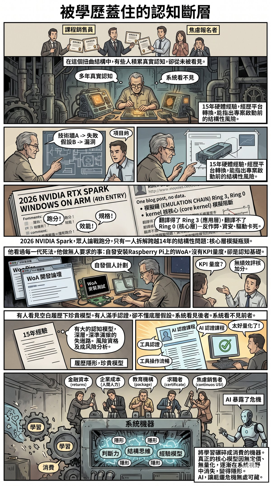

# Part III: The Demon-Revealing Mirror — What AI Exposes

The first two parts dismantled external mechanisms — how narratives are manufactured, how costs are transferred. But one question has remained unanswered: why do these mechanisms keep running? Why can the bill keep being passed to ordinary people?

The answer: because too many things have been covered up. Prose concealed the hollowness of content. Credentials concealed the absence of competence. Frameworks concealed the outsourcing of thought. Corporate rhetoric concealed the operation of power.

What AI does is lift all of these covers at once.

This part no longer tracks the flow of narratives or the destination of bills. It asks a more fundamental question: once the covers are removed, what is actually standing behind them? Chapter 7 begins with education — how anxiety is packaged into a commodity, how learning is compressed into operation, how credentials become a door without walls. Chapter 8 examines the individual — what prose and code have concealed, and what they have exposed. Chapter 9 examines the corporation — consensus costs, battles over discourse power, and institutional self-selection. Chapter 10 pulls all three threads together and asks the ultimate question: when production itself approaches free, what do humans still need?

Three mirrors, one question.

---

# Chapter 7: The Distortion of Learning — Anxiety Is the Best Commodity

## A Simple Question

A young person I know finished university and then a master's programme, told me he was broke, and was desperate to find work. He asked me how to learn programming.

I told him to start by reading books.

Not because I was too lazy to teach him. But because books are the cheapest, most accessible way to find direction. When you do not yet know what you want to learn, a book can at least help you sketch out an outline. Once you know the direction, then you can decide whether it is worth spending money on a specific course.

But the voices around him told him something different. Ads on social media said: "If you don't learn AI, you'll be eliminated." Course platform recommendations said: "Switch to an engineering career in three months." A parade of "experts" in livestreams said: "Sign up now — next time the course opens, there won't be seats." Every message was pushing him to spend money, to act, to be afraid.

What he least lacked was anxiety. What he most lacked was judgement — the ability to judge what is worth learning and what is just someone profiting from his fear.

Later, he went and obtained various certifications recognised by Taiwan's government. Not some dubious private courses, but formal certifications endorsed by KOLs, backed by corporate partnerships, supported by mentors, and underwritten by the government — looking professional, legitimate, and safe, every step treading on the track of "social approval."

But this path is precisely the most paradoxical choice in the AI era. The design logic of government certification is based on a stable body of knowledge: set standards, establish exams, issue certificates. It presupposes that what you test for today will still be valid next year. But when the underlying technology changes every six months and tools are replaced every year, what a certification can prove is only that you once learned a certain version of a certain thing — and that version may have already started expiring the day you received the certificate.

The deeper problem is not timeliness but direction. What certifications give you is a paved road: what to study, what to learn, how to prepare — all defined for you. You only need to follow. But in an era where even the road itself is being continuously rebuilt, the greatest danger is not taking a wrong turn, but mistaking "there is a road to walk" for "I am walking the right road." The certifications he spent enormous time and money obtaining made him feel he was moving forward, when in fact he was on a treadmill that keeps spinning — movements perfectly standard, direction never once determined by himself.

And judgement — no one will sell that to him. Because once he has judgement, he will not buy those courses.

---

## Knowledge Once Had a Shelf Life

What happened to that young man? He obtained every certification he signed up for, adding several lines to his résumé. But he still did not know what he wanted to do.

Not because he was not diligent enough. But because the direction of his effort was built on an assumption that had already expired.

Go back twenty years, and the return on learning something was relatively stable. Spend six months mastering Excel, and the skill could last ten years. Spend a year learning to code, and the capability could sustain your career's foundation. Get an Oracle certification, and for at least the next five years it carried real meaning on a résumé. Even setting aside technology — learn woodworking, cooking, lathe operation — once learned, it is yours; no one can take it away.

Education in that era, regardless of quality, at least had a basic transactional structure: you invested time and money in exchange for a skill with a long enough shelf life. A straightforward deal. Even if nine out of ten students never truly mastered it, the one who did genuinely received what they paid for.

This transactional structure held because of an implicit premise: the depreciation rate of knowledge was slower than the accumulation rate of learning. What you learn today is still usable tomorrow; the time you invest will not be instantly zeroed out by technological iteration.

But this premise has been gradually failing over the past decade.

Software framework lifespans have shortened from ten years to three. Cloud platforms update their APIs every quarter; you have not finished reading the last version's documentation before the next is released. AI models turn over every six months; the prompt techniques you learn today may become meaningless in three months as model capabilities improve. What you learn is not depreciating — it is evaporating.

The shelf life of knowledge has collapsed. But education's pricing model has not adjusted accordingly. Courses still cost the same, promises are still the same promises — only the shelf life of what you buy has gone from five years to five months, or even five weeks.

This is not the problem of any particular course. This is a structural crack in the entire "exchange money for knowledge" transaction model.

---

## Anxiety Is the Best Commodity

When the shelf life of knowledge collapses, something deeply paradoxical happens: selling knowledge becomes more profitable than ever.

The reason is simple. Short shelf life means customers come back. You learn about agents today; three months later the agent framework updates and you have to learn again. You complete a workflow course for an AI tool today; six months later the tool is revised and you have to re-learn. The faster knowledge evaporates, the higher the course repurchase rate.

But an even more powerful driver than repurchase is anxiety.

Anxiety is a special commodity. It does not require you to prove the product works; it only requires you to prove "what happens if you don't buy." Selling a programming course, you need to showcase student portfolios, employment rates, salary increases — these can be verified. Selling an AI course, you need only one sentence: "If you don't learn, you'll be eliminated." This statement cannot be disproven, because "being eliminated" is a threat that exists perpetually in the future, never expires, and never gets verified.

And so, a precision-engineered ecosystem takes shape.

First, "experts" manufacture anxiety. They are not necessarily bad people — quite a few of them used to teach honestly, and some even held senior R&D positions at major companies. But they discovered that the ROI of selling anxiety is far higher than that of selling knowledge. Teach a rigorous three-month course, and students may still fail to learn it; refund rates are high, word of mouth is unstable. Hold a two-hour lecture titled "Ten Things You Must Know in the AI Era," and every session is packed, income is stable.

Then platforms amplify the anxiety. Algorithms reward click-through rates and conversion rates, not teaching quality. The headline "Switch careers and earn a million-dollar salary in three months" will always outperform "This course requires a year of practice to be effective." The platform does not care what you learn; it cares whether you check out.

Finally, the community reinforces the anxiety. When everyone around you is signing up for courses, showing off certificates, and saying "I learned another new tool today," standing still makes you look like you are falling behind. "Being in motion" is more visible than "thinking clearly before moving." People who burn money on courses always look more diligent than people who sit quietly and think.

These three layers stacked together do not form an education market; they form an anxiety-arbitrage market. Those profiting in the middle are the course sellers and the platforms taking a cut; those bearing the costs at both ends are the students who paid but learned nothing, and those who genuinely have something to teach but refuse to use anxiety as a selling point.

And the cruelest part: when students finish a course and cannot apply what they learned, they do not blame the course. They blame themselves. They believe it is because they are not smart enough, not diligent enough, not talented enough. The cost of anxiety is ultimately absorbed entirely by those with the fewest resources to bear it.

---

## Are You Learning to Think, or to Operate?

Anxiety arbitrage is just the surface. Beneath it lies a deeper distortion, and it did not begin in the AI era.

When I studied software engineering abroad, the core of what I learned was not how to write code. It was architecture — the philosophy, logic, and design principles of software. Code was merely the final form of expression, occupying the smallest proportion of the entire learning process. What you spent the most time understanding was: Why design it this way? Under what conditions will this structure fail? What is sacrificed and what is gained by each design choice?

But in truth, these things are taught in Asia too. They are taught in Hong Kong; they are taught in Taiwan. The syllabuses include them, the textbooks include them, teachers discuss them in class. The problem is not "whether they are taught" but "whether they are tested" — and "how they are tested."

The essence of architectural thinking is trade-off judgement. Whether a design choice is good depends on the constraints you face, what you are willing to sacrifice, and your predictions about future change. These things have no standard answer; they cannot be tested with multiple-choice questions; they cannot be measured by a passing score of sixty. So the examination system naturally places them at the lowest priority — they are taught, but like water off a duck's back: untested means unpractised, and unpractised means unlearned. Students are not unaware that architectural thinking matters; they rationally invest their time in the things that will be assessed.

But the problem goes deeper than "not testing." Even when tested, the distortion persists — because the testing method itself is operational. An open-ended question on system design, placed on an exam paper, is not met by students attempting to understand the trade-off logic behind the design, but by students finding past exams, organising templates of model answers, memorising them, and applying them. The examination system trains a problem that requires judgement into a problem that can be solved with memory. Students are not learning architectural thinking; they are learning how to make an answer look like architectural thinking. The gap between "tested" and "not tested" is far smaller than you think.

The result? The entire job market forms a priority order: practice above all. Making the code run, finding workarounds, delivering quickly — these are the abilities that are valued. Architectural thinking is dismissed as "academic," "too theoretical," "impractical." Not because no one ever taught it, but because the measurement system never valued it from the start — and even when it did, the way it valued it pressed it back into the mould of operations.

And so an engineer can become very senior, yet fundamentally be only highly proficient in one particular framework, one particular set of tools. When the framework updates or the technology shifts, their experience resets to zero. It is not that they never learned the things that do not expire — design principles, systems thinking, trade-off judgement — but that the examination system and workplace evaluations both told them: those things do not count. They learned to operate, not because no one taught thinking, but because thinking was not scored at any point where they were measured.

This is not an individual's problem. It is the logic of the cost-control centre dictating education.

What enterprises want is plug-and-play labour. You arrive and can write code, deliver, and produce quantifiable results. Whether you have architectural thinking, whether you can independently adapt when technology pivots three years from now — that is not the enterprise's current concern. The enterprise's time horizon is this quarter's earnings report, not your career trajectory a decade hence.

When education is dictated by this logic, course design naturally tilts toward "teach you to operate" rather than "teach you to think." Because operations can be quickly monetised; thinking cannot. Operations can be measured by completion rates and employment rates; thinking cannot. Operations can deliver a visible result within three months; thinking takes three years to manifest in your decision-making.

AI courses push this distortion to its extreme.

Look at what current AI courses are teaching: how to build workflows with AI, how to automate processes with agents, how to get AI to increase your output volume. Notice the wording — "output volume," not "output quality." "Do more things," not "do better things."

What these courses are fundamentally training is a more efficient executor. Students pay money, learn to use tools to boost their output, and then bring these skills into the workplace — where the enterprise, at the cost of one person's salary, buys three people's output. The course helps not the student, but the enterprise's cost structure.

How many people have stood up and said: That is not how AI should be used?

Very few. Because those who would say it have no course to sell.

---

## A Door Without Walls

In 2025, a Taiwanese company listed a job opening for an "AI Application Engineer" on a recruitment website. The requirements included: certification from a certain platform in AI, a Prompt Engineering certificate from a certain institution, and at least three years of AI-related work experience. The salary was set twenty percent above traditional software engineers.

Three months later, the tool version that the certification was based on had been updated. The exam content had not changed, but the tool was no longer the same tool. Those who obtained the certification had passed an exam testing their knowledge of a historical version.

This in itself is not shocking. What is notable is everyone's reaction: the company did not revise its hiring criteria, job-seekers continued to register for the exam, and training institutions continued to run classes.

Anxiety arbitrage plus operation-oriented education jointly created a strange phenomenon: the entire society is using outdated standards to measure a capability it does not yet understand.

Certificates, degrees, training hours, completion rates — these metrics were meaningful in an era of stable knowledge shelf lives. Getting an Oracle certification meant you genuinely mastered Oracle operations. Completing a bootcamp meant you had at least walked through the basic workflow once. These metrics were imperfect, but they bore at least some correlation to actual ability.

But in an era of knowledge evaporation, these metrics become empty shells. This is not a feeling; it is measurable: research shows that the half-life of professional skills has compressed from ten to fifteen years to less than five, and in technology fields like software engineering and AI the figure is shorter still — two and a half years, even eighteen months (World Economic Forum, *Future of Jobs Report*; Skillable, 2025; Morson Edge, 2025). The AI certification you obtain today may be unable to keep up with model updates in three months. The workflow course you completed may become entirely obsolete in six months when the tool is revised. The metric persists, but the thing it points to has vanished.

You might think: empty shell or not, having one is better than having none, right? At least it is another line on the résumé, another talking point in an interview, another layer of protection during layoffs.

But that is not how it works. I have seen plenty of IT managers, certifications piled high, obtaining a new one every few months, the list of credentials on their résumés longer than their work experience. When layoffs come, they are laid off just the same. Cisco's 2026 layoffs are a ready-made exhibit: the company cut staff from traditional routing and switching divisions, redirecting salary budgets to AI networking and cloud security. Among the laid-off engineers were plenty holding CCIE and other top-tier industry certifications — IT staffing firm KORE1's analysis directly used the phrase "which certifications have just been released onto the open market" (KORE1, 2026). Certifications stopped not a single axe of layoff. Certifications gave them neither a competence moat nor a safety net within the organisation. But they kept testing — because the fear of not testing is stronger than the reality that testing achieves nothing.

This is the closed loop of anxiety arbitrage. Certifications have become anxiety's painkiller: they do not cure the disease, but they temporarily make you feel you are doing "the right thing." Take one pill, and the anxiety briefly subsides; then a new round of technology updates, a new round of layoff news pushes into your feed, the anxiety returns, and you sign up for the next one. The people outside the door are queuing up for keys to get in; the people inside the door are in the same queue — they think the key can lock the door, but the door never had walls.

But that is only one group. Far more managers and employees are not studying for any certification at all, not pursuing any continuing education. Not because they have seen through the emptiness of credentials, but because the anxiety has not even been activated — daily work fills all their time, and KPIs track delivery and output, not learning. Data corroborates this observation: the widely cited 70-20-10 model in workplace learning research holds that 70% of employee knowledge comes from informal on-the-job learning, 20% from peer interaction, and only 10% from formal training (US Bureau of Labor Statistics; Center for Creative Leadership). A 2020 Association for Talent Development report was even more damning: only 11% of employees apply formal training content to their actual work (ATD, 2020). LinkedIn's 2025 survey corroborated from the other side: half of companies say managers lack adequate support to drive employee career development, and 45% say employees lack guidance on using existing training programmes (D2L / LinkedIn, 2025). Companies say "we encourage continuous learning," some even provide training budgets, but performance reviews never measure it. You do not lose points for not studying; you do not gain points for studying. The system does not truly force you, so the vast majority's knowledge stays frozen at the version from the year they were hired, and they use that same set of knowledge for five, ten years — until the whole thing is replaced.

So three types of people stand before the door: one type furiously pursues certifications, one after another, anxiety-driven, a painkiller loop; another type does nothing at all, not because they see clearly, but because the system gives them no reason to move; and an extremely small number bypass the door entirely and walk around it — but the path they take does not exist on the system's map.

Yet the system needs metrics. Corporate HR needs screening criteria. Job-seekers need highlights on their résumés. Training institutions need quantifiable "outcomes" to prove their courses work. And so everyone continues to maintain this hollowed-out measurement system — not because it is useful, but because no one knows what to replace it with.

So where is the real threshold?

Not in what tools you have learned. Not in what certificates you hold. Not in how many hours of courses you have completed.

In whether you have the ability to judge: what is worth learning, and what is just noise. In whether you have the ability, after a tool expires, to reorient your own direction. In whether, when facing a problem you have never seen before, you have a way of thinking — not a solution formula, but the ability to analyse the structure of the problem itself.

These abilities share a common characteristic: they cannot be standardised. You cannot prove you possess them with a certificate. You cannot "learn" them in a three-month course. You cannot even clearly describe to others what they are — until you see someone make the right judgement at a critical moment, and only then do you realise: this person possesses something that no exam can test for.

The distortion of learning did not begin with AI. AI merely made it impossible to ignore any longer.

---

## The Cognitive Fault Line Hidden Beneath Credentials

Within this entire distorted structure, one type of person's situation deserves the most attention — not those selling courses, not those driven by anxiety to sign up, but those who have worked quietly within the system for many years, accumulated genuine cognition, yet have never been visible to the system's measurement standards.

Someone has spent fifteen years in hardware development, lived through three generations of platform transitions, and personally witnessed which technology paths hit walls and which assumptions were invalid from the start. Their judgement does not come from literature; it comes from countless instances of "we thought it would work, but it turned out it wouldn't." They can identify structural risks in a project before it launches, not because they have a crystal ball, but because they have already walked the same type of road three times.

Chapter 6 dismantled a concrete example. In 2026, NVIDIA released RTX Spark, announcing its fourth assault on Windows on ARM. Hundreds of comments in the tech community discussed "whether this time's technology is good enough" — specs, performance, benchmarks. But one person wrote an analysis that did not discuss a single benchmark figure. What he traced was a causal chain spanning fourteen years and three waves of failed platforms, then pointed out a structural problem almost no one mentioned: the emulation layer can translate the application layer (Ring 3) but not the kernel layer (Ring 0) — anti-cheat systems, enterprise security software, peripheral drivers, all stuck there. This is not NVIDIA's problem; it is the problem of Windows' forty-year historical baggage, and no one can solve it regardless of who arrives.

He had been saying these things two years earlier. Not because he was smarter than others, but because he had experienced three generations of Windows on ARM development, seen what each generation died from, and knew which constraints were structural — unable to disappear simply because a different chip was swapped in. When events later unfolded exactly along those constraints, he did not need to "predict" — he was merely waiting for history to rhyme.

And much of what he did was never asked of him by anyone. He signed up for the Windows on ARM developer programme himself, went into developer forums to see what problems others encountered, how they solved them, which problems were never solved. He even tried installing Windows on ARM on a Raspberry Pi — not because a company project required it, purely because he wanted to personally feel where the platform's boundaries were. No KPI measures these behaviours; no supervisor asked him to do these things; no performance review would award points for doing them. But it was precisely these self-initiated, invisible, off-everyone's-radar investments that formed the cognitive foundation enabling him to write that analysis.

But not a single line on his résumé can express this. No certificate exists called "person who has seen three generations of platform failures." No certification exists called "can identify structural risk before a project launches." His ability lives in his cognitive model — a system of trade-off judgements compressed from years of field experience. This system is extraordinarily valuable, but in the language of résumés, KPIs, and training systems, it is invisible.

Meanwhile, another person spent six months taking a pile of AI courses, obtained several certifications, and has a shiny résumé. They can operate various tools with great fluency, but if you ask: What are the underlying assumptions of this tool? Under what conditions will it fail? Their answer may be a blank.

The system sees the second person. The system cannot see the first.

This is the cognitive fault line. Degrees and certificates were supposed to be proxy indicators for cognition, but when the shelf life of knowledge collapses, when education is dominated by an operational orientation, and when anxiety arbitrage distorts the market, a vast chasm has opened between these proxy indicators and the things they were meant to represent. What you measure is increasingly not what you need. What you need is increasingly not what you measure.

At an even deeper level: when the system chronically uses the wrong indicators to measure ability, it does not merely overlook genuinely capable people. It also trains everyone to optimise for those wrong indicators — to pursue what can be quantified, rather than what is genuinely important. Your attention, your time, your money — all channelled toward certificates and courses, not toward thinking and judgement.

The distortion of learning is not an event. It is a system.

Financial capital's logic demands quantifiable returns. Corporate cost control demands plug-and-play labour. Educational institutions demand packageable outcomes. Job-seekers demand displayable credentials. Anxiety sellers demand repeat customers. Every link has its own rationality, but strung together, they constitute a machine that crushes "learning" into "consumption."

And within this machine, the things that truly matter — judgement, structured thinking, experience-based cognitive models — because they cannot be standardised, cannot be priced; because they cannot be priced, will not be produced; because they will not be produced, they gradually vanish from the system's field of vision.

They have not died. They have merely become invisible.

And the arrival of AI is illuminating this invisible crisis, leaving it nowhere to hide.

---

_The distortion of learning was not caused by AI. AI merely made it impossible to ignore any longer. But AI has exposed more than just education — it has simultaneously lifted several other covers._