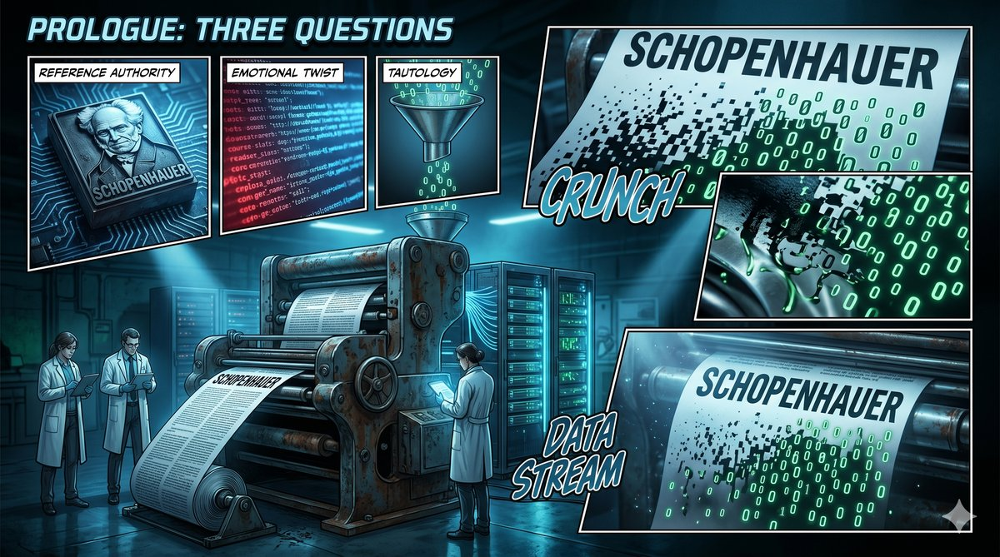

# Prologue: Three Questions

Read the following passage first.

---

> Schopenhauer once said: "Life is like a pendulum, swinging back and forth between suffering and boredom." But it is precisely this swinging that gives us a chance to see clearly — the end of suffering is not boredom, but a kind of clarity that has been polished by experience. Your anxiety right now is not because you are not good enough, but because you are standing at the threshold of a deeper understanding. Push the door open, and you will discover: the answer you have been searching for has never left.

---

Finished reading?

This passage is grammatically correct, appropriately worded, and structurally complete — it begins by quoting a philosopher to establish authority, then uses an emotional reversal to create resonance, and finally closes with a seemingly profound statement. If it appeared in your social media feed, paired with a misty mountain landscape or a steaming cup of coffee, you would probably pause and give it a second look.

This passage was generated by AI.

It was not written by someone who spent days contemplating, who had undergone some profound personal revelation. It was produced in a matter of seconds by a Gemini App built with Google AI Studio — input an emotional keyword, select "Schopenhauer" as the philosophical framework, tick the "emotional companionship" mode, click generate. The entire process took no more than ten seconds.

Take apart its structure, and you will see a precision-engineered formula at work.

The first layer is the citation. Schopenhauer's name provides intellectual authority — most readers will not bother to check whether this is actually something Schopenhauer said, nor will they investigate the original context. The citation itself is a threshold; it tells you: "This article has scholarship."

The second layer is the emotional reversal. "The end of suffering is not boredom, but a kind of clarity that has been polished by experience." This sounds like insight, but does it withstand scrutiny? What is "clarity polished by experience"? Under what conditions does it hold true? For whom does it hold true? It answers none of these questions, but it mimics the feel of answering a question.

The third layer is the consolation. "Your anxiety right now is not because you are not good enough." This sentence is always true — because it applies to any anxious person, without needing to know who you are, what you are anxious about, or how complex your situation is. It is a tautology: a statement you cannot even be wrong about, at the cost of saying nothing at all.

The fourth layer is the closure. "The answer you have been searching for has never left." The function of this sentence is not to provide an answer, but to make you stop asking. If the answer has never left, then you do not need to keep looking — you just need to "feel." It swaps out the need for thought and substitutes emotional satisfaction.

Stack the four layers together, and you have a bestseller-generating machine.

This machine does not require the author to have any life experience, any research into Schopenhauer, any history of having been anxious, clear-headed, or polished by hardship. All it needs is an API key and a prompt template. The text it produces is statistically "correct" in perpetuity — because it never risks saying anything that could be refuted.

Now, the question arises.

The "in-depth content" you read every day on your phone screen — those pieces with exquisite formatting, philosophical epigraphs, that make you feel "seen" late at night — how much of it is the output of the same machine as the Schopenhauer passage you just read?

Not necessarily AI-generated. A human-written text produced using the tautology formula is structurally indistinguishable from an AI-generated text using the same formula. The difference is not in the tool, but in whether there is a consciousness — one that has lived — taking responsibility behind it.

What this book sets out to do is take that machine apart and show it to you. Not just the AI machine — but also the ones that are older and have been running far longer: the narrative-manufacturing machine, the cost-transfer machine, the anxiety-arbitrage machine, the cover-story-production machine. Stacked together, they constitute the information environment you breathe every day.

---

This book will answer five questions.

The first question: Who manufactures the narrative?

How many times does a sentence distort on its journey from a Seoul press conference to your phone screen? Who decided which version of a piece of 2001 history you remember today? That information distorts in transmission is not news, but few people bother to trace the economic motive behind each layer of distortion.

The second question: Who pays the bill?

The electricity bill for AI, the bill for layoffs, the judgement you are being ground down bit by bit — those who manufacture stories need not take responsibility for their consequences. Those who bear the consequences cannot even see the bill. Who is paying, how much, and to whom?

The third question: What truths does AI expose?

The most important thing AI does is not replace humans. What it does is lift, all at once, a series of things that have long been concealed — prose concealed the hollowness of content, credentials concealed the absence of competence, frameworks concealed the outsourcing of thought, corporate rhetoric concealed the operation of power. When the covers are removed, what is actually standing behind them?

The fourth question: What do humans have left?

In a world where narratives are mass-produced, costs are systematically transferred, and covers are lifted one by one, what does an individual still possess that cannot be replicated, cannot be subscribed to, cannot be upgraded, and cannot be downgraded? The answer points to one word — consciousness. But the word itself is a trap; everyone pictures something different when they hear it.

The fifth question: How should we walk the path?

Having seen the structure clearly, having understood the forces at play — then what? In a world you have already seen through, what do you choose to do? And after the choice is made, how do you walk the path?

Five questions, corresponding to five parts. Part I traces the distortion of narratives. Part II traces where the bills go. Part III traces the covers that AI lifts. Part IV traces the structure of consciousness. Part V addresses choices and the road ahead.

---

You can treat this book as a detective's report.

What is being investigated is not a particular person or a particular company, but a mechanism — one that lets those who manufacture stories avoid responsibility for their consequences, while those who bear the consequences cannot even see the bill.

The evidence will be laid out piece by piece. The analysis will unfold layer by layer. The conclusions are yours to draw.

The first exhibit in this report is the Schopenhauer passage you just read.

It looked profound. It made you pause and give it a second look. It may even have made you feel "seen."

But it said nothing at all.

_A machine can generate an unlimited quantity of "profundity." So what does something truly profound look like? The answer is not in this chapter — it is scattered across the fifteen chapters that follow. Chapter 1 begins with the distortion of a single sentence._