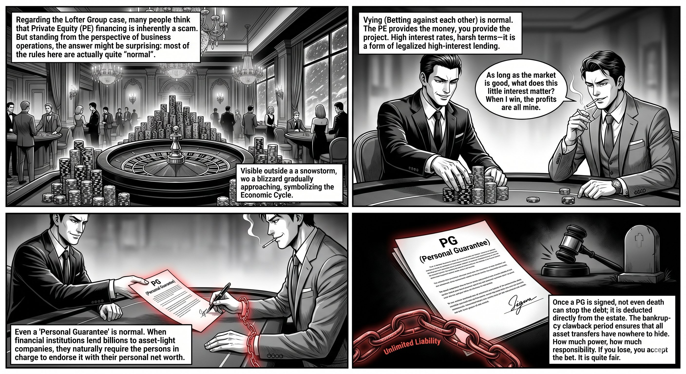
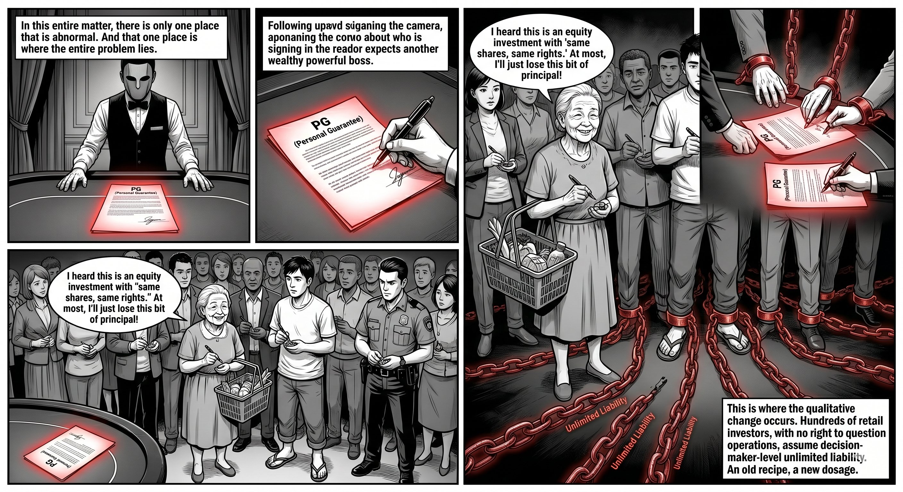
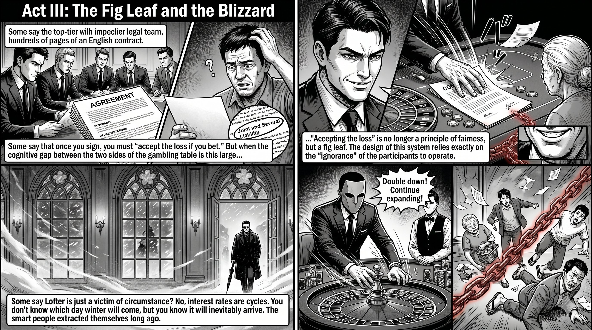
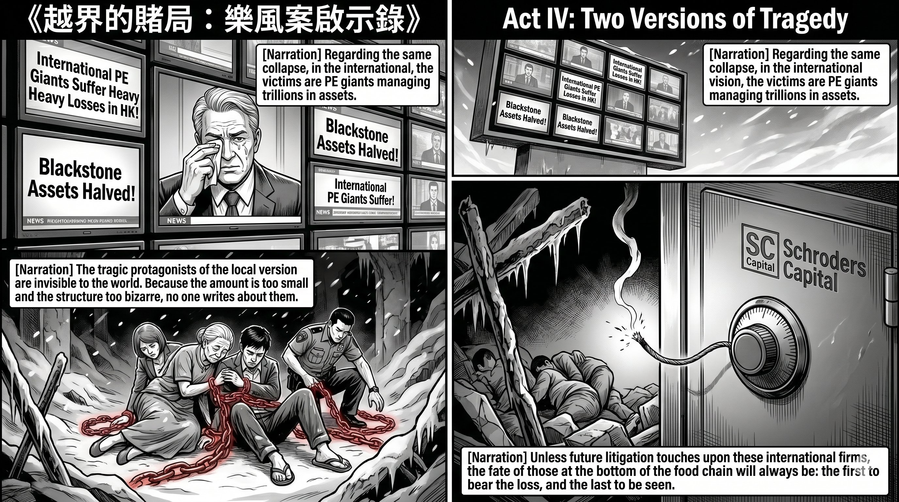
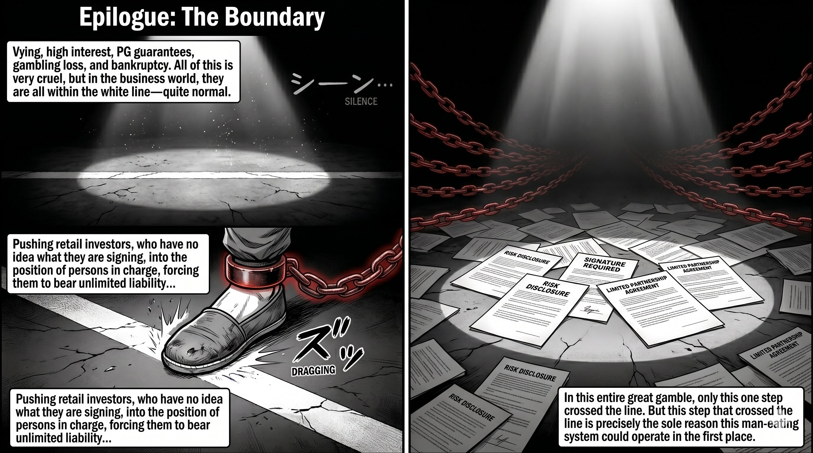

# Postscript: The Normal and the Abnormal in a High-Stakes Gamble

> This article is a postscript to the Lofter Group case analysis series. The preceding three articles: "The Food Chain Structure of the Lofter Group Case," "Fee Structure Determines Freedom of Speech," and "Lawful Unfairness and Unlawful Deception."

## I. One More Angle

After the series was finished, I came across quite a few discussions on YouTube and realised there was one angle I had not fully developed: from the standpoint of normal commercial operations, how much of this affair was actually perfectly reasonable?

The answer may be surprising: most of it was. The gamble was reasonable, the high interest was reasonable, even the personal guarantees were reasonable.

There was only one thing that was abnormal in the entire affair. And that one thing was the root of every problem.

## II. The Gamble Was Normal

In the series, I likened PE to "legal international loan sharks." Let me be clear first: PE's modes of cooperation are in fact hugely varied — pure equity, mezzanine financing, private credit, joint acquisitions — each with its own playbook, which I won't elaborate on here. That metaphor was aimed solely at the kind of arrangement seen in the Lofter case: equity in name but debt in substance, laden with ratchet clauses. It captured the coercive nature of such contracts, but may have created a misleading impression that PE financing itself is a scam.

It is not. The essence of this type of financing is a gamble: PE puts up the money; you bring the project and the execution. The interest is high, the terms are punishing — but if you win the bet, your returns far exceed what a bank loan could ever lever. And PE wants you to win — only when you win can it collect principal plus interest and skim a performance fee on top.

Winners genuinely exist. In 2013, Michael Dell joined forces with PE fund Silver Lake to take Dell private for over US$24 billion, dodging Wall Street's gaze to complete a transformation, and returned to the public market in triumph a few years later. Although that was an equity buyout — structurally different from the equity-in-name-debt-in-substance deals common in Hong Kong real estate — it illustrates a point: PE money can be repaid on the back of a win. In Hong Kong, the "King of Shops" Tang Shing-bor rode high leverage in buying and selling commercial properties for decades, with assets peaking in the tens of billions — he won at the table for most of his life.

High leverage does not equal a scam. It equals high risk. In a rising market, it can even be astute.

The question was never "should you borrow PE money," but: do you know what you are betting, and what you will owe if you lose?

## III. PG Was Also Normal

Even Personal Guarantees, in the right context, are entirely normal.

Consider Lofter's "asset-light" model: Janice Chow herself said that Lofter's equity in projects "might be only 3%, and in some cases possibly even zero." Eight projects, with total investment approaching HK$10 billion. If you were a financial institution, lending billions to a company with net assets near zero without requiring additional guarantees — that would be the abnormal thing.

What many people did not grasp when they signed is the true weight of a PG: it survives even death. When a guarantor passes away, the debt does not vanish — it is deducted directly from the estate. Creditors are paid first; only what remains passes to the children. A single signature extends its reach beyond the grave.

Nor can you escape by moving assets. Some people think that transferring properties to a spouse or children, or selling them at a knock-down price to friends and relatives ahead of disaster, will protect their wealth. Bankruptcy law has long plugged that hole. Bankruptcy proceedings include a clawback period, during which undervalue transfers and preferential transactions can be set aside by the trustee and assets recovered. If the transfer is proven to be a deliberate attempt to evade debt, the clawback is not even subject to a time limit. Once you sign PG, your balance sheet no longer has a "family" safe harbour.

Precisely because the stakes are this high, there is an unwritten rule in legitimate PE financing: PG is signed only by the decision-maker. The decision-maker, the major shareholder, the person in actual control — the greater the power, the greater the responsibility. When New World seeks financing, nobody asks the minority shareholders to sign. The decision-maker signing PG is using their own wealth to underwrite their own decisions. This is logically coherent, and even fair.

So the existence of PG is not the problem. The problem is —
## IV. The Only Thing That Was Abnormal: Who Signed

Lofter had retail investors sign.

In Lofter's model, the PG was not borne by Janice Chow herself — she did not even appear on some project companies' shareholder and director lists. The ones who signed were retail investors who had entered on a "one share, one vote" basis and had virtually no control over the projects' operations.

A Ming Pao investigation this May found that the two bond-issuing companies for which Lofter served as guarantor alone had over seventy shareholders, spanning the entire social spectrum: some lived in public housing, some in luxury apartments at Kowloon Station, and some even listed police quarters as their address. And each of Lofter's eight projects could have up to a hundred shareholders.

This is where the qualitative shift occurred.

A normal gamble: three or five decision-makers, backing a project they control with their own wealth. Rights and responsibilities aligned; lose, and you take it on the chin.

Lofter's gamble: over a hundred retail investors, with no say in the project's operations, assumed the same level of unlimited liability as the decision-maker. They thought they were making an equity investment — worst case, they lose their capital. The moment they signed PG, they actually became debt guarantors — liable beyond the grave.

And this playbook had precedent. Insiders knew that previously, investment mentors had referred students to finance companies to borrow at leverage, sign PG, and enter the market — retail investors signing PG was nothing new. What was new was the tier: previously, it was finance companies feeding on retail investors; this time, a PE-grade capital chain had retail investors' personal wealth plugged in at the end. Old recipe, new dosage.

## V. The Premise of "You Bet, You Lose"

The most common retort is: you signed, you own it — you bet, you lose.

This principle is not wrong. But it has a premise: before placing their bet, the gambler knows the rules, knows the odds, and knows the worst they can lose.

On one side sits a top-tier legal team that has spent decades honing contract clauses. On the other sits a public housing resident hearing the phrase "Joint and Several Liability" for the first time. When the cognitive gap between the two sides of the table is this vast, "you bet, you lose" is no longer a principle of fairness — it is a fig leaf.

This is not to say retail investors bear no responsibility for their own signatures. It is to say: when a system is designed such that it can only function because a large number of participants do not understand what they have signed — the system itself is the answer.

## VI. Timing and Choices

Finally, let me address the most common defence: "Nobody foresaw COVID, the social unrest, or the interest-rate surge; Lofter was simply a victim of circumstances."

Half right.

Nobody could predict the exact day rates would rise. But "low interest rates won't last forever" did not require a prophet. Interest rates are cyclical. You may not know which day winter arrives, but you know winter will come.

And some people did put on their winter coat early. From 2013 onward, Li Ka-shing sold off mainland and Hong Kong assets year after year, drawing ridicule across the internet — "Don't let Li Ka-shing get away!" In hindsight, it was a textbook cycle call. Getting out was always a real option.

So the true dividing line was not "who foresaw rate hikes," but: among those who equally knew winter was coming, who chose to get out, and who chose to double down.

Lofter chose to double down. From 2019, it spent nearly HK$10 billion acquiring urban projects, continuing to expand on an already maxed-out leverage base. This was not a bystander struck by lightning — this was someone who heard the thunder and decided to run faster rather than find shelter.

Even Tang Shing-bor, who had won at the table for most of his life, could not escape this winter: after he passed away in 2021, his family was forced to sell assets at fire-sale prices in a depressed market, suffering devastating losses. The difference was: Tang sat at his own table, placed his own bets, and settled his own bill. Lofter's table was filled with retail investors' names and personal wealth.

## VII. The International Version: PE as the Victim

At this point, has this case attracted international attention?

The answer is deeply ironic: yes, there has been coverage — but the story is completely inverted.

International financial media have indeed been writing about Hong Kong real estate's crash. Bloomberg ran a piece last October about how international PE funds had poured US$17 billion into Hong Kong property over the past decade and were now nursing heavy losses — the headline example was Blackstone, which bought a commercial property in Mong Kok for HK$700 million in 2014, only to see its valuation drop to less than half, and is currently renegotiating loan terms with its banks.

In other words, in the international narrative, the "victim" of Hong Kong's property crash is Blackstone.

As for the Lofter case? South China Morning Post, The Standard — Hong Kong's local English-language outlets — have covered it, but as local news written for a Hong Kong audience. Bloomberg did not write about it. Reuters did not write about it. The Financial Times did not write about it. The thread of "over a hundred retail investors signed PG and are liable beyond the grave" simply does not exist in the international narrative.

The same crash, two versions: in the international edition, the tragic protagonist is a PE giant managing trillions in assets. In the local edition, the tragic protagonist is a guarantor living in public housing. And the latter is invisible to the world.

Why invisible? The sums are too small — Lofter's entire portfolio was under HK$10 billion, a rounding error on the global PE scale. The victims are too "local" — the ones who lost are Hong Kong retail investors, not international LPs. The structure is too peculiar — "retail investors signing PG" is unheard of in international PE circles, so exotic that it defies categorisation, and paradoxically, nobody writes about it.

But one fuse has yet to burn down: Lofter's list of counterparties includes international names like Schroders Capital and SC Capital. If future litigation or investigations touch on these institutions' roles in the capital chain, this story may yet graduate from "Hong Kong social news" to "international financial news."

Until then, the bottom of this food chain continues to suffer its perennial fate: the first to bear losses, the last to be seen.

## VIII. Conclusion: Boundaries

This postscript is not intended to overturn the preceding analysis, but to draw the boundaries clearly.

The gamble — normal. The high interest — normal. The PG — normal. Betting on the cycle with high leverage and going bankrupt when you lose — brutal, but normal.

Pushing over a hundred retail investors who did not know what they were signing into a position originally reserved for decision-makers, making them bear unlimited liability while possessing only the rights of a bystander — that was not normal.

In the entire high-stakes gamble, only this one thing crossed the line. But this one boundary violation was precisely the reason the entire system could function: the guarantees it needed were ones nobody would normally sign. Except for those who did not know what they did not know —

And the world, too, did not know these people existed.

---

**Disclaimer:** This article is based on public reporting and personal industry knowledge. Some details (such as PG-signing conventions in PE financing) may diverge from specific cases. This article does not constitute legal or investment advice. Any investor who believes they were treated improperly during the investment process should seek independent professional legal counsel.
