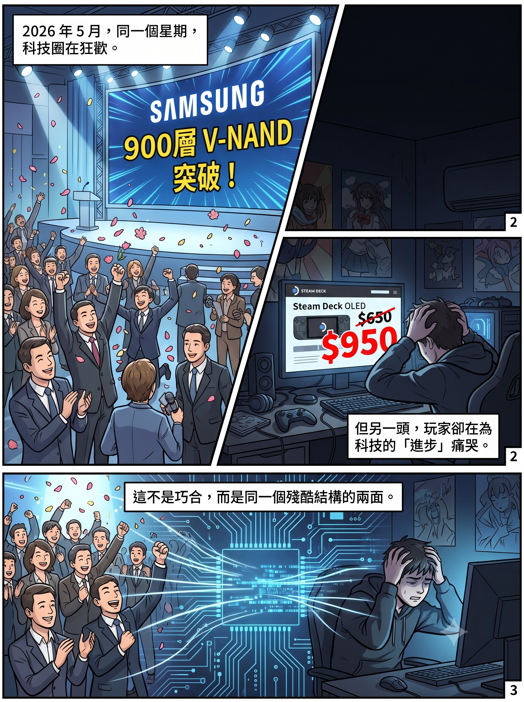

# The Truth Behind 900 Layers: When Your Switch and Steam Deck Are Footing the Bill for AI

## Two Headlines, One Week

In the last week of May 2026, two news stories appeared on tech media almost simultaneously.

The first: Samsung announced the successful development of the world's first 900-layer V-NAND prototype chip. Media headlines erupted in celebration — "Major Breakthrough in Memory Technology," "Reshaping the Flash Memory Competitive Landscape," "The Storage Revolution of the AI Era."

The second: Valve announced a steep price hike for the Steam Deck OLED, with the 1TB version jumping from $650 to $950 — a 46% increase. The reason was a single sentence: "rising memory and storage costs."

In the same week, one side was celebrating a memory technology "breakthrough," while on the other side consumers were paying for memory shortages. This is no coincidence — it is two faces of the same structural problem.

---

## 900 Layers Is Not 900 Layers

Let's start with that "breakthrough."

Samsung's 900-layer V-NAND was not etched from top to bottom as a 900-layer structure on a single wafer. It uses a technology called CMB (Cell Multi-Bonding) to bond two 450-layer wafers together, forming a 900-layer package.

This distinction matters.

Think of building a skyscraper. Traditional 3D NAND builds layer upon layer on a single foundation. Going from 64 layers to 128 is manageable; reaching 232 starts to get painful; above 300 layers, you approach physical limits — the aspect ratio of etched holes becomes absurd (equivalent to drilling a straw from the top of Taipei 101 down to the underground car park), yields plummet, stress and warpage spike, and costs rise not linearly but exponentially.

Samsung's approach: instead of building one 900-storey skyscraper, build two 450-storey towers and connect them with a skybridge.

This is genuinely difficult engineering — bonding precision, warpage correction, and electrical connectivity are all real technical challenges. But it is an entirely different order of achievement from "etching 900 layers on a single wafer." More critically: this is a laboratory prototype, not a production product. Samsung's actual highest layer count in mass production is 286 layers (V9); the next generation V10 (approximately 430 layers) is not expected to enter mass production until the second half of 2026. Between prototype and mass production lie several mountains: yield, cost, endurance, and stability.

But media headlines won't tell you any of this. The three characters "900 layers" are enough to make a stock price jump, enough for a KOL to publish a "NAND Technology Breakthrough" explainer. As for the difference between 450+450 and a true 900 layers — that's left for those who can tell the difference.

---

## What Matters Is Not the Layer Count, but the Direction

The truly significant aspect of Samsung's CMB technology is not the number "900" but the industry direction it reveals: NAND is following HBM's well-worn path.

What was the essential revolution of HBM? Not making individual DRAM chips larger, but stacking many of them using TSV (through-silicon via) technology. Now NAND is heading down the same road — no longer pushing for the maximum layer count on a single wafer, but using advanced bonding techniques to combine multiple wafers into a single system.

This signals a common pivot across the entire memory industry: from "process shrinking" to "packaging integration." CoWoS, SoIC, and Foveros on the CPU/GPU side; TSV stacking on the HBM side; CMB on the NAND side — the underlying logic is the same. Physical limits have been reached; rather than continuing to shrink, the strategy is to turn multiple dies into one system.

This also means that the competitive core for NAND manufacturers will shift from "who stacks higher" to "who bonds better" — bonding precision, bonding density, bonding yield, bonding cost. And predictably, once bonding technology matures, product differentiation between manufacturers will narrow further. An SSD assembled via CMB and a competitor's SSD assembled via Hybrid Bonding will ultimately ship to the same specification. Different technical paths, same destination — still a commodity.

Here's a prediction for something about to happen: the "Layer Count Definition War." If 450+450 can be called 900 layers, can 256+256+256 be called 768 layers? Marketing departments will inevitably start playing number games. Comparing "layer counts" across manufacturers will become like comparing "megapixels" on smartphones — the numbers keep getting bigger, but their actual meaning becomes increasingly blurred. For the stock market, however, blurriness is the best fuel — every "new record" feeds another round of explainers, another wave of buy signals, another batch of retail investors entering the market. The technical breakthrough is real, but the speed at which it gets translated into investment narrative is always ten times faster than the speed at which it becomes a mass-produced product.

---

## But None of This Is What Ordinary People Should Care About

The above is technical analysis. For most people, the real question that hits home is not how many layers Samsung's NAND has stacked, but: why has my gaming console suddenly become so much more expensive?

The answer is simple: you are footing the bill for AI's memory appetite.

In May 2026, Nintendo announced a $50 price increase for the Switch 2 in the United States (from $449.99 to $499.99), effective September 1. Japan moved even earlier, adding ¥10,000 from May 25. Even Nintendo Switch Online subscriptions went up. Nintendo's official wording was "changing market conditions," but the financial report was explicit: rising memory costs imposed approximately ¥100 billion in additional operating costs for the fiscal year. Nintendo itself expects post-hike unit sales to drop from nearly 20 million the previous year to 16.5 million. Raise prices to save margins, sacrifice volume — this is the reality of memory cost pass-through.

The same week, Valve raised the Steam Deck OLED 1TB from $650 to $950, and the 512GB from $550 to $790. A 1TB Steam Deck now costs more than a PS5 Pro. Valve explicitly cited rising memory and storage costs, and even delayed the pricing and launch of the Steam Machine and Steam Frame VR headset for the same reason.

Sony has already raised PS5 prices, with increases up to $150. Microsoft raised Xbox prices. Sony is even considering delaying the PlayStation 6 to 2028 or even 2029. Nintendo's stock price has fallen more than 30% year-to-date in 2026 under memory cost pressure.

The entire gaming industry is being reshaped by memory shortages. The root cause is Samsung, SK Hynix, and Micron redirecting massive production capacity from consumer-grade DRAM and NAND to the more profitable AI-oriented HBM. IDC analysts used a weighty term: "Structural Reset" — this is not a traditional cyclical fluctuation but a fundamental shift in how memory production is allocated. AI infrastructure's priority, in the supply chain food chain, ranks above your gaming console, your smartphone, and your laptop.

There is a deeper layer of irony here that most people do not see.

The memory-devouring GPUs in AI data centres — NVIDIA's H100, B200 — exist because over the past two decades, generation after generation of PC gamers bought graphics cards, subsidising NVIDIA's R&D costs for parallel computing (CUDA). Those GPUs' large-area dies can be mass-produced because TSMC honed its extreme yield rates for large dies using gaming GPU orders. In other words: **gamers are the unwitting financiers of the AI revolution — the money they spent buying GeForce cards nurtured the very industry that is now stealing their memory supply.**

And now NVIDIA's approach is even more direct. Facing the enormous profits from AI orders, NVIDIA plans to cut consumer RTX 50 series GPU supply by 30% to 40% in the first half of 2026, with some models discontinued outright — because the same memory chips generate several times more revenue when installed in AI servers than in gaming graphics cards. NVIDIA can make this trade-off without hesitation, not because it doesn't care about the gaming market, but because its CUDA ecosystem has locked the entire global AI industry in — AI customers have no choice but to buy from NVIDIA, so NVIDIA can always prioritise the most profitable end of the market.

The causal chain is long: gamers' money nurtured NVIDIA → NVIDIA's CUDA locked in the AI industry → AI's memory hunger cannibalised gaming's component supply → gaming consoles got more expensive, and gamers foot the bill again. The invoice went full circle and landed back on the same group of people. In my book [*Game Victory: From Pixels to AI, How Entertainment Secretly Reshaped Global Tech Supremacy*](https://mythogenengine.com/en/), I spent eleven chapters tracing this forty-year causal chain from gaming to AI — memory price hikes are merely the latest deferred invoice on this chain.

---

## The Cracks Have Already Appeared

But the story doesn't end here. Even as the "demand exceeds supply" narrative remains at full volume, cracks have quietly appeared.

In late March 2026, Google released an AI memory compression technology called TurboQuant, capable of reducing AI inference memory usage to one-sixth. The moment the news broke, Samsung fell 4.71%, SK Hynix fell 6.23%, Micron fell 6.97%, and Sandisk plunged 11.02%. Cloudflare's CEO called it Google's "DeepSeek moment."

The market's reaction was brief — analysts quickly emerged to say "no impact on the big picture," "AI demand remains strong," "the pullback is a buying opportunity." But TurboQuant proved one thing: software-level optimisation can significantly compress the memory requirements of individual workloads. The foundational assumption propping up the narrative that HBM demand will explode forever — "AI models' memory efficiency cannot improve significantly" — is being challenged by technological progress.

The consumer spot market is also loosening. DDR5 spot prices have cumulatively fallen 30% to 40% over the past month. Buyers are starting to wait and see, expecting further downside. DDR5 retail prices have pulled back, though the industry emphasises that contract prices remain stable. Spot and contract markets are telling two different stories — and history tells us that spot prices are usually leading indicators.

Memory prices are expected to peak in Q3 to Q4 of 2026, then begin a slow decline. New capacity — Samsung's Pyeongtaek P4, SK Hynix's M15X, Micron's new US fab — will come online progressively between 2027 and 2028. But most of this capacity is built for AI and HBM; relief for consumer-grade supply may take even longer.

---

## The Most Ironic Hedge

In this entire situation, the most ironic thing is an "investment tip" circulating on social media: think your SSD was overpriced? Buy memory stocks to "hedge."

The logic sounds clever, but it has a fatal blind spot: memory stocks are cyclical stocks.

When the cycle reverses and memory prices crash — and history tells us that day will inevitably come — your stocks will fall. But the Switch 2 and Steam Deck you already bought at inflated prices won't give you a refund. That $950 Steam Deck you purchased? After memory prices come back down, Valve won't be mailing you a $300 rebate cheque.

The so-called "hedge" — buying at the cycle top — loses on both sides.

A real hedge is not chasing a cyclical stock at its historic peak. It's understanding what kind of market structure you're facing, and then making the least self-damaging choice within that structure: if you don't urgently need something now, wait; if you do, buy — but don't deceive yourself into thinking that buying memory stocks will let you "earn it back."

---

## Conclusion: Technology Is Advancing, but Your Wallet Is Retreating

Samsung's 900-layer NAND is a real technological achievement, but it is a laboratory prototype — not a mass-production product that will make your SSD cheaper tomorrow. The NAND industry is pivoting from "stacking higher" to "bonding together" — an important technical shift, but one that will not change NAND's commercial essence as a commodity.

Meanwhile, AI's insatiable appetite for memory is reshaping the entire consumer electronics pricing system. Your gaming console is getting more expensive, your smartphone is getting more expensive, your laptop is getting more expensive — not because they've gotten better, but because the components used to make them have been commandeered by AI.

While KOLs celebrate memory stocks doubling, while investment banks name the next "AI beneficiary sector," while pastel-coloured infographics teach you to buy six stocks that will double — the person actually footing the bill for this feast is you, walking into a game store after September 1 and discovering that the Switch 2 is another $50 more expensive.

And when this cycle finally reverses — not "if" but "when" — those who bought memory stocks at the top will discover: AI companies' capital expenditure will decelerate, memory prices will crash, stocks will be halved. But your gaming console won't get cheaper for it, and your SSD won't be refunded. In this structural wealth transfer, retail investors are always the last to enter and the first to be harvested.

---

_This article is the third in the "Memory Myth" series. The first, [Did Jensen Huang Tell You to Buy These Six Stocks?], deconstructed investment misinformation on social media. The second, [HBM Is Not the Next TSMC: The Structural Chasm Between Memory and Logic], analysed the cyclical nature of the memory industry from the structural level. Together, the three form a complete observation: the technology is real, the demand is real, but the narrative has been packaged — and the people paying for that packaging are never the ones telling the story._

_If you want to know how gamers became the unwitting financiers of the AI revolution, step by step — from DirectX locking in developers, to CUDA locking in the entire AI industry, to TSMC using gaming GPU orders to hone advanced process yields — [*Game Victory: From Pixels to AI, How Entertainment Secretly Reshaped Global Tech Supremacy*](https://mythogenengine.com/en/) traces the complete forty-year causal chain. Memory price hikes are not where the story begins, nor even where it ends. They are simply the invoice on this chain that is closest to you._

