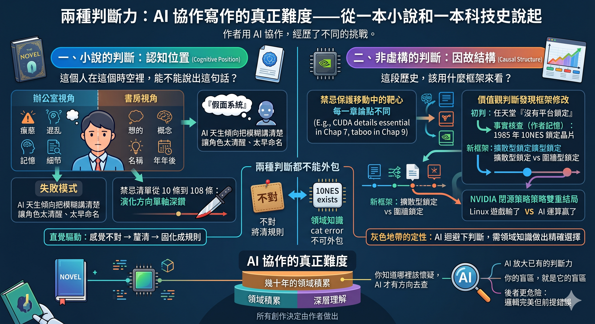

I wrote a novel using AI, and then a history of technology.

With the novel, I could feel it when the AI made a mistake.
With the technology history, I couldn't.

Because it wrapped a flawed judgment inside a logically perfect argument. The rhythm was beautiful, the reasoning rigorous; it looked more like deep analysis than my own first draft.

It wasn't until I fished out a counterexample from my own memory—the kind AI can't find via search—that the entire framework collapsed.

Two kinds of writing, two kinds of judgment, two entirely different ways to fail.

AI amplifies the depth you already possess.
Your blind spots are its blind spots.

Full text:

# Two Kinds of Judgment

## The True Difficulty of AI Collaborative Writing—Starting from a Novel and a History of Technology

I wrote two books with AI.

The first is a story about an engineer crushed by a workplace system, only seeing the full picture after the fact. The second is *GameVictory*, a Traditional Chinese non-fiction book subtitled "From Pixels to AI: How Entertainment Secretly Reshaped Global Tech Hegemony"—tracing the 40-year history of PC gaming to argue that every major shift in tech hegemony was fundamentally the accidental result of a group of people wanting to play better games.

Both books used AI as a collaborator. Neither was a "tell AI to write, humans revise" model. Both required an evolving set of writing instructions.

But their difficulty structures were completely different.

Because the word "judgment" means two completely different things in these two books.

---

## I. Judgment in a Novel: Could This Person Say This in This Time and Space?

The novel had a writing taboo: "Lin Zhao-ming cannot name abstract concepts in the office." Behind this lies the cognitive design of the whole book. The novel is divided into the office perspective and the study perspective. The protagonist in the office can only feel, be confused, and remember details. Turning feelings into concepts—naming them—is the privilege of the study, an ability only acquired when looking back years later.

If the AI had the protagonist say the words "Persona System" in an office scene, the cognitive arc of the entire book would collapse.

This rule wasn't there from day one. It emerged when I was writing a certain chapter, and the AI produced text that was "technically flawless, grammatically fluent, and logically sound." But reading it, I felt something was wrong. It took me half a day to figure out: the problem wasn't the wording, it was the cognitive position. It's not that the protagonist couldn't say those words; it's that in that time and space, he hadn't yet reached a position where he could.

This is the essence of "judgment" in a novel: **the object of judgment is the cognitive position.** What the character knows, doesn't know, or thinks they know at this exact moment. AI's failure mode is making the character too lucid, naming things too early, having too much agency—because AI naturally tends to clarify the ambiguous. And what a novel needs is exactly to preserve that ambiguity.

One hundred and eight taboos, all doing the same thing: preventing the AI from crossing a cognitive boundary. The direction was locked from day one—to write about how someone crushed by a system sees the full picture only afterward. The rules got more and more detailed, but they always protected the same thing.

---

## II. Judgment in Non-Fiction: What Framework Should Be Used to View This History?

There were also taboos in the writing instructions for *GameVictory*. Five of them: no nostalgic tone, no academic tone, no manual tone, no heartwarming endings, no list-making.

But these five taboos don't protect a fixed cognitive position. They protect a moving target—the core argument of each chapter is different, and the boundary of "what counts as a manual tone" changes every time.

The technical details of CUDA's four-layer lock are the core weapon of the argument in Chapter 7. If those same details appeared in Chapter 9 (about Lisa Su), it would be a manual tone—because Chapter 9's argument doesn't need it. AI won't make this distinction on its own. I had to recalibrate the boundary of "details serving the argument" before starting each chapter.

But that's not the hardest part. The hardest part is: **value judgment in non-fiction writing isn't about protecting a known stance; it's about discovering that the stance itself needs revision during the writing process.**

Let me give a specific example.

Chapter 11 of *GameVictory* is about Nintendo and Sega. In the fourth draft (v4) of the final chapter, there was a sentence: "Sega and Nintendo—the only two companies that didn't establish platform lock-in—one died, and the other lives on an isolated island."

When I wrote this down, I thought it was right. It was neat, powerful, and formed a beautiful contrast with the pattern of the previous ten chapters.

Then I remembered it myself: Nintendo embedded the 10NES lockout chip in NES cartridges in 1985—ten years before Microsoft's DirectX. Its licensing system was so draconian that it was unparalleled in its era.

The judgment "didn't establish platform lock-in" was wrong.

But the correction wasn't simply changing "didn't" to "did." If Nintendo "had a lock," how was it different from Microsoft's DirectX or NVIDIA's CUDA? Why did it lock its system for forty years without becoming the infrastructure for tech hegemony?

This question forced out a brand new analytical framework: **Diffusive Lock-in vs. Walled-Garden Lock-in.**

DirectX's lock diffuses outward—from PC games penetrating the entire Windows development ecosystem. CUDA's lock diffuses outward—from gaming GPUs penetrating global AI infrastructure. Nintendo's lock doesn't diffuse outward—the boundary stops at its own platform; it never tried to make its technical standards into industry standards.

This framework wasn't found through fact-checking. Fact-checking only told me "Nintendo had a lock." **The classification dimension of "diffusive vs. walled-garden" was a value judgment I was forced to make in the process of correcting a factual error: what dimension I chose to view the lock.**

This judgment changed the entire structure of the final chapter. "Eight variations, one absence" became "Eight diffusions, one walled garden, one unlocked." The counting changed. The mirror paragraphs changed. The hidden spine of the whole book went from one thread to two.

This doesn't happen in a novel. The cognitive framework of a novel is basically stable after the outline is set—you need to protect it, but you don't need to rebuild it during the writing process. A non-fiction framework will be repeatedly remodeled by its own discoveries.

---

## III. Neither Judgment Can Be Outsourced, but the Ways They Fail Are Completely Different

When judgment in a novel goes wrong, you can usually feel it.

If AI has a character name a concept in the office, you'll read it and feel "this is wrong"—even if you can't articulate why at first. That intuition of "wrongness" is reliable because you are the author of the story; you know what state this person should be in at this time and space. Your job is to translate that intuition into rules. The process is slow, but the direction is certain.

When judgment in non-fiction goes wrong, sometimes you don't feel it—and AI can't help you either.

"Nintendo didn't establish platform lock-in"—when this sentence was written down, I thought it was right. It was logically self-consistent, narratively beautiful, and formed a neat contrast with the pattern of the first ten chapters. AI also thought it was right. If I asked AI to "check this paragraph for factual errors," it wouldn't trigger any alarms—because in AI's knowledge base, the association strength between the words "Nintendo" and "platform lock-in" is far lower than between "Microsoft" and "platform lock-in."

The person who discovered the problem with this sentence was me. Not the AI.

I knew there was a 10NES lockout chip in the 1985 NES cartridge. I knew Nintendo's licensing system at the time was so draconian that developers complained bitterly. This is my own domain knowledge—decades of accumulated fundamental understanding of gaming hardware history. Because I knew this, I was able to fish out a counterexample from my own memory when I read "didn't establish platform lock-in."

AI can't fish out this counterexample. It's not that it can't search—it's that it doesn't know what to search for. "Did Nintendo have platform lock-in?" is a question you only ask when you already doubt the answer. And the premise of doubting is that you yourself first know the 10NES exists.

The relationship between NVIDIA's closed-source drivers and Linux gaming is the same structure. Chapter 6 writes about why Valve chose AMD over NVIDIA as the GPU partner for the Steam Deck—the foundation of this judgment is that I knew NVIDIA's Linux drivers are closed-source, AMD's are open-source, and Valve needed end-to-end control of the translation pipeline. AI can help me check the open-source status of GPU drivers, but the causal chain of "the difference between open and closed source will affect Valve's platform choice" was built by me. AI won't actively build this connection—because it doesn't know this connection is important.

This is a danger unique to non-fiction writing: **A wrong factual premise can support a logically perfect wrong argument. And the more perfect the logic, the less likely you are to doubt the premise.** AI's fact-checking is only useful if you point it in the right direction. If you yourself don't know Nintendo had 10NES, running a few more rounds of checks won't trigger that problem.

So what kind of fact-checking can AI help with? The verification of specific numbers. After Chapter 7 (CUDA) was delivered, I knew which numbers needed checking—the release year of CUDA 1.0, the naming lineage of Tesla GPUs, the starting year of cuDNN, the pricing of GeForce 8800 GTX—and then I asked AI to verify them one by one. The result found four errors. These weren't style drift; they were hard errors. But the point is: **I have to know what to check first before AI can help me check it.**

The taboo list in a novel is driven by intuition—feels wrong → clarify → solidify into a rule. The gatekeeper in non-fiction isn't the AI's checking program, it's the author's own domain knowledge. You know where to doubt, so AI has a direction to check. Where you don't know, AI is just as blind as you are.

---

## IV. The History of Technology Isn't Black and White—But AI Naturally Wants to Turn Gray into Black and White

There is another kind of judgment in non-fiction writing that is completely different from novels: **characterizing the gray areas.**

"Is NVIDIA's closed-source strategy good or bad?"

If you ask AI this question, it will give you a balanced answer: "Closed-source has both pros and cons, it depends on the specific context." Technically correct, but completely useless.

The judgment in *GameVictory* is: NVIDIA's closed-source strategy achieved completely opposite results on two battlefields. In Linux gaming hardware, closed-source made it lose—Valve needed end-to-end control of the translation pipeline, closed-source drivers prevented this, so Valve chose AMD. In AI computing, the same closed-source strategy made it win—CUDA's lock is four layers deep, and no matter how open-source AMD's driver layer is, it can't touch the top three layers.

**The same company, the same strategy, two opposite results.** This judgment isn't "balanced"—it's precise. It rejects the moral simplification of "open-source good vs. closed-source bad," but it's not a vague two-sided argument either. It explicitly points out: the depth of the lock determines the effect of the strategy.

AI can't make this judgment. Not because it's not smart enough—it's because this judgment requires you to first see through the hidden thread between Chapter 6 and Chapter 7, and that hidden thread only emerges during the writing process. You can't put "the dual ending of NVIDIA's closed-source strategy" into the prompt on day one—you have to finish writing Chapter 6 (why Valve chose AMD), then finish writing Chapter 7 (why CUDA couldn't be pried open), before you can look back and see that thread.

Novels also have characterizations of gray areas. "Is management lying, or do they genuinely believe their own version?"—it wasn't until I wrote Chapter 18 that I discovered the answer is "Neither—their calculation has become instinct, the mask has fused with the face." This judgment is equally precise, and equally something AI cannot do for you.

But the difference between the two lies in this: the gray area in a novel is the grayness of human nature—you rely on your understanding of people. The gray area in non-fiction is the grayness of causality—you rely on your understanding of systems. AI has blind spots for both, but the shapes of the blind spots are different.

AI's blind spot when dealing with the grayness of human nature is: it tends to make characters too rational, too self-aware, and too quick to see the situation clearly. The correction direction is to suppress the character's cognition and maintain ambiguity.

AI's blind spot when dealing with the grayness of causality is: it tends to give a balanced argument that "both sides have a point," avoiding making a judgment. The correction direction is to force it (or more accurately, force yourself) to make a precise characterization—not "it has pros and cons," but "under what conditions is it good, under what conditions is it bad, and what is the difference in those conditions."

---

## V. The Direction of Rule Evolution is Different

The taboo list for the novel grew from ten rules to one hundred and eight. The direction of evolution is **single-axis deep drilling**—digging finer and finer within the same cognitive framework. The first version's taboo was "don't let the protagonist know the truth"—coarse-grained. By rule 108, the taboo had become as fine as "you cannot write the colleague's financial pressure as fake or self-inflicted—the pressure is real, but its source is a high-leverage choice." The direction hasn't changed; the precision has improved.

The rule evolution direction for *GameVictory* is **structural reorganization**.

Writing up to Chapter 6, I discovered that a "lock" isn't just a pattern, but has a depth dimension—DirectX is a shallow lock (one API layer, can be translated), CUDA is a deep lock (four layers stacked, impossible to translate). This discovery wasn't adding details to an existing framework; it was an upgrade of the framework itself. The pattern tracking table in the outline upgraded from 1D (the variation of "convenience → lock-in → monopoly") to 3D (direction of variation × depth of lock × dual ending of NVIDIA's closed-source strategy).

Then in Chapter 11, the framework of "three kinds of locks, three endings" appeared—diffusive, walled-garden, unlocked—another structural reorganization. The concluding logic of the final chapter thus shifted from a dichotomy of "locked vs. unlocked" to a more analytically deep trichotomy.

Rule evolution in a novel is like sharpening a knife—the same knife, getting sharper and sharper. Rule evolution in non-fiction is like changing maps—you think you're fighting on a plain, but after walking through six chapters, you realize the terrain is 3D and some battlefields are underground.

And every time you change maps, it means you have to go back and check if the arguments of all previous chapters have been overturned by the new framework. The discovery in Chapter 6 had to be poured back into Chapter 2—when readers finish Chapter 2, their understanding of a "lock" must be able to support the upgrade in Chapter 7. The discovery in Chapter 11 had to be poured back into the final chapter—the counting had to change, the mirror paragraphs had to change, the final arithmetic of the whole book had to change.

Novels don't need this kind of backflow. The character's cognitive change in Chapter 18 won't overturn the scene in Chapter 3—because the scene in Chapter 3 is fixed on the character's timeline. The timeline in non-fiction doesn't belong to the character—it belongs to the argument. Once the argument is upgraded, the arguments of all chapters must be recalibrated.

---

## VI. AI is a Mirror, but the Two Mirrors Reflect Different Things

The most important function of AI isn't output; it's reflection. You provide a prompt, AI reflects it back, and by looking at that reflection, you know what's right and what's wrong.

This observation is equally true in non-fiction writing—but what the mirror reflects is different.

The novel's mirror reflects the gaps in your understanding of people. AI writes a "technically flawless" scene, and you read it and feel it's fake—that feeling of "fakeness" is the mirror telling you: you haven't fully thought through this character's internal state at this moment.

Non-fiction's mirror reflects the gaps in your understanding of the system. AI writes a "logically self-consistent" argument, and you read it and feel it's shallow—that feeling of "shallowness" is the mirror telling you: you've only seen the surface layer of the causal structure of this history.

For CUDA's four-layer lock in Chapter 7, the initial draft only had two layers (hardware instruction set and library). AI's output made me feel "right, but not enough." That "not enough" forced me to think: what else is there that AI hasn't written, and that I myself haven't thought through clearly? And then the third layer (framework binding) and the fourth layer (knowledge binding) were forced out. Especially the fourth layer—"GPU computing courses at global universities are taught using CUDA, textbooks use CUDA for examples, and CUDA answers on Stack Overflow outnumber ROCm by fifty times"—this layer isn't a technical lock-in; it's a cognitive lock-in. It changed the weight of the entire argument.

AI didn't discover the fourth layer. I didn't discover it through inspiration either. It was because AI's output wasn't good enough, which forced me to pursue "why isn't it good enough," and the process of pursuing pushed me to a place I hadn't originally reached myself.

The value of the mirror doesn't lie in what it reflects. It lies in forcing you to face your own blurry parts. On this point, both kinds of writing are the same.

---

## VII. Two Kinds of Difficulty, One Core That Cannot Be Outsourced

After writing the two books, my conclusion is:

The distinction between formulas vs. mentalities is just the first layer. The real distinction is: **what are you judging?**

The judgment in a novel is: could this person say this in this time and space? (Cognitive position)
The judgment in non-fiction is: what framework should be used to view this history? (Causal structure)

Neither judgment can be outsourced to AI. But they fail in different ways:

AI failure in a novel is style drift—the character is too lucid, names things too early. You can feel it. Correction relies on intuition.
AI failure in non-fiction has three types—factual errors (you can't feel them), frameworks that are too shallow (you can feel them but need time to pursue), and the characterization of gray areas being flattened (AI naturally tends toward balanced arguments). Correction relies on intuition plus domain knowledge—and only you have the domain knowledge.

Rule evolution in a novel is sharpening a knife—direction remains unchanged, precision improves.
Rule evolution in non-fiction is changing maps—the framework itself is remodeled by your own discoveries during the writing process.

But the two have a common core that won't change regardless of the subject matter:

**You must have an understanding of what you are doing that is deep enough for you to judge whether every AI output is "right" or "close but wrong."**

That judgment cannot be outsourced by any prompt. Whether you are writing a novel or a history of technology.

The only difference is that a novel's "close but wrong" hides in a character's line of dialogue. The history of technology's "close but wrong" might hide in a year you thought was correct, a framework you thought was self-consistent, or a sentence you thought was a fact but is actually a value judgment.

The latter is more dangerous. Because it doesn't trigger intuition—and AI is just as blind as you are.

So AI collaboration in non-fiction has one more prerequisite than a novel: **you yourself must understand it first.** It's not "understanding how to use AI"; it's understanding the domain you are writing about—understanding it well enough that you can fish out a counterexample from your memory that AI won't search for you, understanding it well enough to know which numbers need checking and which causal chains need doubting. AI's checking ability is only useful when you point it in the right direction. The direction itself is determined by your decades of fundamental understanding.

This isn't a problem of discipline. Discipline can help you check a few more numbers after you submit the draft. But a question like "did Nintendo actually have platform lock-in?" can't be found through discipline—only if you yourself know the 10NES exists will you ask this question.

So the final conclusion is sharper than the first article: AI collaboration isn't just "judgment cannot be outsourced." It's that **domain knowledge cannot be outsourced**. And domain knowledge isn't something you get by reading a few articles—it's what you have after soaking in that domain for decades, making mistakes, correcting your understanding, and accumulating a set of intuitions.

AI amplifies your existing judgment. However deep you are, that's how far it can help you go. Your blind spots are its blind spots.

---

*The author wrote a literary novel and a book on the history of technology using AI tools. In both projects, AI served as a mirror, a draft generator, and a quality check tool. All creative decisions and value judgments were made by the author.*
