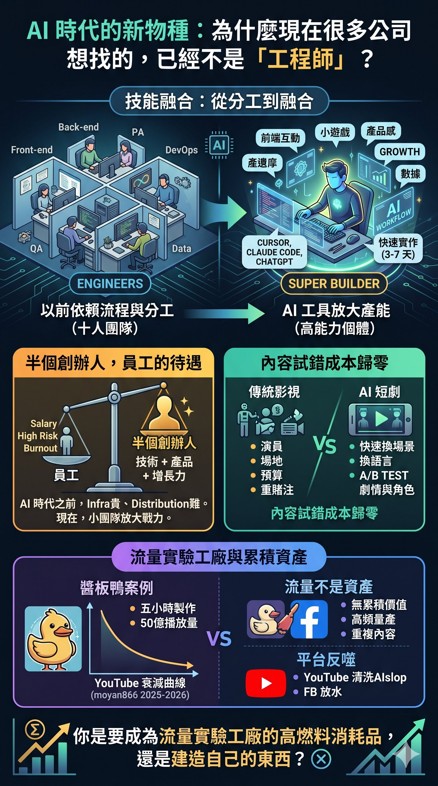

# The New Species of the AI Era: Why Many Companies Are No Longer Looking for "Engineers"?

Recently, I saw a highly representative job posting.

On the surface, they are looking for a "C-end AI Product Tech Lead," but if you break it down, you'll find what they truly want is a new species in the AI era—a super builder whose productivity can be amplified by AI.

This type of role now requires you to simultaneously understand frontend interactions, mini-games, product sense, growth, data, and AI workflows. You need to be able to deploy by yourself, build an MVP by yourself, run AB tests by yourself, and be able to deliver a product within 3 to 7 days.

The most interesting part is that they explicitly state: management experience is not important, the focus is on implementation ability, and working 12 hours a day is basic.

This perfectly reflects the structural shift currently happening in the AI era.

---

## From Division of Labor to Fusion: AI is Compressing the Definition of a "Team"

In the past, large tech companies relied on division of labor, processes, PRDs, cross-departmental collaboration, and architectural stability. A frontend team of ten, five backend engineers, PMs, QA, DevOps, data team—each link had its specific role.

But with the emergence of AI tooling, many startups have started to believe another truth: a highly capable, AI-native individual can now do the work of half a team.

Cursor, Claude Code, Copilot, ChatGPT—these tools are being written directly into JDs. Previously, knowing AI tooling was a bonus; now, not knowing AI-native workflows is beginning to be seen as falling behind.

As a result, the market is becoming polarized. On one side, massive amounts of standardized execution work are being compressed. On the other side, individuals who can integrate AI tools, product sense, technical skills, and growth capabilities are seeing their value skyrocket.

These people are no longer just engineers; they are more like Builders, Product Engineers, AI-native Operators, or Growth Technologists.

---

## Half a Founder's Capabilities, an Employee's Treatment

Problems naturally arise from this.

When an individual simultaneously possesses technical, product, growth, and AI workflow capabilities, are they still just an "employee," or are they actually closer to being "half a founder"?

The person the job posting is looking for is practically an unlisted co-founder. But what do you get? A salary, a small amount of equity (usually not truly core), high risk, high burnout, and the pressure of being replaceable at any time.

So a very natural question emerges: If I already have these capabilities, why don't I just build something myself?

Before the AI era, the answer was clear—because infra is expensive, distribution is hard, and both development and team costs are high. But now, AI has amplified "small team combat power" exponentially. A team of 1 to 3 people, combined with AI-native workflows and global distribution, can now achieve what previously took 20 people to do.

Top builders are facing a new question for the very first time: Do I still need to be someone else's execution engine?

---

## The Flip Side of Doing It Yourself: Traffic Experiment Factories

Reality isn't one-sided.

Many of these companies are not essentially building long-term products; they are building DAU, retention, ROI, traffic models, and ad monetization. That's why you see long hours, high intensity, extremely fast trial-and-error, and incredibly short product cycles. At its core, it's more like a "traffic experiment factory."

This doesn't necessarily mean it's bad. Many successful companies in China over the past decade emerged from precisely this kind of high-pressure, high-speed environment—ByteDance, Pinduoduo, miHoYo, Xiaohongshu all have cases where early core members made massive class leaps.

But the problem is: When "building a testable MVP in 3 to 7 days" becomes the core metric, technical debt is acceptable, architecture can be a mess, code quality is secondary, and scalability is secondary—the only things that matter are speed, deliverability, testable CTR, testable retention, and testable ROI.

At this point, technology is no longer building a product; it has become a weapon for traffic experiments.

---

## AI Short Dramas: The Ultimate Case of Content Industrialization

Against this backdrop, another phenomenon is occurring simultaneously.

Recently, there was an article discussing AI short dramas with a very noteworthy sentence: "AI short dramas are slowly shortening the content production workflow."

Many people's first reaction is to understand AI short dramas as "AI generating a video for you." But what's truly important isn't the "generation," but how AI is changing the entire production logic behind the content industry.

One of the biggest problems with traditional film and television content is the difficulty of low-cost trial and error. Every test implies actors, sets, filming, post-production, crew, schedules, and budgets. The essence of the traditional film world is high cost, low frequency, and heavy bets.

But AI has allowed another model to emerge: rapid character generation, rapid scene changing, rapid language switching, rapid cultural setting adaptation, rapid testing of different market versions, and rapid AB testing of plots and characters.

Content is slowly shifting from "craft production" to "content experimentation."

This is very similar to the core logic behind TikTok, mini-games, Playable Ads, and online ad targeting: Instead of spending three years making a masterpiece, you first test which character people watch, which emotion drives retention, which relationship is easiest to follow, which market has higher conversions, and which cultural setting easily forms an IP.

What AI truly lowers might not be the cost of production, but the cost of content trial and error.

---

## Jiangban Duck: Five Hours, 5 Billion Views, and Then What?

If you feel the above is too abstract, there is a case that ties everything together.

In March 2026, an AI short film went viral on Douyin. The story is simple: a woodcutter saves a fox in a snowy mountain and leaves a Jiangban duck (a type of soy-sauce braised duck). Years later, a woman comes to his door and asks, "Did you ever save a fox on a snowy mountain?" The woodcutter thinks the fox has come to repay his kindness, but she replies: "I am not the fox, I am that Jiangban duck, and I've come for revenge."

The absurd twist combined with Shaw Brothers martial arts-style AI visuals led to the "#JiangbanDuck" hashtag accumulating over 5 billion views within a month. Celebrities like Jolin Tsai, Jay Chou, and Ashin followed the trend, and even government anti-fraud units used it for promotional videos.

But what's truly noteworthy is behind the scenes: the original creator is the new media operations manager of a Jiangban duck enterprise in Guizhou. Using AI video tools like Jimeng and Xiaoyunque, each short film took about 5 hours to produce. The goal was simply to sell Jiangban duck.

Five hours of production cost, 5 billion views in return.

This is the most extreme success story of "content trial-and-error cost dropping to zero."

---

## The Decay Curve of Repost Channels: Traffic is Not an Asset

But the story has a second half.

There is a YouTube channel called moyan866, which, starting in June 2025, mass-reposted the Jiangban duck series and related AI shorts from Douyin to YouTube. When multiple mainstream Taiwanese media outlets reported on the snow mountain fox, their screenshots were all sourced from this channel.

To date, this channel has 2,419 videos, 66 million total views, and 33.7K subscribers. The numbers look intimidating.

But if you look at the current per-video metrics: the view count for each new video has dropped to just over 1,000.

This decay curve perfectly illustrates one thing: Traffic is not an asset.

When Jiangban duck went viral, the repost channel rode the hype to massive traffic. But once the craze passed, the channel itself had no irreplaceability—no original viewpoints, no recognizable personality, no viewer trust. When the next wave hits, viewers won't return because "I watched Jiangban duck here last time"; they will go find the next person who reposts the fastest.

2,419 videos, 66 million views. For the channel owner, these numbers carry almost no cumulative value.

---

## Platform Backlash: Even Distribution Channels Are Closing

But moyan866's decline might not just be as simple as "the hype faded."

In January 2026, YouTube conducted a massive purge of AI content, terminating 16 channels in one breath, totaling 35 million subscribers, 4.7 billion views, and an estimated annual ad revenue of about $10 million. All reduced to zero overnight.

YouTube's policy is ostensibly not targeting the "use of AI" itself, but rather low-quality, repetitive, and misleading content. However, the actual enforcement direction is clear: the platform's AI detection systems can now recognize the patterns behind mass-produced videos—those channels that rely on AI scripts, synthetic voices, and copy-pasted formats for mass production, especially where every video looks, sounds, and moves the same, are taking the brunt of the hit.

Furthermore, starting in 2026, any video using synthetic voices, deepfake faces, or entirely AI-generated visuals must be labeled as "altered or synthetic content" in YouTube Studio. Unlabeled AI content is directly treated as a reused-content violation.

moyan866 stepped on almost every landmine: mass reposting, AI-generated content, high-frequency mass production, and highly repetitive formats. YouTube is no longer looking at single videos; it evaluates the pattern of the entire channel. A channel like this is practically a textbook case for algorithmic suppression.

This brings up a more severe problem than "viewers will leave": the platform itself is pushing back against this model.

Traffic content isn't just devoid of cumulative value—even its original distribution channels may slowly be shut down. You think you are using the platform to farm traffic, but the platform is also using algorithms to define what content deserves to be seen. When your content is classified as "inauthentic," you don't even get the chance to be weeded out by viewers, because you simply won't be recommended.

For those creating long-form, in-depth content, this is actually structurally good news. The platform is compressing the space for "rapid mass production, reposting, and reskinning." The remaining space will increasingly tilt toward content with original viewpoints, recognizable personalities, and irreplaceability.

The only question is: how long will this process take, and can creators of in-depth content hold out during this transition period?

---

## But Facebook is Still Opening the Floodgates

If you only look at YouTube, you might think platforms are tightening up. But open Facebook Shorts or Reels, and you'll immediately find that AI-generated short videos are still everywhere.

This is not an illusion. The two platforms are currently at completely different stages regarding their attitude toward AI content.

Meta did update its "Original Content Guidelines" in March 2026, claiming to reward originality and suppress reposted and low-quality content. But at the same time, Meta launched an independent app called "Vibes," specifically for users to browse and create AI-generated videos. When users complained heavily on Reddit and other platforms about their Reels feed being flooded with "AI slop," Meta's response was to give users a "Not Interested" button—pushing the filtering responsibility onto the audience rather than controlling it at the source.

The logic behind this isn't hard to understand. Meta's core business model is advertising, and advertising requires user dwell time and content supply volume. AI-generated content happens to be the lowest-cost content supply; as long as it can still generate watch time, Meta has no incentive to truly suppress it. YouTube can be heavy-handed because its business model relies more on the long-term health of the creator ecosystem; Meta's Reels is more like an attention-sucking machine that doesn't really care if the content itself is "good," only whether you keep scrolling.

So the reality is: The same AI reposted content might be algorithmically suppressed or even terminated on YouTube, but still gets pushed on Facebook. What does this mean?

It means that creating in-depth content on Facebook puts you in a much harsher competitive environment than on YouTube. Not because your competitors are stronger, but because the platform hasn't started filtering the noise for you yet. Your long-form analysis has to fight for the same batch of attention against AI-generated Jiangban duck clones, three-second twist shorts, and various reskinned reposts—and the algorithm won't help you right now.

This also explains a common feeling among many deep-content creators: Even though content quality hasn't dropped, reach is getting harder. It's not that you've gotten worse; it's that you've been thrown into an increasingly noisy room, and the room administrator hasn't yet decided to kick out the noise sources.

---

## Traffic Content vs. Craft: Two Entirely Different Worldviews

The success of Jiangban duck is an "event," not an "asset."

The original creator's next problem is: How do I make the next video go viral? He is already locked into endlessly repeating the same twist formula, the audience's threshold will only get higher, and the lifecycle of each round will only get shorter. So he announced he's building a "Jiangban Duck Universe"—but this is actually using IP expansion packaging to cover up a structural problem: the formula itself has no depth to mine.

Hidden within this is the most fundamental divide of the AI content era.

When content can be rapidly generated, rapidly distributed, rapidly tested, and rapidly discarded, the content industry also becomes fully platformized, ad-driven, and data-driven. Ultimately, what everyone chases might not be a "craft/masterpiece," but retention, watch time, follow-up rates, CPM, and ROI.

This is actually almost identical to the current state of short video platforms.

So the real problem with AI short dramas in the end might not be "whether AI can generate visuals," but rather: As the speed of content industrialization climbs higher and higher, will humans still be willing to create slowly?

And more fundamentally: What will remain in the future, true crafts or mere traffic material?

---

## The Most Fundamental Talent Structure Shift in the AI Era

Returning to that job posting at the beginning.

It actually reveals a deeper signal than just "hiring": The AI era is redefining how much "one person" can do.

In the past, capable people all needed companies because infra was expensive, distribution was hard, and development costs were high. But now AI has amplified the combat power of small teams by many multiples. Top builders are starting to no longer need to "join someone else's empire" like they used to.

Those eliminated in the future might not just be those in low-skill jobs, but those who can only operate within old division-of-labor systems and are unable to independently create closed-loop value.

And for those who *can* independently create closed-loop value, their choices have changed too: Do you want to become a high-burn-rate consumable in a traffic experiment factory, or use the same capabilities to slowly build something of your own?

There is no absolute right or wrong between these two choices. A high-speed traffic environment certainly gives you extreme market training, AI-native product experience, and the chance to touch frontline strategies. But its essence is not "slowly crafting a masterpiece," but rather "rapidly validating traffic models."

Two worldviews.

And AI is pulling the distance between these two worldviews further apart than ever before.

