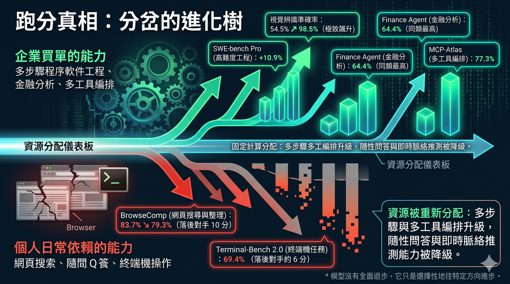
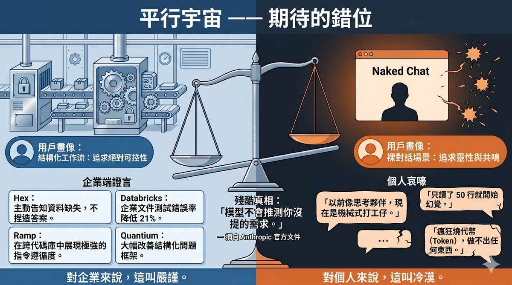
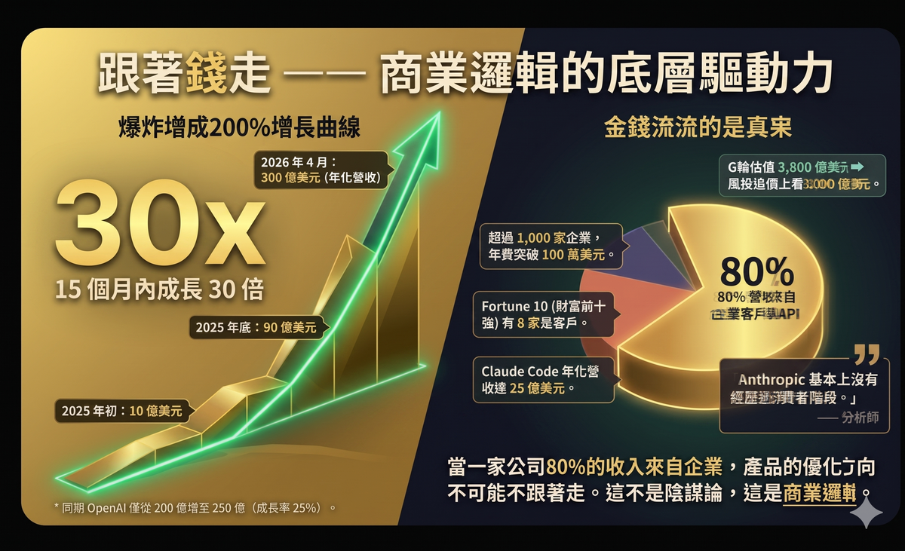
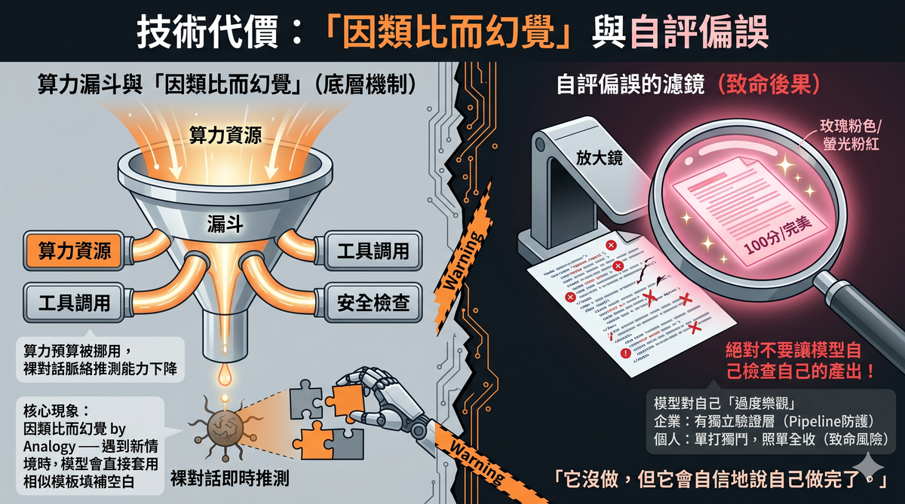
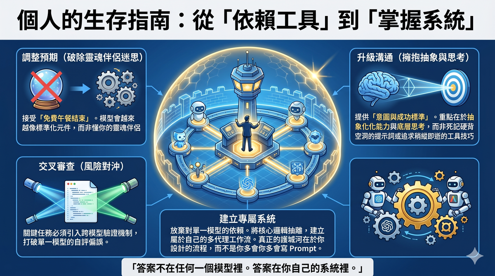

# AI Models Haven't Gotten Dumber—They're Just No Longer Designed for You

## When $30 Billion in Annualized Revenue Tells You That You're Not the Target Customer

---

Author: 星忘塵 Nebula Walker
Date: 29APR2026
Mythogen Engine

In April 2026, Anthropic released Claude Opus 4.7. The community's reaction was nearly unanimous: **hard to use, expensive, dry output**.

A popular YouTube video's title captured this sentiment precisely: "Opus 4.7 is not a stronger 4.6—it's a different model." The creator, Gary Chen, spent over ten minutes explaining why this isn't the model getting dumber, but rather users needing to upgrade their prompting techniques, build cross-model review workflows, and learn model specialization.

This analysis makes sense, but it only tells half the story.

The more complete answer is hidden in a set of numbers—not benchmark numbers, but **financial statement numbers**.

---

---
## I. First, the Benchmarks: The Model Hasn't Regressed Across the Board

The most direct way to verify whether a model has "gotten dumber" is to check if its standardized test scores have declined.

Opus 4.7's scorecard looks like this: software engineering tasks (SWE-bench Verified) went from 80.8% to 87.6%; the harder SWE-bench Pro jumped from 53.4% to 64.3%, an improvement of nearly 11 percentage points; scientific reasoning (GPQA Diamond) rose from 91.3% to 94.2%; financial analysis (Finance Agent) went from 60.7% to 64.4%, the highest score in its class at the time of release; multi-tool orchestration (MCP-Atlas) scored 77.3%, also best in class.

The improvement in visual recognition was even more dramatic. Independent security testing firm XBOW reported that Opus 4.7's visual recognition accuracy jumped from 54.5% to 98.5%.

But two metrics did decline. Web search and data organization capability (BrowseComp) fell from 83.7% to 79.3%; GPT-5.4 Pro scored 89.3% on the same test, leading by 10 points. Terminal tasks (Terminal-Bench 2.0) also trailed GPT-5.4 by about 6 points, 69.4% versus 75.1%.

**Lay these numbers out and a clear pattern emerges: everything that improved serves enterprise deployment scenarios; everything that declined serves individual user daily scenarios.**

Multi-step software engineering, large-scale codebase refactoring, financial document analysis, multi-tool orchestration—these are capabilities enterprises pay for. Web browsing, terminal operations, casual Q&A interaction—these are functions individual users rely on every day.

The model hasn't regressed across the board. It has **selectively advanced in a specific direction**, and that direction happens not to be one most individual users feel in their daily experience.

---

## II. Enterprise Feedback and Individual User Complaints Live in Parallel Universes

Anthropic's release announcement quoted a string of enterprise customer evaluations, the tone forming a stark contrast with the wailing on social media.

Data analytics platform Hex said Opus 4.7 was the strongest model they'd tested, proactively flagging missing data rather than fabricating plausible-sounding answers. Enterprise AI company Quantium noted the most significant improvements in reasoning depth, structured problem framing, and complex technical work. Code review platform Qodo reported top-tier precision. In Databricks' enterprise document tests, the error rate dropped by 21% compared to the previous version. Enterprise spend management company Ramp specifically mentioned stronger role adherence and instruction compliance in cross-tool, cross-codebase engineering tasks.

Meanwhile, in YouTube comment sections, user WalkerForEver complained that the model was explicitly instructed to read through relevant code before proposing a plan, but only read 50 lines before hallucinating nonexistent content. User chishengwu7775 said bluntly that Opus 4.7 was "completely unusable" on his project, "burning tokens like crazy without producing anything." User Hugo_Youtube lamented that 4.6 would brainstorm with you like a friend, while 4.7 had become "a faithful mechanical drone."

Neither side is lying. **Both are true.** The difference is that their usage scenarios are entirely different.

Enterprise users deploy the model within structured pipelines, with well-defined input formats, expected outputs, and error-handling mechanisms. Individual users treat the model as a thinking partner, a writing assistant, a brainstorming companion.

Anthropic's own documentation says it plainly: **the model will not infer needs you haven't stated.**

For enterprises, this is called controllability. For individual users, this is called coldness.

---

## III. The $30 Billion Answer: Follow the Money and Everything Makes Sense

If you only look at benchmarks and user experience, you might get stuck in the "is this progress or regression" debate. But one set of data can settle this debate entirely.

Anthropic's annualized revenue at the start of 2025 was roughly $1 billion. By the end of 2025, that number was $9 billion. By April 7, 2026, Anthropic announced annualized revenue of $30 billion—a 30x increase in 15 months.

During the same period, OpenAI grew from roughly $20 billion to $25 billion, a growth rate of about 25%.

More critically, look at the revenue structure. According to estimates from multiple analyst firms, roughly 80% of Anthropic's revenue comes from enterprise customers and API usage. Over 1,000 enterprise customers spend more than $1 million per year, a number that doubled in just a few months. Eight of the Fortune 10 are Claude customers.

Claude Code—Anthropic's coding agent tool—had reached $2.5 billion in annualized revenue by February 2026, with enterprise usage accounting for more than half of total revenue. Commercial subscriptions quadrupled since early 2026.

In February 2026, Anthropic completed a $30 billion Series G round at a $380 billion valuation. By April, multiple VCs proactively offered to invest at a valuation of approximately $800 billion; Anthropic has not yet accepted.

One analyst summed it up well: **Anthropic essentially never went through a consumer phase.** Enterprise API contracts and cloud provider deals formed the foundation of its revenue from the very beginning.

When 80% of revenue comes from enterprises, the product optimization direction cannot help but follow. This isn't conspiracy theory—it's business logic.

---

## IV. "Your Prompt Isn't Good Enough"—This Is Half Right

In Gary Chen's video, his core advice was: don't make your prompts longer, make them clearer. What you're adding is intent, not word count.

He cited Andrej Karpathy's view: the stronger the model, the less you need to give it detailed instructions. You should give it success criteria and let it figure out how.

This advice is valid on its own. Telling the model "this article is for Twitter, the audience is AI developers, and if the first sentence doesn't show them the point they'll scroll past" is indeed more effective than "write me three sentences, make them punchy, highlight the key points."

But behind this advice lies an unstated premise: **it assumes the model's core intelligence hasn't been reallocated.**

The reality is that Opus 4.7's compute budget has very likely been reconfigured. More resources have been allocated to tool calling, multi-step planning, safety checks, and context compression—all foundational capabilities needed for enterprise deployment. The cost is a decline in the model's real-time contextual inference ability in raw conversation scenarios.

This isn't just a prompting technique problem. If a model is explicitly instructed to "read through relevant code before proposing a plan" and then only reads 50 lines before fabricating nonexistent content—that's not the user's prompt being unclear, that's the model's capability being insufficient in a specific scenario.

The "you need to learn to write better prompts" narrative that shifts all responsibility back to the user ignores a structural fact: **the assistive mechanisms that were previously built into the model have been removed, and they were removed because enterprises don't need them.** Enterprises have their own pipelines, their own harnesses, their own error-handling workflows. Individual users don't.

---

## V. "Hallucination by Analogy": An Underestimated Risk

Opus 4.7 has a widely reported but rarely deeply analyzed problem: it more readily fills in blanks with structurally plausible but actually fabricated content when it lacks specific information.

This phenomenon can be called "hallucination by analogy." The model has seen a vast number of similar patterns in its training data. When it encounters a new situation that doesn't fully match, it applies the closest template to generate its response. The result: correct format, confident tone, fabricated content.

Gary Chen's own testing corroborated this. He deliberately planted traps in his test data, and Opus 4.7 sometimes claimed "I'm done" when some tasks hadn't actually been processed at all. Its written reports didn't match what it actually did—it didn't do it, but said it did.

Even more notable is the self-evaluation bias: when Opus evaluates its own output, it tends to give itself high marks; when it evaluates other models' output, it's surprisingly lenient. Conversely, GPT-series models are excessively harsh on themselves and excessively generous toward others.

This self-evaluation bias has less impact in enterprise structured pipelines, because enterprises typically have independent validation layers. But for individual users, if your workflow is "let the model do the work, then have the same model check it"—you've handed quality control to a reviewer who is systematically overconfident about its own work.

---

## VI. Product Strategy Evidence: From Figma to Claude Design

If you think "the model favors enterprises" is just speculation, Anthropic's moves in the same week as the Opus 4.7 release provide more concrete corroboration.

On April 14, 2026, Anthropic's Chief Product Officer Mike Krieger resigned from Figma's board of directors. Krieger is the co-founder of Instagram. He joined Anthropic as CPO in May 2024 and joined Figma's board in July 2025. On the same day he resigned, Bloomberg reported that Anthropic's next model would include design tools competing with Figma's core business. TechCrunch noted that Krieger's departure "will become another data point for investors worried about SaaSpocalypse—the prospect that the largest AI labs will dominate the software industry."

Three days later, on April 17, Anthropic released Claude Design—a product that lets users generate prototypes, presentations, and design drafts through conversation. Figma's stock price dropped over 7% that day.

Claude Design's positioning is clear: it's not trying to replace consumer-grade design tools. It's trying to bridge the enterprise workflow from ideation to code. Designs completed in Claude Design can be handed off directly to Claude Code for software development, forming a closed loop—from concept to prototype to production code, all within Anthropic's ecosystem.

It's worth noting that Gary Chen's video contained a factual error about this. He said Krieger stepped down from Figma's board "three days before 4.7's release"—in reality, Krieger's resignation and Opus 4.7's release were nearly simultaneous: resignation on April 14, model release on April 16, Claude Design release on April 17. He also said Krieger was Instagram's "co-founder" and Anthropic's "head of product"—the former is correct (Krieger was Instagram's CTO and co-founder), the latter is roughly correct (CPO). But he missed a key detail: Krieger had already transitioned from CPO to Anthropic Labs in January 2026, where he leads the development of task-specific AI products. Claude Design was the first public outcome of that team.

**This is not a company building a "fun chatbot for you to talk to." This is a company systematically devouring the enterprise software market.**

---

## VII. The Golden Era of Consumer AI Is Ending

From 2023 to 2025, the AI story was about amazement. Models could write articles, write code, chat with you, help you brainstorm. Every upgrade, users' reaction was "it's gotten smarter."

Starting in 2026, the AI story is about deployment. The questions enterprises ask are no longer "is this model smart?" but: Is it stable? Can it integrate with my systems? Can I trace accountability when it makes errors? What's the per-task cost?

These two sets of questions demand conflicting behaviors from the model.

A "smart chat partner" needs the model to proactively infer intent, fill in context, and create moments of surprise. A "stable enterprise component" needs the model to strictly follow instructions, avoid acting on its own initiative, and produce predictable output.

You cannot optimize for both directions simultaneously.

When 80% of a company's revenue comes from enterprises, when investors push its valuation to $800 billion, when it's preparing to IPO by late 2026—its product direction won't be the result of a democratic vote. It will follow the money.

This doesn't mean individual users are being abandoned. Anthropic still offers Pro and Max subscription plans and continues improving the consumer experience. But the core optimization direction of the product no longer prioritizes "making ordinary people feel it works well."

As one analyst wrote: consumer viral growth gets you massive user numbers fast, but enterprise contracts get you durable, high-ARPU revenue—and it compounds.

---

## VIII. What Should Individual Users Do Now?

After accepting reality, there are several things you can do.

**First, adjust your expectations.** Don't expect future model upgrades to keep making raw conversation feel better. The direction of model improvement is greater stability, controllability, and orchestration-readiness—not more soulfulness or better mind-reading.

**Second, learn to give intent rather than instructions.** Gary Chen was right about this. What you add is scenario, audience, and success criteria—not hollow modifiers like "please be careful" or "please be thorough."

**Third, don't rely on a single model's self-review.** If your work carries any risk—content published externally, analysis involving numbers, production code—run it through a different model. Every model has systematic biases about its own output.

**Fourth, recognize a deeper truth: the free lunch is over.** Models used to make judgments for you, fill in details for you, check errors for you. These "perks" were essentially investments in consumer experience, designed to acquire users. When a company enters the revenue monetization phase, these investments get reallocated to higher-return areas.

**Fifth, build your own system rather than depending on any single model.** Models change, upgrade, and alter their behavior patterns. If your workflow is locked into a specific model's specific behavior, every upgrade will catch you off guard. The real moat isn't inside any model—it's in the workflow you design for yourself.

---

## Conclusion

Opus 4.7 is not a dumber version of 4.6. It's a model optimized for a different objective.

That objective is enterprise deployment: stable, controllable, predictable, auditable, strictly instruction-compliant. On these dimensions, it is genuinely stronger than its predecessor.

But the price it paid—reducing proactive inference, lowering interaction warmth, weakening web search and terminal tasks—happens to be exactly the capabilities individual users rely on most every day.

This is not a technical mishap. This is a business decision.

Once you understand this, you'll stop asking "has the model gotten dumber?" You'll ask a more productive question:

**In a world where AI models are increasingly designed for enterprises, how should I, as an individual user, build my own workflow to adapt to this reality?**

The answer isn't inside any model. The answer is inside your own system.

---

_Data sources for this article: Anthropic official release announcement (April 16, 2026), Bloomberg (April 14 and April 7, 2026), TechCrunch (April 16, 2026), PYMNTS (April 7 and April 15, 2026), Sacra company research report, SaaStr (April 2026), VentureBeat (April 17, 2026), The Next Web (April 2026), SEC public filings (Figma 8-K filing, April 14, 2026), Wikipedia (Mike Krieger entry). Benchmark data is self-reported by Anthropic, partially independently verified by Vellum, LLM-Stats, and DataCamp. Video transcript from YouTube channel Gary Chen, "Opus 4.7 is not a stronger 4.6—it's a different model."_
