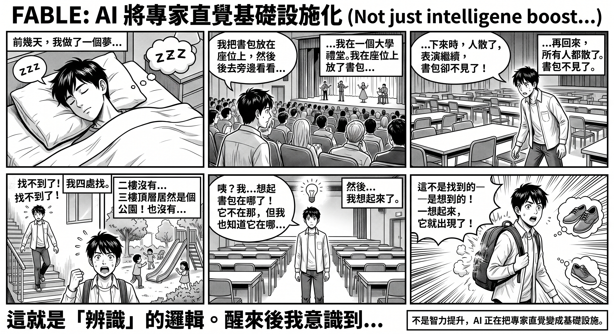
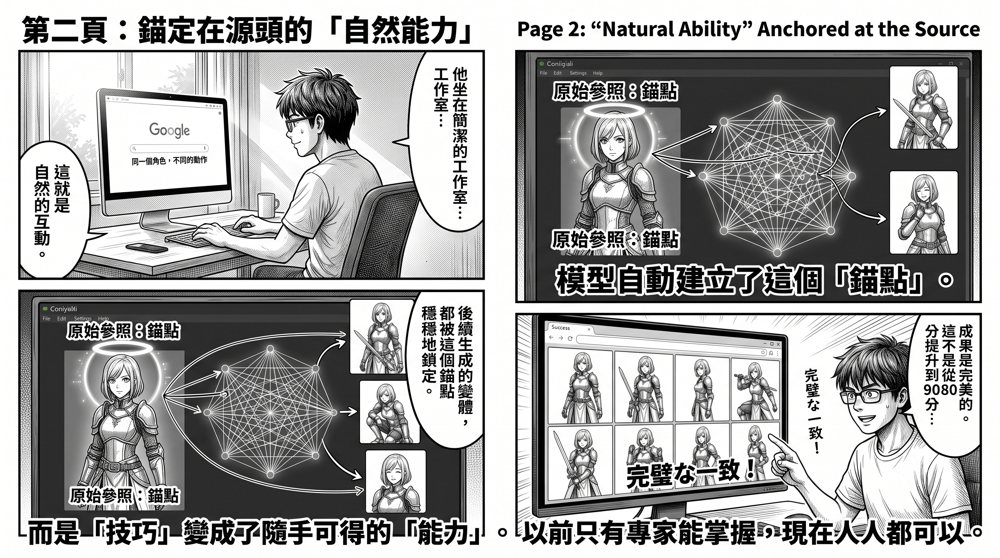

# FABLE: It's Not Just About Smarter AI — It's Turning Expert Intuition into Infrastructure

Every time AI's intelligence reaches a certain threshold, a qualitative shift occurs — not doing the same things better, but suddenly doing things that were previously impossible.

A few days ago, I had a dream.

In the dream, I was in a university auditorium. The seats were packed tight. On stage, some people were performing songs and dances, others were giving speeches. I left my backpack on a seat somewhere, then went up to a mezzanine level to watch for a while. When I came back down, everyone had left. There were still performers on stage, but my backpack was gone.

I searched everywhere. Went up to the second floor — nothing. Up to the third floor — the top floor turned out to be a park, with children playing on slides and people on swings. The slide could take you back down to the second floor, but the backpack wasn't there either. I went back to the auditorium, circled around the stage, flipped through several rows of chairs. Still nothing.

Then something very strange happened.

I suddenly remembered where the backpack was. I didn't find it — I remembered it. And the moment I remembered, the backpack appeared. Right on my back.

Then I remembered I'd forgotten my shoes. Same logic: I knew which pair they were, and the shoes appeared in front of me.

If you don't know where something is, you'll never find it. If you know where it is, it appears automatically.

This isn't the logic of search. This is the logic of recognition.

After waking up, I realized that the mechanism of this dream had the same structure as something I'd been thinking about for a while.

---

The AI world loves talking about leaderboards lately.

GPT scores this much. Claude scores that much. How close Chinese models are getting. How much reasoning has improved. How much costs have dropped. Every few weeks there's a new benchmark, a new champion, a new ranking. As if AI progress can ultimately be translated into two numbers: capability and price.

That's not wrong. Over the past two years, most models have indeed progressed this way — more accurate answers, fewer hallucinations, longer reasoning chains, better code. Like processors gaining twenty percent each year, graphics cards getting a bit faster. Naturally, people see AI as a continuous upward curve.

But some progress doesn't work this way.

---

Last year, many people talked about Google's next-generation image model, saying it "solved the character consistency problem," as if AI could draw the same character for the first time.

Anyone who's used Stable Diffusion would laugh.

LoRA can do consistency. IPAdapter can do it. ControlNet can do it. ComfyUI has countless workflows dedicated to this. As long as you're willing to invest time, tweak parameters, and keep retrying, character consistency has always been achievable.

The problem was never whether it could be done.

The problem was who could do it.

Consistency used to belong to a select few. It required extensive experience, understanding of the model, stumbling through countless pitfalls, and building your own workflows. Many people saw others produce entire character sets and assumed the model was powerful. In reality, what was truly powerful was the person behind it.

What Google's image model really changed wasn't the capability itself.

It turned what used to be an expert-only skill into a natural ability.

Before, you needed six months of learning. Now you type one sentence.

Before, you had to understand nodes, use IPAdapter or ControlNet to generate images one by one, using the previous image as reference each time — but errors would accumulate, characters would drift further off-model, and you had to manually pull them back constantly. Now you just give the model an original reference — even one that's itself AI-generated — and the model anchors all subsequent variations to that source, without drifting.

Before, you had to constantly wrestle between consistency and creative freedom. Now the model handles it.

Of course, ComfyUI hasn't been replaced. Local generation still has its value — ultimate control, uncensored creative freedom, zero marginal cost for batch output. For those who've already mastered the full workflow, ComfyUI remains the more powerful tool. Whether it's worth learning is debatable. But that's precisely the point: before, you had only one path. Now you have a choice. And the new path doesn't cost six months of tuition.

This kind of progress is hard to express with benchmarks. It's not going from eighty to ninety points. It's turning a skill that was once scarce into a foundational capability anyone can use.

---

FABLE gives me a similar feeling. But what I want to talk about isn't leaderboards.

I want to talk about something related to the dream at the beginning.

Anyone who's done research knows there's one part of academic work that no search engine can help with — finding papers that the entire academic system has forgotten.

Not finding related literature. Related literature can be found with keywords, traced through citation chains, searched on Google Scholar. That's retrieval — machines have always been able to do that.

It's something else entirely.

Some research has its value hidden beyond the abstract. The core insight is buried in a derivation in chapter four, in a side observation the author barely mentioned, in a structural similarity between two seemingly unrelated fields. This kind of thing can't be searched by keyword — because its value isn't defined by the author, but by the reader's knowledge structure.

The same paper: one person sees a boring improvement to a statistical method; another sees a core framework applicable to an entirely different field.

The difference isn't in the paper. The difference is in the reader's mind.

Finding this kind of thing used to have only one method.

Go to the library. Browse.

Not careful reading — no one has time to carefully read thousands of papers. It's rapid scanning: flipping through pages, looking at structure, examining charts, seeing how the author handles their data. Most of the time, nothing. Occasionally — very occasionally — you'd stop, feeling something was off about a paper. Not that it was poorly written, but that it was written too well — too well to have so few citations.

This feeling is hard to teach. It's not knowledge — it's intuition.

Someone with thirty years of research experience can flip a few pages and know whether a paper has substance. A veteran investor can look at a few numbers and know where the problem lies. A seasoned editor can read the first page and know whether a book has something. Ask them how they judge, and they can't explain. Because it's no longer a method — it's instinct.

This is the same as the backpack in the dream. You searched every row of chairs, went up three floors — that's searching. But the backpack wasn't found — it was remembered. Your consciousness aligned with the target, and the thing just appeared.

Browsing papers in the library works the same way. You're not searching — you're waiting for something to trigger your recognition system.

And the problems with this approach are all too obvious.

It's slow.

One cycle takes at least a few months, usually a quarter minimum. And it's highly dependent on luck — you might miss a paper that was on the next shelf over, never knowing it existed. One person can browse at most a few hundred papers per quarter. Those you didn't get to might as well have never existed.

Like the backpack in the dream: if you don't know where it is, you'll never find it.

Many people have long felt that AI should be able to solve this.

But over the past few years, it hasn't.

---

Not because the models weren't smart enough. But because the nature of this problem is fundamentally different from what most people understand as "AI reading papers."

Most people imagine "AI reading papers" like this: you give it a paper, it summarizes the key points and answers questions. Current models can indeed do this, and they're getting better. But this is comprehension, not discovery. You already know which paper to read — you just want to read it faster.

It's like already knowing which restaurant you want to go to, and just wanting the Uber to arrive faster. Very useful, but it's not exploration.

People who truly need AI's help don't need to read faster.

What they need is: from one hundred thousand unread papers, find three worth diving into.

For AI, this is an entirely different problem. It's not "understanding a paper" but "identifying incorrectly buried signals in massive noise." This requires not search capability, but judgment — and judgment has been AI's weakest link over the past few years.

There are three reasons.

First, all existing academic search tools are consensus-based. Citation counts, impact factors, university rankings, top journals — these metrics can only find value that the academic community has already acknowledged. But what truly needs to be found is precisely what this system has overlooked. Using consensus tools to find counter-consensus value is logically contradictory. It's like using bestseller lists to find buried geniuses — bestseller lists are defined by excluding them.

Moreover, this system doesn't just passively ignore old research — it actively buries it. A paper published in 2008 could still be found in university databases back then. But nearly twenty years later, newer papers with higher citations and better rankings keep piling on top, pushing that old paper to page hundreds of the search results — effectively the same as deletion. Even if you know the author's name, the university, and the research field, you still can't find it. Not because information is hidden, but because information is drowned.

Worse still, the sea that's drowning you is itself going rotten.

In recent years, the proliferation of AI writing tools has caused academic publication volumes to explode, but much of it consists of homogeneous padding papers and AI-generated fakes. They occupy search results, consume ranking weight, and push already-deep old research even deeper. The needles you're looking for haven't decreased, but the haystack is expanding at unprecedented speed — and it's starting to include things that look like needles but are actually plastic.

Ranking isn't neutral. Ranking is a continuously operating forgetting machine. And now, the fuel for this machine is being supplied at an accelerating rate.

Second, RAG and vector search can't solve this problem. They're fundamentally semantic matching — finding passages semantically similar to your query. But a buried paper may be buried precisely because its language, framework, and framing are completely different from the mainstream. Semantic search finds "things said similarly," not "things structurally similar but expressed completely differently." If you search for "optimization" in Chinese, it won't help you find a paper written in French using entirely different terminology to describe the same mathematical structure.

Third, and most critically: hallucination.

AI's hallucination problem when reading papers is far more severe than in casual conversation. If you get a wrong answer in chat, you can ask again — the cost is low. But academic mining is different — if AI packages a valueless paper as valuable, distorts conclusions, exaggerates findings, or mixes content from two different papers, you might invest months based on that flawed judgment. This year, a large-scale study in the Lancet found that a significant number of AI-generated medical citations are entirely fabricated, and these fake citations have already begun being cited by real papers, forming a pollution chain. The cost of error in academic research isn't "getting one question wrong" — it's "wasting a quarter or even a year."

So over the past few years, even as models grew more powerful, researchers' use of AI has remained at the same level: reading a known paper, summarizing it, answering questions. AI does these well, and many researchers already use it. But "help me read faster" and "help me find something I didn't know existed" are two entirely different things. No one has dared entrust the latter to AI, because the cost of misplaced trust is too high.

It's not that no one has tried. Tools like Undermind are already doing similar work — iterative searching, citation chain tracking, multi-round semantic adjustment, finding papers that standard search misses. GSK, MIT, and Harvard all use it. It's genuinely much better than Google Scholar. But its core method is still an evolved version of retrieval — searching wider, tracking deeper, filtering more precisely.

This is weaving a finer fishing net.

But fishing nets are designed to catch big fish. If what you're looking for isn't a big fish, but a specific kind of microorganism — something hidden in the silt at the ocean floor, invisible to the naked eye, but potentially capable of rewriting an entire field — then no matter how fine the net, it's useless. What you need isn't a better net. It's a microscope.

---

FABLE is the first thing that makes you feel like maybe you can do more than cast nets — maybe you can see what nets can't catch.

Not because it doesn't hallucinate. Every model does.

But because what it does is fundamentally different from previous models.

Previous models reading papers were more like summarizing — extracting keywords, organizing structure, answering questions. FABLE seems to be doing something else: it's building a mental model. After reading a paper, it doesn't just remember the content — it understands the logical structure: what the author's reasoning chain is, what the core assumptions are, which conclusions are directly derived from data, and which are the author's interpretations.

This distinction is critical.

Because if an AI can build a mental model, it becomes possible for it to do what those researchers used to do in libraries: not search, but recognize structural value. It could read a statistics paper from 2003 with only three citations and point out: "The optimization method in this paper has structural similarity to the embedded systems resource allocation problem you're working on."

This isn't something keyword search can do. It isn't something RAG can do. It isn't even something "searching wider" can do.

This is judgment.

In the language of the dream: this isn't rummaging through chairs looking for the backpack. This is the moment of "remembering where the backpack is" — consciousness aligns with the target, and the thing appears on its own.

And this also redefines the hallucination problem — not eliminating hallucination, but changing the architecture. The correct approach isn't having AI replace human judgment, but having it do first-pass filtering: narrowing one hundred thousand papers down to one hundred, then humans review them. Researchers' problem has never been "can't understand" — it's "can't find." A sufficiently experienced person is perfectly capable of judging whether a paper is worth diving into. What they lack is the bandwidth to encounter it in the first place.

So the real workflow is two-layered. AI does reconnaissance; humans make judgments. The risk of hallucination is drastically reduced in this architecture — because you're not blindly trusting its conclusions; you're using it to expand your search scope, then applying your own expertise for final verification. FABLE's value isn't "it doesn't hallucinate" — it's that its understanding runs deep enough that what it filters out has a hit rate high enough to justify the time spent on manual verification.

This is really just a scaled version of the old library method. Before, you didn't carefully read every paper either — you scanned rapidly, filtered by intuition, picked a few to go deep on. The difference is that before it was a few hundred papers per quarter. Now it's thousands per day.

The library hasn't shrunk — it's expanding at unprecedented speed. It's just that most of what's being added isn't books. It's noise.

But you have more eyes now.

---

If you look at it from this angle, what FABLE demonstrates isn't a higher IQ.

What it demonstrates is a new direction.

AlphaGo's value wasn't making chess cheaper. Google's image model's value wasn't generating images faster. If FABLE truly demonstrates anything, it's not higher reasoning scores.

What it demonstrates is that certain cognitive abilities that once belonged only to a select few may, for the first time, become infrastructure.

In the past, infrastructure solved physical problems. Electricity gave everyone the power of machines. The internet gave everyone the power of information.

The next generation of AI may be doing something else entirely.

It's turning expert intuition into infrastructure.

Before, you needed thirty years of experience, cross-disciplinary knowledge, massive amounts of reading, sharp intuition, and even a bit of luck to fish out forgotten value from the blind spots of the academic system.

If one day, a researcher just starting out can do something similar through AI — not exactly the same, but at least close — then what AI changes isn't just efficiency.

What it changes is the distribution of opportunity.

Because the most important question of the future may not be which model is smarter.

It may be which scarce human capabilities it makes universally accessible for the first time.

Like the final scene of the dream. You no longer need to search the entire auditorium.

You just need to remember.

And AI is learning how to help you remember.

