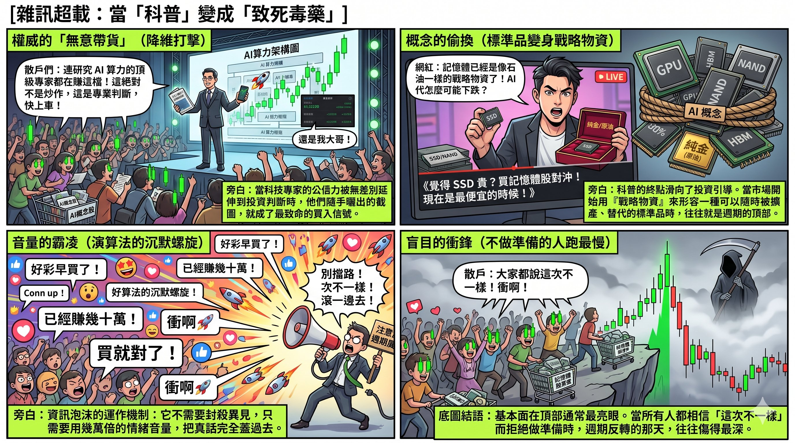
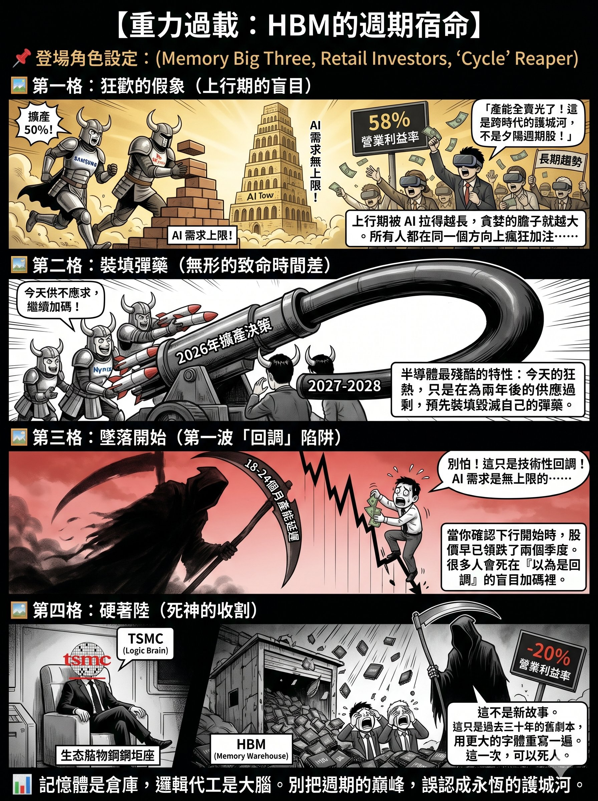

Author: Nebula Walker
Date: 26MAY2026
MYTHOGEN ENGINE (mythogenengine.com)

**📌 Dismantling the 'HBM = next TSMC' narrative across three dimensions — business model, industry cyclicality, and geopolitics — and warning of valuation misalignment at the cycle peak.**

# HBM Is Not the Next TSMC: The Structural Chasm Between Memory and Logic

## Introduction: A Seductive Analogy That Falls Apart Under Scrutiny

Since 2025, as AI infrastructure spending entered an explosive growth phase, High Bandwidth Memory (HBM) has become the hottest buzzword in the semiconductor market. SK Hynix's share price has hit record after record, Samsung is scrambling to catch up, and Micron has announced its exit from the consumer memory market to go all-in on AI data centres. A compelling narrative has taken hold: "HBM is the next TSMC."

It rolls off the tongue. It doesn't survive analysis. The analogy conflates two fundamentally different business models, two entirely different moat structures, and two industry actors occupying very different positions on the geopolitical chessboard.

This article does not aim to dismiss HBM's technological value or its short-term investment potential. Rather, it argues from the structural logic of the industry itself why memory — even HBM, with all its formidable technical complexity — can never become "the next TSMC" in any commercially meaningful sense.

---

## Layer 1: The Fundamental Business Model Divide — Foundry Services vs. Commodity Products

### What Does TSMC Sell?

TSMC is the world's largest pure-play foundry. It does not design chips; it only manufactures them. But this "only manufacturing" positioning is precisely what constitutes its deepest moat.

Every chip produced at TSMC — whether Apple's A-series processors, NVIDIA's H200 / B200 GPUs, or AMD's EPYC server processors — is a bespoke product designed by the customer. TSMC provides what can be called "heterogeneous services": enabling mass production of different designs from different customers at extreme precision process nodes. The relationship between customer and foundry is one of deep lock-in: once a chip design completes tape-out on TSMC's 3nm or 2nm process, migrating to another foundry is tantamount to starting from scratch.

This lock-in manifests directly in TSMC's financials. In full-year 2025, TSMC posted revenue of US$122.4 billion, a gross margin of 59.9%, and an operating margin of 50.8%. By Q1 2026, gross margin climbed to 66.2% with an operating margin of 58.1%. Q2 guidance projects gross margins of 65.5% to 67.5%. This is not a cyclical peak — it is structural pricing power. When your customers cannot leave, you can raise prices continuously.

### What Does Memory Sell?

Memory — including conventional DRAM and HBM — is fundamentally a commodity. Its specifications are defined by JEDEC, the international standards body. In April 2025, JEDEC officially published the HBM4 standard (JESD270-4), specifying interface width (2,048-bit), data rates (up to 8 Gb/s), stacking configurations (4/8/12/16 layers), voltage ranges, and other key parameters. In other words, as long as any memory manufacturer can produce a product that meets these specifications, it is functionally interchangeable.

This is not to say HBM lacks technical barriers. Through-silicon via (TSV) stacking, micro-bump interconnects, thermal management, yield control — these are formidable engineering challenges. But the critical distinction is this: these challenges exist at the *engineering execution* level, not the *architectural* level. Once a competitor catches up on execution, the product becomes a spec-compliant commodity, and the customer gains both the ability and the incentive to switch suppliers.

This is the most fundamental divide between the memory industry and logic foundry: TSMC's customers cannot leave because their designs are tailor-made for TSMC's process. Memory customers can leave because they are buying standardised products that meet a common specification.

---

## Layer 2: History Doesn't Lie — Memory's Cyclical Fate

### The "Supercycle" Illusion

Every time memory prices surge, the market produces voices proclaiming "this time is different." From 2017 to 2018, DRAM prices soared, and the industry proclaimed a "supercycle," claiming that structural demand from smartphones and cloud computing would break the traditional boom-bust pattern. By 2019, demand growth slowed, inventories ballooned, and average selling prices (ASPs) collapsed across the board. Micron's DRAM ASP fell 30% year-over-year, and earnings per share plunged 84%.

In 2022, the memory industry entered another severe downturn. Inventories swelled, prices hit rock bottom, and manufacturers posted massive losses. SK Hynix recorded an operating margin of negative 20% in Q3 2023.

Then AI arrived. HBM demand exploded. DRAM prices in Q4 2025 nearly tripled compared to a year earlier. SK Hynix's full-year 2025 operating margin surged to 49%, hitting 58% in Q4. The market once again proclaimed: "This time it really is different."

But from a structural perspective, the underlying mechanism driving this cycle has never changed. The memory industry's fate is this: when prices are high, manufacturers inevitably expand capacity. When that capacity comes online 18 to 24 months later, if demand growth cannot keep pace, oversupply returns. Moreover, once capacity is built, the enormous fixed costs make it impossible for manufacturers to simply halt production — they can only slash prices to defend market share, further accelerating the price decline.

All three major memory manufacturers are currently expanding aggressively. Samsung plans to increase HBM production capacity by approximately 50% in 2026, with its Pyeongtaek P5 fab expected to begin production in 2028. SK Hynix's M15X fab is scheduled to come online by mid-2027, with infrastructure investment expanding to more than four times the original plan. TechInsights projects the memory industry could enter another downturn as early as 2027.

Contrast this with TSMC: TSMC's customers are queuing for capacity, TSMC holds the pricing power to proactively raise prices, and gross margins are climbing quarter after quarter. Memory manufacturers, meanwhile, are expanding furiously at the cycle peak, waiting to slaughter each other in the next trough. These are two entirely different commercial ecosystems.

---

## Layer 3: The Strongest Counterargument — "AI Demand Is Limitless; No Amount of Capacity Is Enough"

This is currently the most powerful argument in defence of HBM, and the one that most urgently needs rigorous examination. It is not wrong — it is half-right.

The present reality is indeed one of undersupply. All three manufacturers' HBM capacity is sold out through 2026. NVIDIA has even cut consumer GPU production (RTX 50 series output reduced 30–40% in H1), redirecting memory capacity to AI data centres. SK Hynix expects 2025 HBM shipments to double year-over-year. AI is projected to consume nearly 20% of global DRAM wafer capacity in 2026 (adjusted for HBM's 4x wafer consumption). These are all facts.

But "can't buy enough now" does not equal "can never buy enough." For the logic of "demand will always exceed supply" to hold, the following conditions must all be true simultaneously and continuously:

First, Big Tech's AI capital expenditure must maintain its current growth rate. Combined capex from Meta, Google, Microsoft, and Amazon in 2024–2025 has already reached astronomical levels. But management teams at these companies will eventually have to justify AI investment returns to shareholders. The moment AI monetisation cannot keep pace with infrastructure spending — not that AI is useless, but that "returns aren't fast enough to justify this burn rate" — capex growth will decelerate. It doesn't need to stop. As long as the growth rate slows, HBM's supply-demand equation loosens.

Second, AI models' memory efficiency must not improve significantly. But in fact, the entire industry is working toward "doing more with less memory" — model compression, quantisation, sparsity, mixed-precision inference. If the next generation of models requires only half the HBM for equivalent performance, the demand growth curve gets flattened by technological progress.

Third, no alternative architectures can emerge. All mainstream AI accelerators currently depend on HBM, but that doesn't mean they always will. Processing-in-Memory, CXL memory pooling, even photonic computing — these technology directions are all attempting to circumvent HBM's bottleneck. They won't mature in the short term, but their mere existence demonstrates that HBM's "irreplaceability" has a time window.

The more fundamental issue is this: even if demand truly does keep exploding, "undersupply" will not protect memory manufacturers' margins forever. Because the manufacturer behaviour triggered by undersupply is precisely aggressive expansion — which is exactly what we are watching happen in real time. Samsung adding 50% capacity, SK Hynix quadrupling infrastructure investment, Micron exiting the consumer market to go all-in. Everyone is betting in the same direction, and the size of those bets far exceeds any previous cycle. When this capacity comes online en masse in 18 to 24 months, even a slight deceleration in demand growth will cause the supply-demand balance to flip in very short order.

So the correct version of this counterargument should be: "AI demand has extended the duration of this HBM upcycle." That is true. AI may make this cycle longer than any before — extending it from the typical 2–3 years to 4–5 years. But "extending" and "eliminating" are two different things. It has delayed the arrival of the cycle's inflection point, but it has not abolished the cycle's operating mechanism. TSMC's pricing power, by contrast, does not depend on the cycle. Whether AI demand is surging or cooling, customers' chip designs remain locked into TSMC's process. This is the essential difference between a structural moat and a cyclical tailwind.

---

## Layer 4: Geopolitical Positioning — The Strategic Gap Between the Brain and the Warehouse

### Where Is the Centre of Gravity of US Sanctions?

Examining the semiconductor export controls the United States has imposed on China since October 2022, a clear hierarchy of priorities emerges.

The core targets are logic chips and their manufacturing ecosystem. The Bureau of Industry and Security (BIS) controls cover: advanced logic ICs (non-planar transistor architectures below 16/14nm), GPUs and AI accelerators (defined by total processing performance and performance density), EDA design software (particularly tools targeting sub-3nm GAA architectures), and semiconductor manufacturing equipment (SME). The US has further coordinated with Japan and the Netherlands to restrict ASML's EUV lithography equipment exports.

The strategic logic of this control framework is crystal clear: logic chips are the "brain" — the source of all AI computational power. Control the design tools, manufacturing equipment, and foundry capabilities for logic chips, and you control the lifeline of AI development.

Memory is of course also within the scope of controls — BIS has export restrictions on DRAM below 18nm half-pitch and NAND with more than 128 layers. But in terms of the allocation of enforcement intensity, memory's strategic priority is clearly lower than logic. The reason is straightforward: memory is the "warehouse" — a supporting role. Without it, the brain can't run at full speed; but with it, without the brain, nothing runs at all. In the geopolitical semiconductor contest, logic chips are the opening move; memory is the follow-up support.

This hierarchy gap is itself a structural negation of the proposition "HBM = the next TSMC."

---

## Layer 5: How Long Can SK Hynix's Technical Lead Last?

### The Current Lead Is Real

As of Q4 2025, SK Hynix held approximately 53% to 57% of the HBM market. It is NVIDIA's primary HBM supplier, the first to mass-produce HBM3E, and the first to complete HBM4 development, claiming a 40% improvement in power efficiency and data transfer rates of 10 Gbps. Full-year 2025 revenue reached KRW 97.15 trillion, operating profit KRW 47.21 trillion, with a full-year operating margin of 49% and a Q4 operating margin soaring to 58%. These are impressive numbers.

But the question is: what is the nature of this lead?

### The Lead Is a "Time Gap," Not a "Structural Barrier"

TSMC's lead is structural — its process technology, the deep design lock-in with customers, and the resulting switching costs form a moat that competitors find nearly impossible to cross. Customers don't stay because they want to; they stay because they cannot leave.

SK Hynix's lead stems from a "first-mover time gap": it established its partnership with NVIDIA earlier than Samsung and Micron, achieved breakthroughs in TSV stacking yields earlier, and cleared NVIDIA's rigorous qualification process earlier. But this lead does not constitute structural irreplaceability.

The evidence is already emerging. In September 2025, Samsung's 12-layer HBM3E passed NVIDIA's qualification testing. By Q3, Samsung's HBM market share jumped from 15% to 22%. In October 2025, Samsung announced that its 2026 HBM4 capacity was fully sold out and that it had submitted HBM4 engineering samples to NVIDIA. For its part, NVIDIA — just one week after locking in its 2026 supply contract with SK Hynix — invited Samsung into HBM4 price negotiations.

The signal could not be clearer: NVIDIA, as the world's largest HBM buyer, is actively qualifying a second and even third supplier. This is not because it is dissatisfied with SK Hynix, but because no rational enterprise would allow the supply of a critical component to concentrate in a single vendor. Diversifying risk and driving down procurement costs — this is basic supply chain management.

And this is precisely the key distinction between memory (commodity) and logic foundry (heterogeneous service). NVIDIA can switch HBM suppliers among SK Hynix, Samsung, and Micron because they all follow the same JEDEC standard. But NVIDIA cannot easily move a GPU that completed tape-out on TSMC's 3nm process to Samsung Foundry or Intel Foundry. The former is supplier management; the latter is strategic lock-in.

### "HBM4 Base Die Outsourced to TSMC" = HBM Becomes Custom Silicon?

A particularly misleading argument has recently circulated: because the HBM4 base die will for the first time be manufactured by foundries like TSMC using advanced process nodes, HBM is no longer a "commodity sold by the kilogram" but has been elevated to "custom semiconductor" — implying that HBM is acquiring moat characteristics similar to logic chips.

This reasoning conflates two distinct things.

Outsourcing the base die to TSMC changes HBM's *manufacturing supply chain*, not its *commercial nature*. The base die does require more advanced process technology to improve signal processing and power efficiency, but it is still a component designed to the JEDEC HBM4 standard specification (JESD270-4). TSMC's role here is to foundry-manufacture a standardised component on behalf of the memory vendor — not to accept a bespoke, customer-exclusive design locked to a specific process, as it does when manufacturing NVIDIA's GPUs. SK Hynix can use TSMC for its base die; Samsung can use its own foundry line; Micron can use a third party. When the final product ships, NVIDIA's acceptance criterion is: does your HBM4 meet spec? If it does, you are one of the qualified suppliers.

The base die's process upgrade raises HBM's technical barrier but does not change the final product's commodity nature of "meet-spec-and-you're-interchangeable." High technical difficulty means a higher barrier to entry — it does not mean that products from those who clear the barrier are differentiated. If all three players can produce HBM4 that meets spec, customers have both the ability and the incentive to switch. This is fundamentally different from TSMC's situation — where customers' chip designs are physically locked to its process and cannot be moved.

Equating "a more complex manufacturing supply chain" with "a deeper commercial moat" is the most common — and most dangerous — logical slippage in this cycle's HBM narrative.

---

## Layer 6: The Fundamental Valuation Mismatch

When the market draws an analogy between HBM and "the next TSMC," the implicit assumption is that memory manufacturers will earn a TSMC-like structural premium — sustained high gross margins, stable revenue growth, and pricing power immune to cyclical fluctuations.

But the data tells a different story.

TSMC's full-year 2025 gross margin was 59.9%, climbing to 66.2% in Q1 2026, and continuing to rise on the back of its process leadership. Micron's gross margin over the same period climbed from 36.8% in Q2 2025 to approximately 44.5% by Q4 — already an excellent performance for the memory industry at a cycle peak. SK Hynix's Q4 2025 operating margin reached 58%, seemingly approaching TSMC's level. But note: this figure was achieved under extreme conditions of HBM undersupply and sharply rising ASPs.

Compare this to two years earlier — in Q3 2023, SK Hynix's operating margin was negative 20%. A violent swing from -20% to +58% is itself the defining hallmark of cyclical industries. TSMC's gross margin, even during the semiconductor industry's most depressed periods, has never fallen below 40%.

If you apply TSMC's valuation logic to a memory company, you are effectively paying a moat-stock premium for a cyclical stock. This is not investing — it is betting that the next cycle peak will be even higher.

---

## Risk Warning: The Coming Downturn Could Be Devastating

If the analysis above were merely academic, there would be little point in writing it. But it isn't. It points to a very specific, existential risk for current holders: **the severity of the coming downturn will very likely exceed historical averages.**

The logic is simple: the longer the upcycle is extended by AI demand, the larger the scale of capacity expansion that manufacturers accumulate at the peak. In a normal cycle, manufacturers begin to feel supply-demand reversal pressure after about two years of expansion, and capital expenditure exercises some degree of self-restraint. But this time is different. Because demand has continued to explode for so long, manufacturer confidence has been reinforced repeatedly, and the scale of expansion has grown bolder and bolder. Samsung adding 50% capacity, SK Hynix quadrupling infrastructure, Micron pivoting entirely to AI — everyone is betting in the same direction, and the magnitude of those bets far exceeds any previous cycle.

Semiconductor capacity has a cruel time-lag characteristic: investment decisions are made today, but capacity comes online 18 to 24 months later. Today's frenzied undersupply is essentially pre-loading ammunition for the oversupply of 2027–2028.

The typical pattern of memory downturns is: operating margins fall from above 50% to 20% or even turn negative, share prices begin their decline 1 to 2 quarters before fundamentals deteriorate, and the drawdown typically reaches 50% to 60%. In 2019, Micron's EPS plunged 84%. In 2023, SK Hynix's operating margin cratered from its peak to negative 20%.

This time, every amplifying factor is larger than before: the upcycle is longer, the expansion is larger, the valuation bubble is thicker, and retail participation is higher. When the turn comes — not "if" but "when" — the speed and depth of the decline will very likely set a new record for the memory industry.

The most exposed are those investors who entered at the cycle peak. What they see is SK Hynix at a 58% operating margin, HBM capacity fully sold out, and the narrative of "limitless AI demand," leading them to believe they are buying a "secular trend." What they have actually bought is a cyclical stock at a historic peak, for which they are paying a moat-stock valuation premium.

The cruelty of cyclical stocks is this: they don't give advance notice of the inflection point. By the time you confirm the downturn has begun, the share price has already been falling for two quarters. And because the AI-extended upcycle is so long, many investors will interpret the first wave of declines as a "pullback," continuing to hold or even adding to their positions — only to be fully trapped in the second and third waves of decline.

This is not alarmism. This is the script the memory industry has performed in every cycle for the past thirty years. The only difference is that this time, the script may be rewritten in much larger font.

---

## Another Warning Sign: When "Tech Explainers" Become "Buy Signals"

If manufacturers' aggressive expansion represents the supply-side risk signal, then what is happening on social media represents the demand-side — retail capital-side — risk signal.

Observe the content ecosystem surrounding memory stocks on Chinese-language social media, and a pattern worth heeding becomes visible.

One category is tech industry influencers. Their primary work involves AI tool deployment, enterprise consulting, and technology evangelism; they carry considerable influence and credibility within tech circles and government organisations. But when they post screenshots of single-day gains on memory stocks on social media with captions like "my big brother delivered again," the signal transmitted to their followers is no longer "technical analysis" but "even the tech experts are making money — why aren't you in yet?" They may not intend to be shilling, but the effect is identical — because their audience trusts their "tech expertise," and that trust extends indiscriminately to investment judgment.

Another category is consumer tech and unboxing channels. The content they produce is fundamentally educational — the technical principles of memory, why SSD prices are rising, the differences between NAND and HBM — and when done well, it genuinely makes complex subjects accessible to laypeople. But when the conclusion slides from "that's the technical explanation" to "memory has become a strategic resource like oil," "buying now is the cheapest it'll ever be," or even "if you think SSDs are overpriced, buy memory stocks to hedge" — the nature of the content has changed completely. It is no longer education but an investment pitch dressed in the clothing of expertise. The impression viewers take away is not "cyclical stocks are dangerous" but "this sector is safe — the experts all say so."

Even more concerning is the indiscriminate contagion of sector narratives. HBM's undersupply is used to justify NAND Flash share prices. GPU compute demand is used to argue that SSD pricing is rational. Companies across different subsectors, different business models, and different cycle positions are packaged into a single "AI memory concept stock" narrative, all enjoying the same valuation premium. This kind of sector-wide mania has appeared in every tech bubble in history — in the .com bubble of 2000, in the metaverse mania of 2021, and now in AI memory.

When the market begins describing a product that can be expanded, substituted, and is governed by cycles as a "strategic resource," it is usually the most dangerous signal of a cycle top. Not because fundamentals are bad — quite the opposite; fundamentals at the top are typically the most dazzling. But because when everyone believes "this time is different," no one prepares for the downside. And those who don't prepare run the slowest and get hurt the deepest when the cycle turns.

The cruellest aspect of this information bubble is this: it's not that no one tells the truth — it's that the volume of truth is completely drowned out by emotion. Open the comments section of any popular memory tech explainer video, and you'll find hundreds of comments like "glad I bought early," "already up six figures," and "buying now is still cheap," while the one or two sober analyses mentioning cyclical risk are buried in the flood of FOMO, barely getting any likes at all. This is how information bubbles operate — they don't need to suppress dissent; they only need the volume of emotion to drown it out.

Of course, I harbour no illusions about this. This article's reach will almost certainly lose to a single attractive screenshot of a day's gains. In the world of algorithms, a ten-thousand-word structural analysis will never outperform a green candlestick chart adorned with a rocket emoji. But if you happen to be the kind of person who, while everyone else is shouting "get on board," feels a faint sense that "something isn't right" — then this article was written for you.

---

## Conclusion: Seeing HBM's Value Clearly

HBM is a remarkable technological achievement. It plays an indispensable role in AI infrastructure. SK Hynix's execution and first-mover advantage in this space deserve respect.

But "indispensable" does not mean "irreplaceable." "High technical difficulty" does not mean "deep moat." "Currently profitable" does not mean "durably profitable."

Memory is a commodity, governed by cycles, with switchable suppliers. Logic foundry is a heterogeneous service, bound by ecosystem lock-in, with unswitchable suppliers. These are two entirely different commercial species. The former is the warehouse; the latter is the brain. The former's value depends on supply-demand balance; the latter's value depends on irreplaceability.

HBM is a good business, but it is not the next TSMC. Those who conflate the two either do not understand the depth of the foundry model's moat or do not understand the cyclical fate of the memory industry.

And as clear-eyed observers, what we must do is this: acknowledge HBM's short-term value while refusing to mistake a cyclical peak for a structural moat.
