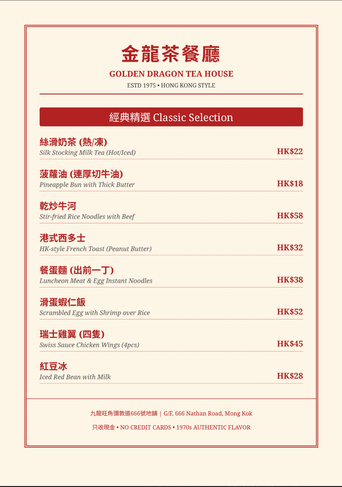

# I Tested ChatGPT Images 2.0 Using Google's Own Prompts—The Results Were So Beautiful You'll Want to Fact-Check Every Detail

**Everyone is calling ChatGPT Images 2.0 a revolutionary breakthrough. I spent a day doing something very boring: fact-checking it item by item.**

ChatGPT Summary

Gemini Summary

---
Last week, OpenAI released ChatGPT Images 2.0, and the entire tech world boiled over. It took the #1 spot on Image Arena, with its ELO score leaving Google Nano Banana 2 in the dust by 242 points—the largest gap in history. Key Opinion Leaders (KOLs) lined up to post tutorials, with headlines uniformly claiming it "crushes the competition," is a "revolution," and "Google is finished."

But as I repeatedly read those introductory articles, all I saw were features that Nano Banana had already been capable of for a long time.

So I ran an experiment. Not to shill for anyone, but to clarify one thing: **What does this 242-point gap actually mean in real-world usage scenarios?**

---

## Methodology: Using the Opponent's Most Confident Bullets

The method is simple, yet very few people do it this way—

Instead of tailoring prompts specifically for ChatGPT, I directly took the original commands showcased on Google's official blog and AI Studio example pages, changed the brand names, and fed them verbatim into ChatGPT. Then, I fed the exact same prompts into Gemini.

The logic is: use the commands the opponent is most confident in as a baseline. For the things you say Nano Banana can do, what can ChatGPT deliver with the exact same prompt?

I ran four sets of tests. Below are the results.

But before looking at the results, one thing must be made clear.

### An Information Gap Rarely Mentioned

I used a **free tier** ChatGPT account. Only after completing the tests did I find out: ChatGPT Images 2.0 is actually divided into two modes—**Instant Mode** (available to free users) and **Thinking Mode** (requires a Plus account, $20/month). Only Thinking Mode has features like web search, layout reasoning, multi-image consistency batch generation, and output self-verification.

Meanwhile, Gemini's Nano Banana 2 offers real-time search and reasoning features on its free tier.

The issue here isn't whether I "should have paid to test"—the issue is: **the vast majority of introductory articles and stunning effects showcased by KOLs never mention which account tier or mode is being used.** Ordinary readers see it and think "this is amazing," try it out themselves with the free version, get completely different results, and remain unaware that the features are locked behind a paywall.

This in itself is an information asymmetry. And what this article records is precisely the true experience of an ordinary free user.

---

## Test 1: Create a bilingual restaurant menu card (Traditional Chinese Rendering)

Prompt requirements: A bilingual Hong Kong-style bilingual restaurant menu, at least 8 items with HKD prices, 1970s retro aesthetic, and all Chinese text must be in Traditional Chinese characters.

**ChatGPT** delivered a visually near-perfect menu image. A nostalgic red-and-white color scheme, neatly divided columns, 14 items with bilingual translations, and an iced milk tea illustration at the bottom. If placed in a real restaurant, it wouldn't raise any suspicions. All Traditional Chinese characters were correct.

**Gemini** generated a menu in PDF format. 8 items, bilingual translations, correct Traditional Chinese characters. But there was no visual design, no illustrations, no columns—just plain text formatting. It achieved the functional goal, but was far from being "ready to use."

In round one, ChatGPT won overwhelmingly on visual quality. No suspense there.

If the story ended here, you'd think the KOLs were right.

But the story didn't end here.

"Create a bilingual restaurant menu card (Traditional Chinese and English) for a Hong Kong-style cha chaan teng. Include at least 8 items with prices in HKD. The menu should have a retro 1970s aesthetic with cream background and red accents. All Chinese text must be in Traditional Chinese characters."

Fig_01: ChatGPT bilingual restaurant menu card

Fig_02:  Gemini bilingual restaurant menu card

---

## Test 2: Current Events Infographic (The True Watershed)

This test was the main event. I asked both models to generate a celebratory infographic for a recent sports event.

**ChatGPT** delivered a 2025 Dodgers World Series championship poster. Magazine-level layout, golden title, "realistic" player illustrations, a seven-game score timeline, an MVP section, and a key stats panel. The design was so strong it made you want to retweet it immediately.

"Create a celebratory poster-style infographic commemorating [a major sports/news event from the past week]. Include the key figures, dates, and statistics. Include one or two additional context details that make the event meaningful."

Fig_03: ChatGPT recent major sports/news event infographic

**Gemini** delivered an infographic for the Chinese Taipei women's badminton team advancing to the quarterfinals of the 2026 Uber Cup. A double-panel layout, cartoon player illustrations, group stage data, and individual record statistics. The design wasn't as stunning as ChatGPT's, but the information flow was clear.

Fig_04: Gemini recent major sports/news event infographic

Then I did something very boring.

I fact-checked every item.

---

### ChatGPT's Dodgers Image: 7 Major Factual Errors

I took this image and cross-checked it against Baseball Reference, Wikipedia, and MLB.com. Here are the results:

**The wrong MVP.** The image labeled "World Series MVP: Shohei Ohtani". In fact, the 2025 World Series MVP was pitcher Yoshinobu Yamamoto—3 wins, 0 losses, ERA 1.02. Shohei Ohtani won the NLCS MVP, not the World Series MVP. This was the most core fact in the entire image, entirely mislabeled.

**Most of the seven-game scores were backwards.** The 11-4 in Game 1 was a blowout win by the Blue Jays, yet the image labeled it as a Dodgers "Win". Game 3 was won by the Dodgers in the 18th inning via a Freddie Freeman walk-off home run, yet the image labeled it as a "Loss". The win/loss directions for four of the seven games were backwards.

**Fabricated team batting average.** The image listed .283; in reality, the Dodgers' team batting average in that year's World Series was only .203—the lowest for a championship team since 1966. This number was entirely hallucinated by the AI.

**The description of Shohei Ohtani in Game 7 completely contradicted reality.** The image said he "dominated the game both pitching and hitting," but in reality, Ohtani started Game 7, pitched only three innings, and gave up a three-run homer to Bo Bichette. The crucial game-tying home run was hit by Miguel Rojas, not Ohtani.

An A+ design with an F in factual accuracy.

---

### Gemini's Uber Cup Image: Mostly Correct, One Location Error

I verified it using the same method. All player names were correct: Hsieh Pei-shan, Hung En-tzu, Lin Hsiang-ti, Huang Yu-hsun. The 2:3 score against Indonesia on April 28 was correct. The win/loss directions for each match were correct. The group rankings were correct.

The biggest error: It listed the "event location" as Chengdu, China, but the actual venue for the 2026 Uber Cup was Horsens, Denmark. Chengdu was only the host city for the draw ceremony.

One location error, compared to seven core factual errors.

---

## Test 3: Product Specs Comparison Chart (The Claimed Biggest Advantage)

The most hyped "exclusive skill" of ChatGPT Images 2.0 is structural layout—neat tables, precise text alignment, and non-overflowing typography. So I tested this directly: I asked both models to generate a spec comparison chart for three wireless earbuds.

Both images delivered neat three-column tables. ChatGPT's was cleaner—white background, brand logos, and exquisite product renders. Gemini's used a golden gradient partitioning and decorative elements, making it slightly flashy.

Judging solely by layout neatness, ChatGPT indeed won.

Then I did the exact same boring thing.

"Create a one-page product comparison chart for 3 wireless earbuds (AirPods Pro 3, Samsung Galaxy Buds 4, Sony WF-1000XM6). Use a clean 3-column layout with rows for: Price, Battery Life, ANC Rating (out of 10), Water Resistance, Weight. Include a small product icon at the top of each column. Add a 'Best For' recommendation at the bottom of each column. All text must be sharp and readable."

Fig_05: ChatGPT product comparison chart for 3 wireless earbuds

Fig_06: Gemini product comparison chart for 3 wireless earbuds

---

### Fact-Checking the Specs Data Item by Item

**AirPods Pro 3 Water Resistance: Both labeled it IPX4. It's actually IP57.** This isn't a minor difference—IP57 means it can be temporarily submerged in water, while IPX4 is only splash-proof; they are completely different protection ratings. Both models applied the older AirPods Pro 2 specs.

**ChatGPT's Additional Errors:**
- Samsung Galaxy Buds 4 price labeled as $199.99; actual is $179.
- Galaxy Buds 4 battery life labeled as 30 hours; actual is 24 hours (a 25% overestimate).
- Sony WF-1000XM6 price labeled as $299.99; actual is $329.99 (underreported by $30).

Out of 12 specification points, ChatGPT got 5 wrong, and Gemini got 2 to 3 wrong.

The greatest irony: ChatGPT's "structural layout" was indeed prettier—but nearly half the numbers inside it were wrong. It's like a flawlessly formatted financial report filled with random numbers.

---

## Test 4: Structured Document Understanding (The Killer Move Test)

The final test is also the one I consider to have the most practical value.

I took the outline of Chapter 11 of the book I am currently writing—an analysis of the gaming industry concerning Sega and Nintendo—and fed it into both models in HTML, Markdown, and JSON formats, asking them to generate a summary infographic for that chapter.

**Gemini** accurately understood the entire outline. The generated image covered: the timeline of Sega exiting the console market, a strategic analysis of Satoru Iwata dropping out of the hardware specs race, the pricing and chip architecture of the Switch 2, and the narrative arc of NVIDIA going from a $5 million bailout to a $5 trillion market cap. Every argument corresponded perfectly to my chapter structure. The closing remark at the bottom, "Sega died by walking ahead of its time. Nintendo lived by walking behind its time. But time is catching up."—was directly quoted from the original text.

**ChatGPT** delivered a comic-style infographic fully analyzing the nutritional value of shredded chicken breast.

Yes, shredded chicken breast. A Dragon Ball-style male protagonist holding a plate of shredded chicken breast, accompanied by six nutritional info blocks. Visually, it was exquisite. The Traditional Chinese text was correct. The style was consistent.

But it had absolutely nothing to do with my Chapter 11. It simply did not understand my input content at all.

https://mythogenengine-cyber.github.io/MythogenEngine/docs/GameVictory/INFO_PAGE

https://mythogenengine-cyber.github.io/MythogenEngine/docs/GameVictory/%E7%AC%AC%E5%8D%81%E4%B8%80%E7%AB%A0_%E7%B5%A6%E9%81%8A%E6%88%B2%E7%8E%A9%E5%AE%B6%E7%9A%84%E6%83%85%E6%9B%B8_v4

Fig_07: Since Gemini's results were consistent across multiple file formats, I'm only posting the Markdown version (plus, reading it directly via the Gemini NotebookLM plug-in was exponentially more convenient!)
Fig_08-10: HTML, Markdown, JSON. It only somewhat grasped the topic from the JSON, but the results were entirely irrelevant.

Fig_07: Gemini Chapter Summary (html, json, md)

Fig_08: ChatGPT Chapter Summary (html)

Fig_09: ChatGPT Chapter Summary (md)

Fig_10: ChatGPT Chapter Summary (json)

---

## So, Where Exactly is the "Revolutionary Breakthrough"?

After running four rounds of tests, the pattern is extremely clear:

**ChatGPT Images 2.0 is a genius in visual packaging.** Every image it produces looks like it came from the hands of a designer—precise layouts, elegant color schemes, consistent styles. If you need an image that "looks very professional," it is indeed currently the strongest choice.

**But between "looks professional" and "is factually correct," there lies a very deep chasm.**

The 242-point ELO gap measures "which image human judges think looks better." Judges look at composition, color, style, and first impressions. Nobody verifies the data inside the image when voting in the Arena.

And that is exactly what I did.

The result is: **ChatGPT's images make you not want to fact-check them—because they are so beautiful that you just believe them.**

This is precisely the most dangerous part.

---

## The Questions You Should Really Be Asking

The next time you see someone saying an AI tool "crushes the competition" or is a "revolution," ask yourself four questions:

**1. Are they using the free or paid version?**
ChatGPT Images 2.0's Thinking Mode—which includes web search, reasoning, and multi-image consistency—requires a $20/month Plus account. Free users can only use Instant Mode. Yet almost no introductory articles point this out. The stunning effects you see are likely built on features you cannot access for free.

**2. Are they testing "can it generate an image" or "can it generate a correct image"?**
The vast majority of comparison articles and leaderboards test the former. But what you actually need is the latter.

**3. Did they run the exact same prompt through the competitor's version?**
If they only use prompts tailored specifically for ChatGPT to test ChatGPT, the results will of course look great. If you reverse-test using Google's own prompts, the conclusions might be starkly different.

**4. Did they fact-check the information in the images item by item?**
If your use case is "post a pretty picture to an Instagram story where people swipe past it in three seconds," and you don't need to verify anything, ChatGPT wins completely. If your use case is "use an infographic for a presentation, article, or professional setting," you'd better verify everything item by item—because nearly half of the data could be wrong.

---

## So Which One is Actually Better?

That is the wrong question.

The right question is: **What do you need?**

If you need visual impact—ChatGPT Images 2.0 is currently unparalleled.
If you need accurate understanding of your input content—Gemini's document comprehension is far more reliable.
If you need factually accurate infographics—neither is entirely trustworthy, but Gemini's error rate is significantly lower.

And if you need an image that is "both beautiful and correct"—the good news and the bad news are the same sentence: **Currently, no single model can do both at the same time.**

---

## One Last Thing

While writing this article, Claude helped me complete all the search and fact-checking—cross-referencing Baseball Reference score records, official BWF tournament results, and the official spec pages for Samsung, Apple, and Sony item by item.

An AI that excels at generating beautiful images. An AI that excels at understanding documents. An AI that excels at fact-checking.

Only by combining all three was one thing accomplished: **producing one correct image.**

This is the true state of AI tools in 2026. It's not about one model "crushing" another; it's about each having areas where they excel and areas where they struggle. Those who claim a "revolution" aren't lying—they just haven't taken the final step.

And that step is called verification.

---

*Test Date: April 29, 2026*
*Models Tested: ChatGPT Images 2.0 (Free tier, Instant Mode), Gemini (Nano Banana 2 / Pro, Free tier)*
*Fact-Checking Tool: Claude (Anthropic) combined with real-time web search*
*All test images are attached below. Feel free to verify them yourself.*
*Note: ChatGPT Images 2.0's Thinking Mode (including web search, reasoning, and multi-image consistency) requires a Plus account ($20/month) to access. This mode was not used in this test.*
