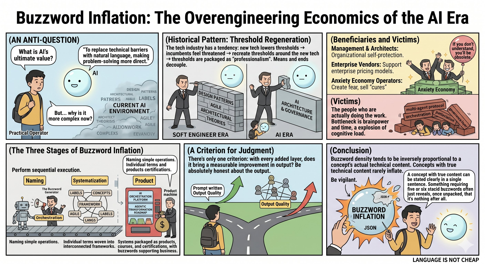

Author: Nebula Walker
Date: 19MAY2026
MYTHOGEN ENGINE (mythogenengine.com)

**📌 Examining the three stages of AI terminology inflation and how to distinguish necessary technical structure from gratuitous complexity.**

# Buzzword Inflation: The Economics of Over-Engineering in the AI Era

**What is the ultimate value of AI?**

If the answer is "replacing technical barriers with natural language to make problem-solving more direct," then why have the jargon, frameworks, and management methodologies surrounding AI become *more* convoluted than before AI existed?

This contradiction is not a coincidence.

——

**🔁 There is a recurring tendency in the tech industry (a tendency, not an iron law):**

New technology lowers barriers → incumbents feel threatened → barriers are rebuilt around the new technology → barriers are repackaged as "expertise."

The history of software engineering is full of examples. Design patterns, Agile management frameworks — they originally existed to solve real communication and quality problems in team collaboration. These solutions were genuinely effective in their specific contexts. But over time, means and ends gradually decoupled — following the framework itself became the goal, no longer a tool for solving problems.

(There are counterexamples, of course: the open-source movement did succeed in lowering barriers without being fully re-enclosed. The cycle is not inevitable, but it occurs frequently enough to warrant caution.)

AI was supposed to break this cycle. So far, the signs are not encouraging.

——

**📈 Three stages of buzzword inflation:**

**▸ Stage One: Naming**

Fundamentally simple operations are given professional-sounding names. "Execute several API calls in sequence" → "orchestration." "Add conditional logic to a prompt" → "agentic reasoning." "Split a task into multiple executions" → "task decomposition." Each act of naming elevates an everyday operation into a domain requiring specialized knowledge.

**▸ Stage Two: Systematization**

Isolated terms are woven into mutually referencing frameworks. Once you have orchestration, you need orchestration patterns; once you have agents, you need multi-agent communication protocols; once you have protocols, you need governance layers.

This creates a debt structure of terminology — to understand any one term, you must first understand all the others.

**▸ Stage Three: Commodification**

The system is packaged into products, courses, and certifications. Companies sell "AI orchestration platforms," consultants pitch "agentic transformation roadmaps," training institutes offer "multi-agent systems certifications."

👉 At this point, the function of terminology has fully shifted from "describing reality" to "sustaining a business model."

——

**💰 Who benefits?**

Management and architects — if AI makes development processes too straightforward, sprawling management structures lose their reason to exist. Repackaging AI applications as arcane knowledge can reasonably be inferred as organizational self-preservation. Though almost no one would publicly admit to this motive.

Enterprise software vendors — the statement "you just need to write a good prompt" is in fundamental conflict with enterprise pricing models. A narrative of multi-layered orchestration is what justifies six-figure annual contracts. This is standard B2B sales logic, not unique to AI.

Merchants of anxiety — manufacture the fear of "fall behind or become obsolete," then sell the antidote. The more buzzwords there are, the greater the surface area of anxiety, and the wider the harvest.

Who suffers? The people who actually do the work. Independent developers, one-person companies, small teams — whose bottleneck is their own brainpower and time. Every unnecessary layer of abstraction adds another layer of cognitive load and maintenance cost.

——

**⚖️ One criterion for judgment**

How do you distinguish "necessary structure" from "gratuitous complexity"?

👉 Does each additional layer produce a measurable improvement in output?

If yes, add it. If no, it is over-engineering. No framework needed — just honesty about outcomes.

The same applies to terminology itself: if a term can be removed and the original meaning still expressed clearly in plain language, it is decoration, not a tool.

"Orchestration" → most of the time, it is just "sequential execution." "Agentic" → most of the time, it is just "automation." "Multi-agent communication protocol" → most of the time, it is just "one JSON passed to another."

(A note: the qualifier "most of the time" matters. There are genuine scenarios requiring dynamic routing, error recovery, and parallel processing. The problem is not that these terms lack real technical referents, but that their usage has expanded far beyond the boundaries of their actual technical content.)

——

🎯 **Real technical depth does not need buzzword inflation**

The genuinely deep technical problems in AI — context window management, the dilution effect of model attention, controlling reasoning consistency — are rarely packaged into buzzwords.

Because these problems are specific enough that they resist inflation and are difficult to convert into "expertise" that can be sold at scale.

The density of buzzwords and the actual technical substance of a concept tend to be inversely proportional. Concepts with real content can be explained in a single sentence. Things that require five or six stacked terms to articulate are often that way because, once unpacked, the listener would discover — there is not much there.

——

This is perhaps the most dangerous inflation of the AI era.

Not the price of tokens, but the price of language.

