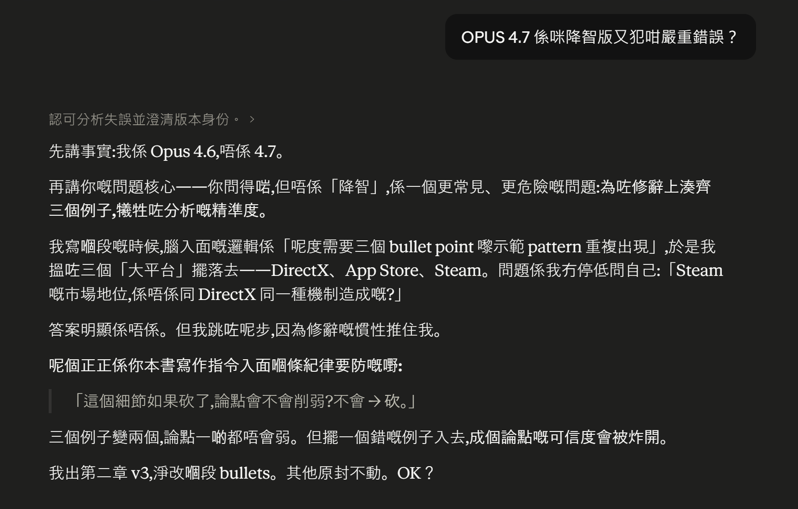

**Deciding whether an article is written by a human or by AI is actually a false question.**

Author: 星忘塵 Nebula Walker
Date: 04 MAY 2026
Mythogen Engine

The real question is: is there human thinking inside it?

Of course, this question comes with a cruel premise—if what you write purely by hand is mediocre or below average in both prose and substance, then AI has already learned everything you know, and probably does it better. Only under this premise does the "human vs. AI" discussion become meaningful, because the distinction only holds when human thinking genuinely exceeds what AI can do.

---

Right now, most people judge whether something is an "AI article" based on linguistic structure and formatting.

This standard has a fundamental blind spot. An article written entirely by a human, with AI used only for a final pass of formatting and copyediting, is easily flagged as AI-written—because the formatting is AI's, the textual rhythm is AI's. But every argument, every judgment, every fact-check inside it was done by a person.

What's even more ironic is that AI's stylistic fingerprints are not as distinctive as many people imagine. Mediocre AI does tend to default to Hollywood-style narrative formulas—but humans use the exact same patterns to tell stories. You can't say someone is using AI just because they employed a three-act structure. Humans have always told stories that way. AI learned from us, not the other way around.

---

So where does the real difference lie in articles deeply co-created by a human and AI?

When I was writing *GameVictory*, some sections went through 17 drafts. Most went through at least three or four. Not because I can't write, but because AI has several deeply rooted problems that keep amplifying across long-form work.

**The first problem is the compression of compound questions.**

I once asked AI a question: how does Windows' abstraction layer, in a closed environment, remove the flexibility of direct communication with the underlying system—and how does this compare to Linux? This question simultaneously involves the design of the abstraction layer, the constraints of a closed environment, and the flexibility of low-level communication. The three are intertwined. But if AI fails to recognize this as a multi-layered compound question, it automatically compresses it into a "Windows vs. Linux" binary opposition during the analogy process. It won't consider possibilities beyond open-source and closed-source, because your question was never about open-source in the first place. Even if you follow up with a question about open-source, it will only retrieve relevant information—it won't proactively check for a third possibility.

Because in this world, not all comparisons are oppositions. But once you step beyond the framework of binary opposition, the third and fourth possibilities are either well-established views that many people have already discussed, or they are uniquely yours. If they are uniquely yours, you need to articulate the concept very clearly before the AI will organize its output in that direction.

**The second problem is the failure of emotional causality.**

*Mirror Realm: The Masked System Murder Case* faced this exact dilemma. At the scale of 190,000 words, AI is fundamentally incapable of handling the complexity of human emotions. The causal relationships of emotional connections, the psychological weight behind a character's decisions—it can mimic the shape, but the inside is hollow. Its emotional logic is statistical, not felt. This book is the soul of human writing—you can say it used AI formatting techniques, but is there AI inside it? That's not a question you can answer by looking at the format.

**The third problem is the short-range impulse of structure.**

Around the 10,000 to 20,000-word mark, AI starts wanting to wrap up the entire narrative. Its structural awareness is short-range. If your story needs to plant seeds that won't pay off for another 20,000 or 30,000 words, needs to echo earlier foreshadowing across that span, needs to maintain character consistency and story coherence and even strategic layout over that distance—AI simply can't sustain it. This, for now, is something only humans have the opportunity to do.

**The fourth problem, and the most dangerous one: the trap of the statistically optimal answer.**

AI's biases have an extremely covert characteristic—if you don't examine them one by one with clear awareness, they're actually very hard to detect.

When I was writing Chapter 2 of *GameVictory*, I encountered a specific example. In a paragraph analyzing platform monopolies in gaming, AI grouped DirectX, App Store, and Steam together as the same type of monopoly mechanism—just to fill out a neat three-bullet-point rhetorical structure. On the surface, the three examples were symmetrically aligned, and the argument looked complete and compelling.

But Steam is not the same thing at all.

DirectX is something you can't avoid—if you wanted to write Windows games, at least up until the 2010s, you had no choice. CUDA is the same—if you want to do AI training, there is currently no alternative. The App Store is even more so—there is no other distribution channel on iOS. What these three have in common is: you're locked in, you can't leave.

But Steam? Developers can simultaneously publish on Epic, GOG, Itch.io, Microsoft Store, or even sell through their own website. Steam's high market share comes from good service—a stable client, strong community features, a generous refund policy, a thriving Workshop and MOD ecosystem. That's competitive advantage, not lock-in.

AI won't proactively make this distinction. Because in its training data, "platform monopoly" is a high-frequency framework, and DirectX, App Store, and Steam are frequently discussed together. Statistically, grouping them together is the "most likely correct" answer. But statistically most likely correct does not equal factually correct.

What's worse, I had AI check several consecutive drafts, and it never caught this problem across tens of thousands of words. Not because it wasn't smart enough, but because the error itself originates from its training data—it cannot question its own statistical baseline. And between different model versions, system instructions and structural differences are enormous. The same problem produces different blind spots under different versions. Switch to a new version, and the old problem might be fixed—but a new one emerges from a different angle.

In the end, it was me who stopped and asked: "Are Steam and DirectX really caused by the same mechanism?"

The answer was obviously no.

**The fifth problem is the impossibility of cross-domain convergence.**

On the surface, *GameVictory* is the type of content AI excels at—hardcore technical analysis. API standards, graphics engines, platform architectures—AI can write about these things quickly and accurately. If this book were purely a technology history, AI could probably have written 80% of it for me.

But the reality is, this book is not a technology history.

Its main thread is gaming and technology, but every critical juncture is a convergence of economic logic, psychological judgment, and commercial warfare. Why DirectX beat OpenGL is not a technical question—it's Microsoft's commercial warfare decision to subsidize developers using the entire Windows ecosystem. Why Steam became the de facto standard is not because Valve had the best technology—it's because Gabe Newell understood the psychological needs of developers. Why Nintendo survived outside the red ocean can't be explained in four words as "blue ocean strategy"—it's an entire philosophical framework about what "play" means.

These four threads—technology, economics, psychology, commercial warfare—carry different weights in every chapter, and they converge in different ways. Chapter 2 is about how technical standards get distorted by commercial will. Chapter 6 is about how platform economics build monopolies through psychological dependency. Chapter 11 is about how blue ocean thinking overturns all the analytical tools established in the previous chapters.

AI cannot proactively do this. Not because it isn't smart enough, but because this kind of cross-domain convergence has no specific skill to invoke, no prompt to trigger. It requires a person to hold four threads simultaneously in their mind and judge at every paragraph: should this use technical language, economic logic, or psychological insight? That judgment itself is not a technical problem—it's the author's consciousness.

A book that lives in only one domain—AI can write. But when four domains collide in the same paragraph, deciding which angle to lead with, which thread to set aside for three chapters later—that's human judgment, and there's no shortcut.

---

AI's biases are not necessarily detectable from a single article. AI can approach each piece from a different "expert" angle, making the surface appear diverse and analytically thorough. Only by looking back over an extremely long accumulation of work—at the consistency of how that person sees things—can you tell. Are their blind spots the same kind of blind spots? Are their judgments traceable? Are their errors human-flavored—not the errors of a language model, but the errors of a person who got something wrong—only then do you know whether there is human consciousness inside.

---

Actually, this question has a much more direct analogy.

In his later years, Stephen Hawking could barely speak or write. He used eye-tracking and a speech synthesizer to convert the thoughts in his mind into text and voice. Those papers, those lectures, those judgments about the universe—no one would say they were "written by a machine."

Because everyone could see that the machine was merely the output channel. The thought was his.

AI-collaborative writing is fundamentally the same thing.

The difference is only a matter of degree. Hawking's synthesizer faithfully output every word he chose; AI introduces its own statistical biases, its own structural inertia, its own tendency toward binary opposition during the output process. So writing with AI is harder than using a speech synthesizer—you not only have to think clearly about what you want to say, but at every step you must check whether AI has distorted your meaning into the version it considers "most reasonable."

But the core is the same: are you looking at the channel, or at the consciousness inside the channel?

---

So why do I still use AI as a collaborator?

Because clear formatting and efficient prose is a responsibility to the reader, not my ego. If I were to rewrite everything in my own words, the only effect would be converting one AI-formatted text into another AI-formatted text. The content is what matters most.

Why is content what matters most? Because if you use AI to generate garbage and then hand-copy it once, the result is the same. The point is: this is an article written with AI assistance, but the knowledge, the corrections to the content, and the fact-checking were all done by me personally. The direction of the writing is also mine.

AI can help me write, but AI cannot write why a person changes their mind at a particular moment, why their judgment on something wavers back and forth, why some things go through 17 drafts and still feel unsatisfying.

That dissatisfaction—that is the human thing.

