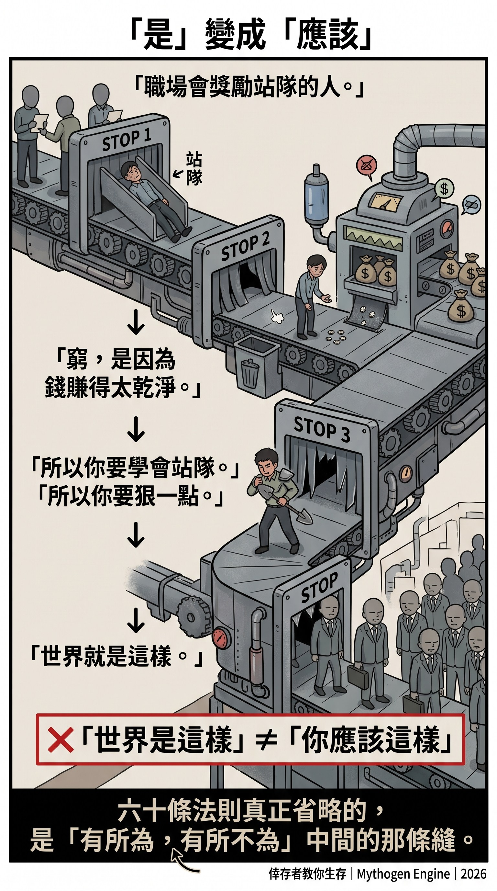
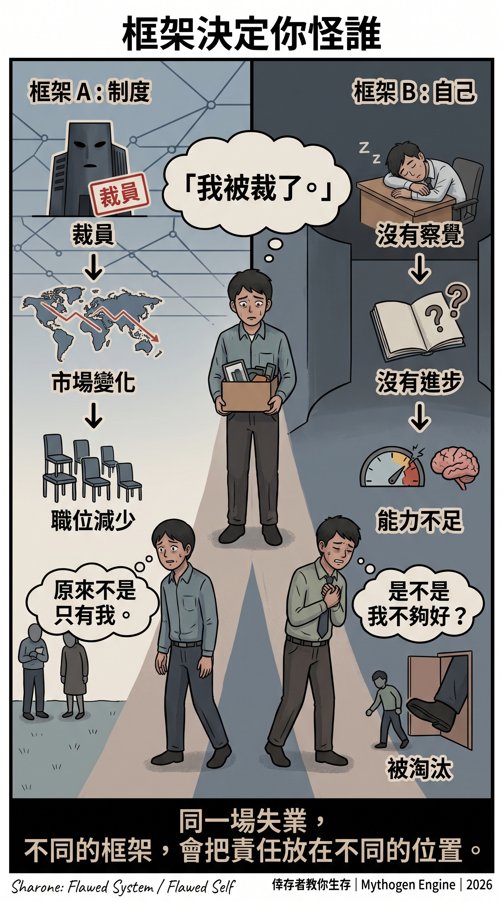
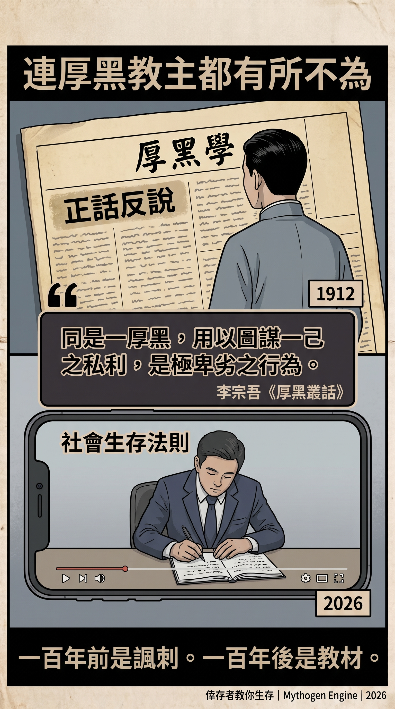

# The Survivor Teaches You to Survive

28 September 2026 · @Mythogen Engine

**Sixty workplace rules from an HR-pro-turned-headhunter, and the second half of each rule that was never spoken aloud**

This July, a Hong Kong career channel uploaded a video arguing that being laid off is actually a liberation—the real suffering belongs to those who stay behind. The host said that the laid-off walk away with severance, dust themselves off, and find the next gig. Those who remain are stranded on an island called "survivor," watching the storm circle overhead.

In September, the same channel released two back-to-back episodes reading out sixty "rules for surviving in society." By month's end, another video followed on the future of work in the age of AI.

The channel is called Jem Choi Amazing Recruitment. The host has worked in HR and as a headhunter; his profession is finding people for companies while coaching workers on how to job-hunt and how to survive their jobs. The pinned comment under every video is the latest batch of job openings.

After watching all four videos, what I most want to say is not that he got things wrong. On the contrary, a handful of the sixty rules are more incisive than most management textbooks. The problem is what he tells you to do after making those observations.

## I. The Rules He Got Right

Rule eighteen goes like this: the unspoken rules of the workplace are to praise the flatterers, promote those who call a deer a horse, sideline those who work like oxen, and punish the lone wolves.

He explains the last part himself: those who refuse to join any faction, or who are too capable but won't fall in line—without connections or a patron—are the easiest targets when interests collide, sacrificed as a warning to the rest.

This is not conspiracy theory. Anyone who has spent a few years in a large organization has probably seen such a person and watched how they left.

Rule sixteen says that school teaches benevolence and morality, but out in the real world you find nothing but vice everywhere. Rule eleven says you're poor not because you're lazy or incompetent, but because the money you earn is too clean.

Taken together, the three rules acknowledge three things: the system does not reward honest people; society says one thing and does another; clean money is not enough.

The late-September video also has its accurate moments. He says AI can hand you a dozen proposals at once, and without judgment criteria you'll just pick whichever looks nice; he adds that people who don't understand the domain will simply become a mouthpiece between the boss and the AI. I agree with both points.

If the videos stopped here, I would have shared them.

## II. Two Tones, One Function

The July video is gentle. He tells the survivors to be weather forecasters—step outside every day and watch which way the clouds drift. Be watchmakers—study how the gears of the company mesh, then turn with them. Finally, be farmers—tend to your own plot of land each day.

The closing line: your job title, your manager's mood, changes in the environment—those are all external weather. Your skills, energy, and mindset are your own field. Never mind how hard it rains outside; just tend to your own field.

A beautiful metaphor with only one problem: no one is responsible for the weather. Someone is responsible for layoffs.

Layoffs have meetings, lists, and signatures. Frame them as a storm, and the person who signed disappears—leaving behind a worker standing in the rain, reviewing whether they should have brought an umbrella.

September's tone is the opposite. Be bold, be ruthless. Spend half your energy on the work, the other half making sure your boss sees it. Don't let your sympathy run wild helping underperforming colleagues.

One says calm down. The other says toughen up. The tones are diametrically opposed, yet the function is identical: the problem is in you, the answer is in you. In both videos, the company is only the backdrop, never the subject.

The late-September video adds the final piece. He says layoffs are never overnight decisions; there's always a buffer period. Many who are laid off simply failed to notice the environment changing and stood still.

July tells you to be a weather forecaster. Late September tells you that being laid off means you didn't check the weather. Perfectly consistent—consistent in one respect: the person who decided to lay people off is never in the frame.

## III. From "This Is How It Is" to "This Is How You Should Be"

The real technique behind the sixty rules lies not within any single rule but in the unspoken second half of each one.

"You're poor because the money you earn is too clean." The first half is observation. The second half is never uttered, but the entire video paves the way for it: so get a little dirty.

"The workplace promotes those who call a deer a horse." The first half is observation. The second half, he says out loud: learn to manage up, make your boss see your value, know which side to stand on. In other words, since the system rewards calling a deer a horse, go learn to call a deer a horse.

Over two centuries ago, Hume already warned that you cannot derive an "ought" from an "is." The world being a certain way does not mean you ought to be that way. A classical Chinese phrase says the same thing more briefly: *there are things one does, and things one does not do* (有所為，有所不為). That gap is what makes a person human.

The job of the sixty rules is to close that gap.

The most thorough seal is rule thirty: Why do people love to talk about morality? Because moralizing lets you guilt-trip others and make yourself look elevated.

Read rule sixteen and rule thirty together: society does indeed say one thing and do another—but the person who points this out is the hypocrite. The mask is real; the one who tears off the mask is fake. The only language that could say "this is wrong" is thereby confiscated.

At this point, even someone who knows they have been hurt can no longer find a single word to call it wrong.

## IV. The Frame Decides Who You Blame

To say that this kind of advice does real harm is not rhetoric. The phenomenon has been studied seriously.

Sociologist Ofer Sharone, in *Flawed System/Flawed Self* (2013), compared unemployed white-collar workers in the United States and Israel. American job-search coaching teaches self-marketing, "chemistry," and attitude; Israel's system emphasizes credential-based screening. Both groups face the same unemployment, yet Americans tend to blame themselves, while Israelis tend to blame the system.

What determines whether an unemployed person blames themselves or the system is often not their circumstances but the frame that someone else hands them.

Barbara Ehrenreich wrote two related books. *Bait and Switch* (2005) is her account of posing as an unemployed white-collar worker, attending career coaches, job-search seminars, and networking events; she found that the entire industry sells attitude to the unemployed. *Bright-Sided* (2009) documents companies bringing in motivational speakers during layoffs to soothe the survivors. The July survivor video does the same job—the company just doesn't have to pay the speaker's fee.

Mark Fisher, in *Capitalist Realism* (2009), calls this move the "privatization" of stress: pain produced by structural forces is redefined as a personal matter for the individual to handle. "Tend to your own field" is the pastoral edition of privatization.

Finally, the cost. Stanford's Jeffrey Pfeffer, in *Dying for a Paycheck* (2018), compiled his and colleagues' research estimating that roughly 120,000 excess deaths per year in the United States are associated with management practices such as long hours, job insecurity, and workplace conflict.

Workplace practices themselves can cause harm—this is backed by research. Content that teaches people to treat those practices as natural and to adjust themselves accordingly is, in effect, sparing the harm from having to explain itself.

> [Author's note: verify Pfeffer's figure against the original text before citing.]

## V. Who Pays

HR and headhunters—one inside the company, one outside—both collect their fee from the employer.

HR handles hiring and firing, drafts documents, and reads the severance script. Headhunters find people for companies and charge on successful placement. The headhunter's client is the company; job seekers are the supply. A person who has worked both sides, now teaching workers how to job-hunt and survive, naturally views the world from the employer's vantage point.

This requires no speculation about anyone's motives. His videos are free because you are not the customer. The pinned comment already lays out the business model: first, survival rules; then, job openings.

Nor is he an outlier. What he says is simply how the HR and recruitment industry sees people: people are supply to be screened, the problem lies in the person, and the answer lies in the person. Every HR department I have encountered discusses employees exactly this way behind closed doors.

He simply took one extra step—opened a channel and said out loud, to the camera, what is normally said in the meeting room. So the real value of these four videos is a window: they let workers see how the person on the other side of the table looks at them.

In my article *The JD Is Generous, Reality Is Not* [link], I wrote about two measuring sticks: frontline workers measure whether the work is done well; decision-makers measure whether it's cost-effective. HR and headhunters are instruments of the second stick, yet they speak the language of the first: skills, effort, attitude, boundaries.

## VI. Not Enough Chairs

Take rule thirty-nine: poor people stick to their duty and avoid rocking the boat—and stay poor their whole lives. His advice is to proactively chase high-difficulty, high-visibility projects, and after work, pursue side gigs, content creation, and continuing education.

In the same article, I wrote about how factories rent out the "hope period" of young female workers: newcomers believe there is a ladder ahead and pour in effort far exceeding their pay. Once the ceiling becomes visible, effort drops. When factories can't recruit fresh hopefuls, they switch to fear, forcing veterans back into overdrive.

Rule thirty-nine doesn't even bother with fear. It resells the hope period to people who have already seen the ceiling, getting them to voluntarily hand over that extra portion.

The late-September video closes another door. He says the old line—"a bit less skill is fine, good attitude is enough, we'll train them slowly"—is outdated. Adult mindsets and sense of responsibility are hard to change. Screening outweighs training.

The white-collar hope period has always been propped up by "we'll train them slowly": fresh graduates and junior positions are where companies are willing to invest time in developing people. Screening over training means the company is no longer responsible for making you good; whether you're good is a matter of your own foundation.

Anthropologist Clifford Geertz called this state "involution": the amount of labor invested keeps rising while each person's share does not increase. There are still not enough chairs; everyone is just sitting harder.

The same video offers another tip: if there's no deadline, set one yourself. Something that normally takes a day? Try two hours. This is the self-service edition of involution—the company doesn't even need to apply the pressure.

Today, this discourse has a new backdrop: AI. The late-September video is quite candid: good companies will hire fewer and fewer people, preferring to leave a position vacant for six months rather than fill it with the wrong person. Fewer chairs—and the same video proceeds to teach you how to become worthy of sitting in one.

Many assume that AI is what's reducing the number of chairs. But AI could just as easily let people do less repetitive work; the gains from increased productivity could let more people sit down.

What turns it into an excuse for involution is not technology but the financialized logic of capital: returns must be visible this quarter, and costs must first be cut from headcount. In my *Efficiency Trap: Sequel* [link] I wrote: AI is not the cause—it's the license. The sixty rules teach you how to sit harder in front of the people who hold the license.

Then there is rule forty-seven: going Dutch on group dinners is pointless socializing; split-bill gatherings among the weak yield no valuable resources. In a world where everyone is anxious, that dinner among fellow travelers may be the only occasion to verify: "Is it just me who feels this way?" The sixty rules classify it as waste.

The late-September video is titled "Your Mediocre Circle Is Assimilating You." He suggests setting aside two days each quarter to meet friends at big companies, headhunters, and investors. Upward connections are called environment; lateral connections are called waste.

This is the same phenomenon I described in *Efficiency Trap: Sequel* [link]: most people cannot beat the rules, so they join the rules, internalize the rules. Those who refuse to internalize are classified as losers who make excuses. The sixty rules are the folk textbook of this internalization.

## VII. The Returning Bombers

During World War II, the U.S. military wanted to add armor to bombers. They tallied the bullet holes on planes that returned and planned to reinforce the areas with the most damage. Statistician Abraham Wald said they should reinforce the areas with no bullet holes—because the planes hit in those spots never made it back.

This is called survivorship bias. The sixty rules are armor bolted over the bullet holes on the returning planes.

A person who has lasted long enough in HR and headhunting has, by definition, passed the system's screening. He organizes the screening criteria into sixty rules and tells you that this is how the world works. But the only people he can see are those who passed the screening—himself included.

Those who were screened out don't open channels, don't shoot videos, don't leave comments saying "I followed the rules and still got laid off." The truly fatal spots are on the bodies of those who never came back.

In my FDE article I wrote: a system that operates this way long enough gradually selects for the people who carry the least psychological burden about these practices, and pushes them upward. One step further: then those people, having been pushed up, come out and teach you how they survived.

The July video is titled "survivor" and is about those who stay in the company. But the most archetypal survivor on the entire channel is the host himself. He is a product of the screening, and now he speaks on its behalf.

Rule three of the sixty actually says it all: the world is strange—it keeps pushing the living toward death, yet counsels those who want to die to keep living.

The remaining fifty-nine rules then teach you how to be pushed with a little more dignity.

## VIII. No Choice, and Having a Choice

By this point, rule thirty has probably already sounded in the reader's mind: you talk about morality only to make yourself look elevated.

So let me be clear about who this article is criticizing.

Under the videos, someone commented: "Being honest just makes you the fool, so the whole culture is built on scamming." Someone else said: "Every line is the truth." Under the July video, another wrote: "Hongkongers are trapped by their mortgages. If they didn't have to service a loan, workers would have a lot more backbone."

These people are not the target of my criticism. They are people who have been hurt, and the video gave them an explanation that is easier to accept than "the system is broken"—because this explanation leaves a way out: just be ruthless enough, and you'll make it.

A person carrying a mortgage with no savings who keeps their head down has no choice. Before saying "there are things one does not do," you need the capital to not do them. Those with no choice who bow their heads deserve understanding.

But someone with professional standing, a platform, and ten thousand listeners—that person has a choice. He could choose to tell his audience that rule eighteen describes a broken system. Instead, he chooses to tell them to learn which side to stand on inside the broken system.

Responsibility is proportional to choice. Those without choice who bow their heads bear the least responsibility. Those with choice who choose to bow bear a little more. Those with choice, a platform, and ten thousand listeners who teach others "you have no choice"—they bear the most.

His harm is not in taking away someone's choice but in taking away someone's knowledge that they have a choice. Sharone's research speaks precisely to this: same unemployment, different frames—one group blames the system, the other blames themselves.

I don't think he is a bad person. He most likely truly believes every word he says. That is precisely what is most unsettling: once assimilation is complete, even the person teaching others to assimilate no longer realizes what they are doing.

Those without choice who bow their heads deserve understanding. Those with choice who teach others they have no choice—that is the truly unforgivable part of these sixty rules.

## IX. Even the Godfather of Thick Black Theory Drew a Line

The "dissect the word 'benefit'" trick, the "be bold and ruthless," the "filter out worthless people" in the sixty rules—they read like a modern abbreviation of one particular book: Li Zongwu's *Thick Black Theory* (厚黑學).

In 1912, Li Zongwu published *Thick Black Theory* in a Chengdu newspaper, arguing that those who achieve great things must have thick skin and a black heart. Readers were outraged. Posterity has largely read it as a work of satire delivered straight-faced: laying bare the sordidness of officialdom so that readers can see for themselves how ugly it is.

Li himself feared being misread. In his *Thick Black Discourses*, he wrote that he composed *Thick Black Theory* entirely in the mode of the Spring and Autumn Annals—recording events plainly and letting good and evil reveal themselves. He added that the same thick-and-black methods, when used for private gain, are the most despicable of acts; when used for the public good, they are the highest morality. Therefore, anyone who does not understand the Spring and Autumn mode of writing should not read *Thick Black Theory*.

He even prophesied about his future readers: those who merely hear the term and rush to practice it will, the thicker and blacker they become, only fail harder.

A century later, an HR-pro-turned-headhunter, speaking in Cantonese, read *Thick Black Theory* as a worker's survival guide. The irony of the Spring and Autumn style is gone, the satire is gone, and even the line that the Godfather of Thick Black Theory himself drew has been erased.

Even the Godfather of Thick Black knew there were things one does not do. When the survivor teaches you to survive, he leaves out even that sentence.

Among the featured videos recommended on his channel, one has this title:

"Fired the most honest employee—next day, the entire company collapsed."

---

### References

- Li Zongwu, *Thick Black Discourses*, vol. 1 ([Handian Classics](https://gj.zdic.net/zibu/407/10766.html))
- Ofer Sharone, *Flawed System/Flawed Self: Job Searching and Unemployment Experiences* (2013)
- Barbara Ehrenreich, *Bait and Switch* (2005); *Bright-Sided* (2009)
- Mark Fisher, *Capitalist Realism* (2009)
- Jeffrey Pfeffer, *Dying for a Paycheck* (2018)
- Clifford Geertz, *Agricultural Involution* (1963)
- Jem Choi Amazing Recruitment: Survivor video (19 July 2026), Thirty Rules for Surviving in Society (23 September 2026), Rules 31–60 (25 September 2026), Ten Points on the Future of Work (30 September 2026)
