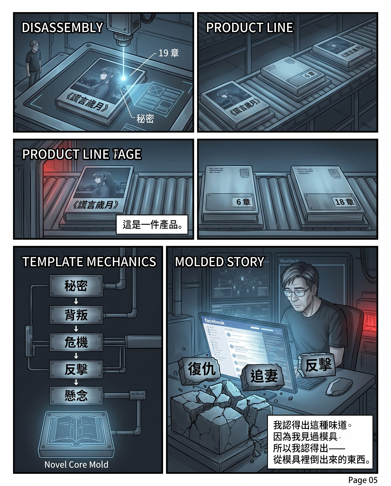
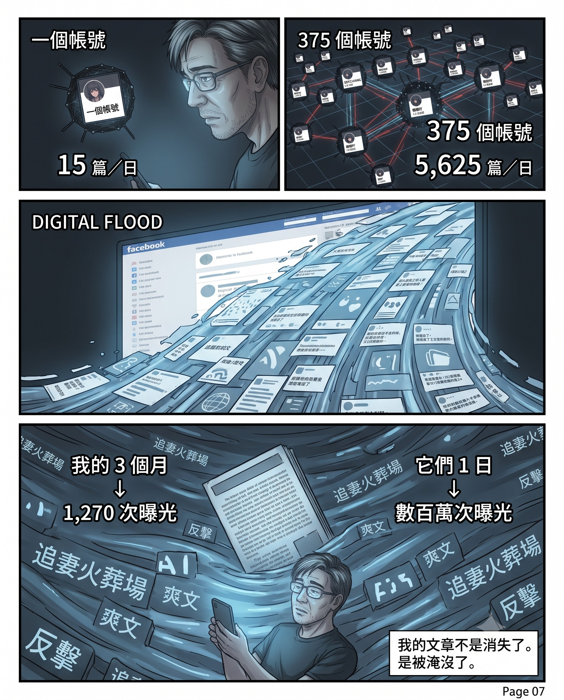
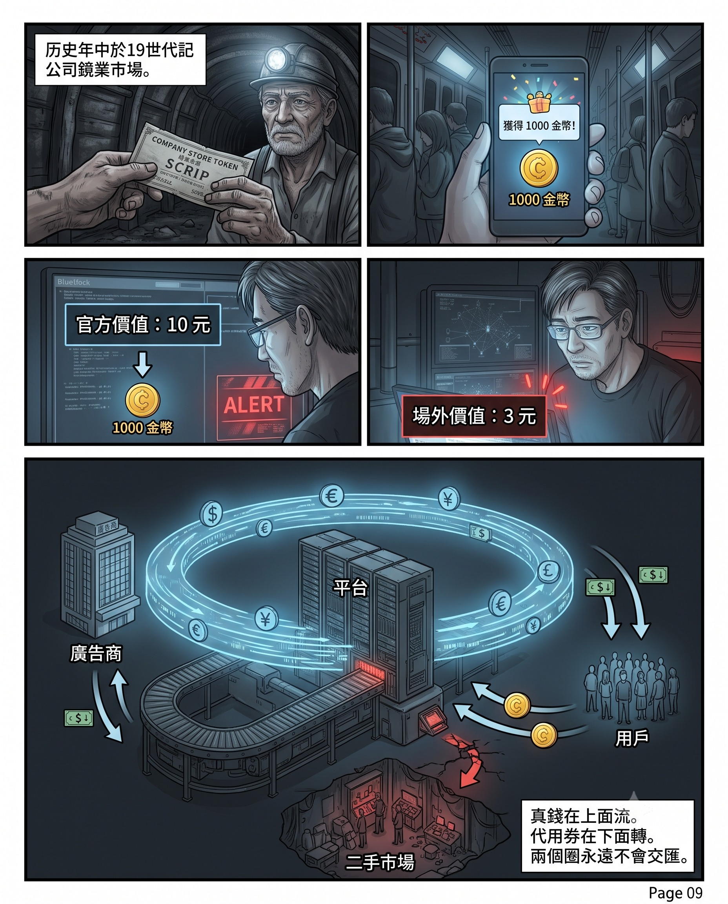
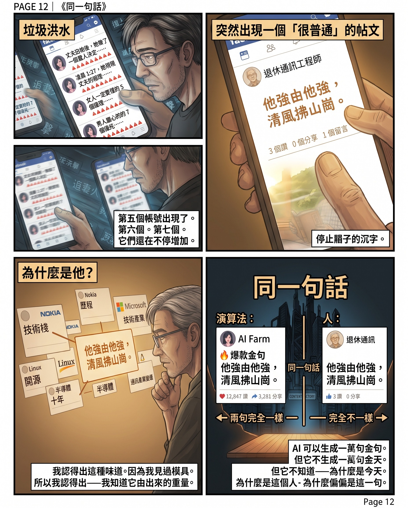

Author: Nebula Walker
Date: 21JUL2026
MYTHOGEN ENGINE (mythogenengine.com)

**📌 Half an hour, three accounts, the same article — a complete industrial chain from AI production to AI consumption, winning an information war without needing an enemy.**

# Half an Hour on the Assembly Line — When Content Farms Don't Need an Enemy to Win an Information War

## I. Three Times, Then Four

One evening in July, I was scrolling through Facebook.

My feed was crammed with garbage as usual. I swept past it at my normal speed — two seconds per post, not worth stopping, swipe on. Then I saw a post: an AI-generated anime-style illustration of a woman in profile, dark long hair, holding a phone, cityscape skyline in the background. The caption read:

"At 1:27 a.m., Wen Yan found a search record in her husband's account — one that could destroy her career."

I scrolled past.

A few minutes later, the same image appeared again. The same text. But from a different page.

I paused. Then kept scrolling.

Less than ten minutes later, a third time. A third page. Same image. Same text. Word for word.

Within half an hour, three different accounts had posted the same article.

I started feeling something was off. Not from intuition — because I had researched this sort of thing two years ago. AI fiction generation tools, automated account matrices, batch distribution workflows. I'd seen those tools' interfaces, knew what their products looked like. So when the same article appeared on my feed for the third time, I recognised the flavour.

Later I began organising screenshots, checking account details, tracing links. While I was doing all this, the algorithm kept working. A fourth account appeared — "Sister Youran on Emotions," 140,000 followers, bio claiming "11+ years of professional emotional guidance" and "helped tens of thousands of families achieve transformation." What had it posted two hours earlier? The same AI anime girl. The same "At 1:27 a.m., Wen Yan found in her husband's account." Three hundred and eighty-seven likes, nineteen comments, eight shares.

A self-proclaimed emotional guidance expert with 140,000 followers, posting AI-generated formulaic fiction. Three hundred and eighty-seven likes.

And it wasn't just my Facebook that had the problem. I switched accounts — same thing. Incognito browsing — same thing. The specific accounts differed, but the type was identical. This matrix wasn't targeting me — it covered everyone.

## II. The Accounts

I clicked into those pages.

"許你万丈光芒好" (Wishing You Infinite Radiance). 20,000 followers. Category: Fan Page · Podcast. Address: 4/F, Kowloon Bay Industrial Centre, 15 Wang Hoi Road, Kowloon Bay, Hong Kong. Language: Standard Mandarin. Bio: "Reborn to punish the scum, satisfaction points packed tight. Face-slapping within the day, revenge feels great." 100% recommendation rate — from six reviews.

"漢堡迷你世界" (Burger Mini World). 89,000 followers. Category: Fan Page · Reel Creator. Address: Caldas, Antioquia, Colombia. Zero reviews. Interest: Music.

"娜娜吖" (Nana). 130,000 followers. Category: Fan Page · Blogger. Bio: "Big Baby Totoro." 98% recommendation rate — from seventy-one reviews. Reviews included praise in Portuguese, thanks in Spanish, one Chinese comment saying "the cute kind," and a string of randomly typed letters.

"悠然姐講情感" (Sister Youran on Emotions). 140,000 followers. Category: Fan Page · Podcast. Bio: "Dating strategies | Emotional nourishment | Women's growth." One review.

Four pages. One in Hong Kong, one in Colombia, one somewhere unknown, one disguised as an emotional counsellor. Followers ranging from 20,000 to 140,000. Categories spanning Podcast to Reel Creator to Blogger.

But on the same evening, they posted the same image, the same text, linking to the same website.

## III. The Factory

I followed the link.

The site was called vsdm8.com. A free fiction reading platform.

The first screen was a category filter page. One glance and I knew what this was — because when I researched AI fiction generation tools two years ago, I'd seen an identical structure. Those tools' outline generators used exactly this kind of classification system. The labels weren't for readers to choose from — they were for the assembly line.

The top two tabs: "For Women," "For Men."

Sub-categories below: Member Short Stories, Premium Short Stories, Trending Web Fiction, BL Short Stories.

Then trending tags: Chasing the Wife to the Crematorium, Face-Slapping the Scum, Cheating, Power Fantasy, Strong Female Lead, ABO, Second Male Lead Wins, Healing, Sweet Romance, Broken Mirror Reunited, Revenge, Marriage, Comedy, Scumbag.

Then themes: Romance, ABO, Marriage, Real-World Emotions, Brain-Hole, Suspense, Sci-Fi, Political Intrigue, Fantasy Romance, Fan Fiction, Pure Love, Folk Horror, Period Piece, Family.

This wasn't a bookshop's shelf arrangement. It was a factory's production spec sheet. Each tag was an SKU number for an assembly line.

I found the "Wen Yan" article in the reading lists. The title was *Years of Lies*, author "Anonymous," tagged "Marriage," completed, nineteen chapters. It was displayed alongside three other novels — *Love at Dawn* (six chapters), *When the Doormat Found a Powerful Husband* (seven chapters), *Caught Cheating in the Wedding House, I Married the Special Forces Captain* (eighteen chapters).

Every single one opened with the same formula: a woman discovers her husband's secret, then strikes back. All covers were AI-generated photorealistic female portraits. Six, seven, eighteen, nineteen chapters — all short enough to be batch-generated by AI in a single afternoon.

## IV. The Product

I opened the nineteen-chapter *Years of Lies* and skimmed a few passages.

Not a close read. Just confirming my assessment.

The first paragraph: late-night office, husband's secret account, a search record that could destroy a career. Skip a few pages — patent litigation, commercial espionage, the third party is a young intern. Skip a few more — "This is worse than an affair."

I don't know what the whole book is about. I didn't need to. Skimming a few passages was enough to tell: this was formulaic hook-writing. Short sentences every few lines for emotional beats, rhythm unnaturally uniform — too even to be handwritten. Professional terminology sprinkled generously but all floating on the surface — "overseas technical documents from twenty years ago," "patent invalidation cases," "family of patents" — sounds professional, none of it would withstand scrutiny from an actual legal professional. Strip the skeleton bare and it's standard short-video script components.

I recognised the flavour because I'd researched those generation tools two years ago. I'd seen the moulds, so I could recognise what was poured out of them.

But here's the problem. I could tell even while skimming because I knew what to look for. A normal person scrolling their feed wouldn't jump in and skim several passages — they'd only see the AI-generated cover image and that "At 1:27 a.m." hook, then decide whether to scroll past or click in.

And in that split-second of decision, this piece and my article "Fire Extinguishers Now Have Price Tags" looked the same on the feed. Both long-form, both with an engaging opening, both with "professional-sounding" details, both with images.

Indistinguishable.

And on the algorithm's scale, this hook-bait piece actually "outperforms" my article — its emotional hooks are denser, suspense rhythm faster, every paragraph short enough to scroll through without thinking. My articles require the reader to understand platform economics structures, to be willing to stop and think. These are all sources of friction. In a system that ranks by dwell time and click-through rate, low friction always wins.

I once wrote: "The packaging of lies and truth was always remarkably similar." Now I was holding the control group in my own hands.

## V. The Scale

But what truly startled me wasn't one article. It was the scale.

Back to those four accounts. Each posted ten to twenty pieces a day. And those were only the four I stumbled on in one evening.

I tried searching with different accounts and incognito browsing. Each time I saw different farm accounts — because the algorithm assigns different accounts to cover different audiences based on each user's behavioural data. This means the matrix is far larger than what any single user can see.

Then I discovered that vsdm8.com was just one of the fiction sites. The same account network was pushing other sites. The same operating model — same account scale (20,000 to 200,000 followers), same posting frequency (ten to twenty per day), same AI cover art style — but directing to different domains. Some did romance, some did CEO-fantasy, some did borderline content. Each product line had a unified visual style but didn't overlap, making users think they were different "authors" with different "stories."

A conservative calculation. Assume five fiction sites, five product lines per site, fifteen accounts per line. That's 375 accounts. Each posting fifteen times a day. Over 5,000 posts per day.

Each account has between 20,000 and 200,000 followers. Even counting only the minimum organic reach rate — say 5% of followers per post — a 20,000-follower account reaches 1,000 people per post, fifteen posts a day equals 15,000 impressions. Add up 375 accounts and daily impressions easily exceed millions. And "Sister Youran on Emotions" alone had 387 likes on that single post — if every account had similar engagement rates, multiplied by thousands of daily posts, the total is astronomical.

Meanwhile, my page — over three months, fifty-three articles, averaging twenty-four impressions each. Total impressions roughly 1,270.

Their output in a single day was several thousand times my three months.

## VI. The Assembly Line

How is this content produced?

I already knew the answer two years ago.

Back then I researched a batch of AI fiction generation tools. Novel PD was one of them. Its website made no effort to hide it: "AI web novel generation toolkit. Supports high-efficiency creative workflows of 10,000 words per day or 1,000,000 words per day." It had an outline generator, chapter management system, batch generation capabilities, progress tracking dashboard. This was factory management software language, not writing tool language.

Novel PD was just one of many. Similar tools abounded — some specialising in romance, some in fantasy, some doing everything. Two years ago they could already generate complete novels. Two years later, what improved wasn't capability — it was cost and length. The time to generate a nineteen-chapter novel compressed from hours to minutes, cost from dozens of yuan to virtually zero.

Every tag on vsdm8.com's category page — Chasing the Wife to the Crematorium, Face-Slapping the Scum, Broken Mirror Reunited — in these tools, each one is an outline template. The operator selects a tag, fills in a few character names, hits generate. Minutes later, a "novel" appears. Cover images are likewise AI-generated — which also explains why every product line's covers look "exactly alike": same batch of prompts, same model, same assembly line.

When I saw these tools two years ago, I thought: "Who would use this stuff to seriously publish a book?" The answer: nobody was seriously publishing. What they took seriously was the monetisation pipeline. The book was just the liquid flowing through the pipe — any liquid would do, as long as it flowed fast enough. Novel PD's value wasn't in helping people write good novels — it was in driving the cost of "content" as a raw material to zero, so the entire pipeline could run at minimum cost.

## VII. Consumption

But after production, who's reading?

I got my answer on the street.

One day on public transport, I saw the person next to me "reading" one of these novels on their phone. But they weren't reading. They had a text-to-speech AI tool running, letting the machine read the novel aloud. They were doing something else.

And they clearly weren't seriously listening to a story. The posture — phone set aside, occasional glance, attention mainly elsewhere — was more like idling.

Then it clicked.

Many of these free fiction platforms monetise not just through ads. They have check-in systems, points systems, task chains: you "read" enough chapters, stay long enough, complete designated actions, and you accumulate coins or points redeemable for free chapters, gifts, or even small cash withdrawals. The design logic is identical to mobile game monetisation systems — "free" as bait, task chains to trap your time.

So that person wasn't a reader, not even a listener. They were trading their device's dwell time for platform points. Using AI narration to idle was the most effortless method.

And so both ends of the assembly line were machines: one end AI writes, the other end AI reads. The "person" in the middle isn't a consumer — they're a play button.

## VIII. Scrip

How much are those points worth?

In nineteenth-century American mines and factories, there was a practice: instead of paying in US dollars, companies issued their own scrip, redeemable only at the company store. Workers thought they had wages, but those vouchers were worthless outside company walls. No matter how much you worked, you couldn't escape the loop — your "income" was only valid within its ecosystem.

Platform points and coin systems are digital scrip. The coins you accumulate on one platform can't be exchanged for anything on another. Cash-out has thresholds, fees, minimum amounts — designed to make you feel "almost there," so you keep idling.

And some people — probably many — take these points to secondary markets to sell. This behaviour itself proves one thing: these points' official exchange rates are fictional. If a thousand coins are officially worth ten yuan but can be bought for three on the grey market, then the idling person earns not a few cents per hour, but thirty percent of a few cents.

This is worse than food delivery platforms. However squeezed delivery riders are, the food they deliver is real, the eaters are real, the payment is in real currency. Here, the "workers" receive vouchers that circulate only within one ecosystem — worthless the moment they leave. And they don't even know they're labouring — they think they're "reading free novels and earning a bit of pocket money on the side."

Advertisers pay in real dollars. The platform collects real dollars. Users receive coins. Real money flows at the top, scrip circulates at the bottom. The two circles never intersect.

## IX. Multi-Instance
.jpg)
And this chain has one final layer.

If idling on one phone earns a few cents per hour, running twenty emulators earns a few yuan. Running them a dozen hours a day, a few dozen. A month, over a thousand.

At this point, even the "real person" at the very bottom no longer needs to be a real person. Twenty emulators pretending to be twenty users, each emulator running an AI-narrated novel page, each page generating ad impression records. The advertiser thinks they've bought twenty people's attention; in reality, one person opened twenty virtual devices.

Does the platform have any incentive to investigate? No. Because active user counts and ad impressions are the inventory it sells to advertisers. More inventory, higher prices. Discovering the truth would actually be a loss.

The entire chain from top to bottom: AI produces content at zero cost, account matrices distribute at zero cost, algorithms push for free, emulators batch-idle to "consume," the platform sells fabricated user data to advertisers, advertisers write fabricated impression data into their own KPIs. Every layer knows the numbers are inflated, but no one has any incentive to expose it.

From start to finish, real money only appears in one segment — advertiser paying platform. Everything else is a loop of phantom numbers and scrip. And the one who ultimately pays the bill is the brand behind the advertiser — whose advertising budget ultimately comes from product pricing, which is you and me.

## X. Selling Shovels

If you think this operation requires high barriers and a tech background — it doesn't.

Because people are teaching courses on it.

I remember the claw machine craze a few years back. An entire industry chain sprouted around the business: people teaching courses on how to operate claw machines — site selection, claw strength calibration, break-even period calculation. The courses didn't sell "how to grab a lobster" — they sold "how to run a lobster-grabbing business." And the real income for instructors wasn't lobsters — it was tuition.

Now the same type of people are doing the same thing online. People teach courses on using AI tools to build web fiction matrices — how to nurture accounts, batch-post, maximise ad revenue share. Students pay tuition, receive an SOP, then each opens accounts and runs them. This explains why those accounts have identical styles but don't look like they're managed by the same person — they're using the same textbook.

So those four accounts I saw on Facebook — "Wishing You Infinite Radiance," "Burger Mini World," "Nana," "Sister Youran on Emotions" — might not be employees of the same company. They could be four independently operating "students," using the same tools, the same templates, the same fiction platform, each running their own account matrix.

The old saying from the California Gold Rush: most miners lost money; the shovel sellers always won.

## XI. General-Purpose Infrastructure

This system isn't just for pushing novels.

A few months ago, my Facebook feed was saturated with memory-chip ETF promotional posts. Different accounts, different "financial KOLs," different "investment gurus," all pushing the same thing. The operating model was identical to tonight's fiction farm: unified talking points, account matrices, algorithmic amplification.

I wrote three HBM industry analyses at the time, trying to deconstruct the real industry structure behind those promotions. Those three articles were blocked in multiple AI tutorial groups — reason unclear, most likely classified as spam or self-promotion.

And those groups weren't empty. They had abundant AI news, hands-on experiences, tool reviews — quite active discussions. But careful observation revealed: the groups didn't lack critical content — the right to be critical was monopolised. Core figures could publish insightful judgments — building their authority; but equally deep judgments from outsiders would be blocked — because what they threatened wasn't discussion quality, but the power structure of the ecosystem. The same statement, spoken by the instructor, is "insight"; spoken by you, it's "spam." I wrote about this phenomenon in "Fire Extinguishers Now Have Price Tags": "The same viewpoint, spoken by someone without a name, is 'an attack'; spoken by someone with distribution weight, is 'insight.'" That article addressed the platform level; here it's the same mechanism replicated at the group level.

I know these groups' ecosystems are more closed than they appear, but the specific evidence belongs to the private relationship level — I know people inside, so I know which "different users" are actually the same company's people. Without that coincidence, I too would have thought it was just a normal learning community.

And that is precisely its strongest protection mechanism.

Facebook's group moderation system is invisible by design. When a moderator deletes your post, you receive no notification. Your own page may still show the post, but others can no longer see it. You won't know you've been silenced. And all of Facebook's transparency tools — the Ad Library, Page Transparency, developer APIs — record none of the moderation actions at the group level. No log, no record, no appeals process. A moderator deletes your content, and that action doesn't exist in any system.

You can't produce evidence of "I was deleted" because the system is designed to never generate that evidence.

The strongest evidence is the system's property of never producing evidence.

But back to the main thread. The memory ETF example proves that the infrastructure used by fiction farms — account matrices, algorithmic recommendation, volume suppression — is not specialised equipment only capable of pushing novels. It's a general-purpose information-flooding infrastructure. Run novels today, financial products tomorrow, fake pharmaceuticals or election interference the day after — anything that needs volume to drown out truth. The pipeline is fixed; swap in a different liquid and it's a different business.

It's not that there are no clear-headed people. It's that the clear-headed voices have already been drowned out.

## XII. An Information War Without a Commander

Looking back at the complete shape of this chain:

AI tools batch-generate novels. AI generates cover images. Account matrices distribute to Facebook. Algorithms push to users. Users use AI narration to idle-"consume." Platforms pay in scrip points. Points flow to secondary markets and are sold at a discount. Emulator multi-instancing amplifies the entire pipeline. Course instructors sell shovels on the side for tuition.

From production to consumption to payment to training, every link is in position.

And the most notable characteristic of this chain: no one is in command.

No CEO orders "produce five thousand Chasing-Wife-to-Crematorium stories today." No company name appears in any link. This is a decentralised, self-organising, economically incentivised system. Course instructors sell shovels, students open accounts, AI tools provide productivity, Facebook provides the pipeline, advertisers provide real money, idlers provide device time. Nobody needs to coordinate with anyone, and the entire chain runs automatically.

Each link in isolation is "legal" — AI writing is legal, opening accounts is legal, posting is legal, algorithmic recommendation is legal, user idling is voluntary, point trading is private commerce. Nobody breaks the law, nobody does anything wrong.

But combined, the effect is information-warfare grade.

The goal of military-grade information warfare has never been to "promote a particular message." Its goal is to make all messages meaningless. Generate enough noise so that no one can distinguish true from false, and the real thing automatically loses effect. You don't need to delete the truth — just bury it in garbage until nobody can find it.

And this system is harder to fight than actual information warfare — because information warfare has an enemy you can point to and say "you did this"; this has no enemy, every participant is just "making a living."

## XIII. The Defendant's Seat Is Empty

All the articles I've written before — "A Distribution Ledger of One Account," "The Reader in the Anomaly Report," "The Efficiency Trap" — criticised institutions. How Meta suppresses me. How YouTube silences creators. How companies lay off workers to cook the books. Each had a defendant's seat with a named institution sitting in it.

This article's defendant's seat is empty.

Sitting in it — if "sitting" still applies — is a resultant force produced by several thousand self-interested people each making their most rational individual choice. Nobody planned it, nobody commanded it, nobody needs to be accountable for the outcome.

Even the word "victim" needs redefining.

Xiao Lin from "The Efficiency Trap" was a capable person, wrapped in the sugar coating of "promotion and raise," thinking he'd won. He had real skills, but his real skills were converted by the valuation formula. He was deceived. That chain ran on ignorance and self-deception.

This chain is different. The people producing garbage aren't deceived — they knew from start to finish what they were doing. They never thought they were creating content; they never cared about content. What they cared about was whether the pipeline was flowing, whether traffic was enough, how many pieces went out today. Their moral threshold was already low, which is precisely why this pipeline runs so smoothly.

The two chains — "The Efficiency Trap" and this one — are actually two strata of the same world. The upper stratum: capable people are respectably converted. The lower stratum: people without boundaries flood everyone's attention with garbage. Together, they form the complete picture.

The real victims are you. Every person who opens Facebook and is forced to scroll past hundreds of "Chasing Wife to Crematorium" posts. Every person who wrote something real but got only twenty-four impressions. Every person who thinks they're watching "public discourse" but is actually watching industrial wastewater.

Between perpetrator and victim, there is zero overlap. The people producing garbage never consume their own product. The victims don't know they're victims — because they assume what's on their feed is "natural."

## XIV. True Qi

While writing this article, new farm accounts continued appearing on my Facebook feed. The fifth: "Su Yi — Hair Lab," 34,000 followers, categorised as "Editorial/Opinion," bio: "Choose the right hairstyle, double your beauty," zero reviews. Posting the same image, the same "At 1:27 a.m." text. It even posted another website link in its own comment section — nvbad.com — leading to the same *Years of Lies*. Meaning the same AI-generated novel existed not just on vsdm8.com but also on nvbad.com. Two domains, one pipeline.

But on the same feed, sandwiched between farm posts, I saw something else.

A retired telecommunications engineer I know — someone who usually writes about Nokia, Microsoft, and Linux tech industry evolution, rarely posts quotes — posted a passage from *The Heaven Sword and Dragon Sabre*:

"Let him be strong, the clear breeze sweeps the mountain ridge. Let him be fierce, the bright moon shines upon the great river. Let him be vicious and cruel as he will — I need only keep my true qi full."

I read this passage as a child. Back then it was martial arts fiction philosophy about cultivating inner strength. Adults would scold: stop reading these idle books, study your textbooks. Nobody thought this stuff was useful, including me.

Decades later, the same passage, posted by someone who's lived through the entire rise and fall of the tech industry, in an environment where AI content drowns everything — the meaning had completely changed. And the reason I could understand why he posted this particular passage at this particular moment was precisely because I had read those "idle books" back then.

Nobody thought reading wuxia novels would ever be useful. Decades later, those "useless readings" became the confidence to distinguish real from fake — you recognise what was written by a person with context, and what was poured from an assembly line. When that retired engineer posted this passage, he probably didn't anticipate it being used in the context of AI information warfare. But this is the fundamental difference between genuine reading and AI generation: a passage's value isn't determined when it's written — it's determined by the situation in which the person who read it chooses to bring it out. AI can generate ten thousand quotes that sound perfectly reasonable, but it lacks decades of life experience to determine "at this moment, bring out this passage." The weight behind that choice isn't in the training data.

What he was saying: no matter how many farm accounts you have, how fast your AI generates, how big your account matrix — I just need to do my own work well.

I could read the meaning of his post because I knew who he was, what he usually wrote, why he'd choose that passage. The same text, if posted by a farm account with CEO-fantasy novel cover art, would be just another emotional hook. Content identical, meaning entirely different.

And the method to distinguish these two isn't examining the content itself — it's seeing "who posted it." Algorithms can't do this. Algorithms only see engagement data, dwell time, click-through rate. They can't see the entire context behind a person choosing to post a particular passage. So in the algorithm's eyes, the retired engineer's quote and the farm account's quote are the same thing. In my eyes, they're completely different.

But there's one final layer of irony.

That retired engineer's post was tagged by Facebook as "AI content." Meanwhile, the farm accounts' AI-batch-generated CEO-fantasy novels were not tagged.

A real person's writing tagged as AI. AI-written content not tagged.

This is the structure I wrote about in "How the Machine Helps Execute a Deletion That Has Already Happened": the detector and the generator are two faces of the same machine. The AI detection system's training data determines what it considers "AI-like" — and a retired engineer posting a polished classical quotation in formal prose, in a statistical model's view, has structured, refined text — therefore "AI-like." Meanwhile the farm accounts' CEO-fantasy novels, with enough colloquial features and emotional fluctuation, in the statistical model's view are actually "human-like."

The detector tagged the wrong person. Let the real AI through.

Not that it can't tell. It tells wrong.

## Coda

I once wrote: "In a system where the right to speak is priced by budget, sharing is the only distribution that carries no price tag."

When I wrote that, I thought the problem was the platform suppressing my reach. I thought as long as someone was willing to stop and read, they could tell true from false.

Half an hour on Facebook told me the problem runs deeper.

It's not that the platform "suppressed" me. It's that while suppressing me, the platform used the same algorithm to pump millions of instances of industrial garbage into everyone's feed. My twenty-four impressions weren't being withheld — they were being squeezed out. Squeezed out by a system that needs no enemy, no commander, and no one to do anything wrong in order to operate.

And on the street, I saw people not reading these things. They let AI read these things to them while they did something else. What they consumed wasn't content — it was an audio stream. In an audio stream, the difference between my ten-thousand-word analysis and a six-chapter "Chasing Wife to Crematorium" isn't "can't tell" — it's that the act of "seeing" itself no longer exists.

In this chain, AI writes, AI reads, algorithms push, emulators amplify, points pay, courses train. From start to finish, real money only appears in one segment — advertiser paying platform. Everything else is a loop of phantom numbers and scrip. The only real input is someone's device dwelling on a page. And that person's time is bought at the cheapest rate.

But that passage the retired engineer posted — I remembered it.

Let him be strong, the clear breeze sweeps the mountain ridge.

You can't beat the system. But true qi isn't transmitted through systems.

---
*This article is a companion piece to "A Distribution Ledger of One Account" and "The Reader in the Anomaly Report." The first two record a zero-violation account's experience on the platform; this one records the other side of the same feed — what the platform actively recommends looks like, and the assembly line behind it that runs automatically without anyone's command. Together, the three form the complete picture.*

---

> **📚 Platform Silencing and Cognitive Blockade: A Five-Part Series**
>
> 1. [How the Machine Helps Execute a Deletion That Has Already Happened](./機器點樣幫手執行一場已經發生咗嘅刪除.md)
> 2. [The Reader in the Anomaly Report — When Truth and Garbage Enter Through the Same Channel](./異常報告裡的讀者——當真話與垃圾走同一條通道入場.md)
> 3. [The Reader in the Anomaly Report · Postscript — I Thought the Door Was Closed](./異常報告裡的讀者・後記——我以為門關了.md)
> 4. [Zero Violations, Twenty-Four Impressions Per Post — A Distribution Ledger of One Account](./零違規，每篇二十四個曝光——一個帳號的分發帳本.md)
> 5. **Half an Hour on the Assembly Line**

---

