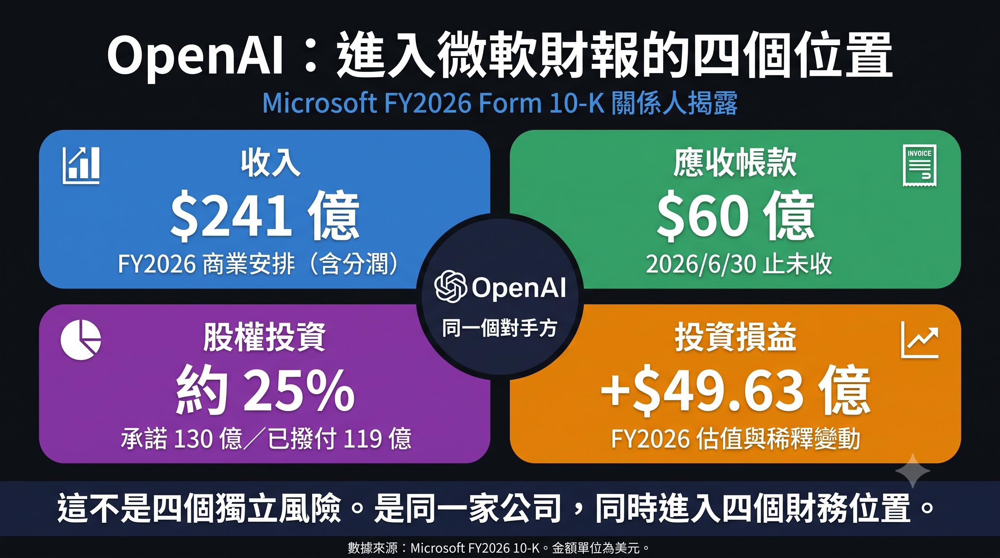
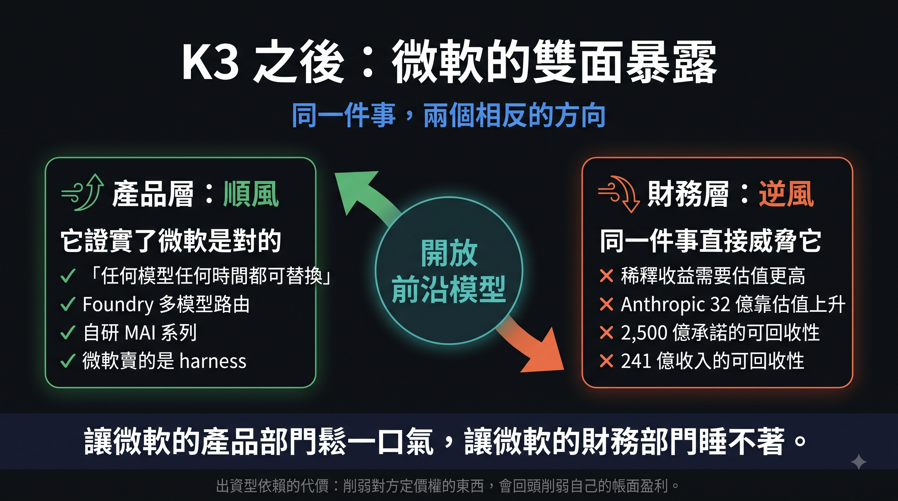

# Microsoft Couldn't Buy Ring 0, So It Bought OpenAI
## Capital-Funded Dependency and a Moat That Must Be Renewed Every Year

> Extended essay from [*The AI Wars*](https://mythogenengine.com/docs/ai-war/guide) · Sequel to [Chapter Six of *The Formless Way*](https://mythogenengine.com/docs/AI_TAO/ch06)

---

> **Three claims in this essay**
>
> One: In the AI world, Microsoft cannot build Ring 0. So it manufactures dependency through capital — a new form of lock-in that is technically replaceable but financially uninterruptible.
>
> Two: When a single counterparty simultaneously occupies revenue, accounts receivable, equity investment, and investment gains on the same set of financial statements, what changes is not the risk coefficient. It is the nature of the company.
>
> Three: This is not unique to Microsoft. The entire industry is using the same kind of moat — one that must be renewed — and the renewal date is the same day for everyone. Every step forward by open-weight models pulls that day a little closer.

---

## I. Six Weeks, Two Prices

On July 6, 2026, Microsoft closed at $386.74. Having recorded a 34.91% maximum drawdown on June 25, it was the worst performer among the "Magnificent Seven." The market's verdict was clear: capital expenditure out of control, AI monetization too slow, the Copilot subscription story not nearly strong enough to support this multiple.

Three weeks later, one quarterly earnings report, three trading days, and the stock rose approximately 25%, adding roughly $750 billion in market capitalization. The full-year decline, erased in one stroke.

What does $750 billion look like? TSMC's entire capital expenditure budget for calendar year 2026 is $60–64 billion. Microsoft's three-day market-cap gain was roughly equivalent to twelve years of TSMC building fabs and buying equipment.

Same business. Same assets. Same management. No new products, no new markets, no technical breakthrough in between. Only one thing changed: how much the market was willing to pay for the same story.

Most commentary stops here and pivots to debating whether the number is expensive or fair.

But the real question is not about the price. It is: **why can the price of this business swing by 30% in six weeks?**

The answer is not in any valuation model. It is in the structure.

And this structure ultimately extends far beyond Microsoft.

---

## II. Ring 0 Is a Product of Time, Not Strategy

Chapter Six of *The Formless Way* made one point: The real moat of Windows was never that it was good.

It was that an enormous quantity of things in the world could not leave it.

Win32 applications, hardware drivers, enterprise line-of-business systems, EDR security tools, industrial control software, CAD, games. None of these were written by Microsoft. They were written over forty years, line by line, by hundreds of thousands of companies and millions of engineers, into a specific set of system-call conventions.

Every line was a cost paid by someone else. Every line eventually became a Microsoft asset.

The conclusion of that chapter was: Ring 3 can be translated; Ring 0 cannot.

I now want to push that sentence further —

**Ring 0 cannot be built. It can only be waited for.**


It is not something a strategy department decides in a meeting. It is a sediment of time. You cannot announce in 2026 that "we are going to build a Ring 0," any more than you can announce "we are going to have forty years of history."

This is Microsoft's real predicament today. And the market is not discussing it at all.

---

## III. The Structural Fact of the AI World: Every Layer Is Replaceable

Lay out the AI stack:

```
Model
  ↓
Agent / Harness
  ↓
Tool / MCP
  ↓
API
  ↓
Data
  ↓
Cloud
```

Every layer is replaceable. The model can be swapped, the framework can be swapped, the cloud can be swapped — you can even push the entire thing down to local inference.

There is no Win32 here. No forty years of compatibility baggage. No foundation where "replacing it breaks ten thousand things."

And the most powerful evidence comes from Microsoft itself.

During the FY2026 Q4 earnings call, UBS analyst Karl Keirstead asked directly about the open-source versus closed-source debate. Nadella's answer came in two sentences:

> "The goal is to let every company own its own destiny."
>
> "We are very, very deliberate about the architecture of the platform — you have to separate the harness from the model… that means any model at any point in time is swappable."

His intent was clear: persuade enterprises not to hand the agent layer to model vendors, not to be locked into a single model. And Microsoft happens to sell both — the entire Copilot product line is the harness; the MAI series is the model.

In the press, this was written up as "Microsoft's multi-model strategy" — characterized as flexible, open, not betting on a single vendor.

But if you read it through the framework of Chapter Six, it is a confession.

**It concedes that in this new world, Microsoft holds no layer that is irreplaceable.**

In the Windows era, Microsoft never needed to say anything like this.

No one in 1998 would have said "Win32 is swappable at any point in time." Because that was false, and the entire world knew it was false.


---

## IV. That Chip: Microsoft's Last Decree

To see clearly what Microsoft has lost today, the best method is not to look at what it is doing now — but at what it did last time.

On June 24, 2021, Microsoft published the system requirements for Windows 11. One line read: the motherboard must have TPM 2.0.

A discrete hardware security chip, normally retailing for about twenty dollars.

Then the entire world complied.

Intel complied. AMD complied. Every OEM complied. Every enterprise IT department pulled forward its hardware refresh budget.

On the consumer side, the effect was even more immediate: within twelve hours of the announcement, a TPM 2.0 expansion module on eBay jumped from $24.90 to $99.90; major models on Newegg and Amazon sold out entirely; some sellers listed theirs at $175. A board not much bigger than a thumb, which the previous year had been selling for $8.99.

Microsoft was aware of the cost: millions of perfectly functional machines became "unsupported" overnight — e-waste controversy, user backlash, Windows 11's early market share struggling to climb.

**It could afford it anyway. Because it had the power to compel.**

The technical significance of this runs deeper than most people realize. TPM is not an anti-piracy tool — Microsoft's own documentation positions it as a security foundation component, used for BitLocker key protection, Windows Hello, Credential Guard, and device attestation.

What it actually did was: **move the root of trust from the operating system down into silicon.**

Below Ring 0, there is another layer. Microsoft went and claimed it.

And it could claim it because, in the PC world, when Microsoft said one word, the supply chain turned.

That was not product strength. That was **protocol power**.

---

### Five Years Later, the Same Thing Looked Like This

In July 2026, Microsoft announced a mechanism called "KMS Hardware-Secured": enterprise KMS activation hosts would need to pass TPM attestation before issuing licenses.

The internet instantly spun this into "Microsoft is going to use TPM to kill all Windows piracy once and for all."

It was corrected within three days.

The reality: this only affects the single KMS host sitting in an enterprise server room. Windows Server 2025 will begin showing readiness prompts starting August 2026; enforcement awaits the next Server LTSC release, date undetermined; rules for virtual hosts have not even been published. The most commonly used cracks — HWID and TSforge — do not go through KMS hosts at all; Online KMS works by spinning up a fake server that answers "yes," never touching a single TPM check. Retail keys, digital entitlements — all unchanged.

In other words: **not a single existing crack method was affected.**

Place these two events side by side, and the contrast is almost cruel.

Same chip. In 2021, Microsoft used it to rewrite the specifications of the global PC supply chain within twelve hours. In 2026, Microsoft used it to harden a single server in the corner of a data center, got misreported as a nuclear weapon, then spent three days clarifying that it was not, in fact, that powerful.

**This is how protocol power disappears. It is not defeated. It slowly runs out of entities it can command.**

---

## V. The Core Thesis: When Dependency Cannot Be Earned, Fund It

If dependency cannot be accumulated through time, and can no longer be imposed through a single specification — yet the business must be built on dependency —

What is left?

**Capital.**

This is what I believe to be the structural core of the entire situation today.

The traditional definition of a moat: **the customer cannot leave you, because the switching cost is too high.**

What Microsoft is building now is something else: **the customer cannot leave you, because you are one of its sources of funding.**

Look at this structure closely:

- Microsoft holds approximately 27% of OpenAI (disclosed on a fully converted basis as approximately 25% in its annual report), with cumulative investment commitments of $13 billion
- OpenAI has committed to purchasing $250 billion in Azure services
- OpenAI's revenue is shared with Microsoft on a proportional basis through 2030, subject to an aggregate cap
- In November 2025, Microsoft invested up to $5 billion in Anthropic; Anthropic committed to purchasing $30 billion in Azure services; in the same transaction, NVIDIA invested up to $10 billion in Anthropic
- Meanwhile, at the application layer, Microsoft competes head-to-head with both companies

Within the same set of relationships, Microsoft is simultaneously: **shareholder, landlord, revenue-sharing partner, and competitor.**

Four roles. One counterparty.

I call this structure — **capital-funded dependency.**

Its defining characteristic: **technically fully replaceable, financially uninterruptible.**

OpenAI could announce tomorrow that it is moving its primary workloads to AWS. Technically feasible — and contractually already permitted, since the right of first refusal was removed in the 2025 restructuring.

But it cannot announce that it no longer needs that $13 billion. Cannot announce that it will not honor the $250 billion purchase commitment. Nor can it announce that its valuation no longer requires a mega-cap holding a quarter of its equity to vouch for it on financial statements.

**This is a new kind of lock-in. It does not lock technology. It locks cash flow.**

The TPM path drilled downward, into silicon. This path grows sideways, into the counterparty's balance sheet.



---

## VI. Structural Consequence: One Counterparty Occupying Four Lines of the Financial Statements

Capital-funded dependency produces a very particular financial shape.

In Microsoft's FY2026 disclosures, OpenAI — a single counterparty — appears simultaneously in four places:

| Financial Statement Line | Content |
|---|---|
| Revenue | $24.1 billion in FY2026 from commercial arrangements with OpenAI (including revenue sharing) |
| Accounts Receivable | $6 billion outstanding as of June 30, 2026 |
| Equity Investment | ~25% on a fully converted basis; $13 billion committed, $11.9 billion deployed |
| Other Income, Net | Dilution gains and valuation changes from equity stake |

The first three are figures written for the first time in Microsoft's 10-K under ASC 850 related-party disclosure requirements. The fourth is scattered across quarterly filings.

$24.1 billion represents approximately 7.3% of Microsoft's FY2026 total revenue of $331.8 billion. As for its share of the AI segment specifically, Microsoft has not disclosed that — Bloomberg estimates, based on Microsoft's self-reported annualized AI revenue of $37–40 billion, that OpenAI accounts for more than half, possibly close to 70%. **That 70% is an estimate, not a disclosure. This distinction matters in writing.**

The standard market reaction to these numbers is three words: **concentration risk.**

Meaning "if OpenAI runs into trouble, Microsoft will have a problem." This is risk-management language — treating it as a probability, a tail event, a discount factor to add to a model.

I believe this reading is wrong.

Because it assumes Microsoft is still a software company that happens to have one particularly large customer.

But when more than half of a company's AI revenue — likely close to 70% — comes from a counterparty that **it funds, holds equity in, vouches for by valuation, and simultaneously collects rent from** —

What changes is not the risk coefficient.

**What changes is the nature of the company.**

It is no longer a company that sells software to a market. It is an **asset operator simultaneously serving as landlord, shareholder, and house.** Yet the market is still pricing it using the logic of a software company.

This sentence is the center of gravity of the entire essay. Every number below exists only to prove it.


---

## VII. The Evidence Layer: The Source of Earnings Is Shifting from Operations to Valuation

Let me be clear first: every mechanism described below is fully compliant, fully disclosed, and none constitutes fraud.

The issue is not legality. It is nature.

### Dilution Gains: Diluted, Yet Booking a Profit

In October 2025, OpenAI completed its capital restructuring, converting to a public benefit corporation (PBC). Microsoft's stake decreased from 32.5% to approximately 27%.

But because the increase in valuation far exceeded the decrease in ownership percentage, accounting produced a **dilution gain**, booked under "Other Income, Net."

Diluted — yet posting a gain.

Microsoft applies the equity method, using the hypothetical liquidation at book value (HLBV) approach. After the restructuring, book-level gains and losses no longer reflect OpenAI's operating results; they reflect **changes in Microsoft's share of net assets** — each funding round, each valuation adjustment flows directly into Microsoft's income statement.

This produced the following figures for FY2026:

| Quarter | OpenAI Investment Gain/(Loss) |
|---|---:|
| Q1 | −$3.1 billion |
| Q2 | +$7.6 billion |
| Q3 | −$14 million |
| Q4 | +$480 million |
| **Full Year** | **+$4.963 billion (EPS +$0.67)** |

Compare with FY2025: full-year −$3.62 billion, EPS −$0.49.

Within one year, the same investment went from dragging down earnings by $0.49 per share to contributing $0.67 per share.

In between, OpenAI did not become profitable.

**In one sentence: OpenAI's losses no longer cause Microsoft losses; OpenAI raising capital actually causes Microsoft gains.**

The fuel for this engine is not product. It is the price the private market is willing to pay.

### The Second Engine: Anthropic

In FY2026 Q4, Microsoft booked $3.2 billion in investment gains from Anthropic, approximately $0.33 in diluted EPS — nearly 7% of the quarter's $4.81 EPS.

In other words, a significant portion of the quarter that the market celebrated as "beating across the board" did not come from selling software.

It came from one of its portfolio companies going up in valuation.

### Two Subtle Moves at the Presentation Layer

**First, off-balance-sheet treatment of capital expenditure.** The CY2026 capex guidance was revised downward from $190 billion to approximately $175 billion — not because less was being purchased, but because the estimated useful lives of certain buildings were extended, and a material portion of future lease obligations was reclassified from finance leases to operating leases. The latter simultaneously affects the interpretation of both capex and free cash flow.

The number got smaller. Not a single rack was removed.

**Second, dual-track narrative.** Microsoft has designed its own set of non-GAAP metrics that exclude the OpenAI impact. In loss-making quarters, point to non-GAAP. In profitable quarters, let the GAAP EPS — up 32% year-over-year — make the headlines.

Both narratives work. And both are true.

Taken together, they point to a single conclusion: **the marginal source of Microsoft's earnings is shifting from operations to valuation.**

And valuation is not something Microsoft can produce.

---

## VIII. The Time Lag: Revenue Front-Loaded, Costs Back-Loaded

First look at how a set of numbers was presented, then at how it was revised.

**April.** Microsoft issued CY2026 capex guidance: $190 billion. The market had expected only about $155 billion.

But in the same earnings call, CFO Amy Hood said something more worth remembering: of that $190 billion, approximately **$25 billion was component price increases** — not additional compute, just the same things costing more.

Capital expenditure for the same quarter was $31.9 billion, of which roughly two-thirds went toward GPUs and CPUs — **short-lived assets**.

**July.** The same guidance was revised to approximately $175 billion. A $15 billion reduction — not from buying less, but from extending the estimated useful lives of certain buildings and reclassifying a material portion of future lease obligations from finance to operating leases. The latter simultaneously affects the interpretation of both capex and free cash flow.

Put the three facts together:

**A large number, part of which is not compute at all; then that number was further reduced by accounting treatment.**

And the actual equipment purchased underneath — that is the shortest-lived kind.

Here is a fact everyone knows but rarely places into a single sentence:

**What is booked today is revenue and valuation gains. The GPUs purchased today will not fully hit the income statement for years to come.**

The peak of depreciation has not yet taken the stage. Extending useful lives only pushes that peak backward; it does not cancel it.

The entire structure of capital-funded dependency rests on this time lag.

It is not fraud. It is a bet — that real utilization will catch up before costs fully arrive.

---

## IX. The Control Group: CUDA's Stickiness Grows Bottom-Up

Chapter Six placed Microsoft and NVIDIA side by side, noting that both companies "used years of costs paid by others to position themselves in the middle."

But their directions are opposite.

**NVIDIA:** Hardware → CUDA → developers → AI. Stickiness grew bottom-up over nearly twenty years. Historically sedimented.

**Microsoft:** M365 → Copilot → Agent → Azure, plus a lateral capital line tying in model companies. Stickiness was laid top-down in three years. Capital-constructed.

The most critical difference is not depth.

**It is that historically sedimented moats do not require renewal. Capital-constructed ones do.**

Win32 did not require Microsoft to spend money maintaining it every year. It was just there, because it had already been there.

But a $250 billion purchase commitment requires the counterparty to have the capacity to perform. Book gains require the next funding round's valuation to keep rising. Capital-based lock-in requires capital to keep flowing.

**This is not a moat. This is a lease that must be re-signed every year.**

---

## X. Where I Might Be Wrong: A Root of Trust on the GPU

At this point, I must identify the weakest link in my own argument. Otherwise it is merely a position, not an analysis.

I said the AI world has no Ring 0, because every layer is replaceable.

But there is one place where one might grow.

**Confidential computing, and GPU-level attested inference.**

The logic goes like this: enterprises will ultimately refuse to hand their most sensitive data to an execution environment that cannot prove its own state. They will demand — which chip this inference ran on, whether the model running is the one they specified, whether it was tampered with, whether memory was read by a third party — all verifiable through a chain of trust whose anchor must reside in hardware.

If this requirement becomes a hard condition for enterprise procurement, the AI world will suddenly develop a layer that "cannot be emulated in software."

And "cannot be emulated in software" is precisely the entire reason TPM existed in the first place.

See the symmetry?

**The last time Microsoft successfully established a root of trust was in the PC. Its next attempt to establish a root of trust will be on the GPU.**

If it achieves an unbypassed position on this line — if the attestation chain for enterprise AI must ultimately pass through Azure's confidential computing environment and Entra's identity layer — then it is not buying dependency with capital.

It will have genuinely rebuilt a Ring 0.

At that point, this essay's conclusion must be revised.

My current judgment: this path exists, but what it faces is not forty years of legacy baggage — it is three clouds, two chip vendors, and a pile of open standards still being drafted. The same attestation chain is being built by AWS and Google too, and by NVIDIA itself. **Something that can be provided by three parties simultaneously is unlikely to become anyone's Ring 0.**

But this is the paragraph I most want to be proven wrong about. Anyone looking to refute this essay should come in through here, not through the stock price.

---

## XI. Microsoft Is Not an Exception; It Is a Sample

Up to this point, this essay appears to be about one company.

It is not.

Capital-funded dependency is not Microsoft's invention, nor its patent. It is the **default structure** of the 2025–2026 wave of AI infrastructure buildout.

Lay out the named commitments from OpenAI alone (figures vary across sources; what follows is the commonly cited version):

| Counterparty | Named Commitment |
|---|---:|
| Broadcom | $350 billion |
| Oracle | $300 billion |
| Microsoft | $250 billion |
| NVIDIA | Up to $100 billion |
| AMD | $90 billion |
| CoreWeave | $22 billion |

Seven vendors, 2025–2035, totaling roughly $1.15 trillion. Multiple third-party estimates in 2026 place the entire industry's "circular financing" at over $800 billion.

These are not ordinary procurement contracts. Their common shape: **the seller of compute funds the buyer of compute to buy the seller's compute.**

- NVIDIA invests in OpenAI, Anthropic, Mistral, and new cloud operators like CoreWeave; those companies turn around and buy NVIDIA's chips; NVIDIA itself also leases compute from the new cloud operators
- Amazon has committed over $83 billion to OpenAI and Anthropic combined; both have committed to buying back AWS compute on an even larger scale
- Microsoft invested up to $5 billion in Anthropic; Anthropic committed to $30 billion in Azure; in the same deal, NVIDIA invested up to $10 billion
- In July 2026, multiple outlets reported that NVIDIA was evaluating a ~$250 billion guarantee for OpenAI's Ohio data center, plus $350 billion in chip financing (as of August 2026, this deal remained unfinalized). On the day the news broke, NVIDIA's own stock fell 4.5% — the market understood exactly what it meant

Imagine a round table. Everyone is picking up the tab for the person next to them, then recording the same money as their own revenue.

Microsoft is simply the one at this table whose bill is most visible. It must report to the SEC every quarter, so you can see it. The others are not required to break it out quarterly — but that does not mean the structure is different.

**That is the real scope of this essay.**

Three things, then, are worth examining closely.

### ① The Nature of the Entry Fee Has Changed

When compute is allocated through equity transactions rather than procurement, what determines who can compete is no longer "can you afford to buy it" but "are you worth investing in."

The model layer has converged to three or four players not because technical moats have been built, but because **only three or four are inside the circle.**

The middle tier did not die because it was inferior. It died because it stood outside the circle.

### ② Risk Has Moved from Venture Capital into the Index

I consider this the most significant development, and the least discussed.

In 2000, the risk of the bubble sat in dot-com stocks — you had to actively buy them to hold them.

In 2026, the valuation swings of a batch of **private companies** are written directly into the income statements of the world's largest public companies.

No one chose to hold exposure to OpenAI's valuation volatility. But every retirement account that holds an index fund already does.

### ③ What Is Diversified Is the Roster, Not the Risk

Microsoft, Amazon, Google, and NVIDIA can each claim that their investment portfolios are diversified.

But lay them out: it is the same set of counterparties appearing on multiple balance sheets.

This will not unravel one company at a time. It will unravel simultaneously.


---

## XII. But: Structural Collapse Does Not Equal Technological Failure

If this essay stopped at the preceding section, it would become just another "AI bubble" piece. In that case, I would rather not have written it.

So the other side must be stated clearly.

**The demand is real.** NVIDIA's FY2027 Q1 revenue was $81.6 billion, up 85% year-over-year. TSMC raised its 2026 capex from $52–56 billion to $60–64 billion, citing structural demand including agentic AI. The vast majority of application-layer companies are normal SaaS businesses with real paying customers, entirely unrelated to circular financing.

**And vendor financing has built real things before.**

The 1990s telecom industry ran the same playbook: equipment vendors lent to carriers to lay fiber; when demand fell short of projections, the highly leveraged carriers slashed spending, some went bankrupt, capacity sat idle for years, the industry restructured.

But the real conclusion of that history was not "the bubble burst."

It was — **all that fiber was eventually used. Only the shareholders changed.**

Railroads too. Canals too.

**Structural collapse does not equal technological failure. This distinction is a hundred times more important than being bullish or bearish.**

And it simultaneously clarifies: the correct question for judging this situation has never been "does AI work" — it is "**who ultimately bears the cost of this cycle.**"

---

## XIII. The One Hand Outside the Circle: Open Weights

If the entire structure requires valuation to keep rising in order to function, then the variable most worth watching is **whatever stands outside the circle.**

Currently there is only one: the open-weight ecosystem.

It does not need funding rounds to set its price, does not need purchase commitments for endorsement, and does not need anyone's balance sheet to guarantee it.

Its existence means — **the pricing of the entire structure can be rewritten at any moment by a single efficiency number.**

January 2025 already demonstrated this once.

On January 20, DeepSeek released R1, claiming a training cost of approximately $5.6 million. The market immediately recalculated "how much compute is needed to reach the same level." On January 27, NVIDIA fell approximately 17% in a single day, closing at $118.58, losing $589 billion in market cap — the largest single-day market-cap loss for any company in U.S. stock market history, breaking NVIDIA's own previous record of $279 billion set in September 2024. On the same day, Broadcom fell 17%; TSMC fell 13%.

Not a single financial report was problematic that day. All that changed was an assumption about cost.

### In July 2026, It Demonstrated a Second Time

On July 16, Chinese startup Moonshot AI (月之暗面) presented Kimi K3 at the World Artificial Intelligence Conference in Shanghai. Eleven days later, the full weights of the 2.8-trillion-parameter model went up on HuggingFace — ninety-six weight shards, technical report, license terms, all at once. The same week, DeepSeek also released V4 stable.

In terms of specifications, K3 is a mixture-of-experts architecture, activating only a small fraction of total parameters per token, with a context window of one million tokens. Independent benchmarks placed it just behind the top closed-source models: overall still trailing Claude Fable 5 and GPT-5.6, but beating the previous generation's flagship closed-source models on coding and agentic tasks.

The market reaction was the same shape as eighteen months prior: within two weeks of the announcement, the Philadelphia Semiconductor Index fell by roughly 20%, entering a technical bear market relative to its high.

**Twice in eighteen months. This is no longer an anomaly. It is a mechanism.**

And this time, K3 is closer to the thesis of this essay than DeepSeek was.

DeepSeek challenged an assumption about **cost** — how much it takes to train a frontier model. That was a claim about the past, open to dispute, open to questions like "they distilled from someone else's model."

K3 challenged something harder: **the model can be moved.**

The weights are sitting on HuggingFace. Any enterprise with sufficient hardware can download, inspect, fine-tune, and self-deploy. This cannot be argued away, because the files are right there.

And so the enterprise's line to the closed-source vendor shifts from —

"We have no other choice."

to —

"If you raise the price, we will take something of comparable quality and run it somewhere else."

**What changed is not the price. It is the bargaining power.**

### But "Open Source" Can Be Misleading

The full picture must be stated, or this section becomes open-source cheerleading.

**Weights are free, but you need somewhere to put them.** At 4-bit precision, K3's weights alone require approximately 1.4 TB of high-bandwidth memory; Moonshot itself recommends at least sixty-four accelerators as a starting point. Open weights reduce vendor dependency, not infrastructure cost. Those who can truly self-host remain limited to large enterprises and cloud operators — and the cloud operators happen to be the same companies discussed throughout this essay.

**And adoption friction is real.** Independent testing has flagged K3's hallucination rates with rather unflattering numbers; in April of this year, Kimi experienced a cross-user data isolation breach; and the obligations under Article 7 of China's National Intelligence Law do not disappear based on which server the inference runs on. These are not political rhetoric — they are things that corporate compliance departments will actually block.

So in the short term, open frontier models will not replace closed ones.

But this does not affect the conclusion — because **compressing pricing power does not require replacing anyone.** It only requires making "there is another option" true.

The open-source path is therefore not merely a competitive tool. Structurally, it stands in opposition to a system that **can only sustain itself through endlessly rising valuations.**

Something that does not need to be invested in is the one thing this system cannot co-opt.

---

## XIV. After K3: Microsoft's Double Exposure

At this point, the protagonist of this essay must be placed back into the new variable just introduced and tested again.

Because the impact of open frontier models on Microsoft cuts in two opposite directions.

### Product Layer: It Proves Microsoft Was Right

Return to the confession from Section III.

Nadella said "any model at any point in time is swappable," urging enterprises to separate harness from model, not to be locked into a single model vendor. At the time it sounded like a harness salesman pitching his harness.

Three weeks later, a model with near-top-tier capabilities and fully open weights appeared.

**He was right. And he had already bet the company on that sentence.**

Over ten thousand models on Foundry, the in-house MAI series, multi-model routing — this positioning, in a world of model commoditization, is a tailwind. The week K3's weights were released, a policy letter supporting open weights included Microsoft among its signatories.

Microsoft knows exactly which side it is on.

### Financial Layer: The Same Event Directly Threatens It

But the two engines from Section VII need the opposite thing.

Dilution gains require OpenAI's next-round valuation to be higher. The $3.2 billion Anthropic gain requires Anthropic's valuation to keep rising. And what open frontier models compress is precisely the pricing power of closed-source models — once pricing power loosens, valuations become harder to stack upward.

More directly, the $250 billion purchase commitment and the $24.1 billion in revenue: their recoverability depends on OpenAI's ability to keep raising capital at higher valuations.

**The same event lets Microsoft's product division breathe easier and keeps its finance division up at night.**



This is the most awkward feature of capital-funded dependency. When your moat is "I am funding you," then **anything that weakens your counterparty's pricing power loops back to weaken your own book earnings** — even when your product strategy is completely sound.

Historically sedimented moats do not have this problem. Win32 never needed to care about anyone's valuation.

### And This Makes the Path from Section X More Critical

If the model layer truly commoditizes, then the only place Microsoft can rebuild irreplaceability narrows further — to confidential computing and attested inference.

Models are free, weights are public, inference can run anywhere — then what is left that "cannot be emulated in software"?

Only one thing: **proving where it ran.**

I said in Section X that this path is difficult, because all three clouds are pursuing it. I now add: **it is also the only path left.**

---

## XV. Five Lifelines

If the structural assessment above holds, then what to watch is not "when does it collapse" but "when does this structure lose its ability to renew."

**Three at the company level:**

### ① Renewal Capacity

The next funding-round valuation for OpenAI and Anthropic. If flat or down, the book-gains engine zeroes out immediately — FY2026 Q3, which booked only $14 million, already demonstrated this once.

Also watch OpenAI's IPO process: as of August 2026, confidential filing was completed in June, but the preference is to delay to 2027; management insists on not accepting a valuation below $1 trillion.

**The delay itself is the signal: the private market has reached a level it can no longer push higher.**

### ② Nature Test

The share of "Other Income, Net" in each quarter's EPS growth. If this ratio trends upward, the marginal source of earnings is increasingly dependent on valuation rather than operations.

The most direct indicator of the company's nature — and it can be checked every quarter.

### ③ Costs Taking the Stage

Depreciation as a share of revenue, Microsoft Cloud gross margin, and the gap between free cash flow growth and Azure growth. When all three turn simultaneously, the time lag has been used up.

**Two at the industry level:**

### ④ The First Down Round

Not a crash — just any major model company completing a funding round at a flat or lower valuation. From that moment, every equity holder's book-gains engine stops working simultaneously.

K3 has added a path that was not previously on this line: **valuation pressure need not come from the funding market cooling — it can come directly from the technology side.** Each step forward by open frontier models narrows the pricing power of closed-source models by a fraction, and pricing power is the foundation of valuation. What to watch, therefore, is not just the next funding round, but the capability gap between open weights and closed — the speed at which that gap narrows is the speed at which this lifeline advances.

### ⑤ The Debt End

Watch the lenders, not the contract signers. The debt levels and credit spreads of infrastructure providers will signal earlier than any contract announcement.

---

## XVI. Conclusion: Not Game Over — Renewal

I do not believe Microsoft's business is going to fail. Azure annual revenue crossing $100 billion, M365, security, developer tools — these represent real revenue and real customers.

Nor do I intend to join the chorus of "the bubble is about to pop." That stance has been wrong twice in the first half of 2026, and it has one fatal flaw: **it has no falsification condition.** You can always say "not yet."

What I want to leave behind is a different judgment.

What Microsoft faces in the AI era is not a "can it make money" problem. It is already making money.

What it faces is a **downgrade in the type of its moat**:

From "others cannot leave me, because history locked them here" —

To "others cannot leave me, because I can dictate what chip they must install" —

To "others cannot leave me, because I am still writing the checks."

Thirty years. Three phases. Each phase's lock-in is weaker than the last.

And this time, it is not one company's situation. **The entire industry is using the same kind of moat that must be renewed, and the renewal date is the same day for everyone.**

As for when that day arrives — those two weeks in July already offered a hint. When a near-top-tier model can be downloaded by anyone, the renewal rate is no longer set solely by the one writing the checks.

Chapter Six contained a line: Win32 does not need to disappear; it only needs to go from owner to tenant.

Today it is Microsoft's turn.

It has not lost Windows. Has not lost Azure. Has not lost anything.

**It simply needs, every year, to buy back its own irreplaceability one more time.**

And the renewal rate is not set in Redmond.

It is set in the private market.


---

## Sources and Notes

**Microsoft Financial Data**: FY2026 Q4 earnings press release and 8-K (July 29, 2026), FY2026 10-K, 10-Q through March 31, 2026, and earnings call transcripts.

**TPM and KMS Hardware-Secured**: Microsoft support documentation, Windows IT Pro Blog announcements, and June 2021 reporting by Tom's Hardware, Windows Central, and PCWorld on TPM module pricing and shortages.

**Industry Data**: OpenAI's external commitment figures and "circular financing" totals are compilations and estimates by third-party media and research institutions; different sources use different accounting bases; these are not official disclosures; this essay uses commonly cited versions and notes this in the text. NVIDIA's guarantee and chip financing for OpenAI's Ohio project remained, as of completion of this essay, at the "reports indicate evaluation in progress" stage and had not been finalized.

**Capital Expenditure**: The $190 billion CY2026 guidance, the ~$25 billion attributable to component price increases, and the ~two-thirds of the $31.9 billion quarterly capex directed toward short-lived assets are sourced from Microsoft's FY26 Q3 earnings call in late April 2026 and contemporaneous reporting by multiple technology and financial media outlets; the revision to ~$175 billion and related accounting treatments are from the Q4 earnings report and annual report in late July.

**Open Weights**: Kimi K3's announcement date, weight release date, architecture specifications, and benchmark positioning are sourced from Moonshot's official release, the HuggingFace page, and multiple independent technical evaluations; per-token active parameter counts vary across sources, so this essay provides only qualitative descriptions. The Philadelphia Semiconductor Index's two-week decline is sourced from financial media reporting. Allegations regarding distillation and chip export controls are allegations; the named parties have not admitted to them; this essay neither adopts nor reproduces the details.

**On Originality**: The dilution gain mechanism, circular transaction structures, depreciation and lease accounting treatments, and systemic risks of circular financing have been extensively discussed in both English-language and Chinese-language financial commentary; the telecom fiber analogy has also been used by multiple media outlets. This essay does not claim credit for discovering these mechanisms.

The parts this essay considers original are: the erosion of protocol power (Section IV), the naming and definition of "capital-funded dependency" (Section V), the argument that four financial-statement positions represent a change in nature rather than an increase in risk (Section VI), the self-refutation via GPU root of trust (Section X), and open weights as a structural hedge (Section XIII).

Refutations are welcome. Start from Section X.
