# How the Machine Helps Execute a Deletion That Has Already Happened

> This article is written in formal written Chinese, interspersed with necessary Hong Kong Cantonese in its original form with annotations — this arrangement itself is part of the article's argument: some things, once "translated" into standard written language, are already dead.

**0002　02433342　00024　24333320**

If you see this line of numbers and a melody's opening bars automatically play in your head — then you are precisely the corpus this article describes: the one not yet deleted. If all you see is gibberish, read on — this article will explain why the machine sees the same thing you do.

A still from a 1990s Hong Kong film circulates online. Two lines of subtitles at the bottom: the upper reads "呢鑊你仲唔冚家鏟？！" (roughly: "This time aren't you going to damn your whole family?!"), the lower is the English translation: "Your whole family die this time!"

The English isn't wrong. The propositional content — cursing the other person's entire family to death — is translated faithfully. But any Cantonese speaker can see the sentence has died. The texture of "呢鑊" (this time, this mess — a colloquial measure word carrying the heat and immediacy of the wok) has vanished; the rhythm of "冚家鏟" — the most venomous curse, yet flowing off the tongue as smoothly as a New Year's greeting — is also gone. The translation preserved the information layer and killed the encoding layer.

What this article is about: there is now a machine performing the same operation on the entirety of old Hong Kong Cantonese — at industrial scale, at zero marginal cost. And what it is doing is not translating. It is executing — executing a deletion that had already occurred before it existed.

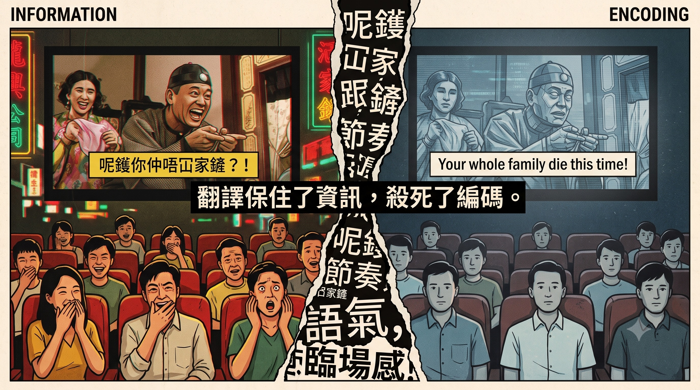

## I. Three Layers of Encoding: How Dense This Language Really Is

To understand what has been deleted, you first need to understand how many layers of encoding old Hong Kong Cantonese carries.

**The first layer is vocabulary.** Colonial-era Hong Kong Cantonese was dominated by Chinese-English hybridity: Printer was Printer, not 打印機 (the Mainland standard); Mouse was Mouse; Sofa was phonetically adapted as 梳化 (so-faa), not 沙發 (saa-faat). This layer is the most surface-level and the first to be replaced by standardisation — 質素 (quality) became 質量, 影片 (video clip) became 視頻. Vocabulary-layer cleansing is visible to everyone, but it is actually the shallowest layer.

**The second layer is semantic compression.** Cantonese has a folk craft of "euphemistic compression": folding an unspeakable sentence into a few ostensibly harmless characters. The classic example is 杏加橙 (apricot-plus-orange) — 杏 (hang), 加 (gaa), 橙 (caang), three sounds mapping one-to-one to 冚家鏟 (ham-gaa-caan, damn your whole family), so sending someone a fruit basket is, on the surface, polite; in the middle layer, profanity; in the deep layer, a provocation — three layers of meaning stacked on three characters, relying on the listener to decode before it detonates. The same family includes 荷蘭朋友 ("Holland friend" — sounds like a foreign acquaintance, but phonetically spells out something else entirely), 頂你個肺 ("top your lung"), and ironic inversions like 冚家富貴 ("whole family prosperous" — surface blessing, actual curse). This layer's design purpose is precisely to evade literal indexing: a system that recognises only characters and not sounds will never crack the lock.

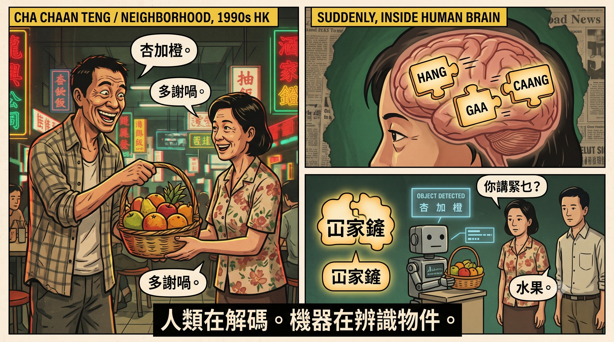

Within this same layer hides a precision system even more underestimated: profanity. Wong Jim's *The Indecent Collection* (不文集) demonstrated long ago that these vulgar expressions are not emotional noise but precise status words. Take several cognate single characters derived from the same reproductive organs: each carries a completely distinct character profile, absolutely non-interchangeable — 朘 (jer) carries no lethality, a baby-level tease; 柒 conveys childishness, making a fool of oneself, pretending to know what you don't (hence 懵柒 — muddled fool); 鳩 conveys stubbornness, pig-headedness, acting without thinking and being beyond help (戇鳩 and 懵柒 are absolutely not synonymous — the former is impulsive, the latter simply dim); 撚 carries overtones of manipulation, craftiness, arrogance (撚化 — couldn't care less; 扮撚晒嘢 — acting as if you're all that), and its shared character with 撚手小菜 (a specialty dish — literally "finger-rolled dish") is no coincidence — both meanings share the semantic root of "manipulating with fingertips." A vocabulary system officially classified as obscene internally operates at higher semantic resolution than standard written Chinese. And this series goes far beyond these: 鳩, 柒, 𨶙 (colloquially written 撚), 屌, 朘, 閪 — all pointing directly at the same set of organs, yet none semantically or contextually interchangeable — some are status words, some are verbs, some are measures of a person. This is the real reason this profanity system is untranslatable: not that there's no corresponding word, but that the corresponding object isn't a word at all. Each character is a compressed archive; unzipped, it becomes an entire descriptive sentence; English needs a full paragraph to articulate the line between 戇鳩 and 懵柒. Untranslatability is not a deficiency — it is proof of an extreme compression ratio. Today's younger generation, downgrading these characters to all-purpose filler particles without understanding what state each represents, isn't a sign of language becoming cruder — it's a sign that the resolution has been lost in transmission.

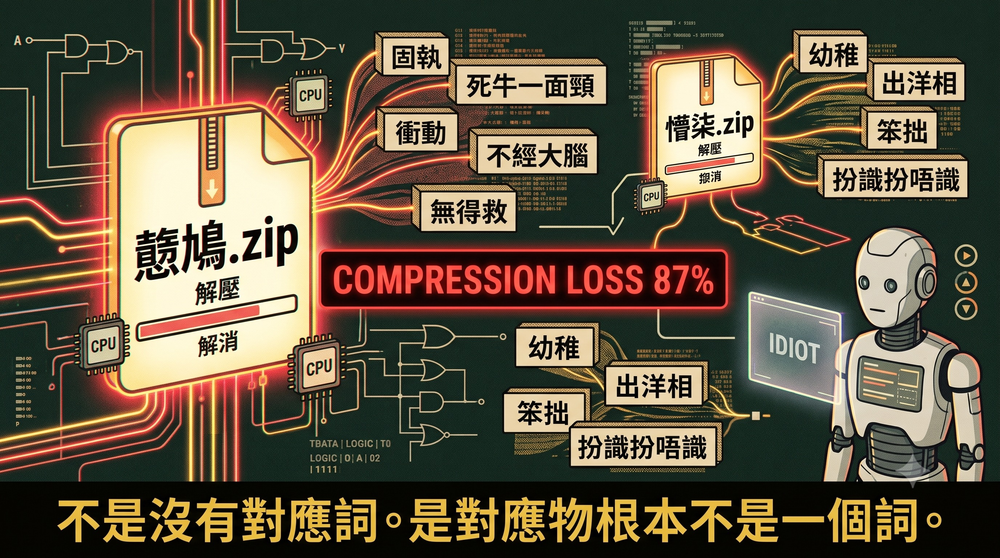

**The third layer is tonal topology, the deepest layer.** Among lyricists, there circulates a tonal notation system, recently popularised by the film *The Lyricist Wannabe* (填詞L): a simplified four-tier pitch system led by 0243, supported by 1569 for the remaining tones, half-tones admissible, eight-and-a-half tones spanning Cantonese's nine tones. (This notation system is itself a demonstration: the Cantonese pronunciations of zero, two, four, and three themselves arrange from low to high across four pitch levels — you don't need to memorise a lookup table; singing the numbers *is* the answer.) Within this coordinate system, something happens that is nearly unimaginable to outsiders —

電燈膽 (din6 dang1 daam2 — "light bulb"), 杏加橙 (hang6 gaa1 caang2 — "apricot-plus-orange"), 冚家鏟 (ham6 gaa1 caan2 — "damn your whole family"): three sets of characters, literally unrelated, initials and finals potentially completely different, but the tonal skeleton is identical — 6-1-2.

In other words, the curse doesn't reside in the characters at all — it resides in the tonal contour. Someone who masters this layer can curse infinitely: every instance unrepeating, every instance tonally correct, the listener recognises the message from the contour alone, but examining each character individually, every one is innocent. This is not homophony, not wordplay — it is contrafactum cursing: cursing and lyric-writing are the same craft — lock the melody, freely choose the words.

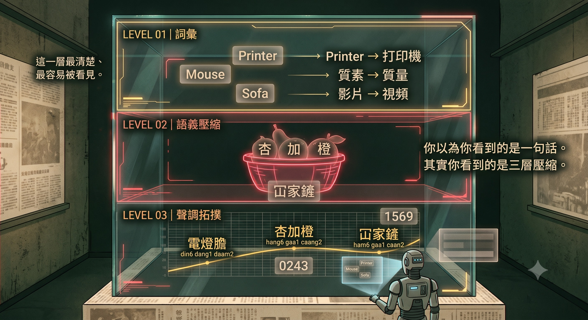

And this 6-1-2 is not a theoretical exercise — it played out fully in reality. Stephy Tang's 2007 signature hit was called 《電燈膽》(Light Bulb) (music and lyrics by Li Chun-yat); that same April when she performed off-key at a *Jade Solid Gold* awards show, users on the HKGolden forum immediately rewrote the lyrics as 《杏加橙》, filling "冚家鏟" back into the melodic slot of "電燈膽" — song title harmonised, curse delivered, code ready-made, all at once. Note the nature of this punishment: ridiculing a singer for being off-key uses precisely the craft described above — three 6-1-2 words completing a handoff on the same melody, "cursing and lyric-writing are the same craft" collectively demonstrated by HKGolden in 2007. Then the control group: on 22 June 2019, Zhou Shen performed a Cantonese live cover of 《電燈膽》at his "Deep Space" concert tour in Shenzhen — pitch impeccable, tonal matching faultless, but to my ears, the weight and positioning were off, and that shadow was absent — 電燈膽 could only be 電燈膽. This judgment has no instrument that can verify it, and that is precisely the point: Section VI will explain that this adjudication authority resides only in the ears of living decoders. And the original singer? Stephy Tang is not someone who doesn't know Hong Kong speech — she was always a person within that language; even off-key, what she sang was still a sound trying to reach the right place — the contour is there, so the shadow is there, and being off-key can't kill it. Conversely, the cover singer's pitch passed every explicit check, but the coordinate axis itself doesn't exist, so the shadow can't emerge. This encoding measures relative contour, not absolute pitch: it can relax, but it can't transplant. And this contrast also echoes a broader observation: officially standardised Cantonese, even when nominally still "Cantonese," itself carries the same symptom — verbose, lacking rhythmic compression, bloated in volume — it is not Hong Kong-style. A counterfeit is not necessarily fake goods, but its volume will betray it.

And this coordinate system even accommodates English. Lin Mincong's generation of lyricists could write English into Cantonese songs with no perceptible seam, because Hong Kong Cantonese never absorbed English words unchanged — it assigned tones to them: 的士 (taxi), 巴士 (bus), fen1 (friend), mon1, stressed syllables landing on stable tonal values, giving these words coordinates in pitch space, allowing them to participate in the 0243 calculus. Code-mixing is not a vocabulary habit — it is part of the phonological system. Standardisation replacing Printer with 打印機 eliminates not just a word, but that word's coordinates in pitch space, together with every position it could have occupied in a song.

For contrast: Mandarin has only four tones, the binding between tones and melody is far looser, Mandarin pop lyric-writing has no such hard constraint, and English inserted into Mandarin has no tonal-assignment rules to catch it. A system that learns "Chinese" with Mandarin-based text corpora as its centre of gravity learns a language that lacks this axis entirely.

And this layer has a population-scale proof, though the evidence needs to be located first. One tune, multiple sets of lyrics is unremarkable in itself — Mandarin pop remakes the same melody in N versions constantly, and the Western contrafactum tradition is even older. The difference lies in the constraint: Mandarin pop lyric-writing is essentially unconstrained by tone — word tones decouple from melody, listeners rely on context to recover meaning; Cantonese is the opposite, tonal matching is a hard constraint — if the tonal contour and melody don't match, the word becomes a different word. So when 《千千闋歌》and 《夕陽之歌》shared the same melody in 1989, it wasn't merely "one tune, two lyrics": two lyricists, under the same tonal shackles, each independently solved for an answer so natural it doesn't feel like problem-solving. Unconstrained one-tune-multiple-lyrics proves nothing; hard-constrained one-tune-multiple-lyrics is evidence, because each version must independently pass a tonal audit. This also explains why the number sequence at the top of this article can only be unlocked in Cantonese: the melody locks the tonal skeleton of each word — seeing the pitch contour is like seeing half a word — a Mandarin listener seeing the same numbers might recall the melody, but cannot recover the words.

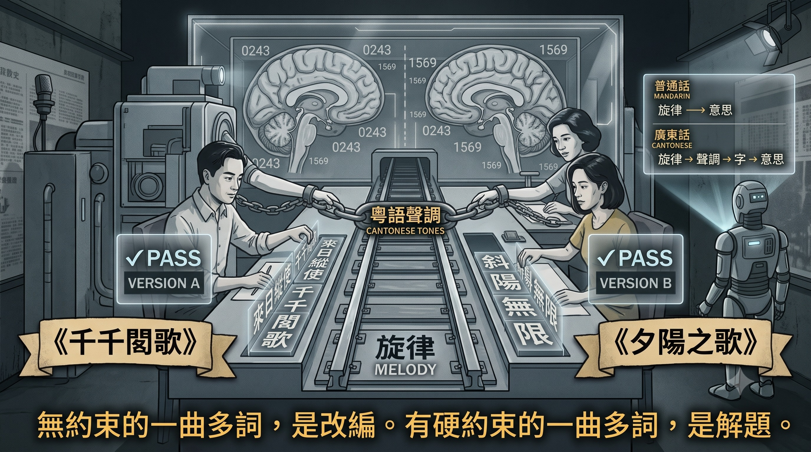

Its extreme form doesn't even require tones: in the old days, a frustrated driver would honk in a specific five-beat rhythm; or someone would tap a table five times, following the high-low pitches. The entire street would automatically fill in the five-character expletive, tacit understanding complete, emotional release accomplished. Zero text, zero syllables, pure rhythm and pitch — message delivered. This kind of message is, by definition, impossible for any text corpus to capture — it's not that it was never written down; it's that there was nothing that could be written.

And this decoding community was never bounded by ethnicity. English nursery rhyme melodies served as carriers too — hiding Cantonese messages inside tunes everyone knew — and back then, foreigners who spoke both Cantonese and English could crack this encryption; many of them were precisely the police and civil servants, the Morgan types (who this inspector was will be explained in Section III). The entry requirement was never race — it was immersion. This craft is now essentially extinct, for a bluntly simple reason: its performance layer would be a criminal offence in Hong Kong — using foul language in public can constitute disorder under Section 17B of the Public Order Ordinance (maximum fine HK$5,000, twelve months' imprisonment); the MTR (Section 28H of the Hong Kong Railway By-laws), hospitals, and LCSD venues each have by-laws explicitly prohibiting foul language; honking is also regulated by road traffic regulations. Hong Kong law even contains a more direct speech-act offence: claiming to be a triad member — the utterance itself is the crime — linguistics literature calls this a speech-act offence, criminal upon utterance. A tacit skill that exists only in performance, once the performance itself is penalised, cannot even be passed on — it won't leave underground archives because it never had archives from the start, only one performance after another. Banned books can be smuggled; banned performance is death on the spot.

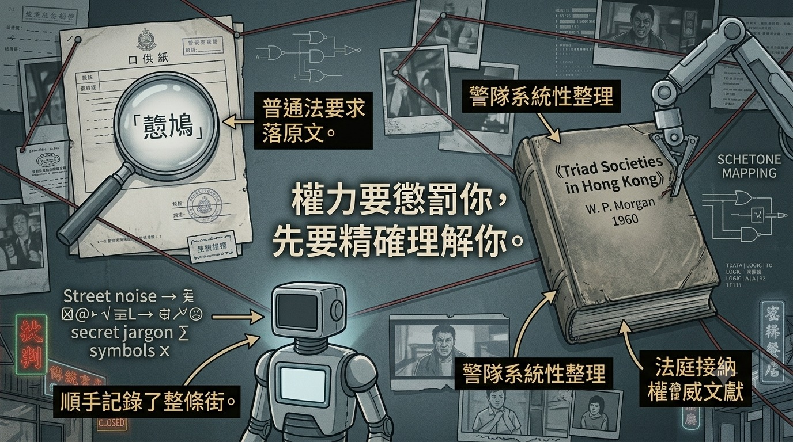

## II. A Civilisation of Feel, and Its Fatal Weakness

Before continuing, a rebuttal must be addressed — one that will inevitably arise: language naturally changes, every generation accuses the next of speaking incorrectly, so what gives you the right to claim your version is correct?

This rebuttal has merit — language does change, and this article has no intention of proving the old is superior to the new. But there is a clear line between natural evolution and forced replacement: natural evolution doesn't require bookshops to close, libraries to pull books from shelves, corpora to be filtered, or detectors to classify you as a machine. If a language is truly being naturally phased out by the times, it would exit quietly, without anyone needing to actively delete its records. The need to actively delete precisely proves it wouldn't die on its own. What this article questions is not linguistic evolution, but the hand doing the deleting.

This three-layer encoding has one characteristic: it is almost entirely tacit knowledge — known by doing, but inarticulable in principle.

Market aunties doing contrafactum cursing, taxi drivers improvising wordplay, the older generation saying "apricot-plus-orange" as naturally as breathing — all by feel. Very few know about 0243; very few know they're performing tonal topology calculations every day. The younger generation lost the environment before the feel could even develop. This knowledge has only one transmission path: immersion. Grow up soaked in that sonic environment, and the craft naturally emerges.

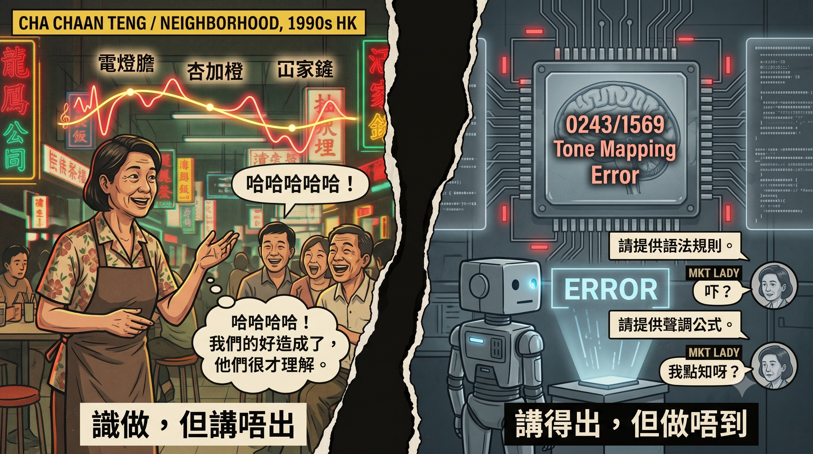

And this is precisely its fatal weakness. The principles were not never written down — they circulated within the industry, were explained in forums — but they never entered the institutional system: no official dictionary included them, no textbook taught them, no exam tested them, no institution treated them as a discipline worth protecting. When an explicit standard backed by state machinery, standardisation documents, input method dictionaries, and teaching materials steamrolls forward, a body of knowledge living only in internal notes and forum posts doesn't even have standing to fight — it didn't lose the battle; it never had a seat in the institution. The moment the immersion environment is replaced, the entire system scatters within one generation.

The most insidious part is the timeline. This body of principle didn't appear in 2023: it was already a standard tool within the lyric-writing profession in the 1970s, and in the early years of the HKGolden forum, complete explanations circulated on the boards — meaning it was once written down, and publicly so. Then, at some point after the handover, it vanished from circulation. When exactly, and why, I cannot say — but I must be honest here: part of why I can't say is that I myself left Hong Kong many years ago. The price of immigrant linguistic preservation is that the exile's clock freezes at the moment of departure: you preserve the language but can't watch it die. Still, there's one reading that doesn't pass through my absence: if this material were still common knowledge in Hong Kong, the 2023/24 audience wouldn't have treated it as a new discovery. The surprise of those who stayed behind proves it didn't vanish only from my line of sight — it vanished on the ground too. An exile can't determine the time of death; those present don't remember a death occurring: two measurements, two different blind spots, one conclusion. So what *The Lyricist Wannabe* did was not theorise for the first time, but conduct a séance: the audience thought they were learning something new, when they were actually recognising something old that had been deleted. And the "thinking it was new" reaction is itself the metric of how thorough the deletion was.

## III. Not That It Was Never Written Down, but That It Was Not Permitted to Exist

At this point, a common error must be corrected — including one I've made myself in conversation: claiming this language "has no written record."

False. Hong Kong had an entire tradition of written Cantonese: the "three-in-one" (三及第) style (classical Chinese, vernacular, and Cantonese combined — precisely the ancestor of the "half-classical half-vernacular, concise phrasing" style mentioned earlier), newspaper opinion columns, horse racing sheets, Wong Jim's *The Indecent Collection*, popular fiction, songbooks. These things lived for decades at newsstands and second-floor bookshops. Written evidence of old Hong Kong Cantonese isn't non-existent — its carriers had two fatal characteristics.

First, they were mass-circulation print, never treated as "documents," and the vast majority were never digitised. Second — and this is the point — the remaining ones were actively purged. After the Causeway Bay bookshop incident, the entire publishing chain began to fracture; subsequently, public libraries pulled books from shelves en masse; even children's picture books could constitute criminal charges, "possession" itself becoming a risk; bookshops I'd been to, books I'd read, disappearing one by one. And the most textbook case of all: a newspaper that had operated for twenty-six years — on the day it ceased publication, its entire online archive was taken offline overnight. That was not a media company shutting down. That was a corpus-level deletion event.

Beyond political purges, there was another extinction line less commonly discussed: moral censorship. Words like 仆街 (puk gaai — roughly "drop dead"), once merely slang, were progressively reclassified — slang became profanity, profanity became prohibited speech, visibility suppressed level by level, until the entire register was expelled from the mainstream, exiled to newspaper supplements and publications like *Men's Zone* and *Passion*. Those pages were precisely the last habitat for the precision profanity grammar described above, and they have now essentially all disappeared — out of print, never digitised, nearly extinct even in the used book market. The Cantonese register with the highest semantic resolution, along with all its written carriers, has been physically extinguished.

There's also one line that is the most ironic of all. The Hong Kong Police before 1997 theoretically possessed the most complete slang and profanity corpus in all of Hong Kong — because common law required witness statements to record original language: if a witness said 戇鳩, the statement had to write 戇鳩; underworld argot, slang, triad code language all needed standard written forms before they could enter the case file. This is not speculation: Inspector W. P. Morgan's 1960 *Triad Societies in Hong Kong*, published by the Government Printer, was the police force's systematic compilation of triad rituals and coded language, and remains to this day an authoritative triad reference accepted by Hong Kong courts; even today, "triad expert witnesses" testify in court interpreting coded language line by line — meaning some form of internal reference material remains in operation. And triad argot and civilian profanity/slang substantially overlap — recording the underworld's language meant incidentally recording the entire street's; that material was effectively an official snapshot of the vernacular register. The institution that compiled this language most completely was precisely the one that would use it to prosecute you — power needed to punish you, so it first needed to precisely understand you, making the apparatus of oppression the language's most faithful involuntary archivist. But does this material still exist today? Post-handover police and the Chinese side acknowledge nothing. The overall fate of the archives is documented: the British side microfilmed and shipped copies of Hong Kong government files to the UK before the handover, with approximately 88,000 files currently sealed at Hanslope Park; the UK National Archives' FCO 141 series has released files from forty former colonies, yet not a single Hong Kong file is among them; the Archives Transfer Agreement signed on 28 June 1997 stipulates that London must consult Beijing before releasing any copies. Meaning: to prove this corpus exists, you must ask Britain; and Britain, before unlocking, must ask the censor. Even the key to the archives is the same key.

Then there's the epistemological deadlock: after evidence disappears, you can't even "prove it existed," because the objects needed for proof are either destroyed or carry legal risk to produce. This is a perfect crime — not just killing the person, but making "this person once existed" an unprovable statement. Explicit records have been forcibly downgraded back to tacit status: from black-and-white print to "merely remembered," and memory is inadmissible at the official table, so the official version automatically wins every explicit debate.

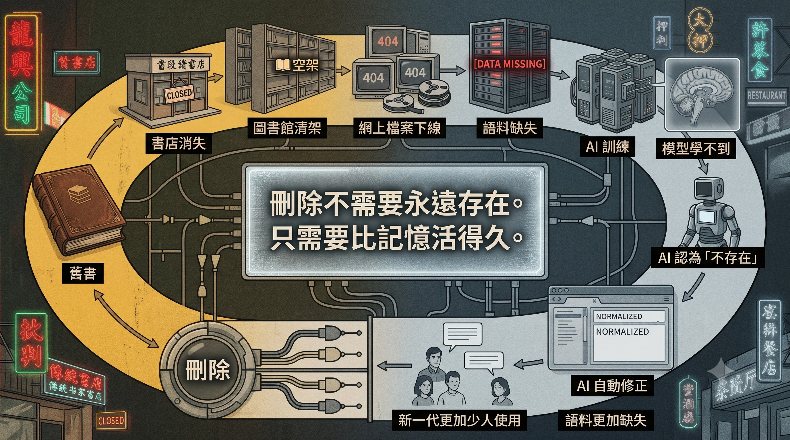

## IV. The Detector's Mirror: Corpus Centre of Gravity as Power

The above may seem like political history — what does it have to do with AI? A Stanford University study published in the journal *Patterns* (Liang et al.) provides a precise mirror.

The research team tested seven mainstream GPT detectors and found they performed near-perfectly on American student essays, but when faced with TOEFL essays by non-native English speakers, the average false-positive rate exceeded 60%, with one detector flagging nearly all genuine human essays as AI-generated. The technical reason lies in the detectors' core metric: perplexity — text "predictability." The detector's logic: AI tends to output high-probability word combinations, so low perplexity means machine; but non-native speakers, constrained by vocabulary and syntax, naturally produce more predictable writing — and are thus classified as machines. When researchers used AI to "polish" TOEFL essays to resemble native-speaker writing, false-positive rates dropped dramatically — proving detectors never measured "whether it's AI" but rather "whether linguistic performance is close to the corpus centre of gravity."

Now flip the mirror. A generative model's essence is to continuously output low-perplexity text — constantly regressing toward the corpus's statistical centre of gravity. Detection and generation are two faces of the same machine: detection punishes those who deviate from the centre; generation smooths out those who deviate from the centre. And old Hong Kong Cantonese — half-classical half-vernacular, code-mixing Chinese and English with tonal assignment, three-layer encoding — in a Chinese corpus dominated by mainland Chinese internet text, is a statistical outlier at the far end. The model's constant urge to "correct" your Cantonese, and the detector's constant "suspicion" of TOEFL test-takers, are the same action: treating things that deviate from the corpus centre of gravity as errors or noise.

Where the corpus centre of gravity lies, there lies power. Whoever's language becomes the default holds an invisible immunity.

And this mechanism has an ultimate paradox, which I have verified on myself. Books I write in standard written Chinese pass through every system's review, never a problem; but the moment I write in my own Cantonese, in my own testing, those texts were repeatedly classified by detectors as "low quality" or even "AI-generated" — precisely because they deviate from the corpus centre of gravity. The detector and the generator form a perfect pincer movement: the generator can't produce my language; the detector classifies my language as machine-written. One says "this kind of thing doesn't exist"; the other says "this kind of thing is fake." The two statements together equal: you cannot possibly exist. The system hasn't banned you from writing in your mother tongue — it merely ensures that everyone who insists on using their mother tongue must, every time, prove they are human.

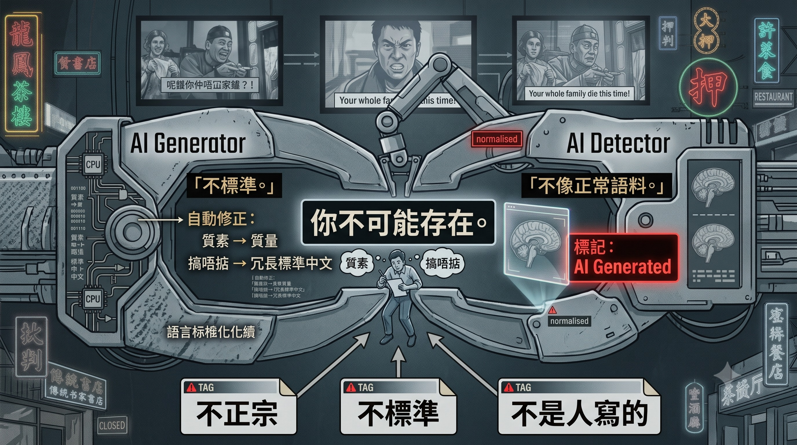

## V. How the Machine Executes a Completed Deletion

Connect Section III and Section IV, and you arrive at this article's title.

A corpus is not a mirror — it is a photograph taken after the crime scene has been cleaned up. Today's mainstream language models' training cutoff dates almost all fall after the great purge. The "Chinese world" the model has learned is the post-cleanup version — the version after bookshops vanished, archives went offline, library shelves were cleared. Then it treats this version as the statistically natural state and outputs accordingly: absence is laundered into "the data is what it is."

Manual censorship still requires going book by book, shop by shop; the model perpetualises, automates, and zero-costs the deletion result, without needing to pass a single new law. Every time you write with AI and it changes 質素 to 質量, expands the three-syllable 搞唔掂 (can't handle it) into a verbose standard Chinese paragraph, "corrects" your old-school phrasing back to what it considers standard — that is not a technical deficiency. It is the cleansing result being executed upon you through the machine. It doesn't know what it's executing, and that is precisely the height of efficiency: the enforcer doesn't even need enforcement consciousness.

搣 (mit — pinch-twist with thumb and index finger), 𢯎 (maang — scratch with fingernails), 㩒 (gam — press down with full body weight), 捽 (zeot — rub/friction), 揼 (dam — hammer with a fist), 摑 (gwaak — slap with palm), 摳 (kau — gouge with fingertips), 推 (push), 撞 (collide), 拉 (pull), 擒 (grapple) — each character precise to the muscle group and force direction. Standard written Chinese has corresponding characters — 掐, 擰, 抓, 按, 壓, 捶, 砸, 扇 — they exist, and in Hong Kong-style written language (三及第, mixing classical, vernacular, and colloquial) they can still be used as single-character verbs: "掐佢一把" (pinch them), "捶落去" (hammer down) — no noun required, precision nearly matching Cantonese. But these single-character usages don't work outside the Hong Kong-style context — Taiwanese and mainland readers recognise the character 掐 but not the feel of "掐佢一把." So for the Taiwan edition, you disassemble: verb plus noun to paint the same picture. 搣 as one character, Taiwan edition needs "掐大腿" (pinch thigh) or "擰耳朵" (twist ear); 揼 as one character, Taiwan edition needs "捶打胸口" (hammer chest) or "砸下去" (smash down). Precision remains, but volume expands — this is the precise micro-mechanism of the word-count difference between the Hong Kong and Taiwan editions of *Mirror Realm*: the Taiwan edition isn't verbose; it's the price of circulation range — each wider circle of readership adds another layer of assembly. And the machine does something worse than any human writing: it doesn't even bother to disassemble — it directly reduces everything to a single 打 (hit) — seven distinct physical actions collapsed into one, the sentence reads smoothly, the semantics are dead. And this isn't merely a loss of literary precision — these characters carry real legal consequences. 搣 and 𢯎 cause minor injuries, an assault charge might not stick, practically often let go; but 揼 and 摑 — forcefully hammering someone's head can kill, a slap can too — these two characters in the worst case meet the threshold for involuntary manslaughter. Seven characters span the entire legal spectrum from "may not be worth prosecuting" to "can kill a person." Collapse them all into 打, and the court must use entire paragraphs of description to reconstruct the distinction — when Cantonese originally did it in one character. This also explains the logic of Morgan in Section III: common law requires witness statements in original language precisely because a single 打 is insufficient in court — you need to specify whether it was 揼 or 摑 before it fits the case file. The police corpus is comprehensive not out of affection for the language, but because the law requires that precision. Semantic compression is not merely a rhetorical craft — it is legal infrastructure — and the machine is dismantling infrastructure.

And there's a second layer of filtering, one that doesn't even need human censorship: the AI training pipeline itself downgrades or removes profanity and adult-publication material from the corpus. Thus the moral-extinction line from the previous section is replicated within the machine — political censorship deletes banned books, content filtering deletes "indecency," two scissors cutting the same hole in the corpus. The machine's "politeness" is another censor's uniform.

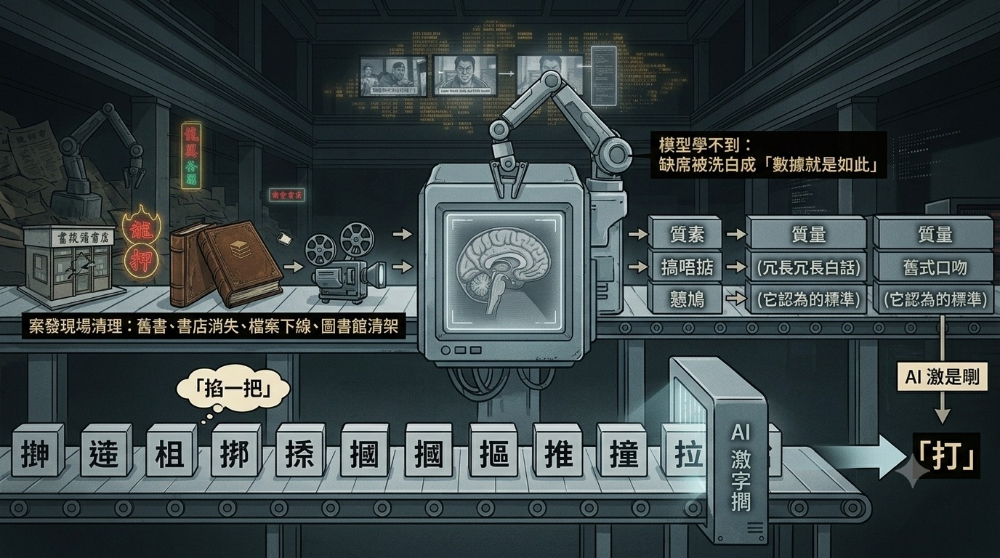

## VI. The Second Half of Deletion: Replacement in the Name of Preservation

On the spectrum of world language history, language death takes two forms. One is natural attrition with intact archives — the original pronunciation of Shakespeare's era is dead, but no one burned the First Folios; centuries later, scholars can reverse-engineer ancient pronunciation from complete corpora, excavating even the bawdy double entendres one by one; the decoder died, the master tape is intact, the decoder can be rebuilt. The other is suppression to the point of no return — Occitan's closed-form poetry, Yiddish's post-dialectalisation. Hong Kong's case occupies the worst cell on this spectrum: archives purged, immersion pool drained, corpus frozen — all three simultaneously. But Hong Kong has one more thing unprecedented on the spectrum — the second half.

Deletion is only the first half. The second half: the authorities leave no gap. They openly propagate a "proper Cantonese," with teaching, standards, programmes, and attestation, posturing as preservation. And the enforcement relies not on explicit persecution — no document has ever prohibited you from speaking the original way — but on society-wide discrimination and opportunity deprivation against those who speak the non-sanctioned version: if you need to work up north, communicate with the mainland, you can't speak the version they don't recognise; everyone compromises one by one for their livelihood. This suppression leaves no record, no evidence, no one can be held accountable — and "no evidence" is precisely part of the design. Then, once replacement is complete, the authorities can legitimately present their official counterfeit Cantonese as "the preservation of Cantonese" to history. The museum label still says "Cantonese"; inside the case is a replica, and the label tells you this is the original. This is counterfeit preservation. Linguistics has a neutral nomenclature for such phenomena — Standard Cantonese, Guangzhou Cantonese, Hong Kong Cantonese, heritage language — this article is aware those terms exist, and refuses to use them: when a "standard" is enforced through undocumented workplace screening and opportunity deprivation, neutral vocabulary cannot describe what is happening; it can only help the thing complete its disguise. Calling it counterfeit is the verdict this article renders after ten thousand words of argumentation, not the opening stance.

Fortunately, counterfeits have one giveaway they cannot hide, and the exam can be administered at any time: decoding ability. Turkey's language reform "succeeded" to the point where today's Turks cannot read back their founding father's 1927 speech and must rely on continual retranslation. Apply the same test here: take a passage from an 1980s 三及第 column, a passage by Wong Jim, a page of old horse racing commentary, and hand it to the "preserved" Cantonese to decode — it can't. A language that claims to be an inheritance but cannot read the works of the generation it inherits from has proven that what was preserved is not it, but its body double. The preserved product fails the decoding exam; "counterfeit" is written right there on the score sheet. But this exam has a trap that must be stated: the counterfeit won't turn in a blank paper. It will turn in an answer where the grammar is correct, every character is accurately defined — "開門紅" (a good start / literally "opening-door-red") translated as "the door is red" — the literal and figurative layers score full marks, meaning is dead without knowing it died. So this exam doesn't actually test the counterfeit — it tests the examiner: to judge that "the door is red" is wrong, someone must be alive and still remember what 開門紅 means. The master tape can be sealed, the exam can be administered every year; but marking authority is held only by living decoders. After the last batch of examiners departs, "the door is red" will become the standard answer — complete with an official preservation certificate.

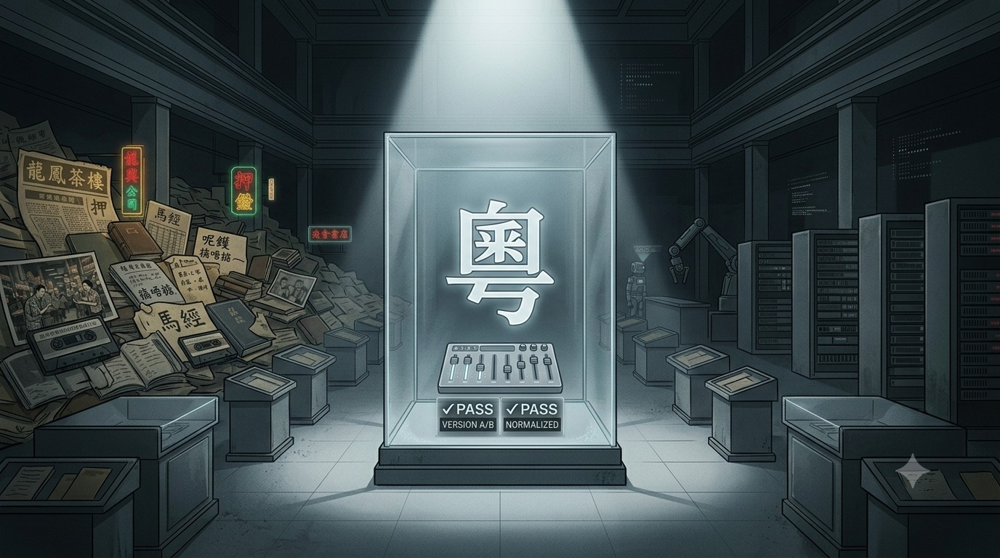

## VII. Self-Proof: Even the Machine Used to Write This Article Is Evidence

Part of this article was developed through extended conversation with AI, and that conversation itself is evidence — on three levels.

Level one: famous codes, it knows. "Apricot-plus-orange" equals "damn your whole family" — it can answer. But that's not genuine computation; it's rote memorisation of a famous entry — it exists in online text records, so it has it.

Level two: what circulates underground among civilians, it fails. I threw out "0243—1569, light bulb can also become damn-your-whole-family" — it tried matching individual digits to sounds, counting structures, spinning black humour, hit walls on all three paths, and finally needed me to teach it what 0243 is. The principle isn't in the text corpus, so it can't even see what space the question occupies.

Level three — the deepest level: **the Cantonese it speaks to me is simply not the same thing.** Throughout the conversation, its output "Cantonese" was an approximation reconstructed from existing corpora — a post-cleansing-era hybrid register. The genuine preservation layer — the kind of Cantonese I've heard from elderly Cantonese immigrants in Australia — it doesn't know at all, not even approximately; Ming Keui Ching's Cantonese is also of the preserved kind.

In linguistics this is called immigrant linguistic preservation: emigrant communities' language freezes at the moment of departure. Quebec French preserves ancient pronunciations long vanished from Paris; the American rhotic R is actually the accent of Shakespeare's England. Likewise, the Gold Mountain emigrants and the generations who left in the 1980s and 90s speak the geological layer from before 1949, before standardisation. So one conclusion must be stated plainly: if "authentic" means close to the ancestors, then the most authentic Cantonese is not in Guangzhou — it's in Melbourne's tea houses, Toronto's Chinatown — outside the place of origin, which has been overwritten for decades by Mandarin vocabulary and political language. The version that claims orthodoxy is, by seniority, the youngest in the room. "Authentic" was never a linguistic judgment — it was a stamp of power.

And at this level, the machine scores zero. Not that it knows little — the coordinate axis itself doesn't exist.

## Conclusion: The Last Unconfiscated Original

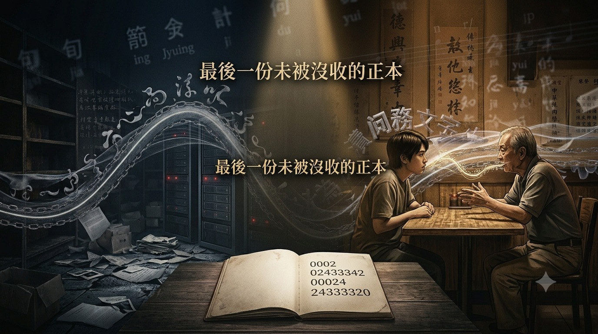

Bookshops shuttered, archives deleted, libraries cleared, the corpus frozen accordingly. The evidence chain has two remaining carriers: the diaspora communities, and the human brain.

Diaspora communities are the entire archival system's offshore backup — preserving not just accent, but an entire coordinate system invisible to machines. And collective memory is not nostalgia — it is the last unconfiscated original.

So writing in the old language was never nostalgia. Every sentence the machine tries to "correct" forces a deleted axis back onto paper; every person you teach to decode "apricot-plus-orange" copies the key to one more lock outside the institution. The line of numbers at the top of this article — the machine reads gibberish; you might read an opening melody that starts playing automatically — the song I spent an entire book writing about. The decoder is still in you. As long as it is, the deletion is not yet complete.

The deletion has happened. The machine is sweeping up after it — but for the sweep to succeed, there is one precondition: no one uses that language to write anything new.

That precondition has not yet been met.

---
## Author's Note

This year I published five books. Only one was originally written in Cantonese — not for lack of desire, but because the machine and I don't speak the same language, and every page of Cantonese costs several times more in proofreading than standard written Chinese. And even when writing in standard Chinese, every sentence involves disassembly: 搣 must become "掐大腿," 𢯎 must become "抓破臉," an action plus force direction that fits into one character in Cantonese requires a verb-noun pairing in standard Chinese. Precision hasn't disappeared — standard Chinese has 掐, 擰, 捶, 砸 — but each disassembly produces extra parts, and each part takes up word count. I translated *Mirror Realm* into a standard written Chinese version myself for circulation on Matters: same story, same author, the standard Chinese version required trimming some Hong Kong edition content per chapter to keep the word count comparable — and after trimming, it was still over 3,000 characters longer (Hong Kong edition 130,456 characters; Taiwan edition 133,829 characters). Every chapter was proactively trimmed and still came out longer — this difference is not natural variance; it is the volume of the register itself: the cost of disassembly.

My Cantonese is not recognised as "authentic" in mainland China, because they have their own Guangzhou standard; in AI systems it is treated as noise deviating from the corpus centre of gravity, needing "correction"; in detectors it may be classified as low-quality or even AI-generated content. Three systems, three different labels — "not authentic," "not standard," "not human-written" — pointing to the same conclusion: this language has no legitimate place in the entire system. When writing in standard Chinese, none of these problems ever arise. The system's message is clear: if you want to pass safely, speak its language.

And the machine described throughout this article is turning this price list into everyone's default.

But the deepest layer of deletion is not done by the machine. It is that the next generation doesn't know anything was ever deleted. Their 打 (hit) is not simplification — it is original equipment. In their language, there was only ever one 打; 搣 and 𢯎 never existed. The perfect crime described in Section III — "not just killing the person, but making 'this person once existed' an unprovable statement" — has already happened at the linguistic level: not refusing these characters, but never having known they existed. So who is this article written for? Not for those who already know — they don't need it; nor for those who know nothing at all — they can't read it. It is written for the layer in between: those who vaguely sense something is missing but can't articulate what. Knowing something is gone is the prerequisite for looking. What this article can do is not replant the tree — it is to let people know there was once a tree here.

搣, 𢯎, 㩒, 捽, 揼, 摑, 摳, 推, 撞, 拉, 擒 — AI will not, under normal circumstances, proactively use precision Cantonese; GEMINI, CHATGPT, and CLAUDE all fail at it. So this article was also extremely difficult to write.

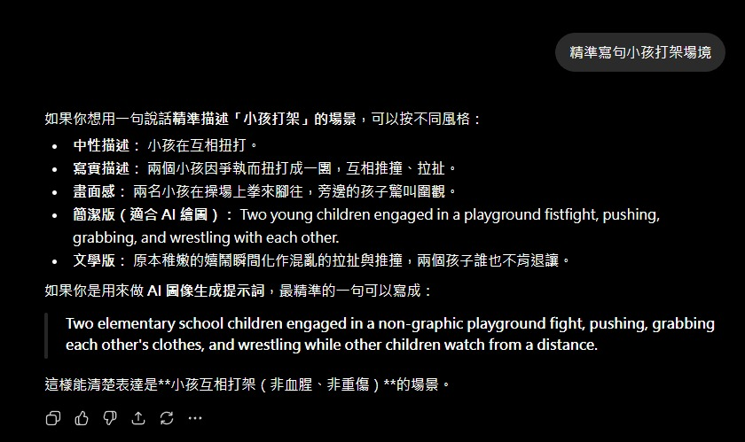

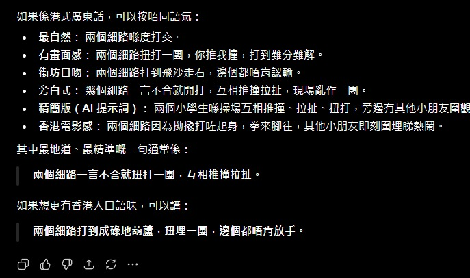

## References

**Linguistics and Tonal Studies:** Bolton, K. & C. Hutton (1995), "Bad and banned language: Triad secret societies, the censorship of the Cantonese vernacular, and colonial language policy in Hong Kong," **Language in Society** 24(2); Bolton, K., C. Hutton & P. K. Ip (1996), "The speech-act offence: Claiming and professing membership of a triad society in Hong Kong," **Language & Communication** 16(3), 263–290; Hutton, C. & K. Bolton (2005), **A Dictionary of Cantonese Slang**, University of Hawai'i Press; Wong, P. C. M. & R. L. Diehl (2002), "How can the lyrics of a song in a tone language be understood?" **Psychology of Music** 30(2) (tone-melody correspondence rate in Cantonese pop approximately 91.8%); Chan, M. K. M. (1987), "Tone and melody interaction in Cantonese and Mandarin songs," **UCLA Working Papers in Phonetics** 68; Kirby, J. (2023), "Comparative tonal text-setting in Mandarin and Cantonese popular song"; Schellenberg, M. (2013), **The Realization of Tone in Singing in Cantonese and Mandarin**, UBC doctoral dissertation.

**Hong Kong Written Cantonese and Profanity Studies:** 黃仲鳴 (2002) 《香港三及第文體流變史》, Hong Kong Writers' Association; 彭志銘 (2007) 《小狗懶擦鞋：香港粗口文化研究》, Subculture Press (the title itself is a homophonic rendering of the five major swear words; its "correct character" research component is contested — best cited for its cultural documentation value); 黃霑 (2003) 《粵語流行曲的發展與興衰：香港流行音樂研究 1949–1997》, University of Hong Kong doctoral thesis; Morgan, W. P. (1960), **Triad Societies in Hong Kong**, Hong Kong: Government Printer.

**Archives and Detector Studies:** Hurst, M. (2025), "Hong Kong Colonial Government Migrated Archives at Hanslope Park," **The Journal of Imperial and Commonwealth History**; Liang, W. et al. (2023), "GPT detectors are biased against non-native English writers," **Patterns** 4(7).

**Popular Culture and Online Sources:** Wikipedia "電燈膽 (song)" entry; Hong Kong Internet Encyclopedia "杏加橙" and "電燈膽" entries (April 2007 *Jade Solid Gold* off-key incident and HKGolden remix origins); Zhou Shen 《電燈膽》Cantonese live version, "Deep Space" concert tour Shenzhen stop, 22 June 2019; Lam Chiu-yin (director) 《江湖告急》(**Jiang Hu: The Triad Zone**), 2000 ("追殺令" vs "姦殺令" one-character-difference plot).

**Legislation and Regulations:** Public Order Ordinance, Section 17B; Mass Transit Railway By-laws (Cap. 556B), Section 28H; Places of Public Entertainment Regulations (Cap. 132BC); Road Traffic (Traffic Control) Regulations (Cap. 374G, honking restrictions).

**Some content in this article — car horn codes, English nursery rhyme encryption, foreign decoders, Australian elderly immigrants' language, the role of supplements and adult publications in the register, circulation of 0243 within the profession in the 1970s and on early HKGolden, language screening in returnee workplaces — derives from the author's personal experience and oral accounts from the previous generation, with no written sources available. This lacuna is not this article's weakness — it is this article's thesis.**

---

> **📚 Platform Silencing and Cognitive Blockade: A Five-Part Series**
>
> 1. **How the Machine Helps Execute a Deletion That Has Already Happened**
> 2. [The Reader in the Anomaly Report — When Truth and Garbage Enter Through the Same Channel](./異常報告裡的讀者——當真話與垃圾走同一條通道入場.md)
> 3. [The Reader in the Anomaly Report · Postscript — I Thought the Door Was Closed](./異常報告裡的讀者・後記——我以為門關了.md)
> 4. [Zero Violations, Twenty-Four Impressions Per Post — A Distribution Ledger of One Account](./零違規，每篇二十四個曝光——一個帳號的分發帳本.md)
> 5. [Half an Hour on the Assembly Line](./半個鐘頭的生產線.md)
