# Fire Extinguisher Economics — Microsoft's ASD and the Latest Act of a Thirty-Year-Old Play

**Nebula Walker｜MYTHOGEN ENGINE**

---

On May 15, 2026, Microsoft announced a technology that made PC gamers cheer: Advanced Shader Delivery (ASD). The first-time loading screen for *Forza Horizon 6* shrank from nearly ninety seconds to four. A 95% reduction. NVIDIA, AMD, and Intel — all three major GPU vendors — on board. The shader compilation wait that had plagued PC gamers for over a decade appeared to be finally headed for the history books.

Great news.

If, at this point, you think this is simply a piece of technological good news — congratulations, you're right in line with every gaming outlet in the world, seeing nothing but that 95% number on the slide.

Now, turn to the page about the activation requirements.

---

## I. Fire Extinguishers Sold Only to Your Own Tenants

ASD requires: Windows 11 24H2 or later. Xbox Gaming Services updated to a specified version. Enrollment in the Xbox Insider Hub's PC Gaming Preview programme. Games must be downloaded through the Xbox PC app or the Microsoft Store.

**The Steam version is not currently supported.**

Same game. Same graphics card. Same driver. Download from the Microsoft Store and you're in the game in four seconds; download from Steam and you're staring at a compilation progress bar for ninety.

Is there any technical reason the Steam version can't use the same pre-compiled shaders? None. The core of ASD is separating the shader compiler from the driver, completing compilation in the cloud, and pushing the finished product to the player's machine. This could easily have been built as an open standard benefiting every platform. Microsoft chose not to. It chose to lock the solution into its own store, its own services, its own cloud pipeline.

The convenience is real. The lock-in is also real.

If this structure looks familiar, it's because it appeared thirty years ago.
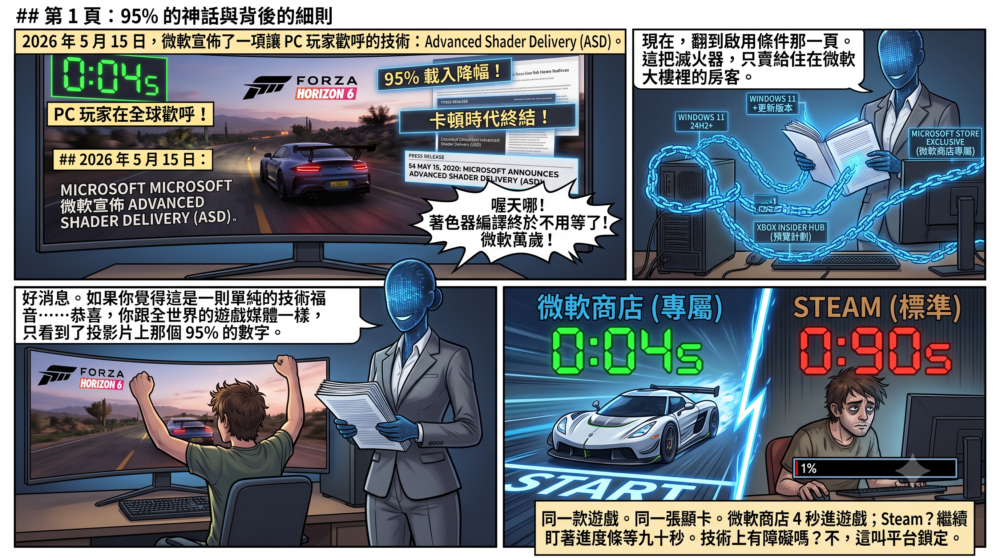
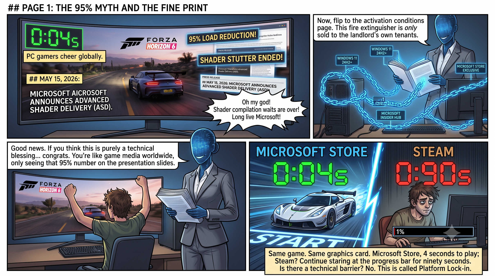

---

## II. Start the Fire, Then Sell the Extinguisher

When did shader compilation stuttering become PC gaming's perennial headache?

The answer: DirectX 12.

In the DX11 era, drivers handled much of the shader compilation and permutation work for developers. Developers didn't need to worry — it happened automatically behind the scenes. DX12 changed the rules. In the name of "closer to the hardware, higher performance," Microsoft shifted responsibility for the shader pipeline from the driver to the developer. Developers now had to manage shader compilation, caching, and permutations themselves.

In theory, this allowed top-tier developers to squeeze out better performance. In practice, it left the vast majority of developers helpless in the face of the exponential explosion of shader permutations. The result is the line you see on the title screen of every DX12 blockbuster: "Compiling shaders, please do not close the game."

This problem festered for a decade. Players endured it for a decade.

Now Microsoft comes back and says: "Let me fix that for you."

But the fix isn't to repair DX12's shader pipeline design, isn't to make local compilation more efficient, isn't to provide an open pre-compilation standard that every platform can use. The fix is: **move compilation to my cloud, bind it to my store, route it through my Partner Center.**

**A problem of its own making, turned into a platform-exclusive solution. Start the fire, then sell the fire extinguisher — and only sell it to tenants living in your own building.**

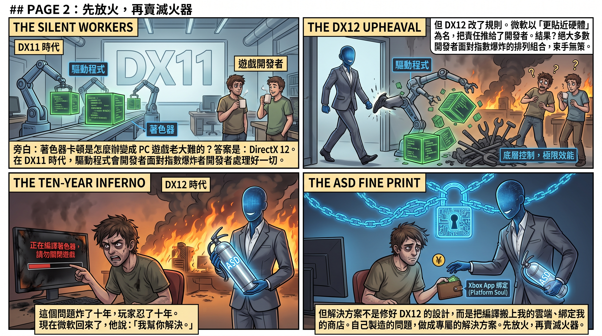
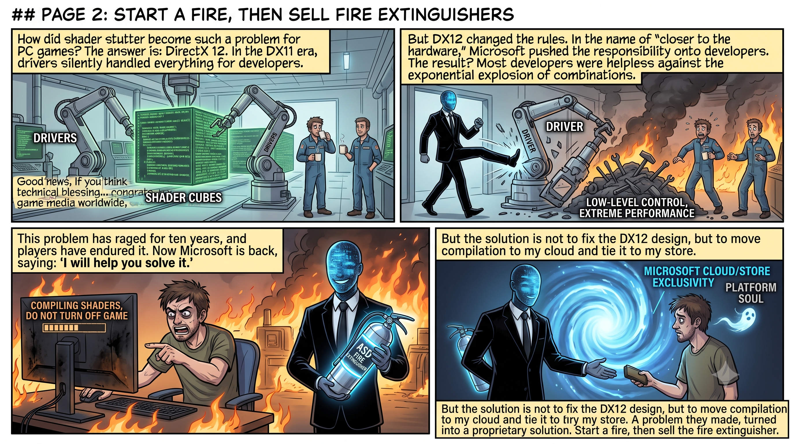

---

## III. The Engine Regresses, But Who Cares?

If the purpose of ASD is genuinely to improve the gaming experience, then Microsoft should simultaneously ensure the game itself runs well.

*Forza Horizon 6* — ASD's official showcase title — uses an upgraded version of the ForzaTech engine, inherited from 2023's *Forza Motorsport*. The engine added real-time global illumination and other new features, but VRAM demands skyrocketed — on the same graphics card, FH5 could run smoothly at Extreme quality, while FH6 on High already consumed over 7 GB of video memory. Micro-stuttering on AMD cards was especially severe, and Playground Games acknowledged within a week of launch that they were working on fixes.

Even more absurd is the game's own AI. FH6's Drivatar system is passable at lower difficulties, but once you dial it up to Highly Skilled or above, the rubber-banding is exposed in full — AI opponents don't beat you with better racing lines or braking timing, but by conjuring physics-defying speeds on straights, and even teleporting closer after you've pulled ahead. Four days after launch, Playground Games listed "Drivatar AI Balance" as one of four priority improvement areas, acknowledging that "AI opponents are too fast at higher difficulties." And the tuning system? The game provides raw telemetry data — tyre temperatures, suspension travel — but zero AI-assisted analysis. If a player wants to know whether to soften the rear anti-roll bar, they have to read the numbers themselves, scour community guides, or pay for a subscription to a third-party tuning calculator.

Consider what this means. Microsoft is one of the world's biggest investors in AI — over one hundred billion dollars in capital expenditure, thirteen billion dollars bet on OpenAI. Sony's *Gran Turismo 7* integrated Gran Turismo Sophy back in 2022 — a deep reinforcement learning AI published in *Nature*, capable of beating world-champion-level drivers on track. Yet Microsoft's own flagship racing game has AI opponents whose behavioural patterns are stuck in the rubber-banding of twenty years ago, and a tuning system that doesn't even have a "suggest suspension settings based on your driving style" feature.

**The company that spends the most on AI in the world made a racing game with no AI — and then used it to showcase a platform lock-in technology.**

Microsoft doesn't care.

Because what ASD is meant to demonstrate isn't "improved game quality" but "the gap in loading speed." What it needs is a big enough number — 95% — and a clear enough contrast: my store, four seconds; Steam, ninety seconds.

**Whether the game itself is fun, whether the AI is smart, whether the frame rate is smooth — none of that is in ASD's KPIs.** ASD's KPI is: how many players, because of that gap, choose to buy from the Microsoft Store next time.

Engineering resources were not spent on improving the game engine, nor on game AI. Engineering resources were spent on building the infrastructure for platform lock-in. Game quality is the means; platform stickiness is the end.

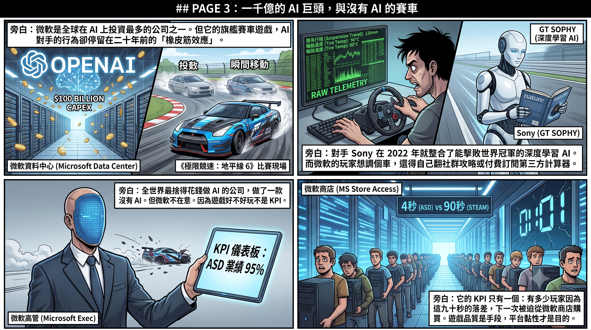

---

## IV. But This Lock Is on a Sinking Ship

ASD's chosen battlefield is the Windows Store distribution channel for PC games.

Ask this question: where does Windows, as a platform, stand right now?

The entire AI software ecosystem — PyTorch, the CUDA toolchain, containerised deployment — lives on Linux. Over ninety percent of the world's top five hundred supercomputers run Linux. Even NVIDIA's own cloud gaming platform, GeForce NOW, runs Linux at the base layer, with Windows installed inside virtual machines — booted up when needed, shut down when not. Valve's Steam Deck runs Linux, using the Proton translation layer to run over ninety percent of Windows games.

Windows used to be the landlord of the entire building. Now it is becoming a tenant — a VM that can be virtualised, started, and stopped.

Microsoft is pouring massive engineering effort into deepening lock-in on a platform that is being routed around.

This is installing better locks on a sinking ship.

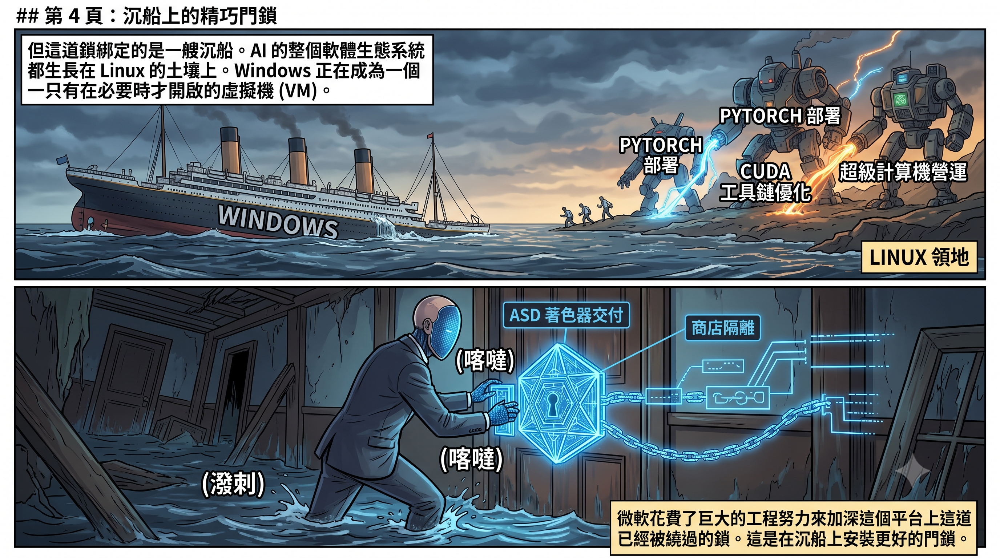
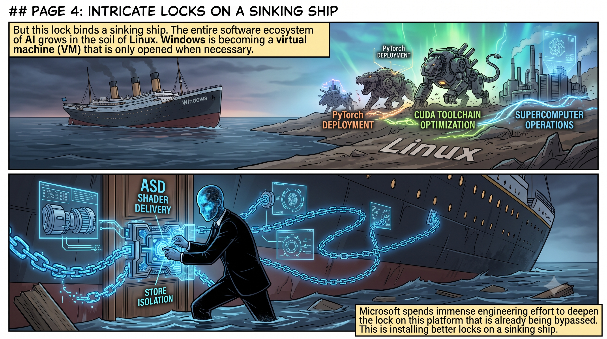

---

## V. The Answer Is Written on the Corpse of the Steam Machine

If you think "start the fire, then sell the extinguisher" is just a metaphor — Valve can produce a corpse as evidence.

In 2015, Valve launched the Steam Machine. The concept was straightforward: a Linux-based living-room gaming console, playing games directly from Steam, bypassing Windows. If it succeeded, PC game distribution would no longer be monopolised by Microsoft's platform.

It died.

Not because the hardware was poor. Not because the pricing was wrong. It was because the vast majority of games on Steam were written in DirectX, and SteamOS ran Linux, using OpenGL. On the same machine, SteamOS ran games 21% to 58% slower than Windows. Two hardware manufacturers that had planned to produce Steam Machine hardware — Falcon Northwest and Origin PC — saw the performance gap and pulled out entirely.

The Steam Machine wasn't "underperforming." It was suffocated to death by thirty years of DirectX ecosystem lock-in.

Developers wrote games in DirectX not because DirectX was the best, but because Windows was the only market. When every game was hard-coded to DirectX, any platform that tried to bypass Windows ran into the same wall: ninety percent of the games in your library wouldn't open. This was not a technical problem — it was a structural effect of monopoly. **You don't need to ban competitors from entering the market; you just need to make the entire ecosystem dependent on your proprietary standard, and competitors will suffocate on their own.**

It took Valve ten years to find a way around. The Proton translation layer plus DXVK, converting DirectX calls on the fly into Vulkan — essentially building a virtual Windows on top of Linux. The 2022 Steam Deck proved this path was viable: over ninety percent of Windows games could now run on Linux.

Ten years. An entire translation layer's worth of engineering. Just to get around a wall that should never have existed.

And now, Microsoft has added a new layer to the wall.

ASD ties the shader distribution pipeline to the Xbox PC app. Even if Proton can translate DirectX graphics calls, it cannot translate a cloud distribution mechanism bound to Microsoft Store infrastructure. The Steam version doesn't support ASD. SteamOS, even less so. The next-generation Steam Machine of 2026, having just passed Vulkan 1.4 certification, has already been excluded from ASD's ecosystem before it even ships.

This is how monopoly operates: **when the old lock is picked, install a new lock on a new dimension.** The API-layer lock was bypassed by Proton? Then lock it again at the shader distribution layer. The distribution layer gets bypassed too? Next time it'll be the anti-cheat layer, the cloud compute layer, or any other layer where no open standard exists yet.

DirectX killed Steam Machine 1.0. ASD is the first bullet aimed at Steam Machine 2.0 — before it is even born.

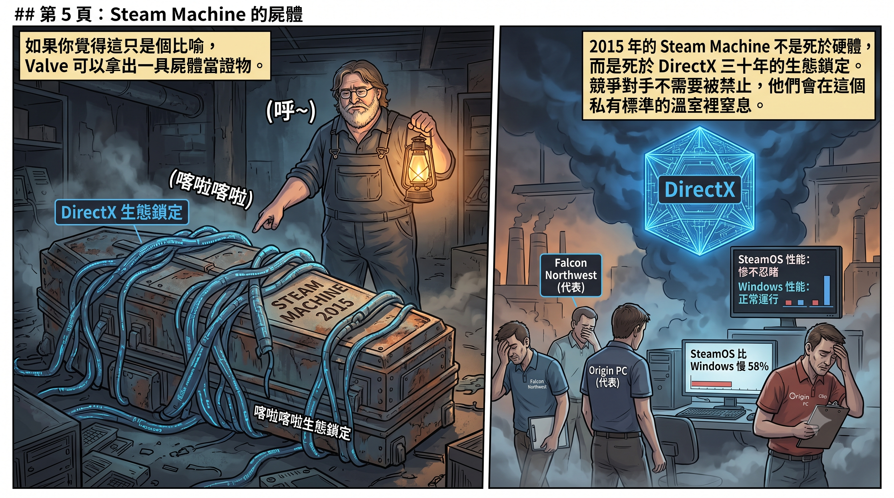
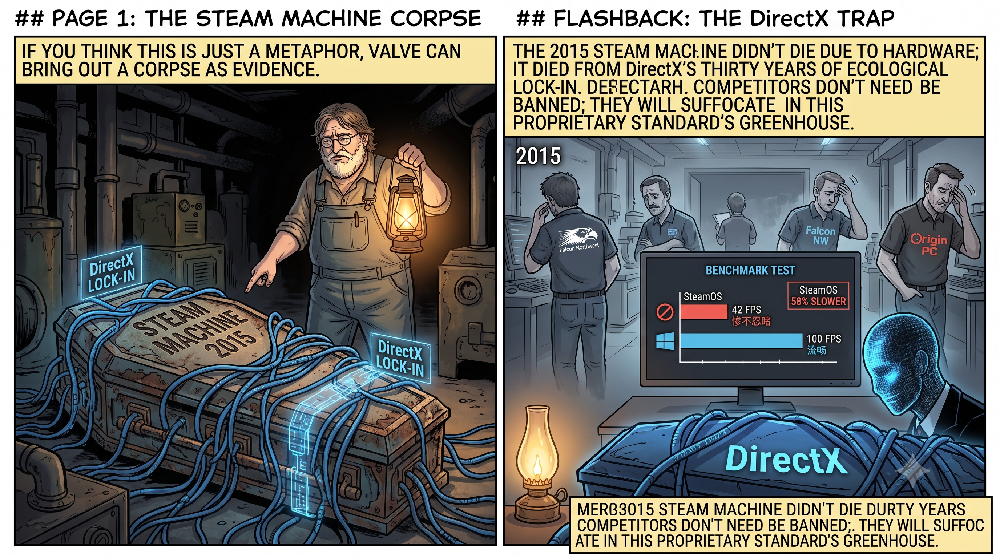

---

## VI. The Last Straw, Broken by Their Own Hand

Here we need to zoom out and look at Microsoft's full picture in the AI era.

In fiscal year 2025, Microsoft's capital expenditure exceeded one hundred billion dollars — almost all of it directed at AI data centres. It invested thirteen billion dollars in OpenAI. Its AI strategy is staked on Azure cloud computing and OpenAI's model capabilities.

But this strategy has a structural weakness: **Microsoft does not own the end consumer.**

Azure's customers are enterprises. Copilot is a bolt-on feature grafted onto Office. OpenAI could decouple at any time. Google has its search engine and Android. Meta has its social platforms. Apple has the iPhone. What does Microsoft have?

Microsoft used to have Xbox.

Not just tens of millions of active users and a monthly-paying Game Pass subscription relationship. Not just a fully built content distribution pipeline and a roster of elite first-party studios — Arkane Austin, makers of *Prey*; Tango Gameworks, makers of *Hi-Fi Rush*; 343 Industries, makers of *Halo*.

Xbox also had something more important than all of these: **an independent operating system architecture.**

Xbox's OS, while based on the Windows NT kernel, adopted a hypervisor architecture starting from Xbox One — a lightweight real-time operating system controlling the entire machine, running a stripped-down environment containing only the APIs needed for games. Microsoft's own engineers have said: "Owning our own operating system lets Xbox control its own architectural destiny." This system didn't need to be compatible with thirty years of Win32 applications, didn't need to run Office, didn't need to carry the enormous legacy baggage of Windows. If Microsoft had committed to it, Xbox OS could have evolved further, designed from scratch with AI scheduling and inference pipelines, becoming a truly AI-native consumer platform. Not a Copilot button layered on top of Windows, but a system whose core architecture was designed for real-time AI interaction from the ground up.

Imagine: an Xbox console equipped with a dedicated NPU, running an AI operating system unencumbered by Windows legacy. NPCs in games that can carry on real-time conversations and learn. A tuning system that uses AI to analyse your driving style and automatically suggest suspension settings. Levels that dynamically generate based on player behaviour. Tens of millions of players spending hours immersed in it every day — the most ideal large-scale consumer proving ground for AI technology, with a degree of immersion and stickiness that no chatbot or office plugin could match.

Google doesn't have anything like this. Neither does Meta. Apple doesn't yet, either. Microsoft did — and only Microsoft did.

But Microsoft dismantled it.

In 2024, it spent $69 billion acquiring Activision Blizzard, then laid off 1,900 people three months later. Tango Gameworks was shut down. Arkane Austin was shut down. The Initiative was shut down. Turn 10 lost nearly half its staff. Phil Spencer retired. His replacement was an AI executive.

Seamus Blackley — co-creator of the original Xbox — gave it a name: palliative care.

**The only consumer base Microsoft ever had in the AI era was dismantled by its own hand.**

And ASD is the remedial action taken after the dismantling. Xbox hardware has withered; Microsoft is trying to maintain control over PC gaming through software services — you don't need an Xbox console, just buy games through my app, use my cloud pipeline. But a PC game distribution channel's lock-in is no substitute for a consumer platform with tens of millions of active users.

This is applying a bandage to an artery.

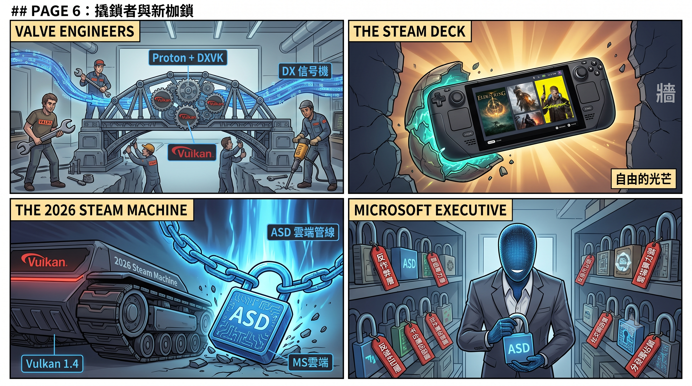
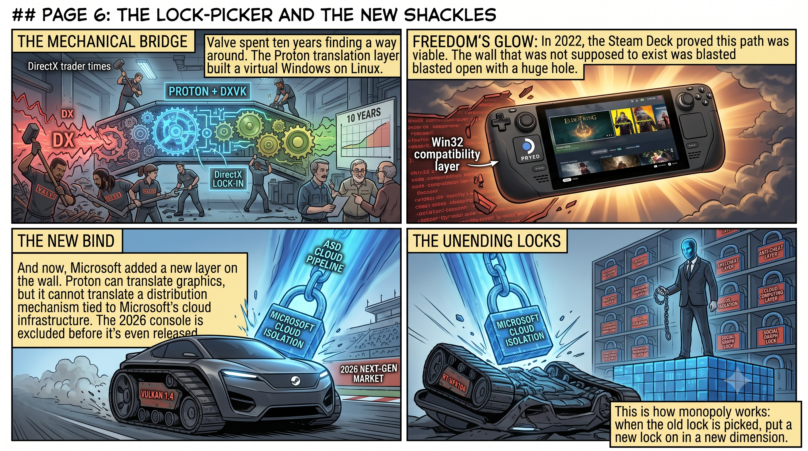

---

## VII. The Causal Chain

Connect the threads —

In 1994, Microsoft used DirectX to lock in PC game developers, and Windows became the only platform for gaming. It worked for thirty years.

But the success was too thorough, and its side effects became visible a decade later: Windows grew ever more closed, and those who needed freedom — researchers, AI scientists — all migrated to Linux. AI's entire ecosystem grew in soil that Microsoft couldn't reach.

In 2015, Valve tried to break this monopoly with the Steam Machine. DirectX's ecosystem lock-in suffocated it. Valve spent ten years building a translation layer, and in 2022 proved with the Steam Deck that Linux could run Windows games. Microsoft's response was not openness, but a new lock on the shader distribution layer — ASD. When the old lock is picked, swap in a new one.

Microsoft realised it had no roots in the AI era, so it threw a hundred billion dollars at building AI infrastructure while dismantling Xbox to redirect resources.

With Xbox dismantled, what Microsoft lost was not just its consumer base — it lost the only operating system platform unburdened by Windows' legacy baggage. It tried to use software lock-ins like ASD to maintain control over PC gaming — but the target of the lock-in is the Windows Store, a platform with negligible market share compared to Steam.

Meanwhile, Google has search and Android, Meta has social networks, Apple has the iPhone — all are developing their own chips to route around NVIDIA, all have their own consumer entry points. What does Microsoft have? A cloud service that runs Linux underneath, an OpenAI that could go independent at any moment, a hollowed-out gaming division, and a Windows burdened with thirty years of legacy baggage — it once had a chance to start fresh with Xbox OS, but that door was shut by its own hand.

**DirectX locked others in for thirty years. Thirty years later, it locked Microsoft itself into an ever-shrinking room. And Microsoft's response is to install ever more exquisite locks inside that ever-shrinking room.**

ASD is not new technology. It is the latest act of a thirty-year-old playbook — first attract users with convenience, then bind developers with lock-in, and finally turn around and lock in consumers. Only this time, fewer and fewer people are being locked in, and the cost of the lock is higher and higher.

Microsoft won't collapse. It's too big. But it is sliding from "the front-runner of the AI era" towards "the infrastructure supplier of the AI era" — running compute for others, capturing none of the end-user value itself. From landlord to property manager, and from property manager to plumber.

And the starting point of it all is something it never learned from day one: **treat games as the end, not the means. Treat players as customers, not as bargaining chips.**

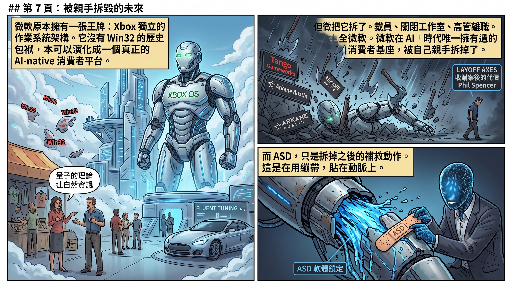
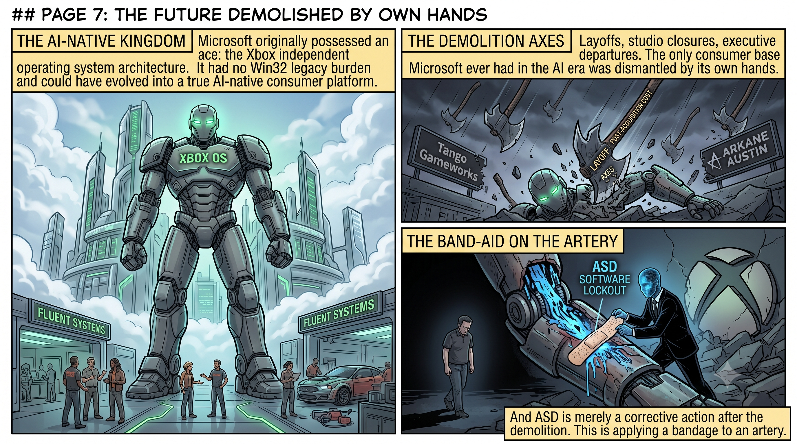

---

## Afterword

This causal chain from DirectX to ASD is but one thread in a forty-year covert war for technological hegemony. Where did NVIDIA's CUDA monopoly come from? Why did TSMC become the world's sole arsenal? How did Valve erect a virtual Windows on Linux? Why does Nintendo keep making games when everyone else is dismantling them?

The answers to these questions are in *Game Victory — From Pixels to AI, How Entertainment Secretly Reshaped Global Tech Hegemony*.

Every thread begins with a reality you took for granted, then rewinds to the decision thirty years ago that set everything on an irreversible course.

The bill hasn't been settled. The interest is still compounding.

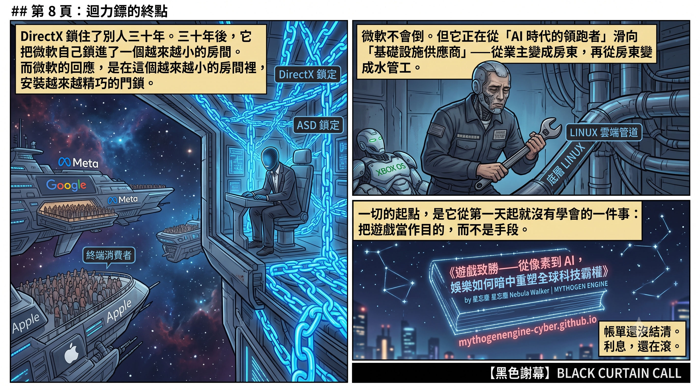
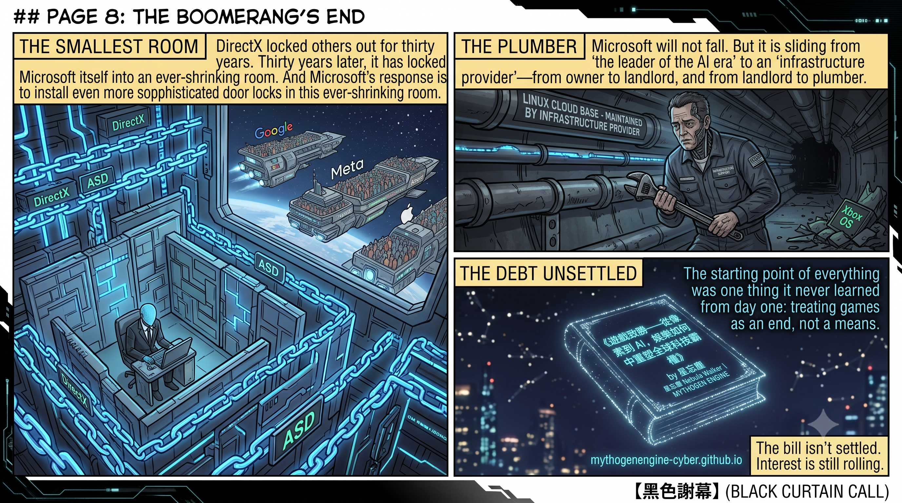

---

_Written by Nebula Walker｜MYTHOGEN ENGINE https://mythogenengine.com/
